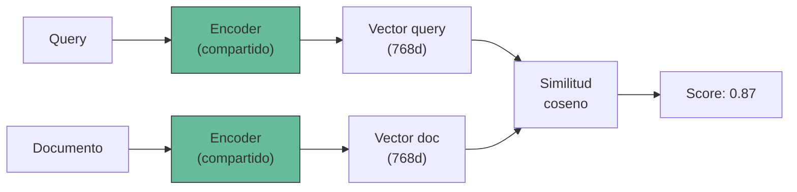
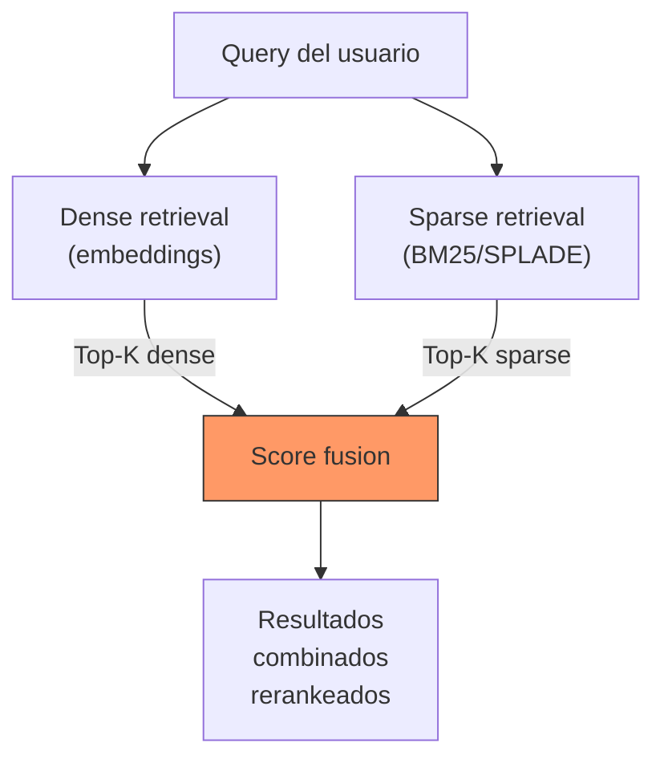
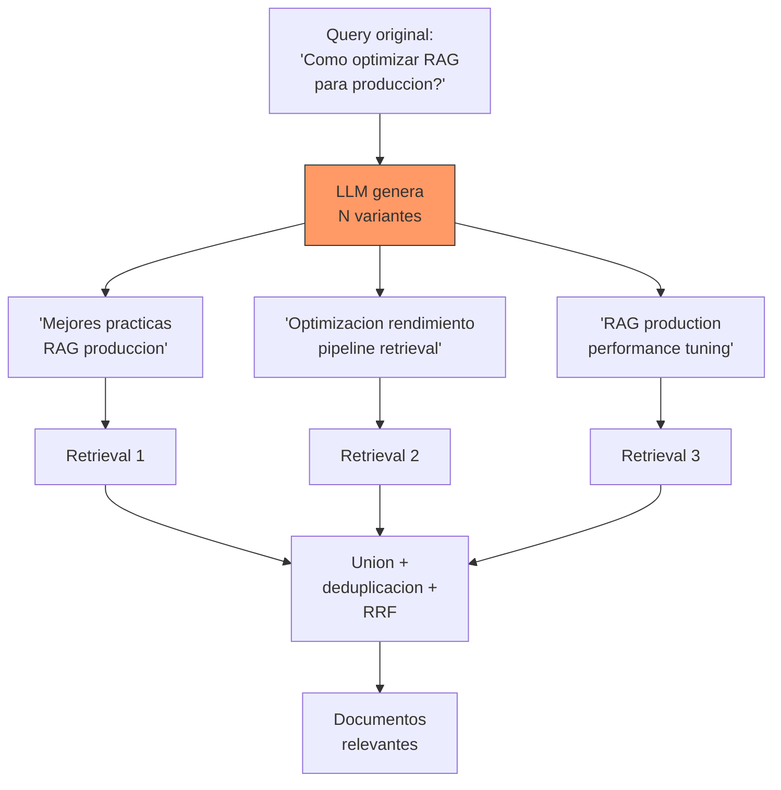
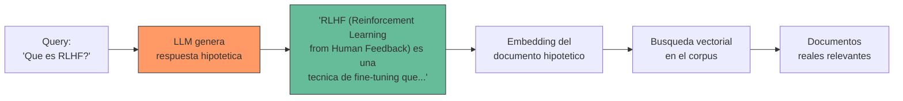
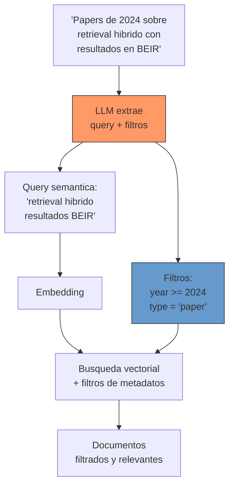
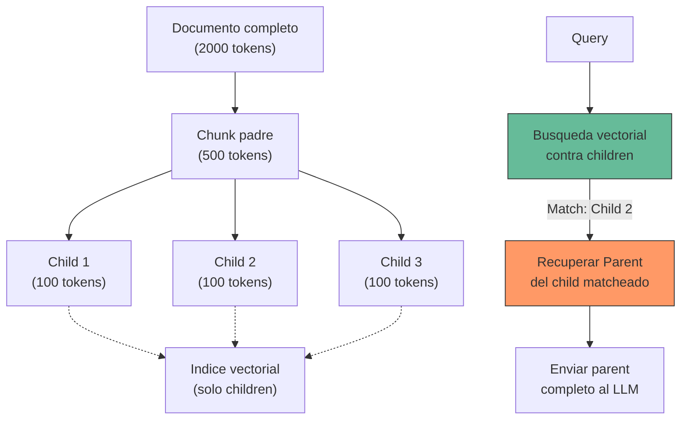
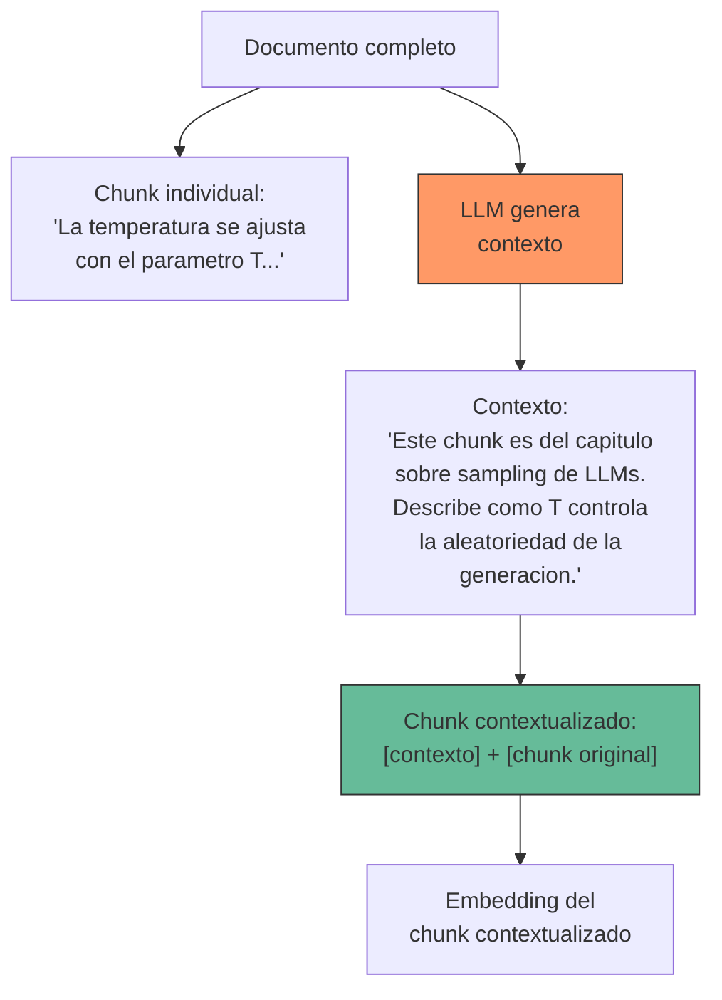

---
tags:
  - tecnica
  - rag
  - retrieval
  - estrategias
aliases:
  - estrategias de retrieval
  - estrategias de recuperacion
  - retrieval methods
  - busqueda semantica
created: 2025-06-01
updated: 2025-06-01
category: tecnicas-retrieval
status: evergreen
difficulty: advanced
related:
  - "[[embeddings]]"
  - "[[vector-databases]]"
  - "[[indexing-strategies]]"
  - "[[reranking]]"
  - "[[advanced-rag]]"
  - "[[chunking-strategies]]"
  - "[[pattern-rag]]"
  - "[[hallucinations]]"
up: "[[moc-rag-retrieval]]"
---

# Estrategias de retrieval

> [!abstract] Resumen
> Las *retrieval strategies* definen como se recuperan documentos relevantes de un corpus para alimentar al LLM en un sistema RAG. ==No existe una estrategia universal: la eleccion depende del tipo de consultas, el dominio, la calidad de los datos y los requisitos de latencia==. Este documento cubre desde retrieval denso y sparse basico hasta tecnicas avanzadas como HyDE, self-query, parent document retrieval y contextual retrieval de Anthropic, con una guia comparativa para elegir la estrategia adecuada. ^resumen

## Que es y por que importa

El *retrieval* es la fase del pipeline [[pattern-rag|RAG]] donde se buscan y extraen los fragmentos de informacion mas relevantes para una consulta del usuario. ==La calidad del retrieval determina el techo de calidad de todo el sistema==: si los documentos correctos no se recuperan, el LLM no puede generar una respuesta correcta, sin importar lo capaz que sea.

El desafio fundamental: la consulta del usuario y los documentos relevantes pueden expresar la misma idea de formas completamente distintas. "Como reducir el coste de inferencia" y un documento que habla de "quantizacion de modelos para optimizar recursos computacionales" son semanticamente equivalentes pero lexicamente disjuntos.

> [!tip] Principio clave del retrieval
> ==Retrieval es un problema de recall, no de precision==. Es mejor recuperar 20 documentos de los cuales 15 son relevantes (y luego filtrar con [[reranking]]) que recuperar solo 5 muy precisos pero perder informacion critica. El LLM tolera bien el ruido; lo que no tolera es la ausencia de informacion.

---

## Dense retrieval

El *dense retrieval* utiliza [[embeddings]] para representar consultas y documentos como vectores densos en un espacio continuo, y busca por similitud vectorial (tipicamente coseno o producto punto).

### Arquitectura: bi-encoder

El *bi-encoder* codifica query y documento independientemente con el mismo modelo (o modelos separados), produciendo vectores que se comparan con una metrica de distancia.



**Ventaja clave**: los documentos se codifican offline una sola vez y se almacenan en una [[vector-databases|base de datos vectorial]]. En tiempo de consulta, solo se codifica la query y se busca por ANN. ==Esto permite buscar en millones de documentos en milisegundos==.

**Limitacion**: la interaccion query-documento se reduce a un unico numero (el score de similitud). No hay atencion cruzada entre tokens de la query y del documento, lo que limita la precision para consultas complejas.

> [!info] Modelos populares de dense retrieval
> - **OpenAI** `text-embedding-3-large`: 3072 dims, excelente calidad general
> - **Cohere** `embed-v4`: optimizado para retrieval multilingue
> - **BGE-M3**: open-source, 100+ idiomas, multimodal (dense + sparse + ColBERT)
> - **GTE-Qwen2-7B**: lider en MTEB, 7B parametros, alta calidad
> - Ver [[embeddings#modelos-de-embedding-modernos|comparativa de modelos]] para mas detalles

---

## Sparse retrieval

El *sparse retrieval* utiliza representaciones sparse (la mayoria de dimensiones son cero) basadas en frecuencia de terminos. ==BM25 sigue siendo sorprendentemente competitivo en 2025==, especialmente para consultas con terminos tecnicos especificos.

### BM25

*BM25* (*Best Matching 25*) es la funcion de ranking estandar de la industria para busqueda lexica[^1]. Puntua documentos basandose en la frecuencia del termino (TF), la frecuencia inversa del documento (IDF) y la longitud del documento.

$$\text{BM25}(q, d) = \sum_{t \in q} \text{IDF}(t) \cdot \frac{f(t,d) \cdot (k_1 + 1)}{f(t,d) + k_1 \cdot (1 - b + b \cdot \frac{|d|}{avgdl})}$$

> [!tip] Cuando BM25 supera a dense retrieval
> - Consultas con ==terminos tecnicos especificos==: "CUDA_OUT_OF_MEMORY", "segfault", nombres de funciones
> - Busqueda de entidades con nombres propios: "Claude 3.5 Sonnet"
> - Documentacion tecnica con vocabulario preciso
> - Cuando el corpus es pequeno (<10K docs) y los embeddings no tienen suficientes datos para generalizar

### SPLADE y learned sparse

*SPLADE* (*Sparse Lexical and Expansion*)[^2] aprende representaciones sparse usando un modelo transformer, combinando las ventajas de BM25 (interpretabilidad, matching exacto) con expansion de terminos aprendida.

A diferencia de BM25, SPLADE puede ==asignar peso a terminos que no aparecen explicitamente en el documento pero son semanticamente relevantes== (expansion implicita). Esto cierra parcialmente la brecha con dense retrieval.

---

## Busqueda hibrida

La *hybrid retrieval* combina dense y sparse retrieval para obtener lo mejor de ambos mundos: ==comprension semantica del dense + precision lexica del sparse==.



### Metodos de fusion

#### Reciprocal Rank Fusion (RRF)

*RRF* combina rankings sin depender de los scores absolutos (que pueden no ser comparables entre sistemas)[^3]:

$$\text{RRF}(d) = \sum_{r \in R} \frac{1}{k + r(d)}$$

Donde $r(d)$ es la posicion del documento $d$ en el ranking $r$, y $k$ es una constante (tipicamente 60).

==RRF es simple, robusto y no requiere tuning de pesos==. Es el metodo de fusion por defecto en la mayoria de implementaciones.

#### Combinacion lineal con pesos

$$\text{score}(d) = \alpha \cdot \text{dense\_score}(d) + (1 - \alpha) \cdot \text{sparse\_score}(d)$$

Requiere normalizar los scores a un rango comun (e.g., [0, 1]) y tunear $\alpha$. Tipicamente $\alpha \in [0.5, 0.8]$, dando mas peso al dense retrieval.

> [!warning] Normalizar antes de combinar
> Los scores de dense retrieval (similitud coseno: [-1, 1]) y sparse retrieval (BM25: [0, +inf)) ==no son directamente comparables==. Siempre normalizar a [0, 1] usando min-max o score distribution normalization antes de combinar linealmente.

---

## Multi-query retrieval

El *multi-query retrieval* genera multiples variantes de la query original y ejecuta busquedas independientes para cada una, combinando los resultados. ==Mitiga el problema de que una sola formulacion de la query puede no capturar todos los aspectos de la necesidad de informacion==.



> [!example]- Prompt para generacion de multi-query
> ```python
> MULTI_QUERY_PROMPT = """Tu tarea es generar {n} versiones diferentes de
> la siguiente pregunta del usuario para mejorar la recuperacion de
> documentos relevantes. Cada version debe capturar un aspecto o
> formulacion distinta de la misma necesidad de informacion.
>
> Pregunta original: {query}
>
> Genera {n} preguntas alternativas, una por linea, sin numerar:"""
>
> def multi_query_retrieval(query: str, retriever, llm, n_queries: int = 3, k: int = 10):
>     """Retrieval con multiples variantes de la query."""
>     # Generar variantes
>     response = llm.generate(MULTI_QUERY_PROMPT.format(query=query, n=n_queries))
>     queries = [query] + response.strip().split("\n")[:n_queries]
>
>     # Buscar con cada variante
>     all_docs = {}
>     for q in queries:
>         results = retriever.search(q, k=k)
>         for doc, score in results:
>             if doc.id not in all_docs:
>                 all_docs[doc.id] = {"doc": doc, "ranks": []}
>             all_docs[doc.id]["ranks"].append(score)
>
>     # RRF fusion
>     rrf_scores = {}
>     for doc_id, data in all_docs.items():
>         rrf_scores[doc_id] = sum(1 / (60 + i) for i in range(len(data["ranks"])))
>
>     # Ordenar por score RRF
>     sorted_docs = sorted(rrf_scores.items(), key=lambda x: x[1], reverse=True)
>     return [(all_docs[doc_id]["doc"], score) for doc_id, score in sorted_docs[:k]]
> ```

---

## HyDE (Hypothetical Document Embeddings)

*HyDE* (*Hypothetical Document Embeddings*)[^4] es una tecnica contraintuitiva: en lugar de buscar con el embedding de la query, ==genera un documento hipotetico que responderia a la query y busca con el embedding de ese documento==.



**Intuicion**: la query "Que es RLHF?" y un documento sobre RLHF comparten poco vocabulario. Pero un documento hipotetico generado por el LLM si compartira vocabulario, estructura y terminologia con documentos reales del corpus. ==El embedding del documento hipotetico esta mas cerca de los documentos relevantes que el embedding de la query original==.

> [!success] Cuando HyDE funciona bien
> - Queries cortas y ambiguas que producen embeddings de baja calidad
> - Dominios donde la terminologia del usuario difiere de la del corpus
> - ==Mejora tipica de 5-15% en recall== sobre dense retrieval directo

> [!failure] Cuando HyDE falla
> - El LLM genera un documento hipotetico incorrecto (hallucination) que ==aleja la busqueda de los documentos relevantes==
> - Queries muy especificas donde el embedding de la query ya es preciso
> - Anadir latencia de una llamada LLM adicional puede ser inaceptable
> - No funciona bien si el LLM no tiene conocimiento del dominio

---

## Step-back prompting para retrieval

El *step-back prompting*[^5] abstrae la query a un nivel mas general antes de buscar. En lugar de buscar directamente con una pregunta especifica, primero genera una pregunta mas amplia que capture el contexto necesario.

| Query original | Step-back query | Por que funciona |
|---|---|---|
| "Error al usar M=64 en HNSW con Qdrant" | "Como configurar parametros HNSW en bases vectoriales" | Recupera documentacion general que cubre el caso especifico |
| "Mi pipeline RAG tarda 5s por query" | "Optimizacion de latencia en sistemas RAG" | ==Encuentra multiples causas posibles==, no solo una |
| "Diferencia entre ef_search 100 y 200" | "Impacto de parametros de busqueda en HNSW" | Contexto mas amplio para entender el trade-off |

---

## Self-query retrieval

El *self-query retrieval* usa el LLM para descomponer una consulta en lenguaje natural en: (1) una query semantica y (2) filtros estructurados sobre metadatos.



> [!tip] Requisitos para self-query
> - Los documentos deben tener ==metadatos ricos y consistentes== (fecha, tipo, autor, categoria)
> - La [[vector-databases|base de datos vectorial]] debe soportar filtrado eficiente (ver [[indexing-strategies#busqueda-filtrada|busqueda filtrada]])
> - El LLM necesita un schema claro de los campos filtrables disponibles

---

## Parent document retrieval

El *parent document retrieval* resuelve un dilema fundamental: ==los chunks pequenos producen mejores embeddings, pero los chunks grandes dan mejor contexto al LLM==.

La solucion: indexar chunks pequenos (child) para el retrieval, pero devolver el documento padre (parent) mas amplio al LLM.



> [!warning] Trade-offs del parent document retrieval
> - ==Mas contexto para el LLM pero mas tokens consumidos== (y mas coste)
> - Si multiples children del mismo parent hacen match, el parent se recupera una sola vez (deduplicacion necesaria)
> - Requiere almacenar la relacion child-parent en metadatos

---

## Contextual retrieval (Anthropic)

El *contextual retrieval*[^6] es un enfoque propuesto por Anthropic que ==anade contexto explicativo a cada chunk antes de generar su embedding==. En lugar de embedear un chunk aislado, se le prepend un resumen contextual que situa el chunk dentro del documento original.



> [!success] Resultados reportados por Anthropic
> - ==Reduccion de hasta 49% en retrieval failures== cuando se combina con BM25 y embeddings
> - ==67% de reduccion en failures== cuando se combina con reranking
> - Especialmente efectivo para chunks que son ambiguos fuera de contexto

> [!danger] Coste del contextual retrieval
> Generar el contexto requiere ==una llamada LLM por cada chunk del corpus==. Para un corpus de 100K chunks, esto puede costar $50-500 dependiendo del modelo. Es una inversion upfront que se amortiza con mejor calidad de retrieval.

---

## Multi-vector retrieval

El *multi-vector retrieval* genera multiples embeddings por documento, cada uno capturando un aspecto diferente: resumen, contenido completo, preguntas hipoteticas que el documento responde, etc.

| Vector | Que captura | Cuando matchea |
|---|---|---|
| Embedding del contenido | Semantica literal | Queries que usan terminologia similar |
| Embedding del resumen | Idea principal | ==Queries conceptuales amplias== |
| Embedding de preguntas | Intento del usuario | ==Queries formuladas como preguntas== |
| Embedding del titulo | Tema general | Busquedas exploratorias |

> [!example]- Implementacion de multi-vector retrieval
> ```python
> from dataclasses import dataclass
> from typing import List
>
> @dataclass
> class MultiVectorDocument:
>     doc_id: str
>     content: str
>     metadata: dict
>     content_embedding: List[float]    # Embedding del contenido
>     summary_embedding: List[float]    # Embedding del resumen
>     questions_embeddings: List[List[float]]  # Embeddings de preguntas hipoteticas
>
> def create_multi_vector_doc(doc: str, llm, embed_model) -> MultiVectorDocument:
>     """Genera multiples representaciones vectoriales de un documento."""
>     # 1. Embedding directo del contenido
>     content_emb = embed_model.encode(doc)
>
>     # 2. Generar y embedear resumen
>     summary = llm.generate(f"Resume en 2 oraciones:\n{doc}")
>     summary_emb = embed_model.encode(summary)
>
>     # 3. Generar preguntas hipoteticas
>     questions = llm.generate(
>         f"Genera 3 preguntas que este texto responde:\n{doc}"
>     ).split("\n")
>     question_embs = [embed_model.encode(q) for q in questions]
>
>     return MultiVectorDocument(
>         doc_id=generate_id(doc),
>         content=doc,
>         metadata={"summary": summary, "questions": questions},
>         content_embedding=content_emb,
>         summary_embedding=summary_emb,
>         questions_embeddings=question_embs,
>     )
>
> def search_multi_vector(query: str, collections, embed_model, k: int = 10):
>     """Busca en todas las colecciones de vectores y fusiona."""
>     query_emb = embed_model.encode(query)
>     all_results = {}
>
>     for collection_name, collection in collections.items():
>         results = collection.search(query_emb, k=k)
>         for doc_id, score, rank in results:
>             if doc_id not in all_results:
>                 all_results[doc_id] = []
>             all_results[doc_id].append(rank)
>
>     # RRF fusion
>     rrf = {doc_id: sum(1/(60+r) for r in ranks)
>            for doc_id, ranks in all_results.items()}
>     return sorted(rrf.items(), key=lambda x: x[1], reverse=True)[:k]
> ```

---

## Tabla comparativa de estrategias

| Estrategia | Complejidad | Mejora tipica | Latencia extra | Cuando usar |
|---|---|---|---|---|
| **Dense** (baseline) | Baja | Baseline | Baseline | Siempre como base |
| **Sparse** (BM25) | Baja | -5% a +10% | Baja | Terminos tecnicos, keywords |
| **Hibrido** | Media | ==+5-15%== | Baja | ==Recomendado por defecto== |
| **Multi-query** | Media | +5-10% | +1 LLM call | Queries ambiguas |
| **HyDE** | Media | +5-15% | +1 LLM call | Queries cortas, gap vocabulario |
| **Step-back** | Media | +5-10% | +1 LLM call | Queries muy especificas |
| **Self-query** | Media | +10-20% | +1 LLM call | Metadatos ricos disponibles |
| **Parent document** | Media | +10-15% | Baja | Chunks pequenos, contexto necesario |
| **Contextual** | Alta (prep) | ==+20-49%== | Baja (runtime) | Corpus ambiguo, alta calidad requerida |
| **Multi-vector** | Alta (prep) | +10-20% | Baja (runtime) | Documentos complejos, multifaceticos |

^tabla-comparativa-retrieval

> [!question] Debate: cual es la estrategia optima
> No hay respuesta universal. Mi recomendacion pragmatica:
> 1. ==Empezar con hibrido (dense + BM25)==
> 2. Anadir [[reranking]] (mejora garantizada con bajo esfuerzo)
> 3. Si el recall sigue bajo, probar contextual retrieval o multi-query
> 4. Evaluar con datos reales antes de cada cambio

---

## Relación con el ecosistema

> [!info] Conexiones con mis herramientas
> - **[[intake-overview|intake]]**: intake debe soportar la generacion de multiples representaciones por documento (multi-vector, contextual chunks) como parte del pipeline de ingestion. Los 12+ parsers de intake producen texto normalizado que luego se procesa con la estrategia de retrieval elegida.
> - **[[architect-overview|architect]]**: architect puede generar el codigo completo del pipeline de retrieval, incluyendo la logica de fusion hibrida, multi-query generation prompts, y HyDE pipelines. Sus YAML pipelines permiten definir la estrategia de retrieval declarativamente.
> - **[[vigil-overview|vigil]]**: vigil debe monitorizar que las estrategias de retrieval no introduzcan vulnerabilidades de prompt injection indirecta: un documento malicioso en el corpus podria ser recuperado y manipular la respuesta del LLM.
> - **[[licit-overview|licit]]**: licit verifica que las estrategias de retrieval cumplan con principios de transparencia (EU AI Act): ==el usuario debe poder entender por que se recuperaron ciertos documentos y no otros==, lo que favorece estrategias con scores interpretables como BM25.

---

## Enlaces y referencias

**Notas relacionadas:**
- [[embeddings]] -- Representaciones vectoriales usadas en dense retrieval
- [[vector-databases]] -- Donde se almacenan y consultan los vectores
- [[indexing-strategies]] -- Como se indexan los vectores para busqueda eficiente
- [[reranking]] -- Post-procesamiento de resultados de retrieval
- [[advanced-rag]] -- Frameworks avanzados que orquestan estas estrategias
- [[chunking-strategies]] -- La granularidad de chunks afecta cada estrategia
- [[pattern-rag]] -- El patron arquitectonico que engloba estas tecnicas
- [[hallucinations]] -- El retrieval deficiente causa hallucinations

> [!quote]- Referencias bibliograficas
> - Robertson, S. & Zaragoza, H. "The Probabilistic Relevance Framework: BM25 and Beyond", Foundations and Trends in IR, 2009
> - Formal, T. et al. "SPLADE: Sparse Lexical and Expansion Model for First Stage Ranking", SIGIR 2021
> - Cormack, G. et al. "Reciprocal Rank Fusion outperforms Condorcet and individual Rank Learning Methods", SIGIR 2009
> - Gao, L. et al. "Precise Zero-Shot Dense Retrieval without Relevance Labels" (HyDE), ACL 2023
> - Zheng, H. et al. "Take a Step Back: Evoking Reasoning via Abstraction in Large Language Models", ICLR 2024
> - Anthropic, "Introducing Contextual Retrieval", Blog 2024
> - LangChain Documentation, "Multi-Query Retriever", 2024

[^1]: Robertson & Zaragoza, "The Probabilistic Relevance Framework: BM25 and Beyond", 2009. El framework teorico detras de BM25.
[^2]: Formal et al., "SPLADE: Sparse Lexical and Expansion Model for First Stage Ranking", SIGIR 2021. Representaciones sparse aprendidas.
[^3]: Cormack et al., "Reciprocal Rank Fusion outperforms Condorcet and individual Rank Learning Methods", SIGIR 2009. Paper original de RRF.
[^4]: Gao et al., "Precise Zero-Shot Dense Retrieval without Relevance Labels", ACL 2023. Paper original de HyDE.
[^5]: Zheng et al., "Take a Step Back: Evoking Reasoning via Abstraction in Large Language Models", ICLR 2024. Step-back prompting.
[^6]: Anthropic, "Introducing Contextual Retrieval", 2024. La tecnica de contextual retrieval con resultados detallados.
