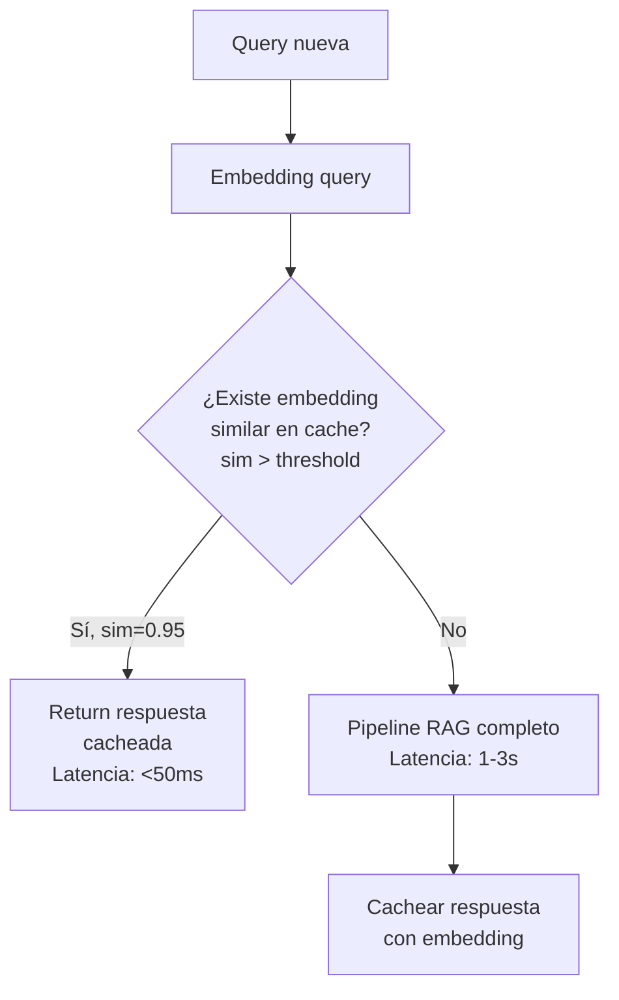
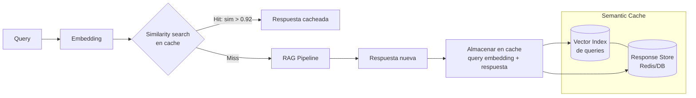
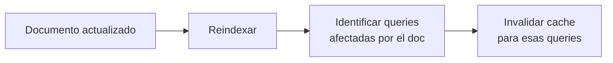

# Semantic Caching para RAG

> [!abstract] Resumen
> El *semantic caching* reutiliza respuestas para queries ==semánticamente similares==, no solo idénticas. "¿Cuál es la tasa de interés?" y "¿A cuánto está el tipo de interés?" producen la misma respuesta cacheada. Reduce costes de LLM un ==50-80%== y latencia un 90%+. Este documento cubre cómo funciona, implementación, estrategias de invalidación, GPTCache, y riesgos.
> ^resumen

---

## Por qué semantic caching

### El problema del cache exacto

El cache exacto (hash de query) tiene una ==hit rate muy baja== porque los usuarios formulan la misma pregunta de formas diferentes:

```
"¿Cuál es la tasa de interés?"
"¿A cuánto está el tipo de interés actual?"
"Tasa de interés vigente"
"Interest rate actual"
"¿Qué tasa aplica actualmente?"
```

Estas 5 queries ==buscan la misma información== pero un cache exacto las trata como 5 queries diferentes.

### Semantic cache resuelve esto



---

## Cómo funciona

### Arquitectura



### Parámetros clave

| Parámetro | Descripción | Rango | Recomendación |
|---|---|---|---|
| *Similarity threshold* | Mínima similitud para hit | 0.85-0.98 | ==0.92-0.95== |
| *TTL* (Time To Live) | Duración del cache | 1h-30d | Depende de la frescura de datos |
| *Max cache size* | Límite de entries | 10K-1M | Según memoria disponible |
| *Eviction policy* | Qué eliminar cuando lleno | LRU, LFU, TTL | ==LRU + TTL== |

> [!warning] El threshold es crítico
> - **Threshold muy bajo (0.85)**: Alto hit rate pero ==riesgo de respuestas incorrectas== (queries similares pero con intención diferente)
> - **Threshold muy alto (0.98)**: Bajo hit rate, casi como cache exacto
> - ==0.92-0.95== es el sweet spot para la mayoría de casos

---

## Implementación

> [!example]- Código: Semantic Cache desde cero
> ```python
> import numpy as np
> import json
> import time
> import hashlib
> from typing import Optional, Tuple
> from dataclasses import dataclass
>
> @dataclass
> class CacheEntry:
>     query: str
>     query_embedding: np.ndarray
>     response: str
>     metadata: dict
>     created_at: float
>     ttl: float
>
> class SemanticCache:
>     def __init__(
>         self,
>         embedding_model,
>         similarity_threshold: float = 0.93,
>         default_ttl: float = 86400,  # 24 horas
>         max_entries: int = 100000,
>     ):
>         self.model = embedding_model
>         self.threshold = similarity_threshold
>         self.default_ttl = default_ttl
>         self.max_entries = max_entries
>         self.entries: list[CacheEntry] = []
>         self.embeddings: Optional[np.ndarray] = None
>
>     def get(self, query: str) -> Optional[str]:
>         """Busca respuesta cacheada semánticamente."""
>         if not self.entries:
>             return None
>
>         query_emb = self.model.encode(
>             [query], normalize_embeddings=True
>         )[0]
>
>         # Calcular similitudes
>         similarities = np.dot(self.embeddings, query_emb)
>         best_idx = np.argmax(similarities)
>         best_sim = similarities[best_idx]
>
>         if best_sim >= self.threshold:
>             entry = self.entries[best_idx]
>             # Verificar TTL
>             if time.time() - entry.created_at < entry.ttl:
>                 return entry.response
>             else:
>                 self._remove(best_idx)
>                 return None
>
>         return None
>
>     def put(
>         self, query: str, response: str,
>         ttl: Optional[float] = None,
>         metadata: Optional[dict] = None,
>     ):
>         """Almacena respuesta en cache."""
>         query_emb = self.model.encode(
>             [query], normalize_embeddings=True
>         )[0]
>
>         entry = CacheEntry(
>             query=query,
>             query_embedding=query_emb,
>             response=response,
>             metadata=metadata or {},
>             created_at=time.time(),
>             ttl=ttl or self.default_ttl,
>         )
>
>         self.entries.append(entry)
>         if self.embeddings is None:
>             self.embeddings = query_emb.reshape(1, -1)
>         else:
>             self.embeddings = np.vstack(
>                 [self.embeddings, query_emb]
>             )
>
>         # Eviction LRU si excede max
>         if len(self.entries) > self.max_entries:
>             self._remove(0)  # Remove oldest
>
>     def _remove(self, idx: int):
>         """Elimina una entrada del cache."""
>         self.entries.pop(idx)
>         self.embeddings = np.delete(
>             self.embeddings, idx, axis=0
>         )
>
>     def invalidate(self, pattern: Optional[str] = None):
>         """Invalida entries que matchean un patrón."""
>         if pattern is None:
>             self.entries.clear()
>             self.embeddings = None
>             return
>
>         to_remove = [
>             i for i, e in enumerate(self.entries)
>             if pattern.lower() in e.query.lower()
>         ]
>         for idx in reversed(to_remove):
>             self._remove(idx)
>
>     @property
>     def stats(self) -> dict:
>         return {
>             "entries": len(self.entries),
>             "memory_mb": (
>                 self.embeddings.nbytes / 1e6
>                 if self.embeddings is not None else 0
>             ),
>         }
> ```

---

## GPTCache

*GPTCache*[^1] es la librería open-source más popular para semantic caching de LLMs:

```python
from gptcache import Cache
from gptcache.adapter import openai
from gptcache.embedding import Onnx
from gptcache.manager import CacheBase, VectorBase
from gptcache.similarity_evaluation.distance import (
    SearchDistanceEvaluation,
)

# Inicializar cache
cache = Cache()
onnx = Onnx()
cache_base = CacheBase("sqlite")
vector_base = VectorBase(
    "faiss", dimension=onnx.dimension
)

cache.init(
    embedding_func=onnx.to_embeddings,
    data_manager=manager_factory(
        "sqlite", "faiss", dimension=onnx.dimension
    ),
    similarity_evaluation=SearchDistanceEvaluation(),
)
cache.set_openai_key()

# Usar con OpenAI — transparente
response = openai.ChatCompletion.create(
    model="gpt-4o",
    messages=[{"role": "user", "content": "¿Cuál es la tasa?"}],
)
# Segunda vez con query similar: respuesta desde cache
```

### Features de GPTCache

| Feature | Descripción |
|---|---|
| Adaptadores | OpenAI, LangChain, LlamaIndex |
| Embeddings | ONNX, OpenAI, Hugging Face, SentenceTransformers |
| Storage | SQLite, MySQL, PostgreSQL |
| Vector index | FAISS, Milvus, Chromadb |
| Evaluación | Distancia coseno, ONNX CrossEncoder |

---

## Estrategias de invalidación

> [!danger] El cache stale es peor que no tener cache
> Una respuesta cacheada ==obsoleta== puede dar información incorrecta sin que el usuario lo sepa. La invalidación es el problema más difícil del caching.

| Estrategia | Cuándo invalida | Pros | Contras |
|---|---|---|---|
| TTL (Time To Live) | Tras N horas/días | ==Simple, predecible== | Puede ser stale antes del TTL |
| Event-driven | Cuando cambia el documento fuente | ==Inmediata== | Requiere tracking de dependencias |
| Versioned | Cuando cambia la versión del índice | Alineada con reindexación | Invalida todo |
| Hybrid (TTL + event) | El primero que ocurra | ==Mejor balance== | Más compleja |

### Invalidación event-driven



> [!tip] Implementación práctica
> Almacena los IDs de documentos usados para generar cada respuesta cacheada. Cuando un documento cambia, ==invalida todas las entries que dependían de ese documento==.

---

## Análisis de ahorro

### Escenario: 1000 queries/día con GPT-4o

| Sin cache | Con cache (60% hit rate) |
|---|---|
| 1000 queries × $0.05 = $50/día | 400 queries × $0.05 = $20/día |
| $1,500/mes | ==$600/mes== |
| Latencia: ~2s media | Latencia: ==~0.5s media== |

### Hit rate esperado por tipo de aplicación

| Aplicación | Hit rate esperado | Ahorro mensual |
|---|---|---|
| FAQ bot (queries repetitivas) | ==70-90%== | ==70-90%== |
| Soporte técnico | 50-70% | 50-70% |
| Análisis de documentos (queries únicas) | 10-30% | 10-30% |
| Chat open-ended | 5-15% | 5-15% |

> [!question] ¿Cuándo NO vale la pena?
> - Aplicaciones con queries muy únicas (análisis ad-hoc)
> - Datos que cambian cada hora (invalidación constante)
> - Cuando el coste de infraestructura del cache > ahorro en LLM
> - ==Cache hit rate < 15%== generalmente no justifica la complejidad

---

## Riesgos del semantic caching

> [!failure] Riesgos a mitigar

1. **Respuestas obsoletas**: Datos cambiaron pero el cache no se invalidó
2. **False positives**: Queries similares pero con intención diferente → respuesta incorrecta
3. **PII en cache**: Respuestas con datos personales quedan cacheadas
4. **Multi-tenancy leaks**: Respuesta de tenant A servida a tenant B
5. **Bias amplificado**: Un error cacheado se sirve a muchos usuarios

### Mitigaciones

| Riesgo | Mitigación |
|---|---|
| Datos obsoletos | ==TTL agresivo + event-driven invalidation== |
| False positives | Threshold alto (>0.93) + LLM validation |
| PII en cache | Filtrado PII pre-cache ([[pii-handling-rag]]) |
| Multi-tenancy | ==Cache separado por tenant (namespace)== |
| Bias amplificado | Monitoreo de hit rate por query type |

---

## Relación con el ecosistema

- **[[intake-overview|intake]]**: Cuando intake procesa nuevos documentos, debe ==triggear invalidación del semantic cache== para las queries que dependían de los documentos actualizados. El pipeline de 5 fases de intake puede incluir un paso de invalidación de cache.

- **[[architect-overview|architect]]**: El cost tracking de architect monitorea el ahorro real del semantic cache. Los dashboards de OpenTelemetry muestran hit rate, ahorro acumulado y latencia reducida.

- **[[vigil-overview|vigil]]**: Las queries cacheadas deben pasar por vigil ==antes de almacenarse== para evitar cachear respuestas a queries con prompt injection. Vigil filtra queries maliciosas que podrían envenenar el cache.

- **[[licit-overview|licit]]**: El semantic cache almacena queries y respuestas que pueden contener datos personales. Licit verifica que el cache cumple con GDPR: ==derecho al olvido aplicable al cache==, retención limitada (TTL), y aislamiento entre tenants.

---

## Enlaces y referencias

> [!quote]- Bibliografía
> - Bang, J., et al. "GPTCache: An Open-Source Semantic Cache for LLM Applications." arXiv 2023.[^1]
> - Redis Documentation. "Semantic Caching." https://redis.io/docs/latest/develop/interact/search-and-query/advanced-concepts/
> - [[rag-en-produccion]] — RAG en producción
> - [[rag-overview]] — Visión general
> - [[embedding-models]] — Embeddings para cache
> - [[vector-databases]] — Storage para cache vectorial

[^1]: Bang, J., et al. "GPTCache: An Open-Source Semantic Cache for LLM Applications." arXiv 2023.
