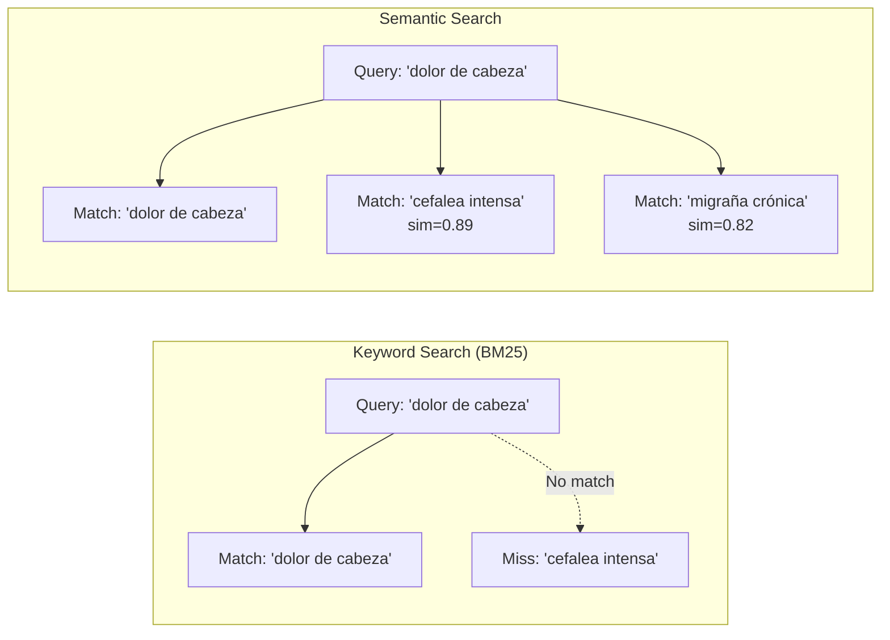
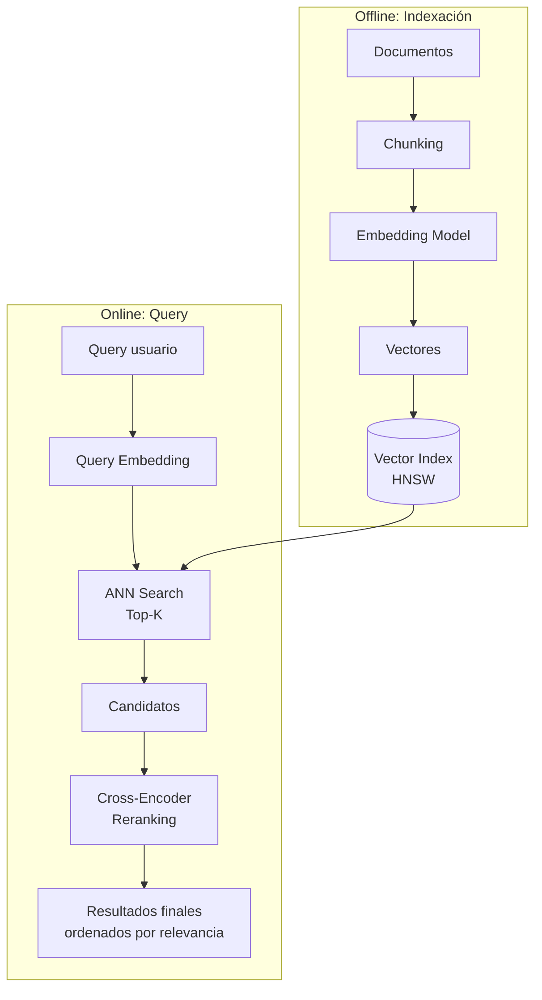
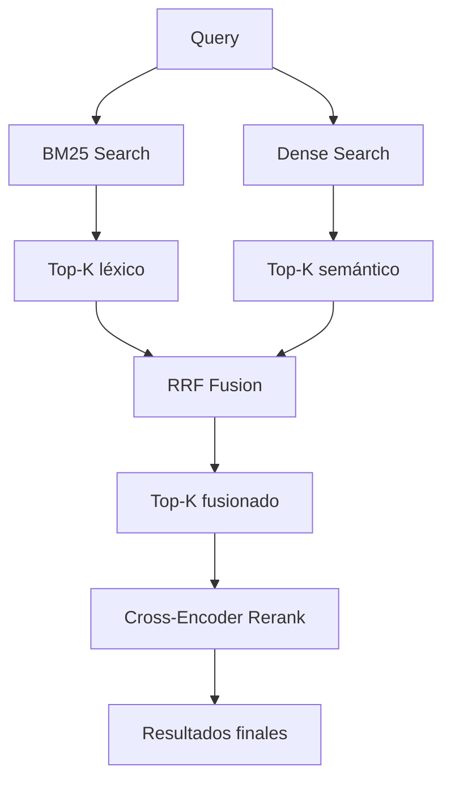

# Búsqueda Semántica End-to-End

> [!abstract] Resumen
> La búsqueda semántica (*semantic search*) encuentra documentos por ==significado, no por keywords==. A diferencia de BM25/TF-IDF, comprende sinónimos, paráfrasis y contexto. Este documento cubre el pipeline completo: encoding de query, búsqueda ANN, reranking, evaluación con métricas IR (MRR, NDCG, MAP), y la combinación híbrida con BM25.
> ^resumen

---

## Semantic Search vs Keyword Search



| Aspecto | Keyword (BM25) | Semantic | Hybrid |
|---|---|---|---|
| Sinónimos | No | ==Sí== | ==Sí== |
| Keywords exactos | ==Sí== | No (a veces) | ==Sí== |
| Entidades nombradas | ==Excelente== | Medio | ==Excelente== |
| Queries naturales | Medio | ==Excelente== | ==Excelente== |
| Multilingüe (cross-language) | No | ==Sí (con modelo multilingüe)== | Sí |
| Interpretabilidad | ==Alta (TF-IDF scores)== | Baja (vector opaco) | Media |
| Infraestructura | Índice invertido | ==Vector DB== | Ambos |

---

## Pipeline de búsqueda semántica



---

## Fase 1: Encoding de queries

### Bi-Encoder para búsqueda

```python
from sentence_transformers import SentenceTransformer

model = SentenceTransformer("BAAI/bge-base-en-v1.5")

# Query embedding
query = "¿Cuáles son los efectos secundarios de la aspirina?"
query_embedding = model.encode(
    query,
    normalize_embeddings=True,  # Para cosine similarity
)

# Document embeddings (offline)
documents = [
    "La aspirina puede causar irritación gástrica...",
    "El paracetamol es un analgésico alternativo...",
]
doc_embeddings = model.encode(
    documents,
    normalize_embeddings=True,
    batch_size=32,
    show_progress_bar=True,
)
```

> [!tip] Instrucciones de query
> Algunos modelos (BGE, E5) requieren un ==prefijo de instrucción== en la query:
> ```python
> # BGE
> query = "Represent this sentence for searching: " + query
> # E5
> query = "query: " + query
> document = "passage: " + document
> ```
> Sin el prefijo, la calidad degrada significativamente.

---

## Fase 2: Búsqueda ANN

La búsqueda *Approximate Nearest Neighbor* encuentra los vectores más cercanos al query vector. Ver [[indexing-strategies]] para detalles de algoritmos.

### Métricas de distancia

| Métrica | Fórmula | Cuándo usar |
|---|---|---|
| Cosine similarity | cos(q, d) = q·d / (‖q‖·‖d‖) | ==Estándar para texto== |
| Dot product (IP) | q·d | Vectores ya normalizados |
| L2 (Euclidean) | ‖q-d‖₂ | Menos común para texto |

> [!warning] Normalización importa
> Si usas cosine similarity, ==normaliza los vectores antes de indexar==. Con vectores normalizados, dot product = cosine similarity, lo que simplifica la implementación y mejora el rendimiento.

---

## Fase 3: Reranking

El [[reranking]] con *cross-encoder* es esencial para búsqueda semántica de alta calidad:

```python
from sentence_transformers import CrossEncoder

reranker = CrossEncoder("BAAI/bge-reranker-v2.5-gemma")

# Reranking: score cada par (query, documento)
pairs = [(query, doc) for doc in candidate_documents]
scores = reranker.predict(pairs)

# Reordenar por score
ranked_indices = scores.argsort()[::-1]
results = [candidate_documents[i] for i in ranked_indices[:5]]
```

> [!success] Impacto del reranking
> Bi-encoder retrieve (top-20) → Cross-encoder rerank (top-5):
> - ==NDCG@5 mejora 15-25%==
> - Latencia adicional: 50-150ms
> - El tradeoff es casi siempre favorable

---

## Hybrid Search: BM25 + Dense

La combinación de búsqueda léxica y semántica es ==superior a cualquiera por separado==:



> [!example]- Código: Hybrid Search completo
> ```python
> from rank_bm25 import BM25Okapi
> from qdrant_client import QdrantClient
> import numpy as np
>
> class HybridSearcher:
>     def __init__(
>         self,
>         documents: list[str],
>         embeddings: np.ndarray,
>         qdrant_url: str = "localhost",
>     ):
>         # BM25 index
>         tokenized = [doc.lower().split() for doc in documents]
>         self.bm25 = BM25Okapi(tokenized)
>         self.documents = documents
>
>         # Dense index
>         self.qdrant = QdrantClient(qdrant_url, port=6333)
>
>     def search(
>         self,
>         query: str,
>         query_embedding: np.ndarray,
>         k: int = 10,
>         alpha: float = 0.5,
>         rrf_k: int = 60,
>     ) -> list[dict]:
>         """Búsqueda híbrida BM25 + Dense con RRF."""
>         # BM25 retrieval
>         bm25_scores = self.bm25.get_scores(
>             query.lower().split()
>         )
>         bm25_top = bm25_scores.argsort()[-k*3:][::-1]
>
>         # Dense retrieval
>         dense_results = self.qdrant.search(
>             collection_name="docs",
>             query_vector=query_embedding.tolist(),
>             limit=k * 3,
>         )
>         dense_ranking = {
>             r.id: rank for rank, r in enumerate(dense_results)
>         }
>
>         # RRF Fusion
>         rrf_scores = {}
>         for rank, idx in enumerate(bm25_top):
>             rrf_scores[idx] = rrf_scores.get(idx, 0) + \
>                 (1-alpha) / (rrf_k + rank + 1)
>         for doc_id, rank in dense_ranking.items():
>             rrf_scores[doc_id] = rrf_scores.get(doc_id, 0) + \
>                 alpha / (rrf_k + rank + 1)
>
>         # Sort by RRF score
>         sorted_results = sorted(
>             rrf_scores.items(), key=lambda x: -x[1]
>         )[:k]
>
>         return [
>             {"id": doc_id, "score": score,
>              "text": self.documents[doc_id]}
>             for doc_id, score in sorted_results
>         ]
> ```

---

## Faceted Search

Combina búsqueda semántica con ==filtros estructurados de metadata==:

```python
# Búsqueda semántica + filtro de fecha y tipo
results = qdrant.search(
    collection_name="docs",
    query_vector=query_embedding,
    query_filter=Filter(
        must=[
            FieldCondition(
                key="date",
                range=Range(gte="2024-01-01"),
            ),
            FieldCondition(
                key="doc_type",
                match=MatchValue(value="legal"),
            ),
        ]
    ),
    limit=10,
)
```

> [!info] Faceted search en producción
> En sistemas de producción, el 60-80% de las queries incluyen algún filtro (fecha, categoría, departamento). ==La combinación de semantic + faceted es el estándar en enterprise search==.

---

## Métricas de evaluación IR

### Métricas principales

| Métrica | Qué mide | Fórmula simplificada | Rango |
|---|---|---|---|
| *Precision@K* | Relevantes en top-K | rel_in_K / K | 0-1 |
| *Recall@K* | Cobertura de relevantes | rel_in_K / total_rel | 0-1 |
| ==*MRR*== | Posición del primer acierto | 1/rank_primer_relevante | 0-1 |
| ==*NDCG@K*== | Calidad del ranking | DCG/IDCG | 0-1 |
| *MAP* | Precisión media | mean(AP por query) | 0-1 |

### MRR (Mean Reciprocal Rank)

$$MRR = \frac{1}{|Q|} \sum_{q=1}^{|Q|} \frac{1}{\text{rank}_q}$$

Donde $\text{rank}_q$ es la posición del primer resultado relevante para la query $q$.

### NDCG (Normalized Discounted Cumulative Gain)

$$DCG@K = \sum_{i=1}^{K} \frac{rel_i}{\log_2(i+1)}$$

$$NDCG@K = \frac{DCG@K}{IDCG@K}$$

> [!tip] Qué métrica usar
> - **Búsqueda donde solo importa el primer resultado**: ==MRR==
> - **Búsqueda donde importa el ranking completo**: ==NDCG==
> - **Búsqueda donde importa encontrar todos los relevantes**: Recall@K

---

## Casos de uso

| Caso de uso | Enfoque | Métricas clave |
|---|---|---|
| Chatbot QA | Hybrid + Reranking | ==Recall@5, Faithfulness== |
| E-commerce search | Semantic + Faceted | NDCG@10, Conversion |
| Legal research | Hybrid + Metadata filters | ==Recall@20== (no perder nada) |
| Code search | Dense + AST metadata | MRR (primer resultado) |
| Academic paper search | Semantic + Citation graph | NDCG@10 |

---

## Relación con el ecosistema

- **[[intake-overview|intake]]**: intake produce documentos normalizados con metadata rica que alimenta tanto la indexación semántica como los ==filtros facetados==. La integración MCP de intake permite que el sistema de búsqueda consuma documentos en tiempo real.

- **[[architect-overview|architect]]**: architect puede utilizar búsqueda semántica para recuperar ==patrones de código y decisiones arquitectónicas previas== durante la fase de planificación. Los 4 agentes se benefician de un índice semántico del repositorio.

- **[[vigil-overview|vigil]]**: La búsqueda semántica puede usarse para ==detectar código similar a vulnerabilidades conocidas==. Vigil podría indexar patrones inseguros y buscar semánticamente en código nuevo.

- **[[licit-overview|licit]]**: Los sistemas de búsqueda semántica procesan queries de usuarios que pueden contener PII. Licit verifica que los logs de búsqueda cumplen con GDPR y que hay mecanismos de ==anonimización de queries==.

---

## Enlaces y referencias

> [!quote]- Bibliografía
> - Reimers, N., Gurevych, I. "Sentence-BERT: Sentence Embeddings using Siamese BERT-Networks." EMNLP 2019.[^1]
> - Lin, J., et al. "Pyserini: A Lucene-based toolkit for reproducible information retrieval research." SIGIR 2021.
> - MTEB Leaderboard. https://huggingface.co/spaces/mteb/leaderboard
> - [[embedding-models]] — Modelos de embedding
> - [[reranking]] — Reranking de resultados
> - [[retrieval-strategies]] — Estrategias de retrieval
> - [[vector-databases]] — Almacenamiento vectorial
> - [[indexing-strategies]] — Algoritmos de indexación

[^1]: Reimers, N., Gurevych, I. "Sentence-BERT: Sentence Embeddings using Siamese BERT-Networks." EMNLP 2019.
[^2]: Robertson, S., Zaragoza, H. "The Probabilistic Relevance Framework: BM25 and Beyond." Foundations and Trends in IR 2009.
