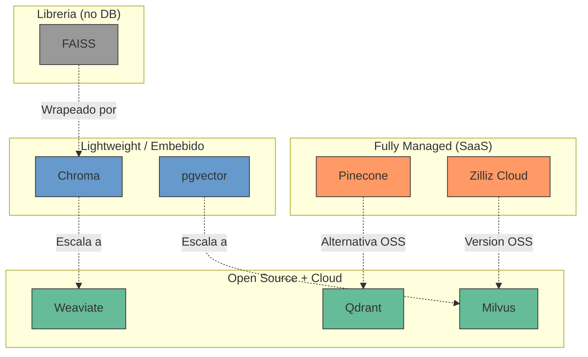
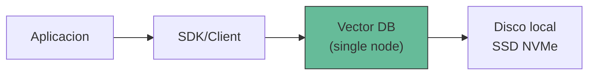
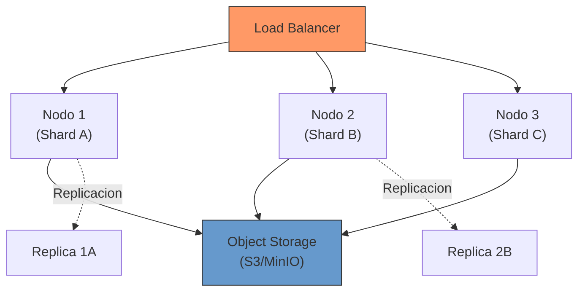
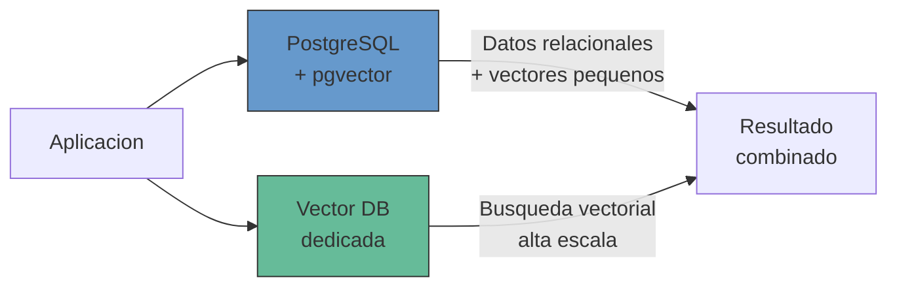
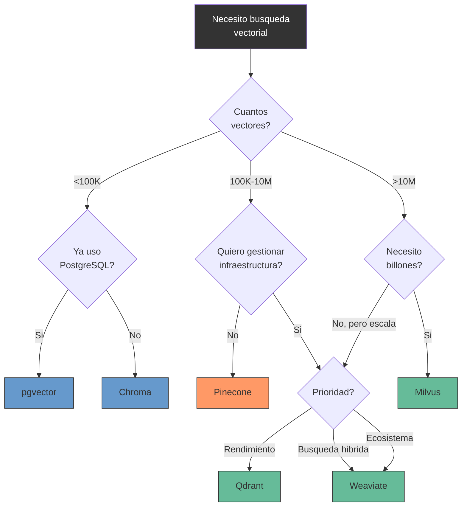

---
tags:
  - herramienta
  - rag
  - infraestructura
  - vector-db
  - comparativa
aliases:
  - bases de datos vectoriales
  - vector stores
  - vector DB
  - almacenamiento de embeddings
created: 2025-06-01
updated: 2025-06-01
category: tecnicas-retrieval
status: volatile
difficulty: intermediate
related:
  - "[[embeddings]]"
  - "[[indexing-strategies]]"
  - "[[retrieval-strategies]]"
  - "[[pattern-rag]]"
  - "[[chunking-strategies]]"
  - "[[reranking]]"
  - "[[advanced-rag]]"
  - "[[infraestructura-cloud]]"
up: "[[moc-rag-retrieval]]"
---

# Bases de datos vectoriales

> [!abstract] Resumen
> Las *vector databases* son sistemas de almacenamiento especializados en indexar, almacenar y consultar vectores de alta dimensionalidad (embeddings). ==Son el componente de infraestructura central de cualquier sistema RAG en produccion==, permitiendo busquedas de similitud semantica a escala con latencias de milisegundos. Este documento compara las principales opciones: Pinecone, Weaviate, Qdrant, Milvus, Chroma, pgvector y FAISS, con criterios practicos para elegir la mas adecuada segun el caso de uso. ^resumen

## Que es y por que importa

Una **base de datos vectorial** resuelve un problema que las bases de datos tradicionales no pueden: ==buscar por similitud semantica en lugar de por coincidencia exacta==. Cuando conviertes documentos en [[embeddings]], necesitas un sistema que pueda responder eficientemente a la pregunta "cuales son los K vectores mas cercanos a este vector de consulta".

El problema subyacente es el *nearest neighbor search* en espacios de alta dimensionalidad (768-3072 dimensiones). La busqueda exacta (*brute force*) tiene complejidad O(n*d) por consulta, lo que se vuelve prohibitivo con millones de vectores. Las bases de datos vectoriales implementan algoritmos de busqueda aproximada (*Approximate Nearest Neighbor*, ANN) que sacrifican una fraccion minima de precision a cambio de ordenes de magnitud de mejora en velocidad.

> [!tip] Cuando necesitas una base de datos vectorial dedicada
> - **Si necesitas**: mas de 100K vectores, busqueda en <100ms, filtrado por metadatos, actualizaciones frecuentes, alta disponibilidad
> - **No necesitas una si**: tienes <10K documentos (FAISS en memoria basta), solo haces busqueda exacta, o tus datos cambian raramente (un indice FAISS serializado es suficiente)
> - Ver [[indexing-strategies]] para entender los algoritmos subyacentes

---

## Panorama de soluciones



---

## Pinecone

*Pinecone* es la base de datos vectorial fully managed mas establecida del mercado. No hay infraestructura que gestionar: creas un indice, insertas vectores y consultas via API.

> [!info] Datos clave de Pinecone
> - **Tipo**: SaaS fully managed
> - **Fundada**: 2019 por Edo Liberty (ex-AWS/Yahoo Research)
> - **Indices**: *Serverless* (recomendado) y *Pod-based* (legacy)
> - **Namespaces**: particionamiento logico dentro de un indice
> - **Sparse-dense**: soporte nativo de busqueda hibrida
> - **Dimensiones max**: 20,000

**Ventajas**: cero operaciones, escalado automatico, SLA de 99.95%, excelente documentacion. ==El serverless index reduce costes drasticamente para workloads con trafico variable==.

**Limitaciones**: vendor lock-in total, sin opcion self-hosted, los costes escalan rapidamente con volumen alto y constante. Sin soporte para busqueda full-text nativa (depende de vectores sparse).

> [!warning] Coste en escala
> Pinecone serverless cobra por lecturas, escrituras y almacenamiento. Para un indice de 10M vectores con 1000 queries/segundo, ==el coste mensual puede superar los $2000/mes==. Comparar con alternativas self-hosted para workloads predecibles.

---

## Weaviate

*Weaviate* es una base de datos vectorial open-source escrita en Go, con un enfoque unico en modularidad y busqueda hibrida.

> [!info] Datos clave de Weaviate
> - **Tipo**: Open source + Cloud managed
> - **Lenguaje**: Go
> - **Licencia**: BSD-3-Clause
> - **API**: REST + GraphQL + gRPC
> - **Modulos**: vectorizer integrados (OpenAI, Cohere, HuggingFace, etc.)
> - **Multi-tenancy**: soporte nativo, ideal para aplicaciones SaaS

**Arquitectura diferenciada**: Weaviate integra modulos de vectorizacion directamente. Puedes enviar texto crudo y Weaviate lo vectoriza internamente usando el modulo configurado. Esto simplifica el pipeline pero acopla la logica de embedding al storage.

==La busqueda hibrida de Weaviate combina BM25 (sparse) con vector search (dense) con fusion configurable==, lo que elimina la necesidad de mantener dos sistemas separados.

> [!example]- Query hibrida en Weaviate con GraphQL
> ```graphql
> {
>   Get {
>     Document(
>       hybrid: {
>         query: "tecnicas de optimizacion de modelos"
>         alpha: 0.75
>         fusionType: relativeScoreFusion
>       }
>       where: {
>         path: ["category"]
>         operator: Equal
>         valueText: "machine-learning"
>       }
>       limit: 10
>     ) {
>       title
>       content
>       _additional {
>         score
>         explainScore
>       }
>     }
>   }
> }
> ```

---

## Qdrant

*Qdrant* (pronunciado "quadrant") es una base de datos vectorial de alto rendimiento escrita en Rust, con un enfoque en eficiencia y filtrado avanzado.

> [!info] Datos clave de Qdrant
> - **Tipo**: Open source + Cloud managed
> - **Lenguaje**: Rust
> - **Licencia**: Apache 2.0
> - **API**: REST + gRPC
> - **Filtrado**: condiciones booleanas complejas sobre payload
> - **Quantizacion**: scalar, product y binary quantization integradas

==Qdrant destaca por su rendimiento en filtrado: los filtros sobre metadatos se aplican durante la busqueda vectorial, no despues==, lo que evita el problema de pre-filtrar demasiado o post-filtrar perdiendo recall[^1].

**Punto diferenciador**: *Sparse vectors* como ciudadanos de primera clase. Puedes almacenar y consultar vectores densos y sparse en la misma coleccion con un API unificado, facilitando la implementacion de [[retrieval-strategies#busqueda-hibrida|busqueda hibrida]].

> [!success] Por que Qdrant es mi recomendacion para self-hosted
> - Rendimiento de Rust sin comprometer usabilidad
> - Quantizacion binaria reduce ==32x el uso de memoria== con perdida minima
> - Snapshots para backup y migracion
> - Docker single-node trivial de desplegar
> - Distributed mode para escalar horizontalmente

---

## Milvus / Zilliz

*Milvus* es la base de datos vectorial open-source disenada para escala masiva, con *Zilliz Cloud* como su version managed.

> [!info] Datos clave de Milvus
> - **Tipo**: Open source + Cloud managed (Zilliz)
> - **Lenguaje**: Go + C++
> - **Licencia**: Apache 2.0
> - **Escala**: ==probado con billones de vectores==
> - **GUI**: Attu (interfaz grafica para gestion)
> - **Arquitectura**: cloud-native, desacoplamiento storage-compute

Milvus separa los componentes en cuatro capas: access layer, coordinator service, worker nodes y storage (S3/MinIO compatible). Esta arquitectura permite ==escalar cada componente independientemente==.

> [!warning] Complejidad operacional
> Milvus requiere etcd, MinIO (u otro object storage S3-compatible) y Pulsar/Kafka para funcionar en modo distribuido. ==La complejidad operacional es significativamente mayor que Qdrant o Weaviate==. Solo justificable si realmente necesitas escala de billones de vectores.

**Milvus Lite**: version embebida (Python package) que usa el mismo API pero corre en memoria. Ideal para desarrollo y testing antes de migrar a Milvus distribuido.

---

## Chroma

*Chroma* es la base de datos vectorial disenada para desarrolladores, con foco en simplicidad y rapidez de prototipado.

> [!info] Datos clave de Chroma
> - **Tipo**: Open source + Cloud (preview)
> - **Lenguaje**: Python (core), Rust (engine)
> - **Licencia**: Apache 2.0
> - **Modo**: in-process (embebido) o client-server
> - **Backend**: usa HNSW internamente (via hnswlib)

==Chroma brilla por su API minimalista: puedes tener un sistema RAG funcional en menos de 10 lineas de Python==. Es el companero perfecto de [[langchain-overview|LangChain]] y [[llamaindex-overview|LlamaIndex]] para prototipos.

> [!example]- Quick start con Chroma
> ```python
> import chromadb
>
> # Crear cliente (embebido, datos en disco)
> client = chromadb.PersistentClient(path="./chroma_data")
>
> # Crear coleccion con embedding function automatica
> collection = client.get_or_create_collection(
>     name="documentos",
>     metadata={"hnsw:space": "cosine"}
> )
>
> # Insertar documentos (Chroma genera embeddings automaticamente)
> collection.add(
>     documents=["Texto del documento 1", "Texto del documento 2"],
>     metadatas=[{"source": "manual"}, {"source": "api"}],
>     ids=["doc1", "doc2"]
> )
>
> # Buscar
> results = collection.query(
>     query_texts=["Mi consulta semantica"],
>     n_results=5,
>     where={"source": "manual"}
> )
> ```

> [!failure] Limitaciones de Chroma
> - No recomendado para mas de ~1M vectores en produccion
> - Sin soporte nativo de replicacion o sharding
> - Sin busqueda hibrida (dense only)
> - El modo client-server aun esta madurando

---

## pgvector

*pgvector* es una extension de PostgreSQL que anade soporte para vectores y busqueda de similitud. ==Si ya usas PostgreSQL, es la forma mas rapida de incorporar busqueda vectorial sin anadir infraestructura==.

> [!info] Datos clave de pgvector
> - **Tipo**: Extension de PostgreSQL (open source)
> - **Licencia**: PostgreSQL License
> - **Indices**: IVFFlat y ==HNSW (desde v0.5.0)==
> - **Dimensiones max**: 2,000
> - **Metricas**: L2, inner product, cosine, L1

**Ventaja estrategica**: transacciones ACID, backups, replicacion, permisos: toda la infraestructura de PostgreSQL que ya conoces aplica a tus vectores. Puedes hacer ==JOINs entre datos relacionales y vectoriales en una sola query==.

> [!example]- Busqueda vectorial con pgvector
> ```sql
> -- Crear extension y tabla
> CREATE EXTENSION IF NOT EXISTS vector;
>
> CREATE TABLE documents (
>     id SERIAL PRIMARY KEY,
>     content TEXT,
>     metadata JSONB,
>     embedding vector(1024)
> );
>
> -- Crear indice HNSW
> CREATE INDEX ON documents
>     USING hnsw (embedding vector_cosine_ops)
>     WITH (m = 16, ef_construction = 200);
>
> -- Busqueda de similitud con filtro relacional
> SELECT id, content, metadata,
>        1 - (embedding <=> $1::vector) AS similarity
> FROM documents
> WHERE metadata->>'category' = 'tecnico'
> ORDER BY embedding <=> $1::vector
> LIMIT 10;
> ```

> [!danger] Limitaciones criticas de pgvector en escala
> - El rendimiento degrada significativamente ==a partir de ~5M vectores== (comparado con soluciones dedicadas)
> - HNSW index build puede ser muy lento y consume mucha RAM
> - El limite de 2,000 dimensiones es inferior a los 3,072 de OpenAI `text-embedding-3-large`
> - No hay quantizacion nativa (aunque pgvecto.rs, un fork en Rust, si la soporta)

---

## FAISS

*FAISS* (*Facebook AI Similarity Search*) no es una base de datos sino una ==libreria de Meta para busqueda de similitud eficiente en vectores densos==. Es el motor subyacente de muchas soluciones[^2].

> [!info] Datos clave de FAISS
> - **Tipo**: Libreria (no base de datos)
> - **Lenguaje**: C++ con bindings Python
> - **Licencia**: MIT
> - **GPU**: soporte nativo CUDA
> - **Indices**: Flat, IVF, HNSW, PQ y combinaciones

**Cuando usar FAISS directamente**: batches offline de busqueda, prototipado rapido, cuando necesitas control total sobre el indice, o cuando tienes GPU disponible para busqueda masiva. ==FAISS con GPU puede procesar >1B vectores en milisegundos==.

**Cuando NO usar FAISS**: necesitas actualizaciones incrementales frecuentes, filtrado por metadatos, persistencia robusta, o alta disponibilidad. Para eso necesitas una base de datos vectorial que use FAISS (u otro motor) internamente.

---

## Tabla comparativa

| Criterio | Pinecone | Weaviate | Qdrant | Milvus | Chroma | pgvector | FAISS |
|---|---|---|---|---|---|---|---|
| **Tipo** | SaaS | OSS + Cloud | OSS + Cloud | OSS + Cloud | OSS | Extension PG | Libreria |
| **Lenguaje** | Propietario | Go | ==Rust== | Go/C++ | Python/Rust | C | C++ |
| **Escala max** | ~1B | ~100M | ~100M | ==Billones== | ~1M | ~5M | ~1B (GPU) |
| **Busqueda hibrida** | Si (sparse) | ==Si (BM25+vector)== | Si (sparse) | Si | No | No | No |
| **Filtrado** | Si | Si | ==Excelente== | Si | Basico | SQL completo | No nativo |
| **Multi-tenancy** | Namespaces | ==Nativo== | Collections | Partitions | Collections | Schemas | Manual |
| **GPU support** | N/A | No | No | Si | No | No | ==Si (CUDA)== |
| **Latencia p99** | <50ms | <100ms | ==<30ms== | <100ms | <50ms | Variable | <10ms (GPU) |
| **Ops overhead** | ==Cero== | Medio | Bajo | Alto | Bajo | Bajo (ya PG) | N/A |
| **Licencia** | Propietaria | BSD-3 | Apache 2.0 | Apache 2.0 | Apache 2.0 | PG License | MIT |
| **Coste entrada** | Gratis (tier) | Gratis (OSS) | Gratis (OSS) | Gratis (OSS) | Gratis (OSS) | ==Gratis== | ==Gratis== |

^tabla-comparativa-vector-dbs

---

## Patrones de arquitectura

### Single node (desarrollo y produccion pequena)



Adecuado para <10M vectores. Qdrant, Weaviate o Chroma en Docker. ==La mayoria de proyectos nunca necesitan mas que esto==.

### Distribuido (produccion alta escala)



Necesario para >100M vectores o alta disponibilidad. Milvus, Qdrant distribuido o Weaviate cluster.

### Hibrido (vector + relacional)



==Patron recomendado para aplicaciones que ya tienen PostgreSQL==: usar pgvector para volumenes pequenos o datos fuertemente acoplados a entidades relacionales, y una DB vectorial dedicada para el corpus principal de RAG.

---

## Como elegir: diagrama de decision



> [!tip] Regla practica para la decision
> 1. **Prototipo rapido**: Chroma (o FAISS si ya lo conoces)
> 2. **Produccion con PostgreSQL existente**: pgvector hasta que duela
> 3. **Produccion self-hosted**: ==Qdrant== (mejor balance rendimiento/simplicidad)
> 4. **Produccion sin ops**: Pinecone serverless
> 5. **Escala masiva**: Milvus/Zilliz
> 6. **Busqueda hibrida nativa**: Weaviate

---

## Consideraciones de produccion

> [!danger] Errores comunes en produccion
> - **Mezclar modelos de embedding**: cambiar el modelo de embedding ==requiere reindexar todo el corpus==. Planifica la migracion antes de empezar.
> - **Ignorar la dimensionalidad**: vectores de 3072 dims consumen 6x mas almacenamiento y son mas lentos que 512 dims. Evalua si la diferencia de calidad justifica el coste.
> - **No monitorizar recall**: un indice HNSW mal configurado puede devolver resultados irrelevantes sin que te des cuenta. Ver [[indexing-strategies#tuning-hnsw|tuning de HNSW]].
> - **Olvidar backups**: las bases vectoriales tambien necesitan backup. Qdrant soporta snapshots, Weaviate tiene backups a S3.

> [!question] Debate abierto: base de datos vectorial dedicada vs todo-en-uno
> La tendencia en 2025 es que bases de datos generalistas (PostgreSQL, MongoDB, Elasticsearch) anaden soporte vectorial. La pregunta es: ==es suficiente o siempre necesitaras una solucion dedicada?==
>
> Mi posicion: para la mayoria de aplicaciones, pgvector o el soporte vectorial de tu DB existente es suficiente. Las soluciones dedicadas solo se justifican cuando la busqueda vectorial es el caso de uso principal y necesitas rendimiento optimo a escala.

---

## Relación con el ecosistema

> [!info] Conexiones con mis herramientas
> - **[[intake-overview|intake]]**: intake necesita una base de datos vectorial como destino para los embeddings generados durante la ingesta. La eleccion de vector DB impacta directamente la arquitectura del pipeline de intake. Los 12+ parsers de intake producen chunks que deben indexarse eficientemente.
> - **[[architect-overview|architect]]**: architect genera codigo de integracion con vector databases, incluyendo esquemas de colecciones, configuracion de indices HNSW, y scripts de migracion. Sus YAML pipelines pueden orquestar la indexacion como paso del flujo.
> - **[[vigil-overview|vigil]]**: vigil debe escanear las configuraciones de bases vectoriales buscando exposiciones de seguridad: APIs sin autenticacion, puertos expuestos, vectores que puedan filtrar datos sensibles via embedding inversion.
> - **[[licit-overview|licit]]**: licit verifica que los datos almacenados en la base vectorial cumplen con regulaciones de retencion y derecho al olvido (GDPR). ==Eliminar un embedding especifico de un indice HNSW no es trivial y requiere reindexacion==.

---

## Enlaces y referencias

**Notas relacionadas:**
- [[embeddings]] -- Los vectores que almacenan estas bases de datos
- [[indexing-strategies]] -- Algoritmos de indexacion usados internamente
- [[retrieval-strategies]] -- Estrategias de consulta sobre vector DBs
- [[reranking]] -- Post-procesamiento de resultados de busqueda vectorial
- [[chunking-strategies]] -- La calidad del chunking afecta el rendimiento de la DB
- [[pattern-rag]] -- El patron arquitectonico que depende de vector DBs
- [[advanced-rag]] -- Patrones avanzados que requieren capacidades especificas de la DB
- [[infraestructura-cloud]] -- Despliegue en la nube de bases vectoriales

> [!quote]- Referencias bibliograficas
> - Pinecone Documentation, "Understanding Indexes", 2024
> - Weaviate Documentation, "Hybrid Search Explained", 2024
> - Qdrant Documentation, "Filtering", 2024
> - Wang, J. et al. "Milvus: A Purpose-Built Vector Data Management System", SIGMOD 2021
> - Johnson, J. et al. "Billion-scale similarity search with GPUs", IEEE Transactions on Big Data, 2019
> - pgvector GitHub, "Open-source vector similarity search for Postgres", 2024
> - Chroma Documentation, "Getting Started", 2024
> - ANN Benchmarks, ann-benchmarks.com, 2024

[^1]: Qdrant implementa *filterable HNSW*, donde las condiciones de filtrado se integran en el grafo de busqueda. Esto evita el trade-off clasico entre pre-filtrado (reduce el espacio de busqueda pero puede perder nodos relevantes del grafo) y post-filtrado (busca bien pero desperdicia compute en resultados que seran filtrados).
[^2]: Johnson et al., "Billion-scale similarity search with GPUs", IEEE Transactions on Big Data, 2019. Paper fundacional de FAISS.
