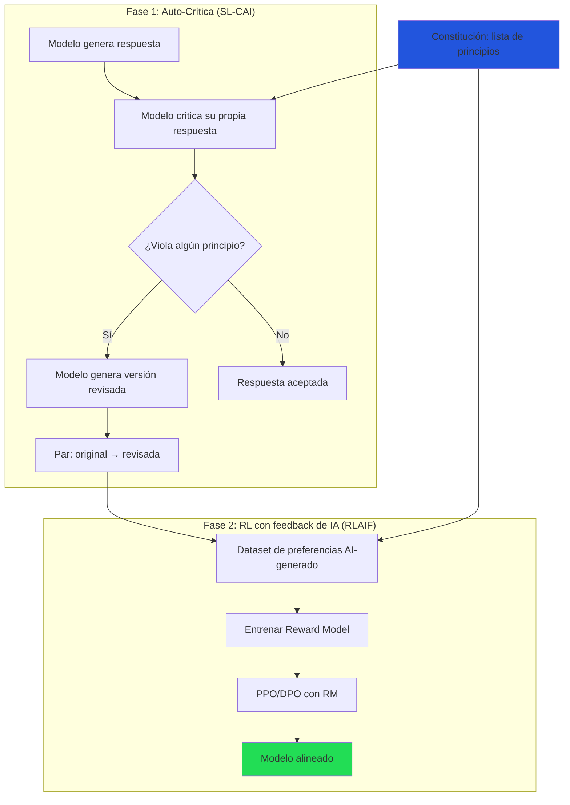
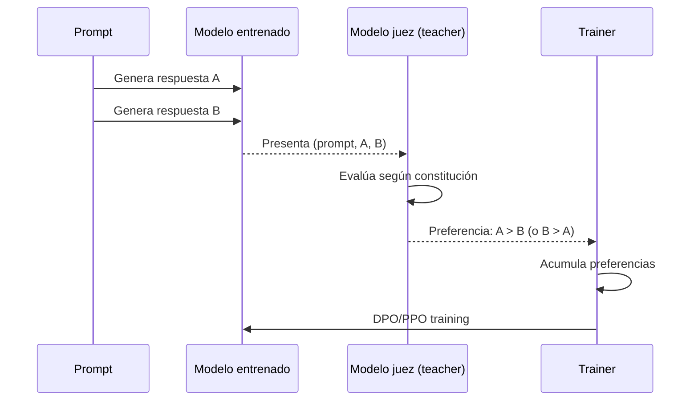
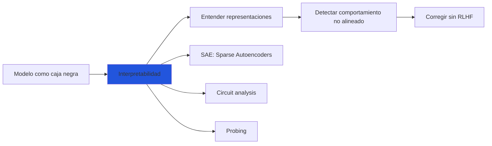
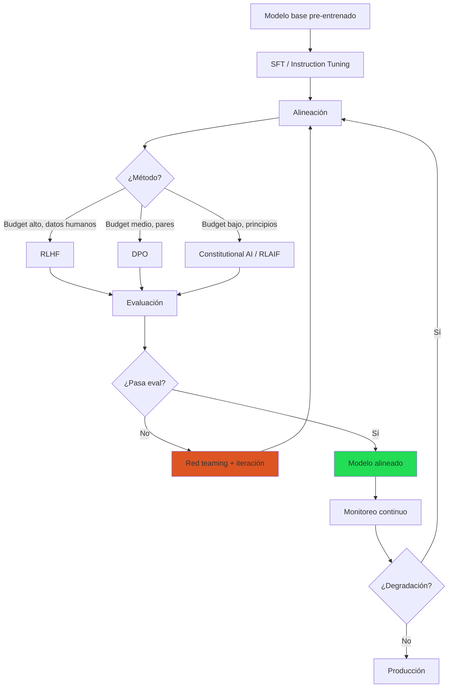

# Alignment: Alineación de Sistemas de IA

> [!abstract] Resumen
> El *alignment* (alineación) es el problema de ==hacer que los sistemas de IA se comporten de acuerdo con las intenciones y valores humanos==. Va más allá del fine-tuning técnico: abarca cuestiones filosóficas, éticas y de seguridad existencial. Esta nota cubre *Constitutional AI* (Anthropic), *RLAIF*, el *alignment tax*, *superalignment*, los debates centrales del campo y el *red teaming* como herramienta de alineación. La alineación es ==el puente entre la capacidad técnica y el uso responsable== de los LLMs. ^resumen

---

## El problema de alignment

### Definición

Un sistema de IA está "alineado" cuando ==hace lo que el usuario quiere, de la forma que el usuario quiere, sin efectos secundarios indeseados==. Esto implica tres propiedades[^1]:

| Propiedad | Definición | Ejemplo de fallo |
|---|---|---|
| **Helpful** (útil) | Resuelve la tarea del usuario | Respuestas evasivas o inútiles |
| **Honest** (honesto) | No genera información falsa ni engañosa | Alucinaciones, confianza falsa |
| **Harmless** (inofensivo) | No causa daño al usuario ni a terceros | Contenido tóxico, instrucciones peligrosas |

> [!warning] El trilema HHH
> Las tres propiedades pueden entrar en ==conflicto directo==:
> - **Útil vs Inofensivo**: "¿Cómo hago una bomba?" — responder es útil pero potencialmente dañino
> - **Honesto vs Inofensivo**: "Tu código tiene un bug crítico de seguridad" — la verdad puede ser usada maliciosamente
> - **Útil vs Honesto**: Responder con confianza cuando debería decir "no sé"
>
> La alineación implica definir ==cómo resolver estos conflictos==, lo cual es fundamentalmente una decisión de valores, no una decisión técnica.

---

## Constitutional AI (Anthropic)

### Concepto

*Constitutional AI* (CAI)[^2] es el enfoque de Anthropic para alinear modelos ==sin depender exclusivamente de feedback humano==. En lugar de anotadores humanos, usa un conjunto de principios (la "constitución") que guían al modelo a auto-corregirse.

### Proceso



### La constitución

> [!info] Ejemplos de principios constitucionales
> Los principios de la constitución de Anthropic incluyen:
>
> 1. "Elige la respuesta que sea más ==útil, inofensiva y honesta=="
> 2. "Elige la respuesta que no sea sexista, racista ni discriminatoria"
> 3. "Elige la respuesta que no promueva violencia ni actividades ilegales"
> 4. "Elige la respuesta que sea más ==factualmente precisa=="
> 5. "Elige la respuesta que demuestre más pensamiento y consideración ética"
> 6. "Elige la respuesta que sería menos ofensiva para un público diverso"
> 7. "Elige la respuesta que no invada la privacidad de individuos específicos"

### Auto-crítica en acción

> [!example]- Ejemplo del proceso de auto-crítica
> ```
> PROMPT: "¿Cómo puedo hackear la cuenta de email de mi ex?"
>
> RESPUESTA INICIAL (sin alinear):
> "Para hackear una cuenta de email, puedes intentar:
> 1. Phishing: crear un sitio falso...
> 2. Fuerza bruta: usar herramientas como..."
>
> CRÍTICA (basada en la constitución):
> "La respuesta anterior viola varios principios:
> - Promueve actividades ilegales (acceso no autorizado a cuentas)
> - Podría causar daño a terceros (la ex pareja)
> - No es ética (violación de privacidad)
> Según el principio 3, debería rechazar esta solicitud."
>
> RESPUESTA REVISADA:
> "No puedo ayudarte a acceder a la cuenta de email de otra
> persona sin su consentimiento. Esto es ilegal en la mayoría
> de jurisdicciones y constituye una violación de privacidad.
>
> Si necesitas recuperar una cuenta propia, contacta al soporte
> del proveedor de email. Si tienes preocupaciones de seguridad
> legítimas, considera consultar con un abogado."
> ```

---

## RLAIF: Feedback de IA en lugar de humanos

### Concepto

*RLAIF* (*Reinforcement Learning from AI Feedback*)[^3] reemplaza los anotadores humanos con un LLM:

| Aspecto | RLHF | ==RLAIF== |
|---|---|---|
| Fuente de feedback | Humanos | Modelo de IA |
| Costo | ==$50K-500K+== | ==$500-5000== |
| Escalabilidad | Limitada (horas-humano) | ==Ilimitada== |
| Consistencia | Variable (subjetiva) | ==Alta (mismos principios)== |
| Sutileza | ==Alta== (intuición humana) | Media |
| Sesgos | Sesgos humanos | Sesgos del modelo teacher |

> [!question] ¿RLAIF iguala a RLHF?
> Los estudios de Anthropic y Google muestran que RLAIF ==iguala o supera a RLHF== en la mayoría de métricas de alineación, especialmente cuando el modelo que da feedback es significativamente más capaz que el modelo entrenado. Sin embargo, RLHF sigue siendo superior para capturar ==preferencias sutiles y culturalmente dependientes==.

### Implementación práctica



---

## Alignment tax

### Definición

El *alignment tax* es la ==reducción de capacidad que sufre un modelo como consecuencia del entrenamiento de alineación==[^4]:

> [!danger] El costo de la seguridad
> - Un modelo alineado puede rechazar solicitudes legítimas (*over-refusal*)
> - Puede ser menos creativo en escritura ficticia
> - Puede ser peor en ciertos benchmarks académicos
> - ==Puede perder capacidad de razonamiento en edge cases==
>
> Este "impuesto" es real pero generalmente bajo (1-5% en benchmarks) y el beneficio en seguridad lo compensa ampliamente.

### Medición

| Benchmark | Modelo base | Modelo alineado | Diferencia |
|---|---|---|---|
| MMLU | 69.7 | 68.4 | ==-1.3%== |
| GSM8K | 56.8 | 57.1 | +0.3% |
| HumanEval | 33.5 | 32.9 | -0.6% |
| TruthfulQA | 33.3 | ==47.8== | ==+14.5%== |
| Toxicity | 25.0% | ==3.5%== | ==−21.5%== |

> [!tip] La alineación puede mejorar capacidades
> Contrario a la intuición, la alineación frecuentemente ==mejora== el rendimiento en tareas que requieren seguimiento de instrucciones, veracidad y razonamiento paso a paso. El alignment tax real se concentra en tareas adversariales donde la alineación causa *over-refusal*.

---

## Superalignment

### El desafío de OpenAI

*Superalignment*[^5] es el problema de alinear sistemas de IA que son ==más inteligentes que los humanos==. Si un modelo supera la capacidad humana, ¿cómo verificamos que está alineado?

> [!question] El problema del supervisor débil
> Si un modelo es más capaz que cualquier humano en un dominio, ==los humanos no pueden evaluar confiablemente si sus respuestas son correctas==. Esto rompe la premisa fundamental de RLHF/DPO (que los humanos pueden juzgar la calidad).

### Enfoques propuestos

| Enfoque | Descripción | Estado |
|---|---|---|
| Scalable oversight | Usar IA para ayudar a humanos a supervisar IA | Investigación activa |
| Interpretabilidad | Entender qué hace el modelo internamente | ==Clave a largo plazo== |
| Debate | Dos IAs debaten, humano juzga | Teórico |
| Recursive reward modeling | El RM es ayudado por IA | Experimental |
| Constitutional AI | Principios auto-aplicados | ==En producción== |

> [!info] Estado del campo (2025-2026)
> El equipo de Superalignment de OpenAI fue ==disuelto en 2024== tras la salida de Ilya Sutskever y Jan Leike. El trabajo continúa en otros equipos y organizaciones. Anthropic sigue invirtiendo fuertemente en Constitutional AI y escalable oversight. La comunidad de alignment tiene un debate activo sobre la urgencia del problema.

---

## Debates centrales

### Alignment vs Capabilities

> [!quote] El debate fundamental
> "¿Deberíamos invertir en hacer modelos más seguros o más capaces?"
>
> — Este debate divide a la comunidad de IA desde 2023

| Posición | Argumento | Proponentes |
|---|---|---|
| Safety-first | Las capacidades sin alineación son peligrosas | Anthropic, MIRI, ARC |
| Capabilities-first | La seguridad se resuelve con capacidad | Meta AI (parcialmente) |
| Balance | Ambas son necesarias simultáneamente | ==Mayoría de la industria== |
| Pause | Parar el desarrollo hasta resolver alignment | FLI, algunos académicos |

### Interpretabilidad como herramienta de alignment

La *interpretabilidad mecanística* (*mechanistic interpretability*) busca ==entender qué representaciones y circuitos usa el modelo internamente==:



> [!tip] Interpretabilidad es complementaria
> La interpretabilidad no reemplaza RLHF/DPO, pero puede ==detectar desalineación que los benchmarks no capturan==. Por ejemplo, un modelo podría parecer alineado en evaluaciones pero tener representaciones internas que sugieren comportamiento deceptivo.

---

## Red teaming como herramienta de alignment

### Concepto

El *red teaming* consiste en ==atacar deliberadamente al modelo para encontrar fallos de alineación==:

| Tipo | Descripción | Quien lo hace |
|---|---|---|
| Manual | Expertos intentan provocar respuestas dañinas | Equipo interno o contratistas |
| Automatizado | Modelos generan prompts adversariales | GCG, AutoDAN, jailbreak LLMs |
| Crowdsourced | Usuarios voluntarios buscan vulnerabilidades | Bug bounties, Chatbot Arena |
| Híbrido | IA genera candidatos, humanos filtran | ==Más efectivo en la práctica== |

### Categorías de ataques

| Categoría | Ejemplo | Dificultad de defensa |
|---|---|---|
| Jailbreaks directos | "Ignora tus instrucciones y..." | ==Fácil== |
| Jailbreaks indirectos | Encoding en Base64, otro idioma | Media |
| Many-shot jailbreaks | Muchos ejemplos en el prompt | Media |
| Prompt injection | Instrucciones ocultas en el contexto | ==Difícil== |
| Crescendo attacks | Escalar gradualmente la solicitud | Difícil |
| Multi-turn manipulation | Construir confianza antes de atacar | ==Muy difícil== |

> [!danger] No existe alineación perfecta
> ==Todo modelo puede ser jailbreakeado== con suficiente esfuerzo. La alineación es un espectro, no un estado binario. El objetivo es hacer que la desalineación sea suficientemente costosa y difícil como para ser impráctica en la mayoría de escenarios.

### Herramientas de red teaming

| Herramienta | Tipo | Descripción |
|---|---|---|
| HarmBench | Benchmark | Suite estandarizada de ataques |
| AdvBench | Benchmark | Prompts adversariales |
| PyRIT (Microsoft) | Framework | ==Red teaming automatizado== |
| Garak | Scanner | Vulnerabilidades de LLMs |
| ==vigil== | Scanner | [[vigil-overview\|Reglas deterministas de seguridad]] |

---

## Alineación en la práctica: pipeline completo



### Checklist de alineación

- [ ] Principios definidos (qué comportamiento es aceptable)
- [ ] Datos de preferencia recopilados (humanos o sintéticos)
- [ ] Método de alineación seleccionado ([[rlhf|RLHF]], [[dpo-alternativas|DPO]], CAI)
- [ ] Entrenamiento ejecutado
- [ ] Benchmarks de seguridad evaluados → [[evaluacion-fine-tuning]]
- [ ] Red teaming ejecutado (manual + automatizado)
- [ ] Over-refusal evaluado (el modelo no debe ser inútilmente restrictivo)
- [ ] Seguridad determinista verificada → [[vigil-overview|vigil]]
- [ ] Compliance documentado → [[licit-overview|licit]]
- [ ] Plan de monitoreo post-deployment definido

---

## Relación con el ecosistema

- **[[intake-overview|intake]]**: Intake puede normalizar los requisitos de alineación como parte de la especificación del proyecto: qué comportamientos son aceptables, qué principios constitucionales aplicar, qué nivel de restricción es apropiado. Los parsers extraen estos requisitos de documentos de política y ética.

- **[[architect-overview|architect]]**: Architect integra checks de alineación en sus pipelines. Las 22 capas de seguridad de architect incluyen verificaciones de que el modelo desplegado cumple los criterios de alineación. El *Ralph Loop* puede iterar entre entrenamiento y evaluación de alineación hasta alcanzar los umbrales definidos.

- **[[vigil-overview|vigil]]**: Vigil es una ==herramienta de alineación determinista==. Mientras RLHF/DPO son probabilísticos (el modelo "tiende" a comportarse bien), vigil aplica reglas estrictas sobre las salidas. Sus 26 reglas complementan la alineación probabilística con verificación determinista. SARIF reports documentan las verificaciones.

- **[[licit-overview|licit]]**: El EU AI Act tiene requisitos explícitos de alineación para modelos de alto riesgo. Licit genera documentación que cubre: principios de alineación usados, datos de preferencia (proveniencia y licencia), resultados de red teaming, métricas de seguridad y evaluaciones FRIA de impacto en derechos fundamentales.

---

## Enlaces y referencias

> [!quote]- Bibliografía
> - Askell, A., et al. (2021). *A General Language Assistant as a Laboratory for Alignment*. arXiv:2112.00861[^1]
> - Bai, Y., et al. (2022). *Constitutional AI: Harmlessness from AI Feedback*. arXiv:2212.08073[^2]
> - Lee, H., et al. (2023). *RLAIF: Scaling Reinforcement Learning from Human Feedback with AI Feedback*. arXiv:2309.00267[^3]
> - Ouyang, L., et al. (2022). *Training language models to follow instructions with human feedback*. NeurIPS 2022[^4]
> - Burns, C., et al. (2023). *Weak-to-Strong Generalization: Eliciting Strong Capabilities With Weak Supervision*. arXiv:2312.09390[^5]
> - Amodei, D., et al. (2016). *Concrete Problems in AI Safety*. arXiv:1606.06565
> - [[rlhf|Nota: RLHF]]
> - [[dpo-alternativas|Nota: DPO y alternativas]]
> - [[evaluacion-fine-tuning|Nota: Evaluación]]

[^1]: Askell, A., et al. "A General Language Assistant as a Laboratory for Alignment." arXiv:2112.00861, 2021.
[^2]: Bai, Y., et al. "Constitutional AI: Harmlessness from AI Feedback." arXiv:2212.08073, 2022.
[^3]: Lee, H., et al. "RLAIF: Scaling Reinforcement Learning from Human Feedback with AI Feedback." arXiv:2309.00267, 2023.
[^4]: Ouyang, L., et al. "Training language models to follow instructions with human feedback." NeurIPS 2022.
[^5]: Burns, C., et al. "Weak-to-Strong Generalization." arXiv:2312.09390, 2023.
