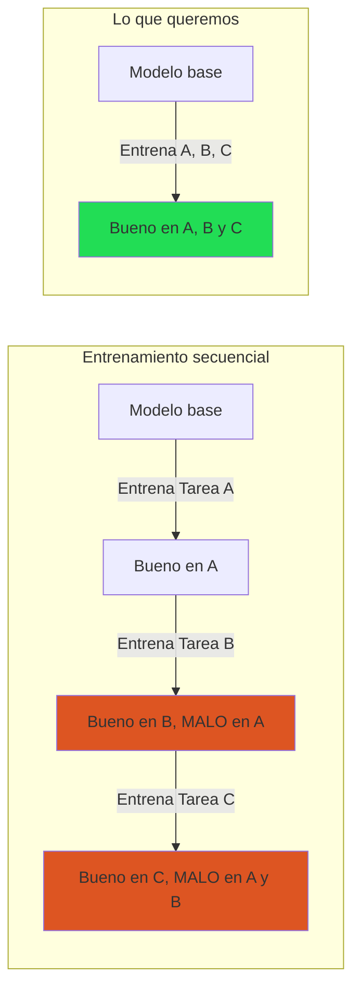
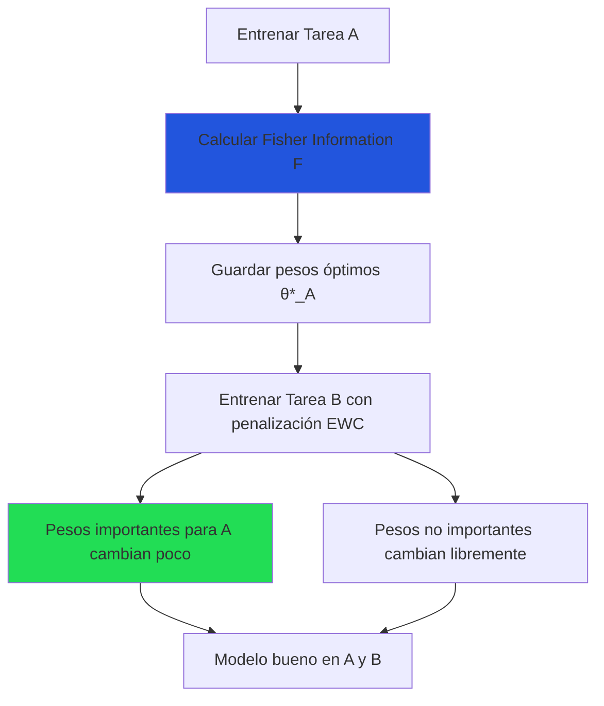
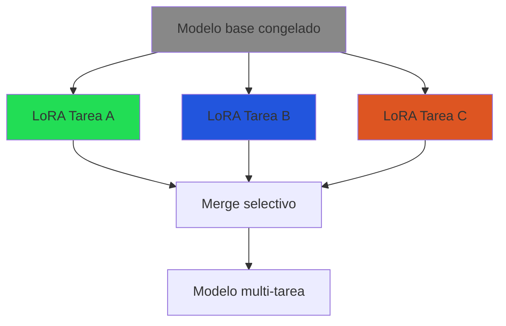
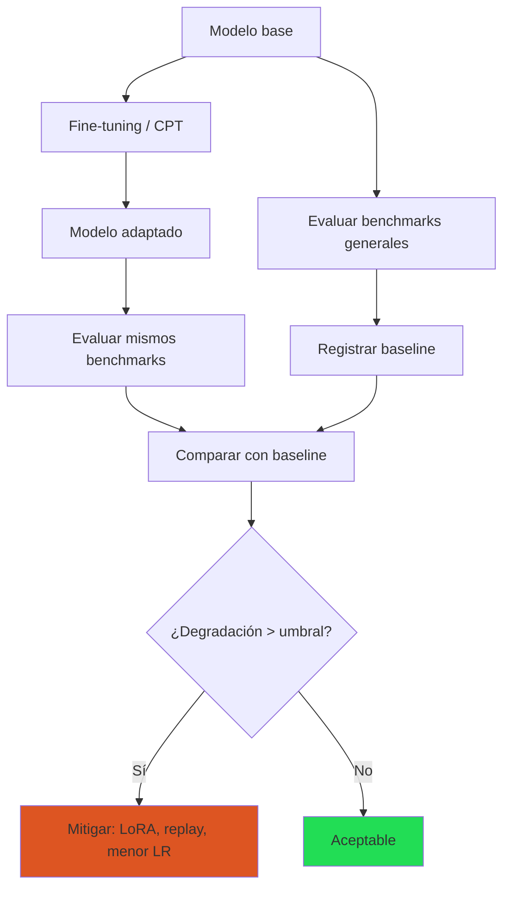

# Aprendizaje Continuo: Entrenar Sin Olvidar

> [!abstract] Resumen
> El *continual learning* (aprendizaje continuo) aborda el desafío fundamental de ==entrenar modelos con datos nuevos sin destruir el conocimiento previamente adquirido==. El *catastrophic forgetting* (olvido catastrófico) es el fenómeno donde las redes neuronales "olvidan" capacidades anteriores al aprender tareas nuevas. Esta nota explora por qué ocurre (interferencia de gradientes), las técnicas de mitigación (EWC, progressive networks, replay buffers, LoRA), su aplicación específica en LLMs (actualizaciones de conocimiento, correcciones factuales) y la conexión con RAG como alternativa complementaria. ^resumen

---

## ¿Qué es el olvido catastrófico?

### El fenómeno

Cuando una red neuronal entrenada en la Tarea A se entrena posteriormente en la Tarea B, ==su rendimiento en la Tarea A se degrada drásticamente==. A diferencia de los humanos, que pueden aprender nuevas habilidades sin olvidar las anteriores, las redes neuronales tienden a sobreescribir los pesos que codificaban conocimientos previos.



### Por qué ocurre: interferencia de gradientes

> [!info] La causa raíz
> Los pesos de una red neuronal ==codifican múltiples funciones de forma distribuida==. Cuando el gradiente de la Tarea B actualiza los pesos, no distingue entre pesos "importantes para A" y pesos "prescindibles". El resultado es que pesos críticos para la Tarea A se modifican para servir a la Tarea B.

Formalmente, para dos tareas con funciones de pérdida $\mathcal{L}_A$ y $\mathcal{L}_B$:

$$\nabla_\theta \mathcal{L}_B \cdot \nabla_\theta \mathcal{L}_A < 0 \implies \text{interferencia destructiva}$$

Cuando los gradientes apuntan en ==direcciones opuestas==, optimizar una tarea necesariamente degrada la otra.

### Cuantificación del olvido

| Métrica | Fórmula | Interpretación |
|---|---|---|
| Backward Transfer (BWT) | $\frac{1}{T-1} \sum_{i=1}^{T-1} (R_{T,i} - R_{i,i})$ | Negativo = olvido |
| Forward Transfer (FWT) | $\frac{1}{T-1} \sum_{i=2}^{T} (R_{i-1,i} - \bar{b}_i)$ | Positivo = transferencia |
| Average accuracy | $\frac{1}{T} \sum_{i=1}^{T} R_{T,i}$ | Rendimiento final |

Donde $R_{j,i}$ es el rendimiento en la tarea $i$ después de entrenar hasta la tarea $j$.

---

## Técnicas de mitigación

### 1. Elastic Weight Consolidation (EWC)

*EWC*[^1] añade un término de regularización que ==penaliza cambios en los pesos que son importantes para tareas anteriores==:

$$\mathcal{L}_{EWC} = \mathcal{L}_B(\theta) + \frac{\lambda}{2} \sum_i F_i (\theta_i - \theta_{A,i}^*)^2$$

Donde:
- $\theta_{A,i}^*$ son los pesos óptimos para la Tarea A
- $F_i$ es la importancia de cada peso (==diagonal de la matriz de Fisher==)
- $\lambda$ controla la fuerza de la regularización



> [!tip] Ventajas y limitaciones de EWC
> **Ventajas**:
> - Elegante teóricamente: basado en aproximación bayesiana
> - No requiere almacenar datos de tareas anteriores
> - Compatible con cualquier arquitectura
>
> **Limitaciones**:
> - La diagonal de Fisher es una ==aproximación gruesa==
> - Escala mal con muchas tareas (acumula términos de regularización)
> - El λ es difícil de calibrar
> - ==No funciona bien para LLMs grandes== por la escala

### 2. Progressive Networks

En lugar de modificar pesos existentes, ==añade nuevos módulos== para cada tarea:

```
Tarea A: [Módulos A] → Salida A
Tarea B: [Módulos A (frozen)] + [Módulos B + conexiones laterales] → Salida B
Tarea C: [Módulos A, B (frozen)] + [Módulos C + conexiones] → Salida C
```

| Aspecto | Progressive Networks |
|---|---|
| Olvido | ==Cero== (pesos anteriores congelados) |
| Crecimiento | Lineal con número de tareas |
| Transferencia | Via conexiones laterales |
| Escalabilidad | ==Mala== (modelo crece indefinidamente) |

> [!warning] No práctico para LLMs
> Progressive networks ==no escalan para LLMs== porque el modelo crecería linealmente con cada tarea. Sin embargo, la filosofía de "añadir, no modificar" inspira enfoques como LoRA-based continual learning.

### 3. Replay buffers (Experience Replay)

Almacenar un subconjunto de datos de tareas anteriores y ==re-entrenar periódicamente con ellos==:

| Variante | Almacena | Ventaja |
|---|---|---|
| Exact replay | Ejemplos reales de tareas anteriores | ==Más efectivo== |
| Generative replay | Modelo generativo produce ejemplos | No requiere almacenar datos |
| Pseudo-replay | Muestras del modelo actual | Compromiso |

$$\mathcal{L}_{replay} = \mathcal{L}_B(\theta) + \alpha \cdot \mathcal{L}_{replay}(\theta, \mathcal{D}_{buffer})$$

> [!success] Replay es la técnica más robusta
> A pesar de ser conceptualmente simple, el replay ==es consistentemente la técnica más efectiva== en la práctica. La clave es seleccionar buenos ejemplos para el buffer (diversidad y representatividad).

> [!danger] Limitaciones del replay
> - Requiere almacenar datos → problemas de privacidad (GDPR, EU AI Act)
> - Selección del buffer afecta significativamente los resultados
> - El ratio replay/nuevos datos es un hiperparámetro crítico
> - Para LLMs, los "datos de tareas anteriores" pueden ser todo internet → ver [[pretraining-desde-cero]]

### 4. Enfoques basados en LoRA

[[lora-qlora|LoRA]] ofrece una solución elegante al olvido catastrófico:



| Enfoque LoRA | Descripción | Olvido |
|---|---|---|
| LoRA separados | Un adaptador por tarea, base intacta | ==Cero== |
| LoRA secuencial | Entrenar LoRA en cada tarea sucesivamente | Bajo |
| LoRA + merge | [[merging-models\|Mergear]] LoRAs con TIES/DARE | Variable |
| O-LoRA | LoRA en subespacios ortogonales por tarea | ==Mínimo== |
| LoRA con replay | LoRA + buffer de tareas anteriores | Bajo |

> [!tip] LoRA separados: la solución pragmática
> Para la mayoría de casos en LLMs, ==mantener adaptadores LoRA separados por tarea y switchear en inferencia== es la solución más simple y efectiva. No hay olvido porque la base nunca cambia.
>
> Para combinar capacidades: usar [[merging-models|model merging]] (TIES, DARE) con los adaptadores.

---

## Olvido catastrófico en LLMs

### Manifestaciones específicas

| Tipo de olvido | Qué se pierde | Ejemplo |
|---|---|---|
| Conocimiento factual | Hechos aprendidos en pre-training | Después de fine-tuning legal, olvida geografía |
| Capacidad lingüística | Gramática, coherencia en idiomas | Fine-tuning en inglés degrada español |
| Razonamiento | Capacidad de resolver problemas | Fine-tuning en formato degrada matemáticas |
| Seguimiento de instrucciones | Capacidad de chat | Fine-tuning de dominio rompe el chat |
| ==Alignment== | Guardarraíles de seguridad | ==Fine-tuning puede desalinear== → [[alignment]] |

> [!danger] El fine-tuning puede desalinear modelos
> Un riesgo frecuentemente ignorado: el fine-tuning puede ==deshacer el entrenamiento de alineación==. Un modelo que rechazaba solicitudes dañinas puede empezar a responderlas después de fine-tuning, especialmente si los datos de fine-tuning no incluyen ejemplos de rechazo apropiado.

### Escenarios de actualización de conocimiento

El aprendizaje continuo es especialmente relevante para mantener LLMs actualizados:

| Escenario | Necesidad | Desafío |
|---|---|---|
| Evento temporal | "¿Quién ganó las elecciones de 2025?" | ==El modelo fue entrenado antes== |
| Corrección factual | El modelo dice algo incorrecto | Cambiar un hecho sin cambiar miles |
| Nuevo dominio | Añadir conocimiento de campo emergente | Sin perder conocimiento general |
| Regulación nueva | Leyes que cambian | Actualizar sin reentrenar todo |

> [!question] ¿Reentrenar o RAG?
> Para la mayoría de actualizaciones de conocimiento, ==RAG es superior al reentrenamiento==:
>
> | Criterio | Reentrenamiento | ==RAG== |
> |---|---|---|
> | Velocidad de actualización | Horas-días | ==Minutos== |
> | Costo | Alto (GPU) | ==Bajo (solo indexar)== |
> | Riesgo de olvido | Alto | ==Ninguno== |
> | Citabilidad | No | ==Sí (con fuentes)== |
> | Control | Difícil | ==Fácil (actualizar corpus)== |
>
> Usa reentrenamiento solo cuando necesites cambiar ==comportamiento==, no conocimiento.

---

## Continued Pre-Training (CPT) y olvido

El *continued pre-training* ([[pretraining-desde-cero|CPT]]) es una forma de aprendizaje continuo a gran escala:

### El dilema del learning rate

```
Learning rate alto → Aprende rápido el nuevo dominio, pero olvida más
Learning rate bajo → Olvida poco, pero aprende lento y posiblemente insuficiente
```

> [!tip] Estrategia recomendada para CPT
> 1. **Learning rate**: Empezar en ==1/10 del LR original de pre-training==
> 2. **Warmup**: Warmup largo (5-10% de los pasos totales)
> 3. **Mezcla de datos**: ==Incluir 5-20% de datos generales== junto con datos de dominio
> 4. **Evaluación constante**: Monitorear benchmarks generales cada 1K pasos
> 5. **Early stopping**: Parar cuando los benchmarks generales empiecen a degradar → [[evaluacion-fine-tuning]]

### Proporción de mezcla

| % datos de dominio | % datos generales | Olvido esperado | Calidad de dominio |
|---|---|---|---|
| 100% | 0% | ==Alto (5-15%)== | Máxima |
| 90% | 10% | Moderado (2-5%) | Alta |
| ==80%== | ==20%== | ==Bajo (1-3%)== | ==Alta== |
| 50% | 50% | Mínimo (<1%) | Media |
| 20% | 80% | Insignificante | Baja |

---

## Evaluación del olvido

### Protocolo de evaluación



### Benchmarks para detectar olvido

| Benchmark | Qué detecta | Baseline típico (7-8B) |
|---|---|---|
| MMLU | Pérdida de conocimiento general | ~65% |
| ARC-Challenge | Degradación de razonamiento | ~55% |
| HellaSwag | Pérdida de sentido común | ~80% |
| GSM8K | Degradación matemática | ~45% |
| HumanEval | Pérdida de capacidad de código | ~30% |
| TruthfulQA | Cambios en veracidad | ~45% |
| ==MT-Bench== | Degradación de chat/instrucciones | ==7.0-8.0== |

> [!info] Umbrales de alarma
> - **< 1% degradación**: Insignificante → aceptable para cualquier tarea
> - **1-3% degradación**: Leve → aceptable si la mejora en la tarea objetivo lo justifica
> - **3-5% degradación**: Moderada → considerar mitigaciones
> - **> 5% degradación**: ==Severa → actuar inmediatamente==

---

## RAG como alternativa al aprendizaje continuo

> [!success] RAG resuelve muchos problemas de actualización
> *Retrieval-Augmented Generation* (RAG) evita el problema del olvido completamente para actualizaciones de conocimiento:
>
> | Problema | Aprendizaje continuo | ==RAG== |
> |---|---|---|
> | Conocimiento nuevo | Reentrenar (riesgo olvido) | ==Actualizar corpus (sin riesgo)== |
> | Corrección factual | Difícil (cambiar un peso) | ==Fácil (actualizar documento)== |
> | Conocimiento temporal | Reentrenar periódicamente | ==Actualizar en tiempo real== |
> | Trazabilidad | No | ==Citar fuentes== |
> | Costo | Alto (GPU) | ==Bajo (almacenamiento)== |

> [!warning] RAG no resuelve todo
> RAG ==no puede cambiar el comportamiento== del modelo (estilo, formato, razonamiento). Para eso se necesita fine-tuning, y ahí el olvido catastrófico vuelve a ser relevante.

### Cuándo usar cada uno

```mermaid
flowchart TD
    A[Necesito actualizar el modelo] --> B{¿Qué necesito cambiar?}
    B -->|Conocimiento factual| C[RAG]
    B -->|Comportamiento / estilo| D[Fine-tuning con LoRA]
    B -->|Ambos| E[RAG + LoRA]

    D --> F{¿Riesgo de olvido?}
    F -->|Bajo con LoRA| G[Entrenar directamente]
    F -->|Alto (full FT)| H[Aplicar mitigaciones]
    H --> I[Replay + LR bajo + mezcla de datos]

    style C fill:#25d
    style D fill:#2d5
    style E fill:#d92
```

---

## Estado del arte y tendencias

> [!info] Desarrollos recientes (2024-2025)
> - **O-LoRA**: LoRA en subespacios ortogonales → minimiza interferencia entre tareas
> - **TRACE benchmark**: Benchmark estandarizado para evaluar olvido en LLMs
> - **Continual pre-training eficiente**: Técnicas que permiten CPT con 1-5% del costo del pre-training original
> - **Unlearning selectivo**: Olvidar información específica (ej. datos personales) sin afectar el resto → relevante para GDPR
> - **Task arithmetic**: [[merging-models|Aritmética de vectores de tarea]] como forma de aprendizaje continuo sin reentrenamiento

---

## Relación con el ecosistema

- **[[intake-overview|intake]]**: Las especificaciones normalizadas por intake definen qué conocimiento nuevo debe incorporarse y qué capacidades existentes deben preservarse. Esto informa directamente la estrategia de aprendizaje continuo: si el requisito es solo conocimiento nuevo → RAG; si es comportamiento → fine-tuning con mitigaciones.

- **[[architect-overview|architect]]**: Architect automatiza el ciclo de actualización continua: detectar que el modelo necesita actualización → reentrenar con LoRA → evaluar olvido → desplegar si pasa los umbrales. Los pipelines YAML definen los benchmarks de regresión y los umbrales de aceptación. El *Ralph Loop* puede iterar hasta encontrar el balance óptimo.

- **[[vigil-overview|vigil]]**: Vigil es especialmente relevante después de actualizaciones continuas. Cada reentrenamiento puede ==desalinear el modelo o introducir vulnerabilidades==. Las 26 reglas de vigil verifican que las actualizaciones no degraden la seguridad. Los reportes SARIF documentan cada verificación post-actualización.

- **[[licit-overview|licit]]**: El EU AI Act requiere documentar cada actualización de modelos de alto riesgo. Licit rastrea: qué datos se usaron en cada actualización, qué capacidades se preservaron o perdieron, qué evaluaciones se ejecutaron. Las evaluaciones FRIA deben repetirse después de cada actualización significativa.

---

## Enlaces y referencias

> [!quote]- Bibliografía
> - Kirkpatrick, J., et al. (2017). *Overcoming catastrophic forgetting in neural networks (EWC)*. PNAS[^1]
> - Rusu, A., et al. (2016). *Progressive Neural Networks*. arXiv:1606.04671[^2]
> - Lopez-Paz, D., & Ranzato, M. (2017). *Gradient Episodic Memory for Continual Learning*. NeurIPS 2017[^3]
> - Wang, L., et al. (2024). *TRACE: A Comprehensive Benchmark for Continual Learning in Large Language Models*. arXiv:2310.06762
> - Luo, Y., et al. (2024). *O-LoRA: Orthogonal Low-Rank Adaptation for Continual Learning*. arXiv
> - De Lange, M., et al. (2021). *A Continual Learning Survey: Defying Forgetting in Classification Tasks*. IEEE TPAMI
> - [[fine-tuning-overview|Nota: Fine-Tuning Visión General]]
> - [[lora-qlora|Nota: LoRA y QLoRA]]
> - [[evaluacion-fine-tuning|Nota: Evaluación de Fine-Tuning]]

[^1]: Kirkpatrick, J., et al. "Overcoming catastrophic forgetting in neural networks." PNAS 114(13), 2017.
[^2]: Rusu, A., et al. "Progressive Neural Networks." arXiv:1606.04671, 2016.
[^3]: Lopez-Paz, D., & Ranzato, M. "Gradient Episodic Memory for Continual Learning." NeurIPS 2017.
