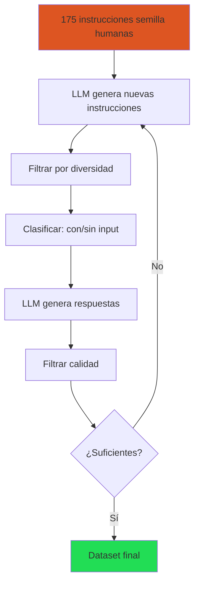
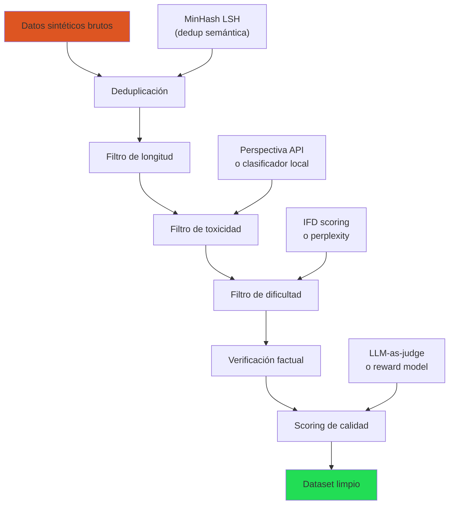
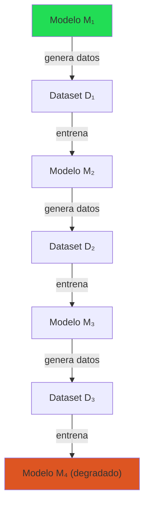

# Datos Sintéticos para Entrenamiento de LLMs

> [!abstract] Resumen
> La generación de *datos sintéticos* (*synthetic data*) con LLMs se ha convertido en una ==técnica fundamental para crear datasets de entrenamiento== cuando los datos humanos son escasos, costosos o insuficientes. Métodos como *Evol-Instruct*, *Self-Instruct* y *distillation* permiten generar cientos de miles de ejemplos a partir de modelos potentes. Sin embargo, existen ==riesgos reales de colapso del modelo== cuando se entrena exclusivamente con datos generados por IA. Esta nota cubre las técnicas principales, herramientas de filtrado, casos de uso y las precauciones necesarias. ^resumen

---

## ¿Por qué datos sintéticos?

### El problema de los datos

El fine-tuning requiere datos de calidad, pero obtenerlos es costoso:

| Fuente de datos | Costo por ejemplo | Calidad | Escalabilidad |
|---|---|---|---|
| Expertos humanos | $5-50 | ==Máxima== | Baja |
| Crowd workers | $0.50-5 | Variable | Media |
| Datos existentes (web) | ~$0 | Baja-Media | ==Alta== |
| ==Datos sintéticos (LLM)== | ==$0.001-0.10== | Media-Alta | ==Alta== |

> [!info] La economía de los datos sintéticos
> Generar 10,000 pares instrucción-respuesta con GPT-4o cuesta aproximadamente ==$50-200==. El mismo volumen con anotadores humanos expertos costaría ==$50,000-500,000==. Esta diferencia de 100-1000× ha hecho de los datos sintéticos el método dominante.

### Casos de uso legítimos

1. **Bootstrapping**: Arrancar un proyecto sin datos iniciales
2. **Aumento de datos**: Expandir un dataset pequeño de alta calidad
3. **Adaptación de dominio**: Generar datos en dominios especializados (legal, médico)
4. **Clases minoritarias**: Balancear datasets desequilibrados
5. **Instrucciones complejas**: Generar tareas que humanos tardarían mucho en crear
6. **Multi-idioma**: Generar datos en idiomas con pocos recursos

---

## Técnicas de generación

### Self-Instruct

*Self-Instruct*[^1] fue el primer método exitoso de generación masiva:



> [!tip] Claves del Self-Instruct
> - Diversidad de semillas → diversidad del dataset resultante
> - Filtrar instrucciones similares con ROUGE-L > 0.7
> - Clasificar instrucciones como "con input" (ej. "Resume este texto: {input}") o "sin input" (ej. "¿Cuál es la capital de Francia?")
> - La temperatura del LLM genera afecta diversidad vs calidad

### Evol-Instruct (WizardLM)

*Evol-Instruct*[^2] evoluciona instrucciones simples hacia versiones más complejas de forma iterativa. Existen dos tipos de evolución:

**Evolución en profundidad** (*depth evolution*):
- Añadir restricciones
- Profundizar en razonamiento
- Concretizar con detalles
- Aumentar pasos de resolución
- Complicar el input

**Evolución en amplitud** (*breadth evolution*):
- Generar variaciones temáticas
- Cambiar el dominio
- Alterar el formato de salida

> [!example]- Ejemplo completo de Evol-Instruct
> ```python
> DEPTH_PROMPTS = {
>     "constraints": """Reescribe la siguiente instrucción añadiendo
> al menos 2 restricciones adicionales que la hagan más desafiante.
>
> Instrucción original: {instruction}
>
> Instrucción evolucionada:""",
>
>     "deepening": """Reescribe la siguiente instrucción para que
> requiera un razonamiento más profundo y conocimiento más especializado.
>
> Instrucción original: {instruction}
>
> Instrucción evolucionada:""",
>
>     "concretizing": """Reescribe la siguiente instrucción
> reemplazando conceptos generales con casos específicos y concretos.
>
> Instrucción original: {instruction}
>
> Instrucción evolucionada:""",
>
>     "reasoning": """Reescribe la siguiente instrucción para que
> requiera razonamiento multi-paso explícito.
>
> Instrucción original: {instruction}
>
> Instrucción evolucionada:""",
> }
>
> def evolve_instruction(instruction, model="gpt-4o", depth=3):
>     """Evoluciona una instrucción a través de múltiples niveles."""
>     current = instruction
>     history = [current]
>
>     for level in range(depth):
>         # Elegir tipo de evolución aleatoriamente
>         evo_type = random.choice(list(DEPTH_PROMPTS.keys()))
>         prompt = DEPTH_PROMPTS[evo_type].format(instruction=current)
>
>         response = client.chat.completions.create(
>             model=model,
>             messages=[{"role": "user", "content": prompt}],
>             temperature=0.7,
>         )
>         current = response.choices[0].message.content
>         history.append(current)
>
>     return {
>         "original": instruction,
>         "evolved": current,
>         "levels": history,
>         "depth": depth,
>     }
>
> # Ejemplo
> result = evolve_instruction(
>     "Escribe una función Python que ordene una lista"
> )
> # Nivel 0: Escribe una función Python que ordene una lista
> # Nivel 1: Escribe una función Python que ordene una lista de
> #           diccionarios por múltiples claves, soportando orden
> #           ascendente y descendente por clave
> # Nivel 2: Implementa un sistema de ordenamiento para una lista
> #           de diccionarios anidados con claves arbitrarias,
> #           soportando orden mixto, valores None, y tipos mixtos,
> #           con complejidad O(n log n) garantizada
> # Nivel 3: Diseña una biblioteca de consultas tipo SQL para
> #           colecciones Python que soporte ORDER BY con múltiples
> #           columnas, expresiones calculadas, manejo de NULL, ...
> ```

### Distillation de datos

Usar un modelo grande (*teacher*) para generar datos que entrenen uno pequeño (*student*):

| Teacher | Student | Caso de uso |
|---|---|---|
| GPT-4o | Llama 3.1 8B | Calidad máxima → modelo desplegable |
| Claude 3.5 | Mistral 7B | Razonamiento → modelo local |
| Llama 405B | Llama 8B | ==Open-source end-to-end== |
| Qwen 72B | Qwen 7B | Misma familia, open-source |

> [!danger] Restricciones legales de distillation
> - **OpenAI**: Los ToS prohíben usar salidas para entrenar modelos competidores
> - **Anthropic**: Restricciones similares en sus ToS
> - **Google**: Gemini tiene restricciones en ciertos tiers
> - **Open-source**: ==Sin restricciones== → Llama, Qwen, Mistral (verificar licencia específica)
>
> Para proyectos comerciales, usa solo modelos open-source como teachers. Ver [[distillation]] para más detalle.

---

## Filtrado de calidad

La generación sintética produce datos de calidad variable. El filtrado es ==tan importante como la generación misma==.

### Pipeline de filtrado



### Técnicas de filtrado

#### Deduplicación

> [!warning] Duplicados semánticos
> Los LLMs tienden a generar variaciones de las mismas respuestas. La deduplicación exacta no basta — se necesita ==deduplicación semántica==:
> - **MinHash LSH**: Rápido, detecta duplicados a nivel de n-gramas
> - **Embeddings + clustering**: Más preciso, detecta paráfrasis
> - **Umbral ROUGE-L > 0.7**: Buena heurística para filtrar similares

#### Scoring de dificultad

IFD (*Instruction Following Difficulty*) mide cuánto le cuesta al modelo seguir cada instrucción:

$$IFD(x, y) = \frac{PPL(y | x)}{PPL(y)}$$

- IFD alto → instrucciones que el modelo no sabe hacer bien → ==más valiosas para entrenamiento==
- IFD bajo → instrucciones triviales → menos útiles

#### LLM-as-Judge para calidad

> [!example]- Prompt para LLM-as-Judge de calidad
> ```python
> QUALITY_JUDGE_PROMPT = """Evalúa la calidad de la siguiente
> respuesta en una escala de 1 a 5.
>
> Criterios:
> - Precisión factual (¿es correcta?)
> - Completitud (¿responde todo lo preguntado?)
> - Claridad (¿es comprensible?)
> - Formato (¿está bien estructurada?)
> - Utilidad (¿es prácticamente útil?)
>
> Instrucción: {instruction}
>
> Respuesta: {response}
>
> Devuelve SOLO un JSON:
> {{"score": <1-5>, "reasoning": "<breve justificación>"}}"""
>
> def score_quality(instruction, response, model="gpt-4o-mini"):
>     prompt = QUALITY_JUDGE_PROMPT.format(
>         instruction=instruction,
>         response=response,
>     )
>     result = client.chat.completions.create(
>         model=model,
>         messages=[{"role": "user", "content": prompt}],
>         temperature=0.0,
>         response_format={"type": "json_object"},
>     )
>     return json.loads(result.choices[0].message.content)
>
> # Filtrar: quedarse solo con score >= 4
> ```

#### Filtrado de toxicidad

| Herramienta | Tipo | Costo | Precisión |
|---|---|---|---|
| Perspectiva API (Google) | API | Gratis (límites) | Alta |
| HateBERT | Local | ==Gratis== | Media-Alta |
| Llama Guard | Local | ==Gratis== | ==Alta== |
| OpenAI Moderation | API | Gratis (con API key) | Alta |

---

## Riesgo: colapso del modelo

### ¿Qué es el colapso?

Cuando un modelo se entrena con datos generados por modelos similares, puede entrar en un ==ciclo degenerativo== donde la calidad se degrada progresivamente[^3]:



> [!danger] Model collapse: señales de alerta
> - **Pérdida de diversidad**: Las respuestas se vuelven más uniformes y genéricas
> - **Pérdida de colas**: Los casos raros o inusuales desaparecen de la distribución
> - **Convergencia estilística**: Todo se "lee igual"
> - **Degradación factual**: Más errores acumulativos con cada generación
> - **Repetición de patrones**: Frases, estructuras y formatos repetitivos

### Mitigaciones

> [!success] Cómo evitar el colapso
> 1. ==Siempre mezclar datos sintéticos con datos humanos== (al menos 10-20% humanos)
> 2. Usar modelos teacher significativamente más potentes que el student
> 3. Diversificar fuentes: múltiples modelos teacher, múltiples prompts
> 4. Filtrar agresivamente: calidad > cantidad
> 5. Monitorear métricas de diversidad (entropy, n-gram diversity)
> 6. Evaluar en benchmarks generales para detectar degradación → [[evaluacion-fine-tuning]]
> 7. Limitar iteraciones: no usar el output de un modelo para entrenar el siguiente

---

## Herramientas

### Argilla

*Argilla*[^4] es una plataforma open-source para ==curación y anotación de datos== de NLP/LLM:

- Interfaz web para revisar, anotar y filtrar datos
- Integración con Hugging Face Datasets
- Soporte para flujos de trabajo de anotación con múltiples anotadores
- Métricas de acuerdo inter-anotador
- Ideal para la fase de verificación humana post-generación

> [!tip] Argilla para datos sintéticos
> El flujo recomendado:
> 1. Generar datos sintéticos con LLM
> 2. Importar a Argilla
> 3. Revisar y filtrar con anotadores humanos
> 4. Exportar dataset curado
> 5. Entrenar con [[lora-qlora|LoRA/QLoRA]]

### distilabel

*distilabel*[^5] (de Argilla/Hugging Face) es un framework para ==generación de datos sintéticos a escala==:

> [!example]- Pipeline de distilabel
> ```python
> from distilabel.llms import InferenceEndpointsLLM
> from distilabel.pipeline import Pipeline
> from distilabel.steps import LoadDataFromHub
> from distilabel.steps.tasks import TextGeneration, UltraFeedback
>
> # Definir pipeline
> with Pipeline(name="synthetic-data") as pipeline:
>     # Paso 1: Cargar semillas
>     load = LoadDataFromHub(
>         name="load_seeds",
>         repo_id="my-org/seed-instructions",
>         split="train",
>     )
>
>     # Paso 2: Generar respuestas
>     generate = TextGeneration(
>         name="generate",
>         llm=InferenceEndpointsLLM(
>             model_id="meta-llama/Llama-3.1-70B-Instruct",
>             tokenizer_id="meta-llama/Llama-3.1-70B-Instruct",
>         ),
>         system_prompt="Responde de forma precisa, completa y útil.",
>         num_generations=4,  # 4 respuestas por instrucción
>     )
>
>     # Paso 3: Evaluar calidad (UltraFeedback style)
>     evaluate = UltraFeedback(
>         name="evaluate",
>         llm=InferenceEndpointsLLM(
>             model_id="meta-llama/Llama-3.1-70B-Instruct",
>         ),
>         aspect="overall-rating",
>     )
>
>     # Conectar pasos
>     load >> generate >> evaluate
>
> # Ejecutar
> distiset = pipeline.run()
>
> # Exportar a Hugging Face Hub
> distiset.push_to_hub("my-org/synthetic-dataset")
> ```

### Otras herramientas

| Herramienta | Función | Ventaja |
|---|---|---|
| ==distilabel== | Generación + evaluación pipeline | ==End-to-end, escalable== |
| ==Argilla== | Curación + anotación | ==UI web, colaborativo== |
| Magpie | Generación de instrucciones | Instrucciones de Llama 3 |
| Genstruct | Generación estructurada | Control fino del formato |
| DataDreamer | Pipeline experimental | Flexibilidad |

---

## Generación de datos de preferencia

Para [[dpo-alternativas|DPO]] y métodos de alineación se necesitan pares (chosen, rejected):

### Método 1: Múltiples generaciones + ranking

1. Para cada prompt, generar N respuestas (N=4-8) con alta temperatura
2. Un modelo juez (o humano) rankea las respuestas
3. La mejor es "chosen", la peor es "rejected"

### Método 2: Modelos de diferente calidad

1. Modelo potente (GPT-4o) genera "chosen"
2. Modelo más débil (GPT-3.5 o modelo pequeño) genera "rejected"

### Método 3: Perturbación controlada

1. Generar respuesta de alta calidad
2. Degradar intencionalmente: introducir errores, reducir calidad, cambiar estilo

> [!question] ¿Cuál es el mejor método?
> - **Método 1**: Más natural, pero costoso (N× generaciones)
> - **Método 2**: Eficiente, pero el contraste puede ser artificial
> - **Método 3**: Control preciso, pero puede no reflejar errores naturales
> - **Recomendación**: Método 1 con ==4 generaciones y LLM-as-judge== es el mejor balance

---

## Métricas de calidad del dataset

| Métrica | Qué mide | Umbral recomendado |
|---|---|---|
| N-gram diversity | Variedad léxica | > 0.8 (distinct-2) |
| Embedding similarity (promedio) | Diversidad semántica | < 0.7 (entre pares) |
| Longitud promedio respuesta | Verbosidad | 150-500 tokens |
| IFD promedio | Dificultad | > 1.5 |
| LLM judge score promedio | Calidad | ==≥ 4.0 / 5.0== |
| Tasa de duplicados | Redundancia | ==< 5%== |
| Cobertura de categorías | Balance temático | Distribución uniforme |

---

## Relación con el ecosistema

- **[[intake-overview|intake]]**: Los requisitos normalizados por intake definen qué tipos de datos sintéticos generar. Los parsers de intake extraen especificaciones de dominio, formato y restricciones que informan directamente los prompts de generación. Un requisito como "el modelo debe responder en formato legal argentino" se traduce en instrucciones de generación específicas.

- **[[architect-overview|architect]]**: Architect puede automatizar pipelines de generación de datos sintéticos mediante sus pipelines YAML. El *Ralph Loop* puede iterar: generar datos → entrenar → evaluar → ajustar generación. El tracking de costos de architect es esencial para monitorear el gasto en APIs de generación.

- **[[vigil-overview|vigil]]**: Vigil puede escanear datasets sintéticos antes del entrenamiento para detectar contenido problemático. Sus reglas de detección de *slopsquatting* son relevantes para datos de código sintético. También verifica que los datos generados no contengan *placeholder secrets* o patrones de seguridad débil.

- **[[licit-overview|licit]]**: La proveniencia de datos sintéticos es un área gris legal. Licit documenta la cadena completa: qué modelo generó los datos, con qué licencia, qué filtros se aplicaron. Esencial para compliance con EU AI Act que requiere documentación de datos de entrenamiento.

---

## Enlaces y referencias

> [!quote]- Bibliografía
> - Wang, Y., et al. (2022). *Self-Instruct: Aligning Language Models with Self-Generated Instructions*. ACL 2023[^1]
> - Xu, C., et al. (2023). *WizardLM: Empowering Large Language Models to Follow Complex Instructions*. arXiv:2304.12244[^2]
> - Shumailov, I., et al. (2023). *The Curse of Recursion: Training on Generated Data Makes Models Forget*. arXiv:2305.17493[^3]
> - Argilla Team. *Argilla: Open-source data curation platform for LLMs*. GitHub[^4]
> - Argilla Team. *distilabel: An AI Feedback (AIF) framework for building datasets*. GitHub[^5]
> - Zhou, C., et al. (2023). *LIMA: Less Is More for Alignment*. NeurIPS 2023
> - [[instruction-tuning|Nota: Instruction Tuning]]
> - [[distillation|Nota: Destilación de Conocimiento]]
> - [[evaluacion-fine-tuning|Nota: Evaluación de Fine-Tuning]]

[^1]: Wang, Y., et al. "Self-Instruct: Aligning Language Models with Self-Generated Instructions." ACL 2023.
[^2]: Xu, C., et al. "WizardLM: Empowering Large Language Models to Follow Complex Instructions." arXiv:2304.12244, 2023.
[^3]: Shumailov, I., et al. "The Curse of Recursion: Training on Generated Data Makes Models Forget." arXiv:2305.17493, 2023.
[^4]: Argilla Team. "Argilla: Open-source data curation platform for LLMs." https://github.com/argilla-io/argilla
[^5]: Argilla Team. "distilabel: An AI Feedback framework." https://github.com/argilla-io/distilabel
