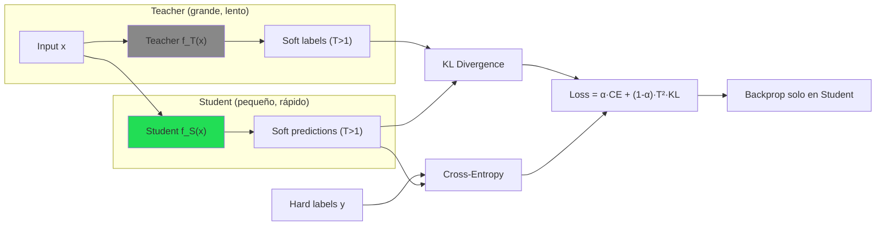
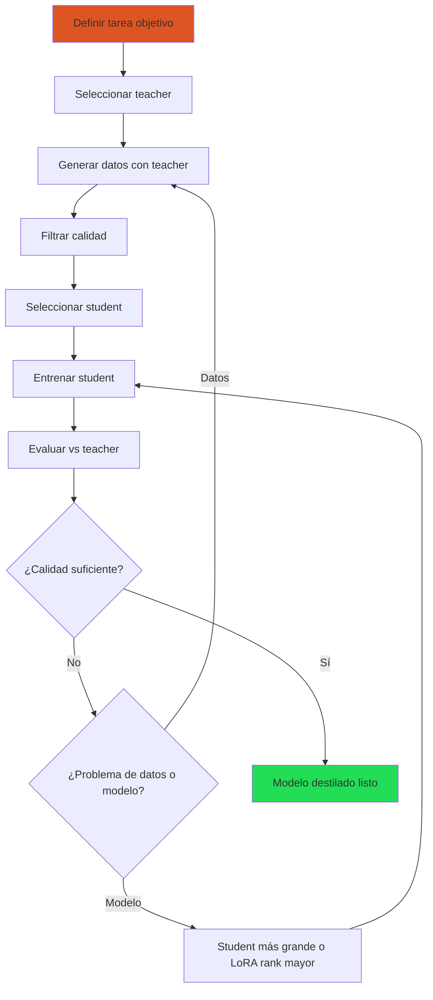
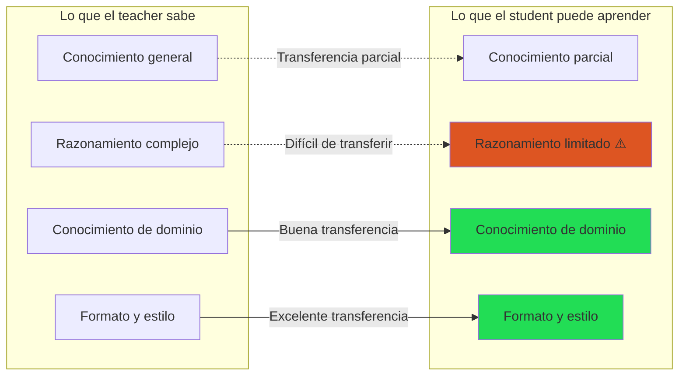

# Destilación de Conocimiento para LLMs

> [!abstract] Resumen
> La *knowledge distillation* (destilación de conocimiento) transfiere capacidades de un modelo grande (*teacher*) a uno más pequeño (*student*), produciendo modelos ==más eficientes que mantienen buena parte de la calidad del teacher==. Desde la destilación clásica de Hinton (2015) con *soft labels* y *temperature scaling*, hasta la destilación a nivel de secuencia para LLMs, esta nota cubre los métodos principales, ejemplos prácticos, las situaciones donde funciona y donde no, y las ==consideraciones legales== que frecuentemente se ignoran. ^resumen

---

## Fundamentos: el paradigma teacher-student

### La intuición

Un modelo grande (teacher) ha aprendido ==información rica sobre la distribución de datos== que no se captura en las etiquetas duras (hard labels). Por ejemplo, cuando el teacher clasifica una imagen de gato con probabilidades [gato: 0.85, tigre: 0.10, perro: 0.04, león: 0.01], las probabilidades de las clases incorrectas contienen información valiosa: que un gato se parece más a un tigre que a un avión.

Esta información — las *soft labels* — permite al student aprender ==representaciones más ricas con menos datos==.

### Destilación clásica (Hinton 2015)

La formulación original de Hinton et al.[^1]:

$$\mathcal{L}_{KD} = \alpha \cdot \mathcal{L}_{CE}(y, \sigma(z_s)) + (1-\alpha) \cdot T^2 \cdot D_{KL}(\sigma(z_t/T) \| \sigma(z_s/T))$$

Donde:
- $z_t, z_s$ — logits del teacher y student respectivamente
- $T$ — temperatura (*temperature*): suaviza las distribuciones
- $\alpha$ — peso relativo entre la pérdida dura y la blanda
- $\sigma$ — función softmax
- $D_{KL}$ — divergencia Kullback-Leibler

> [!info] El papel de la temperatura
> | Temperatura T | Efecto | Uso |
> |---|---|---|
> | T = 1 | Distribución original (picuda) | Inferencia normal |
> | T = 2-5 | Distribución suavizada | ==Rango recomendado para destilación== |
> | T = 10+ | Distribución casi uniforme | Demasiado suave, pierde información |
>
> La temperatura ==revela las relaciones entre clases== que están ocultas en las distribuciones originales picudas.



---

## Destilación para LLMs

### El cambio de paradigma

Para LLMs, la destilación clásica (comparar distribuciones de logits) es difícil porque:
1. Los vocabularios son enormes (32K-128K tokens) → las distribuciones son de alta dimensión
2. Acceder a los logits del teacher puede ser imposible (APIs)
3. Las secuencias son largas y la pérdida acumulativa es compleja

En la práctica, la destilación de LLMs se hace de tres formas:

### 1. Destilación a nivel de secuencia (más común)

El teacher genera respuestas completas y el student aprende a imitarlas:

$$\mathcal{L}_{seq} = -\sum_{t=1}^{T} \log P_{student}(y_t | y_{<t}, x)$$

donde $y = (y_1, ..., y_T)$ es la respuesta generada por el teacher.

> [!tip] Esto es esencialmente fine-tuning con datos sintéticos
> La destilación a nivel de secuencia es ==técnicamente idéntica a fine-tuning== con [[datos-sinteticos|datos generados por el teacher]]. La diferencia es conceptual: el objetivo explícito es transferir capacidades.

### 2. Destilación de logits (cuando es posible)

Si tienes acceso a los logits del teacher (modelos open-source):

$$\mathcal{L}_{logit} = D_{KL}(P_{teacher}(\cdot|x, y_{<t}) \| P_{student}(\cdot|x, y_{<t}))$$

> [!success] Ventajas de la destilación de logits
> - ==Más información por ejemplo== que la destilación de secuencia
> - Permite al student aprender las incertidumbres del teacher
> - Mejor calibración del modelo resultante
> - Converge más rápido con menos datos

### 3. Destilación por cadena de pensamiento (CoT distillation)

El teacher genera razonamientos explícitos (*chain-of-thought*) que el student aprende a replicar:

```
Teacher input:  "¿Cuánto es 17 × 23?"
Teacher output: "Primero, 17 × 20 = 340. Luego, 17 × 3 = 51.
                 Finalmente, 340 + 51 = 391."

Student aprende: tanto el proceso como la respuesta
```

> [!info] CoT distillation mejora el razonamiento
> Los modelos destilados con CoT ==razonan significativamente mejor== que los destilados solo con respuestas finales[^2]. El "pensamiento" del teacher actúa como supervisión intermedia que guía el razonamiento del student.

---

## Configuraciones prácticas de destilación

### Teacher → Student: combinaciones comunes

| Teacher | Student | Ratio tamaño | Caso de uso |
|---|---|---|---|
| GPT-4o | Llama 3.1 8B | ~200:1 | Calidad máxima → local |
| Claude 3.5 Sonnet | Mistral 7B | ~150:1 | Razonamiento → local |
| Llama 3.1 405B | Llama 3.1 8B | ==50:1== | ==Open-source end-to-end== |
| Qwen 2.5 72B | Qwen 2.5 7B | 10:1 | Misma familia |
| Modelo fine-tuned 70B | Modelo base 7B | 10:1 | Especialización eficiente |

> [!tip] Regla práctica: ratio 5-50×
> La destilación funciona mejor cuando el teacher es ==5-50× más grande== que el student. Con ratios menores, el student tiene capacidad similar y no gana mucho. Con ratios mayores, la brecha es demasiado grande para cerrar.

### Pipeline completo de destilación



### Volumen de datos

| Complejidad de tarea | Datos necesarios | Ejemplo |
|---|---|---|
| Simple (clasificación) | 1K-5K ejemplos | Sentiment analysis |
| Media (extracción) | 5K-20K ejemplos | NER, resumen |
| Compleja (generación) | ==20K-100K ejemplos== | Chat general, código |
| Muy compleja (razonamiento) | 100K-500K+ ejemplos | Matemáticas, razonamiento multi-paso |

---

## Cuándo funciona y cuándo no

### Funciona bien cuando

> [!success] Escenarios favorables para destilación
> 1. **Tarea específica y bien definida**: Clasificación, extracción, formato concreto
> 2. **Teacher significativamente mejor**: Brecha de calidad clara entre teacher y student base
> 3. **Datos suficientes y diversos**: El teacher genera datos que cubren la distribución
> 4. **Dominio acotado**: Médico, legal, financiero — dominios especializados
> 5. **Inferencia es el cuello de botella**: El costo de correr el teacher en producción es prohibitivo

### No funciona bien cuando

> [!failure] Escenarios desfavorables
> 1. **Capacidad general**: Destilar "ser inteligente en todo" es mucho más difícil que destilar una tarea
> 2. **Razonamiento emergente**: Capacidades que emergen solo en modelos grandes no se transfieren fácilmente
> 3. **Student demasiado pequeño**: Un modelo de 1B no puede replicar GPT-4o en tareas complejas
> 4. **Datos insuficientes**: Sin diversidad, el student memoriza en lugar de generalizar
> 5. **Teacher mediocre**: Si el teacher no es bueno en la tarea, la destilación amplifica sus errores

### El problema del "capability gap"



> [!warning] Razonamiento no se destila fácilmente
> Las capacidades de razonamiento que emergen en modelos grandes (>70B) son ==notoriamente difíciles de transferir== a modelos pequeños (<10B). CoT distillation ayuda pero no cierra la brecha completamente.

---

## Consideraciones legales y ToS

> [!danger] Restricciones críticas de Terms of Service
> Muchas APIs de LLMs prohíben explícitamente usar sus salidas para entrenar modelos competidores:
>
> | Proveedor | ¿Permite destilación? | Detalle |
> |---|---|---|
> | **OpenAI** | ==No para competidores== | ToS §2(c): no usar outputs para entrenar modelos que compitan |
> | **Anthropic** | ==No para competidores== | Acceptable Use Policy: restricciones similares |
> | **Google (Gemini)** | Varía por tier | Enterprise: más flexible. Free: restrictivo |
> | **Meta (Llama)** | ==Sí, con restricciones== | Licencia permite, excepto para modelos >700M de otros labs |
> | **Mistral** | ==Sí== | Apache 2.0 (modelos abiertos) |
> | **Qwen (Alibaba)** | ==Sí== | Apache 2.0 o similar |

> [!tip] Ruta segura: open-source end-to-end
> Para evitar problemas legales:
> 1. Usa un teacher ==open-source con licencia permisiva== (Llama, Qwen, Mistral)
> 2. Verifica la licencia específica de la versión del modelo
> 3. Documenta la cadena de proveniencia → [[licit-overview|licit]]
> 4. Consulta a legal antes de comercializar modelos destilados

---

## Implementación

> [!example]- Destilación a nivel de secuencia con TRL
> ```python
> from transformers import AutoModelForCausalLM, AutoTokenizer
> from trl import SFTConfig, SFTTrainer
> from peft import LoraConfig
> from datasets import load_dataset
> import torch
>
> # --- Paso 1: Generar datos con el teacher ---
> teacher_name = "meta-llama/Llama-3.1-70B-Instruct"
> teacher = AutoModelForCausalLM.from_pretrained(
>     teacher_name,
>     device_map="auto",
>     torch_dtype=torch.bfloat16,
> )
> teacher_tokenizer = AutoTokenizer.from_pretrained(teacher_name)
>
> def generate_teacher_data(prompts, teacher, tokenizer):
>     """Genera datos de destilación usando el teacher."""
>     results = []
>     for prompt in prompts:
>         messages = [
>             {"role": "system", "content": "Responde de forma precisa y útil."},
>             {"role": "user", "content": prompt},
>         ]
>         inputs = tokenizer.apply_chat_template(
>             messages, return_tensors="pt", add_generation_prompt=True
>         ).to("cuda")
>
>         outputs = teacher.generate(
>             inputs, max_new_tokens=1024,
>             temperature=0.7, do_sample=True,
>         )
>         response = tokenizer.decode(
>             outputs[0][inputs.shape[1]:], skip_special_tokens=True
>         )
>         results.append({
>             "prompt": prompt,
>             "response": response,
>             "messages": messages + [{"role": "assistant", "content": response}]
>         })
>     return results
>
> # Liberar teacher de memoria
> del teacher
> torch.cuda.empty_cache()
>
> # --- Paso 2: Entrenar el student ---
> student_name = "meta-llama/Llama-3.1-8B-Instruct"
> student = AutoModelForCausalLM.from_pretrained(
>     student_name,
>     device_map="auto",
>     torch_dtype=torch.bfloat16,
>     attn_implementation="flash_attention_2",
> )
> student_tokenizer = AutoTokenizer.from_pretrained(student_name)
>
> # LoRA para eficiencia
> lora_config = LoraConfig(
>     r=32,
>     lora_alpha=64,
>     target_modules=["q_proj", "k_proj", "v_proj", "o_proj"],
>     lora_dropout=0.05,
>     bias="none",
>     task_type="CAUSAL_LM",
> )
>
> # Dataset de destilación (generado en paso 1)
> dataset = load_dataset("json", data_files="teacher_data.jsonl")
>
> training_args = SFTConfig(
>     output_dir="./distilled-student",
>     num_train_epochs=3,
>     per_device_train_batch_size=4,
>     gradient_accumulation_steps=4,
>     learning_rate=2e-4,
>     lr_scheduler_type="cosine",
>     warmup_ratio=0.05,
>     bf16=True,
>     gradient_checkpointing=True,
>     logging_steps=10,
>     save_strategy="steps",
>     save_steps=200,
>     max_seq_length=2048,
> )
>
> trainer = SFTTrainer(
>     model=student,
>     args=training_args,
>     train_dataset=dataset["train"],
>     tokenizer=student_tokenizer,
>     peft_config=lora_config,
> )
>
> trainer.train()
> trainer.save_model("./distilled-adapter")
> ```

---

## Destilación vs alternativas

| Técnica | Costo | Calidad | Complejidad | Latencia resultado |
|---|---|---|---|---|
| ==Destilación== | Medio (generación + entrenamiento) | ==Alta para tarea específica== | Media | Baja (modelo pequeño) |
| RAG | Bajo (no entrena) | Variable | Baja-Media | ==Media== (retrieval) |
| Prompt engineering | ==Bajo== | Limitada | Baja | ==Depende del modelo== |
| [[lora-qlora\|LoRA]] con datos propios | Medio | Alta | Media | Baja |
| [[merging-models\|Model merging]] | ==Muy bajo== | Variable | Baja | Baja |
| Usar teacher directamente | Alto (por token) | ==Máxima== | Baja | Alta (modelo grande) |

> [!question] ¿Destilación o fine-tuning con datos propios?
> - Si tienes datos etiquetados propios de alta calidad → fine-tuning directo
> - Si NO tienes datos pero un teacher puede generarlos → ==destilación==
> - Si tienes ALGUNOS datos → combina: datos propios + datos del teacher
> - La combinación suele dar los ==mejores resultados==

---

## Relación con el ecosistema

- **[[intake-overview|intake]]**: Los requisitos normalizados por intake especifican las capacidades objetivo del modelo destilado y las restricciones de latencia/costo que motivan la destilación. Los parsers de intake pueden extraer cuáles son las tareas que el student debe dominar.

- **[[architect-overview|architect]]**: Architect automatiza el pipeline de destilación: generar datos con el teacher, filtrar, entrenar el student, evaluar. LiteLLM permite usar cualquier teacher (open-source o API). Los pipelines YAML definen el flujo completo. El cost tracking es esencial para comparar el costo de destilación vs usar el teacher directamente.

- **[[vigil-overview|vigil]]**: Vigil escanea las salidas del modelo destilado para verificar que no haya heredado vulnerabilidades del teacher. Es especialmente importante porque la destilación puede ==transferir patrones problemáticos== como *slopsquatting* en código o *placeholder secrets*.

- **[[licit-overview|licit]]**: La proveniencia del modelo destilado debe documentarse completamente: qué teacher se usó, con qué licencia, qué datos se generaron. Licit rastrea esta cadena y verifica compliance con las ToS del teacher y con regulaciones como el EU AI Act. El tracking de proveniencia es ==crítico para uso comercial==.

---

## Enlaces y referencias

> [!quote]- Bibliografía
> - Hinton, G., Vinyals, O., & Dean, J. (2015). *Distilling the Knowledge in a Neural Network*. arXiv:1503.02531[^1]
> - Ho, N., & Vasconcelos, N. (2024). *Large Language Models Are Reasoning Teachers*. ACL 2024[^2]
> - Kim, Y., & Rush, A. (2016). *Sequence-Level Knowledge Distillation*. EMNLP 2016[^3]
> - Xu, C., et al. (2024). *A Survey on Knowledge Distillation of Large Language Models*. arXiv:2402.13116
> - Gu, Y., et al. (2024). *MiniLLM: Knowledge Distillation of Large Language Models*. ICLR 2024
> - [[datos-sinteticos|Nota: Datos Sintéticos]]
> - [[fine-tuning-overview|Nota: Fine-Tuning Visión General]]
> - [[lora-qlora|Nota: LoRA y QLoRA]]

[^1]: Hinton, G., Vinyals, O., & Dean, J. "Distilling the Knowledge in a Neural Network." arXiv:1503.02531, 2015.
[^2]: Ho, N., & Vasconcelos, N. "Large Language Models Are Reasoning Teachers." ACL 2024.
[^3]: Kim, Y., & Rush, A. "Sequence-Level Knowledge Distillation." EMNLP 2016.
