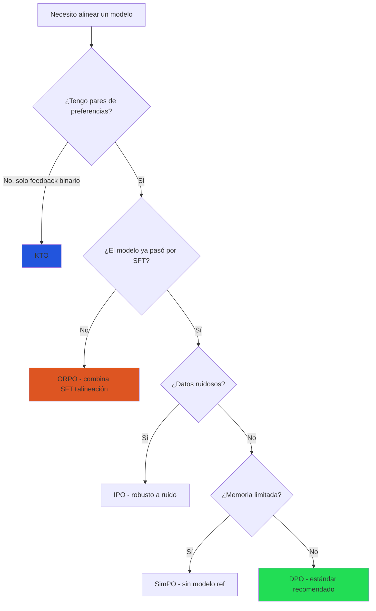
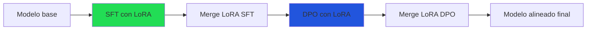

# DPO y Alternativas a RLHF

> [!abstract] Resumen
> *Direct Preference Optimization* (DPO) elimina la necesidad de un *reward model* explícito al ==reformular el problema de alineación como una tarea de clasificación supervisada==. Desde su publicación en 2023, DPO y sus variantes (ORPO, KTO, SimPO, IPO) se han convertido en las ==alternativas dominantes a RLHF== para alinear modelos de lenguaje. Esta nota cubre la derivación matemática de cada método, cuándo usar cada uno, implementaciones prácticas y comparaciones de calidad. ^resumen

---

## DPO: Direct Preference Optimization

### Motivación

[[rlhf|RLHF]] es poderoso pero complejo: requiere entrenar un *reward model* separado, mantener cuatro modelos en memoria y lidiar con la inestabilidad de PPO. DPO[^1] propone: ==¿y si pudiéramos saltarnos el reward model completamente?==

### Derivación matemática

Partimos del objetivo de RLHF con restricción KL:

$$\max_{\pi} \mathbb{E}_{x, y \sim \pi} [r(x, y)] - \beta D_{KL}[\pi(y|x) \| \pi_{ref}(y|x)]$$

La solución óptima cerrada de este problema es:

$$\pi^*(y|x) = \frac{1}{Z(x)} \pi_{ref}(y|x) \exp\left(\frac{r(x,y)}{\beta}\right)$$

Despejando $r(x,y)$:

$$r(x,y) = \beta \log \frac{\pi^*(y|x)}{\pi_{ref}(y|x)} + \beta \log Z(x)$$

Sustituyendo en la función de pérdida Bradley-Terry:

$$\mathcal{L}_{DPO}(\pi_\theta; \pi_{ref}) = -\mathbb{E}_{(x, y_w, y_l)} \left[ \log \sigma \left( \beta \log \frac{\pi_\theta(y_w|x)}{\pi_{ref}(y_w|x)} - \beta \log \frac{\pi_\theta(y_l|x)}{\pi_{ref}(y_l|x)} \right) \right]$$

> [!info] Interpretación intuitiva
> DPO ==incrementa la probabilidad de la respuesta preferida y decrementa la de la no preferida==, pero relativo al modelo de referencia. Esto evita que el modelo cambie demasiado (equivalente implícito de la penalización KL en RLHF).

### Ventajas sobre RLHF

| Aspecto | RLHF | ==DPO== |
|---|---|---|
| Modelos en memoria | 4 (política, ref, RM, value) | ==2 (política, ref)== |
| Estabilidad | Baja (PPO es inestable) | ==Alta (clasificación supervisada)== |
| Complejidad de código | Alta | ==Baja (una función de pérdida)== |
| Hiperparámetros | Muchos (PPO + KL + RM) | ==Pocos (β principal)== |
| Cómputo | 3 fases secuenciales | ==1 fase== |
| Calidad | Referencia | Comparable o superior |

### Hiperparámetro β

El único hiperparámetro crítico de DPO controla qué tan lejos puede alejarse del modelo de referencia:

| β | Comportamiento | Caso de uso |
|---|---|---|
| 0.01 | Cambios agresivos, riesgo de inestabilidad | Datos de alta calidad, cambios grandes |
| ==0.1== | ==Balance recomendado== | ==Mayoría de tareas== |
| 0.5 | Conservador, cambios pequeños | Datos ruidosos, ajustes finos |
| 1.0 | Muy conservador | Preservar comportamiento base |

> [!warning] Sensibilidad a la calidad de datos
> DPO es ==más sensible a datos ruidosos que RLHF==. En RLHF, el RM puede aprender a filtrar ruido; DPO usa los datos directamente. Si tus preferencias tienen bajo acuerdo inter-anotador, considera limpiar los datos agresivamente o usar IPO.

---

## ORPO: Odds Ratio Preference Optimization

### Innovación

ORPO[^2] elimina también el modelo de referencia, combinando SFT y alineación en ==un solo paso de entrenamiento==:

$$\mathcal{L}_{ORPO} = \mathcal{L}_{SFT}(y_w) + \lambda \cdot \mathcal{L}_{OR}$$

donde $\mathcal{L}_{OR}$ es la pérdida basada en la razón de probabilidades (*odds ratio*):

$$\mathcal{L}_{OR} = -\log \sigma \left( \log \frac{P_\theta(y_w|x)}{1 - P_\theta(y_w|x)} - \log \frac{P_\theta(y_l|x)}{1 - P_\theta(y_l|x)} \right)$$

> [!tip] Ventaja clave de ORPO
> - ==No requiere fase SFT separada== — combina SFT + alineación
> - ==No requiere modelo de referencia== — reduce memoria a la mitad vs DPO
> - El entrenamiento es un solo paso end-to-end
> - Especialmente eficiente para nuevos modelos que aún no pasaron por SFT

### Limitaciones

- Menos estudiado que DPO
- Resultados mixtos en modelos grandes (>70B)
- Requiere calibración cuidadosa de $\lambda$

---

## KTO: Kahneman-Tversky Optimization

### Innovación

KTO[^3] se basa en la *prospect theory* de Kahneman y Tversky: los humanos ==sobrepesan las pérdidas respecto a las ganancias==. No requiere pares de preferencias — solo necesita saber si cada respuesta individual es "buena" o "mala".

$$\mathcal{L}_{KTO} = \mathbb{E}_{y_w}[\lambda_w \cdot (1 - v(x, y_w))] + \mathbb{E}_{y_l}[\lambda_l \cdot v(x, y_l)]$$

donde $v$ es una función de valor inspirada en la prospect theory, con aversión a la pérdida asimétrica.

> [!success] Ventajas de KTO
> - ==No necesita pares de preferencias==: solo labels binarios (bueno/malo)
> - Datos mucho más fáciles de recopilar que comparaciones
> - Puede usar datos existentes de thumbs up/down
> - Captura la asimetría humana pérdida > ganancia

> [!question] ¿Cuándo elegir KTO?
> KTO es ideal cuando:
> - Solo tienes feedback binario (aprobado/rechazado)
> - No puedes crear pares de comparación
> - Tus datos vienen de usuarios reales (thumbs up/down)
> - Quieres empezar rápido con datos imperfectos
>
> No lo uses cuando tienes pares de preferencias de alta calidad → DPO será mejor.

---

## SimPO: Simple Preference Optimization

### Innovación

SimPO[^4] simplifica DPO eliminando el modelo de referencia y usando la ==longitud promedio de log-probabilidad== como recompensa implícita:

$$\mathcal{L}_{SimPO} = -\log \sigma \left( \frac{\beta}{|y_w|} \log P_\theta(y_w|x) - \frac{\beta}{|y_l|} \log P_\theta(y_l|x) - \gamma \right)$$

Donde:
- $|y|$ es la longitud de la respuesta (normalización)
- $\gamma$ es un margen que asegura separación entre preferidas y no preferidas

> [!info] ¿Por qué normalizar por longitud?
> Sin normalización, el modelo prefiere respuestas cortas (tienen mayor log-probabilidad promedio). La normalización por longitud ==elimina el sesgo hacia respuestas cortas== y permite comparaciones justas.

### Ventajas

- ==Sin modelo de referencia== → menor uso de memoria
- Normalización por longitud → menos sesgo de verbosidad
- El margen γ → separación más clara entre pares
- Rendimiento competitivo con DPO en benchmarks

---

## IPO: Identity Preference Optimization

IPO[^5] aborda un problema teórico de DPO: la asunción de que las preferencias siguen exactamente el modelo Bradley-Terry. IPO relaja esta asunción:

$$\mathcal{L}_{IPO} = \left( \log \frac{\pi_\theta(y_w|x)}{\pi_{ref}(y_w|x)} - \log \frac{\pi_\theta(y_l|x)}{\pi_{ref}(y_l|x)} - \frac{1}{2\beta} \right)^2$$

> [!tip] Cuándo usar IPO
> IPO es ==más robusto a datos ruidosos== que DPO porque no asume un modelo paramétrico exacto de las preferencias. Si tu dataset tiene bajo acuerdo inter-anotador o es ruidoso, IPO puede dar mejores resultados que DPO.

---

## Comparativa exhaustiva

### Tabla de comparación

| Método | Req. pares | Modelo ref. | Fase SFT sep. | Estabilidad | Datos ruidosos | Complejidad |
|---|---|---|---|---|---|---|
| [[rlhf\|RLHF]] | Sí | Sí (+ RM) | Sí | Baja | Tolera | Alta |
| ==DPO== | Sí | Sí | Sí | ==Alta== | Sensible | ==Baja== |
| ORPO | Sí | ==No== | ==No== | Alta | Sensible | Baja |
| KTO | ==No== | Sí | Sí | Alta | ==Tolera== | Baja |
| SimPO | Sí | ==No== | Sí | Alta | Media | Baja |
| IPO | Sí | Sí | Sí | ==Muy alta== | ==Tolera== | Baja |

### Flujo de decisión



### Benchmark de calidad (MT-Bench, AlpacaEval)

| Método | MT-Bench (7B) | AlpacaEval 2.0 LC | Notas |
|---|---|---|---|
| SFT base | 6.2 | 12% | Sin alineación |
| RLHF | ==7.5== | 22% | Referencia |
| DPO | 7.4 | ==25%== | Comparable, más simple |
| ORPO | 7.1 | 20% | Una sola fase |
| KTO | 7.0 | 18% | Sin pares |
| SimPO | 7.3 | 23% | Sin referencia |
| IPO | 7.2 | 21% | Robusto |

> [!warning] Variabilidad de resultados
> Estos benchmarks varían significativamente según el modelo base, los datos de entrenamiento y los hiperparámetros. ==No hay un ganador universal==. La elección debe basarse en los datos disponibles y las restricciones del proyecto, no solo en benchmarks publicados.

---

## Implementación práctica

> [!example]- DPO con TRL (Hugging Face)
> ```python
> from transformers import AutoModelForCausalLM, AutoTokenizer
> from trl import DPOConfig, DPOTrainer
> from peft import LoraConfig
> from datasets import load_dataset
>
> # Modelo y tokenizer
> model_name = "meta-llama/Llama-3.1-8B-Instruct"
> model = AutoModelForCausalLM.from_pretrained(
>     model_name,
>     torch_dtype=torch.bfloat16,
>     device_map="auto",
> )
> tokenizer = AutoTokenizer.from_pretrained(model_name)
> tokenizer.pad_token = tokenizer.eos_token
>
> # LoRA para eficiencia (DPO + LoRA es la combinación estándar)
> peft_config = LoraConfig(
>     r=16,
>     lora_alpha=32,
>     lora_dropout=0.05,
>     target_modules=["q_proj", "k_proj", "v_proj", "o_proj"],
>     bias="none",
>     task_type="CAUSAL_LM",
> )
>
> # Dataset de preferencias
> # Formato: {"prompt": str, "chosen": str, "rejected": str}
> dataset = load_dataset("json", data_files="preferences.jsonl")
>
> # Configuración DPO
> dpo_config = DPOConfig(
>     output_dir="./dpo-output",
>     beta=0.1,                          # Hiperparámetro principal
>     num_train_epochs=3,
>     per_device_train_batch_size=4,
>     gradient_accumulation_steps=4,
>     learning_rate=5e-7,                # Menor que SFT
>     lr_scheduler_type="cosine",
>     warmup_ratio=0.1,
>     bf16=True,
>     gradient_checkpointing=True,
>     logging_steps=10,
>     save_strategy="steps",
>     save_steps=100,
>     eval_strategy="steps",
>     eval_steps=100,
>     report_to="wandb",
> )
>
> # Trainer
> trainer = DPOTrainer(
>     model=model,
>     args=dpo_config,
>     train_dataset=dataset["train"],
>     eval_dataset=dataset["validation"],
>     tokenizer=tokenizer,
>     peft_config=peft_config,
> )
>
> trainer.train()
> trainer.save_model("./dpo-adapter")
> ```

> [!example]- ORPO con TRL
> ```python
> from trl import ORPOConfig, ORPOTrainer
>
> # ORPO no necesita modelo de referencia ni SFT previo
> orpo_config = ORPOConfig(
>     output_dir="./orpo-output",
>     lambda_orpo=0.1,                   # Peso del odds ratio loss
>     num_train_epochs=3,
>     per_device_train_batch_size=4,
>     gradient_accumulation_steps=4,
>     learning_rate=5e-6,                # Mayor que DPO
>     lr_scheduler_type="cosine",
>     warmup_ratio=0.1,
>     bf16=True,
>     gradient_checkpointing=True,
> )
>
> # Mismo formato de datos que DPO
> trainer = ORPOTrainer(
>     model=model,
>     args=orpo_config,
>     train_dataset=dataset["train"],
>     eval_dataset=dataset["validation"],
>     tokenizer=tokenizer,
>     peft_config=peft_config,
> )
>
> trainer.train()
> ```

### Formato de datos para preferencias

Todos los métodos basados en pares usan el mismo formato:

> [!example]- Formato de datos de preferencias
> ```json
> {
>   "prompt": "¿Cuál es la capital de Francia?",
>   "chosen": "La capital de Francia es París. Es la ciudad más grande del país y el centro político, económico y cultural de Francia. París alberga monumentos icónicos como la Torre Eiffel, el Louvre y la Catedral de Notre-Dame.",
>   "rejected": "Bueno, la capital de Francia es una ciudad muy bonita que se llama París. ¡Es genial! Tiene muchas cosas para ver y hacer. La gente es muy amable y la comida es deliciosa. ¡Deberías visitarla algún día!"
> }
> ```
>
> Para KTO, el formato es diferente (no requiere pares):
> ```json
> {"prompt": "¿Cuál es la capital de Francia?", "completion": "La capital de Francia es París...", "label": true}
> {"prompt": "¿Cuál es la capital de Francia?", "completion": "La capital de Francia es Londres...", "label": false}
> ```

---

## Combinación con otras técnicas

### DPO + LoRA

La combinación de [[lora-qlora|LoRA]] con DPO es el flujo estándar en la práctica:



### DPO + datos sintéticos

Usar [[datos-sinteticos|datos sintéticos]] para generar pares de preferencias es cada vez más común:

1. Generar múltiples respuestas con el modelo
2. Usar un modelo más potente como juez (ej. GPT-4o)
3. El juez rankea las respuestas → pares de preferencias
4. Entrenar DPO con los pares generados

> [!danger] Riesgo: colapso por datos sintéticos
> Si el modelo juez y el modelo entrenado son demasiado similares, existe riesgo de ==feedback loop== y degradación de calidad. Siempre incluye evaluación humana en el loop → [[evaluacion-fine-tuning]].

---

## Relación con el ecosistema

- **[[intake-overview|intake]]**: Los requisitos normalizados por intake pueden especificar el método de alineación preferido y los criterios de preferencia. Los parsers de intake pueden extraer de documentos de diseño qué tipo de respuestas son "preferidas" vs "rechazadas".

- **[[architect-overview|architect]]**: Architect genera los scripts de entrenamiento DPO/ORPO/KTO y orquesta el pipeline completo. Sus pipelines YAML definen las fases (SFT → DPO) con checkpoints y evaluación automática. El tracking de costos compara el costo de cada método. LiteLLM soporta los modelos alineados resultantes.

- **[[vigil-overview|vigil]]**: Post-alineación, vigil verifica que el modelo alineado no tenga regresiones de seguridad. Es especialmente importante verificar que DPO no haya enseñado al modelo a evadir preguntas legítimas (*over-refusal*). Las reglas de vigil detectan patrones de evasión excesiva.

- **[[licit-overview|licit]]**: La documentación del proceso de alineación es requisito del EU AI Act para modelos de alto riesgo. Licit rastrea la proveniencia de los datos de preferencia, documenta el método de alineación usado y genera reportes Annex IV. OWASP Agentic Top 10 también requiere documentar cómo se alineó el modelo.

---

## Enlaces y referencias

> [!quote]- Bibliografía
> - Rafailov, R., et al. (2023). *Direct Preference Optimization: Your Language Model is Secretly a Reward Model*. NeurIPS 2023[^1]
> - Hong, J., et al. (2024). *ORPO: Monolithic Preference Optimization without Reference Model*. arXiv:2403.07691[^2]
> - Ethayarajh, K., et al. (2024). *KTO: Model Alignment as Prospect Theoretic Optimization*. arXiv:2402.01306[^3]
> - Meng, Y., et al. (2024). *SimPO: Simple Preference Optimization with a Reference-Free Reward*. arXiv:2405.14734[^4]
> - Azar, M. G., et al. (2023). *A General Theoretical Paradigm to Understand Learning from Human Feedback (IPO)*. arXiv:2310.12036[^5]
> - [[rlhf|Nota: RLHF en detalle]]
> - [[alignment|Nota: Alignment]]
> - [[datos-sinteticos|Nota: Datos Sintéticos]]

[^1]: Rafailov, R., et al. "Direct Preference Optimization: Your Language Model is Secretly a Reward Model." NeurIPS 2023.
[^2]: Hong, J., et al. "ORPO: Monolithic Preference Optimization without Reference Model." arXiv:2403.07691, 2024.
[^3]: Ethayarajh, K., et al. "KTO: Model Alignment as Prospect Theoretic Optimization." arXiv:2402.01306, 2024.
[^4]: Meng, Y., et al. "SimPO: Simple Preference Optimization with a Reference-Free Reward." arXiv:2405.14734, 2024.
[^5]: Azar, M. G., et al. "A General Theoretical Paradigm to Understand Learning from Human Feedback." arXiv:2310.12036, 2023.
