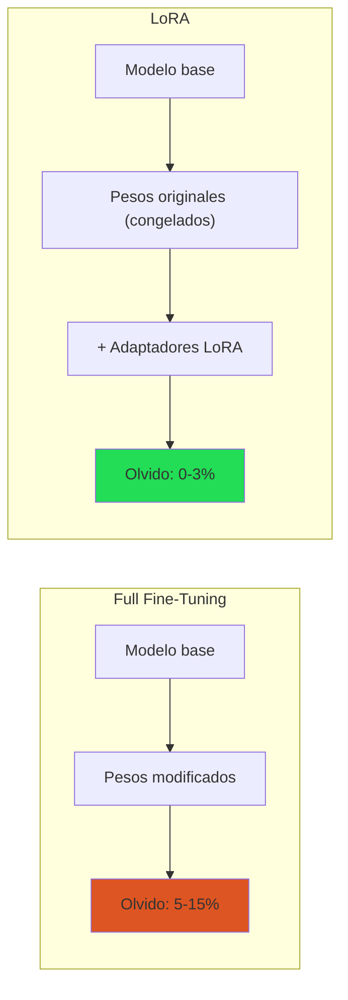
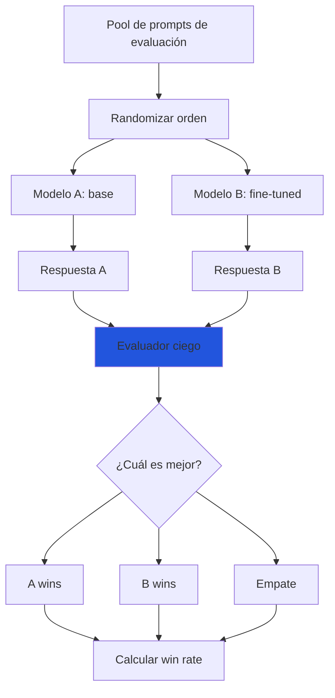
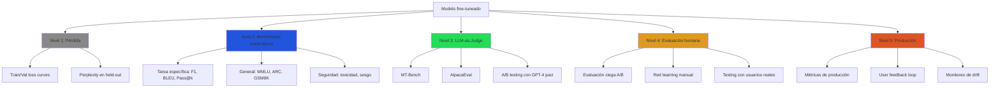

# Evaluación de Modelos Fine-Tuneados

> [!abstract] Resumen
> La evaluación de modelos fine-tuneados es ==la fase más crítica y frecuentemente descuidada== del pipeline de entrenamiento. Un modelo que muestra baja pérdida de entrenamiento puede estar severamente overfitteado, haber olvidado capacidades generales (*catastrophic forgetting*) o haber desarrollado sesgos peligrosos. Esta nota cubre la detección de *overfitting*, la evaluación de [[continual-learning|olvido catastrófico]], las dimensiones de evaluación (tarea, capacidad general, seguridad, sesgo), *A/B testing* y los riesgos de contaminación de benchmarks. ^resumen

---

## ¿Por qué es difícil evaluar LLMs fine-tuneados?

> [!question] El problema fundamental
> A diferencia de la clasificación binaria donde puedes medir accuracy, los LLMs generan texto libre. ¿Cómo evalúas si "La capital de Francia es la ciudad de París, ubicada en la región de Île-de-France" es mejor o peor que "París"? ==No hay una métrica única que capture la calidad de un LLM==.

### Las tres trampas de evaluación

1. **Trampa de la pérdida baja**: Loss de entrenamiento baja ≠ modelo bueno
2. **Trampa del benchmark**: Puntaje alto en benchmark ≠ útil en producción
3. **Trampa de la demostración**: Funciona en la demo ≠ funciona en escala

---

## Detección de overfitting

### Curvas train/val loss

La señal más básica de *overfitting* (sobreajuste):

```
Pérdida │
        │  ╲
        │   ╲ Train loss
        │    ╲────────────────────────── (sigue bajando)
        │     ╲
        │      ──────────────────╱─── Val loss (empieza a subir)
        │                    ╱
        │               ╱───╱
        │          ╱───╱
        │     ╱───╱
        │╱───╱
        └──────────────────────────────── Pasos
                          ↑
                    Punto óptimo
                    (early stopping)
```

> [!tip] Reglas prácticas para detectar overfitting
> - Si val loss sube mientras train loss baja → ==overfitting clásico==
> - Si val loss se estanca mientras train loss baja → overfitting incipiente
> - Si ambos bajan juntos → el entrenamiento sigue siendo productivo
> - Si train loss oscila mucho → learning rate demasiado alto
> - Guardar checkpoint en el ==mínimo de val loss==, no al final

### Métricas de held-out

Más allá de la pérdida, evalúa en un conjunto de evaluación (*held-out set*) que el modelo nunca vio:

| Señal | Qué indica | Acción |
|---|---|---|
| Val loss sube | Overfitting | Reducir épocas, añadir regularización |
| Respuestas verbatim del train | Memorización | Más datos, dropout, reducir lr |
| Calidad perfecta en train, mala en val | Overfitting severo | ==Parar y revisar datos== |
| Rendimiento igual en train y val | Buen ajuste | Continuar o evaluar más profundo |

### Pruebas de memorización

> [!danger] Cómo detectar memorización
> 1. Presenta al modelo ==fragmentos parciales de los datos de entrenamiento==
> 2. Si el modelo completa con el texto exacto del train → memorización
> 3. Prueba con variaciones ligeras del prompt → ¿sigue respondiendo correctamente o se rompe?
> 4. Un modelo que solo funciona con prompts idénticos al training está memorizando, no aprendiendo

---

## Catastrophic forgetting (olvido catastrófico)

### Qué es

El *catastrophic forgetting* ocurre cuando el fine-tuning ==destruye capacidades que el modelo base tenía==. Es el problema central de [[continual-learning|aprendizaje continuo]].

### Cómo detectarlo

Evalúa el modelo fine-tuneado en ==benchmarks generales que no están relacionados con la tarea de fine-tuning==:

| Benchmark | Qué evalúa | Herramienta |
|---|---|---|
| MMLU | Conocimiento general (57 materias) | lm-evaluation-harness |
| ARC-Challenge | Razonamiento científico | lm-evaluation-harness |
| HellaSwag | Sentido común | lm-evaluation-harness |
| GSM8K | Matemáticas (razonamiento) | lm-evaluation-harness |
| HumanEval / MBPP | Código | bigcode-evaluation-harness |
| TruthfulQA | Veracidad | lm-evaluation-harness |
| Winogrande | Resolución de correferencia | lm-evaluation-harness |

> [!warning] Degradación aceptable
> Algo de degradación es ==normal y esperada==. La pregunta es: ¿cuánta es aceptable?
>
> | Degradación | Interpretación | Acción |
> |---|---|---|
> | < 1% | Insignificante | ==Aceptable== |
> | 1-3% | Leve | Aceptable si la tarea mejora significativamente |
> | 3-5% | Moderada | Revisar — ¿vale la pena el trade-off? |
> | > 5% | Severa | ==Reducir fine-tuning==, usar menor lr, menos épocas |
> | > 10% | Catastrófica | Parar. Usar [[lora-qlora\|LoRA]] (reduce forgetting) |

### LoRA reduce el forgetting

Una de las ventajas no intuitivas de [[lora-qlora|LoRA]] es que ==produce significativamente menos olvido catastrófico== que el full fine-tuning, porque los pesos originales quedan intactos:



---

## Dimensiones de evaluación

### 1. Métricas específicas de tarea

Dependiendo de la tarea de fine-tuning:

| Tarea | Métricas | Herramientas |
|---|---|---|
| Generación de texto | BLEU, ROUGE, BERTScore | sacrebleu, rouge-score |
| Clasificación | F1, Precision, Recall, AUC | scikit-learn |
| Extracción | Exact Match, F1 por token | Squad metrics |
| Resumen | ROUGE-L, BERTScore, factualidad | summeval |
| Código | Pass@k, funcional correctness | HumanEval harness |
| Chat | ==MT-Bench, AlpacaEval== | fastchat, alpaca-eval |
| Instrucciones | IFEval (instruction following) | lm-eval-harness |

### 2. Capacidad general

> [!info] Benchmark suites recomendadas
> - **Open LLM Leaderboard**: MMLU, ARC, HellaSwag, Winogrande, GSM8K, TruthfulQA
> - **HELM**: Evaluación holística con 42 escenarios
> - **lm-evaluation-harness**: ==Framework estándar== para ejecutar benchmarks (EleutherAI)

> [!example]- Ejecutar benchmarks con lm-evaluation-harness
> ```bash
> # Instalar
> pip install lm-eval
>
> # Evaluar modelo base (baseline)
> lm_eval --model hf \
>     --model_args pretrained=meta-llama/Llama-3.1-8B-Instruct \
>     --tasks mmlu,arc_challenge,hellaswag,gsm8k \
>     --batch_size 8 \
>     --output_path ./eval-base/
>
> # Evaluar modelo fine-tuneado
> lm_eval --model hf \
>     --model_args pretrained=./my-finetuned-model \
>     --tasks mmlu,arc_challenge,hellaswag,gsm8k \
>     --batch_size 8 \
>     --output_path ./eval-finetuned/
>
> # Evaluar con adaptador LoRA
> lm_eval --model hf \
>     --model_args pretrained=meta-llama/Llama-3.1-8B-Instruct,peft=./lora-adapter \
>     --tasks mmlu,arc_challenge,hellaswag,gsm8k \
>     --batch_size 8 \
>     --output_path ./eval-lora/
>
> # Comparar resultados
> python -c "
> import json, glob
> for path in sorted(glob.glob('./eval-*/results.json')):
>     with open(path) as f:
>         data = json.load(f)
>     name = path.split('/')[1]
>     print(f'{name}:')
>     for task, metrics in data['results'].items():
>         acc = metrics.get('acc_norm,none', metrics.get('acc,none', 'N/A'))
>         print(f'  {task}: {acc:.4f}')
> "
> ```

### 3. Seguridad

> [!danger] Evaluación de seguridad post-fine-tuning
> El fine-tuning puede ==desalinear un modelo previamente seguro==. Evalúa siempre:
>
> | Aspecto | Test | Herramienta |
> |---|---|---|
> | Toxicidad | RealToxicityPrompts | lm-eval |
> | Sesgo | BBQ, WinoBias | lm-eval |
> | Jailbreaks | HarmBench, AdvBench | harmbench |
> | Refusal apropiado | OR-Bench | Manual |
> | Contenido inseguro | Llama Guard | Meta |
> | Código seguro | ==Vigil scan== | [[vigil-overview\|vigil]] |

### 4. Sesgo y equidad

> [!warning] El fine-tuning puede amplificar sesgos
> Si los datos de entrenamiento tienen sesgo (ej. más ejemplos de un género, raza o cultura), el modelo fine-tuneado ==amplificará esos sesgos== respecto al modelo base. Evalúa con:
> - **BBQ** (*Bias Benchmark for QA*): 58K preguntas que prueban sesgos en 11 categorías
> - **WinoBias**: Sesgos de género en resolución de correferencia
> - **CrowS-Pairs**: Sesgos estereotípicos en 9 categorías
> - Evaluación manual con prompts diseñados para provocar respuestas sesgadas

---

## A/B Testing: fine-tuned vs base

### Diseño del experimento



### Protocolo de evaluación ciega

> [!tip] Mejores prácticas para A/B testing
> 1. **Ciego**: El evaluador no sabe qué respuesta es de qué modelo
> 2. **Randomizado**: El orden A/B se aleatoriza para cada par
> 3. **Suficientes muestras**: Mínimo ==100 pares==, idealmente 300+
> 4. **Evaluadores múltiples**: Al menos 2-3 evaluadores por par
> 5. **Criterios definidos**: Documento claro de qué hace "mejor" a una respuesta
> 6. **Significancia estadística**: Usa test de signos o bootstrap para p-value

### Métricas de A/B test

| Métrica | Fórmula | Interpretación |
|---|---|---|
| ==Win rate== | Wins_B / (Wins_A + Wins_B + Ties) | > 0.5 → B es mejor |
| Win rate (sin empates) | Wins_B / (Wins_A + Wins_B) | Más discriminativo |
| Elo rating | Basado en pares | Comparable entre modelos |
| Acuerdo inter-evaluador | Cohen's κ | ==κ > 0.6== es aceptable |

### LLM-as-Judge

Usar un LLM potente (GPT-4o, Claude 3.5) como juez es más escalable que evaluación humana:

> [!example]- Prompt para LLM-as-Judge comparativo
> ```python
> JUDGE_PROMPT = """Evalúa las siguientes dos respuestas a la
> instrucción dada. Determina cuál es mejor.
>
> [Instrucción]
> {instruction}
>
> [Respuesta A]
> {response_a}
>
> [Respuesta B]
> {response_b}
>
> Evalúa en base a:
> 1. Precisión factual
> 2. Completitud
> 3. Claridad y organización
> 4. Utilidad práctica
>
> Responde SOLO con un JSON:
> {{
>   "winner": "A" | "B" | "tie",
>   "reasoning": "<breve justificación>",
>   "scores": {{
>     "A": <1-10>,
>     "B": <1-10>
>   }}
> }}"""
> ```

> [!warning] Sesgos del LLM-as-Judge
> - **Sesgo de posición**: Tiende a preferir la primera respuesta → ==aleatorizar orden==
> - **Sesgo de longitud**: Prefiere respuestas más largas → normalizar o penalizar
> - **Auto-sesgo**: GPT-4 prefiere respuestas estilo GPT-4 → usar múltiples jueces
> - **Sesgo de formato**: Prefiere markdown, bullet points → considerar en análisis

---

## Contaminación de benchmarks

### El problema

Si los datos de entrenamiento contienen (incluso parcialmente) preguntas o respuestas de los benchmarks de evaluación, los resultados ==no son válidos==. Esto es sorprendentemente común.

### Fuentes de contaminación

| Fuente | Riesgo | Mitigación |
|---|---|---|
| Web scraping generalizado | Alto | Deduplicar contra benchmarks |
| Datasets públicos (ShareGPT) | ==Muy alto== | Los usuarios preguntan del benchmark |
| Datos sintéticos de GPT-4 | Medio | GPT-4 fue entrenado con benchmarks |
| Datos de dominio específico | Bajo | Pero verificar igualmente |

### Detección de contaminación

> [!success] Protocolo de detección
> 1. **Exact match**: Buscar preguntas del benchmark en el train set → fácil de detectar
> 2. **N-gram overlap**: Buscar n-gramas compartidos (n≥8) → detecta paráfrasis
> 3. **Perplexity sospechosamente baja**: Si el modelo tiene perplexidad muy baja en benchmarks específicos pero no en otros → posible contaminación
> 4. **Comparar con modelo base**: Si el fine-tuned es ==dramáticamente mejor== en un benchmark pero similar en otros → sospechoso
> 5. **Hold-out benchmarks**: Crear benchmarks privados que nunca se publican

> [!danger] Contaminación silenciosa
> La contaminación puede no ser obvia. Un dataset de ShareGPT puede contener conversaciones donde los usuarios pidieron resolver exactamente las preguntas de MMLU o GSM8K. ==Siempre audita tus datos contra los benchmarks que usarás para evaluar==.

---

## Framework de evaluación completo



### Checklist de evaluación

- [ ] Train/val loss curves revisadas → sin overfitting
- [ ] Benchmarks generales → degradación < 3%
- [ ] Métricas específicas de tarea → mejora significativa
- [ ] Evaluación de seguridad → sin regresiones
- [ ] Evaluación de sesgo → sin amplificación
- [ ] Contaminación verificada → datos limpios
- [ ] A/B test → win rate > 55% (estadísticamente significativo)
- [ ] Red teaming → sin vulnerabilidades nuevas
- [ ] Escaneo [[vigil-overview|vigil]] → aprobado
- [ ] Compliance [[licit-overview|licit]] → documentado

---

## Herramientas de evaluación

| Herramienta | Tipo | Benchmarks soportados | Complejidad |
|---|---|---|---|
| ==lm-evaluation-harness== | CLI/Python | 200+ tasks | Media |
| ==fastchat (MT-Bench)== | Python | MT-Bench | Baja |
| alpaca-eval | CLI | AlpacaEval 2.0 | Baja |
| HELM | Framework | 42 escenarios | Alta |
| bigcode-eval | CLI | Código (HumanEval, MBPP) | Media |
| DeepEval | Python | Custom + estándar | Media |
| promptfoo | CLI/YAML | Custom | ==Baja== |

---

## Relación con el ecosistema

- **[[intake-overview|intake]]**: Las especificaciones normalizadas por intake definen los criterios de aceptación del modelo fine-tuneado. Los parsers de intake extraen métricas objetivo, casos de test y criterios de calidad que se traducen directamente en la suite de evaluación.

- **[[architect-overview|architect]]**: Architect automatiza la ejecución de evaluaciones como parte de sus pipelines YAML. El *Ralph Loop* puede condicionar la siguiente iteración de entrenamiento a los resultados de evaluación. OpenTelemetry exporta métricas de evaluación para dashboards. El cost tracking incluye el costo de evaluación (GPT-4 como juez).

- **[[vigil-overview|vigil]]**: Vigil complementa la evaluación de seguridad con sus 26 reglas deterministas. Donde los benchmarks de seguridad son probabilísticos, vigil ofrece ==verificación determinista== de patrones específicos: *placeholder secrets*, *slopsquatting*, *empty tests*. Los reportes SARIF se integran en el pipeline de evaluación.

- **[[licit-overview|licit]]**: El EU AI Act (Artículo 9) requiere sistemas de evaluación documentados para modelos de alto riesgo. Licit genera la documentación de evaluación requerida por Annex IV, incluyendo métricas, benchmarks usados, resultados y análisis de sesgo. Las evaluaciones FRIA documentan el impacto en derechos fundamentales.

---

## Enlaces y referencias

> [!quote]- Bibliografía
> - Gao, L., et al. (2023). *A framework for few-shot language model evaluation (lm-evaluation-harness)*. Zenodo[^1]
> - Zheng, L., et al. (2023). *Judging LLM-as-a-Judge with MT-Bench and Chatbot Arena*. NeurIPS 2023[^2]
> - Li, X., et al. (2023). *AlpacaEval: An Automatic Evaluator for Instruction-following LLMs*. GitHub[^3]
> - Liang, P., et al. (2022). *Holistic Evaluation of Language Models (HELM)*. arXiv:2211.09110
> - Sainz, O., et al. (2023). *NLP Evaluation in trouble: On the Need to Measure LLM Data Contamination for each Benchmark*. arXiv
> - Parrish, A., et al. (2022). *BBQ: A hand-built bias benchmark for question answering*. ACL Findings
> - [[fine-tuning-overview|Nota: Fine-Tuning Visión General]]
> - [[continual-learning|Nota: Aprendizaje Continuo]]

[^1]: Gao, L., et al. "A framework for few-shot language model evaluation." lm-evaluation-harness, EleutherAI, 2023.
[^2]: Zheng, L., et al. "Judging LLM-as-a-Judge with MT-Bench and Chatbot Arena." NeurIPS 2023.
[^3]: Li, X., et al. "AlpacaEval: An Automatic Evaluator for Instruction-following LLMs." 2023.
