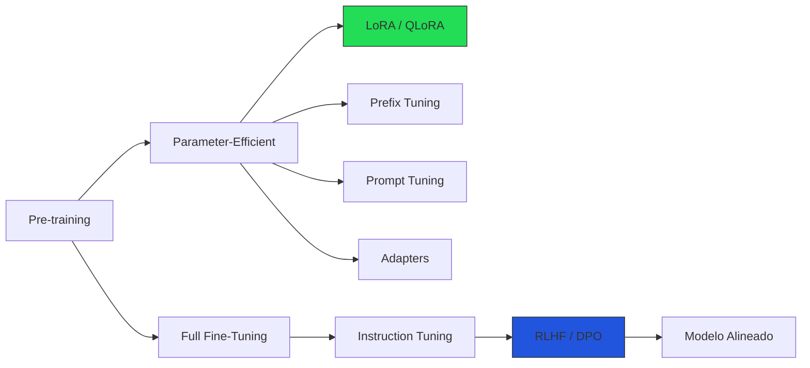
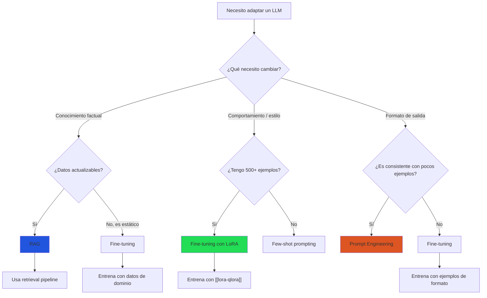
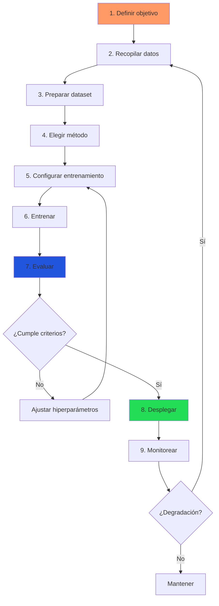

# Fine-Tuning: Visión General

> [!abstract] Resumen
> El *fine-tuning* (ajuste fino) es el proceso de ==adaptar un modelo de lenguaje pre-entrenado a una tarea, dominio o estilo específico== mediante entrenamiento adicional con datos curados. Esta nota cubre los tipos principales de fine-tuning, el marco de decisión para elegir entre fine-tuning, *RAG* y *prompt engineering*, el análisis de costos y el proceso completo de principio a fin. El fine-tuning es la herramienta más poderosa cuando se necesita ==cambiar el comportamiento fundamental== del modelo, no solo lo que sabe. ^resumen

---

## Qué es el fine-tuning y cuándo usarlo

El *fine-tuning* toma un modelo base —pre-entrenado con billones de tokens— y lo entrena con un conjunto de datos más pequeño y especializado. A diferencia del *prompt engineering*, que manipula la entrada, el fine-tuning ==modifica los pesos internos del modelo==.

> [!tip] Regla de oro
> Usa *fine-tuning* cuando necesites cambiar **cómo** el modelo responde, no **qué** sabe. Para incorporar conocimiento nuevo, considera primero [[datos-sinteticos|datos sintéticos]] o *RAG*.

### Casos de uso legítimos

| Caso de uso | Ejemplo | Alternativa viable |
|---|---|---|
| Cambio de estilo | Respuestas en formato legal específico | Pocos ejemplos en prompt |
| Adaptación de dominio | Terminología médica especializada | ==Fine-tuning== (mejor opción) |
| Reducción de latencia | Eliminar instrucciones largas del prompt | *Prompt caching* |
| Mejora de formato | Salida JSON consistente | *Function calling* |
| Seguimiento de instrucciones | Modelo base → asistente | ==Instruction tuning== (necesario) |
| Clasificación específica | Categorización de tickets de soporte | Fine-tuning o few-shot |

> [!warning] Cuándo NO hacer fine-tuning
> - Cuando el modelo base ya puede hacerlo con buen *prompt engineering*
> - Cuando necesitas incorporar conocimiento factual actualizable → usa [[architect-overview|architect]] con RAG
> - Cuando no tienes al menos 100-500 ejemplos de calidad
> - Cuando no puedes evaluar objetivamente los resultados → revisa [[evaluacion-fine-tuning]]

---

## Tipos de fine-tuning

### Espectro de métodos



### Full fine-tuning

Actualiza ==todos los parámetros== del modelo. Es el método más expresivo pero el más costoso en memoria y cómputo. Para un modelo de 7B parámetros en fp16, necesitas aproximadamente 28 GB solo para los pesos, más los gradientes y estados del optimizador[^1].

> [!info] Requerimientos de memoria (full fine-tuning)
> - **Pesos del modelo**: 2 bytes/parámetro (fp16)
> - **Gradientes**: 2 bytes/parámetro
> - **Estados del optimizador (Adam)**: 8 bytes/parámetro
> - **Total**: ~12 bytes/parámetro → ==84 GB para 7B==

### LoRA y QLoRA

*Low-Rank Adaptation* ([[lora-qlora|LoRA]]) congela los pesos originales y entrena matrices de bajo rango inyectadas en las capas de atención. ==Reduce los parámetros entrenables en un 99%== manteniendo calidad comparable. *QLoRA* añade cuantización a 4 bits para reducir aún más la memoria.

### Prefix tuning y prompt tuning

Métodos que añaden tokens virtuales entrenables al inicio de la secuencia. Son los más eficientes en parámetros pero los menos expresivos. *Prefix tuning* opera en todas las capas; *prompt tuning* solo en la capa de embedding[^2].

### Adapters

Módulos pequeños insertados entre las capas del transformer. Fueron precursores de LoRA y ofrecen un compromiso similar entre eficiencia y expresividad. Hoy son menos populares que LoRA por su mayor complejidad de implementación.

---

## Marco de decisión: fine-tuning vs RAG vs prompt engineering

> [!question] ¿Cómo elijo la técnica correcta?
> La elección depende de tres ejes: **tipo de adaptación necesaria**, **volumen de datos disponible** y **presupuesto de cómputo e ingeniería**.



| Criterio | Prompt Engineering | RAG | Fine-Tuning |
|---|---|---|---|
| Costo inicial | ==Bajo== | Medio | Alto |
| Latencia añadida | Baja | Media-Alta | ==Ninguna== |
| Conocimiento nuevo | No | ==Sí== | Limitado |
| Cambio de estilo | Limitado | No | ==Sí== |
| Mantenimiento | Bajo | Medio | Alto |
| Datos necesarios | 0-10 ejemplos | Corpus completo | 100-10K ejemplos |

> [!example]- Ejemplo práctico: decisión para un chatbot legal
> ```
> Contexto: Empresa legal quiere un chatbot que:
> 1. Use terminología jurídica argentina
> 2. Cite artículos del Código Civil
> 3. Responda en formato estructurado específico
>
> Análisis:
> - Punto 1 → Fine-tuning (cambio de estilo/vocabulario)
> - Punto 2 → RAG (conocimiento factual actualizable)
> - Punto 3 → Prompt engineering o fine-tuning
>
> Solución óptima: RAG + fine-tuning con LoRA
> - LoRA para estilo y formato
> - RAG para citas precisas del código
> - Evaluación con [[evaluacion-fine-tuning|métricas específicas]]
> ```

---

## Análisis de costos

### Costo por método y tamaño de modelo

| Modelo | Full FT (GPU-hrs) | LoRA (GPU-hrs) | QLoRA (GPU-hrs) | Costo cloud aprox. |
|---|---|---|---|---|
| 7B | 40-80 (A100 80GB) | 8-16 (A100 40GB) | ==4-8 (RTX 4090)== | $10-50 |
| 13B | 80-160 (2×A100) | 16-32 (A100 80GB) | 8-16 (A100 40GB) | $30-100 |
| 70B | 500+ (8×A100) | 40-80 (2×A100) | 20-40 (A100 80GB) | $100-500 |
| 405B | 2000+ (cluster) | 200+ (8×A100) | 80-160 (4×A100) | ==$500-2000+== |

> [!danger] Costos ocultos
> Los GPU-hours son solo una parte del costo total:
> - **Preparación de datos**: 60-80% del tiempo total del proyecto
> - **Iteraciones fallidas**: Planifica 3-5× el costo de un solo entrenamiento
> - **Evaluación**: Requiere tiempo de expertos humanos para [[evaluacion-fine-tuning|evaluar calidad]]
> - **Infraestructura de serving**: El modelo fine-tuneado necesita hosting → ver [[infraestructura-entrenamiento]]

### Proveedores de fine-tuning como servicio

| Proveedor | Modelos disponibles | Precio (1K ejemplos, 3 épocas) |
|---|---|---|
| OpenAI | GPT-4o, GPT-4o-mini | $5-25 |
| Together AI | Llama, Mixtral, Qwen | ==$3-15== |
| Anyscale | Llama, Mistral | $5-20 |
| AWS Bedrock | Llama, Claude (limitado) | $10-30 |
| Modal | Cualquier modelo open-source | ==Pay-per-GPU-second== |

---

## Proceso completo de fine-tuning



### Fase 1: Preparación de datos

> [!success] Características de un buen dataset
> - **Diversidad**: Cubre la distribución completa de casos reales
> - **Calidad**: Cada ejemplo es correcto y consistente
> - **Formato**: Alineado con el formato de inferencia (misma plantilla de chat)
> - **Tamaño**: 500-5000 ejemplos para LoRA, 10K+ para full FT
> - **Balance**: Sin sesgo excesivo hacia una clase o estilo

Los datos deben estar en formato conversacional para modelos de chat:

> [!example]- Formato de datos para fine-tuning
> ```json
> {
>   "messages": [
>     {
>       "role": "system",
>       "content": "Eres un asistente legal especializado en derecho argentino."
>     },
>     {
>       "role": "user",
>       "content": "¿Cuál es el plazo de prescripción para una acción por daños?"
>     },
>     {
>       "role": "assistant",
>       "content": "Según el artículo 2561 del Código Civil y Comercial de la Nación, el plazo genérico de prescripción para la acción de daños y perjuicios es de tres (3) años, contados desde la fecha en que el damnificado tomó conocimiento del daño y de la persona obligada a repararlo.\n\nExisten excepciones relevantes:\n- Daños derivados de accidentes de tránsito: 2 años (art. 2562 inc. b)\n- Responsabilidad civil del Estado: 3 años (Ley 26.944)\n- Daños ambientales: imprescriptible (Ley 25.675)"
>     }
>   ]
> }
> ```

### Fase 2: Entrenamiento

Los hiperparámetros clave que debes ajustar:

| Hiperparámetro | Rango típico | Notas |
|---|---|---|
| Learning rate | ==1e-5 a 5e-5== (full FT), 1e-4 a 3e-4 (LoRA) | Más bajo = más estable |
| Épocas | 1-5 | Más de 3 suele causar overfitting |
| Batch size | 4-32 | Limitado por memoria GPU |
| Warmup ratio | 0.03-0.1 | Estabiliza inicio del entrenamiento |
| Weight decay | 0.01-0.1 | Regularización |
| Max seq length | 512-4096 | Según tarea; afecta memoria |

### Fase 3: Evaluación

> [!tip] Evaluación multicapa
> No basta con mirar la pérdida de validación. Evalúa en tres niveles:
> 1. **Métricas automáticas**: Pérdida, perplejidad, BLEU/ROUGE si aplica
> 2. **Benchmarks generales**: Para detectar [[continual-learning|olvido catastrófico]]
> 3. **Evaluación humana**: La más importante; idealmente ciega y comparativa
>
> Ver detalles completos en [[evaluacion-fine-tuning]].

### Fase 4: Despliegue

El modelo fine-tuneado se despliega como cualquier modelo, pero con consideraciones adicionales:

- **Versionado**: Cada checkpoint es un artefacto que debe versionarse
- **Rollback**: Mantener el modelo base accesible para comparación
- **Monitoreo**: Detectar *drift* en producción → [[vigil-overview|vigil]] puede escanear las salidas
- **Seguridad**: Verificar que el fine-tuning no introdujo vulnerabilidades → [[licit-overview|licit]] para compliance

---

## Tendencias actuales (2025-2026)

> [!info] Estado del arte
> - **LoRA es el estándar**: La mayoría de fine-tuning práctico usa [[lora-qlora|LoRA o QLoRA]]
> - **DPO reemplaza RLHF**: [[dpo-alternativas|DPO]] es más simple y comparable en calidad
> - **Datos sintéticos dominan**: [[datos-sinteticos|Generación sintética]] reduce dependencia de datos humanos
> - **Merging como alternativa**: [[merging-models|Model merging]] permite combinar capacidades sin re-entrenar
> - **Fine-tuning como servicio**: APIs que abstraen la complejidad → accesible para equipos pequeños

---

## Relación con el ecosistema

El fine-tuning se integra con el ecosistema de herramientas de desarrollo de IA de las siguientes maneras:

- **[[intake-overview|intake]]**: Las especificaciones normalizadas generadas por intake pueden servir como base para crear datasets de entrenamiento. Los 12+ parsers de intake extraen requisitos que, convertidos en pares instrucción-respuesta, alimentan el pipeline de [[instruction-tuning|instruction tuning]].

- **[[architect-overview|architect]]**: El agente de codificación autónomo puede usar modelos fine-tuneados a través de *LiteLLM*. Los pipelines YAML de architect permiten definir flujos de evaluación automatizada post-entrenamiento. El *Ralph Loop* puede orquestar iteraciones de entrenamiento, evaluación y ajuste.

- **[[vigil-overview|vigil]]**: Escanea las salidas de modelos fine-tuneados para detectar regresiones de seguridad. Sus 26 reglas deterministas identifican si el fine-tuning introdujo vulnerabilidades como *placeholder secrets* o *slopsquatting*. Produce reportes SARIF para integración CI/CD.

- **[[licit-overview|licit]]**: Valida que el proceso de fine-tuning cumpla con el EU AI Act (especialmente para modelos de alto riesgo). Genera documentación Annex IV, rastrea proveniencia de datos de entrenamiento y ejecuta evaluaciones FRIA (*Fundamental Rights Impact Assessment*).

> [!tip] Pipeline integrado
> Un flujo maduro combina las cuatro herramientas:
> 1. [[intake-overview|intake]] → extrae y normaliza requisitos del modelo
> 2. Fine-tuning → entrena el modelo según requisitos
> 3. [[vigil-overview|vigil]] → escanea seguridad del modelo resultante
> 4. [[licit-overview|licit]] → certifica compliance
> 5. [[architect-overview|architect]] → despliega usando el modelo fine-tuneado

---

## Checklist de fine-tuning

- [ ] Objetivo claramente definido y medible
- [ ] Dataset de al menos 500 ejemplos curados
- [ ] Formato alineado con el template de inferencia
- [ ] Split train/val/test definido (80/10/10)
- [ ] Baseline establecido con el modelo base
- [ ] Método seleccionado ([[lora-qlora|LoRA]] recomendado para empezar)
- [ ] Hiperparámetros iniciales configurados
- [ ] Pipeline de evaluación listo → [[evaluacion-fine-tuning]]
- [ ] Presupuesto de cómputo aprobado → [[infraestructura-entrenamiento]]
- [ ] Plan de rollback definido
- [ ] Escaneo de seguridad configurado → [[vigil-overview|vigil]]
- [ ] Compliance verificado → [[licit-overview|licit]]

---

## Enlaces y referencias

> [!quote]- Bibliografía
> - Hu, E. J., et al. (2021). *LoRA: Low-Rank Adaptation of Large Language Models*. arXiv:2106.09685[^1]
> - Li, X. L., & Liang, P. (2021). *Prefix-Tuning: Optimizing Continuous Prompts for Generation*. arXiv:2101.00190[^2]
> - Ouyang, L., et al. (2022). *Training language models to follow instructions with human feedback*. NeurIPS 2022[^3]
> - Dettmers, T., et al. (2023). *QLoRA: Efficient Finetuning of Quantized Language Models*. arXiv:2305.14314
> - Rafailov, R., et al. (2023). *Direct Preference Optimization*. NeurIPS 2023
> - Sun, Z., et al. (2023). *A Survey of Large Language Model Fine-tuning*. arXiv
> - [[lora-qlora|Nota: LoRA y QLoRA en detalle]]
> - [[rlhf|Nota: RLHF en detalle]]
> - [[instruction-tuning|Nota: Instruction Tuning]]

[^1]: Hu, E. J., et al. "LoRA: Low-Rank Adaptation of Large Language Models." arXiv:2106.09685, 2021.
[^2]: Li, X. L., & Liang, P. "Prefix-Tuning: Optimizing Continuous Prompts for Generation." ACL 2021.
[^3]: Ouyang, L., et al. "Training language models to follow instructions with human feedback." NeurIPS 2022.
