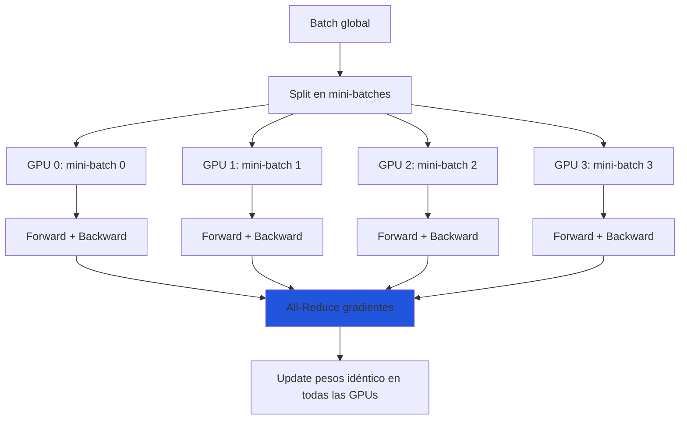
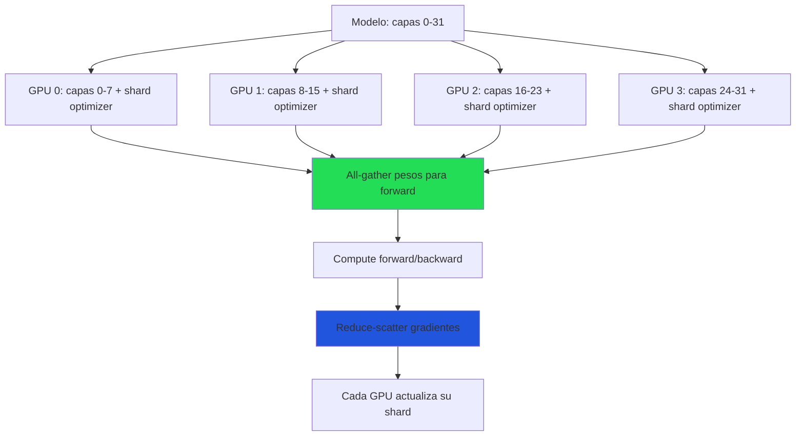
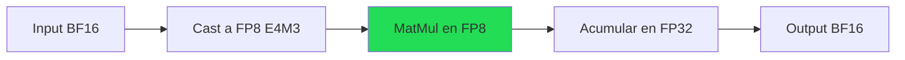

# Infraestructura de Entrenamiento: GPUs, Distribución y Cloud

> [!abstract] Resumen
> La infraestructura de cómputo es ==el factor limitante principal en fine-tuning y pre-training== de LLMs. Esta nota cubre el panorama de GPUs (NVIDIA A100 a B200, AMD MI300X), los requisitos de memoria por tamaño de modelo, las estrategias de distribución (DDP, FSDP, DeepSpeed ZeRO, Megatron-LM), los proveedores cloud con sus precios comparativos y las técnicas de precisión mixta. ==El status de esta nota es "volatile"== porque los precios y la disponibilidad de hardware cambian rápidamente. ^resumen

---

## Panorama de GPUs para entrenamiento

### GPUs NVIDIA

| GPU | VRAM | Ancho de banda | FP16 TFLOPS | BF16 TFLOPS | FP8 TFLOPS | Interconexión | Año |
|---|---|---|---|---|---|---|---|
| A100 40GB | 40 GB | 1.6 TB/s | 312 | 312 | — | NVLink 3 | 2020 |
| A100 80GB | 80 GB | 2.0 TB/s | 312 | 312 | — | NVLink 3 | 2021 |
| ==H100 SXM== | ==80 GB== | ==3.35 TB/s== | ==990== | ==990== | ==1979== | ==NVLink 4== | 2023 |
| H100 PCIe | 80 GB | 2.0 TB/s | 756 | 756 | 1513 | PCIe 5.0 | 2023 |
| H200 | ==141 GB== | 4.8 TB/s | 990 | 990 | 1979 | NVLink 4 | 2024 |
| ==B200== | ==192 GB== | ==8.0 TB/s== | ==2250== | ==2250== | ==4500== | ==NVLink 5== | 2025 |
| RTX 4090 | 24 GB | 1.0 TB/s | 165 | 165 | 330 | PCIe 4.0 | 2022 |
| RTX 5090 | 32 GB | 1.8 TB/s | 210 | 210 | 420 | PCIe 5.0 | 2025 |

### GPUs AMD

| GPU | VRAM | Ancho de banda | FP16 TFLOPS | Interconexión | Notas |
|---|---|---|---|---|---|
| MI250X | 128 GB (2×64) | 3.2 TB/s | 383 | Infinity Fabric | Dos dies |
| ==MI300X== | ==192 GB== | ==5.3 TB/s== | ==1307== | ==Infinity Fabric== | Competidor de H100 |
| MI325X | 256 GB | 6.0 TB/s | ~1500 | Infinity Fabric | 2025 |

> [!tip] ¿NVIDIA o AMD?
> - **NVIDIA**: Ecosistema CUDA maduro, mejor soporte de software, ==la opción segura==
> - **AMD**: Más VRAM por dólar, ROCm mejorando rápidamente, ==potencial ahorro del 20-40%==
> - Para [[lora-qlora|QLoRA]] simple: RTX 4090/5090 es suficiente y mucho más barato
> - Para producción: H100/H200 es el estándar de la industria

---

## Requisitos de memoria por modelo

### Fórmula general

Para *full fine-tuning* con Adam optimizer:

$$\text{Memoria total} = \text{Pesos} + \text{Gradientes} + \text{Optimizer states} + \text{Activaciones}$$

| Componente | Bytes por parámetro (fp16) | Bytes por parámetro (bf16) |
|---|---|---|
| Pesos del modelo | 2 | 2 |
| Gradientes | 2 | 2 |
| Adam estados (m, v) | 4 + 4 = 8 | 4 + 4 = 8 |
| **Total (sin activaciones)** | ==12== | ==12== |

### Tabla de requisitos

| Modelo | Parámetros | Full FT (fp16) | LoRA (fp16) | ==QLoRA (NF4)== | Inferencia (fp16) |
|---|---|---|---|---|---|
| 1B | 1B | 12 GB | 4 GB | ==2 GB== | 2 GB |
| 3B | 3B | 36 GB | 10 GB | ==4 GB== | 6 GB |
| 7-8B | 7-8B | 84-96 GB | 28-32 GB | ==6-8 GB== | 14-16 GB |
| 13B | 13B | 156 GB | 52 GB | ==10 GB== | 26 GB |
| 34B | 34B | 408 GB | 136 GB | ==22 GB== | 68 GB |
| 70B | 70B | 840 GB | 280 GB | ==42 GB== | 140 GB |
| 405B | 405B | 4,860 GB | 1,620 GB | ==250 GB== | 810 GB |

> [!warning] Las activaciones añaden memoria
> La tabla anterior NO incluye activaciones. Para secuencias largas (4K-8K tokens), las activaciones pueden añadir ==20-50% más== a los requisitos de memoria. Usa *gradient checkpointing* para reducirlas.

> [!success] Configuraciones prácticas por GPU
> | GPU | Modelo máximo (Full FT) | Modelo máximo (QLoRA) |
> |---|---|---|
> | RTX 4090 (24 GB) | ~1B | ==7-8B== |
> | A100 40GB | ~3B | 13B |
> | A100 80GB | ==7B== | ==34B== |
> | 2× A100 80GB | 13B | 70B |
> | 4× A100 80GB | 34B | 70B (cómodo) |
> | 8× A100 80GB | ==70B== | 405B (ajustado) |
> | H100 80GB | 7B | 34B |
> | 8× H100 80GB | ==70B (cómodo)== | 405B |

---

## Estrategias de distribución

### Data Distributed Parallel (DDP)

El método más simple de distribución: ==cada GPU tiene una copia completa del modelo== y procesa diferentes batches.



| Aspecto | DDP |
|---|---|
| Requisito | Modelo completo cabe en 1 GPU |
| Escalado | ==Lineal== en throughput |
| Comunicación | All-reduce de gradientes |
| Complejidad | ==Baja== |
| Cuándo usar | Modelo ≤ VRAM de una GPU |

### Fully Sharded Data Parallel (FSDP)

FSDP de PyTorch ==fragmenta el modelo, gradientes y estados del optimizador== entre GPUs:



| Aspecto | FSDP |
|---|---|
| Requisito | Modelo dividido entre N GPUs |
| Escalado | ==Casi lineal== |
| Comunicación | All-gather + reduce-scatter |
| Complejidad | Media |
| Cuándo usar | ==Modelos que no caben en 1 GPU== |

> [!tip] FSDP es el estándar recomendado
> Para la mayoría de fine-tuning multi-GPU, ==FSDP es la mejor opción==. Está integrado nativamente en PyTorch, tiene buen soporte en Hugging Face Trainer y es más simple que DeepSpeed para la mayoría de casos.

### DeepSpeed ZeRO

DeepSpeed ofrece tres etapas (*stages*) de optimización con granularidad creciente[^1]:

| Stage | Qué shardea | Reducción de memoria | Comunicación |
|---|---|---|---|
| ZeRO-1 | Optimizer states | ==4×== | Similar a DDP |
| ZeRO-2 | + Gradientes | ==8×== | Mayor |
| ==ZeRO-3== | + Parámetros | ==N×== (N = # GPUs) | ==Máxima== |

> [!info] ZeRO-3 vs FSDP
> ZeRO-3 y FSDP son conceptualmente equivalentes: ambos fragmentan todo entre las GPUs. Las diferencias principales:
> - **FSDP**: Nativo en PyTorch, mejor integración, ==recomendado para nuevos proyectos==
> - **ZeRO-3**: Más opciones de configuración, mejor documentado para edge cases
> - **Rendimiento**: Similar en la práctica con configuración adecuada

### DeepSpeed ZeRO-Offload

Extiende ZeRO permitiendo ==offload de parámetros y estados a RAM del CPU== (o incluso NVMe SSD):

| Nivel | Offload a | Velocidad | Memoria GPU necesaria |
|---|---|---|---|
| Sin offload | — | ==Máxima== | Normal |
| CPU offload | RAM CPU | -30-50% | ==Reducida 2-4×== |
| NVMe offload | SSD NVMe | -70-90% | ==Reducida 4-8×== |

> [!warning] Trade-off de offload
> El offload ==reduce dramáticamente la velocidad== de entrenamiento. Solo úsalo cuando no tengas suficientes GPUs. Un entrenamiento de 10 horas sin offload puede tomar 30+ horas con CPU offload.

### Megatron-LM

Para entrenamiento a escala de clusters (pre-training de modelos grandes):

| Tipo de paralelismo | Qué divide | Escala típica |
|---|---|---|
| Tensor Parallelism (TP) | Matrices individuales entre GPUs | 2-8 GPUs (intra-nodo) |
| Pipeline Parallelism (PP) | Capas del modelo en stages | 2-64 stages (inter-nodo) |
| Sequence Parallelism (SP) | La secuencia de entrada | Con TP |
| Data Parallelism (DP) | El batch de datos | N nodos |

> [!danger] Megatron-LM: solo para pre-training
> Megatron-LM es ==excesivo para fine-tuning==. Su complejidad solo se justifica para pre-training de modelos de 70B+ desde cero. Para fine-tuning, FSDP o DeepSpeed ZeRO son suficientes. Ver [[pretraining-desde-cero]] para más contexto.

---

## Proveedores cloud

### Comparación de precios (2025)

> [!warning] Precios aproximados, cambian frecuentemente
> Los precios a continuación son orientativos. Verificar siempre los precios actuales del proveedor.

| Proveedor | Instancia | GPUs | VRAM total | Precio/hora (on-demand) | Precio/hora (spot/preemptible) |
|---|---|---|---|---|---|
| **AWS** | p5.48xlarge | 8× H100 | 640 GB | ==$98.32== | ~$30-50 |
| AWS | p4d.24xlarge | 8× A100 40GB | 320 GB | $32.77 | ~$10-15 |
| **GCP** | a3-highgpu-8g | 8× H100 | 640 GB | $101.22 | ~$30-40 |
| GCP | a2-ultragpu-8g | 8× A100 80GB | 640 GB | $40.22 | ~$12-18 |
| **Azure** | ND H100 v5 | 8× H100 | 640 GB | $96.36 | ~$29-40 |
| Azure | ND A100 v4 | 8× A100 80GB | 640 GB | $37.40 | ~$11-15 |
| **Lambda** | 8× H100 | 8× H100 | 640 GB | ==$27.60== | — |
| **RunPod** | 8× H100 | 8× H100 | 640 GB | ==$31.60== | ~$24 |
| **Together AI** | Fine-tuning API | Variable | — | ==Per-token pricing== | — |
| **Vast.ai** | Variable | Variable | Variable | ==$0.40-3/GPU/hr== | Variable |

> [!tip] Recomendaciones por presupuesto
> | Presupuesto | Recomendación | Modelo máximo |
> |---|---|---|
> | < $50 | RunPod/Vast.ai 1× A100 + QLoRA | ==7-8B== |
> | $50-200 | Lambda/RunPod 1× H100 + LoRA | 13B |
> | $200-500 | Lambda 2-4× H100 + LoRA | ==70B== |
> | $500-2000 | AWS/GCP 8× H100 | 70B (full FT) |
> | > $2000 | Multi-nodo, negociar precios | 405B |

### Fine-tuning como servicio

Para quienes no quieren gestionar infraestructura:

| Servicio | Modelos | Precio | Control |
|---|---|---|---|
| OpenAI Fine-tuning | GPT-4o, GPT-4o-mini | Per-token | ==Mínimo== |
| Together AI | Open-source (Llama, Mistral, Qwen) | Per-token | Medio |
| Anyscale | Open-source | Per-GPU-hour | Alto |
| Modal | Cualquier modelo | Per-GPU-second | ==Máximo== |
| Fireworks AI | Open-source | Per-token | Medio |

---

## Precisión mixta

### Tipos de datos numéricos

| Tipo | Bits | Rango | Precisión | Uso en entrenamiento |
|---|---|---|---|---|
| FP32 | 32 | ±3.4e38 | ~7 decimales | Referencia (lento) |
| ==BF16== | 16 | ±3.4e38 | ~3 decimales | ==Recomendado para entrenamiento== |
| FP16 | 16 | ±65504 | ~3 decimales | Alternativa, riesgo de overflow |
| FP8 (E4M3) | 8 | ±448 | ~2 decimales | Forward pass (H100+) |
| FP8 (E5M2) | 8 | ±57344 | ~1 decimal | Gradientes (H100+) |
| INT8 | 8 | -128 a 127 | Exacto (entero) | Cuantización post-training |
| ==NF4== | 4 | Normalizado | — | ==QLoRA== |

> [!info] BF16 vs FP16
> - **BF16** (*Brain Float 16*): Mismo rango que FP32 pero menor precisión → ==menos riesgo de overflow==
> - **FP16**: Mayor precisión que BF16 pero rango limitado → requiere *loss scaling*
> - **Recomendación**: ==Usar BF16 siempre que sea posible== (A100+, H100+). FP16 solo en GPUs antiguas (V100).

### FP8 (H100 y posteriores)

Las GPUs H100+ soportan FP8, que ==duplica el throughput respecto a FP16/BF16==:



> [!success] Beneficios de FP8
> - ==2× throughput== en MatMul vs BF16
> - ~25-40% reducción de memoria para activaciones
> - Calidad comparable con calibración adecuada
> - Soportado por Transformer Engine (NVIDIA) y PyTorch 2.x

---

## Técnicas de ahorro de memoria

### Gradient checkpointing

En lugar de almacenar todas las activaciones intermedias, ==recalcula las activaciones durante el backward pass==:

| Sin checkpointing | Con checkpointing |
|---|---|
| Memoria: O(N capas) | ==Memoria: O(√N capas)== |
| Velocidad: 1× | Velocidad: ~1.3× (30% más lento) |
| Cuándo: Memoria sobra | ==Cuándo: Memoria es limitante== |

### Gradient accumulation

Simula batch sizes grandes sin usar más memoria:

$$\text{Effective batch} = \text{micro batch} \times \text{accumulation steps} \times \text{num GPUs}$$

> [!example]- Configuración típica de gradient accumulation
> ```python
> # Con 1 GPU y 24 GB de VRAM
> training_args = TrainingArguments(
>     per_device_train_batch_size=2,       # Lo que cabe en GPU
>     gradient_accumulation_steps=8,        # Acumula 8 pasos
>     # Effective batch size = 2 × 8 = 16
>
>     # Con 4 GPUs
>     # Effective batch size = 2 × 8 × 4 = 64
> )
> ```

### Flash Attention

*Flash Attention*[^2] reduce la complejidad de memoria de la atención de O(N²) a ==O(N)==:

| Aspecto | Atención estándar | ==Flash Attention 2== |
|---|---|---|
| Memoria | O(N²) | ==O(N)== |
| Velocidad | Baseline | ==2-4× más rápido== |
| Precisión | Exacta | ==Exacta (no es aproximación)== |
| Soporte | Universal | Ampere+ (A100, H100, RTX 3090+) |

> [!tip] Flash Attention es obligatorio
> Para cualquier entrenamiento serio, Flash Attention debe estar activado. Es gratuito en rendimiento y memoria. En Hugging Face:
> ```python
> model = AutoModelForCausalLM.from_pretrained(
>     model_name,
>     attn_implementation="flash_attention_2",  # Activar
> )
> ```

---

## Networking para multi-nodo

| Tecnología | Ancho de banda | Latencia | Uso |
|---|---|---|---|
| ==InfiniBand HDR== | ==200 Gb/s== | ~1 μs | ==Estándar para clusters de entrenamiento== |
| InfiniBand NDR | 400 Gb/s | ~0.5 μs | H100 clusters (próxima gen) |
| RoCE v2 | 100-200 Gb/s | ~2 μs | Alternativa más barata |
| NVLink | 600-900 GB/s | ~ns | ==Intra-nodo== (entre GPUs) |
| NVSwitch | 7.2 TB/s | ~ns | H100 DGX (8 GPUs full mesh) |
| TCP/IP (Ethernet) | 25-100 Gb/s | ~ms | ==No recomendado== para entrenamiento |

> [!danger] Networking es el cuello de botella
> Para entrenamiento multi-nodo, el networking es ==frecuentemente el factor limitante==. Un cluster con 100 Gb/s Ethernet puede tener 50% de la eficiencia de uno con InfiniBand 200 Gb/s. Siempre verificar el networking al elegir un proveedor cloud.

---

## Relación con el ecosistema

- **[[intake-overview|intake]]**: Las especificaciones de intake pueden incluir requisitos de infraestructura (presupuesto máximo, latencia requerida en inferencia, restricciones geográficas de los datos). Los parsers extraen estas restricciones que condicionan la elección de GPU y proveedor cloud.

- **[[architect-overview|architect]]**: Architect usa *OpenTelemetry* para exportar métricas de entrenamiento (GPU utilization, memory, throughput). El *cost tracking* de architect monitorea el gasto en infraestructura en tiempo real. Los pipelines YAML pueden definir escalado automático: empezar con 1 GPU para experimentación y escalar a 8 para el entrenamiento final.

- **[[vigil-overview|vigil]]**: Vigil verifica que la infraestructura no introduzca vulnerabilidades de seguridad. Los 22 niveles de seguridad de architect incluyen verificación de que los datos de entrenamiento no se filtren a través de la infraestructura compartida (cloud multi-tenant).

- **[[licit-overview|licit]]**: El EU AI Act tiene requisitos sobre la ubicación geográfica de los datos y el cómputo. Licit rastrea en qué proveedor y región se ejecutó el entrenamiento, genera informes de proveniencia del cómputo y verifica compliance con regulaciones de soberanía de datos.

---

## Enlaces y referencias

> [!quote]- Bibliografía
> - Rajbhandari, S., et al. (2020). *ZeRO: Memory Optimizations Toward Training Trillion Parameter Models*. SC 2020[^1]
> - Dao, T., et al. (2022). *FlashAttention: Fast and Memory-Efficient Exact Attention with IO-Awareness*. NeurIPS 2022[^2]
> - Zhao, Y., et al. (2023). *PyTorch FSDP: Experiences on Scaling Fully Sharded Data Parallel*. VLDB 2023[^3]
> - Shoeybi, M., et al. (2019). *Megatron-LM: Training Multi-Billion Parameter Language Models Using Model Parallelism*. arXiv:1909.08053
> - NVIDIA. *H100 Tensor Core GPU Architecture Whitepaper*. 2023
> - [[fine-tuning-overview|Nota: Fine-Tuning Visión General]]
> - [[lora-qlora|Nota: LoRA y QLoRA]]
> - [[pretraining-desde-cero|Nota: Pre-Training desde Cero]]

[^1]: Rajbhandari, S., et al. "ZeRO: Memory Optimizations Toward Training Trillion Parameter Models." SC 2020.
[^2]: Dao, T., et al. "FlashAttention: Fast and Memory-Efficient Exact Attention." NeurIPS 2022.
[^3]: Zhao, Y., et al. "PyTorch FSDP: Experiences on Scaling Fully Sharded Data Parallel." VLDB 2023.
