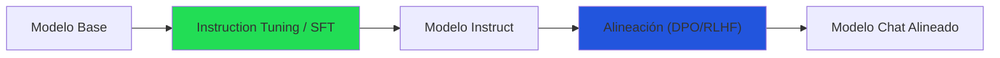
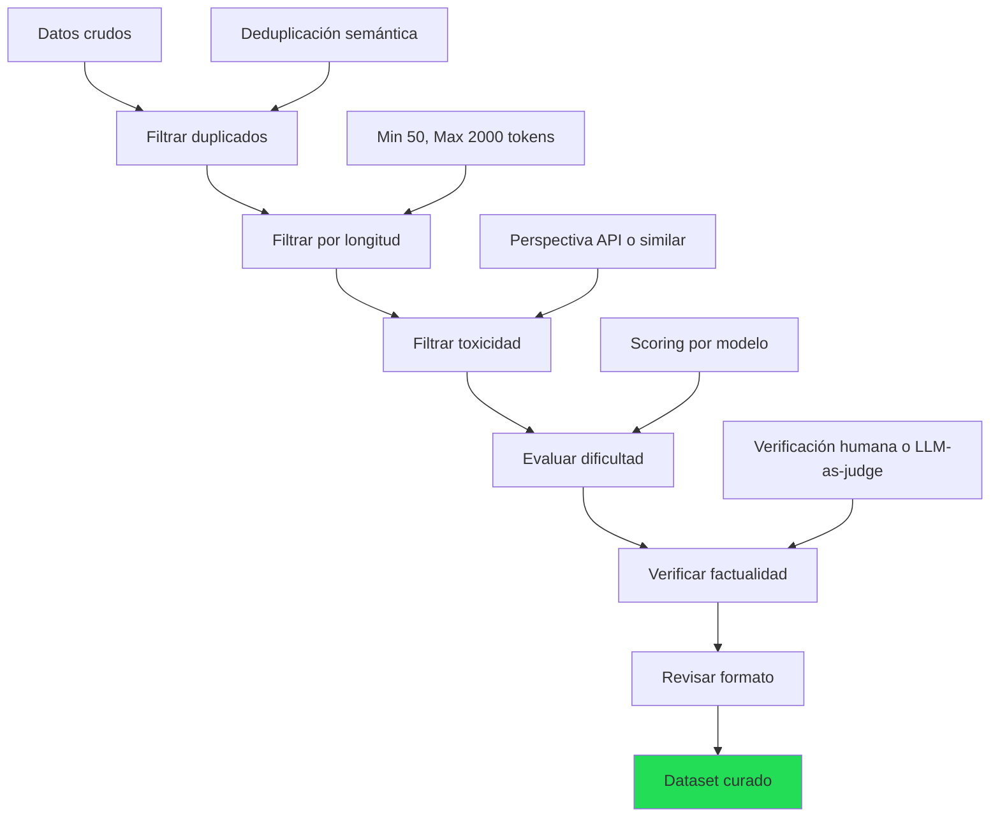
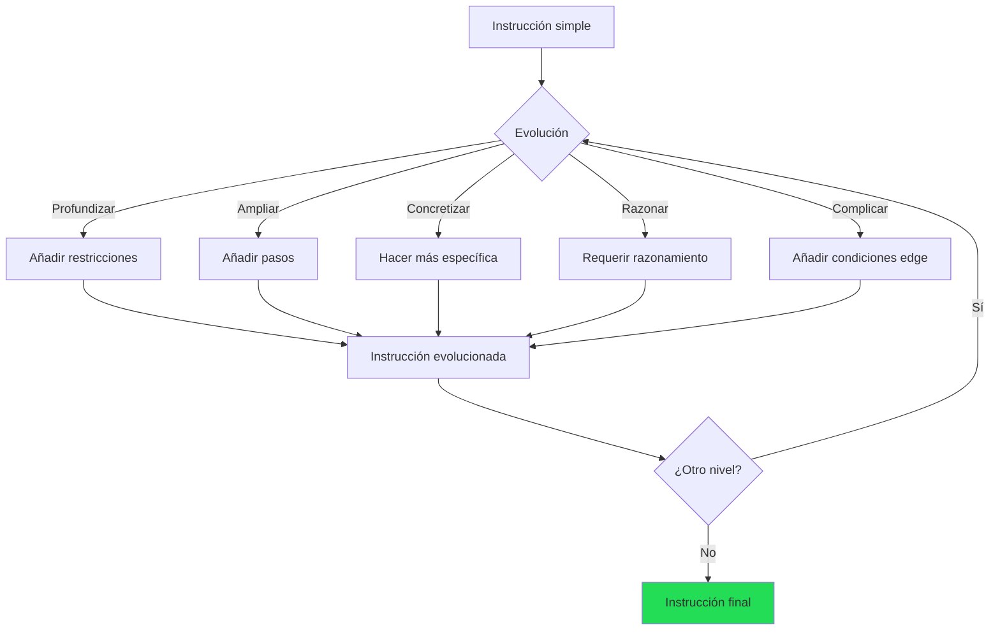

# Instruction Tuning: Enseñando a Seguir Instrucciones

> [!abstract] Resumen
> El *instruction tuning* es el proceso de ==convertir un modelo de lenguaje base (que solo predice el siguiente token) en un modelo que sigue instrucciones==. Es la primera fase del pipeline de alineación y la responsable de que los modelos puedan mantener conversaciones, responder preguntas y ejecutar tareas. Esta nota cubre los datasets fundamentales, los formatos de plantilla de chat, la filosofía de ==calidad sobre cantidad==, el pipeline de *self-instruct* y las métricas de evaluación. ^resumen

---

## ¿Qué es el instruction tuning?

Un modelo base como Llama 3.1 Base ha leído internet, pero no sabe "conversar". Si le preguntas "¿Cuál es la capital de Francia?", podría continuar con "¿Cuál es la capital de Alemania? ¿Cuál es la capital de..." porque solo predice tokens probables.

El *instruction tuning* (ajuste de instrucciones) ==enseña al modelo el formato de interacción==: recibir una instrucción y producir una respuesta útil.



> [!info] SFT = Supervised Fine-Tuning
> *Instruction tuning* y *SFT* se usan frecuentemente como sinónimos. Técnicamente, SFT es más general (cualquier fine-tuning supervisado), pero en el contexto de LLMs, SFT casi siempre se refiere a instruction tuning.

---

## Datasets fundamentales

### Panorama histórico

| Dataset | Año | Tamaño | Fuente | Calidad | Licencia |
|---|---|---|---|---|---|
| FLAN (v1) | 2021 | 62 tasks | Google Research | Alta | Apache 2.0 |
| FLAN v2 | 2023 | 1.8K tasks | Google Research | ==Muy alta== | Apache 2.0 |
| Alpaca | 2023 | 52K | GPT-3.5 (sintético) | Media | CC BY-NC |
| Dolly | 2023 | 15K | Empleados Databricks | Alta | ==CC BY-SA 3.0== |
| OpenAssistant | 2023 | 161K | Crowd global | Variable | Apache 2.0 |
| ShareGPT | 2023 | 90K+ | Conversaciones reales ChatGPT | Alta | Zona gris legal |
| Ultrachat | 2023 | 1.5M | Sintético (GPT-4) | Media-Alta | MIT |
| SlimOrca | 2023 | 518K | Filtrado de OpenOrca | ==Alta== | Apache 2.0 |
| Capybara | 2024 | 16K | Curado multi-turn | Alta | Apache 2.0 |
| Magpie | 2024 | 300K+ | Generado por Llama 3 | Alta | Apache 2.0 |

### Análisis detallado de datasets clave

#### FLAN

> [!tip] Por qué FLAN importa
> FLAN (*Fine-tuned Language Net*)[^1] demostró que el instruction tuning en ==muchas tareas diversas mejora el rendimiento en tareas no vistas==. El modelo FLAN-T5 sigue siendo un baseline sólido para investigación.

FLAN v2 unifica 1.8K+ tareas con templates variados. Su filosofía: maximizar la diversidad de instrucciones.

#### Alpaca

Alpaca[^2] fue el primer dataset generado sintéticamente con éxito. Stanford usó GPT-3.5 para generar 52K instrucciones partiendo de 175 semillas humanas (*self-instruct*). Demostró que ==modelos pequeños fine-tuneados con datos sintéticos pueden acercarse a modelos grandes==.

> [!warning] Limitaciones de Alpaca
> - Generado con GPT-3.5 → hereda sus sesgos y errores
> - Licencia no comercial (ToS de OpenAI al momento de generación)
> - Calidad desigual: muchas instrucciones triviales
> - No incluye conversaciones multi-turno

#### OpenAssistant

OpenAssistant Conversations (OASST)[^3] es el dataset abierto de mayor diversidad lingüística, con contribuciones en 35+ idiomas. Incluye ==árboles de conversación con rankings humanos==, lo que permite usarlo tanto para SFT como para [[dpo-alternativas|DPO]].

#### ShareGPT

Conversaciones reales de usuarios con ChatGPT, recopiladas vía extensión de navegador. Es ==uno de los datasets más efectivos en la práctica== porque refleja distribuciones reales de uso, pero tiene implicaciones legales (viola ToS de OpenAI).

> [!danger] Consideraciones legales
> Usar datos de ShareGPT para entrenar modelos comerciales viola los Terms of Service de OpenAI. Para aplicaciones comerciales, usa datasets con licencias claras como Dolly (CC BY-SA) o genera datos con [[datos-sinteticos|modelos open-source]].

---

## Formatos de plantilla de chat

### ¿Por qué importa el formato?

Cada familia de modelos usa un formato específico de tokenización para las conversaciones. ==Usar el formato incorrecto durante el fine-tuning degrada severamente la calidad== porque el modelo recibe tokens que no reconoce en su posición esperada.

### ChatML (OpenAI, Qwen)

```
<|im_start|>system
Eres un asistente útil.<|im_end|>
<|im_start|>user
¿Cuál es la capital de Francia?<|im_end|>
<|im_start|>assistant
La capital de Francia es París.<|im_end|>
```

### Llama 3 / Llama 3.1

```
<|begin_of_text|><|start_header_id|>system<|end_header_id|>

Eres un asistente útil.<|eot_id|><|start_header_id|>user<|end_header_id|>

¿Cuál es la capital de Francia?<|eot_id|><|start_header_id|>assistant<|end_header_id|>

La capital de Francia es París.<|eot_id|>
```

### Mistral / Mixtral

```
<s>[INST] Eres un asistente útil.

¿Cuál es la capital de Francia? [/INST]La capital de Francia es París.</s>
```

### Gemma 2

```
<start_of_turn>user
¿Cuál es la capital de Francia?<end_of_turn>
<start_of_turn>model
La capital de Francia es París.<end_of_turn>
```

> [!tip] Usar `apply_chat_template`
> Nunca formatees manualmente. Usa el tokenizer de Hugging Face:
> ```python
> messages = [
>     {"role": "system", "content": "Eres un asistente útil."},
>     {"role": "user", "content": "¿Capital de Francia?"},
>     {"role": "assistant", "content": "París."},
> ]
> text = tokenizer.apply_chat_template(messages, tokenize=False)
> ```
> Esto garantiza el formato correcto para cada modelo.

### Tabla comparativa de formatos

| Modelo | Token system | Token user | Token assistant | Soporte multi-turn |
|---|---|---|---|---|
| Llama 3.x | `<\|start_header_id\|>system` | `<\|start_header_id\|>user` | `<\|start_header_id\|>assistant` | ==Sí== |
| Mistral v0.3 | En [INST] | `[INST]` | Implícito | Sí |
| Qwen 2.5 | `<\|im_start\|>system` | `<\|im_start\|>user` | `<\|im_start\|>assistant` | ==Sí== |
| Gemma 2 | No nativo | `<start_of_turn>user` | `<start_of_turn>model` | Sí |
| Phi-3 | `<\|system\|>` | `<\|user\|>` | `<\|assistant\|>` | Sí |

---

## Calidad sobre cantidad

### El descubrimiento LIMA

El paper LIMA[^4] (*Less Is More for Alignment*) demostró que ==1,000 ejemplos cuidadosamente curados pueden producir un modelo competitivo con 52K ejemplos de Alpaca==. Las conclusiones clave:

> [!success] Principios de LIMA
> 1. La ==calidad de los datos es exponencialmente más importante== que la cantidad
> 2. La diversidad importa: cubrir muchos tipos de tarea
> 3. Las respuestas deben ser ejemplares, no solo correctas
> 4. El estilo y formato de las respuestas definen el comportamiento del modelo
> 5. Multi-turn mejora la coherencia conversacional

### Cómo curar datos de alta calidad



> [!warning] Errores comunes en curación
> - Incluir demasiadas instrucciones triviales ("dime un chiste", "hola")
> - No verificar la factualidad de las respuestas
> - Formato inconsistente entre ejemplos
> - No incluir casos edge (preguntas sin respuesta, solicitudes rechazables)
> - Sesgo hacia ciertos temas o estilos

---

## Self-Instruct Pipeline

### Concepto

*Self-Instruct*[^5] es una técnica para generar datos de entrenamiento usando el propio LLM (o uno más potente). El flujo:

1. Empezar con un conjunto semilla de instrucciones humanas (~175)
2. El modelo genera nuevas instrucciones diversas
3. El modelo genera respuestas para cada instrucción
4. Filtrar por calidad, diversidad y corrección
5. Añadir al dataset y repetir

> [!example]- Pipeline Self-Instruct completo
> ```python
> import json
> from openai import OpenAI
> from collections import defaultdict
>
> client = OpenAI()
>
> def generate_instructions(seed_instructions, n=10):
>     """Genera nuevas instrucciones a partir de semillas."""
>     prompt = f"""Genera {n} instrucciones diversas para un asistente de IA.
>
> Las instrucciones deben:
> - Ser variadas en tema y complejidad
> - Incluir tareas de diferentes categorías
> - No repetir las existentes
>
> Instrucciones existentes (como referencia):
> {json.dumps(seed_instructions[:20], ensure_ascii=False, indent=2)}
>
> Genera {n} instrucciones nuevas en formato JSON:"""
>
>     response = client.chat.completions.create(
>         model="gpt-4o",
>         messages=[{"role": "user", "content": prompt}],
>         temperature=0.9,
>     )
>     return json.loads(response.choices[0].message.content)
>
>
> def generate_response(instruction):
>     """Genera una respuesta de alta calidad."""
>     response = client.chat.completions.create(
>         model="gpt-4o",
>         messages=[
>             {"role": "system", "content": "Responde de forma precisa y útil."},
>             {"role": "user", "content": instruction},
>         ],
>         temperature=0.7,
>     )
>     return response.choices[0].message.content
>
>
> def filter_quality(instruction, response):
>     """Filtra pares de baja calidad."""
>     if len(response) < 50:
>         return False
>     if response.startswith("Como modelo de IA"):
>         return False
>     # Más heurísticas...
>     return True
> ```

### Evol-Instruct (WizardLM)

*Evol-Instruct*[^6] es una evolución del self-instruct que genera instrucciones progresivamente más complejas:



> [!tip] Ejemplo de evolución
> - **Nivel 0**: "Escribe una función que sume dos números"
> - **Nivel 1**: "Escribe una función que sume una lista de números, manejando strings que contengan números"
> - **Nivel 2**: "Escribe una función que sume elementos de una estructura anidada arbitraria, manejando tipos mixtos, con validación de entrada y mensajes de error descriptivos"
> - **Nivel 3**: "Diseña un sistema de evaluación de expresiones matemáticas que soporte operaciones anidadas, variables, funciones personalizadas, con manejo de errores completo y tests unitarios"

Para más detalles sobre generación de datos sintéticos, ver [[datos-sinteticos]].

---

## Evaluación de modelos instruction-tuned

### MT-Bench

MT-Bench[^7] es el benchmark estándar para evaluar modelos de chat. Usa ==80 preguntas multi-turn en 8 categorías==, evaluadas por GPT-4 como juez:

| Categoría | Ejemplo | Evalúa |
|---|---|---|
| Escritura | "Escribe un email profesional..." | Estilo, formato |
| Roleplay | "Actúa como un historiador..." | Seguimiento de instrucciones |
| Razonamiento | "Si A > B y B > C..." | Lógica |
| Matemáticas | "Resuelve la integral..." | Precisión |
| Programación | "Implementa quicksort..." | Código funcional |
| Extracción | "Del siguiente texto, extrae..." | Comprensión |
| STEM | "Explica la fotosíntesis..." | Conocimiento |
| Humanidades | "Analiza el impacto de..." | Profundidad |

Escala: 1-10 por turno. Los mejores modelos open-source alcanzan ==7.5-8.5==.

### AlpacaEval

AlpacaEval 2.0 compara las respuestas del modelo con las de GPT-4 Turbo usando GPT-4 como juez. Reporta *length-controlled win rate* (LC) para evitar sesgo de longitud.

> [!question] ¿MT-Bench o AlpacaEval?
> - **MT-Bench**: Mejor para evaluar ==multi-turn y razonamiento==
> - **AlpacaEval**: Mejor para evaluar ==utilidad general y seguimiento de instrucciones==
> - **Idealmente**: Usar ambos + [[evaluacion-fine-tuning|evaluación humana]]
> - **Cuidado**: Ambos usan LLM-as-judge → sesgo hacia estilos que GPT-4 prefiere

### Arena Elo (Chatbot Arena)

El método más confiable: ==usuarios reales eligen entre respuestas anónimas de dos modelos==. El sistema Elo genera rankings que correlacionan bien con preferencias humanas reales. Sin embargo, no es práctico para evaluar modelos propios antes de publicarlos.

---

## Recetas prácticas

### Receta mínima viable (7B, 1 GPU)

| Componente | Elección | Justificación |
|---|---|---|
| Modelo base | Llama 3.1 8B | Mejor base open-source |
| Dataset | Capybara + SlimOrca (mezclados) | Calidad + diversidad |
| Método | ==QLoRA (r=16, alpha=32)== | Cabe en 1 GPU |
| GPU | RTX 4090 (24GB) o A100 40GB | QLoRA optimizado |
| Épocas | 2-3 | Suficiente para convergencia |
| Learning rate | 2e-4 | Estándar para [[lora-qlora\|LoRA]] |
| Evaluación | MT-Bench + muestras manuales | Automático + humano |

### Receta producción (70B, multi-GPU)

| Componente | Elección | Justificación |
|---|---|---|
| Modelo base | Llama 3.1 70B o Qwen 2.5 72B | Máxima capacidad |
| Dataset | Curado propio + Ultrachat filtrado | Control total |
| Método | ==LoRA (r=32)== con FSDP | Balance calidad/costo |
| GPU | 4-8× A100 80GB | Necesario para 70B |
| Post-SFT | [[dpo-alternativas\|DPO]] con preferencias propias | Alineación final |
| Evaluación | MT-Bench + Arena interna + humano | Multicapa |

> [!success] Pipeline recomendado end-to-end
> 1. Curar 2-5K ejemplos de alta calidad → más importante que 100K mediocres
> 2. SFT con [[lora-qlora|QLoRA]] → rápido y accesible
> 3. Evaluar con [[evaluacion-fine-tuning|MT-Bench]] → ¿supera el baseline?
> 4. [[dpo-alternativas|DPO]] con 1-2K pares de preferencias → alineación
> 5. Evaluar de nuevo → ¿mejora sobre SFT?
> 6. Escanear con [[vigil-overview|vigil]] → seguridad
> 7. Documentar con [[licit-overview|licit]] → compliance

---

## Errores frecuentes

> [!failure] Top 5 errores en instruction tuning
> 1. **Formato incorrecto**: No usar la plantilla de chat del modelo base → el modelo no aprende
> 2. **Datos de baja calidad**: Incluir respuestas con errores factuales → el modelo los memoriza
> 3. **Demasiadas épocas**: Más de 3-5 épocas con datos pequeños → [[continual-learning|overfitting severo]]
> 4. **Sin evaluación**: No evaluar en held-out set → no detectar regresiones
> 5. **Ignorar system prompt**: No incluir system prompts variados → modelo frágil ante variación

---

## Relación con el ecosistema

- **[[intake-overview|intake]]**: Las especificaciones normalizadas de intake definen el comportamiento esperado del modelo. Los 12+ parsers extraen instrucciones y respuestas esperadas de documentación, que pueden convertirse directamente en datos de instruction tuning.

- **[[architect-overview|architect]]**: Architect usa modelos instruction-tuned a través de LiteLLM. La calidad del instruction tuning impacta directamente la efectividad del *Ralph Loop* de architect. Los pipelines YAML pueden automatizar el ciclo de SFT: preparar datos → entrenar → evaluar → iterar.

- **[[vigil-overview|vigil]]**: Un modelo instruction-tuned puede heredar vulnerabilidades de los datos de entrenamiento. Vigil escanea las salidas del modelo con sus 26 reglas para detectar patrones como *slopsquatting* (dependencias falsas en código generado) o *empty tests*.

- **[[licit-overview|licit]]**: El EU AI Act requiere transparencia sobre los datos de entrenamiento. Licit rastrea la proveniencia de cada dataset de instruction tuning (licencia, fuente, método de generación) y genera informes de compliance. Especialmente relevante para datos generados con [[datos-sinteticos|self-instruct]] donde la licencia puede ser ambigua.

---

## Enlaces y referencias

> [!quote]- Bibliografía
> - Wei, J., et al. (2021). *Finetuned Language Models Are Zero-Shot Learners (FLAN)*. arXiv:2109.01652[^1]
> - Taori, R., et al. (2023). *Alpaca: A Strong, Replicable Instruction-Following Model*. Stanford[^2]
> - Köpf, A., et al. (2023). *OpenAssistant Conversations*. NeurIPS 2023 Datasets[^3]
> - Zhou, C., et al. (2023). *LIMA: Less Is More for Alignment*. NeurIPS 2023[^4]
> - Wang, Y., et al. (2022). *Self-Instruct: Aligning LM with Self-Generated Instructions*. arXiv:2212.10560[^5]
> - Xu, C., et al. (2023). *WizardLM: Empowering Large Language Models to Follow Complex Instructions*. arXiv:2304.12244[^6]
> - Zheng, L., et al. (2023). *Judging LLM-as-a-Judge with MT-Bench and Chatbot Arena*. NeurIPS 2023[^7]
> - [[fine-tuning-overview|Nota: Fine-Tuning Visión General]]
> - [[datos-sinteticos|Nota: Datos Sintéticos]]

[^1]: Wei, J., et al. "Finetuned Language Models Are Zero-Shot Learners." arXiv:2109.01652, 2021.
[^2]: Taori, R., et al. "Stanford Alpaca: An Instruction-following LLaMA model." 2023.
[^3]: Köpf, A., et al. "OpenAssistant Conversations — Democratizing Large Language Model Alignment." NeurIPS 2023.
[^4]: Zhou, C., et al. "LIMA: Less Is More for Alignment." NeurIPS 2023.
[^5]: Wang, Y., et al. "Self-Instruct: Aligning Language Models with Self-Generated Instructions." ACL 2023.
[^6]: Xu, C., et al. "WizardLM: Empowering Large Language Models to Follow Complex Instructions." arXiv:2304.12244, 2023.
[^7]: Zheng, L., et al. "Judging LLM-as-a-Judge with MT-Bench and Chatbot Arena." NeurIPS 2023.
