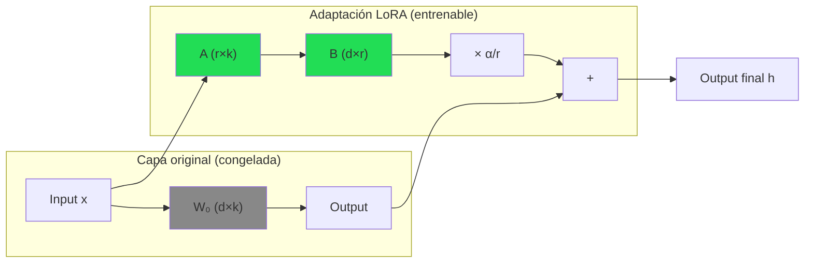
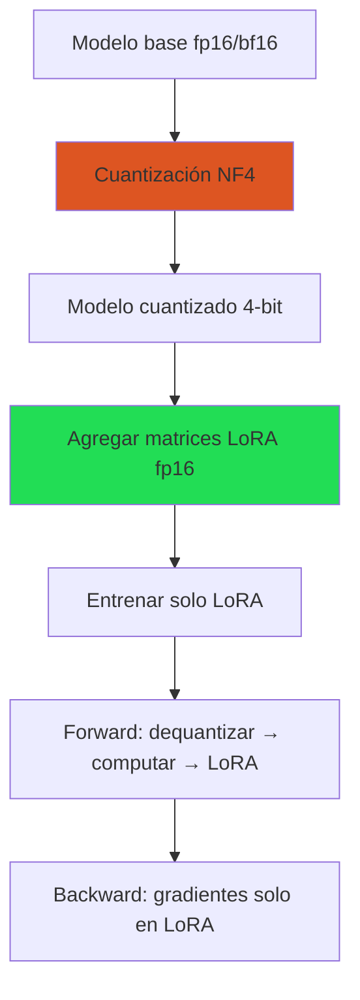
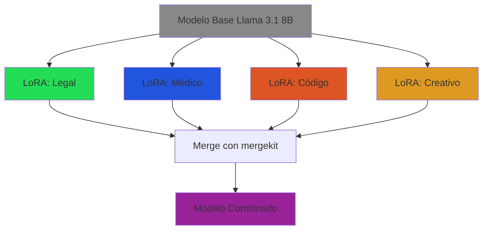

# LoRA y QLoRA: Adaptación de Bajo Rango

> [!abstract] Resumen
> *LoRA* (*Low-Rank Adaptation*) es la técnica dominante de *parameter-efficient fine-tuning* (PEFT). Permite ==adaptar modelos de miles de millones de parámetros entrenando menos del 1% de los pesos==, con calidad comparable al *full fine-tuning*. *QLoRA* extiende LoRA añadiendo ==cuantización a 4 bits del modelo base==, reduciendo los requisitos de memoria a una fracción. Esta nota cubre la matemática subyacente, la implementación práctica, la selección de hiperparámetros y las mejores prácticas para ambas técnicas. ^resumen

---

## Fundamentos matemáticos de LoRA

### El problema original

En el *full fine-tuning*, actualizamos una matriz de pesos $W_0 \in \mathbb{R}^{d \times k}$ con un *update* completo $\Delta W$:

$$W' = W_0 + \Delta W$$

donde $\Delta W$ tiene la misma dimensionalidad que $W_0$. Para un modelo de 7B parámetros, almacenar $\Delta W$ requiere la misma memoria que el modelo completo.

### La hipótesis de bajo rango

La intuición clave de LoRA es que ==el *update* $\Delta W$ tiene dimensionalidad intrínseca baja==[^1]. Es decir, $\Delta W$ puede descomponerse en el producto de dos matrices de rango mucho menor:

$$\Delta W = BA$$

donde:
- $B \in \mathbb{R}^{d \times r}$ — matriz de proyección hacia arriba
- $A \in \mathbb{R}^{r \times k}$ — matriz de proyección hacia abajo
- $r \ll \min(d, k)$ — el **rango** de la adaptación

> [!info] ¿Por qué funciona?
> Aggarwal et al. (2020) demostraron que los modelos pre-entrenados tienen una *dimensionalidad intrínseca* sorprendentemente baja. Esto significa que la adaptación a una tarea específica ocurre en un subespacio de baja dimensión del espacio total de parámetros. LoRA explota esto directamente.

### Implementación en la forward pass

Durante la inferencia, la salida se calcula como:

$$h = W_0 x + \frac{\alpha}{r} BAx$$

donde $\alpha$ es un factor de escala (*scaling factor*). La razón $\alpha/r$ controla la magnitud de la adaptación relativa a los pesos originales.

> [!tip] Relación alpha/rank
> - Si `alpha = rank`, el escalado es 1.0 (comportamiento original del paper)
> - En la práctica, `alpha = 2 * rank` funciona bien como punto de partida
> - Un `alpha` mayor amplifica la adaptación → más expresivo pero menos estable

### Inicialización

- $A$ se inicializa con distribución Gaussiana $\mathcal{N}(0, \sigma^2)$
- $B$ se inicializa en **cero**
- Esto garantiza que $\Delta W = BA = 0$ al inicio del entrenamiento → ==el modelo empieza exactamente como el modelo base==



---

## Reducción de parámetros

### Cálculo del ahorro

Para una capa con $W_0 \in \mathbb{R}^{d \times k}$:

| Método | Parámetros entrenables | Ejemplo (d=4096, k=4096) |
|---|---|---|
| Full fine-tuning | $d \times k$ | 16,777,216 |
| LoRA (r=8) | $r \times (d + k)$ | ==65,536== |
| LoRA (r=16) | $r \times (d + k)$ | 131,072 |
| LoRA (r=64) | $r \times (d + k)$ | 524,288 |
| LoRA (r=256) | $r \times (d + k)$ | 2,097,152 |

> [!success] Reducción típica
> Con `r=16` en un modelo de 7B aplicando LoRA a todas las capas de atención:
> - Parámetros totales del modelo: ~7,000,000,000
> - Parámetros LoRA entrenables: ~18,000,000
> - ==Reducción: 99.7% menos parámetros entrenables==
> - Archivo del adaptador: ~70 MB vs ~14 GB del modelo completo

---

## Módulos objetivo (target modules)

No todas las capas se benefician igual de LoRA. La elección de *target modules* afecta significativamente la calidad.

| Módulo | Descripción | ¿Aplicar LoRA? |
|---|---|---|
| `q_proj` | Proyección de queries en atención | ==Sí (siempre)== |
| `v_proj` | Proyección de values en atención | ==Sí (siempre)== |
| `k_proj` | Proyección de keys en atención | Sí (recomendado) |
| `o_proj` | Proyección de salida en atención | Sí (recomendado) |
| `gate_proj` | Gate en MLP (SwiGLU) | Opcional |
| `up_proj` | Proyección up en MLP | Opcional |
| `down_proj` | Proyección down en MLP | Opcional |
| `embed_tokens` | Embedding de entrada | Rara vez |
| `lm_head` | Cabeza de clasificación | Rara vez |

> [!tip] Recomendación práctica
> - **Mínimo**: `q_proj, v_proj` — el paper original y la configuración más eficiente
> - **Recomendado**: `q_proj, k_proj, v_proj, o_proj` — mejor calidad, costo moderado
> - **Máximo**: Todas las capas lineales — calidad cercana a full FT, más parámetros
>
> [[merging-models|Model merging]] funciona mejor cuando los LoRAs comparten los mismos *target modules*.

---

## QLoRA: Cuantización + LoRA

### La innovación de QLoRA

*QLoRA*[^2] combina tres técnicas para hacer fine-tuning en GPUs de consumo:

1. **NF4 (*NormalFloat* 4-bit)**: Tipo de dato de 4 bits optimizado para pesos con distribución normal
2. **Cuantización doble**: Cuantiza los parámetros de cuantización para ahorrar aún más memoria
3. **Paged optimizers**: Usa memoria paginada para manejar picos de uso



### Comparación de memoria

| Modelo | Full FT (fp16) | LoRA (fp16) | ==QLoRA (NF4)== |
|---|---|---|---|
| 7B | 84 GB | 32 GB | ==6 GB== |
| 13B | 156 GB | 56 GB | ==10 GB== |
| 34B | 408 GB | 140 GB | ==22 GB== |
| 70B | 840 GB | 280 GB | ==42 GB== |

> [!warning] Trade-offs de QLoRA
> - **Velocidad**: QLoRA es ==30-50% más lento== que LoRA fp16 por la dequantización constante
> - **Calidad**: Ligera degradación medible pero rara vez significativa en la práctica
> - **Compatibilidad**: No todos los modelos se cuantizan igual de bien
> - **Merging**: Requiere cuidado adicional al hacer [[merging-models|merge]] de adaptadores QLoRA

---

## Implementación con PEFT

> [!example]- Implementación completa de LoRA con Hugging Face PEFT
> ```python
> import torch
> from transformers import (
>     AutoModelForCausalLM,
>     AutoTokenizer,
>     TrainingArguments,
>     BitsAndBytesConfig,
> )
> from peft import (
>     LoraConfig,
>     get_peft_model,
>     prepare_model_for_kbit_training,
>     TaskType,
> )
> from trl import SFTTrainer
> from datasets import load_dataset
>
> # --- Configuración del modelo base ---
> model_name = "meta-llama/Llama-3.1-8B-Instruct"
>
> # Para QLoRA: configuración de cuantización
> bnb_config = BitsAndBytesConfig(
>     load_in_4bit=True,
>     bnb_4bit_quant_type="nf4",          # NormalFloat 4-bit
>     bnb_4bit_compute_dtype=torch.bfloat16,
>     bnb_4bit_use_double_quant=True,      # Doble cuantización
> )
>
> # Cargar modelo y tokenizer
> model = AutoModelForCausalLM.from_pretrained(
>     model_name,
>     quantization_config=bnb_config,      # Omitir para LoRA sin cuantización
>     device_map="auto",
>     torch_dtype=torch.bfloat16,
>     attn_implementation="flash_attention_2",
> )
> tokenizer = AutoTokenizer.from_pretrained(model_name)
> tokenizer.pad_token = tokenizer.eos_token
>
> # Preparar modelo para entrenamiento con cuantización
> model = prepare_model_for_kbit_training(model)
>
> # --- Configuración de LoRA ---
> lora_config = LoraConfig(
>     task_type=TaskType.CAUSAL_LM,
>     r=16,                                # Rango de la adaptación
>     lora_alpha=32,                        # Factor de escala (2×r)
>     lora_dropout=0.05,                    # Dropout en capas LoRA
>     target_modules=[
>         "q_proj", "k_proj", "v_proj", "o_proj",  # Atención
>         "gate_proj", "up_proj", "down_proj",       # MLP
>     ],
>     bias="none",                          # No entrenar biases
> )
>
> # Aplicar LoRA al modelo
> model = get_peft_model(model, lora_config)
> model.print_trainable_parameters()
> # Output: trainable params: 41,943,040 || all params: 8,072,204,288
> # || trainable%: 0.5194
>
> # --- Dataset ---
> dataset = load_dataset("json", data_files="training_data.jsonl")
>
> # --- Entrenamiento ---
> training_args = TrainingArguments(
>     output_dir="./lora-output",
>     num_train_epochs=3,
>     per_device_train_batch_size=4,
>     gradient_accumulation_steps=4,        # Effective batch = 16
>     learning_rate=2e-4,
>     lr_scheduler_type="cosine",
>     warmup_ratio=0.05,
>     weight_decay=0.01,
>     bf16=True,
>     logging_steps=10,
>     save_strategy="steps",
>     save_steps=100,
>     eval_strategy="steps",
>     eval_steps=100,
>     gradient_checkpointing=True,          # Ahorra memoria
>     optim="paged_adamw_8bit",             # Optimizador paginado (QLoRA)
>     report_to="wandb",
> )
>
> trainer = SFTTrainer(
>     model=model,
>     args=training_args,
>     train_dataset=dataset["train"],
>     eval_dataset=dataset["validation"],
>     tokenizer=tokenizer,
>     max_seq_length=2048,
>     dataset_text_field="text",
> )
>
> trainer.train()
>
> # Guardar solo los pesos LoRA (~70 MB)
> model.save_pretrained("./lora-adapter")
> ```

> [!example]- Inferencia con adaptador LoRA guardado
> ```python
> from transformers import AutoModelForCausalLM, AutoTokenizer
> from peft import PeftModel
>
> # Cargar modelo base
> base_model = AutoModelForCausalLM.from_pretrained(
>     "meta-llama/Llama-3.1-8B-Instruct",
>     device_map="auto",
>     torch_dtype=torch.bfloat16,
> )
>
> # Cargar adaptador LoRA
> model = PeftModel.from_pretrained(
>     base_model,
>     "./lora-adapter",
> )
>
> # Opción: merge para eliminar overhead de inferencia
> model = model.merge_and_unload()
>
> # Inferencia normal
> tokenizer = AutoTokenizer.from_pretrained("meta-llama/Llama-3.1-8B-Instruct")
> inputs = tokenizer("Hola, ¿cómo estás?", return_tensors="pt").to("cuda")
> outputs = model.generate(**inputs, max_new_tokens=256)
> print(tokenizer.decode(outputs[0], skip_special_tokens=True))
> ```

---

## Selección de hiperparámetros

### Rango (r)

El rango es el hiperparámetro más importante. Controla la capacidad expresiva de la adaptación.

| Rango | Parámetros (7B, atención) | Caso de uso |
|---|---|---|
| r=4 | ~4M | Adaptación mínima, estilo simple |
| r=8 | ~8M | Punto de partida razonable |
| ==r=16== | ~16M | ==Recomendado para mayoría de tareas== |
| r=32 | ~32M | Tareas complejas, multi-dominio |
| r=64 | ~64M | Cambios profundos de comportamiento |
| r=256 | ~256M | Cercano a full fine-tuning |

> [!question] ¿Cómo elegir el rango?
> 1. Empieza con `r=16` como baseline
> 2. Si el modelo no converge → sube a `r=32` o `r=64`
> 3. Si converge muy rápido y hay overfitting → baja a `r=8`
> 4. Para tareas simples de formato o estilo, `r=8` suele bastar
> 5. Monitorea la relación train loss / val loss → [[evaluacion-fine-tuning]]

### Alpha (α)

El factor de escala controla la magnitud relativa de la adaptación:

- `alpha = r` → escala 1.0 (default del paper original)
- `alpha = 2*r` → escala 2.0 (==recomendado como punto de partida==)
- `alpha` fijo (ej. 16) mientras se varía `r` → otra estrategia válida

### Learning rate

> [!danger] Error común
> LoRA requiere un *learning rate* ==significativamente mayor== que el *full fine-tuning*:
> - Full FT: `1e-5` a `5e-5`
> - LoRA: `1e-4` a `3e-4`
> - QLoRA: `1e-4` a `2e-4`
>
> Usar `1e-5` con LoRA es un error frecuente que resulta en convergencia extremadamente lenta o nula.

---

## Variantes y evolución

### DoRA (Weight-Decomposed Low-Rank Adaptation)

Descompone $W$ en magnitud y dirección antes de aplicar LoRA. Mejora consistente del 1-3% sobre LoRA estándar con el mismo costo[^3].

### LoRA+

Usa *learning rates* diferentes para $A$ y $B$: el *learning rate* de $B$ es mayor. Mejora velocidad de convergencia.

### rsLoRA (Rank-Stabilized LoRA)

Escala por $1/\sqrt{r}$ en lugar de $1/r$. Permite usar rangos más altos sin inestabilidad.

### AdaLoRA

Asigna presupuesto de rango de forma adaptativa a diferentes capas según su importancia.

### Comparativa de variantes

| Variante | Mejora vs LoRA | Complejidad extra | Soporte en PEFT |
|---|---|---|---|
| DoRA | ==1-3% calidad== | Baja | Sí |
| LoRA+ | Convergencia | Mínima | Parcial |
| rsLoRA | Estabilidad | Mínima | Sí |
| AdaLoRA | Eficiencia | Media | Sí |

---

## LoRA para múltiples tareas y merging

Un modelo base puede servir múltiples adaptadores LoRA simultáneamente:



La capacidad de combinar LoRAs es una de las ventajas más poderosas. Consulta [[merging-models]] para las técnicas de *merge* (TIES, DARE, SLERP) y sus limitaciones.

> [!warning] Interferencia entre LoRAs
> Cuando se combinan LoRAs entrenados en tareas muy diferentes, puede haber interferencia destructiva. Las técnicas de [[merging-models|merging]] como TIES mitigan esto, pero no lo eliminan.

---

## Mejores prácticas

> [!success] Checklist de LoRA
> 1. **Empezar con QLoRA** si la memoria es limitada → más accesible, resultados similares
> 2. **r=16, alpha=32** como configuración inicial por defecto
> 3. **Target modules**: al menos `q_proj, v_proj`; idealmente las 4 proyecciones de atención
> 4. **Learning rate**: `2e-4` con *cosine scheduler*
> 5. **Gradient checkpointing**: siempre activado → reduce memoria ~40%
> 6. **Evaluar con [[evaluacion-fine-tuning|métricas apropiadas]]** antes de merge
> 7. **Guardar checkpoints** frecuentes → los últimos no siempre son los mejores
> 8. **Merge solo cuando sea necesario** → mantener adaptadores separados es más flexible

---

## Relación con el ecosistema

- **[[intake-overview|intake]]**: Los requisitos normalizados por intake pueden especificar configuraciones de LoRA (rango, módulos objetivo, datos de entrenamiento) como parte de la especificación del proyecto. Los parsers podrían extraer estas configuraciones de documentos de diseño.

- **[[architect-overview|architect]]**: El agente de codificación puede generar scripts de entrenamiento LoRA/QLoRA automáticamente. Con *LiteLLM*, architect soporta modelos fine-tuneados con adaptadores LoRA mergeados. Los pipelines YAML pueden automatizar el ciclo completo: preparar datos → entrenar → evaluar → mergear.

- **[[vigil-overview|vigil]]**: Después de aplicar un adaptador LoRA, vigil verifica que el modelo resultante no tenga regresiones de seguridad. Sus 26 reglas detectan si la adaptación introdujo patrones como *empty tests* o *placeholder secrets* en las salidas del modelo.

- **[[licit-overview|licit]]**: Rastrea la proveniencia de los datos usados para entrenar cada adaptador LoRA, esencial para compliance con EU AI Act. Genera registros OWASP Agentic Top 10 que documentan qué adaptadores se usaron y con qué datos fueron entrenados.

---

## Enlaces y referencias

> [!quote]- Bibliografía
> - Hu, E. J., et al. (2021). *LoRA: Low-Rank Adaptation of Large Language Models*. arXiv:2106.09685[^1]
> - Dettmers, T., et al. (2023). *QLoRA: Efficient Finetuning of Quantized Language Models*. arXiv:2305.14314[^2]
> - Liu, S., et al. (2024). *DoRA: Weight-Decomposed Low-Rank Adaptation*. arXiv:2402.09353[^3]
> - Aggarwal, A., et al. (2020). *Intrinsic Dimensionality Explains the Effectiveness of Language Model Fine-Tuning*. arXiv:2012.13255
> - Hayou, S., et al. (2024). *LoRA+: Efficient Low Rank Adaptation of Large Models*. arXiv:2402.12354
> - [[fine-tuning-overview|Nota: Fine-Tuning Visión General]]
> - [[merging-models|Nota: Merging de Modelos]]
> - [[infraestructura-entrenamiento|Nota: Infraestructura de Entrenamiento]]

[^1]: Hu, E. J., et al. "LoRA: Low-Rank Adaptation of Large Language Models." arXiv:2106.09685, 2021.
[^2]: Dettmers, T., et al. "QLoRA: Efficient Finetuning of Quantized Language Models." arXiv:2305.14314, 2023.
[^3]: Liu, S., et al. "DoRA: Weight-Decomposed Low-Rank Adaptation." arXiv:2402.09353, 2024.
