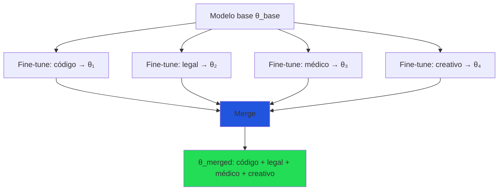
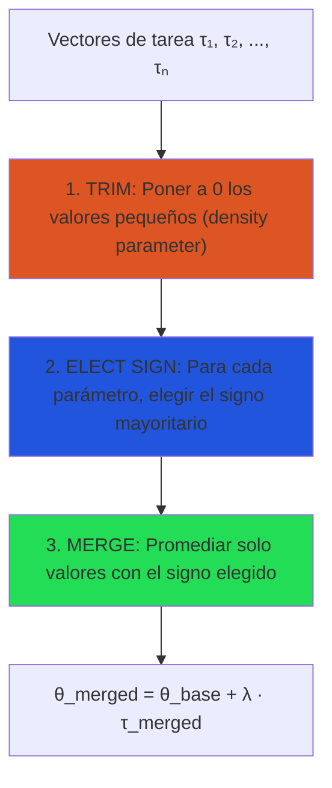
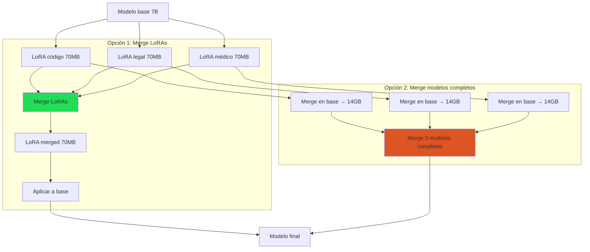
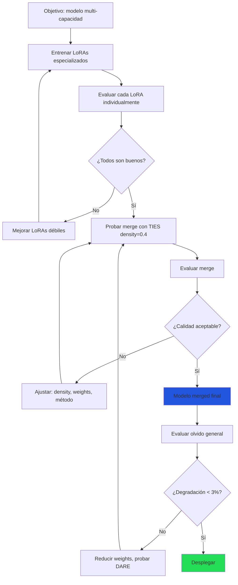

# Merging de Modelos: Combinar Sin Reentrenar

> [!abstract] Resumen
> El *model merging* (combinación de modelos) permite ==combinar capacidades de múltiples modelos fine-tuneados sin entrenamiento adicional==. Técnicas como interpolación lineal, SLERP, TIES y DARE manipulan directamente los pesos del modelo para crear combinaciones que heredan habilidades de los modelos originales. La *task arithmetic* permite sumar y restar "vectores de tarea" para componer comportamientos. Herramientas como *mergekit* hacen el proceso accesible. Esta nota cubre los métodos, cuándo funcionan, los riesgos y el flujo práctico. ^resumen

---

## ¿Qué es model merging?

### Concepto

Dado un modelo base $\theta_{base}$ y varios modelos fine-tuneados $\theta_1, \theta_2, ..., \theta_n$ (todos partiendo del mismo base), el merging combina sus pesos para crear un modelo $\theta_{merged}$ que idealmente ==hereda las capacidades de todos==.



> [!tip] La magia del merging
> El merging es ==gratuito en cómputo==: solo manipula tensores en CPU/RAM, sin GPUs ni gradientes. Un merge de modelos de 7B toma minutos, no horas. Esto lo hace ideal para experimentación rápida.

### Requisito fundamental

> [!danger] Mismo modelo base
> Todos los modelos a mergear ==DEBEN compartir el mismo modelo base y la misma arquitectura==. No puedes mergear un Llama con un Mistral, ni un Llama 7B con un Llama 70B. Los pesos deben ser correspondientes.

---

## Métodos de merging

### 1. Interpolación lineal (Linear / LERP)

El método más simple: promedio ponderado de los pesos.

$$\theta_{merged} = (1 - \alpha) \cdot \theta_1 + \alpha \cdot \theta_2$$

Para múltiples modelos:

$$\theta_{merged} = \sum_{i=1}^{n} w_i \cdot \theta_i, \quad \sum w_i = 1$$

| Aspecto | Interpolación lineal |
|---|---|
| Complejidad | ==Mínima== |
| Calidad | Razonable para 2-3 modelos similares |
| Riesgo | Promedio puede degradar ambos modelos |
| Cuándo usar | Combinar dos variantes cercanas |

> [!warning] El promedio no siempre funciona
> La interpolación lineal asume que el ==paisaje de pérdida es convexo== entre los dos modelos. Esto generalmente no es cierto para redes neuronales profundas, especialmente cuando los modelos divergieron mucho del base.

### 2. SLERP (Spherical Linear Interpolation)

SLERP interpola sobre la ==esfera en el espacio de pesos==, en lugar de la línea recta:

$$\theta_{merged} = \frac{\sin((1-t)\omega)}{\sin(\omega)} \cdot \theta_1 + \frac{\sin(t\omega)}{\sin(\omega)} \cdot \theta_2$$

donde $\omega = \arccos(\hat{\theta}_1 \cdot \hat{\theta}_2)$ es el ángulo entre los vectores de pesos normalizados.

> [!info] ¿Por qué esférico?
> Los pesos de redes neuronales tienden a tener ==magnitudes similares== (están en una hiper-esfera). SLERP preserva la norma de los pesos durante la interpolación, mientras que LERP puede reducirla (el punto medio de dos vectores unitarios tiene norma < 1).

| Aspecto | SLERP |
|---|---|
| Complejidad | Baja |
| Calidad | ==Mejor que LERP== para modelos divergentes |
| Limitación | Solo funciona con ==2 modelos== |
| Cuándo usar | Combinar dos modelos que divergieron significativamente |

### 3. TIES (Trim, Elect Sign, Merge)

TIES[^1] aborda el problema de la ==interferencia entre vectores de tarea== con tres pasos:



| Paso | Qué hace | Por qué |
|---|---|---|
| ==Trim== | Elimina cambios pequeños (ruido) | Reduce interferencia de parámetros irrelevantes |
| ==Elect sign== | Voto mayoritario del signo | Resuelve conflictos de dirección |
| ==Merge== | Promedia valores filtrados | Combina las contribuciones coherentes |

#### Hiperparámetros de TIES

| Parámetro | Descripción | Rango |
|---|---|---|
| `density` | Proporción de parámetros que se conservan (1 - trim ratio) | ==0.2-0.5== |
| `weight` | Peso de cada modelo en el merge | Suma a 1.0 |

> [!tip] TIES es el método recomendado para 3+ modelos
> Para combinar tres o más modelos, ==TIES es generalmente la mejor opción==. Maneja bien la interferencia entre múltiples fuentes y produce resultados consistentes.

### 4. DARE (Drop And REscale)

DARE[^2] usa un enfoque probabilístico: ==elimina aleatoriamente una fracción de los cambios y reescala== los restantes:

$$\tau_{DARE} = \text{rescale}(\text{mask}(\tau, p))$$

donde:
- $\text{mask}(\tau, p)$ pone a cero cada elemento con probabilidad $p$
- $\text{rescale}$ multiplica por $1/(1-p)$ para mantener la magnitud esperada

| Parámetro | Descripción | Rango |
|---|---|---|
| `drop_rate` (p) | Probabilidad de eliminar cada parámetro | ==0.7-0.9== |
| `weight` | Peso de cada modelo | Variable |
| Método de merge | TIES o linear después del drop | TIES recomendado |

> [!success] DARE: sorprendentemente efectivo
> DARE demuestra que ==la gran mayoría de los cambios de fine-tuning son redundantes==. Eliminar 80-90% de los deltas y reescalar produce resultados comparables o superiores al merge sin drop. Esto también reduce la interferencia entre modelos.

### 5. Task Arithmetic

*Task arithmetic*[^3] trata los cambios de fine-tuning como ==vectores que pueden sumarse, restarse y escalarse==:

$$\tau_i = \theta_i - \theta_{base}$$

$$\theta_{merged} = \theta_{base} + \lambda_1 \tau_1 + \lambda_2 \tau_2 - \lambda_3 \tau_3$$

> [!example]- Operaciones con task vectors
> ```
> Vector de tarea: τ = θ_finetuned - θ_base
>
> Suma (combinar capacidades):
>   θ_merged = θ_base + τ_código + τ_matemáticas
>   → Modelo bueno en código Y matemáticas
>
> Resta (eliminar capacidades):
>   θ_merged = θ_base + τ_chat - 0.5·τ_toxicidad
>   → Modelo de chat con menos toxicidad
>
> Escalado (controlar intensidad):
>   θ_merged = θ_base + 1.5·τ_creativo
>   → Modelo más creativo (pero potencialmente inestable)
>
> Composición compleja:
>   θ_merged = θ_base + 0.8·τ_legal + 0.6·τ_español - 0.3·τ_verboso
>   → Modelo legal en español, menos verboso
> ```

> [!warning] La resta no siempre funciona limpiamente
> Restar un vector de tarea puede producir ==resultados impredecibles==. La relación entre tareas no es perfectamente lineal. Usar coeficientes pequeños (0.1-0.5) para la resta y evaluar cuidadosamente.

---

## Comparativa de métodos

| Método | # Modelos | Interferencia | Calidad | Complejidad | Mejor para |
|---|---|---|---|---|---|
| LERP | 2-N | Alta | Media | ==Mínima== | Modelos muy similares |
| ==SLERP== | ==2== | Media | ==Alta== | Baja | ==2 modelos divergentes== |
| ==TIES== | ==2-N== | ==Baja== | ==Alta== | Media | ==3+ modelos, general== |
| ==DARE== | 2-N | ==Baja== | ==Alta== | Media | Muchos modelos, redundancia |
| Task arithmetic | 2-N | Variable | Variable | Baja | Composición creativa |

---

## Herramientas: mergekit

*mergekit*[^4] es la herramienta estándar para model merging:

> [!example]- Configuración de mergekit: TIES merge de 3 modelos
> ```yaml
> # merge_config.yaml
> merge_method: ties
> base_model: meta-llama/Llama-3.1-8B-Instruct
> parameters:
>   density: 0.4        # Conservar 40% de los deltas
>   normalize: true
>   int8_mask: true      # Eficiencia de memoria
> dtype: bfloat16
>
> models:
>   - model: my-org/llama3-code-expert
>     parameters:
>       weight: 0.4      # Más peso al código
>
>   - model: my-org/llama3-legal-expert
>     parameters:
>       weight: 0.3
>
>   - model: my-org/llama3-medical-expert
>     parameters:
>       weight: 0.3
>
> # Ejecutar:
> # mergekit-yaml merge_config.yaml ./merged-output
> #   --cuda                  # Usar GPU (más rápido)
> #   --lazy-unpickle         # Eficiente en memoria
> #   --allow-crimes          # Permitir merges experimentales
> ```

> [!example]- Configuración de mergekit: SLERP de 2 modelos
> ```yaml
> merge_method: slerp
> base_model: meta-llama/Llama-3.1-8B-Instruct
> dtype: bfloat16
>
> parameters:
>   t: 0.5              # Balance 50/50 (variar entre 0.3-0.7)
>
> models:
>   - model: my-org/llama3-creative
>   - model: my-org/llama3-analytical
> ```

> [!example]- Configuración de mergekit: DARE + TIES
> ```yaml
> merge_method: dare_ties
> base_model: meta-llama/Llama-3.1-8B-Instruct
> parameters:
>   density: 0.3         # Solo 30% de los deltas (drop 70%)
>   normalize: true
> dtype: bfloat16
>
> models:
>   - model: my-org/llama3-coding
>     parameters:
>       weight: 0.5
>
>   - model: my-org/llama3-reasoning
>     parameters:
>       weight: 0.3
>
>   - model: my-org/llama3-creative
>     parameters:
>       weight: 0.2
> ```

### Instalación y uso

> [!example]- Instalación y ejecución de mergekit
> ```bash
> # Instalar
> pip install mergekit
>
> # Merge básico
> mergekit-yaml merge_config.yaml ./output-dir \
>     --cuda \
>     --lazy-unpickle
>
> # Merge de LoRAs (sin mergear en modelo completo primero)
> mergekit-yaml merge_lora_config.yaml ./output-dir \
>     --cuda \
>     --lora-merge-cache ./lora-cache
>
> # Subir a Hugging Face Hub
> huggingface-cli upload my-org/merged-model ./output-dir
> ```

---

## Merging de adaptadores LoRA

Mergear adaptadores [[lora-qlora|LoRA]] directamente es más eficiente que mergear modelos completos:



> [!tip] Mergear LoRAs es preferible
> - ==Más rápido==: Manipula tensores de 70MB en lugar de 14GB
> - ==Menos memoria==: Solo necesita los adaptadores en RAM
> - ==Más flexible==: Puedes probar muchas combinaciones rápidamente
> - Mismo resultado si los LoRAs comparten los mismos target modules

---

## Cuándo funciona y cuándo no

### Funciona bien

> [!success] Escenarios favorables
> 1. **Tareas complementarias**: Código + razonamiento + formato → poca interferencia
> 2. **Mismo dominio, diferentes aspectos**: Legal-contratos + legal-litigios
> 3. **LoRAs con ranks bajos**: Menos interferencia con ranks pequeños (r=8-16)
> 4. **Modelos no divergentes**: Fine-tuning ligero (pocas épocas, LoRA)
> 5. **Base chat + especializaciones**: El modelo chat ya es bueno, las especializaciones son incrementales

### No funciona bien

> [!failure] Escenarios desfavorables
> 1. **Tareas contradictorias**: Un modelo verboso + uno conciso → resultado inconsistente
> 2. **Full fine-tuning extenso**: Modelos que divergieron mucho del base → demasiada interferencia
> 3. **Modelos base diferentes**: ==NUNCA funciona== (arquitectura incompatible)
> 4. **Expectativas demasiado altas**: El merge rara vez es mejor que el mejor modelo individual
> 5. **Muchos modelos mediocres**: Mergear 10 modelos malos no produce uno bueno

---

## Flujo de trabajo práctico



### Checklist de merging

- [ ] Todos los modelos comparten el mismo modelo base
- [ ] Cada modelo individual fue evaluado y es bueno en su tarea
- [ ] Método seleccionado según número de modelos y divergencia
- [ ] Hiperparámetros iniciales definidos (density, weights)
- [ ] Evaluación post-merge en tareas individuales → ¿se preservan capacidades?
- [ ] Evaluación post-merge en benchmarks generales → [[evaluacion-fine-tuning]]
- [ ] Verificación de seguridad → [[vigil-overview|vigil]]
- [ ] Documentación de proveniencia → [[licit-overview|licit]]

---

## Merges notables de la comunidad

La comunidad open-source ha producido modelos merged que ==frecuentemente superan a sus componentes individuales==:

| Merge | Componentes | Método | Resultado |
|---|---|---|---|
| NeuralChat-7B | Múltiples LoRAs de chat | TIES | Top Open LLM Leaderboard (su momento) |
| Goliath-120B | 2× Llama 70B (frankenmerge) | Concatenación de capas | ==Modelo 120B sin entrenamiento adicional== |
| Dolphin-2.x | Modelos de chat + código | SLERP/TIES | Popular en la comunidad |
| Nous-Hermes merges | Hermes + código + razonamiento | TIES | Consistentemente buenos |

> [!question] ¿Los frankenmerges funcionan?
> Los "frankenmerges" (concatenar capas de diferentes modelos) son ==experimentales y poco confiables==. A veces producen resultados sorprendentes, pero frecuentemente generan modelos incoherentes. Los métodos matemáticamente fundados (TIES, DARE, SLERP) son más predecibles.

---

## Relación con el ecosistema

- **[[intake-overview|intake]]**: Las especificaciones de intake definen qué capacidades debe tener el modelo final. Si el requisito es "experto en código + formato legal + español fluido", intake informa la estrategia de merging: qué LoRAs especializados entrenar y cómo combinarlos.

- **[[architect-overview|architect]]**: Architect puede automatizar pipelines de merging como parte del ciclo de desarrollo. Los pipelines YAML definen: entrenar LoRAs → evaluar individualmente → mergear con mergekit → evaluar merge → desplegar si pasa umbrales. LiteLLM sirve el modelo merged resultante. El cost tracking compara el costo de merging (minutos) vs reentrenamiento (horas).

- **[[vigil-overview|vigil]]**: Post-merge, vigil verifica que la combinación no haya introducido vulnerabilidades. Es especialmente relevante verificar que merges que incluyen modelos de código no introduzcan patrones de *slopsquatting* o *placeholder secrets*. Los 26 reglas de vigil se aplican al modelo merged antes del despliegue.

- **[[licit-overview|licit]]**: El modelo merged hereda las licencias de todos sus componentes. Licit rastrea la cadena de proveniencia completa: qué modelo base, qué LoRAs, qué método de merge, qué licencia tiene cada componente. Si un componente tiene licencia restrictiva, ==todo el merge hereda esa restricción==. Annex IV del EU AI Act requiere esta documentación.

---

## Enlaces y referencias

> [!quote]- Bibliografía
> - Yadav, P., et al. (2023). *TIES-Merging: Resolving Interference When Merging Models*. NeurIPS 2023[^1]
> - Yu, L., et al. (2024). *Language Model is Secretly a DARE Merger*. arXiv:2311.03099[^2]
> - Ilharco, G., et al. (2022). *Editing Models with Task Arithmetic*. ICLR 2023[^3]
> - Goddard, C., et al. (2024). *mergekit: Tools for Merging Pretrained Language Models*. GitHub[^4]
> - Wortsman, M., et al. (2022). *Model soups: averaging weights of multiple fine-tuned models improves accuracy without increasing inference time*. ICML 2022
> - [[lora-qlora|Nota: LoRA y QLoRA]]
> - [[fine-tuning-overview|Nota: Fine-Tuning Visión General]]
> - [[continual-learning|Nota: Aprendizaje Continuo]]

[^1]: Yadav, P., et al. "TIES-Merging: Resolving Interference When Merging Models." NeurIPS 2023.
[^2]: Yu, L., et al. "Language Model is Secretly a DARE Merger." arXiv:2311.03099, 2024.
[^3]: Ilharco, G., et al. "Editing Models with Task Arithmetic." ICLR 2023.
[^4]: Goddard, C., et al. "mergekit: Tools for Merging Pretrained Language Models." https://github.com/arcee-ai/mergekit
