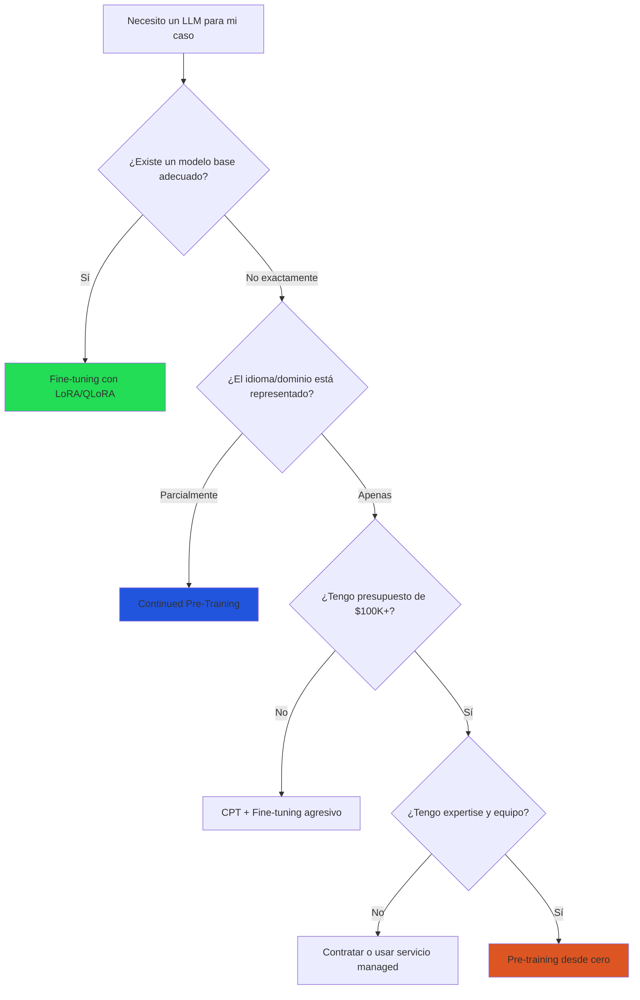
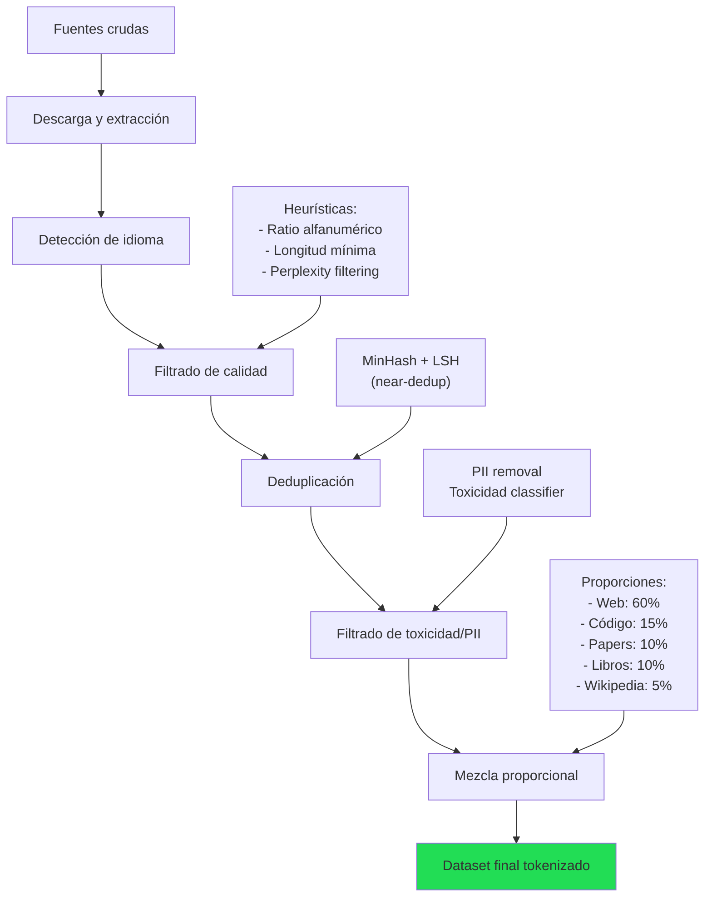
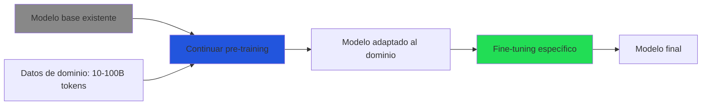

# Pre-Training desde Cero: Cuándo y Cómo

> [!abstract] Resumen
> El *pre-training* (pre-entrenamiento) desde cero es el proceso de entrenar un modelo de lenguaje desde pesos aleatorios usando un corpus masivo de texto. Es ==extremadamente costoso y rara vez justificado== para la mayoría de organizaciones. Esta nota cubre los escasos escenarios donde tiene sentido, los requisitos de datos (1-15 trillones de tokens), cómputo (miles a millones de GPU-hours) y expertise, el proceso paso a paso, la aplicación de *scaling laws* y los ejemplos open-source más relevantes: Llama, Pythia, OLMo y DBRX. ^resumen

---

## ¿Cuándo tiene sentido pre-entrenar desde cero?

> [!danger] La regla por defecto: NO lo hagas
> Para ==el 99% de los casos==, el fine-tuning de un modelo existente es superior al pre-training. Pre-entrenar desde cero solo tiene sentido en escenarios muy específicos:

### Escenarios legítimos

| Escenario | Ejemplo | Justificación |
|---|---|---|
| Idioma no representado | Modelo para quechua, guaraní | Modelos existentes tienen <0.1% del idioma |
| Dominio ultra-especializado | Genómica, astrofísica | Corpus de dominio > corpus general en relevancia |
| Control total del pipeline | Soberanía de IA nacional | Requisitos regulatorios de no depender de terceros |
| Investigación de arquitectura | Nuevas variantes de transformer | Necesario para publicar resultados válidos |
| Tokenizer especializado | Código en lenguajes de nicho | Tokenizer existente es ineficiente para el dominio |

> [!warning] Pre-training es "continuable"
> Antes de entrenar desde cero, considera *continued pre-training* (CPT): tomar un modelo existente y ==continuar el pre-training con datos de tu dominio==. CPT logra resultados similares al pre-training completo con 10-100× menos costo.



---

## Requisitos

### Datos

| Tamaño del modelo | Tokens óptimos (Chinchilla) | Tokens prácticos (2024+) | Corpus aprox. |
|---|---|---|---|
| 1B | 20B | 50-100B | ~200 GB texto |
| 7B | 140B | ==1-2T== | ~4-8 TB texto |
| 13B | 260B | 2-5T | ~8-20 TB texto |
| 34B | 680B | 3-8T | ~12-32 TB texto |
| 70B | 1.4T | ==5-15T== | ~20-60 TB texto |
| 405B | 8.1T | 15T+ | 60+ TB texto |

> [!info] Chinchilla vs práctica actual
> Las *scaling laws* de Chinchilla[^1] predicen tokens óptimos = 20× parámetros. Pero desde 2024, la práctica es ==entrenar con 10-100× más tokens== de lo que Chinchilla sugiere porque:
> - La inferencia es más cara que el entrenamiento a largo plazo
> - Modelos "over-trained" son más eficientes en inferencia
> - Más datos de calidad mejoran el rendimiento incluso con parámetros fijos

### Fuentes de datos para pre-training

| Dataset | Tamaño | Contenido | Calidad | Licencia |
|---|---|---|---|---|
| Common Crawl | ~100TB/mes | Web general | Baja (sin filtrar) | Dominio público |
| The Pile | 825 GB | Web + libros + código + papers | ==Alta (curado)== | MIT |
| RedPajama v2 | 30T tokens | Web filtrada | Media-Alta | Apache 2.0 |
| FineWeb | 15T tokens | Web filtrada (HF) | ==Alta== | ==ODC-By== |
| StarCoder Data | 783 GB | Código (86 lenguajes) | Alta | Múltiples |
| Wikipedia | ~20 GB | Enciclopedia | ==Muy alta== | CC BY-SA |
| ArXiv | ~50 GB | Papers científicos | Muy alta | Mixta |

### Cómputo

| Modelo | GPU-hours estimadas | Costo estimado (H100 cloud) | Tiempo (8× H100) |
|---|---|---|---|
| 1B (100B tokens) | ~1,000 | ==$3,000-5,000== | ~5 días |
| 7B (1T tokens) | ~30,000 | ==$100,000-150,000== | ~5 meses |
| 13B (2T tokens) | ~100,000 | $300,000-500,000 | ~1.5 años |
| 70B (15T tokens) | ~1,500,000 | ==$5,000,000-10,000,000== | ~20 años (8 GPUs) |
| 405B (15T tokens) | ~30,000,000 | $100,000,000+ | Requiere cluster |

> [!danger] El costo real es mayor
> Los costos anteriores asumen eficiencia perfecta. En la práctica:
> - **Experimentos fallidos**: 2-5× el costo de un entrenamiento exitoso
> - **Infraestructura**: Networking, storage, monitoreo
> - **Personal**: Ingenieros ML senior ($200K-500K/año)
> - **Datos**: Limpieza, deduplicación, filtrado
> - **Evaluación**: Benchmarks, evaluación humana → [[evaluacion-fine-tuning]]
>
> ==Presupuesto total realista: 3-5× el costo de GPU puro==

### Expertise

> [!question] ¿Qué equipo necesito?
> | Rol | Cantidad | Expertise |
> |---|---|---|
> | ML Engineer senior | 2-5 | Entrenamiento distribuido, debugging |
> | Data Engineer | 1-3 | Pipelines de datos a escala |
> | Infra/DevOps | 1-2 | Clusters, networking, storage |
> | Research Scientist | 1-2 | Diseño de arquitectura, hiperparámetros |
> | Evaluación | 1-2 | Benchmarks, evaluación humana |
> | PM/Lead | 1 | Coordinación, priorización |
>
> ==Equipo mínimo viable: 4-6 personas, todas con experiencia en LLMs==

---

## Proceso paso a paso

### 1. Recopilación y limpieza de datos



> [!tip] La proporción de datos importa
> La mezcla de dominios afecta significativamente las capacidades del modelo:
> - Más código → mejor razonamiento
> - Más papers → mejor conocimiento científico
> - Más conversación → mejor chat (pero puede degradar precisión)
> - Llama 3 usó ==~50% código== y obtuvo mejoras significativas en razonamiento general

### 2. Entrenamiento del tokenizer

> [!warning] El tokenizer es una decisión irreversible
> Una vez entrenado el modelo, ==no puedes cambiar el tokenizer==. Un tokenizer malo (ej. que tokeniza tu idioma en caracteres individuales) afectará permanentemente el rendimiento.

| Algoritmo | Uso | Ventajas |
|---|---|---|
| ==BPE (Byte-Pair Encoding)== | ==Llama, GPT, Mistral== | ==Estándar, robusto== |
| Unigram (SentencePiece) | T5, mBART | Probabilístico |
| WordPiece | BERT, DistilBERT | Variante de BPE |
| BPE sobre bytes | Llama 3 | Sin caracteres OOV |

Vocabulario típico: ==32K-128K tokens==. Llama 3 usa 128K para mejor cobertura multilingüe.

### 3. Arquitectura

La mayoría de modelos modernos usan variantes del *decoder-only transformer*:

| Componente | Opciones modernas | Elección común |
|---|---|---|
| Atención | MHA, GQA, MQA | ==GQA== (Group Query Attention) |
| Posición | RoPE, ALiBi | ==RoPE== |
| Normalización | LayerNorm, RMSNorm | ==RMSNorm== |
| Activación | GELU, SwiGLU | ==SwiGLU== |
| Embedding | Tied, untied | Untied (modelos grandes) |
| Context length | 2K-128K | 8K-128K |

### 4. Entrenamiento

> [!example]- Hiperparámetros típicos de pre-training
> ```yaml
> # Configuración inspirada en Llama 3
> model:
>   hidden_size: 4096
>   num_layers: 32
>   num_attention_heads: 32
>   num_kv_heads: 8          # GQA: 4 queries por KV head
>   intermediate_size: 14336  # SwiGLU MLP
>   vocab_size: 128256
>   max_position_embeddings: 8192
>   rope_theta: 500000
>
> training:
>   max_steps: 1_000_000
>   global_batch_size: 4_000_000  # tokens por step
>   micro_batch_size: 4
>   sequence_length: 8192
>   learning_rate: 3e-4
>   min_learning_rate: 3e-5       # 10% del max
>   lr_scheduler: cosine
>   warmup_steps: 2000
>   weight_decay: 0.1
>   gradient_clipping: 1.0
>   adam_beta1: 0.9
>   adam_beta2: 0.95
>   adam_epsilon: 1e-8
>
> precision:
>   compute_dtype: bfloat16
>   param_dtype: bfloat16
>   grad_dtype: float32
>
> distributed:
>   tensor_parallel: 4
>   pipeline_parallel: 2
>   data_parallel: auto
>   fsdp: true
> ```

### 5. Monitoreo durante el entrenamiento

| Métrica | Frecuencia | Señal de alarma |
|---|---|---|
| Training loss | Cada step | Spikes, no convergencia |
| Gradient norm | Cada step | Explosión (>100), desvanecimiento (<1e-5) |
| Learning rate | Cada step | Verificar schedule |
| GPU utilization | Continuo | ==<80% → bottleneck== |
| MFU (Model FLOPs Utilization) | Cada 100 steps | ==<40% → ineficiente== |
| Eval loss | Cada 1K-10K steps | No baja → datos agotados |
| Eval benchmarks | Cada 10K-50K steps | Seguimiento de capacidades |

> [!success] MFU objetivo
> *Model FLOPs Utilization* mide qué % del throughput teórico se alcanza:
> - **<30%**: Problema de infraestructura (networking, IO)
> - **30-40%**: Aceptable para clusters pequeños
> - **==40-55%==**: ==Buen rendimiento== para la mayoría de setups
> - **>55%**: Excelente (clusters optimizados con InfiniBand)

---

## Scaling laws

### Leyes de Chinchilla

La ley fundamental[^1]: dado un presupuesto de cómputo $C$, el rendimiento óptimo se logra cuando:

$$N_{opt} \propto C^{0.5}, \quad D_{opt} \propto C^{0.5}$$

Donde $N$ es el número de parámetros y $D$ el número de tokens. Es decir, ==parámetros y datos deben escalarse al mismo ritmo==.

### Más allá de Chinchilla

Desde 2024, la comunidad ha encontrado que entrenar con ==mucho más datos de lo que Chinchilla sugiere== es óptimo para el costo total (incluyendo inferencia)[^2]:

| Modelo | Parámetros | Tokens | Ratio D/N | Chinchilla ratio |
|---|---|---|---|---|
| Chinchilla | 70B | 1.4T | 20 | ==20 (óptimo)== |
| Llama 2 | 70B | 2T | 29 | 1.4× sobre-entrenado |
| Llama 3 | 70B | ==15T== | ==214== | ==10.7× sobre-entrenado== |
| Mistral 7B | 7B | ~2T | 286 | 14.3× sobre-entrenado |
| Qwen 2.5 72B | 72B | 18T | 250 | 12.5× sobre-entrenado |

> [!info] ¿Por qué sobre-entrenar?
> Un modelo sobre-entrenado (más tokens de lo Chinchilla-óptimo) tiene ==mejor rendimiento por parámetro==. Dado que la inferencia escala con los parámetros (no con los tokens de entrenamiento), invertir más en entrenamiento reduce el costo total de vida del modelo.

---

## Ejemplos open-source notables

### Llama (Meta)

| Versión | Parámetros | Tokens | Cómputo | Datos |
|---|---|---|---|---|
| Llama 1 (2023) | 7-65B | 1-1.4T | ~2M GPU-hrs (A100) | Público |
| Llama 2 (2023) | 7-70B | 2T | ~3.3M GPU-hrs | Público |
| ==Llama 3.1 (2024)== | 8-405B | ==15T== | ~30M GPU-hrs (H100) | Público + curado |

> [!success] Llama como referencia
> Llama es la referencia del estado del arte open-source. Su documentación técnica (los papers) es ==la mejor guía disponible== para pre-training práctico.

### Pythia (EleutherAI)

Suite de modelos (70M-12B) entrenados específicamente para investigación[^3]:
- ==Checkpoints públicos cada 1000 steps==
- Datos exactos públicos (The Pile, deduplicado)
- Permite estudiar cómo evoluciona el aprendizaje durante el entrenamiento
- Ideal para investigación en [[continual-learning|aprendizaje continuo]] y emergent abilities

### OLMo (AI2)

*Open Language Model*: ==todo abierto==, incluyendo:
- Datos de entrenamiento (Dolma)
- Código de entrenamiento
- Checkpoints intermedios
- Logs de entrenamiento
- Código de evaluación

> [!tip] OLMo para aprender
> Si tu objetivo es ==aprender a pre-entrenar==, OLMo es el mejor punto de partida. Todo es transparente y reproducible, a diferencia de Llama donde solo tienes el paper y los pesos finales.

---

## Continued Pre-Training (CPT)

La alternativa pragmática al pre-training completo:



| Aspecto | Pre-training completo | ==CPT== |
|---|---|---|
| Costo | $100K-$10M+ | ==$1K-$100K== |
| Datos | 1-15T tokens | ==10-100B tokens== |
| Tiempo | Meses | ==Días-semanas== |
| Expertise | Equipo de 5+ expertos | ==1-2 ingenieros ML== |
| Calidad en dominio | Máxima | ==Comparable== |
| Calidad general | Máxima (si datos son buenos) | Preservada del modelo base |

> [!warning] Cuidado con el learning rate en CPT
> El learning rate para CPT debe ser ==significativamente menor== que para pre-training:
> - Pre-training: 3e-4
> - CPT: ==1e-5 a 5e-5==
>
> Un LR demasiado alto causa [[continual-learning|olvido catastrófico]] del conocimiento del modelo base.

---

## Relación con el ecosistema

- **[[intake-overview|intake]]**: Para el raro caso de pre-training, intake normaliza los requisitos del proyecto: tamaño del modelo, dominios de datos, idiomas, presupuesto. Los 12+ parsers de intake procesan documentos de diseño técnico que especifican la arquitectura y los hiperparámetros objetivo.

- **[[architect-overview|architect]]**: Architect orquesta pipelines de pre-training a través de sus pipelines YAML, aunque esto requiere configuración avanzada. El tracking de costos es crítico dado los presupuestos de pre-training. OpenTelemetry exporta métricas de entrenamiento (MFU, loss, throughput) para monitoreo en tiempo real. El sistema de *git worktrees* de architect permite gestionar múltiples experimentos simultáneos.

- **[[vigil-overview|vigil]]**: Vigil escanea el código de pre-training para detectar vulnerabilidades en el pipeline. También verifica que los datos de entrenamiento no contengan *placeholder secrets* o información sensible que el modelo podría memorizar y luego filtrar.

- **[[licit-overview|licit]]**: Para modelos pre-entrenados destinados al mercado europeo, licit es esencial. El EU AI Act clasifica los modelos de propósito general (GPAI) con requisitos específicos de transparencia. Licit genera la documentación requerida: proveniencia de datos, consumo energético, evaluaciones de capacidades y limitaciones.

---

## Enlaces y referencias

> [!quote]- Bibliografía
> - Hoffmann, J., et al. (2022). *Training Compute-Optimal Large Language Models (Chinchilla)*. arXiv:2203.15556[^1]
> - Sardana, N., & Frankle, J. (2024). *Beyond Chinchilla-Optimal: Accounting for Inference in Language Model Scaling Laws*. arXiv:2401.00448[^2]
> - Biderman, S., et al. (2023). *Pythia: A Suite for Analyzing Large Language Models*. ICML 2023[^3]
> - Groeneveld, D., et al. (2024). *OLMo: Accelerating the Science of Language Models*. arXiv:2402.00838
> - Touvron, H., et al. (2023). *Llama 2: Open Foundation and Fine-Tuned Chat Models*. arXiv:2307.09288
> - Dubey, A., et al. (2024). *The Llama 3 Herd of Models*. arXiv:2407.21783
> - [[fine-tuning-overview|Nota: Fine-Tuning Visión General]]
> - [[infraestructura-entrenamiento|Nota: Infraestructura de Entrenamiento]]
> - [[continual-learning|Nota: Aprendizaje Continuo]]

[^1]: Hoffmann, J., et al. "Training Compute-Optimal Large Language Models." arXiv:2203.15556, 2022.
[^2]: Sardana, N., & Frankle, J. "Beyond Chinchilla-Optimal: Accounting for Inference." arXiv:2401.00448, 2024.
[^3]: Biderman, S., et al. "Pythia: A Suite for Analyzing Large Language Models." ICML 2023.
