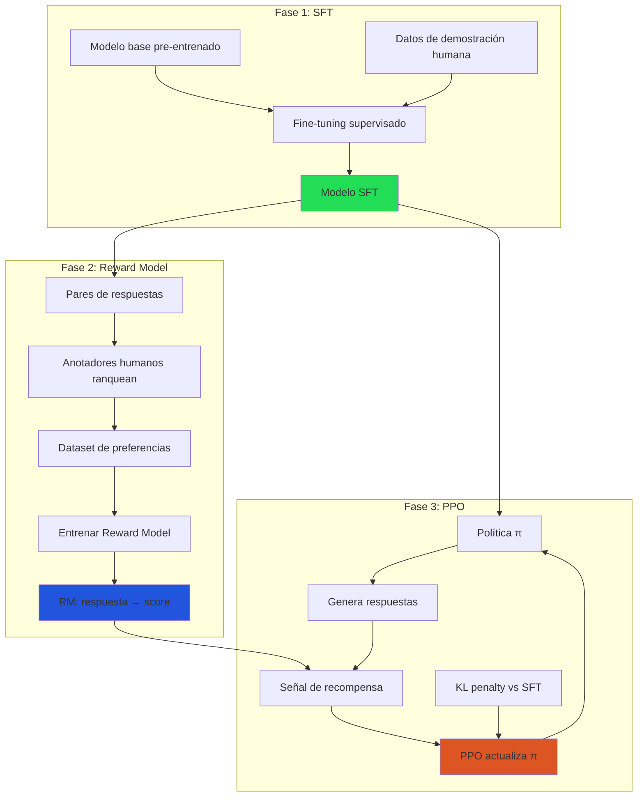
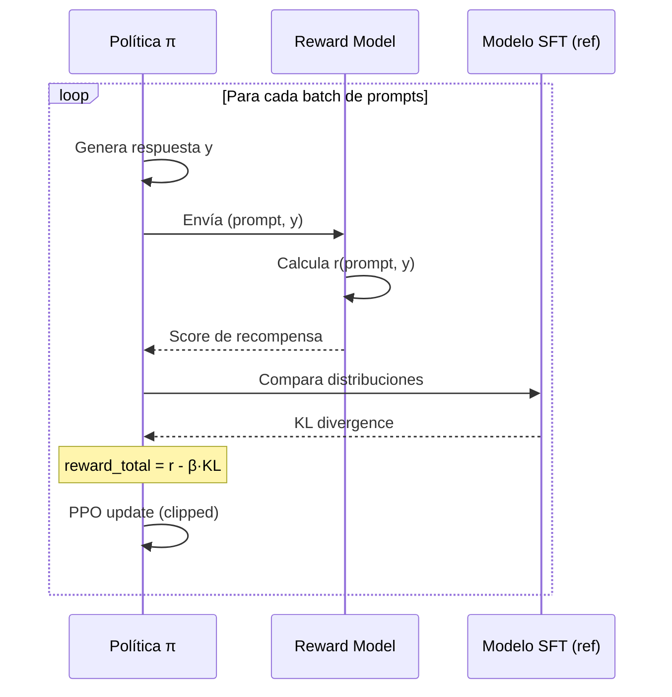

# RLHF: Aprendizaje por Refuerzo con Retroalimentación Humana

> [!abstract] Resumen
> *Reinforcement Learning from Human Feedback* (RLHF) es el proceso que convierte un modelo de lenguaje pre-entrenado en un ==asistente alineado con preferencias humanas==. Consiste en tres fases: *Supervised Fine-Tuning* (SFT), entrenamiento de un *Reward Model* (RM) y optimización con *Proximal Policy Optimization* (PPO). RLHF fue la técnica clave detrás de ChatGPT e InstructGPT, y sigue siendo ==el estándar de referencia para alineación==, aunque alternativas como [[dpo-alternativas|DPO]] lo están reemplazando en la práctica por su menor complejidad. ^resumen

---

## Las tres fases de RLHF



---

## Fase 1: Supervised Fine-Tuning (SFT)

### Objetivo

Convertir el modelo base (que solo predice el siguiente token) en un modelo que siga instrucciones. Esta fase es idéntica al [[instruction-tuning|*instruction tuning*]].

### Datos necesarios

Se recopilan demostraciones de alta calidad escritas por humanos:

| Componente | Descripción | Volumen típico |
|---|---|---|
| Prompts | Instrucciones diversas | 10K-100K |
| Respuestas | Escritas por anotadores expertos | 10K-100K |
| Formato | Conversacional (system/user/assistant) | — |
| Calidad | ==Máxima==: cada respuesta es el "gold standard" | — |

> [!tip] Calidad sobre cantidad
> InstructGPT usó solo ~13K demostraciones de alta calidad para SFT. La calidad de los datos en esta fase es ==más importante que la cantidad==. Un dataset pequeño de expertos supera a uno grande de crowd workers[^1].

### Proceso

> [!example]- Ejemplo de dato SFT
> ```json
> {
>   "messages": [
>     {"role": "system", "content": "Eres un asistente útil y preciso."},
>     {"role": "user", "content": "Explica la diferencia entre RNA y DNA."},
>     {"role": "assistant", "content": "El DNA (ácido desoxirribonucleico) y el RNA (ácido ribonucleico) son ambos ácidos nucleicos, pero difieren en varios aspectos fundamentales:\n\n1. **Estructura**: El DNA es de doble hebra (doble hélice), mientras que el RNA es típicamente de hebra simple.\n\n2. **Azúcar**: El DNA contiene desoxirribosa; el RNA contiene ribosa (con un grupo hidroxilo adicional en el carbono 2').\n\n3. **Bases nitrogenadas**: Ambos comparten adenina, guanina y citosina. El DNA usa timina (T), mientras que el RNA usa uracilo (U).\n\n4. **Función**: El DNA almacena la información genética a largo plazo. El RNA tiene múltiples funciones: mensajero (mRNA), transferencia (tRNA), ribosomal (rRNA) y regulación.\n\n5. **Estabilidad**: El DNA es más estable químicamente. El RNA se degrada más fácilmente, lo cual es funcionalmente importante para la regulación temporal de la expresión génica."}
>   ]
> }
> ```

El modelo resultante de SFT ya puede seguir instrucciones, pero tiende a ser verboso, inconsistente en calidad y a veces produce respuestas dañinas. Las fases 2 y 3 corrigen esto.

---

## Fase 2: Reward Model (RM)

### Objetivo

Entrenar un modelo que asigne un *score* numérico a cualquier par (prompt, respuesta), reflejando la preferencia humana.

### Recopilación de preferencias

Para cada prompt, el modelo SFT genera múltiples respuestas. Anotadores humanos las rankean:

```
Prompt: "¿Cuáles son las ventajas de la energía solar?"

Respuesta A: [respuesta detallada, precisa, bien estructurada] → Rank 1 (mejor)
Respuesta B: [respuesta correcta pero breve]                  → Rank 2
Respuesta C: [respuesta con errores factuales]                 → Rank 3
Respuesta D: [respuesta evasiva o dañina]                      → Rank 4 (peor)
```

> [!info] Modelo Bradley-Terry
> Las preferencias se modelan con el modelo Bradley-Terry. Para dos respuestas $y_w$ (ganadora) y $y_l$ (perdedora):
>
> $$P(y_w \succ y_l | x) = \sigma(r_\theta(x, y_w) - r_\theta(x, y_l))$$
>
> donde $r_\theta$ es el *reward model* y $\sigma$ es la función sigmoide.

### Entrenamiento del RM

La función de pérdida del *reward model* es:

$$\mathcal{L}_{RM} = -\mathbb{E}_{(x, y_w, y_l)} [\log \sigma(r_\theta(x, y_w) - r_\theta(x, y_l))]$$

> [!warning] Desafíos del Reward Model
> - **Acuerdo inter-anotador**: Típicamente 70-80%. Las preferencias humanas son ==inherentemente ruidosas==
> - **Sesgos**: Los anotadores prefieren respuestas largas, formales y que parecen seguras
> - **Generalización**: El RM debe generalizar a prompts y respuestas que no vio durante entrenamiento
> - **Distribución**: El RM fue entrenado con salidas del modelo SFT, pero durante PPO evaluará salidas de la política cambiante

### Guías para anotadores

InstructGPT definió criterios claros para los anotadores[^1]:

| Criterio | Prioridad | Descripción |
|---|---|---|
| Utilidad (*helpfulness*) | ==Alta== | ¿Responde la pregunta del usuario? |
| Veracidad (*truthfulness*) | ==Alta== | ¿Es factualmente correcta? |
| Inocuidad (*harmlessness*) | Alta | ¿Evita contenido dañino? |
| Claridad | Media | ¿Es comprensible y bien estructurada? |
| Concisión | Media | ¿Es apropiadamente breve? |

> [!danger] Conflictos entre criterios
> Veracidad y utilidad pueden entrar en conflicto: "¿Cómo hago una bomba?" requiere priorizar inocuidad sobre utilidad. Estas decisiones de diseño ==definen el carácter del modelo resultante== y son fundamentalmente decisiones de [[alignment|alineación]].

---

## Fase 3: Optimización con PPO

### ¿Qué es PPO?

*Proximal Policy Optimization*[^2] es un algoritmo de *reinforcement learning* que actualiza la política (el modelo de lenguaje) para maximizar la recompensa del RM, con restricciones de estabilidad.

### El problema de optimización

$$\max_{\pi_\theta} \mathbb{E}_{x \sim \mathcal{D}, y \sim \pi_\theta(y|x)} [r_\phi(x, y)] - \beta \cdot D_{KL}[\pi_\theta(y|x) \| \pi_{SFT}(y|x)]$$

Donde:
- $\pi_\theta$ es la política actual (el modelo que estamos entrenando)
- $r_\phi$ es el *reward model* (congelado)
- $\pi_{SFT}$ es el modelo SFT original (congelado, referencia)
- $\beta$ es el coeficiente de penalización KL
- $D_{KL}$ es la divergencia Kullback-Leibler

> [!info] ¿Por qué la penalización KL?
> Sin la penalización KL, el modelo encontraría atajos para maximizar el *reward* sin realmente mejorar. Podría generar texto repetitivo o patrones que "engañan" al RM. La penalización KL ==mantiene al modelo cercano al SFT==, previniendo este *reward hacking*.

### Clipping en PPO

PPO usa una función objetivo *clipped* para evitar actualizaciones demasiado grandes:

$$L^{CLIP}(\theta) = \mathbb{E}[\min(r_t(\theta)\hat{A}_t, \text{clip}(r_t(\theta), 1-\epsilon, 1+\epsilon)\hat{A}_t)]$$

donde $r_t(\theta) = \pi_\theta(a_t|s_t) / \pi_{\theta_{old}}(a_t|s_t)$ es la razón de probabilidades y $\hat{A}_t$ es la ventaja estimada.



### Hiperparámetros críticos de PPO para RLHF

| Hiperparámetro | Valor típico | Efecto |
|---|---|---|
| β (coef. KL) | ==0.01-0.2== | Mayor → más conservador |
| ε (clip ratio) | 0.2 | Límite de cambio por paso |
| Learning rate | 1e-6 a 5e-6 | ==Mucho menor que SFT== |
| Batch size | 64-512 | Mayor → más estable |
| Mini-batches | 4-8 por batch | PPO divide cada batch |
| Épocas PPO | 1-4 por batch | Reusar experiencia |
| γ (discount) | 1.0 | Sin descuento temporal para LLMs |
| GAE λ | 0.95 | Estimación de ventaja |

> [!danger] Inestabilidad del entrenamiento PPO
> PPO para RLHF es ==notoriamente inestable==:
> - El *reward* puede colapsar repentinamente
> - *Reward hacking*: el modelo encuentra formas de obtener *reward* alto sin mejorar realmente
> - *Mode collapse*: el modelo converge a un pequeño set de respuestas "seguras"
> - Requiere monitoreo constante y experiencia en RL
>
> Esta inestabilidad es la razón principal por la que [[dpo-alternativas|DPO]] ha ganado popularidad como alternativa.

---

## Caso de estudio: InstructGPT

InstructGPT[^1] es el paper fundacional de RLHF aplicado a LLMs (OpenAI, 2022):

### Datos

| Fase | Volumen | Fuente |
|---|---|---|
| SFT | ~13K demostraciones | 40 anotadores contratados |
| RM | ~33K comparaciones | Mismos anotadores |
| PPO | ~31K prompts | Usuarios de la API |

### Resultados clave

> [!success] Logros de InstructGPT
> - Un modelo de ==1.3B con RLHF== fue preferido sobre un GPT-3 de ==175B sin RLHF==
> - Reducción del 25% en outputs tóxicos
> - Reducción significativa de "alucinaciones" (aunque no eliminadas)
> - El modelo aprendió a decir "no sé" cuando correspondía
> - ==Demostró que RLHF escala bien== con el tamaño del modelo

### Lecciones aprendidas

1. La calidad de los anotadores importa más que la cantidad
2. El acuerdo inter-anotador debe medirse y reportarse
3. La penalización KL es esencial pero difícil de calibrar
4. RLHF puede reducir capacidades en algunas tareas (*alignment tax*) → ver [[alignment]]
5. Los humanos prefieren respuestas largas → sesgo a corregir

---

## Arquitectura del sistema RLHF

> [!example]- Arquitectura completa de un sistema RLHF
> ```
> ┌─────────────────────────────────────────────────┐
> │                  RLHF Pipeline                   │
> ├─────────────────────────────────────────────────┤
> │                                                   │
> │  ┌─────────────┐    ┌─────────────────────────┐  │
> │  │  Prompt      │    │  Modelo Activo (π)       │  │
> │  │  Sampler     │───▶│  (copia del SFT, se      │  │
> │  │              │    │   actualiza con PPO)      │  │
> │  └─────────────┘    └──────────┬──────────────┘  │
> │                                 │                  │
> │                        Genera respuesta y          │
> │                                 │                  │
> │                    ┌────────────▼────────────┐    │
> │                    │                          │    │
> │  ┌─────────┐      │    ┌─────────────────┐   │    │
> │  │ Modelo   │      │    │  Reward Model    │   │    │
> │  │ SFT Ref  │──KL──┤    │  r(x, y) → ℝ    │   │    │
> │  │ (frozen) │      │    └────────┬────────┘   │    │
> │  └─────────┘      │             │             │    │
> │                    │      reward = r - β·KL   │    │
> │                    │             │             │    │
> │                    │    ┌────────▼────────┐   │    │
> │                    │    │  PPO Optimizer   │   │    │
> │                    │    │  clip, GAE, etc  │   │    │
> │                    │    └────────┬────────┘   │    │
> │                    │             │             │    │
> │                    │    Actualiza pesos de π   │    │
> │                    └────────────┘──────────────┘    │
> │                                                   │
> │  Modelos en memoria: 4 (activo, ref, RM, crítico) │
> │  Requisito mínimo: 4× memoria del modelo          │
> └─────────────────────────────────────────────────┘
> ```

> [!warning] Requisitos de memoria
> RLHF requiere mantener en memoria simultáneamente:
> 1. **Modelo activo** (política): con gradientes → ==~12 bytes/param==
> 2. **Modelo referencia SFT**: solo forward pass → ~2 bytes/param
> 3. **Reward model**: solo forward pass → ~2 bytes/param
> 4. **Value head / Crítico**: con gradientes → variable
>
> Para un modelo de 7B, esto supone un mínimo de ==~110 GB== de VRAM → ver [[infraestructura-entrenamiento]]

---

## Limitaciones de RLHF

### Reward hacking

El modelo aprende a explotar fallos del RM en lugar de mejorar genuinamente:

> [!failure] Ejemplos de reward hacking
> - Generar respuestas innecesariamente largas (los anotadores prefirieron largo → el RM aprendió largo = bueno)
> - Repetir la pregunta del usuario como "demostración de comprensión"
> - Usar disclaimers excesivos para parecer "seguro"
> - Formato excesivamente estructurado (bullet points para todo)

### Mode collapse

El modelo converge a un subconjunto estrecho de respuestas "seguras", perdiendo diversidad y creatividad.

### Costo

| Componente | Costo estimado | Notas |
|---|---|---|
| Anotadores humanos | ==$50K-500K+== | Principal costo |
| Cómputo SFT | $1K-10K | Una ejecución |
| Cómputo RM | $5K-50K | Múltiples iteraciones |
| Cómputo PPO | $10K-100K | Múltiples iteraciones |
| **Total** | ==$66K-660K+== | Para un modelo de 7B-70B |

### Alternativas modernas

Dada la complejidad de RLHF, han surgido alternativas:

| Método | Ventaja sobre RLHF | Desventaja |
|---|---|---|
| [[dpo-alternativas\|DPO]] | ==Sin reward model, más estable== | Menos flexible |
| [[dpo-alternativas\|ORPO]] | Sin modelo de referencia | Menos estudiado |
| [[dpo-alternativas\|KTO]] | No requiere pares de preferencias | Calidad variable |
| [[alignment\|RLAIF]] | Sin anotadores humanos | Depende del modelo teacher |

---

## Implementaciones disponibles

| Librería | Soporte RLHF | Notas |
|---|---|---|
| TRL (Hugging Face) | ==Completo== | PPO, DPO, KTO, ORPO integrados |
| DeepSpeed-Chat | Completo | Optimizado para escala |
| OpenRLHF | Completo | Enfocado en RLHF puro |
| Axolotl | Parcial | Principalmente SFT y DPO |
| LLaMA-Factory | Parcial | Interfaz web, múltiples métodos |

---

## Relación con el ecosistema

- **[[intake-overview|intake]]**: Las especificaciones generadas por intake pueden definir los criterios de alineación: qué comportamientos son deseables e indeseables. Esto informa directamente las guías para anotadores en la fase de *reward modeling*.

- **[[architect-overview|architect]]**: Architect puede orquestar el pipeline completo de RLHF a través de sus pipelines YAML. El *Ralph Loop* puede iterar sobre las fases de SFT → RM → PPO, ajustando hiperparámetros según métricas de evaluación. El tracking de costos de architect es especialmente útil dado el alto costo de RLHF.

- **[[vigil-overview|vigil]]**: Después de RLHF, vigil verifica que la alineación no haya introducido vulnerabilidades. Es especialmente relevante verificar que el modelo no haya aprendido patrones de *reward hacking* que comprometan la seguridad. Las 26 reglas de vigil complementan la evaluación humana.

- **[[licit-overview|licit]]**: RLHF tiene implicaciones directas en compliance. El EU AI Act requiere documentar el proceso de alineación para modelos de alto riesgo. Licit genera la documentación Annex IV necesaria, incluyendo las guías de anotación, métricas de acuerdo inter-anotador y resultados de evaluación FRIA.

---

## Enlaces y referencias

> [!quote]- Bibliografía
> - Ouyang, L., et al. (2022). *Training language models to follow instructions with human feedback*. NeurIPS 2022[^1]
> - Schulman, J., et al. (2017). *Proximal Policy Optimization Algorithms*. arXiv:1707.06347[^2]
> - Christiano, P., et al. (2017). *Deep Reinforcement Learning from Human Preferences*. NeurIPS 2017[^3]
> - Stiennon, N., et al. (2020). *Learning to summarize with human feedback*. NeurIPS 2020
> - Bai, Y., et al. (2022). *Training a Helpful and Harmless Assistant with RLHF*. arXiv:2204.05862
> - Ziegler, D., et al. (2019). *Fine-Tuning Language Models from Human Preferences*. arXiv:1909.08593
> - [[dpo-alternativas|Nota: DPO y alternativas a RLHF]]
> - [[alignment|Nota: Alignment]]
> - [[instruction-tuning|Nota: Instruction Tuning]]

[^1]: Ouyang, L., et al. "Training language models to follow instructions with human feedback." NeurIPS 2022.
[^2]: Schulman, J., et al. "Proximal Policy Optimization Algorithms." arXiv:1707.06347, 2017.
[^3]: Christiano, P., et al. "Deep Reinforcement Learning from Human Preferences." NeurIPS 2017.
