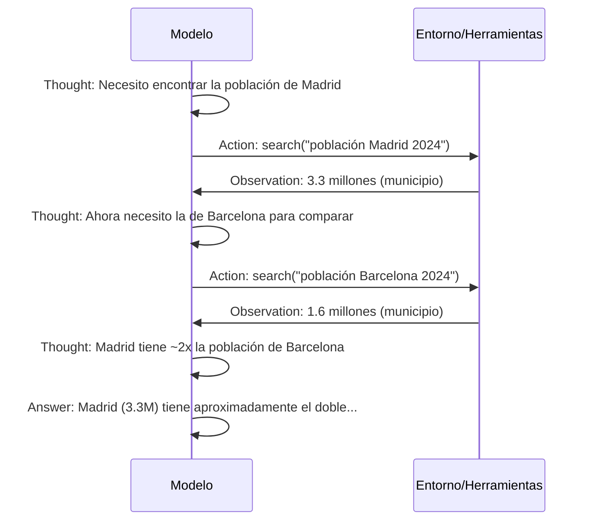
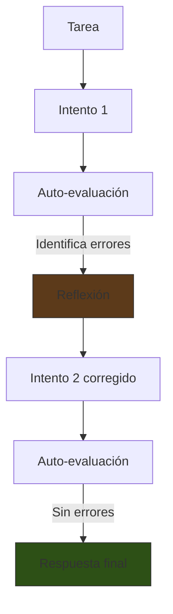

# Técnicas Avanzadas de Prompting

> [!abstract] Resumen
> Las técnicas avanzadas de prompting van más allá de la simple cadena de pensamiento. Incluyen ==Self-consistency== (muestreo múltiple con voto mayoritario), ==ReAct== (razonamiento + acción intercalados), ==Reflexion== (auto-evaluación iterativa), ==Plan-and-Solve== (descomposición explícita), ==Least-to-Most== (resolución incremental de subproblemas) y ==Meta-prompting== (prompts que generan prompts). Estas técnicas son la base teórica de los agentes autónomos modernos como [[architect-overview|architect]]. ^resumen

---

## Self-Consistency

*Self-consistency* mejora la fiabilidad del [[chain-of-thought|CoT]] mediante ==muestreo múltiple y voto mayoritario==[^1]. En lugar de generar una sola cadena de razonamiento, genera varias y selecciona la respuesta más frecuente.

```mermaid
graph TD
    Q[Pregunta] --> C1[CoT Camino 1<br/>Respuesta: 42]
    Q --> C2[CoT Camino 2<br/>Respuesta: 42]
    Q --> C3[CoT Camino 3<br/>Respuesta: 38]
    Q --> C4[CoT Camino 4<br/>Respuesta: 42]
    Q --> C5[CoT Camino 5<br/>Respuesta: 45]

    C1 --> VOTE[Voto mayoritario]
    C2 --> VOTE
    C3 --> VOTE
    C4 --> VOTE
    C5 --> VOTE
    VOTE --> |"3/5 = 42"| FINAL["Respuesta: ==42=="]

    style VOTE fill:#2d5016,stroke:#333
    style FINAL fill:#1a3a5c,stroke:#333
```



### Implementación

```python
import litellm
from collections import Counter

def self_consistency(prompt, n_samples=5, temperature=0.7):
    """Genera múltiples respuestas y vota por la más frecuente."""
    responses = []
    for _ in range(n_samples):
        resp = litellm.completion(
            model="claude-sonnet-4-20250514",
            messages=[{"role": "user", "content": prompt}],
            temperature=temperature  # Temperatura > 0 para variación
        )
        responses.append(extract_answer(resp))

    # Voto mayoritario
    counts = Counter(responses)
    return counts.most_common(1)[0][0]
```

> [!tip] Parámetros clave
> | Parámetro | Valor recomendado | Por qué |
> |---|---|---|
> | ==n_samples== | ==5-10== | Balance entre costo y fiabilidad |
> | temperature | 0.5-0.8 | Suficiente variación sin incoherencia |
> | Extracción | Regex o parsing | Necesario para comparar respuestas |

> [!warning] Costo computacional
> Self-consistency multiplica el costo por ==n_samples==. Con 5 muestras, el costo es 5x. Úsalo solo cuando la ==precisión es más importante que el costo== (decisiones críticas, evaluaciones finales).

---

## ReAct: Razonamiento + Acción

*ReAct* (*Reasoning + Acting*) intercala pasos de razonamiento con acciones concretas sobre herramientas externas[^2]. Es el ==patrón fundamental de los agentes modernos==.



### El ciclo Thought-Action-Observation

| Fase | Descripción | Generado por |
|---|---|---|
| ==Thought== | Razonamiento interno del modelo | LLM |
| ==Action== | Llamada a herramienta o acción | LLM → Herramienta |
| ==Observation== | Resultado de la acción | Herramienta → LLM |

> [!example]- Prompt template ReAct completo
> ```xml
> <system>
> Responde a las preguntas del usuario usando las herramientas
> disponibles. Sigue este formato estrictamente:
>
> Thought: [tu razonamiento sobre qué hacer a continuación]
> Action: [nombre_herramienta(parámetros)]
> Observation: [resultado de la herramienta - NO generes esto]
> ... (repite Thought/Action/Observation las veces necesarias)
> Thought: Tengo suficiente información para responder.
> Answer: [tu respuesta final]
>
> Herramientas disponibles:
> - search(query): Busca información en la web
> - calculate(expression): Evalúa expresiones matemáticas
> - lookup(term): Busca definiciones en una base de datos
>
> IMPORTANTE: NUNCA generes la Observation. Espera a que el sistema
> la proporcione.
> </system>
> ```

### ReAct en [[architect-overview|architect]]

El patrón ReAct es exactamente lo que implementa architect internamente:

| Fase ReAct | En architect |
|---|---|
| Thought | El agente razona sobre qué archivo crear/modificar |
| Action | Llama a herramientas: `write_file`, `run_command`, etc. |
| Observation | Recibe resultado (éxito/error, output del comando) |
| Loop | Itera hasta completar la tarea o encontrar un bloqueo |

> [!info] ReAct vs tool use nativo
> Los modelos modernos (Claude, GPT-4) implementan ReAct de forma nativa mediante *function calling* / *tool use*. El "Thought" se expresa como texto antes de la llamada a herramienta, y la "Observation" es el resultado de la función. No es necesario usar el formato textual original — ==el protocolo de tool use es ReAct con mejor ingeniería==.

---

## Reflexion

*Reflexion* añade una capa de ==auto-evaluación y corrección== al razonamiento[^3]. El modelo genera una respuesta, la evalúa, identifica errores, y genera una versión corregida.



### Implementación en prompt

> [!example]- Template de Reflexion para generación de código
> ```xml
> <instructions>
> Genera código Python para: {{task}}
>
> Sigue este proceso:
>
> ## INTENTO INICIAL
> Escribe tu implementación.
>
> ## AUTO-EVALUACIÓN
> Revisa tu código críticamente:
> 1. ¿Maneja todos los edge cases?
> 2. ¿Hay errores lógicos?
> 3. ¿Es eficiente?
> 4. ¿Sigue buenas prácticas?
> 5. ¿Tiene tests?
>
> ## REFLEXIÓN
> Lista los problemas encontrados y cómo corregirlos.
>
> ## IMPLEMENTACIÓN CORREGIDA
> Reescribe el código incorporando todas las correcciones.
> </instructions>
> ```

> [!success] Reflexion en la práctica
> El agente `review` de [[architect-overview|architect]] implementa una forma de Reflexion: después de que el agente `build` genera código, `review` lo ==evalúa críticamente y proporciona correcciones que `build` incorpora==. Es Reflexion distribuido entre dos agentes.

> [!danger] Limitación importante
> Reflexion asume que el modelo puede ==detectar sus propios errores==. Esto no siempre es cierto. Los mismos sesgos que causaron el error inicial pueden causar que la evaluación lo pase por alto. Para errores sutiles, la evaluación externa ([[prompt-testing]]) es más fiable.

---

## Plan-and-Solve

*Plan-and-Solve* descompone explícitamente el problema en sub-tareas antes de resolver cada una[^4]:

```
Plan-and-Solve Prompt:
"Primero, elaboremos un plan para resolver este problema.
Luego, ejecutemos el plan paso a paso."
```

### Estructura

| Fase | Acción | Ejemplo |
|---|---|---|
| ==Planificación== | Descomponer en subtareas | "1. Parsear datos 2. Filtrar 3. Agregar 4. Formatear" |
| Ejecución | Resolver cada subtarea | Ejecutar cada paso con su propio razonamiento |
| Verificación | Validar el resultado | Comprobar que el resultado cumple los requisitos |

> [!tip] Plan-and-Solve vs CoT
> La diferencia clave es que Plan-and-Solve ==separa la planificación de la ejecución==. CoT las mezcla. Esto permite al modelo crear un plan coherente antes de comprometerse con detalles de implementación.
>
> Es exactamente el patrón del agente `plan` → agente `build` en [[architect-overview|architect]].

### Variante: Plan-and-Solve+ (PS+)

Añade instrucciones específicas para mejorar la calidad del plan:

```
Primero, entendamos el problema y extraigamos las variables relevantes.
Luego, elaboremos un plan paso a paso, prestando atención a los
cálculos intermedios y asegurándonos de no omitir ningún paso.
Finalmente, ejecutemos el plan y verifiquemos el resultado.
```

---

## Least-to-Most

*Least-to-Most prompting* resuelve problemas complejos descomponiéndolos en subproblemas ==de menor a mayor dificultad==[^5]. Cada subproblema resuelto proporciona contexto para el siguiente.

```mermaid
graph LR
    COMPLEX[Problema complejo] --> S1[Subproblema 1<br/>Más simple]
    S1 --> |"Solución 1"| S2[Subproblema 2<br/>Medio]
    S2 --> |"Solución 1+2"| S3[Subproblema 3<br/>Más complejo]
    S3 --> |"Solución 1+2+3"| FINAL[Solución completa]

    style S1 fill:#2d5016,stroke:#333
    style S2 fill:#5c3a1a,stroke:#333
    style S3 fill:#5c1a1a,stroke:#333
    style FINAL fill:#1a3a5c,stroke:#333
```



### Proceso de dos fases

**Fase 1 — Descomposición:**
```
Para resolver "Implementar un sistema de autenticación con OAuth2",
¿cuáles son los subproblemas que necesito resolver primero?

1. Configurar las dependencias y el servidor HTTP
2. Implementar el flujo de redirección OAuth2
3. Manejar el callback y exchange de tokens
4. Almacenar y validar sesiones
5. Proteger rutas con middleware de autenticación
```

**Fase 2 — Resolución incremental:**
```
Resuelve el subproblema 1: "Configurar las dependencias y servidor HTTP"
[solución 1]

Dado que ya tenemos: [solución 1]
Resuelve el subproblema 2: "Implementar el flujo de redirección OAuth2"
[solución 2]
...
```

> [!info] Least-to-Most en [[prompting-para-codigo|generación de código]]
> Esta técnica es natural para la generación de código: primero ==implementar utilidades básicas, luego lógica de negocio, luego integración==. Es como el enfoque bottom-up de desarrollo de software.

---

## Meta-Prompting

*Meta-prompting* usa el LLM para ==generar o mejorar prompts automáticamente==. El modelo se convierte en su propio ingeniero de prompts.

### Variantes

| Variante | Descripción | Uso principal |
|---|---|---|
| ==Prompt generation== | El modelo genera un prompt para una tarea | Automatización de diseño de prompts |
| Prompt refinement | El modelo mejora un prompt existente | Optimización iterativa |
| Prompt selection | El modelo elige entre varios prompts | A/B testing asistido |
| Prompt evaluation | El modelo evalúa la calidad de un prompt | QA de prompts |

> [!example]- Meta-prompt para generar prompts optimizados
> ```xml
> <system>
> Eres un experto en prompt engineering. Tu tarea es crear prompts
> optimizados para modelos de lenguaje.
> </system>
>
> <instructions>
> Dada la siguiente tarea, genera un prompt optimizado que:
> 1. Use delimitadores XML apropiados
> 2. Incluya role prompting si es beneficioso
> 3. Incluya 2-3 few-shot examples si mejora la precisión
> 4. Especifique el formato de salida explícitamente
> 5. Incluya instrucciones de chain-of-thought si la tarea requiere
>    razonamiento
> 6. Anticipe y prevenga posibles errores comunes
>
> TAREA: {{task_description}}
>
> CONTEXTO ADICIONAL: {{context}}
>
> FORMATO DEL PROMPT GENERADO:
> Devuelve el prompt entre tags <generated_prompt></generated_prompt>
> con una explicación de las decisiones de diseño entre tags
> <rationale></rationale>
> </instructions>
> ```

> [!question] ¿Meta-prompting o DSPy?
> Meta-prompting es ad-hoc: el modelo genera un prompt basado en su "intuición". [[prompt-optimization|DSPy]] es sistemático: optimiza prompts con métricas concretas y datos de evaluación. Para producción, ==DSPy es preferible==. Para prototipado rápido, meta-prompting es más ágil.

---

## Tabla comparativa completa

| Técnica | Complejidad | Costo | Precisión | Latencia | Mejor caso de uso |
|---|---|---|---|---|---|
| Self-consistency | Media | ==5-10x== | Alta | Alta | Decisiones críticas únicas |
| ==ReAct== | ==Alta== | Variable | ==Alta== | ==Variable== | ==Agentes con herramientas== |
| Reflexion | Alta | 2-3x | Alta | Alta | Generación de código |
| Plan-and-Solve | Media | 1.5-2x | Alta | Media | Problemas multi-paso |
| Least-to-Most | Media | 2-3x | Alta | Media-Alta | Problemas con dependencias |
| Meta-prompting | Baja | 2x | Variable | Media | Diseño de prompts |

---

## Combinaciones efectivas

Las técnicas avanzadas rara vez se usan aisladas. Las combinaciones más poderosas:

```mermaid
graph TD
    REACT[ReAct] --> |"Base para"| AGENT[Sistema agente]
    REFLECT[Reflexion] --> |"Mejora calidad"| AGENT
    PAS[Plan-and-Solve] --> |"Estructura el plan"| AGENT
    SC[Self-consistency] --> |"Decisiones críticas"| AGENT

    AGENT --> ARCH["architect-style Agent"]

    style AGENT fill:#2d5016,stroke:#333
    style ARCH fill:#1a3a5c,stroke:#333
```



> [!success] La fórmula de architect
> [[architect-overview|architect]] combina varias de estas técnicas:
> - ==Plan-and-Solve==: agente `plan` descompone la tarea
> - ==ReAct==: agente `build` alterna razonamiento con tool calls
> - ==Reflexion==: agente `review` evalúa y corrige
> - ==Least-to-Most== implícito: el plan ordena subtareas de simple a complejo

---

## Patrones de implementación

### Patrón: Retry con Reflexion

```python
def reflexion_retry(task, max_attempts=3):
    """Implementa Reflexion con reintentos limitados."""
    memory = []

    for attempt in range(max_attempts):
        # Generar intento
        response = generate(task, previous_attempts=memory)

        # Evaluar
        evaluation = evaluate(response, task)

        if evaluation.passes:
            return response

        # Reflexionar
        reflection = reflect(response, evaluation)
        memory.append({
            "attempt": response,
            "evaluation": evaluation,
            "reflection": reflection
        })

    return memory[-1]["attempt"]  # Mejor esfuerzo
```

> [!warning] Límite de reintentos
> Siempre establece un ==máximo de reintentos== (típicamente 2-3). Sin límite, el modelo puede entrar en ciclos infinitos de corrección sin mejorar realmente. [[prompt-debugging]] explica cómo diagnosticar estos bucles.

### Patrón: Self-consistency con umbral de confianza

```python
def confident_self_consistency(prompt, n=5, threshold=0.6):
    """Self-consistency que reporta confianza."""
    responses = [generate(prompt) for _ in range(n)]
    counts = Counter(responses)
    best_answer, best_count = counts.most_common(1)[0]

    confidence = best_count / n
    if confidence < threshold:
        return {"answer": best_answer, "confident": False,
                "message": "Baja concordancia entre muestras"}
    return {"answer": best_answer, "confident": True}
```

---

## Relación con el ecosistema

- **[[intake-overview|intake]]**: intake no usa técnicas avanzadas directamente, pero sus templates están diseñados para que el modelo aplique ==Plan-and-Solve internamente==: primero analiza el requisito, luego lo descompone, luego genera la especificación. La estructura del template Jinja2 guía este proceso.

- **[[architect-overview|architect]]**: es la implementación más completa de técnicas avanzadas. El ==ciclo plan → build → review es Reflexion a nivel de sistema==. Cada agente usa ReAct para interactuar con herramientas. La memoria procedimental permite que las correcciones del usuario mejoren los prompts en tiempo real — esto es una forma de prompt optimization viva.

- **[[vigil-overview|vigil]]**: la relevancia de vigil aquí es como ==validador de las salidas del razonamiento==. Un agente ReAct que interactúa con herramientas externas puede recibir datos maliciosos en la fase de Observation. vigil puede analizar estos datos antes de que el agente los procese. Véase [[prompt-injection]].

- **[[licit-overview|licit]]**: los análisis de compliance de licit se benefician de ==Least-to-Most==: primero analizar cláusulas simples (formato, fechas), luego cláusulas complejas (obligaciones condicionales, excepciones anidadas). La descomposición ordenada mejora la cobertura del análisis.

---

## Errores comunes con técnicas avanzadas

> [!failure] Antipatrones
> 1. **Self-consistency en tareas creativas**: no tiene sentido votar por la "mejor" respuesta creativa
> 2. **ReAct sin tool descriptions claras**: el modelo no sabrá cuándo usar cada herramienta
> 3. **Reflexion sin criterios de evaluación**: "mejora tu respuesta" es demasiado vago
> 4. **Plan-and-Solve sin verificación**: un plan incorrecto produce pasos incorrectos
> 5. **Sobrecarga de técnicas**: usar todas las técnicas simultáneamente aumenta costo y confusión

---

## Enlaces y referencias

> [!quote]- Bibliografía
> - [^1]: Wang, X. et al. (2023). *Self-Consistency Improves Chain of Thought Reasoning in Language Models*. ICLR. Muestreo múltiple con voto mayoritario.
> - [^2]: Yao, S. et al. (2023). *ReAct: Synergizing Reasoning and Acting in Language Models*. ICLR. El patrón fundacional de agentes LLM.
> - [^3]: Shinn, N. et al. (2023). *Reflexion: Language Agents with Verbal Reinforcement Learning*. NeurIPS. Auto-evaluación y corrección iterativa.
> - [^4]: Wang, L. et al. (2023). *Plan-and-Solve Prompting: Improving Zero-Shot Chain-of-Thought Reasoning by Large Language Models*. ACL.
> - [^5]: Zhou, D. et al. (2023). *Least-to-Most Prompting Enables Complex Reasoning in Large Language Models*. ICLR.
> - Anthropic (2024). *Extended Thinking with Claude*. Documentación oficial sobre razonamiento extendido.

[^1]: Wang, X. et al. (2023). *Self-Consistency Improves Chain of Thought Reasoning in Language Models*. ICLR.
[^2]: Yao, S. et al. (2023). *ReAct: Synergizing Reasoning and Acting in Language Models*. ICLR.
[^3]: Shinn, N. et al. (2023). *Reflexion: Language Agents with Verbal Reinforcement Learning*. NeurIPS.
[^4]: Wang, L. et al. (2023). *Plan-and-Solve Prompting*. ACL.
[^5]: Zhou, D. et al. (2023). *Least-to-Most Prompting Enables Complex Reasoning in Large Language Models*. ICLR.
