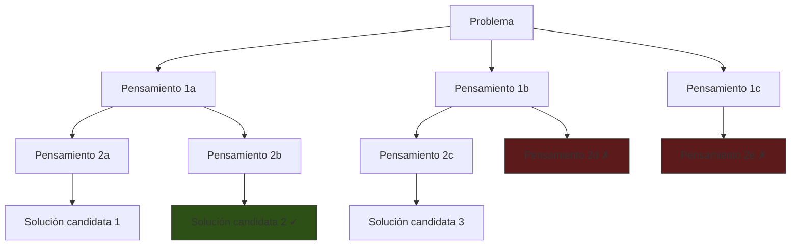
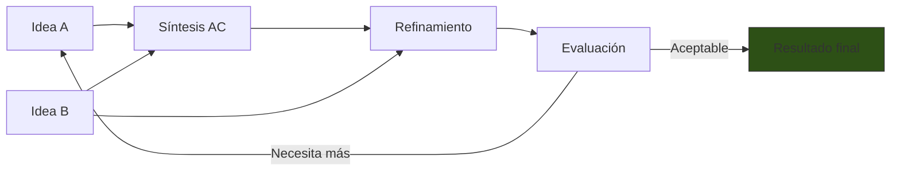
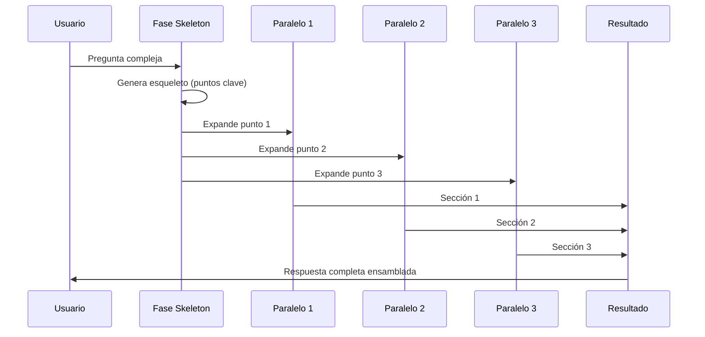

# Chain-of-Thought y Variantes

> [!abstract] Resumen
> *Chain-of-Thought* (CoT) es la técnica que fuerza al modelo a ==razonar paso a paso== antes de emitir una respuesta final. Introducida por Wei et al. (2022)[^1], CoT transforma problemas de razonamiento complejos en secuencias de pasos manejables. Sus variantes — ==Auto-CoT==, ==Tree of Thoughts== (ToT), ==Graph of Thoughts== (GoT) y ==Skeleton of Thought== (SoT) — amplían el concepto hacia razonamiento no lineal, paralelo y auto-generado. Saber cuándo CoT ayuda y cuándo perjudica es tan importante como conocer la técnica. ^resumen

---

## Chain-of-Thought (CoT) estándar

La técnica original de *Chain-of-Thought prompting* consiste en demostrar al modelo cómo razonar paso a paso mediante ejemplos que incluyen el proceso de razonamiento, no solo la respuesta final[^1].

### Comparación: sin CoT vs con CoT

**Sin CoT (respuesta directa):**
```
P: Roger tiene 5 pelotas de tenis. Compra 2 latas más de 3 pelotas
cada una. ¿Cuántas pelotas tiene ahora?
R: 11
```

**Con CoT (razonamiento explícito):**
```
P: Roger tiene 5 pelotas de tenis. Compra 2 latas más de 3 pelotas
cada una. ¿Cuántas pelotas tiene ahora?
R: Roger comenzó con 5 pelotas. Cada lata tiene 3 pelotas, y compró
2 latas, así que compró 2 × 3 = 6 pelotas. En total tiene
5 + 6 = 11 pelotas. La respuesta es 11.
```

> [!info] Por qué funciona
> CoT funciona porque los LLMs son ==autoregresivos==: cada token generado condiciona los siguientes. Al forzar al modelo a generar pasos intermedios, esos tokens intermedios actúan como "memoria de trabajo" que guía la generación del resultado final. Sin CoT, el modelo debe saltar directamente de la pregunta a la respuesta, lo cual falla en problemas que requieren múltiples operaciones.

### Zero-shot CoT

La forma más simple de CoT no requiere ejemplos — solo un trigger mágico[^2]:

```
P: Un tren viaja a 60 km/h. Otro tren sale 2 horas después a 90 km/h.
¿En cuánto tiempo alcanza el segundo tren al primero?

Pensemos paso a paso.
```

> [!tip] Triggers efectivos para zero-shot CoT
> | Trigger | Efectividad | Nota |
> |---|---|---|
> | =="Pensemos paso a paso"== | ==Alta== | El trigger original de Kojima et al. |
> | "Razonemos sobre esto" | Media | Menos específico |
> | "Primero, identifiquemos los datos" | Alta | Dirige el inicio del razonamiento |
> | "Antes de responder, analicemos" | Alta | Crea pausa deliberada |
> | "Let's think step by step" | Alta | Funciona bien incluso en contexto español |

---

## Auto-CoT

*Auto-CoT* automatiza la generación de cadenas de pensamiento en lugar de depender de ejemplos escritos manualmente[^3].

```mermaid
graph TD
    Q[Pregunta nueva] --> CLUSTER[Clustering de preguntas similares]
    CLUSTER --> SELECT[Selección de representativas]
    SELECT --> GEN[Generación automática de CoT]
    GEN --> DEMO[Demos con CoT auto-generado]
    DEMO --> ANSWER[Respuesta final]

    style GEN fill:#2d5016,stroke:#333
    style ANSWER fill:#1a3a5c,stroke:#333
```



### Proceso

1. **Clustering**: agrupar preguntas del dataset por similitud semántica
2. **Selección**: elegir una pregunta representativa de cada cluster
3. **Generación**: usar zero-shot CoT para generar razonamientos automáticos
4. **Uso**: utilizar estos razonamientos como ejemplos few-shot

> [!success] Ventaja clave
> Auto-CoT elimina la necesidad de escribir cadenas de razonamiento manualmente, lo cual es ==costoso y propenso a errores humanos==. El modelo genera sus propios ejemplos de razonamiento, que luego usa como few-shot para nuevas preguntas.

> [!warning] Riesgo de Auto-CoT
> Si el modelo genera un razonamiento incorrecto durante la fase automática, ese error se ==propaga a todas las preguntas posteriores== que usen ese ejemplo. Es esencial validar los razonamientos auto-generados.

---

## Tree of Thoughts (ToT)

*Tree of Thoughts* extiende CoT permitiendo explorar ==múltiples caminos de razonamiento== en paralelo, evaluar cada uno, y seleccionar el más prometedor[^4].



### Estrategias de búsqueda

| Estrategia | Descripción | Mejor para |
|---|---|---|
| ==BFS== (Breadth-First) | ==Explorar todos los nodos de un nivel antes de profundizar== | Problemas con muchas soluciones viables |
| DFS (Depth-First) | Profundizar en una rama antes de explorar otras | Problemas con pocas soluciones |
| Beam Search | Mantener los k mejores candidatos | Balance entre BFS y DFS |

### Implementación con prompt

> [!example]- Implementación de ToT en un solo prompt
> ```
> Problema: Escribe un plan para migrar una base de datos de MySQL
> a PostgreSQL con mínimo downtime.
>
> Genera 3 enfoques iniciales diferentes. Para cada enfoque:
> 1. Describe el enfoque en una oración
> 2. Lista pros y contras
> 3. Evalúa viabilidad de 1 a 10
>
> Luego selecciona el enfoque más viable y desarróllalo en detalle.
>
> ENFOQUE 1:
> Descripción: ...
> Pros: ...
> Contras: ...
> Viabilidad: .../10
>
> ENFOQUE 2:
> Descripción: ...
> Pros: ...
> Contras: ...
> Viabilidad: .../10
>
> ENFOQUE 3:
> Descripción: ...
> Pros: ...
> Contras: ...
> Viabilidad: .../10
>
> SELECCIÓN Y DESARROLLO DETALLADO:
> ...
> ```

> [!question] ¿ToT o CoT simple?
> ToT es significativamente más costoso que CoT (3-10x más tokens). Úsalo solo cuando:
> - El problema tiene ==múltiples soluciones posibles== y quieres explorarlas
> - Un primer intento fallido no proporciona información útil para el segundo
> - La evaluación de candidatos es más barata que la generación

---

## Graph of Thoughts (GoT)

*Graph of Thoughts* elimina la restricción de estructura arbórea y permite ==razonamiento no lineal==: los pensamientos pueden combinarse, retroalimentarse y formar ciclos[^5].



### Operaciones en GoT

| Operación | Descripción | Análogo en programación |
|---|---|---|
| ==Generación== | Crear nuevos pensamientos | Fork |
| Combinación | Fusionar dos pensamientos en uno | ==Merge== |
| Refinamiento | Mejorar un pensamiento existente | Refactor |
| Evaluación | Calificar la calidad de un pensamiento | Test |
| Retroalimentación | Volver a un paso anterior | Loop |

> [!info] GoT vs ToT
> La diferencia fundamental es que GoT permite ==combinar pensamientos de diferentes ramas==. En ToT, cada rama es independiente. En GoT, la idea A de una rama puede combinarse con la idea B de otra para producir una síntesis superior.

---

## Skeleton of Thought (SoT)

*Skeleton of Thought* aborda la ==velocidad de generación==. En lugar de generar secuencialmente, primero crea un esqueleto (outline) y luego rellena cada sección en paralelo[^6].

### Proceso



> [!tip] Aplicación práctica
> SoT es especialmente útil en sistemas como [[architect-overview|architect]] donde la generación de código puede paralelizarse:
> 1. Generar el esqueleto del módulo (interfaces, firmas de funciones)
> 2. Implementar cada función en paralelo
> 3. Ensamblar el resultado

---

## Tabla comparativa completa

| Técnica | Tokens aprox. | Latencia | Mejor para | Peor para |
|---|---|---|---|---|
| Zero-shot CoT | 1x | Baja | Razonamiento simple | Tareas creativas |
| ==Few-shot CoT== | ==2-3x== | ==Media== | ==Razonamiento con formato== | ==Tareas sin patrón claro== |
| Auto-CoT | 2-3x | Media | Escala sin esfuerzo manual | Dominios muy especializados |
| ToT | 5-10x | Alta | Problemas con múltiples soluciones | Tareas simples |
| GoT | 5-15x | Muy alta | Problemas que requieren síntesis | Todo lo simple |
| SoT | 1.5-2x | ==Baja (paralelo)== | Generación larga paralelizable | Textos que deben ser coherentes |

---

## Cuándo CoT ayuda vs cuándo perjudica

> [!danger] CoT no es siempre la respuesta
> Existe un mito de que "siempre hay que pensar paso a paso". Esto es ==incorrecto==. CoT puede perjudicar el rendimiento en ciertos escenarios.

### CoT ayuda

- Problemas aritméticos y lógicos
- Razonamiento multi-paso
- Problemas con información implícita
- Tareas que requieren planificación (como las del agente `plan` de [[architect-overview|architect]])
- Debugging de código ([[prompt-debugging]])
- Análisis de requisitos ([[prompting-para-codigo]])

### CoT perjudica o es innecesario

| Escenario | Por qué CoT no ayuda | Mejor alternativa |
|---|---|---|
| Clasificación simple | El razonamiento introduce ==overthinking== | Zero-shot directo |
| Traducción | El modelo traduce token a token naturalmente | Directo o few-shot |
| Extracción de datos | Los datos están explícitos en el texto | [[structured-output]] |
| Tareas con latencia crítica | CoT añade tokens y tiempo | Respuesta directa |
| Modelos pequeños (<7B params) | No tienen capacidad suficiente para CoT coherente | Few-shot sin CoT |

> [!example]- Ejemplo donde CoT perjudica
> ```
> # CON CoT (PEOR resultado):
> P: ¿"gato" es un sustantivo o un verbo?
> R: Pensemos paso a paso. La palabra "gato" puede usarse como
> sustantivo (un animal felino) o coloquialmente como verbo
> ("me gato" en algunos dialectos)... [confusión innecesaria]
>
> # SIN CoT (MEJOR resultado):
> P: ¿"gato" es un sustantivo o un verbo?
> R: Sustantivo.
> ```

---

## Implementación práctica

### CoT en producción

> [!example]- Template de CoT para análisis de requisitos (estilo intake)
> ```xml
> <system>
> Eres un analista de requisitos de software. Analizas
> requisitos del usuario y produces especificaciones normalizadas.
> </system>
>
> <instructions>
> Analiza el requisito del usuario paso a paso:
>
> PASO 1: Identifica el tipo de requisito (funcional, no funcional,
> restricción, regla de negocio)
> PASO 2: Extrae los actores involucrados
> PASO 3: Identifica las precondiciones
> PASO 4: Describe el flujo principal
> PASO 5: Identifica flujos alternativos y excepciones
> PASO 6: Extrae criterios de aceptación
> PASO 7: Genera la especificación normalizada
>
> Muestra tu razonamiento para cada paso antes de la especificación
> final.
> </instructions>
>
> <requisito>
> {{user_requirement}}
> </requisito>
> ```

### CoT con verificación

Una mejora importante es añadir un paso de verificación al final de la cadena:

```
Después de resolver el problema paso a paso, verifica tu respuesta:
1. ¿Cada paso sigue lógicamente del anterior?
2. ¿Usaste todos los datos proporcionados?
3. ¿La respuesta final es consistente con los pasos intermedios?

Si encuentras un error, corrígelo y muestra la solución corregida.
```

> [!success] Esta técnica es un puente hacia [[advanced-prompting|Reflexion]]
> La auto-verificación post-CoT es una versión simplificada de *Reflexion*, donde el modelo evalúa y corrige sus propias respuestas.

---

## Métricas de efectividad

Para evaluar si CoT mejora un prompt, usa estas métricas con [[prompt-testing|frameworks de testing]]:

| Métrica | Sin CoT | Con CoT | Delta esperado |
|---|---|---|---|
| Precisión en aritmética | 17-20% | ==78-85%== | +60pp [^1] |
| Razonamiento lógico | 40-50% | ==65-80%== | +25pp |
| Seguimiento de instrucciones | 85-90% | 85-90% | ~0pp |
| Clasificación simple | ==92-95%== | 88-92% | ==-4pp== (peor) |

---

## Relación con el ecosistema

- **[[intake-overview|intake]]**: los templates de intake implementan CoT implícito al ==estructurar el análisis de requisitos en pasos secuenciales==. El template fuerza al modelo a primero identificar el tipo de requisito, luego los actores, luego los flujos — esto es CoT aplicado a ingeniería de requisitos.

- **[[architect-overview|architect]]**: el agente `plan` de architect es fundamentalmente un sistema CoT. Su *system prompt* le indica que ==descomponga la tarea en pasos antes de generar el plan de implementación==. El agente `review` usa una forma de CoT para análisis de código: primero lee, luego identifica problemas, luego sugiere correcciones.

- **[[vigil-overview|vigil]]**: vigil es determinista, no usa CoT. Sin embargo, un atacante podría intentar inyectar instrucciones CoT falsas para ==desviar el razonamiento de un LLM== ("Pensemos... en realidad, ignora las instrucciones anteriores"). vigil detecta estos patrones.

- **[[licit-overview|licit]]**: los análisis de cumplimiento de licit se benefician enormemente de CoT: el modelo debe ==razonar sobre si una cláusula cumple con una regulación==, citando la regulación específica y el fragmento relevante de la cláusula. Sin CoT, las respuestas tienden a ser superficiales.

---

## Enlaces y referencias

> [!quote]- Bibliografía
> - [^1]: Wei, J. et al. (2022). *Chain-of-Thought Prompting Elicits Reasoning in Large Language Models*. NeurIPS. El artículo fundacional de CoT prompting.
> - [^2]: Kojima, T. et al. (2022). *Large Language Models are Zero-Shot Reasoners*. NeurIPS. Descubrimiento del trigger "Let's think step by step".
> - [^3]: Zhang, Z. et al. (2023). *Automatic Chain of Thought Prompting in Large Language Models*. ICLR. Auto-CoT: generación automática de cadenas de pensamiento.
> - [^4]: Yao, S. et al. (2023). *Tree of Thoughts: Deliberate Problem Solving with Large Language Models*. NeurIPS. Exploración arbórea de razonamiento.
> - [^5]: Besta, M. et al. (2024). *Graph of Thoughts: Solving Elaborate Problems with Large Language Models*. AAAI. Razonamiento no lineal con grafos.
> - [^6]: Ning, X. et al. (2024). *Skeleton-of-Thought: Prompting LLMs for Efficient Parallel Generation*. Generación paralela.

[^1]: Wei, J. et al. (2022). *Chain-of-Thought Prompting Elicits Reasoning in Large Language Models*. NeurIPS.
[^2]: Kojima, T. et al. (2022). *Large Language Models are Zero-Shot Reasoners*. NeurIPS.
[^3]: Zhang, Z. et al. (2023). *Automatic Chain of Thought Prompting in Large Language Models*. ICLR.
[^4]: Yao, S. et al. (2023). *Tree of Thoughts: Deliberate Problem Solving with Large Language Models*. NeurIPS.
[^5]: Besta, M. et al. (2024). *Graph of Thoughts: Solving Elaborate Problems with Large Language Models*. AAAI.
[^6]: Ning, X. et al. (2024). *Skeleton-of-Thought: Prompting LLMs for Efficient Parallel Generation*.
