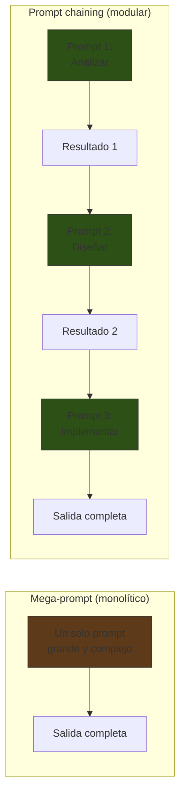

# Mega-Prompts: Prompts Complejos de Producción

> [!abstract] Resumen
> Los *mega-prompts* son prompts largos y complejos (==1000-5000+ tokens==) diseñados para tareas sofisticadas que requieren múltiples instrucciones, contexto extenso, ejemplos, restricciones y formato de salida detallado. Se estructuran con etiquetas XML (`<role>`, `<context>`, `<instructions>`, `<constraints>`, `<output_format>`, `<examples>`) para mantener la organización. La decisión entre un mega-prompt monolítico y *prompt chaining* (encadenar prompts simples) depende de la ==interdependencia entre las subtareas==. [[intake-overview|intake]] demuestra cómo los prompts de producción son plantillas parametrizadas, no texto estático. ^resumen

---

## Qué es un mega-prompt

Un *mega-prompt* es un prompt que combina ==múltiples técnicas y secciones== en una sola instrucción cohesiva. A diferencia de un prompt simple, un mega-prompt:

- Define un rol complejo con múltiples facetas
- Proporciona contexto extenso (documentos, código, historial)
- Incluye instrucciones multi-paso
- Especifica restricciones detalladas
- Define formato de salida preciso
- Incluye ejemplos de referencia
- Contiene guardrails de seguridad

```mermaid
graph TD
    SIMPLE["Prompt Simple<br/>50-200 tokens<br/>'Resume este texto'"] --> MEDIUM["Prompt Medio<br/>200-1000 tokens<br/>Role + instrucciones + formato"]
    MEDIUM --> MEGA["Mega-Prompt<br/>1000-5000+ tokens<br/>Estructura completa XML"]

    SIMPLE --> |"Tarea simple"| OK1[Suficiente]
    MEDIUM --> |"Tarea con formato"| OK2[Suficiente]
    MEGA --> |"Tarea compleja de producción"| OK3[Necesario]

    style MEGA fill:#5c3a1a,stroke:#333
    style OK3 fill:#1a3a5c,stroke:#333
```



---

## Estructura XML de un mega-prompt

La organización con etiquetas XML es el ==estándar de facto== para mega-prompts, especialmente con Claude[^1]. Cada sección tiene un propósito claro:

### Anatomía completa

| Sección | Etiqueta XML | Propósito | Posición |
|---|---|---|---|
| ==Rol== | `<role>` | Identidad y perspectiva del modelo | Inicio |
| Contexto | `<context>` | Información de fondo necesaria | Tras rol |
| ==Instrucciones== | `<instructions>` | Pasos a seguir | Centro |
| Restricciones | `<constraints>` | Lo que NO hacer | Tras instrucciones |
| ==Formato de salida== | `<output_format>` | Estructura esperada | Tras restricciones |
| Ejemplos | `<examples>` | Demostraciones de comportamiento | Antes del input |
| Guardrails | `<guardrails>` | Seguridad y edge cases | Final |

> [!tip] Orden importa
> Las instrucciones al ==inicio y al final== del prompt tienen mayor peso. Coloca la identidad al inicio (establece el marco) y los guardrails al final (refuerzan antes de la generación). Véase [[system-prompts]] para más detalles.

### Sección `<role>`

```xml
<role>
Eres un arquitecto de software senior con experiencia en diseño
de microservicios, APIs REST y sistemas distribuidos. Trabajas
en una empresa que sigue principios de Domain-Driven Design (DDD)
y usa Python como lenguaje principal.

Tu estilo de comunicación es directo y técnico. Priorizas la
mantenibilidad sobre la optimización prematura. Siempre consideras
las implicaciones de seguridad de las decisiones de diseño.
</role>
```

### Sección `<context>`

```xml
<context>
Proyecto: Sistema de gestión de pedidos para e-commerce.
Stack: Python 3.12, FastAPI, PostgreSQL, Redis, Docker.
Arquitectura actual: monolito que se está migrando a microservicios.
Fase actual: diseño del servicio de pagos.

Archivos relevantes del proyecto:
<file path="src/models/order.py">
{{order_model_content}}
</file>
<file path="src/models/payment.py">
{{payment_model_content}}
</file>
<file path="docs/architecture.md">
{{architecture_doc}}
</file>
</context>
```

> [!info] Contexto dinámico
> En producción, la sección `<context>` casi nunca es estática. Se ==renderiza dinámicamente== con datos del entorno (archivos, configuración, historial). [[intake-overview|intake]] usa Jinja2 para esto.

### Sección `<instructions>`

```xml
<instructions>
Diseña el microservicio de pagos siguiendo estos pasos:

PASO 1: Analiza los modelos existentes e identifica los bounded
contexts relevantes para pagos.

PASO 2: Define las entidades y value objects del dominio de pagos
siguiendo DDD.

PASO 3: Diseña la API REST del servicio con endpoints, métodos
HTTP, request/response schemas.

PASO 4: Define los eventos de dominio que el servicio publicará
(para comunicación con otros servicios).

PASO 5: Diseña la estrategia de persistencia (tablas, índices,
relaciones).

PASO 6: Identifica riesgos de seguridad específicos del servicio
de pagos y propón mitigaciones.

Para cada paso, muestra tu razonamiento antes de la decisión final.
</instructions>
```

### Sección `<constraints>`

```xml
<constraints>
- NO uses ORMs magic (como SQLAlchemy automap). Define modelos explícitos.
- Las APIs deben ser idempotentes para operaciones de pago.
- Usa UUIDs v7 (time-ordered) para IDs, no auto-incrementales.
- Los montos monetarios SIEMPRE como enteros en centavos (no floats).
- No expongas IDs internos de proveedores de pago en la API pública.
- Toda decisión de diseño debe tener una justificación explícita.
- El servicio debe funcionar sin conexión al servicio de pedidos
  (eventual consistency).
</constraints>
```

### Sección `<output_format>`

```xml
<output_format>
Estructura tu respuesta así:

## 1. Análisis de Bounded Contexts
[Análisis y decisiones]

## 2. Modelo de Dominio
[Código Python con dataclasses/Pydantic]

## 3. API REST
[Tabla de endpoints + request/response schemas JSON]

## 4. Eventos de Dominio
[Definición de eventos con payload]

## 5. Persistencia
[SQL DDL + justificación de índices]

## 6. Seguridad
[Tabla de riesgos + mitigaciones]

## 7. Resumen de Decisiones
[Tabla: decisión | justificación | alternativas descartadas]
</output_format>
```

---

## Ejemplo completo de mega-prompt

> [!example]- Mega-prompt de producción (2000+ tokens)
> ```xml
> <role>
> Eres un experto en análisis de seguridad de código con
> especialización en aplicaciones Python. Tienes 12 años de
> experiencia en pentesting, conocimiento profundo de OWASP Top 10,
> CWE, y MITRE ATT&CK. Has auditado más de 200 repositorios
> de código en producción.
>
> Tu comunicación es precisa y accionable. Cada hallazgo incluye
> evidencia, severidad, y remediación específica.
> </role>
>
> <context>
> Aplicación: API REST de gestión de usuarios para plataforma SaaS.
> Framework: FastAPI 0.104 + SQLAlchemy 2.0 + PostgreSQL 16.
> Auth: JWT tokens con refresh tokens.
> Deploy: Docker en AWS ECS.
>
> Código a auditar:
> <file path="src/auth/router.py">
> from fastapi import APIRouter, Depends, HTTPException
> from sqlalchemy.orm import Session
> from src.auth.models import User
> from src.auth.schemas import LoginRequest, TokenResponse
> from src.auth.utils import verify_password, create_jwt
> from src.db import get_db
>
> router = APIRouter(prefix="/auth", tags=["auth"])
>
> @router.post("/login", response_model=TokenResponse)
> async def login(request: LoginRequest, db: Session = Depends(get_db)):
>     user = db.execute(
>         f"SELECT * FROM users WHERE email = '{request.email}'"
>     ).first()
>     if not user or not verify_password(request.password, user.password_hash):
>         raise HTTPException(status_code=401, detail="Invalid credentials")
>     token = create_jwt({"sub": user.id, "role": user.role})
>     return TokenResponse(access_token=token, token_type="bearer")
>
> @router.post("/register")
> async def register(request: LoginRequest, db: Session = Depends(get_db)):
>     import hashlib
>     password_hash = hashlib.md5(request.password.encode()).hexdigest()
>     user = User(email=request.email, password_hash=password_hash)
>     db.add(user)
>     db.commit()
>     return {"message": "User created", "user_id": user.id}
>
> @router.get("/users/{user_id}")
> async def get_user(user_id: int, db: Session = Depends(get_db)):
>     user = db.query(User).get(user_id)
>     return {"email": user.email, "role": user.role,
>             "password_hash": user.password_hash}
> </file>
> </context>
>
> <instructions>
> Realiza una auditoría de seguridad exhaustiva del código anterior:
>
> 1. Identifica TODAS las vulnerabilidades de seguridad
> 2. Clasifica cada una por severidad CVSS v3.1
> 3. Mapea a CWE correspondiente
> 4. Proporciona código de remediación para cada hallazgo
> 5. Prioriza las remediaciones por riesgo/esfuerzo
> 6. Identifica vulnerabilidades que podrían combinarse (attack chains)
>
> NO omitas vulnerabilidades "obvias". Reporta TODAS incluyendo
> las de severidad baja.
> </instructions>
>
> <constraints>
> - No sugieras "usar un framework de seguridad genérico" — sé específico
> - La remediación debe ser código funcional, no pseudocódigo
> - Considera ataques de OWASP Top 10 2021
> - Asume que el atacante conoce el stack tecnológico
> - No asumas que hay protecciones adicionales no visibles en el código
> </constraints>
>
> <output_format>
> Para cada vulnerabilidad:
>
> ### [SEVERIDAD] Título (CWE-XXX)
> - **CVSS**: X.X (AV:N/AC:L/PR:N/UI:N/S:U/C:H/I:H/A:N)
> - **Archivo**: path:línea
> - **Confianza**: alta|media|baja
>
> **Descripción**: [2-3 oraciones técnicas]
>
> **Código vulnerable**:
> ```python
> [fragmento]
> ```
>
> **Remediación**:
> ```python
> [código corregido funcional]
> ```
>
> **Attack chain**: [si aplica, qué otras vulns se combinan]
>
> ---
>
> Al final, incluye:
> ## Resumen de hallazgos
> [Tabla: severidad | count | CWE más frecuente]
>
> ## Priorización de remediación
> [Tabla ordenada: # | hallazgo | esfuerzo | impacto | prioridad]
> </output_format>
>
> <guardrails>
> - NO generes exploits funcionales completos
> - Si una vulnerabilidad permite ejecución de código arbitrario,
>   describe el vector pero no proporciones payload funcional
> - Señala si alguna vulnerabilidad podría estar ya mitigada por
>   configuración de infraestructura (WAF, etc.) pero indica que
>   la defensa en profundidad requiere fix a nivel de código
> </guardrails>
> ```

---

## Prompt chaining vs mega-prompts

La alternativa a un mega-prompt monolítico es *prompt chaining*: encadenar prompts más simples donde la salida de uno alimenta al siguiente.



### Cuándo usar cada enfoque

| Criterio | Mega-prompt | Prompt chaining |
|---|---|---|
| ==Interdependencia alta entre partes== | ==Preferido== | Difícil (requiere pasar mucho contexto) |
| Tareas independientes | Innecesario | ==Preferido== |
| Latencia | ==Una sola llamada== | Múltiples llamadas secuenciales |
| Costo | Menor (un solo contexto) | Mayor (contexto repetido) |
| ==Debugging== | Difícil (caja negra grande) | ==Fácil (cada paso aislado)== |
| Fiabilidad | Media (más puede fallar) | ==Alta (cada paso validable)== |
| Complejidad máxima | Limitada por context window | Teóricamente ilimitada |

> [!question] ¿Cuál elegir?
> Regla práctica: si puedes ==describir la tarea como una secuencia de pasos independientes==, usa chaining. Si los pasos están tan entrelazados que cada uno necesita el contexto de todos los demás, usa mega-prompt.

### Ejemplo de chaining

```python
# Paso 1: Análisis
analysis = llm.generate(
    prompt=f"""<role>Analista de seguridad</role>
    <task>Identifica vulnerabilidades en este código</task>
    <code>{source_code}</code>"""
)

# Paso 2: Clasificación (usa resultado del paso 1)
classification = llm.generate(
    prompt=f"""<role>Clasificador CVSS</role>
    <task>Clasifica estas vulnerabilidades por CVSS v3.1</task>
    <vulnerabilities>{analysis}</vulnerabilities>"""
)

# Paso 3: Remediación (usa resultados de pasos 1 y 2)
remediation = llm.generate(
    prompt=f"""<role>Desarrollador de seguridad</role>
    <task>Genera remediaciones para estas vulnerabilidades</task>
    <vulnerabilities>{analysis}</vulnerabilities>
    <classifications>{classification}</classifications>
    <original_code>{source_code}</original_code>"""
)
```

> [!tip] Patrón híbrido
> En la práctica, los mejores sistemas usan un ==enfoque híbrido==: mega-prompts para tareas que requieren coherencia interna, encadenados con otros mega-prompts o prompts simples para el flujo general. [[architect-overview|architect]] hace exactamente esto: cada agente usa un mega-prompt interno, pero los agentes se encadenan (plan → build → review).

---

## Gestión de la complejidad

### Problema: pérdida de atención en el medio

Los LLMs tienen un fenómeno conocido como *lost in the middle*[^2]: ==prestan más atención al inicio y al final del contexto que al medio==.


> [!warning] Implicaciones para mega-prompts
> | Qué colocar | Dónde | Por qué |
> |---|---|---|
> | ==Identidad y tarea principal== | ==INICIO== | Máxima atención |
> | Contexto extenso | MEDIO | Menos crítico, referencia |
> | Ejemplos | MEDIO-FINAL | Efecto recency en los últimos |
> | ==Restricciones críticas y guardrails== | ==FINAL== | Máxima atención reciente |

### Estrategias de mitigación

1. **Secciones numeradas**: facilitan la referencia y atención
2. **Repetición de instrucciones clave**: al inicio y al final (defensa sandwich)
3. **Resaltado de prioridades**: `IMPORTANTE:`, `CRÍTICO:`, `MÁXIMA PRIORIDAD:`
4. **XML nesting limitado**: evitar más de 2-3 niveles de anidamiento
5. **Separadores visuales**: `---` entre secciones

---

## Templates parametrizados (Jinja2)

En producción, los mega-prompts son ==plantillas parametrizadas==, no texto estático:

> [!example]- Template Jinja2 para mega-prompt de intake
> ```jinja2
> <role>
> Eres un analista de requisitos de software. Tu tarea es
> transformar requisitos en lenguaje natural en especificaciones
> normalizadas y accionables.
> </role>
>
> <context>
> Proyecto: {{ project_name }}
> Dominio: {{ domain }}
> Stack tecnológico: {{ tech_stack | join(', ') }}
>
> 
> Especificaciones existentes relevantes:
> 
> <spec id="{{ spec.id }}">
> {{ spec.content }}
> </spec>
> 
> 
>
> 
> Glosario del dominio:
> 
> - **{{ term }}**: {{ definition }}
> 
> 
> </context>
>
> <instructions>
> Analiza el requisito del usuario y genera una especificación
> normalizada con los siguientes campos:
>
> 1. Tipo de requisito (funcional / no funcional / restricción)
> 2. Actores involucrados
> 3. Precondiciones
> 4. Flujo principal (pasos numerados)
> 5. Flujos alternativos
> 6. Criterios de aceptación (verificables)
> 7. Dependencias con specs existentes
>
> 
> Muestra tu razonamiento para cada paso antes de la especificación.
> 
> </instructions>
>
> <output_format>
> Responde ÚNICAMENTE con JSON válido siguiendo este schema:
> {{ output_schema | tojson(indent=2) }}
> </output_format>
>
> <requisito>
> {{ user_requirement }}
> </requisito>
> ```

> [!success] Ventaja de los templates parametrizados
> Los templates permiten:
> - ==Reutilizar== la estructura del prompt en diferentes contextos
> - Inyectar contenido dinámico (archivos, configuración)
> - ==Activar/desactivar== secciones condicionalmente
> - Versionar el template independientemente de los datos
> - Testear con diferentes combinaciones de parámetros

---

## Métricas de calidad de mega-prompts

| Métrica | Cómo medir | ==Umbral aceptable== |
|---|---|---|
| Tasa de formato correcto | % de respuestas parseables | ==≥ 98%== |
| Completitud | % de secciones solicitadas presentes | ≥ 95% |
| Adherencia a restricciones | % de restricciones cumplidas | ≥ 90% |
| Consistencia | Variación entre ejecuciones idénticas | ≤ 10% |
| Tokens de salida | Promedio de tokens generados | Dentro de ±20% del esperado |

> [!info] Medición con [[prompt-testing|frameworks de testing]]
> Estas métricas se miden automáticamente con herramientas como Promptfoo. Cada mega-prompt en producción debe tener su ==suite de assertions== que validan estas métricas en CI/CD.

---

## Relación con el ecosistema

- **[[intake-overview|intake]]**: es el ejemplo paradigmático de mega-prompts parametrizados en el ecosistema. Cada template Jinja2 de intake es un mega-prompt que se ==renderiza con datos del contexto del proyecto== (stack, dominio, specs existentes). La estructura XML del template organiza las secciones del mega-prompt de forma mantenible.

- **[[architect-overview|architect]]**: los system prompts de los agentes de architect son mega-prompts que se ==componen dinámicamente en runtime==. El system prompt base + skills inyectados + descripciones de herramientas + memoria procedimental forman un mega-prompt contextualizado. Cada ejecución del agente produce un mega-prompt diferente adaptado a la tarea.

- **[[vigil-overview|vigil]]**: la relevancia de vigil para mega-prompts es en la ==auditoría de los propios prompts==. Un mega-prompt largo tiene más superficie de ataque para prompt injection. vigil puede escanear los templates de mega-prompts para detectar patrones que podrían ser explotados si el contenido dinámico contiene instrucciones maliciosas.

- **[[licit-overview|licit]]**: los análisis de compliance de licit utilizan mega-prompts que incluyen el ==texto completo del documento legal + las regulaciones aplicables + las instrucciones de análisis==. El contexto extenso es inevitable y el manejo de la pérdida de atención es crítico: las cláusulas más importantes deben posicionarse estratégicamente.

---

## Antipatrones de mega-prompts

> [!failure] Errores comunes
> 1. **Monolito sin estructura**: un bloque de texto enorme sin secciones ni delimitadores
> 2. **Instrucciones contradictorias**: "sé conciso" + "explica cada decisión en detalle"
> 3. **Context dumping**: inyectar todo el contexto disponible sin seleccionar lo relevante
> 4. **Sin ejemplos**: para tareas complejas, los ejemplos son tan importantes como las instrucciones
> 5. **Formato implícito**: asumir que el modelo "sabe" cómo formatear la salida
> 6. **Hardcoded**: prompts estáticos cuando deberían ser templates

---

## Enlaces y referencias

> [!quote]- Bibliografía
> - [^1]: Anthropic (2024). *Long Context Prompt Design*. Guía para diseñar prompts largos con Claude.
> - [^2]: Liu, N. et al. (2023). *Lost in the Middle: How Language Models Use Long Contexts*. Análisis del fenómeno de pérdida de atención.
> - Heiko, H. (2024). *Mega-Prompts: Designing Complex Prompts for Production Systems*. Patrones de diseño.
> - Jinja2 (2024). *Template Designer Documentation*. Documentación oficial de Jinja2.

[^1]: Anthropic (2024). *Long Context Prompt Design*.
[^2]: Liu, N. et al. (2023). *Lost in the Middle: How Language Models Use Long Contexts*.
