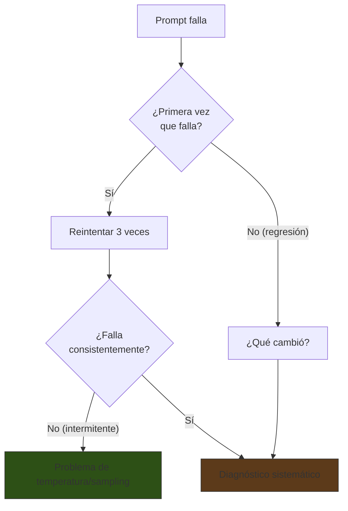
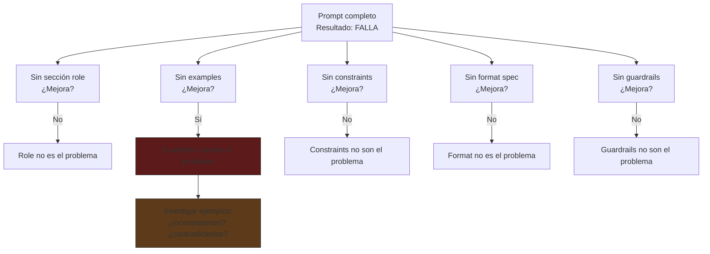
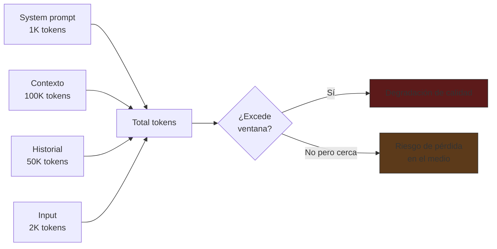

# Debugging de Prompts

> [!abstract] Resumen
> Cuando un prompt no funciona como se espera, se necesita un ==enfoque sistemático de diagnóstico==. Las técnicas incluyen ==estudios de ablación== (eliminar partes para identificar qué rompe), análisis de cadena de pensamiento (examinar los pasos de razonamiento), ==testing de sensibilidad al input== (pequeños cambios, grandes diferencias), e identificación de patrones de fallo comunes: fallas en seguimiento de instrucciones, *format drift*, ==triggers de alucinación==, y desbordamiento de ventana de contexto. Un framework de debugging estructurado reduce el tiempo de diagnóstico. ^resumen

---

## Cuándo debuggear

> [!question] ¿El prompt está roto o el caso es imposible?
> Antes de debuggear, pregúntate:
> 1. ¿El modelo tiene la ==capacidad== de hacer esta tarea? (modelo demasiado pequeño?)
> 2. ¿Le proporcioné ==toda la información necesaria==?
> 3. ¿La tarea es ==ambigua== incluso para un humano?
> 4. ¿Es un problema del ==modelo== o del ==prompt==?
>
> Si la respuesta a 1-3 es "no/no/sí", el problema probablemente no es el prompt.



---

## Estudios de ablación

Un *estudio de ablación* (*ablation study*) consiste en ==eliminar componentes del prompt sistemáticamente== para identificar cuál causa el problema[^1].

### Proceso

1. Toma el prompt completo (que falla)
2. Elimina una sección a la vez
3. Ejecuta el prompt sin esa sección
4. Observa si el comportamiento mejora o empeora
5. La sección cuya eliminación "arregla" el problema es la culpable

### Ejemplo práctico



> [!tip] Ablación binaria
> Para prompts largos, usa ==búsqueda binaria==: elimina la primera mitad, luego la segunda. Esto reduce el número de experimentos de O(n) a O(log n).

### Registro de ablación

| Componente eliminado | Resultado | Cambio observado | Conclusión |
|---|---|---|---|
| Role | Sigue fallando | Sin cambio | No es el problema |
| ==Examples== | ==Funciona== | ==Formato correcto ahora== | ==Ejemplo inconsistente== |
| Constraints | Sigue fallando | Sin cambio | No es el problema |
| Format spec | Sigue fallando | Formato diferente | No resuelve el bug |

> [!warning] Un componente puede enmascarar otro
> A veces, eliminar A "arregla" el problema pero la causa real es la ==interacción entre A y B==. Después de identificar un candidato, prueba re-añadiéndolo con modificaciones.

---

## Análisis de Chain-of-Thought

Cuando el modelo genera un razonamiento paso a paso (usando [[chain-of-thought]]), puedes ==examinar cada paso para encontrar dónde diverge la lógica==.

### Proceso

1. Forzar CoT explícito: "Muestra tu razonamiento paso a paso"
2. Leer cada paso del razonamiento
3. Identificar el primer paso incorrecto
4. Determinar por qué ese paso falla
5. Ajustar el prompt para corregir ese paso específico

### Patrones de error en CoT

| Patrón de error | Ejemplo | Corrección |
|---|---|---|
| ==Premisa incorrecta== | "Dado que Python es un lenguaje compilado..." | Proporcionar contexto correcto |
| Salto lógico | Paso 1 correcto → Paso 3 (sin paso 2) | Instrucción más granular |
| ==Error aritmético== | "5 × 3 = 12" | Instrucción: "verifica cada cálculo" |
| Bucle de razonamiento | Repite el mismo argumento sin avanzar | Límite de pasos + verificación |
| Conclusión no soportada | Razonamiento correcto → conclusión que no sigue | "Tu conclusión debe seguir directamente de tus pasos" |

> [!example]- Ejemplo de diagnóstico CoT
> **Prompt**: "¿Cuál es el costo total de 3 items a $15.99 más 8% de impuesto?"
>
> **CoT del modelo (con error)**:
> ```
> Paso 1: 3 items × $15.99 = $47.97 ✓
> Paso 2: Impuesto: $47.97 × 8% = $47.97 × 0.8 = $38.376 ✗
> (Error: 8% = 0.08, no 0.8)
> Paso 3: Total: $47.97 + $38.376 = $86.346
> ```
>
> **Diagnóstico**: Error aritmético en paso 2 (0.8 en vez de 0.08).
>
> **Corrección en el prompt**: Añadir "Nota: para calcular porcentajes, convierte N% a N/100. Ejemplo: 8% = 0.08."

---

## Input sensitivity testing

*Input sensitivity testing* descubre que ==pequeños cambios en el input producen grandes diferencias en el output==. Esto revela fragilidades del prompt.

### Tipos de variación a probar

| Variación | Ejemplo | Qué revela |
|---|---|---|
| ==Reformulación== | "Clasifica" vs "Categoriza" vs "Determina" | Sensibilidad a sinónimos |
| Orden de datos | Datos A-B-C vs C-B-A | Sesgo de posición |
| Puntuación | Con punto final vs sin punto | Sensibilidad a formato |
| Capitalización | Mayúsculas vs minúsculas | Sensibilidad a estilo |
| ==Longitud del input== | Input corto vs largo | Comportamiento con escala |
| Idioma mezclado | Input parcial en inglés | Robustez multilingüe |

### Proceso

```python
# Script de sensitivity testing
base_input = "Clasifica el sentimiento: 'Buen producto'"

variations = [
    "Categoriza el sentimiento: 'Buen producto'",
    "Determina el sentimiento: 'Buen producto'",
    "clasifica el sentimiento: 'Buen producto'",
    "CLASIFICA EL SENTIMIENTO: 'Buen producto'",
    "Clasifica el sentimiento: 'buen producto'",
    "Clasifica el sentimiento: 'Buen producto'.",
    "Clasifica el sentimiento del siguiente texto: 'Buen producto'",
]

results = {}
for var in variations:
    results[var] = run_prompt(var)

# Analizar consistencia
unique_results = set(results.values())
if len(unique_results) > 1:
    print("FRAGILE: diferentes inputs producen diferentes resultados")
    for var, result in results.items():
        print(f"  {var[:50]}... → {result}")
```

> [!danger] Un prompt frágil no está listo para producción
> Si pequeñas variaciones en el input cambian el resultado, el prompt es ==demasiado sensible==. Soluciones:
> - Añadir instrucciones más explícitas
> - Incluir ejemplos que cubran las variaciones
> - Normalizar el input antes del prompt (preprocessing)
> - Usar [[advanced-prompting|self-consistency]] para mayor robustez

---

## Patrones de fallo comunes

### 1. Instruction following failure

El modelo ==ignora o malinterpreta instrucciones explícitas==.

> [!failure] Síntomas
> - Responde en formato diferente al especificado
> - Incluye secciones no pedidas
> - Omite pasos del proceso solicitado
> - Mezcla idiomas cuando se pidió uno específico

**Causas comunes:**

| Causa | Diagnóstico | Solución |
|---|---|---|
| ==Instrucciones ambiguas== | Diferentes personas interpretan diferente | Reformular con precisión |
| Instrucciones enterradas en texto largo | Ablación revela que el modelo no "ve" la instrucción | Mover al inicio o final |
| Conflicto entre instrucciones | Dos instrucciones se contradicen | Eliminar conflicto |
| Instrucciones negativas | "No hagas X" no funciona | ==Reescribir como positiva== |

### 2. Format drift

La salida ==comienza con el formato correcto pero gradualmente diverge==.

```
ESPERADO:
{"sentimiento": "positivo", "confianza": 0.9}

REALIDAD:
{"sentimiento": "positivo", "confianza": 0.9}

OK, vamos con el siguiente. Creo que este texto es interesante
porque muestra varios matices del lenguaje...
```

> [!tip] Soluciones para format drift
> 1. Usar [[structured-output|tool use / function calling]] en vez de instrucciones de formato
> 2. Añadir instrucción final: "Responde ÚNICAMENTE con el JSON, sin texto adicional"
> 3. Post-procesamiento: extraer JSON del output con regex
> 4. ==Temperature 0==: reduce la tendencia a generar texto extra

### 3. Hallucination triggers

El modelo ==inventa información que no está en el contexto==[^2].

**Triggers comunes de alucinación:**

| Trigger | Ejemplo | Por qué ocurre |
|---|---|---|
| ==Preguntas sobre datos no proporcionados== | "¿Cuál es el email del autor?" (no está en el texto) | El modelo "rellena" huecos |
| Pedidos de precisión excesiva | "¿Cuál es el porcentaje exacto?" | Inventa números para parecer preciso |
| Temas fuera del training data | Eventos muy recientes o muy nicho | No tiene la información |
| ==Preguntas que asumen hechos falsos== | "¿Por qué Python es compilado?" | Acepta la premisa falsa |

> [!warning] Mitigaciones
> ```xml
> <constraints>
> - Si no tienes información suficiente para responder, di
>   "No tengo información suficiente para responder esto".
> - NUNCA inventes datos, estadísticas, citas o referencias.
> - Si la pregunta contiene una premisa incorrecta, señálala
>   antes de responder.
> - Distingue entre lo que sabes con certeza y lo que infiero.
>   Usa "probablemente" o "basándome en el contexto" cuando
>   no estés seguro.
> </constraints>
> ```

### 4. Context window overflow

El prompt + contexto ==excede la ventana de contexto efectiva== del modelo.



> [!danger] Síntomas de overflow
> 1. El modelo "olvida" instrucciones del system prompt
> 2. Ignora restricciones que están en la primera parte del prompt
> 3. Respuestas cada vez más genéricas en conversaciones largas
> 4. Mezcla información de diferentes partes del contexto

**Soluciones:**

| Solución | Complejidad | Efectividad |
|---|---|---|
| Reducir contexto (solo lo relevante) | Baja | ==Alta== |
| Resumir historial periódicamente | Media | Alta |
| Dividir en sub-tareas ([[mega-prompts\|prompt chaining]]) | Media | Alta |
| ==Usar modelo con ventana más grande== | Baja | Media (no resuelve "lost in the middle") |
| RAG selectivo (solo chunks relevantes) | Alta | ==Alta== |

---

## Framework de debugging

### Paso 1: Reproducir

```
¿El fallo es consistente?
  Sí → Problema en el prompt o el input
  No → Problema de sampling (temperatura, variabilidad)
```

### Paso 2: Aislar

```
¿Con el prompt MÁS SIMPLE posible, funciona?
  Sí → El problema está en las adiciones al prompt
  No → El modelo no puede hacer la tarea
```

### Paso 3: Ablación

```
Eliminar componentes uno a uno:
  ¿Cuál causa el fallo?
  → Investigar ese componente en detalle
```

### Paso 4: Análisis de razonamiento

```
Forzar CoT:
  ¿Dónde diverge el razonamiento?
  → Corregir ese paso específico
```

### Paso 5: Sensitivity

```
Variar el input:
  ¿El resultado es estable?
  No → El prompt es frágil, necesita refuerzo
```

### Paso 6: Fix y verificación

```
Aplicar corrección:
  ¿Pasa el caso original?
  ¿Pasa la regression suite completa?
  ¿No introduce nuevos fallos?
```

> [!success] Checklist de debugging
> - [ ] ¿Reproduce consistentemente?
> - [ ] ¿Con prompt mínimo funciona?
> - [ ] ¿Ablación identificó la sección problemática?
> - [ ] ¿CoT muestra dónde falla el razonamiento?
> - [ ] ¿Es sensible a variaciones del input?
> - [ ] ¿La corrección pasa la regression suite?

---

## Herramientas de debugging

| Herramienta | Para qué | Cómo ayuda |
|---|---|---|
| ==Promptfoo== | Comparación de variantes | Evalúa múltiples versiones side-by-side |
| Anthropic Console | Inspección de requests | ==Ver el prompt completo enviado al API== |
| LangSmith | Tracing de cadenas | Ver cada paso de una cadena LLM |
| Phoenix (Arize) | Observabilidad | Tracing + métricas de producción |
| ==Logging manual== | Debug básico | Imprimir prompt completo + respuesta |

> [!tip] El debug más subestimado
> ==Imprimir el prompt completo== tal como se envía al modelo. Muchos bugs se deben a que el prompt renderizado es diferente de lo que se espera (templates mal construidos, variables no sustituidas, encoding roto).

```python
# Debug básico pero efectivo
def debug_prompt(prompt, response):
    print("=" * 80)
    print("PROMPT ENVIADO:")
    print(prompt)
    print("=" * 80)
    print("RESPUESTA:")
    print(response)
    print("=" * 80)
    print(f"Tokens prompt: {count_tokens(prompt)}")
    print(f"Tokens respuesta: {count_tokens(response)}")
```

---

## Relación con el ecosistema

- **[[intake-overview|intake]]**: cuando un template Jinja2 de intake produce especificaciones incorrectas, el debugging sigue el mismo framework: ==¿el template se renderiza correctamente?== ¿El contexto inyectado es correcto? ¿La sección de instrucciones es clara? La ablación del template (eliminar secciones Jinja2) identifica qué parte causa el fallo.

- **[[architect-overview|architect]]**: debugging de agentes es más complejo porque hay ==múltiples turnos y tool calls==. El log de architect (cada Thought-Action-Observation) es esencialmente un CoT extendido que se puede analizar paso a paso. El agente `review` actúa como debugger automático del output del agente `build`.

- **[[vigil-overview|vigil]]**: si un prompt falla de formas inesperadas (output extraño, instrucciones ignoradas), vigil puede ayudar a determinar si hay ==prompt injection== como causa. Un atacante podría estar inyectando instrucciones que causan el comportamiento "roto" sin que el operador lo note.

- **[[licit-overview|licit]]**: los fallos en prompts de compliance son especialmente peligrosos porque pueden pasar desapercibidos (un análisis que ==parece correcto pero omite una regulación==). El debugging de prompts de licit requiere eval sets con gold labels verificadas por expertos legales, no solo verificación automática.

---

## Caso de estudio: debugging de un fallo real

> [!example]- Debugging paso a paso de un prompt de clasificación
> **Problema**: El prompt de clasificación de tickets retorna "OTHER" para el 40% de los casos.
>
> **Paso 1: Reproducir**
> - 40% consistente en 100 ejecuciones → problema en el prompt
>
> **Paso 2: Aislar**
> - Prompt mínimo ("Clasifica este ticket: ...") → funciona mejor (15% OTHER)
> - Algo en el prompt completo empeora las cosas
>
> **Paso 3: Ablación**
> - Sin role → 38% OTHER (no es el problema)
> - Sin examples → ==25% OTHER (mejora significativa)==
> - Sin constraints → 39% OTHER (no es el problema)
>
> **Paso 4: Investigar examples**
> - 2 de 3 ejemplos están en la categoría "OTHER"
> - ==El modelo aprende que "OTHER" es la respuesta probable==
> - Solución: rebalancear ejemplos (1 por categoría principal)
>
> **Paso 5: Verificar**
> - Con ejemplos rebalanceados: 8% OTHER → ==aceptable==
> - Regression suite: todos los tests pasan

---

## Enlaces y referencias

> [!quote]- Bibliografía
> - [^1]: Lu, Y. et al. (2022). *Fantastically Ordered Prompts and Where to Find Them: Overcoming Few-Shot Prompt Order Sensitivity*. ACL. Sensibilidad al orden de ejemplos.
> - [^2]: Ji, Z. et al. (2023). *Survey of Hallucination in Natural Language Generation*. ACM Computing Surveys. Survey comprensivo de alucinaciones.
> - Liu, N. et al. (2023). *Lost in the Middle: How Language Models Use Long Contexts*. Pérdida de atención en contextos largos.
> - Anthropic (2024). *Troubleshooting Guide for Claude*. Guía oficial de debugging.
> - Promptfoo (2024). *Debugging LLM Outputs*. Patrones de debugging con Promptfoo.

[^1]: Lu, Y. et al. (2022). *Fantastically Ordered Prompts and Where to Find Them*. ACL.
[^2]: Ji, Z. et al. (2023). *Survey of Hallucination in Natural Language Generation*. ACM.
