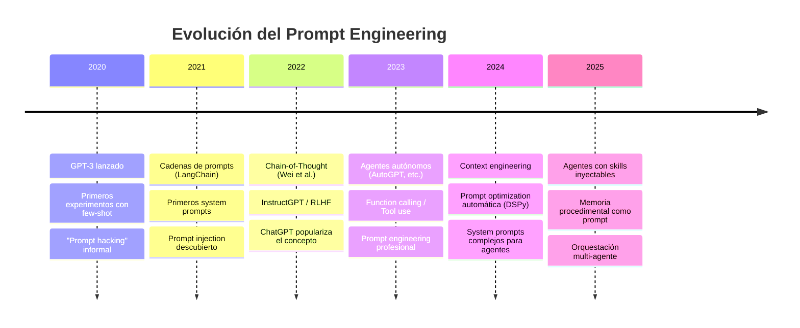
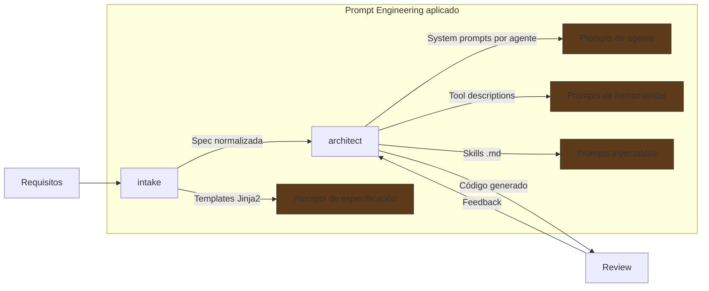

# Prompt Engineering: Visión General

> [!abstract] Resumen
> La ==ingeniería de prompts== es la disciplina que estudia cómo diseñar, optimizar y gestionar las instrucciones que reciben los modelos de lenguaje. Ha evolucionado desde simples indicaciones textuales hasta sistemas complejos de ==context engineering== que orquestan identidad, herramientas, memoria y restricciones. En la era de los agentes autónomos, el prompt engineering se convierte en la interfaz fundamental entre la intención humana y la capacidad de la máquina. ^resumen

---

## Definición y alcance

*Prompt engineering* (ingeniería de prompts) es el proceso sistemático de diseñar entradas para modelos de lenguaje con el fin de obtener salidas predecibles, útiles y seguras[^1]. No se trata simplemente de "escribir bien" — implica comprender la arquitectura del modelo, sus limitaciones y los patrones de respuesta que emergen de diferentes estructuras de entrada.

> [!info] Distinción clave
> Un **prompt** no es solo texto que escribe un usuario. En sistemas de producción, un prompt incluye:
> - *System prompt* (identidad y reglas del sistema)
> - Contexto inyectado (RAG, herramientas, memoria)
> - Historial de conversación (*multi-turn*)
> - La instrucción del usuario propiamente dicha

La disciplina abarca desde [[tecnicas-basicas|técnicas fundamentales]] como *zero-shot* y *few-shot* hasta patrones avanzados como [[chain-of-thought|cadena de pensamiento]], [[advanced-prompting|meta-prompting]] y [[system-prompts|diseño de system prompts de producción]].

---

## Evolución histórica



### Era pre-instrucciones (2020-2021)

Los primeros modelos de lenguaje grandes (*LLMs*) como GPT-3 requerían una técnica particular: el *prompt* debía parecer una continuación natural de texto. No existían instrucciones explícitas — el modelo simplemente completaba patrones.

```
Traduce del inglés al español:
English: The cat is on the table.
Spanish: El gato está sobre la mesa.
English: I love programming.
Spanish:
```

> [!tip] Legado importante
> Esta era estableció el principio fundamental: ==los LLMs son máquinas de completar patrones==. Toda técnica posterior se basa en esta idea, incluso cuando las capas de instrucciones lo ocultan.

### Era de instrucciones (2022-2023)

Con *InstructGPT* y modelos alineados mediante *RLHF* (*Reinforcement Learning from Human Feedback*), los modelos comenzaron a seguir instrucciones directas. Esto democratizó el uso pero también creó una falsa sensación de simplicidad.

### Era de agentes (2024-presente)

Los agentes autónomos como [[architect-overview|architect]] transformaron el prompt engineering. Un agente no recibe un solo prompt — opera con un ==sistema de prompts interconectados==:

| Componente | Función | Ejemplo en architect |
|---|---|---|
| System prompt | Define identidad y capacidades | Agente `plan` = analista, agente `build` = desarrollador |
| Tool descriptions | Instrucciones para uso de herramientas | Cada herramienta tiene su prompt de uso |
| Skills | Conocimiento inyectable contextual | `.architect/skills/*.md` inyectados al prompt |
| Memoria procedimental | Correcciones del usuario como contexto | Historial de correcciones previas |

---

## Prompt Engineering vs Context Engineering

> [!warning] Evolución terminológica
> En 2025, el término *context engineering* comenzó a reemplazar a *prompt engineering* en contextos profesionales. No es un reemplazo sino una ==ampliación del alcance==.

### Prompt Engineering tradicional

Se centra en la redacción del texto de instrucciones:

- Cómo formular la pregunta
- Qué ejemplos incluir
- Cómo estructurar la salida esperada
- Técnicas como [[chain-of-thought]] o [[advanced-prompting|self-consistency]]

### Context Engineering

Se centra en todo el contexto que recibe el modelo:

```mermaid
graph TD
    CE[Context Engineering] --> SP[System Prompt]
    CE --> RAG[Documentos RAG]
    CE --> TU[Tool Use / Herramientas]
    CE --> MEM[Memoria]
    CE --> HIST[Historial de conversación]
    CE --> SK[Skills inyectables]
    CE --> GUARD[Guardrails]

    SP --> |"Identidad + reglas"| LLM[Modelo LLM]
    RAG --> |"Conocimiento externo"| LLM
    TU --> |"Capacidades de acción"| LLM
    MEM --> |"Contexto persistente"| LLM
    HIST --> |"Conversación previa"| LLM
    SK --> |"Conocimiento específico"| LLM
    GUARD --> |"Restricciones de seguridad"| LLM

    style CE fill:#2d5016,stroke:#333
    style LLM fill:#1a3a5c,stroke:#333
```



> [!example] Context engineering en architect
> Cuando [[architect-overview|architect]] ejecuta una tarea de codificación:
> 1. Carga el *system prompt* del agente `build` (identidad de desarrollador)
> 2. Inyecta *skills* relevantes desde `.architect/skills/*.md`
> 3. Incluye la memoria procedimental (correcciones previas del usuario)
> 4. Adjunta descripciones de herramientas disponibles
> 5. Añade el contexto del repositorio (estructura, archivos relevantes)
> 6. Finalmente, la instrucción del usuario
>
> Todo esto junto es el ==contexto completo== — mucho más que un simple prompt.

---

## Taxonomía de habilidades

El prompt engineering como disciplina comprende varias áreas de competencia:

### Nivel 1: Fundamentos

| Habilidad | Descripción | Nota de referencia |
|---|---|---|
| ==Formulación de instrucciones== | Escribir instrucciones claras y no ambiguas | [[tecnicas-basicas]] |
| Selección de ejemplos | Elegir *few-shot examples* representativos | [[tecnicas-basicas]] |
| Formato de salida | Especificar estructura de respuesta | [[structured-output]] |

### Nivel 2: Razonamiento

| Habilidad | Descripción | Nota de referencia |
|---|---|---|
| ==Cadena de pensamiento== | Guiar el razonamiento paso a paso | [[chain-of-thought]] |
| Descomposición de problemas | Dividir tareas complejas | [[advanced-prompting]] |
| Auto-evaluación | Prompts que se corrigen a sí mismos | [[advanced-prompting]] |

### Nivel 3: Sistemas

| Habilidad | Descripción | Nota de referencia |
|---|---|---|
| ==Diseño de system prompts== | Crear identidades de agentes | [[system-prompts]] |
| Prompting para herramientas | Diseñar *tool descriptions* | [[prompting-para-agentes]] |
| Seguridad | Prevenir *prompt injection* | [[prompt-injection]] |
| Testing | Evaluar prompts sistemáticamente | [[prompt-testing]] |

### Nivel 4: Optimización

| Habilidad | Descripción | Nota de referencia |
|---|---|---|
| ==Optimización automática== | DSPy, A/B testing | [[prompt-optimization]] |
| Debugging | Diagnóstico de fallos | [[prompt-debugging]] |
| Mega-prompts | Prompts complejos de producción | [[mega-prompts]] |

---

## Por qué importa más con agentes

> [!danger] Impacto amplificado
> En un chatbot, un prompt malo produce una mala respuesta. En un agente, un prompt malo produce ==acciones incorrectas en sistemas reales==: escribir código defectuoso, ejecutar comandos peligrosos, o tomar decisiones irreversibles.

Los agentes autónomos amplifican tanto los aciertos como los errores del prompt engineering:

1. **Concatenación de errores**: un error en el *system prompt* del agente `plan` de [[architect-overview|architect]] se propaga al agente `build`, produciendo código fundamentalmente mal orientado.

2. **Tool descriptions como prompts**: cada descripción de herramienta es un mini-prompt que el modelo debe interpretar correctamente para decidir cuándo y cómo usar esa herramienta.

3. **Multi-turn sin supervisión**: el agente toma múltiples decisiones en secuencia. El prompt debe ser lo suficientemente robusto para guiar ==todas== las decisiones, no solo la primera.

4. **Inyección de contexto dinámico**: con sistemas como [[intake-overview|intake]] que generan especificaciones normalizadas, el prompt del agente receptor debe manejar correctamente información generada por otro sistema.

> [!question] Pregunta para reflexionar
> Si un agente como [[architect-overview|architect]] inyecta *skills* dinámicamente en su prompt, ¿dónde termina el "prompt engineering" y comienza la "arquitectura del sistema"?
>
> La respuesta: ==no hay una línea clara==. Por eso el concepto de *context engineering* es más adecuado para sistemas agénticos.

---

## El ecosistema prompt en la práctica

La ingeniería de prompts no existe en aislamiento — forma parte de un ecosistema de herramientas y procesos:



---

## Relación con el ecosistema

El prompt engineering conecta con cada componente del ecosistema de maneras específicas:

- **[[intake-overview|intake]]**: utiliza *templates Jinja2* para generar prompts de especificación. La calidad del template determina la calidad de la especificación normalizada. intake demuestra que los prompts de producción rara vez son texto estático — son ==plantillas parametrizadas== que se renderizan con datos del contexto.

- **[[architect-overview|architect]]**: es el caso más complejo. Cada agente (`plan`, `build`, `resume`, `review`) tiene su propio *system prompt* que define su rol. Las *skills* (`.architect.md` + `.architect/skills/*.md`) se inyectan dinámicamente. Las *tool descriptions* son prompts para *function calling*. La memoria procedimental (correcciones del usuario) se incorpora al contexto. architect es un ejemplo vivo de ==context engineering== completo.

- **[[vigil-overview|vigil]]**: es el contra-ejemplo perfecto. vigil usa reglas deterministas, no LLMs. Sin embargo, el prompt engineering es relevante porque vigil puede ==detectar prompt injection== en los inputs que procesan otros sistemas. La ausencia de LLM en vigil es una decisión de diseño: para seguridad, el determinismo supera a la inteligencia.

- **[[licit-overview|licit]]**: utiliza LLMs para análisis de cumplimiento con requisitos estrictos de [[structured-output|salida estructurada]]. Los prompts de licit deben producir análisis reproducibles y auditables — un desafío particular del prompt engineering aplicado a *compliance*.

---

## Principios fundamentales

> [!success] Los 5 principios del prompt engineering efectivo
> 1. **Claridad** — instrucciones no ambiguas
> 2. **Especificidad** — detallar el formato, tono y alcance esperado
> 3. **Contexto** — proporcionar toda la información necesaria
> 4. **Iteración** — tratar los prompts como código: versionar, testear, mejorar
> 5. **Seguridad** — anticipar usos adversarios ([[prompt-injection]])

---

## Mapa de contenidos

Este overview conecta con todas las notas de la sección:

| Nota | Nivel | Enfoque |
|---|---|---|
| [[tecnicas-basicas]] | Beginner | Zero-shot, few-shot, delimitadores |
| [[chain-of-thought]] | Intermediate | CoT, ToT, GoT |
| [[advanced-prompting]] | Advanced | Self-consistency, ReAct, Reflexion |
| [[system-prompts]] | Advanced | System prompts de producción |
| [[structured-output]] | Intermediate | JSON, function calling, Pydantic |
| [[prompt-injection]] | Advanced | Ataques y defensas |
| [[prompt-optimization]] | Advanced | DSPy, A/B testing |
| [[mega-prompts]] | Intermediate | Prompts complejos y largos |
| [[prompting-para-agentes]] | Advanced | Prompts para agentes autónomos |
| [[prompting-para-codigo]] | Intermediate | Generación de código |
| [[prompt-testing]] | Intermediate | Testing y evaluación |
| [[prompt-debugging]] | Intermediate | Diagnóstico de fallos |

---

## Enlaces y referencias

> [!quote]- Bibliografía
> - [^1]: Brown, T. et al. (2020). *Language Models are Few-Shot Learners*. NeurIPS. Artículo fundacional que demostró las capacidades de *few-shot learning* en GPT-3.
> - Wei, J. et al. (2022). *Chain-of-Thought Prompting Elicits Reasoning in Large Language Models*. NeurIPS. Véase [[chain-of-thought]].
> - Yao, S. et al. (2023). *ReAct: Synergizing Reasoning and Acting in Language Models*. ICLR. Véase [[advanced-prompting]].
> - Khattab, O. et al. (2023). *DSPy: Compiling Declarative Language Model Calls into Self-Improving Pipelines*. Véase [[prompt-optimization]].
> - Anthropic (2024). *Prompt Engineering Guide*. Documentación oficial de Claude.
> - OpenAI (2024). *Prompt Engineering Best Practices*. Documentación oficial.

[^1]: Brown, T. et al. (2020). *Language Models are Few-Shot Learners*. NeurIPS 2020.
