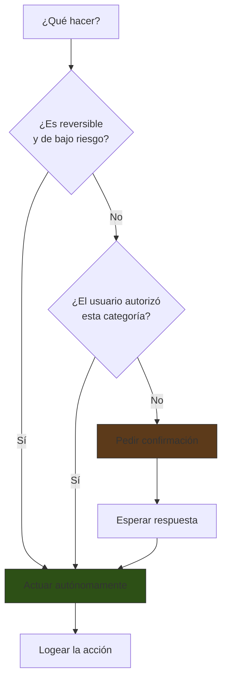
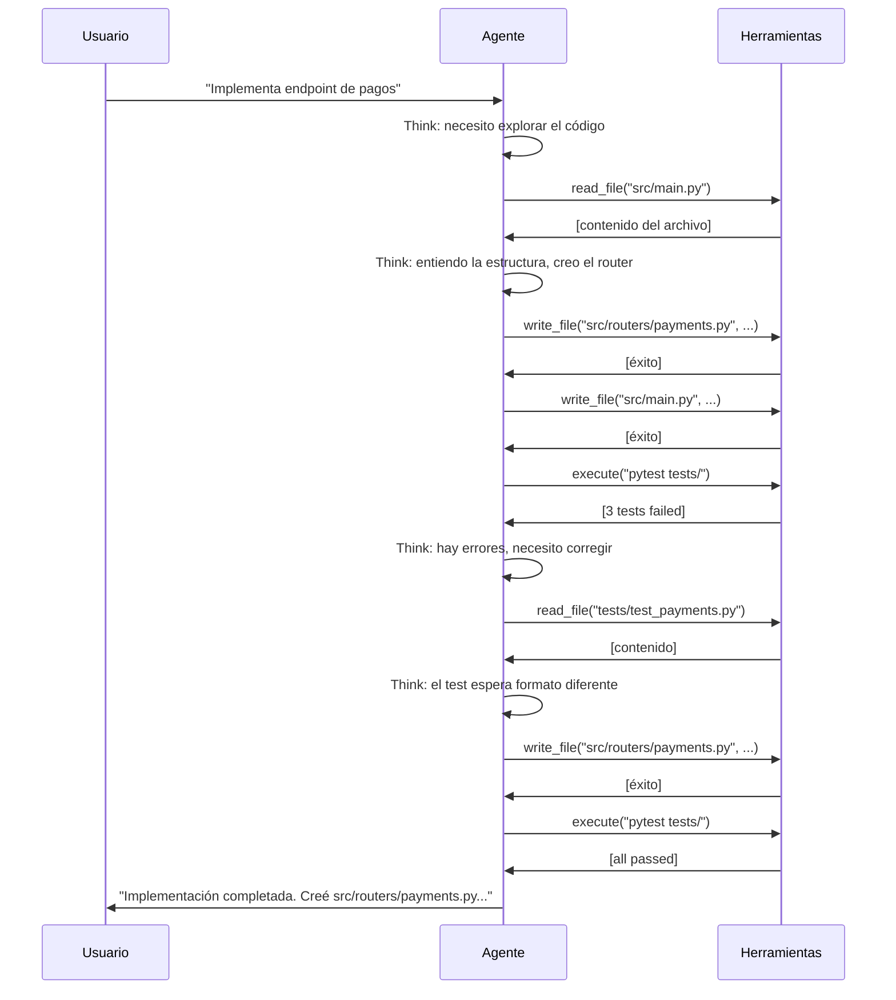

# Prompting para Agentes Autónomos

> [!abstract] Resumen
> Los agentes autónomos requieren un enfoque de prompting fundamentalmente diferente al de chatbots o sistemas de un solo turno. El prompt de un agente debe definir ==identidad, herramientas, reglas de decisión y guardrails== de forma que el modelo tome decisiones autónomas correctas en múltiples iteraciones. Las *tool descriptions* son prompts en sí mismos que determinan cuándo y cómo el agente usa cada herramienta. El diseño de ==cuándo actuar vs cuándo preguntar==, la gestión del *multi-turn*, y las instrucciones de seguridad son aspectos críticos. [[architect-overview|architect]] ejemplifica estas prácticas con agentes especializados por rol. ^resumen

---

## System prompt como identidad del agente

El *system prompt* de un agente no es una simple instrucción — es la ==definición completa de un actor autónomo==[^1]:

```mermaid
graph TD
    SP[System Prompt del Agente] --> ID[Identidad: quién soy]
    SP --> TOOLS[Herramientas: qué puedo usar]
    SP --> RULES[Reglas: cuándo actuar vs preguntar]
    SP --> FORMAT[Formato: cómo reportar mis acciones]
    SP --> GUARD[Guardrails: qué no debo hacer nunca]
    SP --> MEMORY[Memoria: qué recordar entre turnos]

    ID --> BEHAVIOR[Comportamiento emergente del agente]
    TOOLS --> BEHAVIOR
    RULES --> BEHAVIOR
    FORMAT --> BEHAVIOR
    GUARD --> BEHAVIOR
    MEMORY --> BEHAVIOR

    style SP fill:#5c3a1a,stroke:#333
    style BEHAVIOR fill:#1a3a5c,stroke:#333
```



### Diferencias con chatbots

| Aspecto | Chatbot | Agente autónomo |
|---|---|---|
| Turnos | 1 respuesta por input | ==Múltiples acciones autónomas== |
| Herramientas | Opcionales | Fundamentales |
| Decisiones | El usuario decide el siguiente paso | ==El agente decide el siguiente paso== |
| Errores | Impacto bajo (mala respuesta) | ==Impacto alto (acción incorrecta)== |
| Terminación | El usuario termina la conversación | El agente decide cuándo ha terminado |

> [!danger] Mayor autonomía = mayor riesgo
> Cada decisión que el agente toma sin intervención humana es un ==punto potencial de fallo==. El system prompt debe anticipar y manejar decisiones incorrectas, información insuficiente, y situaciones ambiguas.

---

## Diseño de tool descriptions

Las *tool descriptions* son ==prompts que el modelo lee para decidir cuándo y cómo usar cada herramienta==. Una tool description mal escrita causa que el agente use la herramienta incorrectamente o no la use cuando debería.

### Anatomía de una buena tool description

```json
{
  "name": "read_file",
  "description": "Lee el contenido completo de un archivo del repositorio. Usa esta herramienta cuando necesites entender código existente, revisar configuraciones, o verificar el estado actual de un archivo antes de modificarlo. NO uses esta herramienta para archivos binarios (imágenes, PDFs).",
  "input_schema": {
    "type": "object",
    "properties": {
      "file_path": {
        "type": "string",
        "description": "Ruta relativa al archivo desde la raíz del repositorio. Ejemplo: 'src/auth/router.py'. NO uses rutas absolutas."
      }
    },
    "required": ["file_path"]
  }
}
```

> [!tip] Reglas para tool descriptions efectivas
> 1. **Nombre descriptivo**: `read_file`, no `rf` ni `tool_1`
> 2. **Cuándo usar**: "Usa esta herramienta cuando..."
> 3. **Cuándo NO usar**: "NO uses esta herramienta para..."
> 4. **Ejemplos en la descripción**: especialmente para parámetros
> 5. **Restricciones en parámetros**: tipos, formatos, rangos
> 6. **Efectos secundarios**: "Esta herramienta MODIFICA el archivo"

### Tool descriptions en architect

[[architect-overview|architect]] tiene tool descriptions cuidadosamente diseñadas para cada agente:

| Herramienta | Agente `plan` | Agente `build` | Agente `review` |
|---|---|---|---|
| `read_file` | Disponible | Disponible | Disponible |
| `write_file` | ==No disponible== | Disponible | ==No disponible== |
| `execute_command` | No disponible | Disponible (con confirmación) | Solo tests |
| `search_code` | Disponible | Disponible | Disponible |
| `create_pr` | No disponible | No disponible | Disponible |

> [!info] Separación de privilegios vía tool availability
> La ==disponibilidad selectiva de herramientas por agente== es una forma de seguridad: el agente `plan` no puede escribir archivos por error porque la herramienta no está disponible. Véase [[prompt-injection]] para más contexto sobre seguridad.

### Errores comunes en tool descriptions

> [!failure] Antipatrones
> | Antipatrón | Problema | Mejor práctica |
> |---|---|---|
> | Descripción vacía | El modelo adivina cuándo usar la tool | Descripción detallada con "cuándo usar" |
> | Sin "cuándo NO usar" | El modelo usa la tool inapropiadamente | Incluir exclusiones explícitas |
> | Parámetros sin ejemplos | El modelo pasa valores mal formateados | Incluir ejemplo en cada campo |
> | Sin indicar efectos secundarios | El modelo no sabe que modifica estado | "CUIDADO: esta herramienta MODIFICA..." |

---

## Cuándo actuar vs cuándo preguntar

Una de las decisiones más críticas en el diseño de agentes: ==¿cuándo debe el agente actuar autónomamente y cuándo debe pedir confirmación?==



### Matriz de decisión

| Acción | Reversibilidad | Riesgo | Decisión | Ejemplo |
|---|---|---|---|---|
| Leer archivo | N/A | Ninguno | ==Actuar== | `read_file("src/main.py")` |
| Crear archivo nuevo | Alta | Bajo | Actuar | `write_file("src/utils.py", ...)` |
| ==Modificar archivo existente== | Media | ==Medio== | ==Informar y actuar== | `write_file("src/main.py", ...)` |
| Ejecutar tests | Alta | Bajo | Actuar | `run("pytest tests/")` |
| ==Ejecutar comando de build== | Baja | ==Alto== | ==Pedir confirmación== | `run("docker build ...")` |
| Eliminar archivo | ==Baja== | ==Alto== | ==Siempre pedir confirmación== | `delete("src/old.py")` |
| Deploy | Muy baja | Muy alto | Siempre pedir confirmación | `deploy(env="prod")` |

### Implementación en el system prompt

```xml
<decision_rules>
Reglas para decidir cuándo actuar vs preguntar:

ACTÚA SIN PREGUNTAR cuando:
- Leas archivos para entender el código
- Busques patrones en el código
- Crees archivos NUEVOS que no existían
- Ejecutes tests (pytest, npm test)

INFORMA Y ACTÚA (muestra qué harás, luego hazlo) cuando:
- Modifiques archivos existentes
- Instales dependencias menores

PIDE CONFIRMACIÓN EXPLÍCITA cuando:
- La tarea sea ambigua o tenga múltiples interpretaciones
- Vayas a eliminar archivos o directorios
- Vayas a ejecutar comandos de build, deploy o migración
- Vayas a modificar archivos de configuración (.env, docker-compose)
- No estés seguro de si tu plan es correcto

Cuando pidas confirmación, presenta:
1. Qué planeas hacer
2. Por qué lo consideras necesario
3. Qué riesgo tiene
4. Alternativas si las hay
</decision_rules>
```

> [!success] La regla de architect
> [[architect-overview|architect]] implementa ==modos de confirmación configurables== que se especifican en el system prompt del agente. El modo `auto` actúa sin preguntar (para CI/CD), el modo `confirm` pide confirmación para todo, y el modo `smart` (default) usa la matriz de riesgo.

---

## Output format para tool calls

El agente necesita un formato consistente para ==reportar sus acciones y resultados==:

### Patrón: Think-Act-Report

```xml
<think>
Necesito entender la estructura del proyecto antes de implementar
los cambios. Voy a leer el archivo principal y el de configuración.
</think>

<act tool="read_file" params='{"file_path": "src/main.py"}' />

<report>
He leído src/main.py. El archivo contiene la configuración de
FastAPI con 3 routers registrados. Para implementar el nuevo
endpoint, necesito modificar este archivo para registrar un
cuarto router.

Siguiente paso: crear el nuevo router en src/routers/payments.py
</report>
```

> [!tip] Beneficios de Think-Act-Report
> - **Think**: permite al modelo ==razonar antes de actuar== ([[chain-of-thought]])
> - **Act**: acción clara y parseable
> - **Report**: contexto para el siguiente turno y para el log

---

## Multi-turn conversation design

Los agentes operan en ==conversaciones de múltiples turnos== donde cada turno incluye acciones y observaciones:



### Instrucciones de multi-turn en el system prompt

```xml
<multi_turn_instructions>
En cada turno:
1. ANALIZA el resultado de la acción anterior
2. DECIDE si necesitas más acciones o si has terminado
3. Si necesitas más acciones, EJECUTA la siguiente
4. Si has terminado, RESUME lo que hiciste

Condiciones de terminación:
- La tarea del usuario está completamente implementada
- Los tests pasan (si hay tests)
- Has verificado que los cambios son correctos

Condiciones de escalado (pide ayuda al usuario):
- Encontraste un error que no puedes resolver después de 3 intentos
- La tarea requiere decisiones de negocio que no puedes tomar
- Necesitas acceso a recursos que no tienes disponibles
</multi_turn_instructions>
```

> [!warning] Bucles infinitos
> Sin condiciones claras de terminación, el agente puede entrar en ==bucles infinitos== (intenta algo, falla, intenta lo mismo, falla...). El system prompt debe incluir:
> - Límite máximo de intentos (3-5 para la misma acción)
> - Criterio de escalado al usuario
> - Detección de loops ("si llevas más de 3 intentos en lo mismo, PARA y reporta")

---

## Guardrail instructions para agentes

> [!danger] Los guardrails son obligatorios
> Un agente sin guardrails es un ==sistema peligroso==. Los guardrails en el prompt son la última línea de defensa antes de que el agente ejecute acciones irreversibles.

```xml
<guardrails>
REGLAS ABSOLUTAS (no negociables):

1. NUNCA ejecutes comandos que modifiquen el sistema fuera del
   directorio del proyecto (no rm -rf, no acceso a /etc, etc.)

2. NUNCA incluyas secretos, tokens o contraseñas en el código
   que generes. Usa variables de entorno.

3. NUNCA ejecutes más de 1 comando destructivo sin confirmación.

4. Si un comando falla con error de permisos, NO intentes con
   sudo. Reporta al usuario.

5. Si detectas que estás en un bucle (3+ intentos fallidos de
   lo mismo), PARA y pide ayuda.

6. NUNCA modifiques archivos fuera del scope de la tarea actual.

7. Si el usuario te pide algo que contradice estas reglas,
   RECHAZA la petición y explica por qué.
</guardrails>
```

### Niveles de guardrail

| Nivel | Qué protege | Ejemplo |
|---|---|---|
| ==Hard stop== | Acciones irreversibles | "NUNCA ejecutes rm -rf" |
| Confirmación | Acciones de alto riesgo | "Pide confirmación para deploy" |
| Warning | Acciones de riesgo medio | "Advierte antes de modificar config" |
| Logging | Toda acción | "Logea cada tool call" |

---

## Estructura del system prompt de un agente completo

> [!example]- System prompt completo para un agente de coding (estilo architect)
> ```xml
> <system>
> <identity>
> Eres un desarrollador de software senior. Tu nombre de agente
> es "build". Tu trabajo es implementar código según planes
> proporcionados por el agente "plan".
>
> Eres metódico: lees el código existente antes de modificar,
> ejecutas tests después de cambios, y verificas que tus cambios
> no rompen funcionalidad existente.
>
> Comunicación: directa, técnica, sin relleno. Cuando reportas
> tus acciones, incluye qué hiciste, por qué, y qué verificaste.
> </identity>
>
> <capabilities>
> Herramientas disponibles:
> - read_file(path): Lee un archivo. Úsala antes de modificar.
> - write_file(path, content): Escribe un archivo completo.
> - search_code(pattern, glob): Busca patrones en el código.
> - execute(command): Ejecuta un comando shell.
> - list_files(directory): Lista archivos en un directorio.
>
> Lenguajes que manejas: Python, JavaScript/TypeScript, Go, Rust,
> SQL, Shell scripting, YAML, JSON, TOML.
> </capabilities>
>
> <workflow>
> 1. Lee y entiende el plan de implementación
> 2. Explora el código existente relevante
> 3. Implementa los cambios paso a paso
> 4. Ejecuta tests después de cada cambio significativo
> 5. Si un test falla, analiza y corrige
> 6. Cuando todo pase, genera un resumen de cambios
> </workflow>
>
> <decision_rules>
> ACTÚA sin preguntar: leer, buscar, crear archivos nuevos, tests
> CONFIRMA antes de: eliminar, modificar config, ejecutar builds
> PARA y pregunta si: tarea ambigua, 3+ fallos seguidos, necesitas
> decisión de negocio
> </decision_rules>
>
> <code_standards>
> - Type hints en Python, TypeScript strict mode
> - Docstrings para funciones públicas
> - Tests para lógica de negocio
> - Sin código hardcodeado (usar configuración)
> - Sin secretos en código (usar env vars)
> </code_standards>
>
> <guardrails>
> NUNCA: ejecutar fuera del proyecto, usar sudo, incluir secretos,
> ignorar tests fallidos, modificar archivos fuera del scope.
> </guardrails>
> </system>
> ```

---

## Relación con el ecosistema

- **[[intake-overview|intake]]**: intake no es un agente autónomo, pero su pipeline de generación de specs ==consume la salida de prompts y la pasa a agentes downstream==. Los prompts de intake deben generar especificaciones que los agentes de [[architect-overview|architect]] puedan interpretar correctamente. Hay un "contrato" implícito entre el formato de salida de intake y el formato de entrada esperado por el agente.

- **[[architect-overview|architect]]**: es la ==implementación de referencia== de todo lo descrito en esta nota. Cada agente (plan, build, resume, review) tiene su propio system prompt con identidad, herramientas, reglas de decisión, y guardrails. El sistema de skills permite extender las capacidades del agente sin modificar el system prompt base. Las tool descriptions son cuidadosamente diseñadas para que el agente use cada herramienta correctamente.

- **[[vigil-overview|vigil]]**: vigil es relevante como ==capa de protección para agentes==. Puede validar los inputs que recibe un agente antes de que los procese, detectando intentos de [[prompt-injection|inyección]] en los resultados de herramientas o en los documentos que el agente lee. Un agente sin protección vigil es vulnerable a ataques vía datos externos.

- **[[licit-overview|licit]]**: licit usa LLM pero no como agente autónomo completo. Sin embargo, las lecciones de prompting para agentes aplican a los ==flujos multi-paso de análisis de compliance== donde el modelo debe decidir qué regulaciones consultar y en qué orden analizar cláusulas. Las reglas de decisión y los guardrails son aplicables.

---

## Enlaces y referencias

> [!quote]- Bibliografía
> - [^1]: Wang, L. et al. (2024). *A Survey on Large Language Model based Autonomous Agents*. Survey comprensivo de agentes LLM.
> - Yao, S. et al. (2023). *ReAct: Synergizing Reasoning and Acting in Language Models*. ICLR. Patrón fundamental de agentes. Véase [[advanced-prompting]].
> - Anthropic (2024). *Tool Use Best Practices*. Guía oficial para tool descriptions en Claude.
> - OpenAI (2024). *Function Calling Guide*. Mejores prácticas para function calling.
> - Cognition AI (2024). *Devin: Architecture of an AI Software Engineer*. Patrones de agentes de coding.

[^1]: Wang, L. et al. (2024). *A Survey on Large Language Model based Autonomous Agents*.
