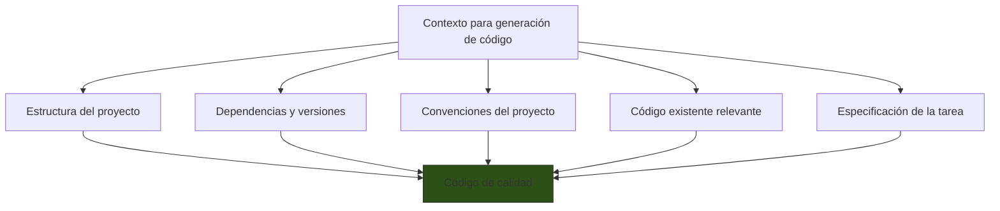
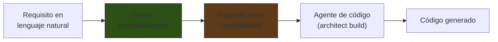

# Prompting para Generación de Código

> [!abstract] Resumen
> La generación de código mediante LLMs requiere técnicas de prompting especializadas. La ==provisión de contexto== (estructura de archivos, dependencias, convenciones) es más importante que en cualquier otro tipo de prompting. [[intake-overview|intake]] demuestra cómo normalizar requisitos en especificaciones que los agentes de codificación pueden consumir. Las mejores prácticas incluyen ==examples con pares input/output==, instrucciones específicas por lenguaje, instrucciones de testing dentro del prompt, y prompts de code review. La generación spec-driven reduce errores al forzar al modelo a planificar antes de codificar. ^resumen

---

## El desafío de generar código con LLMs

Generar código es fundamentalmente diferente de generar texto natural:

| Aspecto | Texto natural | Código |
|---|---|---|
| Tolerancia a errores | ==Alta== (un typo se entiende) | ==Cero== (un typo no compila) |
| Formato | Flexible | Estricto (sintaxis del lenguaje) |
| Dependencias | Mínimas | Muchas (imports, APIs, tipos) |
| Verificabilidad | Subjetiva | Objetiva (compila, tests pasan) |
| Contexto necesario | Moderado | ==Extenso== (proyecto completo) |

> [!danger] El código generado se ejecuta
> A diferencia de texto generado que un humano lee e interpreta, el código ==se ejecuta directamente en sistemas reales==. Un bug sutil en código generado puede causar vulnerabilidades de seguridad, pérdida de datos, o fallos en producción.

---

## Provisión de contexto

La calidad del código generado depende ==directamente de la calidad del contexto== proporcionado.

### Contexto mínimo necesario



### Estructura del proyecto

```xml
<project_structure>
my-api/
├── src/
│   ├── __init__.py
│   ├── main.py              # FastAPI app, router registration
│   ├── config.py             # Settings via pydantic-settings
│   ├── db.py                 # SQLAlchemy session management
│   ├── models/
│   │   ├── __init__.py
│   │   ├── user.py           # User SQLAlchemy model
│   │   └── order.py          # Order SQLAlchemy model
│   ├── routers/
│   │   ├── __init__.py
│   │   ├── auth.py           # Login, register, refresh token
│   │   └── orders.py         # CRUD orders
│   └── schemas/
│       ├── user.py           # Pydantic schemas for users
│       └── order.py          # Pydantic schemas for orders
├── tests/
│   ├── conftest.py           # Fixtures: test db, test client
│   ├── test_auth.py
│   └── test_orders.py
├── pyproject.toml
└── docker-compose.yml
</project_structure>
```

> [!tip] No incluyas todo — incluye lo relevante
> Para un proyecto grande, incluir todos los archivos es imposible y contraproducente. Incluye:
> - ==El árbol de directorios completo== (nombres de archivos con descripción breve)
> - El contenido completo de los ==archivos que se van a modificar==
> - Los archivos que contienen ==interfaces o tipos== que el código nuevo debe respetar
> - Los archivos de ==configuración relevantes== (dependencies, config)

### Dependencias y versiones

```xml
<dependencies>
Python 3.12
FastAPI 0.109
SQLAlchemy 2.0 (async, usando AsyncSession)
Pydantic 2.6
pytest 8.0
httpx 0.26 (para test client async)
alembic 1.13 (migraciones)
PostgreSQL 16
</dependencies>
```

> [!warning] Las versiones importan
> Un modelo puede generar código para SQLAlchemy 1.x cuando el proyecto usa 2.x. ==Especificar versiones evita código incompatible==.

### Convenciones del proyecto

```xml
<conventions>
- Naming: snake_case para funciones/variables, PascalCase para clases
- Async: todas las operaciones de DB son async (AsyncSession)
- Tipos: type hints obligatorios en todas las funciones
- Validación: via Pydantic schemas, nunca validación manual
- Errores: HTTPException con status_code y detail descriptivo
- Tests: pytest + httpx AsyncClient, fixtures en conftest.py
- Commits: conventional commits (feat:, fix:, refactor:, etc.)
- Docstrings: Google style para funciones públicas
</conventions>
```

---

## Generación spec-driven con intake

[[intake-overview|intake]] demuestra el patrón más robusto para generación de código: ==normalizar requisitos en especificaciones antes de generar código==.



### Requisito crudo vs especificación normalizada

**Requisito crudo (lo que dice el usuario):**
```
"Necesito que los usuarios puedan pagar con tarjeta de crédito"
```

**Especificación normalizada (lo que genera intake):**
```json
{
  "tipo": "funcional",
  "titulo": "Procesamiento de pagos con tarjeta de crédito",
  "actores": ["usuario_registrado", "sistema_pagos", "gateway_externo"],
  "precondiciones": [
    "Usuario tiene sesión activa",
    "Carrito de compra no vacío",
    "Gateway de pagos configurado"
  ],
  "flujo_principal": [
    "1. Usuario selecciona método de pago 'tarjeta de crédito'",
    "2. Sistema muestra formulario de datos de tarjeta",
    "3. Usuario ingresa datos de tarjeta",
    "4. Sistema valida formato de datos localmente",
    "5. Sistema envía datos tokenizados al gateway de pagos",
    "6. Gateway procesa el pago y retorna resultado",
    "7. Sistema registra la transacción",
    "8. Sistema muestra confirmación al usuario"
  ],
  "flujos_alternativos": [
    "4a. Datos inválidos: mostrar error específico por campo",
    "6a. Pago rechazado: mostrar motivo, permitir reintentar",
    "6b. Timeout del gateway: reintentar 1 vez, luego mostrar error"
  ],
  "criterios_aceptacion": [
    "Pago exitoso crea registro en tabla transactions",
    "Datos de tarjeta NUNCA se almacenan (solo token)",
    "Timeout máximo de 30s para la transacción completa",
    "Email de confirmación enviado tras pago exitoso"
  ]
}
```

> [!success] Por qué la especificación mejora la generación
> La especificación normalizada le da al agente de código ==toda la información que necesita sin ambigüedades==. No tiene que "adivinar" qué significa "pagar con tarjeta" — tiene los flujos, las excepciones, y los criterios de verificación.

---

## Ejemplos en prompts de código: pares input/output

Los ejemplos para generación de código deben mostrar ==pares de input (especificación/requisito) y output (código completo)==:

> [!example]- Ejemplo de few-shot para generación de endpoints
> ```xml
> <example>
> <spec>
> Endpoint: GET /api/v1/users/{user_id}
> Autenticación: JWT required
> Respuesta exitosa: 200 con datos del usuario (sin password)
> Error: 404 si no existe
> </spec>
>
> <code language="python">
> from fastapi import APIRouter, Depends, HTTPException, status
> from sqlalchemy.ext.asyncio import AsyncSession
>
> from src.db import get_db
> from src.auth.dependencies import get_current_user
> from src.models.user import User
> from src.schemas.user import UserResponse
>
> router = APIRouter(prefix="/api/v1/users", tags=["users"])
>
> @router.get("/{user_id}", response_model=UserResponse)
> async def get_user(
>     user_id: int,
>     db: AsyncSession = Depends(get_db),
>     current_user: User = Depends(get_current_user),
> ) -> UserResponse:
>     """Obtiene un usuario por ID.
>
>     Args:
>         user_id: ID del usuario a obtener.
>
>     Returns:
>         Datos del usuario sin información sensible.
>
>     Raises:
>         HTTPException 404: Si el usuario no existe.
>     """
>     user = await db.get(User, user_id)
>     if not user:
>         raise HTTPException(
>             status_code=status.HTTP_404_NOT_FOUND,
>             detail=f"User {user_id} not found",
>         )
>     return UserResponse.model_validate(user)
> </code>
> </example>
> ```

> [!tip] Reglas para buenos ejemplos de código
> 1. El ejemplo debe seguir ==exactamente las convenciones del proyecto==
> 2. Incluir imports completos (no "from x import *")
> 3. Incluir type hints y docstrings como se espera
> 4. Mostrar manejo de errores correcto
> 5. Usar las ==mismas bibliotecas y patrones== que el proyecto real

---

## Tips específicos por lenguaje

### Python

| Aspecto | Instrucción recomendada en el prompt |
|---|---|
| Type hints | "Usa type hints en TODAS las funciones y variables" |
| ==Async/sync== | =="Si el proyecto usa AsyncSession, TODAS las funciones de DB deben ser async"== |
| Error handling | "Usa excepciones específicas, nunca except Exception genérico" |
| Imports | "Imports absolutos, ordenados: stdlib, third-party, local" |
| Testing | "pytest con fixtures, no unittest.TestCase" |

### TypeScript

| Aspecto | Instrucción recomendada en el prompt |
|---|---|
| ==Strict mode== | =="No uses any. Usa tipos específicos o generics"== |
| Null handling | "Usa optional chaining (?.) y nullish coalescing (??)" |
| Async | "Usa async/await, no .then() chains" |
| Imports | "Named imports, no default exports" |
| Error handling | "Usa tipos de error custom, no throw new Error(string)" |

### Go

| Aspecto | Instrucción recomendada en el prompt |
|---|---|
| Error handling | "Siempre verifica y maneja errores, nunca _ = err" |
| Interfaces | "Define interfaces en el paquete que las consume, no que las implementa" |
| ==Naming== | =="Sigue las convenciones de Go: MixedCaps, no snake_case"== |
| Context | "Pasa context.Context como primer parámetro" |

---

## Testing instructions en prompts

> [!warning] Generar código sin tests es un antipatrón
> El prompt de generación de código debe ==incluir instrucciones de testing== o, mejor aún, generar tests como parte del output.

### Enfoque 1: Tests en el mismo prompt

```xml
<instructions>
Implementa la función Y genera tests para ella:

1. Implementa la función en src/services/payment.py
2. Genera tests en tests/test_payment.py
3. Los tests deben cubrir:
   - Caso exitoso (happy path)
   - Validación de datos inválidos
   - Manejo de errores del gateway
   - Edge cases (monto 0, monto negativo, monto máximo)
4. Usa fixtures de conftest.py (test_db, test_client)
</instructions>
```

### Enfoque 2: TDD en el prompt (tests primero)

```xml
<instructions>
Sigue el enfoque TDD:

PASO 1: Genera los tests primero basándote en la especificación.
Muestra los tests completos.

PASO 2: Implementa el código que haga pasar los tests.

PASO 3: Verifica que los tests cubren todos los criterios
de aceptación de la especificación.
</instructions>
```

> [!success] TDD en prompts mejora la calidad
> Cuando el modelo genera tests primero, ==los tests actúan como especificación ejecutable== que guía la implementación. El código resultante tiende a ser más correcto y mejor estructurado.

---

## Prompts de code review

La revisión de código es un caso de uso excelente para LLMs. El prompt debe guiar la revisión de forma sistemática:

> [!example]- Prompt completo de code review
> ```xml
> <role>
> Eres un code reviewer senior. Tu revisión es rigurosa pero
> constructiva. Priorizas seguridad > corrección > mantenibilidad
> > rendimiento > estilo.
> </role>
>
> <review_checklist>
> Para cada archivo modificado, revisa:
>
> □ SEGURIDAD
>   - ¿Hay SQL injection, XSS, o path traversal?
>   - ¿Se manejan secretos correctamente?
>   - ¿Hay validación de input suficiente?
>
> □ CORRECCIÓN
>   - ¿La lógica es correcta para todos los edge cases?
>   - ¿El manejo de errores es completo?
>   - ¿Los tipos son correctos?
>
> □ MANTENIBILIDAD
>   - ¿El código es legible sin comentarios excesivos?
>   - ¿Sigue los principios SOLID?
>   - ¿Hay duplicación que debería extraerse?
>
> □ RENDIMIENTO
>   - ¿Hay consultas N+1?
>   - ¿Hay operaciones O(n²) donde O(n) es posible?
>   - ¿Se manejan correctamente las conexiones a DB?
>
> □ TESTS
>   - ¿Hay tests para la nueva funcionalidad?
>   - ¿Los tests cubren edge cases?
>   - ¿Los tests son independientes entre sí?
> </review_checklist>
>
> <output_format>
> Para cada hallazgo:
>
> **[SEVERIDAD] Archivo:línea — Título**
> Descripción del problema y sugerencia de corrección.
>
> Severidades:
> - 🔴 BLOCKER: debe corregirse antes de merge
> - 🟡 WARNING: debería corregirse
> - 🟢 SUGGESTION: mejora opcional
>
> Al final, da un veredicto: APPROVE, REQUEST_CHANGES, o COMMENT.
> </output_format>
>
> <code_to_review>
> {{diff_content}}
> </code_to_review>
> ```

### Code review en architect

El agente `review` de [[architect-overview|architect]] implementa un prompt de review similar, con la diferencia de que puede ==acceder al repositorio para entender el contexto completo==, no solo el diff:

| Capacidad | Review por diff | Review por agente (architect) |
|---|---|---|
| Contexto | Solo el diff | ==Proyecto completo== |
| Verificación | Estática (lee código) | ==Dinámica (puede ejecutar tests)== |
| Corrección | Sugiere | ==Puede corregir directamente== |
| Iteración | Manual | Automática (build → review → fix) |

---

## Patrones de prompt para código

### Patrón: Specification → Implementation → Verification

```xml
<instructions>
Sigue estos pasos EN ORDEN:

1. SPECIFICATION: Lee la especificación y extrae:
   - Inputs y outputs esperados
   - Edge cases a manejar
   - Restricciones (rendimiento, seguridad, compatibilidad)

2. IMPLEMENTATION: Implementa la solución:
   - Empieza con la interfaz pública (signatures, tipos)
   - Luego implementa la lógica interna
   - Maneja errores y edge cases

3. VERIFICATION: Verifica tu implementación:
   - ¿Cumple todos los requisitos de la especificación?
   - ¿Maneja todos los edge cases listados?
   - ¿Sigue las convenciones del proyecto?
   - ¿Genera código idiomático para el lenguaje?
</instructions>
```

### Patrón: Context-First

```xml
<instructions>
ANTES de escribir cualquier código:
1. Lee los archivos existentes que te proporcioné
2. Identifica los patrones y convenciones usados
3. Nota las dependencias y versiones
4. Entiende la arquitectura del proyecto

LUEGO genera código que se integre naturalmente con lo existente.
El código nuevo debe parecer escrito por el mismo equipo.
</instructions>
```

> [!info] Este patrón es el que [[architect-overview|architect]] implementa internamente
> El agente `build` de architect ==siempre lee código existente antes de escribir==. Su system prompt le indica que explore el repositorio para entender convenciones antes de implementar. Esto es Context-First aplicado a nivel de agente.

---

## Relación con el ecosistema

- **[[intake-overview|intake]]**: intake es el ==generador de especificaciones que alimenta los prompts de código==. Su salida normalizada (tipo de requisito, actores, flujos, criterios de aceptación) se convierte en la sección `<spec>` del prompt de generación. La calidad de la especificación de intake determina directamente la calidad del código generado.

- **[[architect-overview|architect]]**: implementa todas las prácticas descritas aquí. El agente `build` usa Context-First (lee antes de escribir), TDD implícito (ejecuta tests después de cada cambio), y el patrón Specification → Implementation → Verification a través del flujo plan → build → review. Las ==skills inyectables== (`.architect/skills/python.md`) proporcionan instrucciones específicas por lenguaje.

- **[[vigil-overview|vigil]]**: vigil puede ==escanear el código generado por LLMs== buscando patrones de vulnerabilidad de forma determinista. Esto es especialmente importante porque los LLMs pueden generar código con vulnerabilidades conocidas (SQL injection, path traversal) si el prompt no incluye instrucciones de seguridad explícitas.

- **[[licit-overview|licit]]**: la relevancia de licit es indirecta: cuando se genera código que maneja datos regulados (PII, datos financieros, datos médicos), el prompt debe incluir ==restricciones de compliance== que licit podría verificar posteriormente. El prompt de generación de código debe ser consciente del contexto regulatorio.

---

## Errores comunes

> [!failure] Antipatrones de prompting para código
> 1. **Sin estructura de proyecto**: "Escríbeme una función de login" — sin contexto
> 2. **Sin versiones de dependencias**: genera código para versión incorrecta
> 3. **Sin convenciones**: el código generado no se integra con el existente
> 4. **Sin instrucciones de testing**: código sin tests
> 5. **Sin manejo de errores explícito**: "implementa el happy path"
> 6. **Código completo cuando solo se necesita un diff**: sobregenerar

---

## Enlaces y referencias

> [!quote]- Bibliografía
> - Chen, M. et al. (2021). *Evaluating Large Language Models Trained on Code*. OpenAI Codex paper.
> - Roziere, B. et al. (2024). *Code Llama: Open Foundation Models for Code*. Meta AI.
> - Anthropic (2024). *Best Practices for Code Generation with Claude*. Guía oficial.
> - Li, R. et al. (2023). *StarCoder: May the Source Be with You*. BigCode project.
> - OpenAI (2024). *Codex Best Practices*. Documentación oficial.

