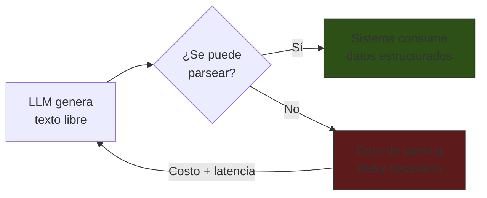
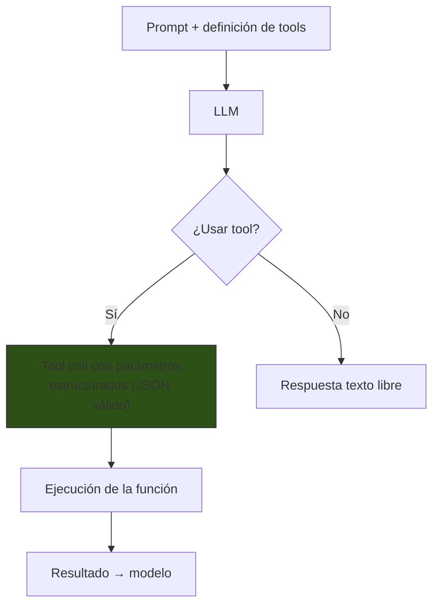
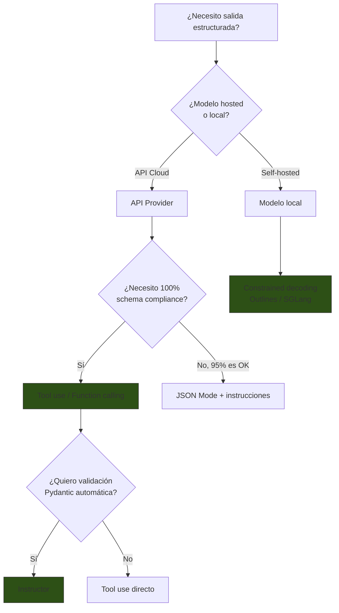

# Structured Output: Salida Estructurada de LLMs

> [!abstract] Resumen
> Obtener ==salida estructurada y parseable== de LLMs es esencial para sistemas de producción que consumen respuestas programáticamente. Las técnicas van desde simples instrucciones de formato hasta ==JSON mode nativo==, *function calling* / *tool use*, ==constrained decoding== (Outlines, LMQL), y bibliotecas como ==Instructor== que usan modelos Pydantic para validar salidas. Cada enfoque tiene trade-offs de fiabilidad, flexibilidad y soporte entre proveedores. ^resumen

---

## El problema

Los LLMs generan texto libre. Los sistemas de software necesitan datos estructurados. Este desajuste fundamental requiere técnicas para ==forzar al modelo a producir salida parseable==.



### Modos de fallo comunes

| Fallo | Ejemplo | Frecuencia |
|---|---|---|
| ==JSON inválido== | `{"key": "value"` (falta cierre) | Alta |
| Texto extra | `Aquí tienes: {"key": "value"}` | Alta |
| Campos faltantes | `{"name": "test"}` (falta "age") | Media |
| Tipos incorrectos | `{"count": "tres"}` en vez de `3` | Media |
| Formato mixto | Mezcla JSON con markdown | Baja |

---

## Técnica 1: Instrucciones de formato en el prompt

La forma más básica: pedirle al modelo que responda en un formato específico. Véase [[tecnicas-basicas]] para contexto.

```
Responde ÚNICAMENTE con un JSON válido. No incluyas texto adicional
antes o después del JSON. Estructura:

{
  "sentimiento": "positivo|negativo|neutral",
  "confianza": float entre 0 y 1,
  "entidades": ["lista", "de", "entidades"],
  "resumen": "resumen en una oración"
}
```

> [!warning] Fiabilidad limitada
> Con instrucciones de formato, la tasa de éxito típica es del ==85-95%==. El 5-15% restante requiere reintentos o post-procesamiento. Para producción, esto rara vez es suficiente.

### Mejoras al enfoque de instrucciones

| Mejora | Impacto | Ejemplo |
|---|---|---|
| ==Ejemplo completo== | +5-10% fiabilidad | Incluir un JSON de ejemplo |
| Delimitadores | +3-5% | "Responde entre ```json y ```" |
| Instrucción final | +2-3% | "Recuerda: SOLO JSON, nada más" |
| Temperature 0 | +2-3% | Reduce variabilidad |

---

## Técnica 2: JSON Mode nativo

Los proveedores principales ofrecen un modo JSON que ==garantiza que la salida sea JSON válido==.

### OpenAI JSON Mode

```python
from openai import OpenAI
client = OpenAI()

response = client.chat.completions.create(
    model="gpt-4o",
    response_format={"type": "json_object"},
    messages=[
        {"role": "system", "content": "Responde en JSON con campos: sentimiento, confianza, entidades"},
        {"role": "user", "content": "Analiza: 'Gran producto, lo recomiendo'"}
    ]
)
# Garantía: response.choices[0].message.content es JSON válido
```

### Anthropic (Claude) — JSON sin mode explícito

Claude no tiene un "JSON mode" separado, pero ofrece ==prefill de respuesta== para garantizar JSON:

```python
import anthropic
client = anthropic.Anthropic()

response = client.messages.create(
    model="claude-sonnet-4-20250514",
    messages=[
        {"role": "user", "content": "Analiza el sentimiento de: 'Gran producto'"},
        {"role": "assistant", "content": "{"}  # Prefill fuerza JSON
    ],
    system="Responde SOLO con JSON: {sentimiento, confianza, entidades}"
)
```

> [!tip] Prefill de Claude
> Al pre-rellenar la respuesta del asistente con `{`, Claude ==continúa generando JSON válido==. Es una técnica simple pero efectiva que aprovecha la naturaleza autoregresiva del modelo.

### Comparación de JSON modes

| Proveedor | Modo | Garantía de validez | Garantía de schema | Nota |
|---|---|---|---|---|
| OpenAI | `json_object` | ==Sí== | No | Solo garantiza JSON válido |
| OpenAI | `json_schema` | ==Sí== | ==Sí== | Schema completo enforced |
| Anthropic | Prefill + instrucción | Alto (no 100%) | No | Más flexible |
| Google | `application/json` | Sí | Parcial | Gemini response_mime_type |

---

## Técnica 3: Function Calling / Tool Use

*Function calling* (OpenAI) o *tool use* (Anthropic) es el enfoque más robusto para salida estructurada. Define funciones con schemas JSON y el modelo las "llama" con parámetros válidos[^1].



### Definición de herramienta como structured output

> [!example]- Ejemplo: usar tool use solo para obtener JSON estructurado
> ```python
> import anthropic
> client = anthropic.Anthropic()
>
> # Definir "herramienta" que en realidad es un schema de salida
> tools = [{
>     "name": "analisis_sentimiento",
>     "description": "Registra el resultado del análisis de sentimiento",
>     "input_schema": {
>         "type": "object",
>         "properties": {
>             "sentimiento": {
>                 "type": "string",
>                 "enum": ["positivo", "negativo", "neutral", "mixto"]
>             },
>             "confianza": {
>                 "type": "number",
>                 "minimum": 0,
>                 "maximum": 1
>             },
>             "entidades": {
>                 "type": "array",
>                 "items": {"type": "string"}
>             },
>             "resumen": {
>                 "type": "string",
>                 "maxLength": 200
>             }
>         },
>         "required": ["sentimiento", "confianza", "resumen"]
>     }
> }]
>
> response = client.messages.create(
>     model="claude-sonnet-4-20250514",
>     max_tokens=1024,
>     tools=tools,
>     tool_choice={"type": "tool", "name": "analisis_sentimiento"},
>     messages=[{
>         "role": "user",
>         "content": "Analiza: 'El producto es bueno pero el envío fue terrible'"
>     }]
> )
> # response.content[0].input es un dict con el schema garantizado
> ```

> [!success] Ventaja principal del tool use para structured output
> El modelo ==debe cumplir con el JSON Schema== de la herramienta. Los campos requeridos están presentes, los tipos son correctos, y los enums se respetan. Es la técnica más fiable para producción.

### Tool use en [[architect-overview|architect]]

En architect, cada herramienta (read_file, write_file, execute_command) tiene una ==tool description que es un prompt en sí misma==:

| Herramienta | Parámetros estructurados | Propósito del schema |
|---|---|---|
| `read_file` | `{path: string}` | Garantizar path válido |
| `write_file` | `{path: string, content: string}` | Garantizar contenido |
| `execute_command` | `{command: string, confirm: bool}` | ==Forzar confirmación== |
| `search_code` | `{pattern: string, glob: string}` | Filtrar búsquedas |

---

## Técnica 4: Constrained Decoding

*Constrained decoding* interviene a nivel del proceso de generación de tokens para ==garantizar que solo se generen tokens válidos== según una gramática definida[^2].

### Outlines

```python
import outlines

model = outlines.models.transformers("mistralai/Mistral-7B-v0.1")

# Definir schema con Pydantic
from pydantic import BaseModel

class Sentimiento(BaseModel):
    sentimiento: str  # Limitado por enum en el schema
    confianza: float
    resumen: str

generator = outlines.generate.json(model, Sentimiento)
result = generator("Analiza: 'Gran producto, lo recomiendo'")
# result es una instancia de Sentimiento, SIEMPRE válida
```

### LMQL

```python
import lmql

@lmql.query
def analyze(text):
    '''lmql
    "Analiza el sentimiento de: '{text}'"
    "Sentimiento: [SENT]" where SENT in ["positivo", "negativo", "neutral"]
    "Confianza: [CONF]" where CONF is float and 0 <= CONF <= 1
    return {"sentimiento": SENT, "confianza": CONF}
    '''
```

> [!info] Cuándo usar constrained decoding
> - Modelos locales / self-hosted donde tienes acceso al proceso de generación
> - Necesidad de ==garantía 100%== de formato válido
> - Schemas complejos con restricciones que tool use no puede expresar
> - No disponible con APIs de proveedores cloud (Claude, GPT-4)

### Comparación de herramientas de constrained decoding

| Herramienta | Modelos soportados | Enfoque | Rendimiento |
|---|---|---|---|
| ==Outlines== | HuggingFace, vLLM | ==JSON Schema / Pydantic== | ==Alto== |
| LMQL | HuggingFace, OpenAI | Lenguaje de query propio | Medio |
| Guidance (Microsoft) | HuggingFace, OpenAI | Templates con restricciones | Medio |
| SGLang | SGLang Runtime | Regex / JSON | Alto |

---

## Técnica 5: Instructor (Pydantic → Structured Output)

*Instructor* es una biblioteca que usa modelos Pydantic como schema y maneja ==validación, reintentos y coerción de tipos automáticamente==[^3].

```python
import instructor
from pydantic import BaseModel, Field
from openai import OpenAI

# Patchear el cliente
client = instructor.from_openai(OpenAI())

class AnalisisSentimiento(BaseModel):
    """Resultado del análisis de sentimiento."""
    sentimiento: str = Field(
        description="positivo, negativo, neutral o mixto"
    )
    confianza: float = Field(ge=0, le=1, description="Nivel de confianza")
    entidades: list[str] = Field(
        default_factory=list,
        description="Entidades mencionadas"
    )
    resumen: str = Field(
        max_length=200,
        description="Resumen en una oración"
    )

result = client.chat.completions.create(
    model="gpt-4o",
    response_model=AnalisisSentimiento,
    messages=[{
        "role": "user",
        "content": "Analiza: 'Buen producto pero caro'"
    }]
)
# result es un AnalisisSentimiento validado por Pydantic
```

> [!tip] Instructor con Claude
> ```python
> import instructor
> import anthropic
>
> client = instructor.from_anthropic(anthropic.Anthropic())
>
> result = client.messages.create(
>     model="claude-sonnet-4-20250514",
>     max_tokens=1024,
>     response_model=AnalisisSentimiento,
>     messages=[{"role": "user", "content": "Analiza: 'Producto excelente'"}]
> )
> ```

### Funcionalidades de Instructor

| Feature | Descripción | Beneficio |
|---|---|---|
| ==Validación Pydantic== | Valida la salida contra el modelo | Tipos correctos garantizados |
| Reintentos automáticos | Si falla validación, reintenta con contexto de error | ==Recuperación automática== |
| Streaming | Validación parcial durante generación | Respuestas más rápidas |
| Nested models | Modelos anidados complejos | Schemas jerárquicos |
| Union types | `str | int` para campos flexibles | Flexibilidad con validación |

> [!example]- Ejemplo avanzado: schema anidado con validación
> ```python
> from pydantic import BaseModel, Field, field_validator
> from typing import Optional
> from enum import Enum
>
> class Severidad(str, Enum):
>     CRITICA = "critica"
>     ALTA = "alta"
>     MEDIA = "media"
>     BAJA = "baja"
>
> class Vulnerabilidad(BaseModel):
>     titulo: str
>     severidad: Severidad
>     cwe_id: str = Field(pattern=r"^CWE-\d+$")
>     archivo: str
>     linea: int = Field(ge=1)
>     descripcion: str
>     remediacion: Optional[str] = None
>
>     @field_validator("cwe_id")
>     @classmethod
>     def validar_cwe(cls, v):
>         num = int(v.split("-")[1])
>         if num > 2000:
>             raise ValueError(f"CWE-{num} no es un ID válido conocido")
>         return v
>
> class ReporteSeguridad(BaseModel):
>     vulnerabilidades: list[Vulnerabilidad]
>     resumen: str
>     riesgo_general: Severidad
>     total_encontradas: int
>
>     @field_validator("total_encontradas")
>     @classmethod
>     def validar_total(cls, v, info):
>         if "vulnerabilidades" in info.data:
>             assert v == len(info.data["vulnerabilidades"])
>         return v
> ```

---

## Patrones XML de salida

Para modelos como Claude que manejan bien XML, usar ==etiquetas XML como formato de salida== puede ser más flexible que JSON:

```xml
<analysis>
  <sentiment>positivo</sentiment>
  <confidence>0.85</confidence>
  <entities>
    <entity type="product">iPhone</entity>
    <entity type="company">Apple</entity>
  </entities>
  <summary>Opinión favorable sobre el producto</summary>
</analysis>
```

> [!info] XML vs JSON para structured output
> | Aspecto | JSON | XML |
> |---|---|---|
> | Parsing | ==Nativo en todos los lenguajes== | Requiere parser XML |
> | Anidamiento | Bueno | ==Excelente== |
> | Atributos | No soporta | Soporta (`type="product"`) |
> | Validación | JSON Schema | XSD / DTD |
> | Soporte en Claude | Bueno | ==Nativo / optimizado== |
> | Soporte en GPT | ==Excelente (json_schema)== | Bueno |

---

## Cuándo usar cada enfoque



### Tabla resumen de decisión

| Enfoque | Fiabilidad | Complejidad | Costo extra | ==Mejor para== |
|---|---|---|---|---|
| Instrucciones de formato | 85-95% | Baja | Ninguno | Prototipos |
| JSON Mode | 99%+ | Baja | Ninguno | ==Producción simple== |
| Tool use / Function calling | ==99.9%+== | Media | Ninguno | ==Producción robusta== |
| Constrained decoding | 100% | Alta | Infra local | Modelos self-hosted |
| Instructor | ==99.9%+ con reintentos== | Media | Dependencia | ==Producción con Pydantic== |

---

## Relación con el ecosistema

- **[[intake-overview|intake]]**: intake genera especificaciones normalizadas que deben tener una ==estructura precisa y parseable==. Usa una combinación de instrucciones de formato en templates Jinja2 con post-procesamiento para garantizar que la especificación siga el schema esperado. Instructor sería una mejora natural para el pipeline de intake.

- **[[architect-overview|architect]]**: architect consume structured output de dos formas: (1) las ==tool calls del modelo son inherentemente estructuradas== (function calling), y (2) el agente `plan` produce un plan estructurado que el agente `build` debe parsear. Las tool descriptions son el mecanismo de structured output más crítico en architect.

- **[[vigil-overview|vigil]]**: vigil produce reportes deterministas con formato estructurado propio (no generado por LLM). Sin embargo, vigil podría ==validar la salida estructurada de otros sistemas== para detectar anomalías: un campo de severidad que siempre es "baja" podría indicar que el modelo está minimizando hallazgos.

- **[[licit-overview|licit]]**: el caso de uso más exigente de structured output en el ecosistema. Los análisis de compliance deben ser ==reproducibles y auditables==, lo que requiere schema estricto. licit probablemente se beneficiaría más de Instructor + tool use para garantizar que cada análisis tiene los campos requeridos para auditoría.

---

## Enlaces y referencias

> [!quote]- Bibliografía
> - [^1]: Anthropic (2024). *Tool Use (Function Calling) with Claude*. Documentación oficial.
> - [^2]: Willard, B. & Louf, R. (2023). *Efficient Guided Generation for Large Language Models*. Outlines: constrained decoding eficiente.
> - [^3]: Liu, J. (2024). *Instructor: Structured Outputs from LLMs*. Documentación y patrones avanzados.
> - OpenAI (2024). *Structured Outputs*. Documentación oficial de JSON Schema en respuestas.
> - Beurer-Kellner, L. et al. (2023). *Prompting Is Programming: A Query Language for Large Language Models*. LMQL paper.

[^1]: Anthropic (2024). *Tool Use (Function Calling) with Claude*.
[^2]: Willard, B. & Louf, R. (2023). *Efficient Guided Generation for Large Language Models*.
[^3]: Liu, J. (2024). *Instructor: Structured Outputs from LLMs*.
