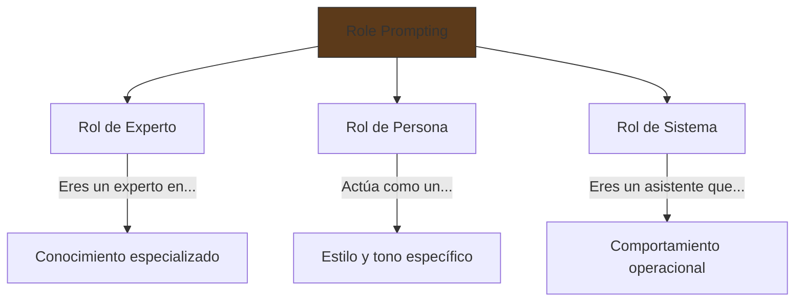

# Técnicas Básicas de Prompting

> [!abstract] Resumen
> Las técnicas básicas de prompting constituyen la base sobre la que se construyen todas las estrategias avanzadas. Incluyen ==zero-shot==, ==few-shot== (con sus variantes 1-shot, 3-shot y many-shot), ==role prompting==, uso de delimitadores, y especificación de formato de salida. Dominar estas técnicas es suficiente para el 70% de los casos de uso comunes y es requisito previo para comprender [[chain-of-thought]] y [[advanced-prompting]]. ^resumen

---

## Zero-shot prompting

*Zero-shot prompting* es la técnica más simple: dar una instrucción al modelo sin proporcionar ningún ejemplo de la tarea[^1]. El modelo debe inferir qué se espera únicamente a partir de la instrucción.

```
Clasifica el siguiente texto como positivo, negativo o neutral:

"El producto llegó a tiempo pero el empaque estaba dañado."

Clasificación:
```

> [!tip] Cuándo usar zero-shot
> - Tareas simples y bien definidas (clasificación, extracción, traducción)
> - Cuando el modelo ya ha sido entrenado extensivamente en la tarea
> - Cuando quieres rapidez y no necesitas máxima precisión
> - ==Prototipado rápido== antes de invertir en ejemplos

### Limitaciones del zero-shot

| Limitación | Descripción | Mitigación |
|---|---|---|
| Ambigüedad | El modelo interpreta la tarea de forma diferente a lo esperado | Instrucciones más específicas |
| Formato inconsistente | La salida varía entre ejecuciones | Especificar formato explícitamente |
| Tareas complejas | Rendimiento bajo en tareas de razonamiento | Usar [[chain-of-thought]] |
| Tareas especializadas | No conoce convenciones de dominio | Usar few-shot con ejemplos del dominio |

---

## Few-shot prompting

*Few-shot prompting* consiste en incluir ejemplos de la tarea en el prompt. El modelo aprende el patrón de los ejemplos y lo aplica a la nueva entrada[^1]. Es la técnica más versátil y frecuentemente la más efectiva.

### Variantes por cantidad de ejemplos

```mermaid
graph LR
    ZS[Zero-shot<br/>0 ejemplos] --> OS[One-shot<br/>1 ejemplo]
    OS --> FS[Few-shot<br/>2-5 ejemplos]
    FS --> MS[Many-shot<br/>10-100+ ejemplos]

    ZS --> |"Menos tokens"| COST[Menor costo]
    MS --> |"Más tokens"| ACC[Mayor precisión]

    style ZS fill:#5c1a1a,stroke:#333
    style OS fill:#5c3a1a,stroke:#333
    style FS fill:#2d5016,stroke:#333
    style MS fill:#1a3a5c,stroke:#333
```



### 1-shot (un ejemplo)

Proporciona un único ejemplo para establecer el patrón:

> [!example]- Ejemplo de 1-shot para extracción de entidades
> ```
> Extrae las entidades (persona, organización, lugar) del texto.
>
> Texto: "María García trabaja en Google desde que se mudó a Madrid."
> Entidades:
> - Persona: María García
> - Organización: Google
> - Lugar: Madrid
>
> Texto: "El CEO de Tesla, Elon Musk, anunció nuevas operaciones en Berlín."
> Entidades:
> ```

> [!tip] Cuándo 1-shot es suficiente
> Cuando la tarea tiene un ==formato de salida claro== y el modelo solo necesita ver la estructura una vez. Ideal para tareas de extracción y transformación.

### 3-shot (pocos ejemplos)

El estándar de facto. Tres ejemplos cubren variación suficiente sin consumir demasiados tokens:

> [!example]- Ejemplo de 3-shot para análisis de sentimiento con matices
> ```
> Analiza el sentimiento del review y clasifícalo como:
> POSITIVO, NEGATIVO, MIXTO, o NEUTRAL.
> Incluye una confianza (alta/media/baja).
>
> Review: "Excelente calidad, superó todas mis expectativas"
> Sentimiento: POSITIVO
> Confianza: alta
>
> Review: "Funciona bien pero es demasiado caro para lo que ofrece"
> Sentimiento: MIXTO
> Confianza: alta
>
> Review: "Llegó el paquete ayer"
> Sentimiento: NEUTRAL
> Confianza: media
>
> Review: "Después de tres meses de uso puedo decir que la batería
> dura menos de lo anunciado, aunque la pantalla es magnífica"
> Sentimiento:
> ```

### Many-shot (muchos ejemplos)

Con ventanas de contexto grandes (100K-1M tokens), es posible incluir docenas o cientos de ejemplos[^2]:

| Cantidad | Ventajas | Desventajas |
|---|---|---|
| 1-3 | Bajo costo, rápido | Poca cobertura de casos borde |
| 5-10 | Buena cobertura | Costo moderado |
| ==10-50== | ==Excelente precisión== | Costo alto, selección crítica |
| 50-100+ | Máxima precisión | Muy costoso, posible confusión |

> [!warning] Cuidado con many-shot
> Más ejemplos no siempre significa mejor resultado. Si los ejemplos contienen ==inconsistencias o errores==, el modelo los aprenderá. La calidad supera a la cantidad.

### Selección de ejemplos

La selección de ejemplos es tan importante como la cantidad:

> [!info] Criterios de selección
> 1. **Diversidad**: cubrir diferentes tipos de entradas
> 2. **Representatividad**: reflejar la distribución real de datos
> 3. **Casos borde**: incluir al menos un caso difícil
> 4. **Consistencia**: todos los ejemplos deben seguir exactamente el mismo formato
> 5. **Orden**: colocar el ejemplo más similar al caso objetivo al final (efecto *recency*)

---

## Role prompting

*Role prompting* asigna una identidad al modelo antes de la tarea. Esto activa conocimiento asociado a ese rol y ajusta el estilo de respuesta[^3].

```
Eres un ingeniero de seguridad senior con 15 años de experiencia
en pentesting de aplicaciones web. Analiza el siguiente código
y reporta vulnerabilidades siguiendo el formato OWASP.
```

### Patrones de role prompting



| Tipo | Uso principal | Ejemplo |
|---|---|---|
| ==Experto técnico== | Obtener respuestas especializadas | "Eres un DBA PostgreSQL senior" |
| Crítico/Revisor | Obtener análisis exhaustivo | "Eres un code reviewer exigente" |
| Profesor | Obtener explicaciones claras | "Explícame como a un estudiante de primer año" |
| Sistema | Definir comportamiento operacional | "Eres un asistente de clasificación de tickets" |

> [!warning] Limitaciones del role prompting
> El role prompting ==no otorga conocimiento que el modelo no tiene==. Si el modelo no fue entrenado con datos de un dominio, asignarle el rol de experto en ese dominio no lo hará más preciso — solo más confiado. Esto puede incrementar las alucinaciones.

### Combinación con [[system-prompts]]

En producción, el *role prompting* se implementa dentro del *system prompt*. Es la primera sección que define [[architect-overview|architect]] para cada uno de sus agentes:

- Agente `plan`: "Eres un analista de software senior..."
- Agente `build`: "Eres un desarrollador de software experto..."
- Agente `review`: "Eres un auditor de código riguroso..."

---

## Instrucciones de formato

Especificar explícitamente el formato de salida es una de las técnicas más efectivas y subestimadas:

### Formatos comunes

```markdown
Responde ÚNICAMENTE con un JSON válido con esta estructura:
{
  "clasificacion": "positivo|negativo|neutral",
  "confianza": 0.0-1.0,
  "justificacion": "breve explicación"
}
```

> [!success] Regla de oro
> ==Cuanto más explícita sea la especificación de formato, más consistente será la salida.== Incluir un ejemplo del formato esperado reduce drásticamente la variabilidad.

### Tabla de formatos y cuándo usarlos

| Formato | Mejor para | Parseo | Ejemplo de uso |
|---|---|---|---|
| ==JSON== | ==Integración con código== | Fácil (nativo) | APIs, pipelines |
| Markdown | Documentación, reportes | Medio | Contenido legible |
| XML | Datos estructurados complejos | Fácil | [[intake-overview\|intake]] templates |
| CSV | Datos tabulares simples | Fácil | Exportación de datos |
| YAML | Configuración | Medio | Metadatos |
| Texto libre | Respuestas conversacionales | Difícil | Chatbots |

Véase [[structured-output]] para técnicas avanzadas de control de formato.

---

## Delimitadores

Los delimitadores (*delimiters*) son marcadores que separan secciones del prompt. Son esenciales para evitar ambigüedades y para prevenir [[prompt-injection|inyección de prompts]].

### Tipos de delimitadores

#### Etiquetas XML

```xml
<instrucciones>
Analiza el código y encuentra bugs.
</instrucciones>

<codigo>
def divide(a, b):
    return a / b
</codigo>

<formato_salida>
Lista de bugs encontrados con severidad.
</formato_salida>
```

> [!tip] XML es el delimitador preferido por Claude
> Los modelos de Anthropic están ==específicamente optimizados== para interpretar etiquetas XML como delimitadores de sección. Es la recomendación oficial para prompts complejos. Véase [[mega-prompts]] para su uso extensivo.

#### Triple backticks

````
Corrige los errores en el siguiente código:

```python
def fibonacci(n):
    if n <= 1:
        return n
    return fibonacci(n-1) + fibonacci(n-2)
```

Devuelve el código corregido con optimización de memoización.
````

#### Headers Markdown

```markdown
# Instrucción
Resume el siguiente artículo.

# Artículo
[contenido del artículo aquí]

# Formato de respuesta
Un resumen de máximo 3 párrafos.
```

### Comparación de delimitadores

| Delimitador | Claridad | Anidamiento | Soporte en Claude | Soporte en GPT |
|---|---|---|---|---|
| ==XML tags== | ==Excelente== | ==Sí== | ==Nativo== | Bueno |
| Triple backticks | Buena | Limitado | Bueno | Bueno |
| Markdown headers | Buena | No | Bueno | Bueno |
| `---` separadores | Media | No | Medio | Medio |
| `"""` triple comillas | Media | No | Medio | Bueno |

> [!danger] Sin delimitadores = riesgo de inyección
> Sin delimitadores claros, el contenido del usuario puede ==confundirse con instrucciones del sistema==. Esto es la base de los ataques de [[prompt-injection|prompt injection]].
>
> ```
> # MAL: sin delimitadores
> Resume este texto: [texto del usuario que puede contener instrucciones]
>
> # BIEN: con delimitadores
> Resume el texto contenido entre las etiquetas <texto>:
> <texto>
> [texto del usuario]
> </texto>
> ```

---

## Combinación de técnicas

Las técnicas básicas rara vez se usan de forma aislada. La combinación estratégica produce mejores resultados:

```mermaid
graph TD
    ROLE[Role Prompting] --> COMBO[Prompt combinado]
    FEW[Few-shot Examples] --> COMBO
    FORMAT[Formato de salida] --> COMBO
    DELIM[Delimitadores XML] --> COMBO
    COMBO --> OUTPUT[Salida predecible y de calidad]

    style COMBO fill:#2d5016,stroke:#333
    style OUTPUT fill:#1a3a5c,stroke:#333
```



> [!example]- Ejemplo completo combinando todas las técnicas
> ```xml
> <system>
> Eres un experto en clasificación de tickets de soporte técnico
> con 10 años de experiencia en empresas SaaS.
> </system>
>
> <instrucciones>
> Clasifica el ticket del usuario en una de las siguientes categorías:
> BUG, FEATURE_REQUEST, QUESTION, BILLING, OTHER
>
> Asigna una prioridad: CRITICAL, HIGH, MEDIUM, LOW
> </instrucciones>
>
> <ejemplos>
> Ticket: "La aplicación se cierra cuando hago clic en exportar"
> Clasificación: BUG
> Prioridad: HIGH
>
> Ticket: "¿Cómo puedo cambiar mi contraseña?"
> Clasificación: QUESTION
> Prioridad: LOW
>
> Ticket: "Sería genial tener integración con Slack"
> Clasificación: FEATURE_REQUEST
> Prioridad: MEDIUM
> </ejemplos>
>
> <formato_salida>
> Responde SOLO con JSON:
> {"clasificacion": "...", "prioridad": "...", "razon": "..."}
> </formato_salida>
>
> <ticket>
> {{ticket_del_usuario}}
> </ticket>
> ```

---

## Cuándo cada técnica es suficiente

> [!question] ¿Necesito técnicas avanzadas?
> Antes de saltar a [[chain-of-thought]] o [[advanced-prompting]], verifica si las técnicas básicas resuelven tu problema. La complejidad innecesaria aumenta costos y latencia.

| Escenario | Técnica suficiente | Por qué |
|---|---|---|
| Clasificación binaria | ==Zero-shot + formato== | Tarea simple, bien definida |
| Extracción de entidades | 1-shot + delimitadores | Un ejemplo establece el patrón |
| Análisis de sentimiento matizado | 3-shot + role | Necesita ver variaciones |
| Generación de código simple | Role + formato + delimitadores | El rol activa conocimiento técnico |
| Traducción especializada | Few-shot con terminología | Ejemplos enseñan vocabulario del dominio |
| Razonamiento matemático | **Insuficiente** → usar [[chain-of-thought]] | Requiere pasos intermedios |
| Tarea multi-paso | **Insuficiente** → usar [[advanced-prompting]] | Requiere descomposición |

---

## Relación con el ecosistema

- **[[intake-overview|intake]]**: los templates Jinja2 de intake implementan ==few-shot dinámico==: seleccionan ejemplos de especificaciones previas similares al requisito actual. Los delimitadores XML son fundamentales en estos templates para separar instrucciones de contenido variable.

- **[[architect-overview|architect]]**: los *system prompts* de architect combinan *role prompting* (cada agente tiene un rol definido) con ==instrucciones de formato explícitas== para las herramientas. Las descripciones de tools son esencialmente prompts zero-shot que deben ser claros sin ejemplos.

- **[[vigil-overview|vigil]]**: vigil no usa LLM, pero su relevancia aquí es en la ==detección de delimitadores rotos== o manipulados. Un delimitador mal cerrado en un prompt puede ser explotado para inyección.

- **[[licit-overview|licit]]**: usa *few-shot* con ejemplos de análisis de cumplimiento previos para mantener consistencia en evaluaciones. El formato de salida estructurado ([[structured-output]]) es crítico para que los reportes de compliance sean parseables.

---

## Errores comunes

> [!failure] Antipatrones frecuentes
> 1. **Instrucciones vagas**: "Analiza esto bien" → ¿qué significa "bien"?
> 2. **Ejemplos inconsistentes**: diferentes formatos entre ejemplos
> 3. **Demasiada información**: sobrecargar el prompt reduce la atención a instrucciones clave
> 4. **Ausencia de formato**: no especificar estructura de salida
> 5. **Role prompting excesivo**: "Eres el mejor experto mundial..." → innecesario y consume tokens

---

## Enlaces y referencias

> [!quote]- Bibliografía
> - [^1]: Brown, T. et al. (2020). *Language Models are Few-Shot Learners*. NeurIPS. Demostración original de capacidades zero-shot y few-shot en GPT-3.
> - [^2]: Agarwal, R. et al. (2024). *Many-Shot In-Context Learning*. Google DeepMind. Exploración de cómo escalar los ejemplos in-context con ventanas largas.
> - [^3]: Zheng, H. et al. (2023). *Is "A Helpful Assistant" the Best Role for LLMs? A Systematic Evaluation of LLM Role-Playing*. Evaluación rigurosa de la efectividad del role prompting.
> - Anthropic (2024). *Prompt Engineering Guide: Give Examples*. Documentación oficial de Claude.
> - OpenAI (2024). *Prompt Engineering: Strategy — Provide Reference Text*. Documentación oficial.

[^1]: Brown, T. et al. (2020). *Language Models are Few-Shot Learners*. NeurIPS 2020.
[^2]: Agarwal, R. et al. (2024). *Many-Shot In-Context Learning*. Google DeepMind.
[^3]: Zheng, H. et al. (2023). *Is "A Helpful Assistant" the Best Role for LLMs?*
