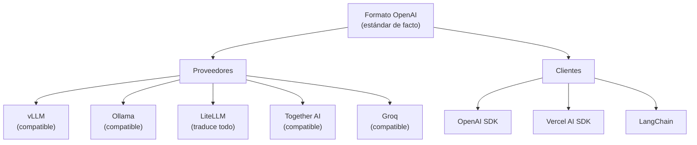

# Panorama de SDKs para Integración de IA

> [!abstract] Resumen
> Los SDKs de IA son la interfaz directa entre tu código y los modelos de lenguaje. Los principales son: ==OpenAI SDK== (el estándar de facto), ==Anthropic SDK== (messages API con tool use nativo), ==Vercel AI SDK== (React hooks y streaming UI), y SDKs de cloud providers (AWS, Azure). Este documento compara la ==experiencia de desarrollador (DX)==, patrones comunes y criterios de selección. La tendencia del ecosistema es hacia ==APIs compatibles con el formato OpenAI==, permitiendo intercambiar proveedores sin cambiar SDKs.
> ^resumen

---

## OpenAI SDK

### Python

El SDK de OpenAI para Python es el más usado y el formato que la industria ha adoptado como estándar:

```python
from openai import OpenAI

client = OpenAI()  # Lee OPENAI_API_KEY del environment

# Chat completion básico
response = client.chat.completions.create(
    model="gpt-4o",
    messages=[
        {"role": "system", "content": "Eres un asistente experto."},
        {"role": "user", "content": "Explica microservicios"}
    ],
    temperature=0.1,
    max_tokens=500
)

print(response.choices[0].message.content)
print(f"Tokens: {response.usage.total_tokens}")
```

### Streaming

```python
# Streaming token a token
stream = client.chat.completions.create(
    model="gpt-4o",
    messages=messages,
    stream=True
)

for chunk in stream:
    if chunk.choices[0].delta.content:
        print(chunk.choices[0].delta.content, end="", flush=True)
```

### Function calling

> [!example]- Function calling completo con OpenAI
> ```python
> import json
>
> tools = [
>     {
>         "type": "function",
>         "function": {
>             "name": "get_weather",
>             "description": "Obtiene el clima actual de una ciudad",
>             "parameters": {
>                 "type": "object",
>                 "properties": {
>                     "city": {
>                         "type": "string",
>                         "description": "Nombre de la ciudad"
>                     },
>                     "units": {
>                         "type": "string",
>                         "enum": ["celsius", "fahrenheit"],
>                         "description": "Unidades de temperatura"
>                     }
>                 },
>                 "required": ["city"]
>             }
>         }
>     }
> ]
>
> # Primera llamada: el modelo decide si usar tools
> response = client.chat.completions.create(
>     model="gpt-4o",
>     messages=[{"role": "user", "content": "¿Qué clima hace en Madrid?"}],
>     tools=tools,
>     tool_choice="auto"
> )
>
> # Si hay tool_calls, ejecutar y enviar resultado
> message = response.choices[0].message
> if message.tool_calls:
>     tool_call = message.tool_calls[0]
>     args = json.loads(tool_call.function.arguments)
>
>     # Ejecutar la función real
>     weather = get_weather(args["city"], args.get("units", "celsius"))
>
>     # Segunda llamada con el resultado
>     response = client.chat.completions.create(
>         model="gpt-4o",
>         messages=[
>             {"role": "user", "content": "¿Qué clima hace en Madrid?"},
>             message,  # Assistant message con tool_call
>             {
>                 "role": "tool",
>                 "tool_call_id": tool_call.id,
>                 "content": json.dumps(weather)
>             }
>         ],
>         tools=tools
>     )
>
> print(response.choices[0].message.content)
> ```

### Structured Output

```python
from pydantic import BaseModel

class MovieReview(BaseModel):
    title: str
    rating: float
    pros: list[str]
    cons: list[str]

response = client.beta.chat.completions.parse(
    model="gpt-4o",
    messages=[{"role": "user", "content": "Review de Inception"}],
    response_format=MovieReview
)

review = response.choices[0].message.parsed
print(f"{review.title}: {review.rating}/10")
```

> [!success] OpenAI SDK como formato universal
> El formato de la API de OpenAI se ha convertido en ==el estándar de facto==. [[llm-routers|LiteLLM]], [[model-serving|vLLM]], Ollama, y muchos otros exponen APIs ==compatibles con OpenAI SDK==. Esto significa que puedes usar el mismo código con proveedores completamente diferentes.

### Node.js

```typescript
import OpenAI from "openai";

const openai = new OpenAI();

const response = await openai.chat.completions.create({
  model: "gpt-4o",
  messages: [{ role: "user", content: "Hola" }],
  stream: true,
});

for await (const chunk of response) {
  process.stdout.write(chunk.choices[0]?.delta?.content || "");
}
```

---

## Anthropic SDK

### Messages API

```python
from anthropic import Anthropic

client = Anthropic()  # Lee ANTHROPIC_API_KEY

message = client.messages.create(
    model="claude-sonnet-4-20250514",
    max_tokens=1024,
    system="Eres un experto en arquitectura de software.",
    messages=[
        {"role": "user", "content": "Explica event sourcing"}
    ]
)

print(message.content[0].text)
print(f"Tokens input: {message.usage.input_tokens}")
print(f"Tokens output: {message.usage.output_tokens}")
```

### Streaming

```python
with client.messages.stream(
    model="claude-sonnet-4-20250514",
    max_tokens=1024,
    messages=[{"role": "user", "content": "Escribe un haiku"}]
) as stream:
    for text in stream.text_stream:
        print(text, end="", flush=True)
```

### Tool use nativo

> [!example]- Tool use con Anthropic SDK
> ```python
> import json
>
> response = client.messages.create(
>     model="claude-sonnet-4-20250514",
>     max_tokens=1024,
>     tools=[
>         {
>             "name": "get_stock_price",
>             "description": "Obtiene el precio actual de una acción",
>             "input_schema": {
>                 "type": "object",
>                 "properties": {
>                     "symbol": {
>                         "type": "string",
>                         "description": "Símbolo de la acción (e.g., AAPL)"
>                     }
>                 },
>                 "required": ["symbol"]
>             }
>         }
>     ],
>     messages=[
>         {"role": "user", "content": "¿Cuánto vale Apple ahora?"}
>     ]
> )
>
> # Procesar tool use
> for block in response.content:
>     if block.type == "tool_use":
>         # Ejecutar herramienta
>         result = get_stock_price(block.input["symbol"])
>
>         # Continuar conversación con resultado
>         followup = client.messages.create(
>             model="claude-sonnet-4-20250514",
>             max_tokens=1024,
>             tools=tools,
>             messages=[
>                 {"role": "user", "content": "¿Cuánto vale Apple ahora?"},
>                 {"role": "assistant", "content": response.content},
>                 {
>                     "role": "user",
>                     "content": [{
>                         "type": "tool_result",
>                         "tool_use_id": block.id,
>                         "content": json.dumps(result)
>                     }]
>                 }
>             ]
>         )
> ```

### Prompt caching

> [!tip] Prompt caching de Anthropic
> Anthropic ofrece ==caché de prompts a nivel de API==, reduciendo costos y latencia para system prompts largos:
> ```python
> response = client.messages.create(
>     model="claude-sonnet-4-20250514",
>     max_tokens=1024,
>     system=[{
>         "type": "text",
>         "text": "System prompt muy largo con instrucciones detalladas...",
>         "cache_control": {"type": "ephemeral"}  # Cachear este bloque
>     }],
>     messages=[{"role": "user", "content": "Pregunta"}]
> )
> # Segunda llamada: el system prompt se lee de caché (90% más barato)
> ```

### Diferencias clave vs OpenAI SDK

| Aspecto | OpenAI SDK | Anthropic SDK |
|---------|-----------|---------------|
| System message | En array de messages | ==Parámetro separado== |
| Tool format | `tools[].function` | `tools[].input_schema` |
| Tool response | `role: "tool"` | `role: "user"` con `tool_result` |
| Streaming | Iterator de chunks | ==Context manager== `.stream()` |
| Structured output | `response_format` | Tool use con schema |
| ==Prompt caching== | No nativo | ==Sí (`cache_control`)== |
| Batch API | Sí | ==Sí (Message Batches)== |
| Content blocks | Solo text | ==Array de blocks== (text, image, tool_use) |

> [!info] Convergencia de APIs
> A pesar de las diferencias, las APIs están ==convergiendo==. Ambas soportan tool use, streaming, y structured output. [[llm-routers|LiteLLM]] abstrae las diferencias, permitiendo usar cualquier SDK con cualquier proveedor.

---

## Vercel AI SDK

*Vercel AI SDK* está diseñado para ==aplicaciones web con React==:

### Core: `ai` package

```typescript
import { generateText, streamText } from "ai";
import { openai } from "@ai-sdk/openai";
import { anthropic } from "@ai-sdk/anthropic";

// Generación simple
const { text } = await generateText({
  model: openai("gpt-4o"),
  prompt: "Explica microservicios en una frase",
});

// Streaming
const result = streamText({
  model: anthropic("claude-sonnet-4-20250514"),
  messages: [{ role: "user", content: "Escribe un poema" }],
});

for await (const chunk of result.textStream) {
  process.stdout.write(chunk);
}
```

### React hooks: `ai/react`

```tsx
"use client";
import { useChat } from "ai/react";

export function ChatComponent() {
  const { messages, input, handleInputChange, handleSubmit, isLoading } =
    useChat({
      api: "/api/chat",
    });

  return (
    <div>
      {messages.map((m) => (
        <div key={m.id}>
          <strong>{m.role}:</strong> {m.content}
        </div>
      ))}

      <form onSubmit={handleSubmit}>
        <input
          value={input}
          onChange={handleInputChange}
          placeholder="Escribe tu mensaje..."
          disabled={isLoading}
        />
      </form>
    </div>
  );
}
```

### Server route

```typescript
// app/api/chat/route.ts
import { streamText } from "ai";
import { openai } from "@ai-sdk/openai";

export async function POST(req: Request) {
  const { messages } = await req.json();

  const result = streamText({
    model: openai("gpt-4o"),
    messages,
  });

  return result.toDataStreamResponse();
}
```

> [!success] Vercel AI SDK para web apps
> Si construyes una ==aplicación web con Next.js/React==, Vercel AI SDK es la mejor opción:
> - `useChat` maneja todo el estado del chat
> - Streaming automático desde server a client
> - ==Tool calling con UI rendering==
> - Soporte multi-provider (OpenAI, Anthropic, Google, etc.)

### Tool calling en UI

```typescript
import { tool } from "ai";
import { z } from "zod";

const result = streamText({
  model: openai("gpt-4o"),
  messages,
  tools: {
    getWeather: tool({
      description: "Get weather for a city",
      parameters: z.object({
        city: z.string(),
      }),
      execute: async ({ city }) => {
        const weather = await fetchWeather(city);
        return weather;
      },
    }),
  },
});
```

### Middleware

```typescript
import { wrapLanguageModel } from "ai";

// Middleware para logging, caching, etc.
const wrappedModel = wrapLanguageModel({
  model: openai("gpt-4o"),
  middleware: {
    transformParams: async ({ params }) => {
      console.log("Input:", params.prompt);
      return params;
    },
    wrapGenerate: async ({ doGenerate, params }) => {
      const result = await doGenerate();
      console.log("Output:", result.text);
      return result;
    },
  },
});
```

---

## AWS SDK para Bedrock

```python
import boto3

client = boto3.client("bedrock-runtime", region_name="us-east-1")

# Converse API — unificada para todos los modelos
response = client.converse(
    modelId="anthropic.claude-3-5-sonnet-20241022-v2:0",
    messages=[{
        "role": "user",
        "content": [{"text": "Explica serverless AI"}]
    }],
    inferenceConfig={
        "maxTokens": 500,
        "temperature": 0.1
    }
)

print(response["output"]["message"]["content"][0]["text"])
```

> [!info] Converse API vs InvokeModel
> Bedrock tiene dos APIs: `InvokeModel` (formato específico por modelo) y `Converse` (==formato unificado==). Siempre usa Converse para nuevos proyectos — abstrae las diferencias entre modelos. Ver [[serverless-ai]] para detalles de Bedrock.

---

## Comparación de DX (Developer Experience)

| Criterio | OpenAI SDK | Anthropic SDK | Vercel AI SDK | AWS Bedrock |
|----------|-----------|---------------|---------------|-------------|
| Setup | ==1 línea== | 1 línea | 2-3 líneas | 5+ líneas |
| Tipado | ==Excelente== | Excelente | ==Excelente (Zod)== | Medio |
| Streaming | Iterator | Context manager | ==React hooks== | AsyncIterator |
| Documentación | ==Excelente== | Muy buena | Buena | Media |
| Ejemplos | ==Abundantes== | Buenos | Buenos | Limitados |
| Multi-provider | No (solo OpenAI) | No (solo Anthropic) | ==Sí== | Sí (Bedrock models) |
| Framework integration | Genérico | Genérico | ==Next.js/React== | AWS Lambda |
| Error handling | Claro | ==Muy claro== | Claro | Verbose |
| Async nativo | Sí | Sí | ==Sí== | Sí |
| Tamaño del paquete | Pequeño | ==Pequeño== | Medio | Grande (boto3) |

---

## Patrones comunes entre SDKs

### Patrón: Retry con backoff

```python
# Todos los SDKs modernos incluyen retries automáticos
from openai import OpenAI

client = OpenAI(
    max_retries=3,      # Reintentos automáticos
    timeout=30.0        # Timeout en segundos
)
```

### Patrón: Multi-provider con type hints

```python
from typing import Protocol

class LLMClient(Protocol):
    """Interfaz común para cualquier proveedor."""
    async def generate(self, prompt: str, **kwargs) -> str: ...
    async def stream(self, prompt: str, **kwargs): ...

class OpenAIClient:
    def __init__(self):
        self.client = OpenAI()

    async def generate(self, prompt: str, **kwargs) -> str:
        response = await self.client.chat.completions.create(
            model=kwargs.get("model", "gpt-4o"),
            messages=[{"role": "user", "content": prompt}]
        )
        return response.choices[0].message.content

class AnthropicClient:
    def __init__(self):
        self.client = Anthropic()

    async def generate(self, prompt: str, **kwargs) -> str:
        message = await self.client.messages.create(
            model=kwargs.get("model", "claude-sonnet-4-20250514"),
            max_tokens=1024,
            messages=[{"role": "user", "content": prompt}]
        )
        return message.content[0].text
```

> [!question] ¿SDK directo o abstracción?
> | Situación | Recomendación |
> |-----------|--------------|
> | Un solo proveedor, para siempre | ==SDK directo== |
> | Múltiples proveedores o cambio futuro | ==LiteLLM== |
> | Aplicación web con React | ==Vercel AI SDK== |
> | Framework de agentes | ==LangChain/LangGraph== |
> | Optimización de prompts | ==DSPy== |

---

## Tendencias del ecosistema

### Convergencia hacia formato OpenAI



> [!tip] Implicación práctica
> Si diseñas tu API ==compatible con el formato de OpenAI== (como recomienda [[api-design-ai-apps]]), ==todos estos SDKs y herramientas funcionan automáticamente== con tu servicio. Es la decisión de compatibilidad más impactante que puedes tomar.

### Structured output como estándar

Todos los SDKs convergen hacia soporte nativo de salidas estructuradas:

| SDK | Mecanismo | Madurez |
|-----|-----------|---------|
| OpenAI | ==`response_format` + JSON schema== | Estable |
| Anthropic | Tool use con schema | Estable |
| Vercel | ==Zod schemas== | Estable |
| LiteLLM | Traduce al nativo de cada proveedor | Estable |

---

## Relación con el ecosistema

Los SDKs son la capa de contacto directo con proveedores de IA:

- **[[intake-overview|Intake]]** — no usa SDKs directamente. Accede a LLMs vía [[llm-routers|LiteLLM]] que ==abstrae las diferencias entre SDKs==. Esto permite a Intake ser provider-agnostic sin mantener integración con múltiples SDKs
- **[[architect-overview|Architect]]** — igualmente usa LiteLLM como abstracción. Sin embargo, las capacidades específicas de cada SDK (como prompt caching de Anthropic) pueden aprovecharse ==configurando el proveedor adecuado== vía parámetros de LiteLLM
- **[[vigil-overview|Vigil]]** — no usa SDKs de IA. Opera determinísticamente
- **[[licit-overview|Licit]]** — no usa SDKs de IA directamente. Consume output de los otros agentes

> [!info] La capa de abstracción importa
> El ecosistema eligió ==LiteLLM como capa de abstracción== en lugar de integrar SDKs directamente. Esto es una decisión deliberada: un cambio de SDK (breaking change de OpenAI, nueva API de Anthropic) ==no afecta al código de los agentes==, solo requiere actualizar LiteLLM.

---

## Enlaces y referencias

> [!quote]- Bibliografía y recursos
> - [^1]: OpenAI Python SDK — https://github.com/openai/openai-python
> - [^2]: Anthropic Python SDK — https://github.com/anthropics/anthropic-sdk-python
> - [^3]: Vercel AI SDK — https://sdk.vercel.ai
> - AWS Bedrock SDK — https://docs.aws.amazon.com/bedrock/
> - Abstracción multi-provider: [[llm-routers]]
> - Diseño de APIs: [[api-design-ai-apps]]
> - Frameworks completos: [[langchain-deep-dive]], [[dspy]]

[^1]: El SDK de OpenAI para Python incluye retries automáticos, tipado completo, y soporte para streaming, function calling, y structured output.
[^2]: El SDK de Anthropic introduce prompt caching y Message Batches como funcionalidades únicas no disponibles en otros SDKs.
[^3]: Vercel AI SDK es el único SDK diseñado específicamente para aplicaciones web con React, ofreciendo hooks y streaming UI out-of-the-box.
