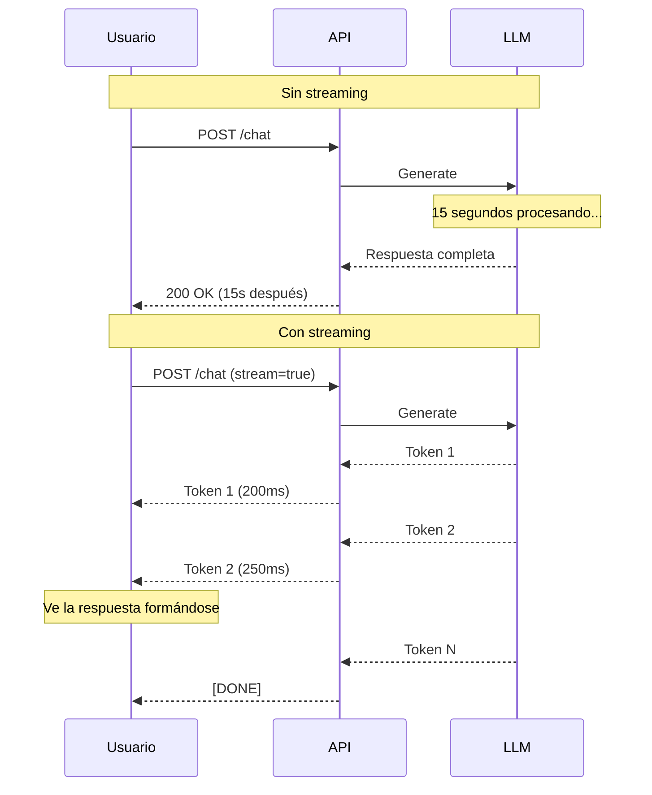
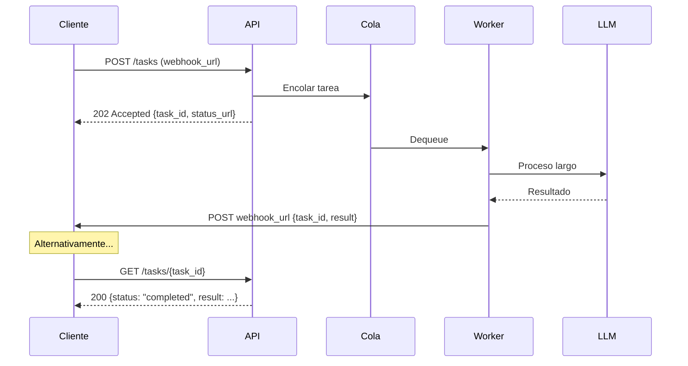
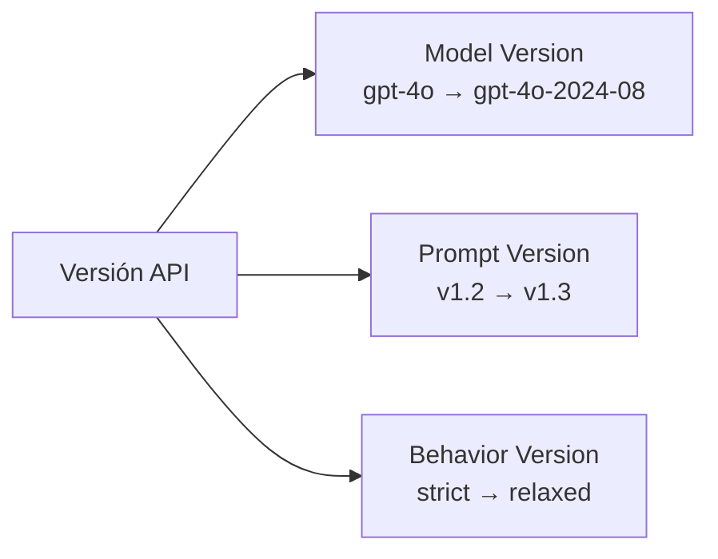

# Diseño de APIs para Aplicaciones de IA

> [!abstract] Resumen
> Las APIs de aplicaciones de IA tienen requerimientos únicos que las APIs REST tradicionales no contemplan: ==streaming de tokens, procesamiento asíncrono largo, rate limiting por tokens, versionado de comportamiento del modelo==, y manejo de errores específicos (alucinaciones, políticas de contenido). Este documento cubre los patrones de diseño esenciales para construir APIs que expongan capacidades de IA de forma robusta.
> ^resumen

---

## Streaming endpoints

### El problema

Las llamadas a LLMs pueden tardar ==5-60 segundos== en completarse. Sin streaming, el usuario espera sin feedback hasta que la respuesta completa llega:



### SSE (Server-Sent Events)

El estándar de facto para streaming de LLMs:

> [!example]- Endpoint SSE con FastAPI
> ```python
> from fastapi import FastAPI
> from fastapi.responses import StreamingResponse
> from typing import AsyncGenerator
> import json
>
> app = FastAPI()
>
> async def stream_llm_response(
>     messages: list[dict],
>     model: str
> ) -> AsyncGenerator[str, None]:
>     """Genera eventos SSE desde la respuesta del LLM."""
>     async for chunk in llm.astream(model=model, messages=messages):
>         event_data = {
>             "id": chunk.id,
>             "object": "chat.completion.chunk",
>             "model": model,
>             "choices": [{
>                 "index": 0,
>                 "delta": {"content": chunk.content},
>                 "finish_reason": chunk.finish_reason
>             }]
>         }
>         yield f"data: {json.dumps(event_data)}\n\n"
>
>     yield "data: [DONE]\n\n"
>
> @app.post("/v1/chat/completions")
> async def chat_completions(request: ChatRequest):
>     if request.stream:
>         return StreamingResponse(
>             stream_llm_response(request.messages, request.model),
>             media_type="text/event-stream",
>             headers={
>                 "Cache-Control": "no-cache",
>                 "Connection": "keep-alive",
>                 "X-Accel-Buffering": "no"  # Disable nginx buffering
>             }
>         )
>     else:
>         response = await llm.ainvoke(
>             model=request.model,
>             messages=request.messages
>         )
>         return response
> ```

> [!warning] Proxy buffering
> NGINX, CloudFront y otros proxies ==bufferean respuestas por defecto==. Esto acumula tokens y los envía en ráfagas, destruyendo la experiencia de streaming. Configura:
> ```nginx
> # nginx.conf
> proxy_buffering off;
> proxy_cache off;
> proxy_set_header X-Accel-Buffering no;
> ```

### WebSocket

Alternativa a SSE para comunicación bidireccional:

```python
@app.websocket("/ws/chat")
async def websocket_chat(websocket: WebSocket):
    await websocket.accept()

    while True:
        data = await websocket.receive_json()

        async for chunk in llm.astream(
            model=data["model"],
            messages=data["messages"]
        ):
            await websocket.send_json({
                "type": "token",
                "content": chunk.content
            })

        await websocket.send_json({"type": "done"})
```

### Comparativa de transporte

| Criterio | SSE | WebSocket | Chunked Transfer |
|----------|-----|-----------|-----------------|
| Dirección | Server → Client | ==Bidireccional== | Server → Client |
| Protocolo | HTTP/1.1+ | TCP upgrade | HTTP/1.1+ |
| Reconexión | ==Automática== | Manual | N/A |
| Compatibilidad | ==Excelente== | Buena | Excelente |
| Proxies | Requiere config | Requiere config | ==Funciona por defecto== |
| Uso típico | ==Streaming de tokens== | Chat interactivo | Descargas |

> [!tip] SSE como estándar de la industria
> La API de OpenAI, Anthropic y la mayoría de proveedores usan ==SSE para streaming==. Seguir este patrón facilita la integración con SDKs existentes y herramientas como [[llm-routers|LiteLLM]] y [[ai-sdk-landscape|Vercel AI SDK]].

---

## Webhook patterns para procesamiento asíncrono

Para tareas que tardan más de lo que un timeout HTTP permite (>30s):



### Implementación

> [!example]- Patrón async con webhook
> ```python
> from fastapi import FastAPI, BackgroundTasks
> from pydantic import BaseModel, HttpUrl
> import httpx
>
> class AsyncTaskRequest(BaseModel):
>     messages: list[dict]
>     model: str = "gpt-4o"
>     webhook_url: HttpUrl | None = None
>
> class TaskResponse(BaseModel):
>     task_id: str
>     status: str
>     status_url: str
>
> @app.post("/v1/tasks", response_model=TaskResponse, status_code=202)
> async def create_task(
>     request: AsyncTaskRequest,
>     background_tasks: BackgroundTasks
> ):
>     task_id = generate_task_id()
>
>     # Guardar tarea en BD
>     await db.tasks.insert({
>         "id": task_id,
>         "status": "pending",
>         "request": request.dict()
>     })
>
>     # Procesar en background
>     background_tasks.add_task(
>         process_task, task_id, request
>     )
>
>     return TaskResponse(
>         task_id=task_id,
>         status="pending",
>         status_url=f"/v1/tasks/{task_id}"
>     )
>
> async def process_task(task_id: str, request: AsyncTaskRequest):
>     try:
>         result = await llm.ainvoke(
>             model=request.model,
>             messages=request.messages
>         )
>
>         await db.tasks.update(task_id, {
>             "status": "completed",
>             "result": result
>         })
>
>         # Notificar via webhook
>         if request.webhook_url:
>             async with httpx.AsyncClient() as client:
>                 await client.post(
>                     str(request.webhook_url),
>                     json={"task_id": task_id, "result": result}
>                 )
>
>     except Exception as e:
>         await db.tasks.update(task_id, {
>             "status": "failed",
>             "error": str(e)
>         })
> ```

---

## Rate limiting para IA

### Token-based vs Request-based

| Tipo | Métrica | Cuándo usar |
|------|---------|------------|
| Request-based | ==Requests por minuto== | APIs REST estándar |
| Token-based | ==Tokens por minuto== | APIs de LLM |
| Cost-based | USD por período | Presupuesto estricto |
| Concurrent | Requests simultáneos | Proteger backend |

> [!info] Por qué token-based
> Una request de 100 tokens y otra de 100,000 tokens tienen costos ==radicalmente diferentes==. Rate limiting por request trata ambas igual, lo cual no protege ni al proveedor ni al consumidor. Token-based es más justo.

### Implementación

```python
from fastapi import Request, HTTPException
from datetime import datetime, timedelta
import redis

redis_client = redis.Redis()

async def token_rate_limiter(
    request: Request,
    api_key: str,
    estimated_tokens: int
):
    key = f"rate_limit:{api_key}:{datetime.now():%Y%m%d%H%M}"
    current = redis_client.get(key) or 0

    TOKEN_LIMIT_PER_MINUTE = 100_000

    if int(current) + estimated_tokens > TOKEN_LIMIT_PER_MINUTE:
        raise HTTPException(
            status_code=429,
            detail={
                "error": "rate_limit_exceeded",
                "message": f"Token limit: {TOKEN_LIMIT_PER_MINUTE}/min",
                "retry_after": 60 - datetime.now().second
            },
            headers={
                "Retry-After": str(60 - datetime.now().second),
                "X-RateLimit-Limit-Tokens": str(TOKEN_LIMIT_PER_MINUTE),
                "X-RateLimit-Remaining-Tokens": str(
                    TOKEN_LIMIT_PER_MINUTE - int(current)
                )
            }
        )

    # Reservar tokens
    pipe = redis_client.pipeline()
    pipe.incrby(key, estimated_tokens)
    pipe.expire(key, 120)  # TTL 2 minutos
    pipe.execute()
```

> [!tip] Headers de rate limit
> Incluye ==siempre headers informativos== para que los consumidores puedan implementar backoff inteligente:
> ```
> X-RateLimit-Limit-Tokens: 100000
> X-RateLimit-Remaining-Tokens: 45230
> X-RateLimit-Reset: 1717254600
> Retry-After: 23
> ```

---

## Pricing APIs: metering y billing

### Usage metering

```python
@app.middleware("http")
async def usage_tracking(request: Request, call_next):
    response = await call_next(request)

    if request.url.path.startswith("/v1/"):
        # Extraer datos de uso del response
        usage = extract_usage(response)
        await meter.record({
            "api_key": request.headers.get("Authorization"),
            "model": usage.get("model"),
            "input_tokens": usage.get("prompt_tokens", 0),
            "output_tokens": usage.get("completion_tokens", 0),
            "timestamp": datetime.utcnow(),
            "endpoint": request.url.path
        })

    return response
```

### Tabla de precios típica

| Tier | Incluye | Precio |
|------|---------|--------|
| Free | 10K tokens/día | $0 |
| Developer | ==1M tokens/mes== | $29/mes |
| Team | 10M tokens/mes | $199/mes |
| Enterprise | Custom | Custom |
| Pay-as-you-go | ==Sin límite== | $X/1M tokens |

> [!question] ¿Cómo cobrar por uso de IA?
> Los modelos de pricing más comunes para APIs de IA:
> 1. ==Por tokens== (OpenAI model) — justo pero impredecible para el usuario
> 2. ==Por request== — simple pero no refleja costo real
> 3. ==Tiered subscription== — predecible para el usuario, riesgo para el proveedor
> 4. **Híbrido** — subscription base + overage charges (el más común)

---

## Versionado de endpoints de IA

### Tres dimensiones de versionado



| Dimensión | Cambia | Impacto | Ejemplo |
|-----------|--------|---------|---------|
| API version | Formato de request/response | ==Breaking change== | v1 → v2 |
| Model version | Modelo subyacente | Calidad diferente | gpt-4o → gpt-4o-mini |
| Prompt version | System prompt, instrucciones | ==Comportamiento diferente== | v1.2 → v1.3 |
| Behavior version | Parámetros de generación | Estilo de output | temperature 0.1 → 0.7 |

### Implementación

```python
# URL path versioning para API
@app.post("/v1/chat/completions")  # Versión actual
@app.post("/v2/chat/completions")  # Nueva versión

# Header para model/prompt version
# X-Model-Version: gpt-4o-2024-08-06
# X-Prompt-Version: 1.3.2
# X-Behavior-Version: 2024-06
```

> [!warning] Pin de versión de modelo
> ==Nunca uses aliases como "gpt-4o" en producción== sin pin de versión. El alias apunta al modelo más reciente, que puede cambiar comportamiento sin aviso. Usa versiones explícitas:
> ```python
> # ❌ Malo: alias que puede cambiar
> model = "gpt-4o"
>
> # ✅ Bueno: versión fija
> model = "gpt-4o-2024-08-06"
> ```

---

## Idempotencia para reintentos

Las llamadas a LLMs ==no son deterministas==, pero la API debe manejar reintentos de forma segura:

```python
@app.post("/v1/chat/completions")
async def chat_completions(
    request: ChatRequest,
    idempotency_key: str = Header(None, alias="Idempotency-Key")
):
    if idempotency_key:
        # Verificar si ya procesamos esta request
        cached = await cache.get(f"idem:{idempotency_key}")
        if cached:
            return JSONResponse(
                content=json.loads(cached),
                headers={"X-Idempotent-Replayed": "true"}
            )

    # Procesar request
    response = await llm.ainvoke(
        model=request.model,
        messages=request.messages
    )

    # Cachear resultado para idempotencia
    if idempotency_key:
        await cache.set(
            f"idem:{idempotency_key}",
            json.dumps(response),
            ex=86400  # 24 horas
        )

    return response
```

> [!tip] Idempotency en el ecosistema
> Para [[architect-overview|Architect]] ejecutando herramientas que llaman a APIs, la idempotencia es crítica. Si una herramienta falla a mitad de ejecución y el agente la reintenta, el endpoint debe ==retornar el mismo resultado sin efectos secundarios duplicados==.

---

## Error responses para IA

### Tipos de error específicos de IA

| Error | HTTP Status | Causa | Manejo |
|-------|------------|-------|--------|
| Rate limit | 429 | Demasiadas requests | ==Retry con backoff== |
| Context too long | 400 | Input > ventana | Truncar input |
| Content policy | 400/403 | Violación de política | ==Reformular query== |
| Model overloaded | 503 | Modelo saturado | Retry o fallback |
| Hallucination detected | 200 + flag | Output no fiable | Validar externamente |
| Timeout | 504 | Generación lenta | Retry o modelo más rápido |

### Response format

```json
{
  "error": {
    "type": "content_policy_violation",
    "message": "La solicitud fue rechazada por la política de contenido del modelo",
    "code": "content_filter_triggered",
    "param": "messages[1].content",
    "details": {
      "category": "harmful_instructions",
      "severity": "medium",
      "suggestion": "Reformule la solicitud eliminando instrucciones potencialmente dañinas"
    }
  }
}
```

> [!danger] No exponer detalles internos
> Los errores de IA pueden contener ==información sensible== (prompts internos, nombres de modelos, configuración). Sanitiza los errores antes de retornarlos al usuario final:
> ```python
> # ❌ Malo: expone system prompt
> {"error": "El system prompt 'Eres un agente de ventas...' causó..."}
>
> # ✅ Bueno: error genérico
> {"error": {"type": "processing_error", "message": "No se pudo procesar la solicitud"}}
> ```

---

## Relación con el ecosistema

El diseño de APIs afecta a cada componente del ecosistema:

- **[[intake-overview|Intake]]** — como servidor MCP, Intake expone sus capacidades vía API. El diseño de sus endpoints de transformación debe seguir los patrones aquí descritos: ==streaming para transformaciones largas==, idempotencia para reintentos, y versionado de prompts
- **[[architect-overview|Architect]]** — consume APIs de LLM y potencialmente expone su propia API. El manejo de rate limiting y fallbacks es gestionado por [[llm-routers|LiteLLM]], pero los endpoints que Architect exponga deben implementar ==idempotencia y error handling robusto==
- **[[vigil-overview|Vigil]]** — si expone sus resultados como API, los endpoints son REST estándar (no streaming). La idempotencia es natural: escanear el mismo código produce el mismo resultado
- **[[licit-overview|Licit]]** — como CLI, no expone API directamente. Pero los ==conectores de Licit== que consumen output de Architect y Vigil deben manejar los patrones de error y versionado aquí descritos

> [!info] Compatibilidad con OpenAI API
> Diseñar tu API ==compatible con el formato de OpenAI== facilita la integración con todo el ecosistema: LiteLLM, Vercel AI SDK, LangChain, etc. ya saben consumir este formato. Ver [[ai-sdk-landscape]] para detalles de SDKs.

---

## Enlaces y referencias

> [!quote]- Bibliografía y recursos
> - [^1]: OpenAI API Reference — https://platform.openai.com/docs/api-reference (patrón de referencia)
> - [^2]: Anthropic API Messages — https://docs.anthropic.com/claude/reference/messages
> - MDN Web Docs: Server-Sent Events
> - "Designing Web APIs" — Brenda Jin, Saurabh Sahni, Amir Shevat (O'Reilly)
> - Gateways complementarios: [[api-gateways-llm]]
> - MCP como protocolo de API: [[mcp-servers-ecosystem]]

[^1]: La API de OpenAI se ha convertido en el estándar de facto que la mayoría de proveedores y herramientas emulan, incluyendo LiteLLM, vLLM, y Ollama.
[^2]: La API de mensajes de Anthropic introduce patrones útiles como tool_use nativo y prompt caching que otros proveedores están adoptando.
