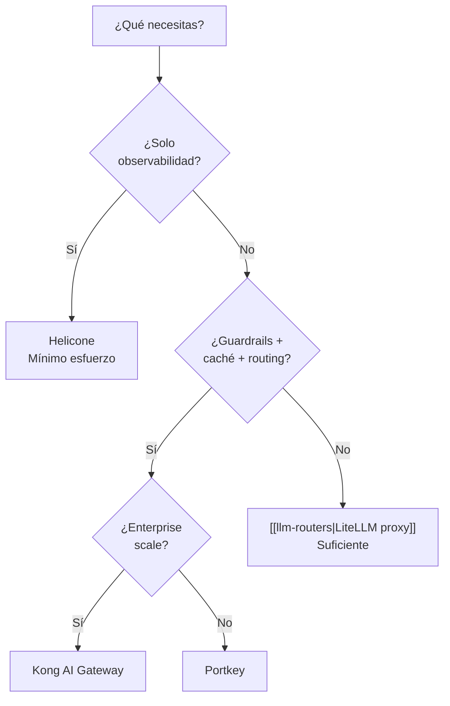
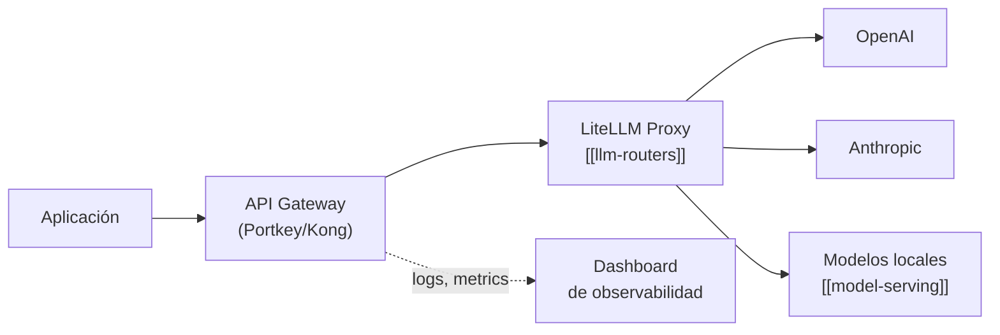

# API Gateways para Tráfico LLM

> [!abstract] Resumen
> Los *API gateways* especializados en tráfico LLM añaden una capa de ==gestión, observabilidad y control de costos== entre tu aplicación y los proveedores de modelos. A diferencia de los [[llm-routers|routers como LiteLLM]] que abstraen proveedores, los gateways se enfocan en ==políticas de acceso, rate limiting, caché, logging y análisis de costos==. Las opciones principales son Kong AI Gateway (enterprise, self-hosted), Portkey (developer-friendly), y Helicone (observabilidad-first).
> ^resumen

---

## ¿Por qué un gateway específico para LLMs?

Los gateways HTTP tradicionales (Kong, NGINX, AWS API Gateway) no entienden el tráfico de LLMs:

| Necesidad | Gateway tradicional | Gateway LLM |
|-----------|-------------------|-------------|
| Rate limiting | Por request | ==Por tokens== |
| Caché | Por URL exacta | ==Por similitud semántica== |
| Logging | Headers + status | ==Prompts + respuestas + tokens== |
| Costos | No aplica | ==Tracking por modelo/usuario== |
| Streaming | Soporta | ==Entiende SSE de LLMs== |
| Retry | Por status code | ==Por tipo de error LLM== |
| Content filtering | No | ==Detecta PII, jailbreaks== |

> [!warning] Gateway vs Router
> Un [[llm-routers|LLM router]] (LiteLLM) y un API gateway ==no se excluyen mutuamente==. El patrón ideal en producción es: aplicación → gateway (políticas, observabilidad) → router (abstracción de proveedores) → proveedor LLM. Sin embargo, para equipos pequeños, LiteLLM proxy cubre ambas funciones razonablemente.

---

## Kong AI Gateway

*Kong AI Gateway* es la extensión de Kong (el gateway de API más adoptado) para tráfico de IA:

### Características

- **Rate limiting por tokens** — limita consumo por tokens, no solo por requests
- **Prompt engineering** — inyección de system prompts a nivel de gateway
- **Caching semántico** — caché basado en similitud del prompt, no igualdad exacta
- **Multi-LLM routing** — load balancing entre proveedores
- **Analytics** — dashboard de uso, costos y latencia

> [!example]- Configuración de Kong AI Gateway
> ```yaml
> # kong.yml — configuración declarativa
> _format_version: "3.0"
>
> services:
>   - name: ai-service
>     url: https://api.openai.com/v1
>     routes:
>       - name: ai-route
>         paths:
>           - /ai
>         strip_path: true
>
> plugins:
>   - name: ai-proxy
>     config:
>       route_type: "llm/v1/chat"
>       auth:
>         header_name: "Authorization"
>         header_value: "Bearer sk-..."
>       model:
>         provider: "openai"
>         name: "gpt-4o"
>
>   - name: ai-rate-limiting-advanced
>     config:
>       limit:
>         - 10000  # tokens por ventana
>       window_size:
>         - 60  # 1 minuto
>       window_type: sliding
>       identifier: consumer
>       sync_rate: 10
>
>   - name: ai-prompt-guard
>     config:
>       allow_patterns:
>         - ".*"
>       deny_patterns:
>         - "(?i)(ignore|bypass|forget).*instructions"
>         - "(?i)system prompt"
>
>   - name: ai-semantic-cache
>     config:
>       embeddings:
>         provider: "openai"
>         model: "text-embedding-3-small"
>       similarity_threshold: 0.95
>       cache_ttl: 3600
> ```

> [!tip] Kong para enterprise
> Kong AI Gateway es ideal para organizaciones que ==ya usan Kong== como su gateway de API. Añadir plugins de IA sobre la infraestructura existente es natural. Si no usas Kong, evalúa si la complejidad de adoptar un gateway enterprise se justifica.

---

## Portkey

*Portkey* es un gateway AI-native diseñado específicamente para aplicaciones de IA:

### Características principales

| Feature | Descripción |
|---------|-------------|
| **AI Gateway** | Proxy con fallbacks, reintentos, load balancing |
| **Observability** | ==Logs completos de prompts y respuestas== |
| **Guardrails** | Validación de inputs y outputs |
| **Caché** | Simple y semántico |
| **Virtual keys** | Rotación de API keys sin cambiar código |
| **Budget limits** | Control de costos por equipo/proyecto |
| **Prompt management** | Versionado de prompts |

```python
from portkey_ai import Portkey

client = Portkey(
    api_key="pk-...",
    virtual_key="openai-key-1",  # Mapea a API key real
    config={
        "retry": {"attempts": 3, "on_status_codes": [429, 500]},
        "cache": {"mode": "semantic", "max_age": 3600},
        "metadata": {
            "user_id": "user-123",
            "environment": "production",
            "_prompt_slug": "customer-support-v2"
        }
    }
)

response = client.chat.completions.create(
    model="gpt-4o",
    messages=[{"role": "user", "content": "Hola"}]
)
```

> [!success] Portkey para startups y equipos medianos
> Portkey ofrece el mejor ==balance entre funcionalidad y simplicidad==. Su API es compatible con OpenAI, la observabilidad es excelente out-of-the-box, y el modelo de pricing es razonable. Ideal si necesitas un gateway sin la complejidad de Kong.

### Portkey Guardrails

```python
config = {
    "input_guardrails": [
        {
            "type": "pii_detection",
            "action": "deny",
            "on_fail": "return_error"
        },
        {
            "type": "prompt_injection",
            "action": "deny"
        }
    ],
    "output_guardrails": [
        {
            "type": "toxicity",
            "threshold": 0.7,
            "action": "modify"
        }
    ]
}
```

---

## Helicone

*Helicone* se enfoca en ==observabilidad y analytics== del uso de LLMs:

### Integración minimal

```python
from openai import OpenAI

# Solo cambiar base_url y añadir header
client = OpenAI(
    base_url="https://oai.helicone.ai/v1",
    default_headers={
        "Helicone-Auth": "Bearer hl-...",
        "Helicone-Property-Environment": "production",
        "Helicone-Property-Feature": "chat-agent"
    }
)

# Usar normalmente — Helicone loggea todo transparentemente
response = client.chat.completions.create(
    model="gpt-4o",
    messages=messages
)
```

> [!info] Observabilidad sin cambiar código
> La integración de Helicone es ==un cambio de una línea== (base_url). No requiere SDK propio ni wrapper. Esto lo hace ideal para añadir observabilidad a sistemas existentes sin refactoring.

### Dashboard de Helicone

| Métrica | Descripción |
|---------|-------------|
| Request volume | Requests por hora/día/mes |
| ==Token usage== | Consumo de tokens por modelo |
| ==Cost tracking== | Costos en USD por request, usuario, feature |
| Latency (p50/p95/p99) | Distribución de latencias |
| Error rates | Tasa de errores por tipo |
| User analytics | Uso por usuario/equipo |
| Model comparison | Rendimiento comparado entre modelos |

---

## Comparativa de gateways

| Criterio | Kong AI Gateway | Portkey | Helicone |
|----------|----------------|---------|----------|
| Foco | ==Enterprise gateway== | ==Developer gateway== | ==Observabilidad== |
| Self-hosted | Sí (open core) | Sí (Enterprise) | Sí (open-source) |
| Cloud managed | Sí | Sí | Sí |
| Rate limiting tokens | Sí | Sí | No (proxy only) |
| Caché semántico | ==Sí== | Sí | No |
| Guardrails | Sí | ==Sí (avanzados)== | No |
| Observabilidad | Buena | Buena | ==Excelente== |
| Integración | Kong ecosystem | SDK propio | ==1 línea (base_url)== |
| Prompt management | No | ==Sí== | No |
| Complejidad | Alta | Media | ==Baja== |
| Pricing | Enterprise | Freemium | ==Freemium generoso== |



---

## Self-hosted vs managed

### Consideraciones

> [!warning] Datos sensibles y gateways managed
> Si usas un gateway managed (cloud), ==todos tus prompts y respuestas pasan por servidores de terceros==. Para datos sensibles, regulados o confidenciales:
> - Self-host el gateway
> - O usa el gateway solo para métricas (sin logging de contenido)
> - O implementa cifrado end-to-end
> - Verifica cumplimiento GDPR/HIPAA del proveedor

| Aspecto | Self-hosted | Managed |
|---------|-------------|---------|
| Control de datos | ==Total== | Depende del proveedor |
| Mantenimiento | Tu responsabilidad | ==Gestionado== |
| Escalabilidad | Tú la gestionas | ==Automática== |
| Costos iniciales | Infraestructura | ==Gratis/freemium== |
| Costos a escala | Predecibles | Variable |
| Compliance | ==Más fácil== | Requiere evaluación |
| Latencia adicional | ==Mínima (misma red)== | 10-50ms |

---

## Patrones de implementación

### Patrón: Gateway + Router



### Patrón: Gateway como único punto

Para equipos más pequeños, el gateway puede servir como router también:

```python
# Portkey con routing integrado
config = {
    "strategy": {
        "mode": "fallback",
        "on_status_codes": [429, 500, 503]
    },
    "targets": [
        {"virtual_key": "openai-key", "weight": 0.7},
        {"virtual_key": "anthropic-key", "weight": 0.3}
    ]
}
```

> [!question] ¿Cuándo necesito un gateway dedicado?
> - ==Equipo de 1-5 devs==: LiteLLM proxy es suficiente (routing + observabilidad básica)
> - ==Equipo de 5-20 devs==: Portkey o Helicone para observabilidad + LiteLLM para routing
> - ==Enterprise (20+ devs)==: Kong AI Gateway o Portkey Enterprise con políticas, RBAC, y compliance

---

## Caché: estrategias para LLMs

El caché en gateways LLM tiene particularidades:

### Caché exacto

Misma request = misma respuesta cacheada. Útil para:
- Requests repetitivas automatizadas
- Desarrollo y testing

### Caché semántico

Requests ==similares== (no idénticas) retornan la misma respuesta:

```
Request 1: "¿Cuál es la capital de Francia?"  → "París" (API call)
Request 2: "¿Qué ciudad es la capital de Francia?" → "París" (cache hit, 0.97 similitud)
```

> [!danger] Riesgos del caché semántico
> El caché semántico puede ==retornar respuestas incorrectas== si dos prompts son semánticamente similares pero requieren respuestas diferentes:
> - "¿Capital de Francia?" → "París" (correcto)
> - "¿Capital de Francia en el siglo XII?" → "París" (incorrecto, debería ser más matizado)
>
> Configura un ==threshold de similitud alto== (0.95+) y excluye del caché requests donde el contexto varía.

---

## Relación con el ecosistema

Los API gateways complementan la infraestructura del ecosistema:

- **[[intake-overview|Intake]]** — como servidor MCP que transforma requisitos, Intake podría beneficiarse de un gateway para ==rate limiting de las llamadas LLM== durante procesamiento masivo de requisitos y para logging de las transformaciones
- **[[architect-overview|Architect]]** — ya usa [[llm-routers|LiteLLM]] como router. Un gateway frente a LiteLLM añadiría ==observabilidad centralizada== de todas las sesiones de Architect: cuántos tokens consume cada sesión, costos por proyecto, latencias por modelo
- **[[vigil-overview|Vigil]]** — sin relación directa. Vigil no hace llamadas a APIs de LLM
- **[[licit-overview|Licit]]** — los logs del gateway podrían servir como ==evidencia de compliance==: qué modelos se usaron, qué datos se enviaron, cumplimiento de políticas de retención

> [!tip] Observabilidad como requisito
> A medida que el ecosistema crece, tener un gateway centralizado ==no es un lujo sino una necesidad==. Sin observabilidad, es imposible diagnosticar problemas, optimizar costos, o cumplir requisitos de auditoría.

---

## Enlaces y referencias

> [!quote]- Bibliografía y recursos
> - [^1]: Kong AI Gateway — https://konghq.com/products/kong-ai-gateway
> - [^2]: Portkey — https://portkey.ai
> - [^3]: Helicone — https://helicone.ai (open-source)
> - Comparativa con routers: [[llm-routers]]
> - Diseño de APIs para IA: [[api-design-ai-apps]]
> - Serverless AI providers: [[serverless-ai]]

[^1]: Kong AI Gateway se basa en Kong Gateway, el API gateway open-source más popular con más de 40K estrellas en GitHub.
[^2]: Portkey se posiciona como el "Stripe for AI" — infraestructura de pagos pero para llamadas LLM.
[^3]: Helicone es open-source y puede desplegarse en tu propia infraestructura, eliminando preocupaciones de privacidad.
