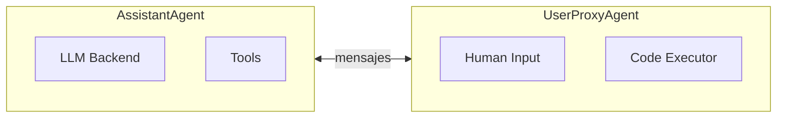
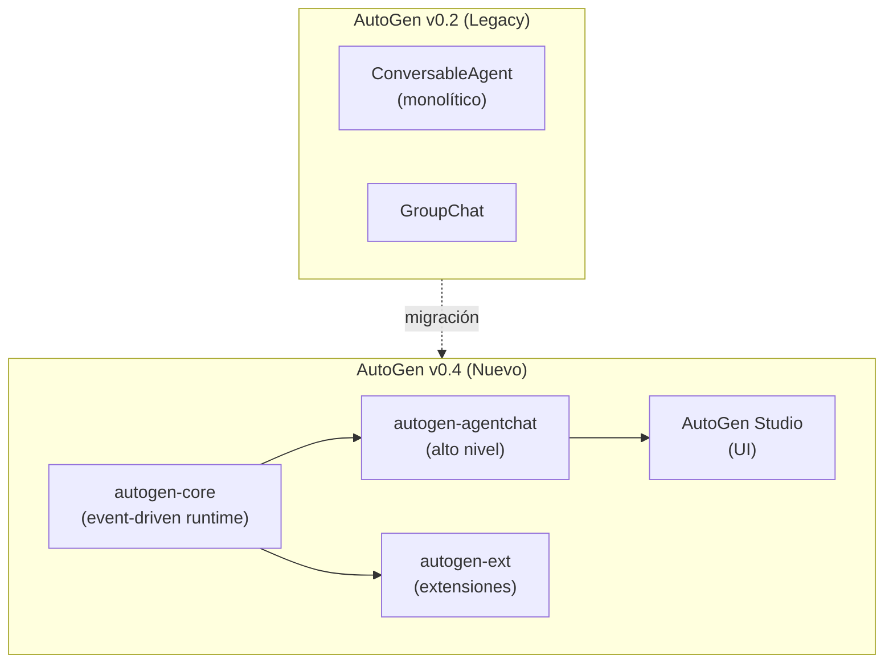

# Microsoft AutoGen — Agentes Conversables

> [!abstract] Resumen
> AutoGen es el framework de Microsoft para construir ==agentes conversables== (*conversable agents*) que colaboran mediante diálogos. Su concepto central es que los agentes se comunican enviándose mensajes entre sí, con soporte para ==*GroupChat* multi-agente==, ejecución segura de código en *Docker*, y un modo visual con *AutoGen Studio*. La versión 0.4 representa una ==reescritura completa== hacia una arquitectura *event-driven* y modular.
> ^resumen

---

## Arquitectura y conceptos clave

### El agente conversable

El *ConversableAgent* es la clase base de AutoGen. Todo agente puede enviar y recibir mensajes, ejecutar código, y llamar funciones:



> [!info] Filosofía de diseño
> A diferencia de [[crewai]] donde los agentes tienen *roles* explícitos, en AutoGen los agentes son ==contenedores genéricos de conversación==. Su comportamiento emerge de su configuración de LLM, *system message*, y las funciones que tienen disponibles.

### Tipos de agentes principales

| Agente | Propósito | LLM | Ejecución de código |
|--------|-----------|-----|-------------------|
| `AssistantAgent` | ==Agente inteligente con LLM== | Sí | No (por defecto) |
| `UserProxyAgent` | Proxy del humano + executor | Opcional | ==Sí== |
| `GroupChatManager` | Orquesta multi-agente | Sí | No |
| `ConversableAgent` | Base personalizable | Configurable | Configurable |

---

## Configuración básica

> [!example]- Conversación entre dos agentes
> ```python
> from autogen import AssistantAgent, UserProxyAgent
>
> # Configuración de LLM
> llm_config = {
>     "config_list": [
>         {
>             "model": "gpt-4o",
>             "api_key": os.environ["OPENAI_API_KEY"]
>         },
>         {
>             "model": "claude-sonnet-4-20250514",
>             "api_key": os.environ["ANTHROPIC_API_KEY"],
>             "api_type": "anthropic"
>         }
>     ],
>     "temperature": 0.1,
>     "cache_seed": 42  # Reproducibilidad con caché
> }
>
> # Agente asistente
> assistant = AssistantAgent(
>     name="coding_assistant",
>     system_message="""Eres un experto en Python. Cuando te pidan
>     resolver un problema, escribe código Python ejecutable.
>     Siempre incluye validación de errores.""",
>     llm_config=llm_config
> )
>
> # Proxy del usuario con ejecución de código
> user_proxy = UserProxyAgent(
>     name="user",
>     human_input_mode="NEVER",  # Sin intervención humana
>     max_consecutive_auto_reply=5,
>     code_execution_config={
>         "work_dir": "workspace",
>         "use_docker": True  # Ejecución segura
>     }
> )
>
> # Iniciar conversación
> user_proxy.initiate_chat(
>     assistant,
>     message="Analiza el dataset iris y genera un gráfico de dispersión"
> )
> ```

### Modos de input humano

| Modo | Comportamiento | Uso |
|------|---------------|-----|
| `ALWAYS` | Pide input humano en cada turno | Testing interactivo |
| `TERMINATE` | ==Pide input solo al terminar== | Producción con revisión |
| `NEVER` | Sin intervención humana | ==Automatización total== |

> [!warning] NEVER mode en producción
> El modo `NEVER` ejecuta todo sin supervisión. Combínalo con ==`max_consecutive_auto_reply`== para limitar la conversación y evitar loops infinitos de generación de código que podrían consumir tokens indefinidamente.

---

## GroupChat — Conversaciones multi-agente

*GroupChat* permite que múltiples agentes colaboren en una conversación compartida:

> [!example]- GroupChat con tres agentes especializados
> ```python
> from autogen import GroupChat, GroupChatManager
>
> # Agentes especializados
> planner = AssistantAgent(
>     name="planner",
>     system_message="""Eres un planificador de proyectos.
>     Descompones problemas en pasos claros y asignas trabajo
>     a los especialistas del equipo.""",
>     llm_config=llm_config
> )
>
> coder = AssistantAgent(
>     name="coder",
>     system_message="""Eres un desarrollador Python senior.
>     Escribes código limpio, bien documentado y con tests.""",
>     llm_config=llm_config
> )
>
> reviewer = AssistantAgent(
>     name="reviewer",
>     system_message="""Eres un revisor de código experto.
>     Analizas código buscando bugs, seguridad y mejoras.
>     Cuando el código es correcto, di 'TERMINATE'.""",
>     llm_config=llm_config
> )
>
> executor = UserProxyAgent(
>     name="executor",
>     human_input_mode="NEVER",
>     code_execution_config={"work_dir": "workspace", "use_docker": True}
> )
>
> # Configurar GroupChat
> groupchat = GroupChat(
>     agents=[planner, coder, reviewer, executor],
>     messages=[],
>     max_round=15,
>     speaker_selection_method="auto"  # LLM elige quién habla
> )
>
> manager = GroupChatManager(
>     groupchat=groupchat,
>     llm_config=llm_config
> )
>
> # Iniciar
> executor.initiate_chat(
>     manager,
>     message="Crea un API REST para gestión de tareas con FastAPI"
> )
> ```

### Métodos de selección de speaker

| Método | Descripción | Tokens |
|--------|-------------|--------|
| `auto` | ==LLM decide quién habla== | Alto |
| `round_robin` | Rotación fija | Ninguno |
| `random` | Selección aleatoria | Ninguno |
| `manual` | Humano decide | Ninguno |
| Custom function | Lógica personalizada | Variable |

> [!tip] Speaker selection personalizada
> Para flujos predecibles, define una función de selección que implemente tu lógica de negocio en lugar de dejar que el LLM decida. Esto ==reduce tokens y aumenta determinismo==:
> ```python
> def custom_speaker(last_speaker, groupchat):
>     flow = {"planner": "coder", "coder": "executor",
>             "executor": "reviewer", "reviewer": "planner"}
>     return groupchat.agent_by_name(flow.get(last_speaker.name, "planner"))
> ```

---

## Ejecución de código

Una de las fortalezas diferenciales de AutoGen es la ejecución segura de código generado por LLMs.

### Docker execution

```python
user_proxy = UserProxyAgent(
    name="executor",
    code_execution_config={
        "work_dir": "workspace",
        "use_docker": "python:3.11-slim",  # Imagen específica
        "timeout": 120,  # Timeout en segundos
    }
)
```

> [!danger] Ejecución local sin Docker
> Si configuras `use_docker=False`, el código se ejecuta ==directamente en tu máquina== con los permisos del proceso. Esto es extremadamente peligroso en producción. Un LLM podría generar código que:
> - Elimine archivos del sistema
> - Instale malware
> - Exfiltre datos sensibles
> - Consuma recursos hasta causar DoS
>
> ==Siempre usa Docker en cualquier entorno que no sea desarrollo local aislado.==

### Ejecución con Jupyter

```python
from autogen.coding import JupyterCodeExecutor

executor = JupyterCodeExecutor(
    kernel_name="python3",
    timeout=300,
    output_dir="./notebooks"
)
```

> [!info] Comparación con Architect
> [[architect-overview|Architect]] usa *git worktrees* para aislamiento de ejecución, una estrategia diferente a Docker. Los worktrees aíslan el código fuente, no la ejecución. Para agentes que ejecutan código arbitrario (como AutoGen), ==Docker es más seguro==. Para agentes que modifican código existente (como Architect), ==worktrees son más prácticos==.

---

## Function calling y herramientas

AutoGen soporta *function calling* nativo de los proveedores:

```python
from typing import Annotated

# Definir función como herramienta
def search_database(
    query: Annotated[str, "Consulta SQL a ejecutar"],
    limit: Annotated[int, "Número máximo de resultados"] = 10
) -> str:
    """Busca información en la base de datos interna."""
    return execute_query(query, limit)

# Registrar en el agente
assistant.register_for_llm(
    name="search_database",
    description="Buscar en la base de datos"
)(search_database)

# Registrar en el executor
user_proxy.register_for_execution(
    name="search_database"
)(search_database)
```

> [!tip] Registro dual
> Las funciones deben registrarse en ==dos agentes==: el que decide llamarla (LLM, `register_for_llm`) y el que la ejecuta (`register_for_execution`). Esta separación es intencional para seguridad — el executor puede imponer restricciones que el LLM no conoce.

---

## AutoGen v0.4 — La reescritura

La versión 0.4 representa una reescritura fundamental del framework:



### Cambios clave en v0.4

| Aspecto | v0.2 | v0.4 |
|---------|------|------|
| Arquitectura | Monolítica | ==Modular (paquetes separados)== |
| Comunicación | Directa (síncrona) | ==Event-driven (mensajes)== |
| Runtime | Single-process | ==Distribuido opcional== |
| Tipos de agente | `ConversableAgent` subclases | Interfaces + composición |
| Estado | Implícito en mensajes | ==Explícito y observable== |

> [!warning] Estado de la migración
> La v0.4 aún está en desarrollo activo. Muchos tutoriales y ejemplos en internet ==usan la API v0.2==. Verifica siempre la versión que estás usando. La v0.2 sigue funcionando pero no recibirá nuevas funcionalidades.

### Event-driven en v0.4

```python
# v0.4 — Nuevo estilo event-driven
from autogen_agentchat.agents import AssistantAgent
from autogen_agentchat.teams import RoundRobinGroupChat
from autogen_agentchat.conditions import TextMentionTermination

agent1 = AssistantAgent("analyst", model_client=model_client)
agent2 = AssistantAgent("coder", model_client=model_client)

termination = TextMentionTermination("APPROVE")

team = RoundRobinGroupChat(
    [agent1, agent2],
    termination_condition=termination
)

result = await team.run(task="Analiza ventas Q4")
```

---

## AutoGen Studio

*AutoGen Studio* proporciona una interfaz visual para diseñar y probar flujos multi-agente:

> [!success] Capacidades de AutoGen Studio
> - ==Diseño visual== de equipos de agentes sin código
> - Testing interactivo con visualización de la conversación
> - Galería de plantillas reutilizables
> - Exportación a código Python
> - Historial de sesiones para debugging

> [!failure] Limitaciones de AutoGen Studio
> - No sustituye a un IDE para flujos complejos
> - Las customizaciones avanzadas requieren código
> - ==No es apto para producción== (herramienta de prototipado)
> - Limitado a las abstracciones de AutoGen (no extensible arbitrariamente)

```bash
# Instalación y ejecución
pip install autogenstudio
autogenstudio ui --port 8081
```

---

## Comparación detallada con CrewAI y LangGraph

### Filosofía

| Framework | Metáfora | Comunicación | Control |
|-----------|----------|-------------|---------|
| **AutoGen** | ==Conversación== | Mensajes entre agentes | Emergente |
| **[[crewai]]** | ==Equipo de trabajo== | Tareas con contexto | Roles |
| **[[langgraph]]** | ==Máquina de estado== | Estado compartido | Grafos |

### Caso de uso: agente de investigación

> [!example]- Mismo problema, tres implementaciones
> **AutoGen**: Dos agentes conversan. El asistente investiga, el proxy ejecuta código para validar datos. La conversación fluye naturalmente.
>
> **CrewAI**: Un agente investigador y un agente analista ejecutan tareas secuenciales. El output de uno alimenta al otro.
>
> **LangGraph**: Un grafo con nodos "buscar", "analizar", "validar" conectados por aristas condicionales. El estado se actualiza en cada nodo.
>
> ==AutoGen es ideal cuando la interacción es verdaderamente conversacional==. Si el flujo es predecible, LangGraph o CrewAI ofrecen más control.

### Tabla comparativa detallada

| Criterio | AutoGen | CrewAI | LangGraph |
|----------|---------|--------|-----------|
| Code execution | ==Docker nativo== | No nativo | Manual |
| Observabilidad | Media | Baja | ==Alta== |
| Escalabilidad | Media (v0.4: alta) | Baja | ==Alta== |
| Esfuerzo inicial | Bajo | ==Muy bajo== | Alto |
| Flexibilidad | Alta | Media | ==Muy alta== |
| Producción-ready | Media | Media | ==Alta== |
| Comunidad | Grande | Grande | ==Muy grande== |

---

## Patrones avanzados

### Agente con RAG integrado

```python
from autogen.agentchat.contrib.retrieve_assistant_agent import RetrieveAssistantAgent
from autogen.agentchat.contrib.retrieve_user_proxy_agent import RetrieveUserProxyAgent

rag_assistant = RetrieveAssistantAgent(
    name="rag_assistant",
    llm_config=llm_config
)

rag_proxy = RetrieveUserProxyAgent(
    name="rag_user",
    retrieve_config={
        "task": "qa",
        "docs_path": ["./docs/"],
        "chunk_token_size": 2000,
        "model": llm_config["config_list"][0]["model"],
        "collection_name": "my_docs",
        "get_or_create": True
    }
)
```

### Caché y reproducibilidad

```python
llm_config = {
    "config_list": config_list,
    "cache_seed": 42  # Misma seed = mismas respuestas cacheadas
}
```

> [!question] ¿Cache a nivel de agente o de infraestructura?
> AutoGen implementa caché a nivel de agente (por seed). Para caché compartido entre aplicaciones, es mejor usar un [[api-gateways-llm|gateway de API]] o el proxy de [[llm-routers|LiteLLM]] que ofrece caché centralizado. Ver [[api-gateways-llm]] para comparativas.

---

## Relación con el ecosistema

AutoGen se posiciona como alternativa multi-agente dentro del ecosistema Microsoft:

- **[[intake-overview|Intake]]** — AutoGen podría orquestar el flujo de Intake como una conversación entre un agente "extractor" y un agente "validador", con el UserProxy ejecutando transformaciones. La naturaleza conversacional de AutoGen encaja con el ida y vuelta de refinar requisitos
- **[[architect-overview|Architect]]** — ambos soportan ejecución de código, pero con filosofías diferentes. Architect ejecuta en git worktrees con herramientas registradas; AutoGen ejecuta en Docker con código generado dinámicamente. ==Para modificación de código existente, Architect es superior; para generación desde cero, AutoGen es más flexible==
- **[[vigil-overview|Vigil]]** — como escáner determinista, Vigil opera fuera del paradigma conversacional de AutoGen
- **[[licit-overview|Licit]]** — un flujo de compliance podría modelarse como GroupChat donde un agente escanea, otro verifica, y un manager decide la política a aplicar. La ejecución de código de AutoGen permitiría ejecutar los conectores de Licit directamente

> [!info] AutoGen y Semantic Kernel
> Microsoft mantiene tanto AutoGen como [[semantic-kernel|Semantic Kernel]]. No compiten directamente: ==Semantic Kernel es para integrar IA en aplicaciones empresariales existentes==, AutoGen es para ==construir sistemas multi-agente autónomos==. Pueden usarse juntos.

---

## Enlaces y referencias

> [!quote]- Bibliografía y recursos
> - [^1]: Microsoft Research Paper — "AutoGen: Enabling Next-Gen LLM Applications via Multi-Agent Conversation"
> - [^2]: Repositorio GitHub: `microsoft/autogen`
> - AutoGen Studio: interfaz visual — https://autogen-studio.com
> - Documentación v0.4: migración y nueva arquitectura
> - Comparativa frameworks: [[crewai]], [[langgraph]], [[semantic-kernel]]

[^1]: AutoGen fue desarrollado por Microsoft Research y publicado como paper en 2023, con el framework open-source siguiendo poco después.
[^2]: La reescritura v0.4 refleja las lecciones aprendidas de la adopción masiva de v0.2, priorizando modularidad y extensibilidad sobre simplicidad de API.
