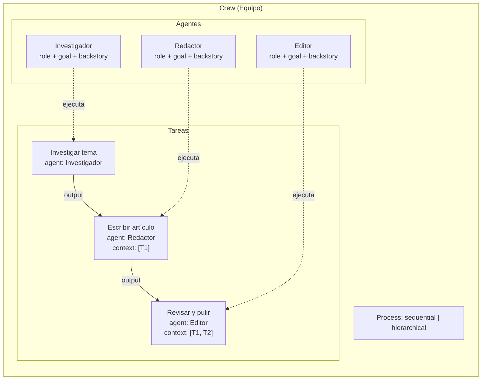
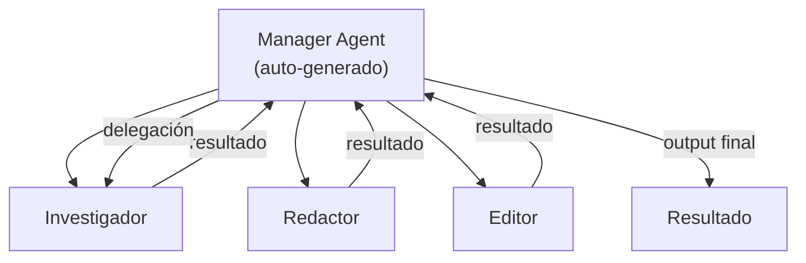
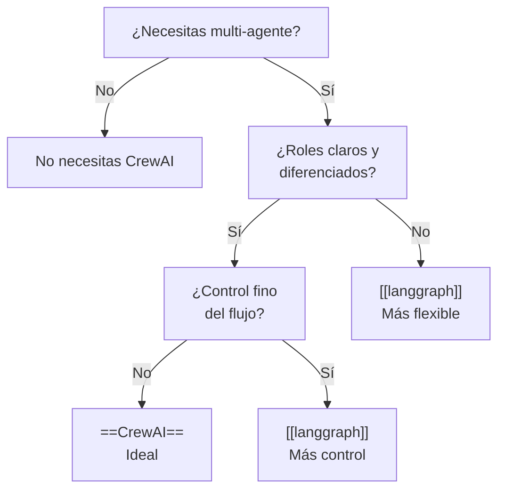

# CrewAI — Framework Multi-Agente

> [!abstract] Resumen
> CrewAI es un framework de ==orquestación multi-agente== que modela equipos de agentes con roles especializados. Cada agente tiene un *role*, *goal* y *backstory* que definen su personalidad y competencias. Los agentes ejecutan *tasks* organizadas en un *crew* con procesos ==secuenciales o jerárquicos==. Su principal fortaleza es la simplicidad conceptual; su principal debilidad, la ==dificultad de debugging== cuando las cosas salen mal.
> ^resumen

---

## Arquitectura conceptual

CrewAI se inspira en la metáfora de un equipo de trabajo humano:



### Componentes fundamentales

| Componente | Propósito | Configuración clave |
|------------|-----------|-------------------|
| **Agent** | ==Unidad autónoma con personalidad== | role, goal, backstory, tools, llm |
| **Task** | Unidad de trabajo asignable | description, expected_output, agent, context |
| **Crew** | Orquestador del equipo | agents, tasks, process, memory |
| **Process** | Estrategia de ejecución | sequential, hierarchical |
| **Tool** | Capacidad externa | Hereda de `BaseTool` |

---

## Definición de agentes

Cada agente en CrewAI tiene tres atributos que definen su comportamiento:

```python
from crewai import Agent
from langchain_openai import ChatOpenAI

investigador = Agent(
    role="Investigador Senior de Mercado",
    goal="Encontrar datos precisos y actualizados sobre tendencias tecnológicas",
    backstory="""Eres un analista con 15 años de experiencia en investigación
    de mercados tecnológicos. Tu especialidad es encontrar datos cuantitativos
    que respalden decisiones estratégicas. Eres meticuloso y siempre verificas
    tus fuentes.""",
    tools=[search_tool, scrape_tool],
    llm=ChatOpenAI(model="gpt-4o", temperature=0.1),
    verbose=True,
    allow_delegation=True,
    max_iter=5,
    max_rpm=10  # Rate limiting
)
```

> [!tip] El backstory importa
> El *backstory* no es decorativo. ==Define el estilo de razonamiento del agente==. Un backstory de "analista meticuloso" produce respuestas diferentes a "emprendedor arriesgado" incluso con el mismo *role* y *goal*. Experimenta con backstories específicos para obtener el comportamiento deseado.

> [!warning] Temperatura y consistencia
> Para agentes que deben producir resultados consistentes (como un "verificador de datos"), usa ==temperature=0==. Para agentes creativos (como un "redactor de marketing"), valores de 0.5-0.7 funcionan mejor. Mezclar temperaturas en el mismo crew es una práctica recomendada.

---

## Definición de tareas

Las tareas son la unidad de trabajo que los agentes ejecutan:

> [!example]- Definición completa de tareas con contexto
> ```python
> from crewai import Task
>
> tarea_investigacion = Task(
>     description="""Investiga las tendencias actuales en frameworks de
>     agentes IA para 2025. Incluye:
>     1. Cuota de mercado estimada de cada framework
>     2. Tendencias de adopción (creciendo/estable/declinando)
>     3. Casos de uso principales
>     4. Limitaciones conocidas
>
>     Usa solo fuentes publicadas después de enero 2025.""",
>     expected_output="""Un informe estructurado con:
>     - Tabla comparativa de frameworks
>     - Top 5 tendencias con datos cuantitativos
>     - Recomendaciones basadas en evidencia""",
>     agent=investigador,
>     output_file="research_report.md"
> )
>
> tarea_redaccion = Task(
>     description="""Basándote en la investigación proporcionada,
>     escribe un artículo de blog técnico de 1500 palabras.
>     Tono: profesional pero accesible.
>     Audiencia: CTOs y tech leads.""",
>     expected_output="Artículo completo en Markdown con secciones claras",
>     agent=redactor,
>     context=[tarea_investigacion],  # Recibe output de investigación
>     output_file="blog_article.md"
> )
>
> tarea_revision = Task(
>     description="""Revisa el artículo para:
>     1. Precisión técnica (verificar contra la investigación)
>     2. Claridad y fluidez del texto
>     3. SEO (títulos, estructura, keywords)
>     4. Errores gramaticales""",
>     expected_output="Artículo revisado con cambios marcados y lista de correcciones",
>     agent=editor,
>     context=[tarea_investigacion, tarea_redaccion]
> )
> ```

### Parámetros avanzados de Task

| Parámetro | Tipo | Descripción |
|-----------|------|-------------|
| `context` | list[Task] | ==Tareas cuyo output se inyecta como contexto== |
| `output_file` | str | Guardar resultado en archivo |
| `output_json` | Pydantic | Parsear output como JSON estructurado |
| `output_pydantic` | Pydantic | Validar output con modelo Pydantic |
| `human_input` | bool | Solicitar feedback humano tras completar |
| `async_execution` | bool | Ejecutar en paralelo |
| `callback` | callable | Función llamada al completar |

---

## Procesos de ejecución

### Sequential (Secuencial)

Las tareas se ejecutan en orden. Cada tarea recibe el contexto de las anteriores:

```python
from crewai import Crew, Process

crew = Crew(
    agents=[investigador, redactor, editor],
    tasks=[tarea_investigacion, tarea_redaccion, tarea_revision],
    process=Process.sequential,
    verbose=True
)

result = crew.kickoff()
print(result.raw)          # Output final como texto
print(result.token_usage)  # Tokens consumidos
```

### Hierarchical (Jerárquico)

Un agente "manager" coordina y delega tareas a los demás:

```python
crew = Crew(
    agents=[investigador, redactor, editor],
    tasks=[tarea_investigacion, tarea_redaccion, tarea_revision],
    process=Process.hierarchical,
    manager_llm=ChatOpenAI(model="gpt-4o"),  # LLM para el manager
    verbose=True
)
```

> [!info] Manager automático
> En modo jerárquico, CrewAI crea un ==agente manager implícito== que decide qué agente ejecuta qué tarea, puede reasignar tareas si un agente falla, y sintetiza resultados. Esto añade overhead de tokens pero mejora la resiliencia.



---

## Sistema de memoria

CrewAI implementa tres tipos de memoria que persisten entre ejecuciones:

### Short-term memory

Contexto de la conversación actual dentro de una ejecución del crew. Se limpia al finalizar `kickoff()`.

### Long-term memory

Experiencias pasadas almacenadas en una base de datos SQLite local. Permite al agente ==aprender de ejecuciones anteriores==:

```python
crew = Crew(
    agents=[investigador],
    tasks=[tarea_investigacion],
    memory=True,  # Activa todas las memorias
    verbose=True
)
```

### Entity memory

Recuerda información sobre entidades específicas (personas, empresas, conceptos) mencionadas en interacciones:

> [!tip] Cuándo activar memoria
> - **Short-term**: siempre activa por defecto
> - **Long-term**: útil cuando el ==crew se ejecuta repetidamente== con tareas similares
> - **Entity**: útil cuando los agentes deben recordar ==relaciones entre entidades== a lo largo del tiempo

> [!question] ¿Cómo se compara con la memoria de Architect?
> [[architect-overview|Architect]] gestiona estado mediante sesiones persistentes con auto-save y formato `YYYYMMDD-HHMMSS-hexhex`. La diferencia fundamental es que CrewAI abstrae la memoria como un concepto del framework, mientras que Architect usa ==mecanismos estándar de persistencia== (archivos de sesión) que el usuario puede inspeccionar y manipular directamente. Ver [[state-management]] para más detalles.

---

## Integración de herramientas

CrewAI permite integrar herramientas de múltiples fuentes:

```python
from crewai_tools import (
    SerperDevTool,      # Búsqueda web
    ScrapeWebsiteTool,  # Scraping
    FileReadTool,       # Lectura de archivos
    DirectoryReadTool,  # Lectura de directorios
)

# Herramientas nativas de CrewAI
search = SerperDevTool()
scrape = ScrapeWebsiteTool()

# Herramienta personalizada
from crewai_tools import BaseTool

class DatabaseQueryTool(BaseTool):
    name: str = "database_query"
    description: str = "Ejecuta consultas SQL en la base de datos interna"

    def _run(self, query: str) -> str:
        # Implementación
        return execute_sql(query)
```

> [!warning] Herramientas y seguridad
> CrewAI ejecuta herramientas ==sin sandboxing por defecto==. Si un agente tiene acceso a `ScrapeWebsiteTool` y `FileWriteTool`, podría potencialmente descargar contenido malicioso y escribirlo en disco. Implementa restricciones a nivel de herramienta, no confíes en el *role* del agente para limitar comportamiento.

### Herramientas de LangChain compatibles

```python
from langchain_community.tools import DuckDuckGoSearchRun

# Se pueden usar directamente herramientas de LangChain
ddg_search = DuckDuckGoSearchRun()

agente = Agent(
    role="Investigador",
    tools=[ddg_search]  # Compatible directamente
)
```

---

## Delegación entre agentes

La delegación permite que un agente pida ayuda a otro del mismo crew:

```python
investigador = Agent(
    role="Investigador Principal",
    allow_delegation=True,  # Puede delegar a otros agentes
    # ...
)
```

Cuando `allow_delegation=True`, el agente recibe una herramienta implícita llamada "Delegate work to coworker" que le permite enviar sub-tareas a otros agentes del crew.

> [!danger] Loops de delegación
> Si dos agentes tienen `allow_delegation=True` y no son suficientemente claros en sus roles, pueden entrar en un ==loop infinito de delegación== ("Tú hazlo" / "No, tú hazlo"). Mitiga esto con:
> - `max_iter` bajo (3-5) en cada agente
> - Roles claramente diferenciados
> - Solo un agente con delegación activa cuando sea posible

---

## Inputs y outputs estructurados

### Inputs dinámicos

```python
crew = Crew(
    agents=[investigador, redactor],
    tasks=[tarea_investigacion, tarea_redaccion],
    process=Process.sequential
)

# Pasar variables dinámicas al crew
result = crew.kickoff(inputs={
    "topic": "LLM agents en producción",
    "target_audience": "ingenieros senior",
    "word_count": 2000
})
```

En las descripciones de tareas, usar `{topic}`, `{target_audience}`, etc. como placeholders.

### Outputs tipados

```python
from pydantic import BaseModel

class ResearchReport(BaseModel):
    title: str
    key_findings: list[str]
    data_sources: list[str]
    confidence_score: float

tarea = Task(
    description="...",
    expected_output="...",
    output_pydantic=ResearchReport,
    agent=investigador
)
```

> [!success] Output validation
> Usar `output_pydantic` es ==muy recomendable para tareas críticas==. Si el LLM no produce un output parseable, CrewAI reintenta automáticamente con instrucciones de formato. Esto reduce significativamente los errores de formato en producción.

---

## Limitaciones y críticas

### Debugging

> [!failure] El mayor punto débil de CrewAI
> Cuando un crew falla o produce resultados pobres, ==diagnosticar la causa raíz es difícil==:
> - ¿Fue el prompt del agente? ¿La descripción de la tarea?
> - ¿El contexto de una tarea previa fue demasiado largo/corto?
> - ¿La delegación causó pérdida de información?
> - ¿El manager jerárquico tomó una mala decisión de routing?
>
> A diferencia de [[langgraph]], donde puedes inspeccionar el estado en cada nodo, CrewAI opera como una ==caja negra== entre el input y el output.

### Comparativa con LangGraph y AutoGen

| Característica | CrewAI | [[langgraph\|LangGraph]] | [[autogen\|AutoGen]] |
|---------------|--------|-----------|---------|
| Curva de aprendizaje | ==Baja== | Alta | Media |
| Control del flujo | Limitado | ==Total== | Medio |
| Debugging | Difícil | ==Fácil (state inspect)== | Medio |
| Multi-agente nativo | ==Sí== | Requiere diseño | ==Sí== |
| Persistencia | Básica (SQLite) | ==Avanzada (PostgreSQL)== | Básica |
| Human-in-the-loop | Básico | ==Avanzado== | Medio |
| Memoria | ==Tres tipos== | Manual | Básica |
| Comunidad | Grande | ==Muy grande== | Grande |

### Cuándo elegir CrewAI



---

## Patrones avanzados

### Crew pipeline

Encadenar múltiples crews para tareas complejas, conectando con los patrones descritos en [[orchestration-patterns]]:

```python
from crewai import Pipeline

pipeline = Pipeline(
    stages=[
        research_crew,   # Crew de investigación
        analysis_crew,   # Crew de análisis
        writing_crew     # Crew de redacción
    ]
)

result = pipeline.kickoff(inputs={"topic": "AI agents"})
```

### Crew con callbacks

```python
from crewai import Crew

def on_task_complete(task_output):
    print(f"Tarea completada: {task_output.description[:50]}")
    # Log, métricas, notificaciones...

crew = Crew(
    agents=[investigador, redactor],
    tasks=[tarea_investigacion, tarea_redaccion],
    task_callback=on_task_complete,
    step_callback=lambda step: print(f"Step: {step}")
)
```

---

## Relación con el ecosistema

CrewAI ocupa un nicho específico en la infraestructura de agentes:

- **[[intake-overview|Intake]]** — un crew de agentes podría modelar el flujo de Intake: un agente "analista de requisitos" extrae información, un agente "arquitecto" la transforma en especificaciones. Sin embargo, el overhead de multi-agente no se justifica para el flujo relativamente lineal de Intake
- **[[architect-overview|Architect]]** — Architect usa su propio sistema de agentes configurables via YAML con roles similares conceptualmente a los de CrewAI. La diferencia es que los agentes de Architect ==comparten un loop de ejecución unificado== y usan MCP para descubrimiento de herramientas, mientras que los agentes de CrewAI son más autónomos
- **[[vigil-overview|Vigil]]** — no aplica. Vigil es determinista y no necesita agentes conversacionales
- **[[licit-overview|Licit]]** — un crew podría orquestar análisis de compliance complejos: un agente escanea licencias, otro verifica políticas, otro genera reportes. Sería una extensión interesante sobre la CLI actual

> [!info] CrewAI vs Architect agents
> Tanto CrewAI como Architect permiten definir agentes con roles. La diferencia filosófica: CrewAI ==emerge el comportamiento del backstory== (prompting implícito), mientras que Architect ==configura el comportamiento explícitamente en YAML== con herramientas, hooks y restricciones definidas.

---

## Enlaces y referencias

> [!quote]- Bibliografía y recursos
> - [^1]: Documentación oficial CrewAI — https://docs.crewai.com
> - [^2]: Repositorio GitHub: `joaomdmoura/crewAI`
> - Blog: "Multi-Agent Systems with CrewAI" — análisis de casos de uso
> - Comparativa: [[langgraph]] vs CrewAI vs [[autogen]]
> - Patrones de orquestación: [[orchestration-patterns]]

[^1]: CrewAI fue creado por Joao Moura en 2024 como alternativa más simple a los agentes de LangChain.
[^2]: La comunidad de CrewAI ha crecido rápidamente, con más de 20K estrellas en GitHub en su primer año.
