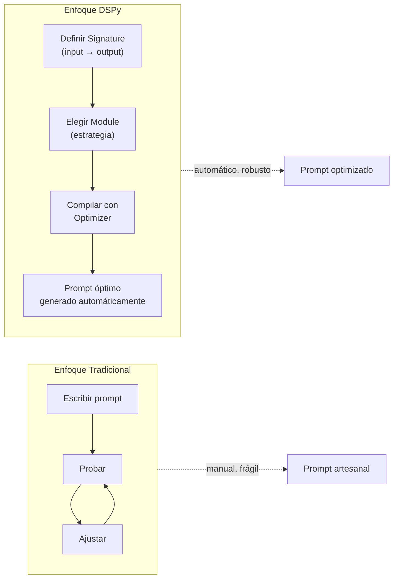
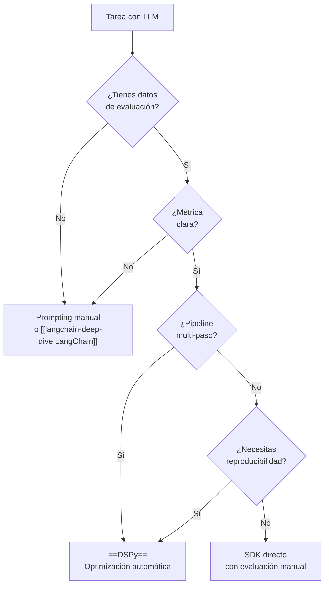

# DSPy — Programar (no Promptear) LLMs

> [!abstract] Resumen
> DSPy es un framework de Stanford que propone un cambio de paradigma: ==programar LLMs en lugar de promptearlos==. En vez de escribir prompts artesanales, defines *signatures* (entradas/salidas), compones *modules* (estrategias de razonamiento), y usas *optimizers* para que DSPy ==genere automáticamente los prompts óptimos== a partir de ejemplos y métricas. Es especialmente poderoso para sistemas donde la ==reproducibilidad y la optimización sistemática== importan más que el control artesanal de cada prompt.
> ^resumen

---

## El problema que DSPy resuelve

### Ingeniería de prompts artesanal

El flujo tradicional de desarrollo con LLMs:

1. Escribir un prompt manualmente
2. Probar con algunos ejemplos
3. Ajustar el prompt basándote en fallos
4. Repetir hasta que "funcione"
5. Cambiar de modelo → romper todo → volver al paso 1

> [!danger] Fragilidad del prompting manual
> Los prompts artesanales son ==frágiles ante cambios de modelo==. Un prompt optimizado para GPT-4 puede funcionar mal con Claude. Un prompt que funciona con temperatura 0.1 puede fallar con 0.7. DSPy abstrae esta fragilidad mediante optimización automática.

### El enfoque de DSPy



---

## Signatures — Declaraciones de entrada/salida

Una *signature* define QUÉ debe hacer el LLM sin especificar CÓMO:

```python
import dspy

# Signature simple como string
classify = dspy.Predict("text -> sentiment: str")

# Signature como clase (más control)
class Summarize(dspy.Signature):
    """Resume un texto técnico manteniendo los datos clave."""

    document: str = dspy.InputField(desc="Documento a resumir")
    max_sentences: int = dspy.InputField(desc="Número máximo de frases", default=3)
    summary: str = dspy.OutputField(desc="Resumen conciso del documento")
    key_facts: list[str] = dspy.OutputField(desc="Lista de hechos clave extraídos")
```

> [!tip] Descripciones en signatures
> Las descripciones en `InputField` y `OutputField` son ==metadatos que los optimizers usan== para generar mejores prompts. No son decorativas. Una descripción precisa produce mejor optimización.

### Signatures comunes

| Signature | Patrón | Uso |
|-----------|--------|-----|
| `question -> answer` | QA simple | Chatbots básicos |
| `context, question -> answer` | ==RAG== | Respuestas basadas en documentos |
| `text -> category, confidence` | Clasificación | Routing, filtrado |
| `text -> translation` | Traducción | Localización |
| `code, error -> fixed_code, explanation` | Debug | ==Corrección automática de código== |

---

## Modules — Estrategias de razonamiento

Los *modules* son las estrategias que DSPy usa para ejecutar signatures:

### Predict (básico)

```python
# El module más simple — una llamada directa al LLM
predictor = dspy.Predict(Summarize)
result = predictor(
    document="LangGraph es un framework para construir agentes...",
    max_sentences=3
)
print(result.summary)
print(result.key_facts)
```

### ChainOfThought

Añade razonamiento paso a paso automáticamente:

```python
# Genera un campo 'reasoning' antes de la respuesta
cot = dspy.ChainOfThought("question -> answer")
result = cot(question="¿Por qué LangGraph usa grafos de estado?")
print(result.reasoning)  # Razonamiento intermedio
print(result.answer)     # Respuesta final
```

> [!info] CoT automático vs manual
> Con prompting manual, implementar *Chain-of-Thought* requiere escribir instrucciones como "piensa paso a paso". Con DSPy, `ChainOfThought` ==inyecta automáticamente el campo de razonamiento== y los optimizers ajustan cómo el modelo razona.

### ReAct

Implementa el patrón Reasoning + Acting con herramientas:

```python
# Herramientas disponibles
def search_web(query: str) -> str:
    """Busca información en internet."""
    return web_search(query)

def calculate(expression: str) -> str:
    """Evalúa expresiones matemáticas."""
    return str(eval(expression))

react = dspy.ReAct(
    "question -> answer",
    tools=[search_web, calculate],
    max_iters=5
)

result = react(question="¿Cuál es la población de Madrid multiplicada por 2?")
```

### ProgramOfThought

Genera código para resolver problemas:

```python
pot = dspy.ProgramOfThought("question -> answer")
result = pot(question="Calcula la desviación estándar de [2, 4, 6, 8, 10]")
# Internamente genera y ejecuta código Python
```

### Módulos adicionales

| Module | Descripción | Cuándo usar |
|--------|-------------|-------------|
| `Predict` | Llamada directa | ==Tareas simples== |
| `ChainOfThought` | Razonamiento paso a paso | ==Tareas que requieren lógica== |
| `ReAct` | Razonamiento + herramientas | Agentes con tools |
| `ProgramOfThought` | Genera código para resolver | Tareas matemáticas/lógicas |
| `MultiChainComparison` | Múltiples cadenas + selección | Tareas donde la calidad importa |
| `Retry` | Reintento con feedback | Salidas que fallan validación |

---

## Optimizers — El poder de DSPy

Los *optimizers* (antes llamados *teleprompters*) son el componente que ==genera prompts óptimos automáticamente==:

### BootstrapFewShot

Selecciona automáticamente los mejores ejemplos (*few-shot*) de un dataset de entrenamiento:

> [!example]- Optimización con BootstrapFewShot
> ```python
> import dspy
> from dspy.teleprompt import BootstrapFewShot
>
> # Configurar LLM
> lm = dspy.LM("openai/gpt-4o-mini", temperature=0.1)
> dspy.configure(lm=lm)
>
> # Datos de entrenamiento
> trainset = [
>     dspy.Example(
>         question="¿Qué es LCEL?",
>         answer="LangChain Expression Language, sistema de composición declarativa"
>     ).with_inputs("question"),
>     dspy.Example(
>         question="¿Qué hace LiteLLM?",
>         answer="Proxy unificado para 100+ proveedores de LLM"
>     ).with_inputs("question"),
>     # ... más ejemplos
> ]
>
> # Definir métrica
> def exact_match(example, prediction, trace=None):
>     return example.answer.lower() in prediction.answer.lower()
>
> # Optimizar
> optimizer = BootstrapFewShot(
>     metric=exact_match,
>     max_bootstrapped_demos=4,
>     max_labeled_demos=4
> )
>
> # Module a optimizar
> qa = dspy.ChainOfThought("question -> answer")
>
> # Compilar — genera el prompt óptimo
> optimized_qa = optimizer.compile(
>     qa,
>     trainset=trainset
> )
>
> # El optimized_qa ahora tiene few-shot examples seleccionados
> result = optimized_qa(question="¿Qué es MCP?")
> ```

### MIPRO

*MIPRO* (*Multi-prompt Instruction Proposal Optimizer*) optimiza tanto las instrucciones como los ejemplos:

```python
from dspy.teleprompt import MIPRO

optimizer = MIPRO(
    metric=my_metric,
    num_candidates=10,  # Generar 10 candidatos de instrucción
    init_temperature=0.7
)

optimized = optimizer.compile(
    my_module,
    trainset=trainset,
    eval_kwargs={"num_threads": 4}
)
```

> [!tip] MIPRO vs BootstrapFewShot
> ==MIPRO es más potente pero más costoso== en tokens. Usa BootstrapFewShot para iteración rápida y MIPRO cuando necesitas el máximo rendimiento y puedes invertir en tokens de optimización.

### BayesianSignatureOptimizer

Usa optimización bayesiana para encontrar la mejor combinación de instrucciones y demos:

```python
from dspy.teleprompt import BayesianSignatureOptimizer

optimizer = BayesianSignatureOptimizer(
    metric=my_metric,
    n=20,       # Iteraciones de optimización
    verbose=True
)
```

### Comparativa de optimizers

| Optimizer | Coste | Calidad | Velocidad | Uso |
|-----------|-------|---------|-----------|-----|
| `BootstrapFewShot` | ==Bajo== | Buena | ==Rápido== | Prototipado |
| `BootstrapFewShotWithRandomSearch` | Medio | Mejor | Medio | Producción ligera |
| `MIPRO` | Alto | ==Excelente== | Lento | ==Producción crítica== |
| `BayesianSignatureOptimizer` | Alto | Excelente | Lento | Investigación |

---

## Assertions — Restricciones en runtime

Las *assertions* permiten imponer restricciones en las salidas del LLM:

```python
class FactualQA(dspy.Module):
    def __init__(self):
        self.generate = dspy.ChainOfThought("context, question -> answer")

    def forward(self, context, question):
        result = self.generate(context=context, question=question)

        # Assertion: la respuesta debe estar soportada por el contexto
        dspy.Assert(
            result.answer in context or
            any(fact in context for fact in result.answer.split(".")),
            "La respuesta debe estar soportada por el contexto proporcionado"
        )

        # Suggestion (soft constraint): preferir respuestas concisas
        dspy.Suggest(
            len(result.answer.split()) < 50,
            "Prefiere respuestas concisas (menos de 50 palabras)"
        )

        return result
```

> [!warning] Assert vs Suggest
> - `dspy.Assert` es una ==restricción dura==. Si falla, DSPy reintenta con feedback del error. Si sigue fallando, lanza excepción.
> - `dspy.Suggest` es una ==restricción suave==. Si falla, DSPy lo intenta pero no bloquea la ejecución.
>
> Usa Assert para invariantes de negocio (formato, seguridad). Usa Suggest para preferencias de calidad.

---

## Composición de módulos

DSPy permite componer módulos como capas de una red neuronal:

> [!example]- Pipeline multi-hop con composición
> ```python
> class MultiHopQA(dspy.Module):
>     """Pipeline que descompone preguntas complejas en sub-preguntas."""
>
>     def __init__(self, num_hops=3):
>         self.num_hops = num_hops
>         self.decompose = dspy.ChainOfThought(
>             "question -> sub_question"
>         )
>         self.search = dspy.Predict(
>             "sub_question -> search_results"
>         )
>         self.synthesize = dspy.ChainOfThought(
>             "question, context -> answer"
>         )
>
>     def forward(self, question):
>         context = []
>
>         for hop in range(self.num_hops):
>             # Descomponer en sub-pregunta
>             sub_q = self.decompose(
>                 question=f"{question}\nContexto previo: {context}"
>             )
>
>             # Buscar información
>             results = self.search(sub_question=sub_q.sub_question)
>             context.append(results.search_results)
>
>         # Sintetizar respuesta final
>         return self.synthesize(
>             question=question,
>             context="\n".join(context)
>         )
>
> # Optimizar el pipeline completo
> multihop = MultiHopQA(num_hops=3)
> optimized = optimizer.compile(multihop, trainset=trainset)
> ```

---

## Configuración de LLMs

DSPy se integra con múltiples proveedores:

```python
import dspy

# OpenAI
lm = dspy.LM("openai/gpt-4o", temperature=0.1, max_tokens=1000)

# Anthropic
lm = dspy.LM("anthropic/claude-sonnet-4-20250514", temperature=0.1)

# Local (via Ollama)
lm = dspy.LM("ollama_chat/llama3.1", api_base="http://localhost:11434")

# Via LiteLLM (cualquier proveedor)
lm = dspy.LM("litellm/deepseek-chat", api_base="http://litellm-proxy:4000")

dspy.configure(lm=lm)
```

> [!info] DSPy + LiteLLM
> DSPy usa LiteLLM internamente para su capa de abstracción de proveedores, al igual que [[architect-overview|Architect]]. Esto significa que cualquier proveedor soportado por [[llm-routers|LiteLLM]] funciona automáticamente con DSPy.

---

## Cuándo DSPy brilla vs cuándo no

### Casos ideales

> [!success] DSPy es ideal cuando...
> - Tienes ==datos de entrenamiento/evaluación== (aunque sean pocos, 20-50 ejemplos)
> - Necesitas ==reproducibilidad== — el mismo pipeline produce los mismos resultados
> - Quieres ==cambiar de modelo== sin reescribir prompts
> - Tu tarea se puede medir con una ==métrica clara==
> - Necesitas optimizar sistemáticamente en lugar de iterar manualmente

### Casos donde no usar DSPy

> [!failure] Evita DSPy cuando...
> - No tienes datos de evaluación y no quieres crearlos
> - Tu tarea es ==un chat abierto== sin respuesta "correcta" medible
> - Necesitas ==control fino del prompt== exacto (DSPy lo genera automáticamente)
> - El equipo no tiene experiencia con frameworks de ML
> - Tu caso de uso es tan simple que `model.invoke(prompt)` basta

### Comparación con enfoques alternativos



---

## Evaluación y métricas

DSPy incluye un sistema de evaluación integrado:

```python
from dspy.evaluate import Evaluate

evaluator = Evaluate(
    devset=devset,
    metric=my_metric,
    num_threads=4,
    display_progress=True,
    display_table=5  # Mostrar 5 ejemplos
)

# Evaluar antes de optimizar
baseline_score = evaluator(qa_module)

# Evaluar después de optimizar
optimized_score = evaluator(optimized_qa)

print(f"Baseline: {baseline_score:.2%}")
print(f"Optimizado: {optimized_score:.2%}")
```

> [!question] ¿Cómo definir buenas métricas?
> La calidad de la optimización de DSPy depende ==directamente de la calidad de tu métrica==. Métricas comunes:
> - **Exact match**: para clasificación, extracción de entidades
> - **F1 sobre tokens**: para QA extractivo
> - **LLM-as-judge**: para tareas generativas (un LLM evalúa la calidad)
> - **Custom**: métricas de dominio específicas

---

## Relación con el ecosistema

DSPy aporta una perspectiva única de optimización sistemática:

- **[[intake-overview|Intake]]** — las transformaciones de requisitos a especificaciones de Intake podrían beneficiarse enormemente de DSPy. Definir signatures (`requirements -> specification`) y optimizar con ejemplos reales de transformaciones exitosas ==eliminaría el prompting artesanal== en el pipeline de Intake
- **[[architect-overview|Architect]]** — el agente de codificación podría usar módulos DSPy internamente para optimizar sus prompts de generación de código. Sin embargo, Architect prioriza la flexibilidad de herramientas (MCP, BaseTool) sobre la optimización de prompts, y los dos enfoques son complementarios
- **[[vigil-overview|Vigil]]** — como escáner determinista, Vigil no usa LLMs y DSPy no aplica
- **[[licit-overview|Licit]]** — si Licit incorporara clasificación de licencias con LLM, DSPy sería ideal para optimizar esa clasificación con datos históricos de decisiones correctas

> [!tip] DSPy como capa de optimización
> DSPy no compite con frameworks de agentes como [[langgraph]] o [[crewai]]. Es una ==capa de optimización que se aplica dentro de cualquier sistema== que use LLMs. Puedes usar módulos DSPy dentro de nodos de LangGraph, herramientas de CrewAI, o componentes de Architect.

---

## Serialización y despliegue

Los módulos optimizados pueden serializarse para producción:

```python
# Guardar módulo optimizado
optimized_qa.save("optimized_qa.json")

# Cargar en producción
loaded_qa = dspy.ChainOfThought("question -> answer")
loaded_qa.load("optimized_qa.json")

# El módulo cargado incluye los prompts optimizados
result = loaded_qa(question="¿Qué es DSPy?")
```

> [!warning] Versionado de módulos
> Cada módulo optimizado está ==acoplado al modelo usado durante la optimización==. Si cambias de GPT-4o a Claude, debes ==re-optimizar==. Versiona los archivos JSON junto con la configuración del LLM usado.

---

## Enlaces y referencias

> [!quote]- Bibliografía y recursos
> - [^1]: Paper original: "DSPy: Compiling Declarative Language Model Calls into Self-Improving Pipelines" — Stanford NLP
> - [^2]: Repositorio GitHub: `stanfordnlp/dspy`
> - Documentación oficial: https://dspy-docs.vercel.app
> - Tutorial: "From Prompting to Programming" — blog Stanford AI
> - Comparativa de optimización: DSPy vs prompt engineering manual
> - Frameworks complementarios: [[langchain-deep-dive]], [[langgraph]]

[^1]: DSPy fue publicado por Omar Khattab et al. del Stanford NLP Group, aplicando ideas de compiladores y redes neuronales al prompting de LLMs.
[^2]: El nombre DSPy viene de "Declarative Self-improving Python", reflejando su filosofía de que los prompts deben ser generados automáticamente, no escritos a mano.
