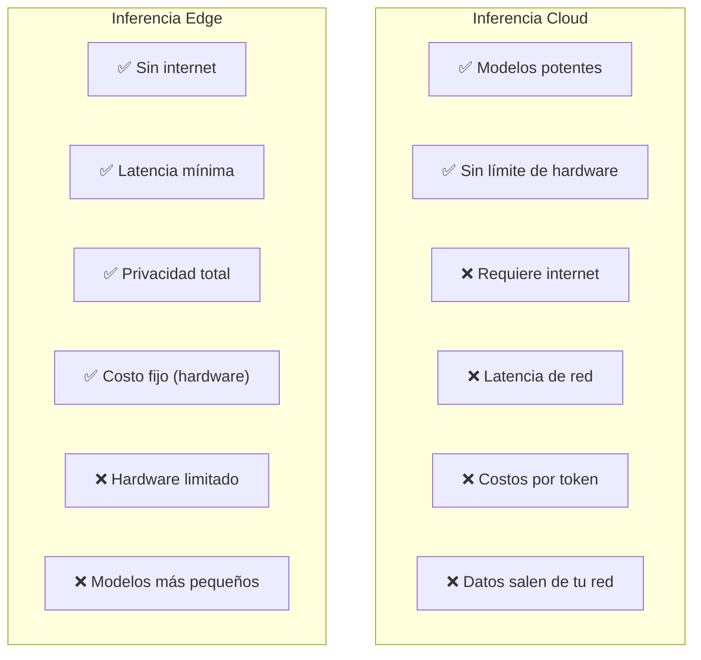
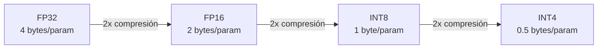
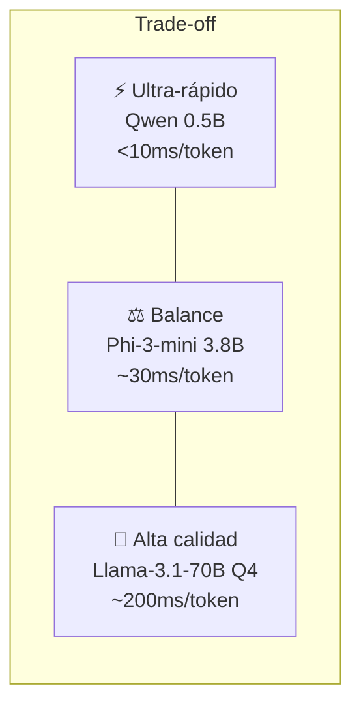
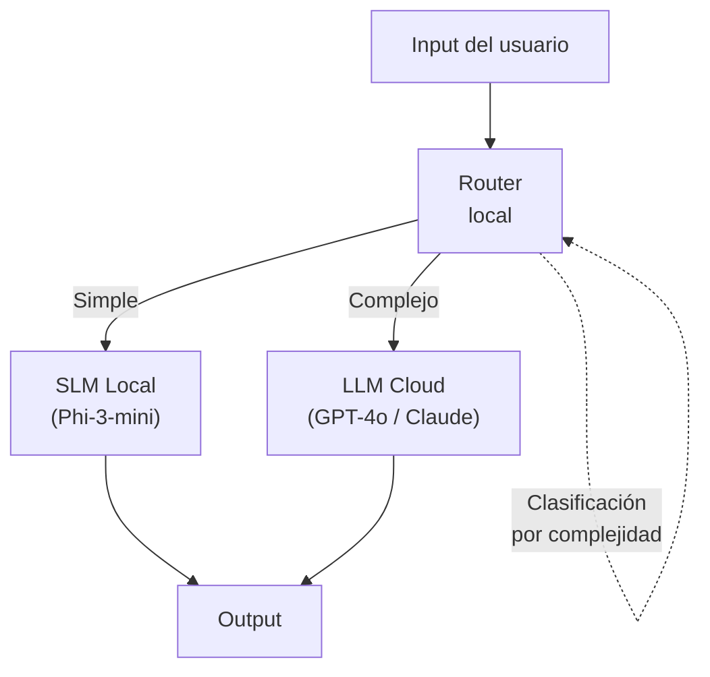

# IA en el Edge — Inferencia en Dispositivos

> [!abstract] Resumen
> La inferencia en el *edge* (dispositivos locales, móviles, IoT) permite ejecutar modelos de IA ==sin conexión a internet, con latencia mínima y privacidad total==. Los frameworks clave incluyen *ONNX Runtime*, *TensorRT*, *MLX* (Apple Silicon), *Core ML* y *TensorFlow Lite*. La cuantización (*INT4*, *INT8*, *GGUF*) reduce modelos a tamaños manejables. Los *Small Language Models* (SLMs) como Phi-3, Gemma 2B y Qwen-tiny hacen viable ejecutar LLMs en hardware consumer.
> ^resumen

---

## ¿Por qué Edge AI?



### Casos de uso principales

| Caso | Requisito clave | Ejemplo |
|------|----------------|---------|
| ==Privacidad== | Datos no pueden salir del dispositivo | Salud, legal, gobierno |
| ==Offline== | Sin conexión disponible | Campo, fábricas, vehículos |
| Latencia | <50ms de respuesta | Autocompletado, UX en tiempo real |
| Costos | Alto volumen, bajo valor por query | IoT, procesamiento batch local |
| Soberanía | Regulación de residencia de datos | GDPR, regulaciones locales |

> [!info] Edge AI en el ecosistema
> [[architect-overview|Architect]] ya soporta modelos locales vía Ollama. Esto es ==Edge AI en la práctica==: un desarrollador ejecuta un LLM en su máquina local para generar código sin enviar datos a APIs externas. Ver [[model-serving]] para más detalles sobre Ollama y llama.cpp.

---

## Frameworks de inferencia edge

### ONNX Runtime

*ONNX Runtime* es el runtime de inferencia multi-plataforma de Microsoft:

- **Multi-plataforma** — Windows, Linux, macOS, iOS, Android, Web
- **Multi-hardware** — CPU, GPU (CUDA, DirectML, ROCm), NPU
- **Multi-framework** — convierte desde PyTorch, TensorFlow, etc.
- **Optimizaciones** — graph optimization, quantization, operator fusion

```python
import onnxruntime as ort
import numpy as np

# Cargar modelo optimizado
session = ort.InferenceSession(
    "model.onnx",
    providers=["CUDAExecutionProvider", "CPUExecutionProvider"]
)

# Inferencia
inputs = {"input_ids": np.array([[1, 2, 3, 4]]).astype(np.int64)}
outputs = session.run(None, inputs)
```

> [!tip] ONNX como formato universal
> ONNX es el ==formato intermedio más adoptado== para deployment. Convierte tu modelo a ONNX una vez y despliégalo en cualquier plataforma. La mayoría de modelos en HuggingFace ofrecen exportación a ONNX.

### TensorRT (NVIDIA)

Optimizador y runtime de NVIDIA para inferencia de máximo rendimiento en GPUs NVIDIA:

| Optimización | Descripción | Speedup típico |
|-------------|-------------|----------------|
| Layer fusion | Combina operaciones | ==2-3x== |
| Precision calibration | FP32→FP16/INT8 automático | 2-4x |
| Kernel auto-tuning | Selecciona kernels óptimos | 1.2-1.5x |
| Dynamic tensor memory | Reutiliza memoria | Menor footprint |
| **Total combinado** | | ==5-10x vs PyTorch== |

> [!warning] Vendor lock-in con TensorRT
> TensorRT ==solo funciona en GPUs NVIDIA==. Si necesitas portabilidad entre hardware, usa ONNX Runtime con TensorRT como proveedor de ejecución:
> ```python
> session = ort.InferenceSession(
>     "model.onnx",
>     providers=["TensorrtExecutionProvider", "CUDAExecutionProvider"]
> )
> ```

### MLX (Apple Silicon)

*MLX* es el framework de Apple optimizado para chips M1/M2/M3/M4:

```python
import mlx.core as mx
import mlx.nn as nn
from mlx_lm import load, generate

# Cargar modelo optimizado para Apple Silicon
model, tokenizer = load("mlx-community/Llama-3.1-8B-Instruct-4bit")

# Generar texto
response = generate(
    model, tokenizer,
    prompt="Explica qué es RAG en una frase",
    max_tokens=100
)
```

> [!success] MLX en MacBooks
> Para desarrolladores con Mac, MLX ofrece ==rendimiento nativo sin Docker ni configuración CUDA==. Un modelo de 8B cuantizado a 4-bit corre fluidamente en un MacBook Pro con 16GB de RAM unificada.

### Core ML (Apple)

Framework de Apple para deployment en iOS/macOS/watchOS:

```swift
// Swift — inferencia en iPhone
import CoreML

let model = try! MyLLM(configuration: .init())
let input = MyLLMInput(text: "¿Cuál es la capital de España?")
let output = try! model.prediction(input: input)
print(output.response)
```

### TensorFlow Lite

Para Android y dispositivos embebidos:

```kotlin
// Kotlin — inferencia en Android
val interpreter = Interpreter(loadModelFile("model.tflite"))
val inputBuffer = ByteBuffer.allocateDirect(inputSize)
val outputBuffer = ByteBuffer.allocateDirect(outputSize)
interpreter.run(inputBuffer, outputBuffer)
```

### Comparativa de frameworks

| Framework | Plataformas | Hardware | Modelos LLM | Facilidad |
|-----------|------------|----------|-------------|-----------|
| ONNX Runtime | ==Todas== | CPU, GPU, NPU | Sí | Media |
| TensorRT | Linux, Windows | ==NVIDIA GPU only== | Sí | Baja |
| MLX | ==macOS only== | Apple Silicon | Sí | ==Alta== |
| Core ML | Apple ecosystem | CPU, GPU, ANE | Limitado | Alta |
| TF Lite | Android, embebido | CPU, GPU, DSP | Limitado | Media |

---

## Cuantización para dispositivos

La cuantización reduce la precisión numérica de los pesos del modelo:

### Tipos de cuantización



| Tipo | Bits | Tamaño (7B) | Calidad | Uso |
|------|------|-------------|---------|-----|
| FP32 | 32 | 28 GB | ==Referencia== | Training |
| FP16/BF16 | 16 | 14 GB | Excelente | GPU inference |
| INT8 | 8 | ==7 GB== | Muy buena | ==Producción GPU/CPU== |
| INT4 (GPTQ) | 4 | 3.5 GB | Buena | ==Edge con GPU== |
| INT4 (GGUF) | 4 | 3.5 GB | Buena | ==Edge CPU== |
| INT3/INT2 | 2-3 | 1.7-2.5 GB | Degradada | Investigación |

### Formatos de cuantización

> [!info] GGUF — El formato edge por excelencia
> *GGUF* (*GPT-Generated Unified Format*) es el formato de llama.cpp:
> - ==Optimizado para inferencia CPU==
> - Cuantización por bloques (diferentes partes del modelo con diferente precisión)
> - Metadatos embebidos (tokenizer, config)
> - Compatible con Ollama, llama.cpp, LM Studio
> - Variantes: Q2_K, Q3_K_M, ==Q4_K_M== (recomendado), Q5_K_M, Q6_K, Q8_0

> [!tip] Regla del pulgar para cuantización
> | Tu RAM | Modelo máximo (GGUF Q4_K_M) | Calidad |
> |--------|------------------------------|---------|
> | 8 GB | ==7B== | Buena para tareas simples |
> | 16 GB | ==13-14B== | Buena para coding/razonamiento |
> | 32 GB | ==34B== | Muy buena, comparable a GPT-3.5 |
> | 64 GB | ==70B== | Excelente, comparable a GPT-4 en muchas tareas |

---

## Small Language Models (SLMs)

Modelos diseñados específicamente para ser pequeños pero capaces:

### Phi-3 / Phi-3.5 (Microsoft)

| Variante | Parámetros | Contexto | Fortalezas |
|----------|-----------|----------|-----------|
| Phi-3-mini | ==3.8B== | 128K | Razonamiento, código |
| Phi-3-small | 7B | 128K | Balance general |
| Phi-3-medium | 14B | 128K | ==Casi nivel GPT-3.5== |
| Phi-3.5-MoE | 42B (6.6B activos) | 128K | Eficiencia MoE |

> [!success] Phi-3 mini: el SLM más impresionante
> Phi-3-mini con 3.8B parámetros ==supera a modelos de 7-13B en muchos benchmarks==. En formato GGUF Q4, cabe en 2.5 GB de RAM. Ideal para dispositivos con recursos limitados.

### Gemma 2 (Google)

| Variante | Parámetros | Fortalezas |
|----------|-----------|-----------|
| Gemma-2-2B | ==2B== | ==Ultra-ligero==, tareas simples |
| Gemma-2-9B | 9B | Balance calidad/tamaño |
| Gemma-2-27B | 27B | Alta calidad |

### Qwen (Alibaba)

| Variante | Parámetros | Fortalezas |
|----------|-----------|-----------|
| Qwen2.5-0.5B | ==0.5B== | ==Extremadamente ligero== |
| Qwen2.5-1.5B | 1.5B | Clasificación, extracción |
| Qwen2.5-3B | 3B | Tareas generales |
| Qwen2.5-Coder-1.5B | 1.5B | ==Código (especializados)== |

### Comparativa SLMs

| Modelo | Params | GGUF Q4 | Coding | Reasoning | Multilingüe |
|--------|--------|---------|--------|-----------|-------------|
| Phi-3-mini | 3.8B | 2.5 GB | ==Bueno== | ==Bueno== | Limitado |
| Gemma-2-2B | 2B | ==1.5 GB== | Medio | Medio | Bueno |
| Qwen2.5-3B | 3B | 2 GB | Bueno | Medio | ==Excelente== |
| Llama-3.2-3B | 3B | 2 GB | Bueno | Bueno | Bueno |

---

## Latencia vs capacidad



> [!question] ¿Cuándo un SLM es suficiente?
> | Tarea | SLM (2-7B) suficiente? | Modelo recomendado |
> |-------|----------------------|-------------------|
> | Clasificación de texto | ==Sí== | Qwen2.5-1.5B |
> | Extracción de entidades | ==Sí== | Phi-3-mini |
> | Generación de código corto | Sí (con limitaciones) | Qwen2.5-Coder-3B |
> | Razonamiento complejo | ==No== | Necesita 70B+ |
> | Generación de texto largo | No | Necesita 13B+ |
> | Resumen de documentos | Depende de la longitud | Phi-3-small (7B) |

---

## Arquitectura híbrida: edge + cloud

El patrón más práctico combina edge y cloud:



### Implementación con LiteLLM

```python
import litellm

def smart_route(query: str) -> str:
    # Clasificar complejidad localmente (SLM rápido)
    complexity = classify_locally(query)

    if complexity == "simple":
        # Edge: modelo local
        response = litellm.completion(
            model="ollama/phi3:mini",
            messages=[{"role": "user", "content": query}]
        )
    else:
        # Cloud: modelo potente
        response = litellm.completion(
            model="anthropic/claude-sonnet-4-20250514",
            messages=[{"role": "user", "content": query}],
            fallbacks=["openai/gpt-4o"]
        )

    return response.choices[0].message.content
```

> [!tip] El SLM como router
> Un SLM local puede ==servir como clasificador para decidir si usar edge o cloud==. Esto elimina la necesidad de conexión a internet para la decisión de routing. Solo las queries complejas viajan al cloud. Ver [[llm-routers]] para más estrategias de routing.

---

## NPUs y hardware especializado

### Neural Processing Units

| Chip | NPU TOPS | Disponibilidad |
|------|----------|---------------|
| Apple M4 | ==38 TOPS== | MacBooks, iPads |
| Qualcomm X Elite | ==45 TOPS== | Laptops Windows |
| Intel Meteor Lake | 10 TOPS | Laptops Intel |
| Google Tensor G4 | 33 TOPS | Pixel phones |

> [!info] NPU vs GPU para LLMs
> Los NPUs están optimizados para inferencia de modelos pequeños (clasificación, embedding, SLMs). Para LLMs de 7B+, las ==GPUs siguen siendo superiores== por su mayor ancho de banda de memoria. Los NPUs brillan con modelos sub-3B parámetros.

---

## Embeddings en el edge

Generar embeddings localmente es uno de los casos más prácticos de Edge AI:

```python
from sentence_transformers import SentenceTransformer

# Modelo de embeddings local — ~100MB
model = SentenceTransformer("all-MiniLM-L6-v2")

# Generar embeddings sin API
embeddings = model.encode([
    "Documento sobre arquitectura de software",
    "Guía de Python para principiantes"
])
```

> [!success] Embeddings locales para privacidad
> Generar embeddings localmente ==elimina la necesidad de enviar documentos sensibles a APIs externas==. Para RAG con datos confidenciales, combina embeddings locales con [[vector-infra|base vectorial local]] (Qdrant self-hosted, pgvector) para un pipeline completamente offline.

---

## Relación con el ecosistema

Edge AI habilita escenarios de privacidad y offline para el ecosistema:

- **[[intake-overview|Intake]]** — podría usar un SLM local para ==pre-procesamiento de requisitos sensibles== antes de enviar al cloud para transformación completa. Clasificación de requisitos con Phi-3-mini es viable localmente
- **[[architect-overview|Architect]]** — ya soporta Ollama para desarrollo local. Con SLMs como Qwen2.5-Coder, ==los desarrolladores pueden generar código sin conexión==. Para tareas complejas, el routing híbrido (edge para simple, cloud para complejo) es ideal
- **[[vigil-overview|Vigil]]** — como escáner determinista, Vigil ya opera "en el edge" por diseño: ==no necesita conexión ni LLMs==. Es el agente del ecosistema más alineado con la filosofía edge
- **[[licit-overview|Licit]]** — podría usar embeddings locales para ==clasificar licencias sin enviar texto legal a APIs externas==, especialmente relevante para organizaciones con políticas estrictas de datos

> [!danger] Limitaciones de Edge AI
> No romanticemos el edge: para ==razonamiento complejo, generación de código larga, o análisis multi-documento==, los SLMs no alcanzan la calidad de modelos cloud. El edge es complementario, no sustituto.

---

## Enlaces y referencias

> [!quote]- Bibliografía y recursos
> - [^1]: ONNX Runtime — https://onnxruntime.ai
> - [^2]: MLX — https://ml-explore.github.io/mlx
> - [^3]: Phi-3 Technical Report — Microsoft Research
> - TensorRT — https://developer.nvidia.com/tensorrt
> - GGUF Format Specification — llama.cpp documentation
> - Model serving completo: [[model-serving]]
> - Infraestructura vectorial: [[vector-infra]]

[^1]: ONNX Runtime soporta más de 50 tipos de hardware y es el runtime de inferencia más portable disponible.
[^2]: MLX fue diseñado por Apple para aprovechar la memoria unificada de Apple Silicon, eliminando las copias CPU↔GPU.
[^3]: El paper de Phi-3 demuestra que con datos de entrenamiento curados (textbooks are all you need), modelos pequeños pueden alcanzar rendimiento sorprendente.
