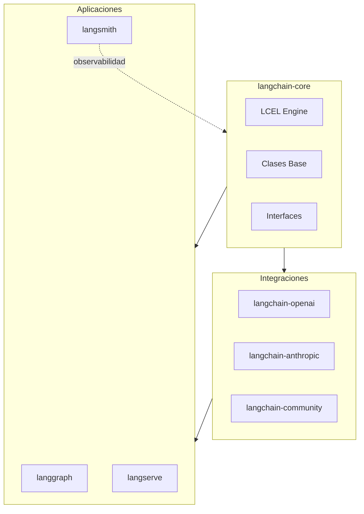
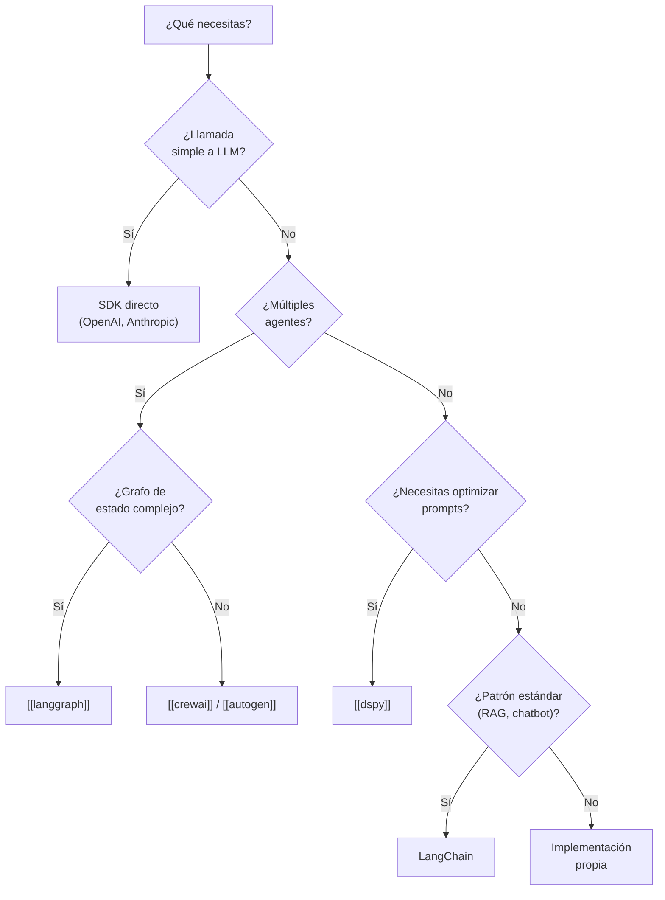

# LangChain Deep Dive

> [!abstract] Resumen
> LangChain es el ==framework más adoptado== para construir aplicaciones basadas en LLMs. Su ecosistema se divide en *langchain-core*, *langchain-community* y *langchain-experimental*. El componente central, ==LCEL (*LangChain Expression Language*)== permite componer cadenas mediante el operador pipe (`|`) con soporte nativo de *streaming*, ejecución en lotes y trazabilidad. Este documento analiza cuándo LangChain aporta valor real y cuándo introduce complejidad innecesaria.
> ^resumen

---

## Arquitectura del ecosistema

El ecosistema LangChain se reorganizó significativamente a partir de la versión 0.2. La estructura actual separa responsabilidades de forma clara:

| Paquete | Propósito | Estabilidad |
|---------|-----------|-------------|
| `langchain-core` | ==Abstracciones base, LCEL, interfaces== | Estable |
| `langchain` | Cadenas cognitivas, agentes legacy | Estable |
| `langchain-community` | Integraciones de terceros | Variable |
| `langchain-openai` | Integración oficial OpenAI | ==Estable== |
| `langchain-anthropic` | Integración oficial Anthropic | ==Estable== |
| `langchain-experimental` | Funciones experimentales | Inestable |
| `langgraph` | Grafos de estado para agentes | Estable |
| `langserve` | Despliegue como API REST | Estable |

> [!info] Separación de paquetes
> La decisión de separar integraciones en paquetes independientes (`langchain-openai`, `langchain-anthropic`, etc.) resuelve el problema histórico de dependencias excesivas. Antes, instalar `langchain` arrastraba decenas de dependencias innecesarias.



---

## LCEL — LangChain Expression Language

*LCEL* es el sistema de composición declarativa que reemplazó las antiguas `LLMChain`, `SequentialChain` y similares. Permite construir pipelines complejos mediante el operador `|` (pipe) de Python[^1].

### Principios fundamentales

LCEL se basa en el concepto de *Runnable*: cualquier componente que implemente la interfaz `Runnable` puede encadenarse. Los métodos clave son:

- `invoke(input)` — ejecución síncrona individual
- `ainvoke(input)` — ejecución asíncrona individual
- `batch(inputs)` — procesamiento en lote con paralelismo configurable
- `stream(input)` — *streaming* token a token
- `astream_events(input)` — eventos de *streaming* con metadatos

> [!tip] Streaming gratuito
> Si cada componente en tu cadena soporta *streaming*, ==LCEL propaga el streaming automáticamente== de extremo a extremo sin configuración adicional. Esto es especialmente valioso en aplicaciones de chat donde la latencia percibida importa.

### Composición con pipes

> [!example]- Ejemplo completo de cadena LCEL
> ```python
> from langchain_core.prompts import ChatPromptTemplate
> from langchain_core.output_parsers import StrOutputParser
> from langchain_openai import ChatOpenAI
> from langchain_core.runnables import RunnablePassthrough, RunnableLambda
>
> # Definir componentes
> prompt = ChatPromptTemplate.from_messages([
>     ("system", "Eres un experto en {domain}. Responde de forma concisa."),
>     ("human", "{question}")
> ])
>
> model = ChatOpenAI(model="gpt-4o", temperature=0.1)
> parser = StrOutputParser()
>
> # Componer con pipes
> chain = prompt | model | parser
>
> # Ejecución síncrona
> result = chain.invoke({
>     "domain": "arquitectura de software",
>     "question": "¿Qué es CQRS?"
> })
>
> # Streaming
> for chunk in chain.stream({
>     "domain": "arquitectura de software",
>     "question": "Explica event sourcing"
> }):
>     print(chunk, end="", flush=True)
>
> # Batch con paralelismo
> results = chain.batch(
>     [{"domain": "ML", "question": f"Pregunta {i}"} for i in range(10)],
>     config={"max_concurrency": 5}
> )
> ```

### RunnableParallel y RunnablePassthrough

Para ejecutar ramas en paralelo o preservar datos a través de la cadena:

> [!example]- Patrón RAG con LCEL
> ```python
> from langchain_core.runnables import RunnableParallel, RunnablePassthrough
> from langchain_openai import OpenAIEmbeddings
> from langchain_community.vectorstores import Chroma
>
> vectorstore = Chroma(embedding_function=OpenAIEmbeddings())
> retriever = vectorstore.as_retriever(search_kwargs={"k": 4})
>
> def format_docs(docs):
>     return "\n\n".join(doc.page_content for doc in docs)
>
> rag_prompt = ChatPromptTemplate.from_template(
>     """Contexto: {context}
>
>     Pregunta: {question}
>
>     Responde basándote solo en el contexto proporcionado."""
> )
>
> # RunnableParallel ejecuta context y question en paralelo
> rag_chain = (
>     RunnableParallel(
>         context=retriever | format_docs,
>         question=RunnablePassthrough()
>     )
>     | rag_prompt
>     | model
>     | parser
> )
>
> answer = rag_chain.invoke("¿Cómo funciona PagedAttention?")
> ```

### RunnableBranch para lógica condicional

> [!example]- Enrutamiento condicional
> ```python
> from langchain_core.runnables import RunnableBranch
>
> # Clasificador previo
> classifier = ChatPromptTemplate.from_template(
>     "Clasifica esta pregunta como 'tecnica' o 'general': {question}"
> ) | model | parser
>
> # Ramas especializadas
> technical_chain = ChatPromptTemplate.from_template(
>     "Como ingeniero senior, responde técnicamente: {question}"
> ) | model | parser
>
> general_chain = ChatPromptTemplate.from_template(
>     "Responde de forma accesible: {question}"
> ) | model | parser
>
> # Branch basado en clasificación
> branch = RunnableBranch(
>     (lambda x: "tecnica" in x["topic"].lower(), technical_chain),
>     general_chain  # default
> )
>
> full_chain = (
>     RunnableParallel(
>         topic=classifier,
>         question=RunnablePassthrough()
>     )
>     | branch
> )
> ```

---

## Componentes principales

### Prompts

LangChain ofrece abstracciones para gestionar *prompts* de forma estructurada:

| Clase | Uso | Ejemplo |
|-------|-----|---------|
| `ChatPromptTemplate` | ==Plantillas de chat con roles== | Sistema + usuario |
| `FewShotPromptTemplate` | Ejemplos dinámicos | Selección por similitud |
| `MessagesPlaceholder` | Inyectar historial | Conversaciones |
| `PipelinePromptTemplate` | Componer prompts | Prompts modulares |

> [!warning] Prompts estáticos vs dinámicos
> Para casos simples, un *f-string* de Python es más legible que `ChatPromptTemplate`. No uses abstracciones de LangChain cuando un string formateado basta. La abstracción aporta valor cuando necesitas ==selección dinámica de ejemplos==, validación de variables o serialización.

### Modelos

LangChain abstrae dos tipos de modelos:

- **`BaseChatModel`** — interfaz de chat (mensajes entrada/salida). Es la interfaz dominante hoy.
- **`BaseLLM`** — interfaz de completado (texto entrada/salida). Legacy, en desuso progresivo.

La abstracción permite intercambiar proveedores sin cambiar lógica de negocio, similar a lo que [[llm-routers|LiteLLM]] logra a nivel de API. Sin embargo, cada integración puede exponer parámetros específicos del proveedor.

> [!tip] Binding de herramientas
> `model.bind_tools(tools)` es el método estándar para activar *function calling* en cualquier modelo compatible. Retorna un modelo que incluye las definiciones de herramientas en cada llamada.

### Output Parsers

Los *output parsers* transforman la salida del modelo en estructuras de datos:

```python
from langchain_core.output_parsers import JsonOutputParser
from pydantic import BaseModel, Field

class MovieReview(BaseModel):
    title: str = Field(description="Título de la película")
    rating: float = Field(ge=0, le=10, description="Puntuación del 0 al 10")
    summary: str = Field(description="Resumen en una frase")

parser = JsonOutputParser(pydantic_object=MovieReview)

chain = prompt | model | parser  # Retorna dict validado
```

> [!danger] Structured Output nativo
> Desde 2024, la mayoría de proveedores soportan ==*structured output* nativo== (JSON mode, tool use). Para nuevos proyectos, preferir `model.with_structured_output(Schema)` sobre output parsers manuales. Es más fiable y no requiere instrucciones de formato en el prompt.

### Retrievers

La interfaz `BaseRetriever` unifica el acceso a cualquier fuente de documentos:

```python
# Todos estos exponen la misma interfaz .invoke(query)
vector_retriever = vectorstore.as_retriever()
bm25_retriever = BM25Retriever.from_documents(docs)
ensemble = EnsembleRetriever(
    retrievers=[vector_retriever, bm25_retriever],
    weights=[0.6, 0.4]
)
```

Esto conecta directamente con la infraestructura descrita en [[vector-infra]] y los patrones de [[orchestration-patterns|orquestación]].

### Tools (Herramientas)

Las herramientas en LangChain siguen la interfaz `BaseTool` o el decorador `@tool`:

```python
from langchain_core.tools import tool

@tool
def search_database(query: str, limit: int = 10) -> str:
    """Busca en la base de datos interna. Usar para consultas de datos estructurados."""
    # implementación
    return results
```

> [!info] Comparación con herramientas de Architect
> [[architect-overview|Architect]] implementa su propio sistema `BaseTool` con registro y descubrimiento automático. La diferencia clave es que LangChain tools son ==invocadas por el framework==, mientras que en Architect ==el agente decide directamente== qué herramienta ejecutar dentro de su loop.

---

## Cuándo usar LangChain

### Casos donde aporta valor

> [!success] Usa LangChain cuando...
> - Necesitas ==prototipado rápido== con múltiples proveedores LLM
> - Tu aplicación sigue patrones estándar (RAG, chatbot, agente con tools)
> - Quieres la integración nativa con [[langgraph|LangGraph]] para agentes complejos
> - Necesitas observabilidad con LangSmith sin esfuerzo adicional
> - Tu equipo ya conoce el ecosistema y puede navegar las abstracciones

### Casos donde NO usar LangChain

> [!failure] Evita LangChain cuando...
> - Tu caso de uso es una ==llamada directa a un API== de LLM — usa el SDK del proveedor
> - Necesitas ==control total== sobre el ciclo de vida de las llamadas
> - Tu aplicación es de alto rendimiento y cada milisegundo cuenta
> - El equipo no quiere acoplar su aplicación a las abstracciones de un framework externo
> - Estás construyendo algo que [[dspy|DSPy]] resuelve mejor (optimización sistemática de prompts)

---

## Críticas y limitaciones

### Sobre-abstracción

LangChain ha recibido críticas significativas por su nivel de abstracción[^2]:

> [!quote] Crítica común
> "LangChain introduce 7 capas de abstracción para hacer algo que toma 5 líneas con el SDK de OpenAI directamente."
> — Sentimiento frecuente en la comunidad

El problema real no es la abstracción en sí, sino que las abstracciones a veces ==filtran detalles de implementación== o impiden acceder a funcionalidad específica del proveedor.

### Breaking changes históricos

| Versión | Cambio roto | Impacto |
|---------|-------------|---------|
| 0.1 → 0.2 | Deprecación masiva de imports | Alto |
| 0.2 → 0.3 | Eliminación de APIs legacy | ==Medio-Alto== |
| community splits | Paquetes separados por proveedor | Medio |

> [!warning] Estrategia de migración
> Fijar versiones exactas en `requirements.txt`. No usar rangos (`>=0.2`). Los *breaking changes* entre versiones menores han sido históricamente frecuentes, aunque la situación ha mejorado desde la separación en paquetes.

### Alternativas según el caso de uso



---

## Integración con LangSmith

*LangSmith* es la plataforma de observabilidad y testing del ecosistema LangChain:

- **Trazas** — visualización completa de la cadena de llamadas
- **Evaluación** — datasets y métricas para evaluar cadenas
- **Monitoreo** — latencia, costos, errores en producción
- **Hub** — compartir y versionar prompts

> [!tip] Activación
> Basta con configurar `LANGCHAIN_TRACING_V2=true` y `LANGCHAIN_API_KEY` para que todas las cadenas LCEL emitan trazas automáticamente a LangSmith.

La observabilidad es un aspecto fundamental en producción, complementando lo descrito en [[api-gateways-llm]] para monitoreo a nivel de gateway.

---

## Patrones avanzados con LCEL

### Retry con fallback

```python
from langchain_openai import ChatOpenAI
from langchain_anthropic import ChatAnthropic

primary = ChatOpenAI(model="gpt-4o")
fallback = ChatAnthropic(model="claude-sonnet-4-20250514")

# Si primary falla, usa fallback automáticamente
resilient_model = primary.with_fallbacks([fallback])

chain = prompt | resilient_model | parser
```

Este patrón es análogo a los *fallbacks* que [[llm-routers|LiteLLM]] gestiona a nivel de proxy, pero opera a nivel de aplicación.

### Caching

```python
from langchain_core.globals import set_llm_cache
from langchain_community.cache import RedisCache
import redis

set_llm_cache(RedisCache(redis_=redis.Redis()))
# Todas las llamadas idénticas se cachean automáticamente
```

> [!question] ¿Caché a nivel de framework o de gateway?
> Si usas un [[api-gateways-llm|gateway de API]], el caché probablemente debería estar allí para beneficiar a todas las aplicaciones. El caché de LangChain es útil cuando ==no hay gateway== o cuando necesitas caché semántico (por similitud, no por igualdad exacta).

---

## Relación con el ecosistema

LangChain interactúa con los cuatro agentes del ecosistema de formas distintas:

- **[[intake-overview|Intake]]** — podría usar LangChain internamente para sus cadenas de transformación de requisitos, aunque la tendencia es usar [[llm-routers|LiteLLM]] directamente para mantener la stack ligera
- **[[architect-overview|Architect]]** — implementa su propio sistema de agentes y herramientas sin depender de LangChain. Su enfoque de `BaseTool` con registro automático y YAML para configuración de agentes es más directo que las abstracciones de LangChain
- **[[vigil-overview|Vigil]]** — como escáner determinista sin dependencias de framework, no usa ni necesita LangChain. Sus reglas se ejecutan sin llamadas a LLM
- **[[licit-overview|Licit]]** — como CLI de cumplimiento, puede consumir la salida de cadenas LangChain pero no depende del framework

> [!info] Decisión arquitectónica
> El ecosistema optó por ==no depender de LangChain== para sus componentes core. Las razones: evitar acoplamiento a un framework externo con historial de breaking changes, y mantener cada agente lo más ligero posible. LiteLLM cubre la necesidad de abstracción multi-proveedor sin la sobrecarga de LangChain.

---

## Enlaces y referencias

> [!quote]- Bibliografía y recursos
> - [^1]: Documentación oficial LCEL — https://python.langchain.com/docs/concepts/lcel/
> - [^2]: "Why I'm Not Using LangChain" — análisis crítico frecuente en la comunidad de desarrollo IA
> - Repositorio GitHub: `langchain-ai/langchain` — código fuente y ejemplos
> - LangSmith: plataforma de observabilidad — https://smith.langchain.com
> - LangChain Hub: repositorio de prompts compartidos
> - Comparativa de frameworks: véase [[crewai]], [[autogen]], [[dspy]]

[^1]: LCEL fue introducido como reemplazo de las cadenas legacy (`LLMChain`, `SequentialChain`, etc.) que requerían subclases y herencia compleja.
[^2]: La crítica de sobre-abstracción ha llevado a mejoras significativas en v0.2+, incluyendo la separación de paquetes y la simplificación de interfaces.
