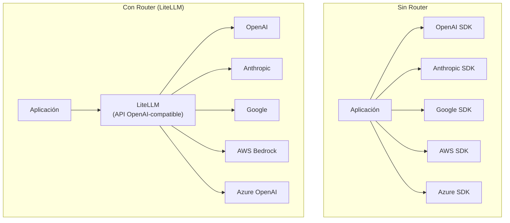
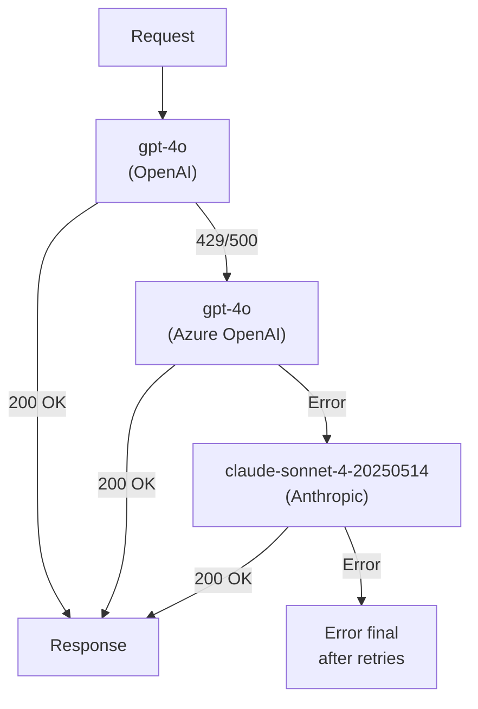
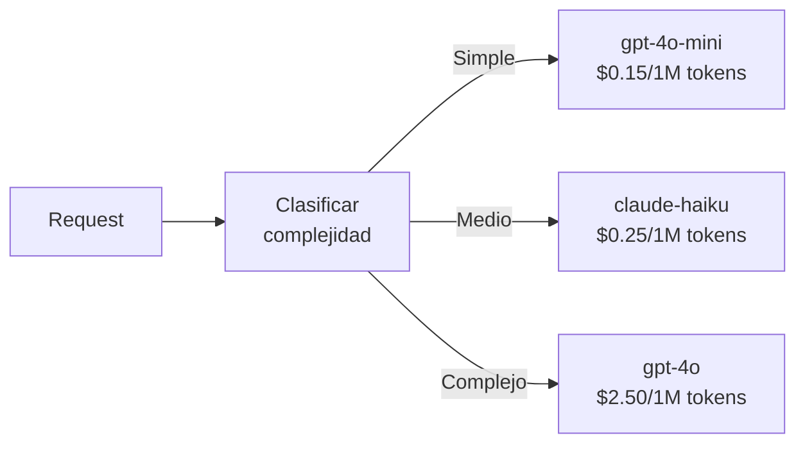

# LLM Routers y Load Balancing

> [!abstract] Resumen
> Los *LLM routers* resuelven un problema crítico en producción: ==abstraer la complejidad de múltiples proveedores de LLM== bajo una interfaz unificada. *LiteLLM* es el estándar de facto, soportando ==100+ proveedores== con una API compatible con OpenAI. Proporciona fallbacks automáticos, reintentos, caché, gestión de presupuesto y load balancing. [[architect-overview|Architect]] usa LiteLLM como su capa de abstracción para operación model-agnostic.
> ^resumen

---

## El problema del multi-proveedor

Cada proveedor de LLM tiene su propio SDK, formato de API, y particularidades:



> [!danger] Vendor lock-in sin router
> Sin un router, tu aplicación se acopla al SDK y formato de un proveedor específico. Cambiar de proveedor requiere ==reescribir toda la lógica de llamadas==, manejo de errores, parsing de respuestas y streaming. Con un router, cambiar es modificar una variable de configuración.

---

## LiteLLM — El estándar de facto

### Uso como librería

```python
import litellm

# Misma función para cualquier proveedor
response = litellm.completion(
    model="gpt-4o",                    # OpenAI
    messages=[{"role": "user", "content": "Hola"}]
)

response = litellm.completion(
    model="anthropic/claude-sonnet-4-20250514",   # Anthropic
    messages=[{"role": "user", "content": "Hola"}]
)

response = litellm.completion(
    model="bedrock/anthropic.claude-3-sonnet",  # AWS Bedrock
    messages=[{"role": "user", "content": "Hola"}]
)

response = litellm.completion(
    model="ollama/llama3.1",           # Local (Ollama)
    messages=[{"role": "user", "content": "Hola"}],
    api_base="http://localhost:11434"
)
```

> [!tip] Prefijos de modelo
> LiteLLM usa prefijos para identificar proveedores: `anthropic/`, `bedrock/`, `azure/`, `ollama/`, `huggingface/`, etc. El modelo sin prefijo se asume ==OpenAI por defecto==.

### Proveedores soportados (selección)

| Proveedor | Prefijo | Modelos destacados |
|-----------|---------|-------------------|
| OpenAI | (sin prefijo) | ==gpt-4o, gpt-4o-mini== |
| Anthropic | `anthropic/` | ==claude-sonnet-4-20250514, claude-3-haiku== |
| Google | `gemini/` | gemini-1.5-pro, gemini-2.0-flash |
| AWS Bedrock | `bedrock/` | claude, llama, mistral |
| Azure OpenAI | `azure/` | gpt-4o (managed) |
| Mistral | `mistral/` | mistral-large, codestral |
| Groq | `groq/` | ==llama-3.1-70b (ultra-rápido)== |
| Together | `together_ai/` | Modelos open-source |
| Ollama | `ollama/` | Modelos locales |
| DeepSeek | `deepseek/` | deepseek-chat, deepseek-coder |

---

## LiteLLM Proxy Server

Para uso en producción, LiteLLM puede desplegarse como un ==proxy centralizado==:

### Configuración

```yaml
# litellm_config.yaml
model_list:
  - model_name: "gpt-4o"
    litellm_params:
      model: "openai/gpt-4o"
      api_key: "sk-..."
      rpm: 100  # Rate limit: requests per minute

  - model_name: "gpt-4o"  # Segundo deployment para load balancing
    litellm_params:
      model: "azure/gpt-4o-deployment"
      api_base: "https://myorg.openai.azure.com/"
      api_key: "azure-key-..."
      rpm: 200

  - model_name: "claude-sonnet"
    litellm_params:
      model: "anthropic/claude-sonnet-4-20250514"
      api_key: "sk-ant-..."

  - model_name: "fast-model"
    litellm_params:
      model: "groq/llama-3.1-70b-versatile"
      api_key: "gsk_..."

litellm_settings:
  drop_params: true        # Ignorar parámetros no soportados
  set_verbose: false
  cache: true              # Activar caché
  cache_params:
    type: "redis"
    host: "redis"
    port: 6379

general_settings:
  master_key: "sk-master-key-..."
  database_url: "postgresql://user:pass@db:5432/litellm"
```

> [!example]- Despliegue con Docker
> ```yaml
> # docker-compose.yaml
> version: "3.9"
> services:
>   litellm:
>     image: ghcr.io/berriai/litellm:main-latest
>     ports:
>       - "4000:4000"
>     volumes:
>       - ./litellm_config.yaml:/app/config.yaml
>     command: ["--config", "/app/config.yaml", "--port", "4000"]
>     environment:
>       - DATABASE_URL=postgresql://user:pass@db:5432/litellm
>     depends_on:
>       - db
>       - redis
>
>   db:
>     image: postgres:16
>     environment:
>       POSTGRES_USER: user
>       POSTGRES_PASSWORD: pass
>       POSTGRES_DB: litellm
>     volumes:
>       - pgdata:/var/lib/postgresql/data
>
>   redis:
>     image: redis:7-alpine
>     ports:
>       - "6379:6379"
>
> volumes:
>   pgdata:
> ```

### Consumir el proxy

Una vez desplegado, cualquier aplicación puede usar el proxy como si fuera la API de OpenAI:

```python
from openai import OpenAI

# Apuntar al proxy LiteLLM
client = OpenAI(
    base_url="http://litellm-proxy:4000",
    api_key="sk-master-key-..."
)

# Usar cualquier modelo configurado en el proxy
response = client.chat.completions.create(
    model="gpt-4o",  # Se balancea entre OpenAI y Azure automáticamente
    messages=[{"role": "user", "content": "Hola"}]
)
```

> [!success] Ventaja del proxy
> Las aplicaciones ==no necesitan saber qué proveedor real están usando==. El proxy gestiona routing, fallbacks, caché y rate limiting de forma transparente. Esto es exactamente lo que [[architect-overview|Architect]] hace para su operación model-agnostic.

---

## Fallbacks y reintentos

### Fallback por modelo

```python
import litellm
from litellm import completion

# Si gpt-4o falla, intenta claude, luego llama
response = completion(
    model="gpt-4o",
    messages=[{"role": "user", "content": "Hola"}],
    fallbacks=["anthropic/claude-sonnet-4-20250514", "groq/llama-3.1-70b-versatile"]
)
```

### Configuración de reintentos

```python
litellm.num_retries = 3
litellm.retry_after = 5  # Segundos entre reintentos

# O por llamada
response = completion(
    model="gpt-4o",
    messages=messages,
    num_retries=3,
    timeout=30  # Timeout en segundos
)
```

> [!warning] Reintentos y costos
> Cada reintento ==consume tokens y dinero==. Configura un máximo sensato. Para errores 400 (bad request), no reintentes — el request está mal formado. Para errores 429 (rate limit) y 500+ (server error), los reintentos con backoff son apropiados.

### Estrategia de fallback en producción



---

## Caché

LiteLLM soporta múltiples backends de caché:

| Backend | Latencia | Persistencia | Uso |
|---------|----------|-------------|-----|
| In-memory | ==Más baja== | No | Desarrollo |
| Redis | Baja | Sí | ==Producción== |
| S3 | Media | Sí | Alta durabilidad |
| Disco | Baja | Sí | Single-server |

```python
import litellm
from litellm.caching import Cache

# Caché en Redis
litellm.cache = Cache(
    type="redis",
    host="localhost",
    port=6379,
    ttl=3600  # 1 hora
)

# Las llamadas idénticas se cachean automáticamente
result1 = completion(model="gpt-4o", messages=messages)  # API call
result2 = completion(model="gpt-4o", messages=messages)  # Cache hit
```

> [!question] ¿Caché en el router o en el gateway?
> Si usas un [[api-gateways-llm|API gateway]] además de LiteLLM, el caché puede estar en cualquiera de los dos. La recomendación: ==caché en LiteLLM para caché semántico== (por similitud), y caché en el gateway para ==caché exacto== (misma request = misma response). Ver [[api-gateways-llm]] para detalles.

---

## Gestión de presupuesto

El proxy LiteLLM incluye control de costos:

```python
# Crear usuario con presupuesto
curl -X POST 'http://litellm:4000/user/new' \
  -H 'Authorization: Bearer sk-master-key' \
  -d '{
    "user_id": "team-backend",
    "max_budget": 100.0,       # USD mensuales
    "budget_duration": "monthly",
    "models": ["gpt-4o", "claude-sonnet"]  # Modelos permitidos
  }'
```

> [!tip] Budget alerts
> Configura alertas al 80% del presupuesto para evitar sorpresas. LiteLLM puede enviar webhooks cuando un usuario o equipo ==se acerca a su límite de gasto==.

| Feature de presupuesto | Descripción |
|----------------------|-------------|
| `max_budget` | ==Presupuesto máximo en USD== |
| `budget_duration` | daily, weekly, monthly |
| `max_parallel_requests` | Concurrencia máxima |
| `tpm_limit` | Tokens por minuto |
| `rpm_limit` | Requests por minuto |
| `models` | Lista blanca de modelos |

---

## Cómo Architect usa LiteLLM

[[architect-overview|Architect]] integra LiteLLM como su capa de abstracción de proveedores:

```python
# En Architect, el modelo se configura via CLI o YAML
# Internamente usa LiteLLM para resolver el proveedor
architect --model "anthropic/claude-sonnet-4-20250514"
architect --model "openai/gpt-4o"
architect --model "ollama/codestral"
```

> [!info] Beneficios para Architect
> - ==Cambiar de modelo== sin cambiar código
> - Fallbacks automáticos si un proveedor falla
> - Soporte para modelos locales (Ollama) y remotos
> - Streaming unificado independiente del proveedor
> - Conteo de tokens consistente entre proveedores

---

## Otros routers de LLM

### Martian

Router inteligente que selecciona el modelo óptimo por query:

- Analiza la complejidad de cada request
- Enruta requests simples a modelos baratos
- Enruta requests complejas a modelos potentes
- ==Reduce costos 30-50%== sin pérdida de calidad significativa

### Not Diamond

Router basado en ML que predice qué modelo dará la mejor respuesta:

- Entrenado en benchmarks y evaluaciones
- Selección por tarea (code, math, reasoning, creative)
- API compatible con OpenAI

### RouteLLM

Framework open-source de routing:

```python
from routellm import Controller

controller = Controller(
    routers=["mf"],  # Matrix Factorization router
    strong_model="gpt-4o",
    weak_model="gpt-4o-mini"
)

# Enruta automáticamente según complejidad
response = controller.completion(
    model="router-mf-0.5",  # Threshold de routing
    messages=messages
)
```

---

## Estrategias de routing

### Cost-based routing



### Capability-based routing

| Tarea | Modelo óptimo | Razón |
|-------|--------------|-------|
| Código | ==Codestral / GPT-4o== | Mejor en benchmarks de code |
| Razonamiento | Claude Opus / o1 | Mejor *chain-of-thought* |
| Multimodal | Gemini 1.5 Pro | ==Ventana de contexto enorme== |
| Velocidad | Groq + Llama 3.1 | Inferencia ultra-rápida |
| Costos bajos | GPT-4o-mini | Mejor ratio calidad/precio |

### Latency-based routing

Enruta al proveedor con menor latencia en el momento:

```python
# LiteLLM soporta routing por latencia
model_list = [
    {"model_name": "fast-gpt4", "litellm_params": {
        "model": "openai/gpt-4o", "rpm": 100}},
    {"model_name": "fast-gpt4", "litellm_params": {
        "model": "azure/gpt-4o", "rpm": 200}},
]

# routing_strategy="latency-based-routing"
router = litellm.Router(
    model_list=model_list,
    routing_strategy="latency-based-routing"
)
```

> [!success] Routing combinado
> La estrategia más efectiva combina múltiples factores: ==primero filtra por capacidad== (¿el modelo puede hacer la tarea?), ==luego por latencia== (¿cuál responde más rápido?), ==finalmente por costo== (¿cuál es más barato?). LiteLLM soporta esto con configuraciones de router avanzadas.

---

## Relación con el ecosistema

Los LLM routers son infraestructura fundamental para el ecosistema:

- **[[intake-overview|Intake]]** — usa LiteLLM para sus llamadas a LLM durante la transformación de requisitos. El router permite que Intake opere con ==cualquier proveedor sin cambios de código==, facilitando despliegues en diferentes entornos (cloud, on-premise)
- **[[architect-overview|Architect]]** — LiteLLM es ==componente core de Architect==. Toda llamada a modelo pasa por LiteLLM, habilitando el flag `--model` para cambiar de proveedor dinámicamente. Los fallbacks protegen la ejecución de agentes largos contra caídas de proveedores
- **[[vigil-overview|Vigil]]** — no aplica. Vigil es determinista y no hace llamadas a LLMs
- **[[licit-overview|Licit]]** — si Licit incorporara análisis de licencias con LLM, usaría LiteLLM (a través de Architect o Intake) para la abstracción de proveedores

> [!tip] LiteLLM como infraestructura compartida
> Desplegar un ==proxy LiteLLM centralizado== que sirva a Intake, Architect y cualquier otro componente es la arquitectura recomendada. Un solo punto de gestión de API keys, presupuestos, caché y observabilidad para todo el ecosistema.

---

## Enlaces y referencias

> [!quote]- Bibliografía y recursos
> - [^1]: Documentación LiteLLM — https://docs.litellm.ai
> - [^2]: Repositorio GitHub: `BerriAI/litellm`
> - RouteLLM Paper: "RouteLLM: Learning to Route LLMs with Preference Data"
> - Martian: https://withmartian.com — router inteligente
> - Not Diamond: https://notdiamond.ai — selección por ML
> - Comparativa con gateways: [[api-gateways-llm]]

[^1]: LiteLLM soporta más de 100 proveedores y es usado por empresas como Scale AI, Replit, y Weights & Biases en producción.
[^2]: El proxy de LiteLLM se puede desplegar como un servicio independiente con PostgreSQL para persistencia y Redis para caché, funcionando como infraestructura compartida.
