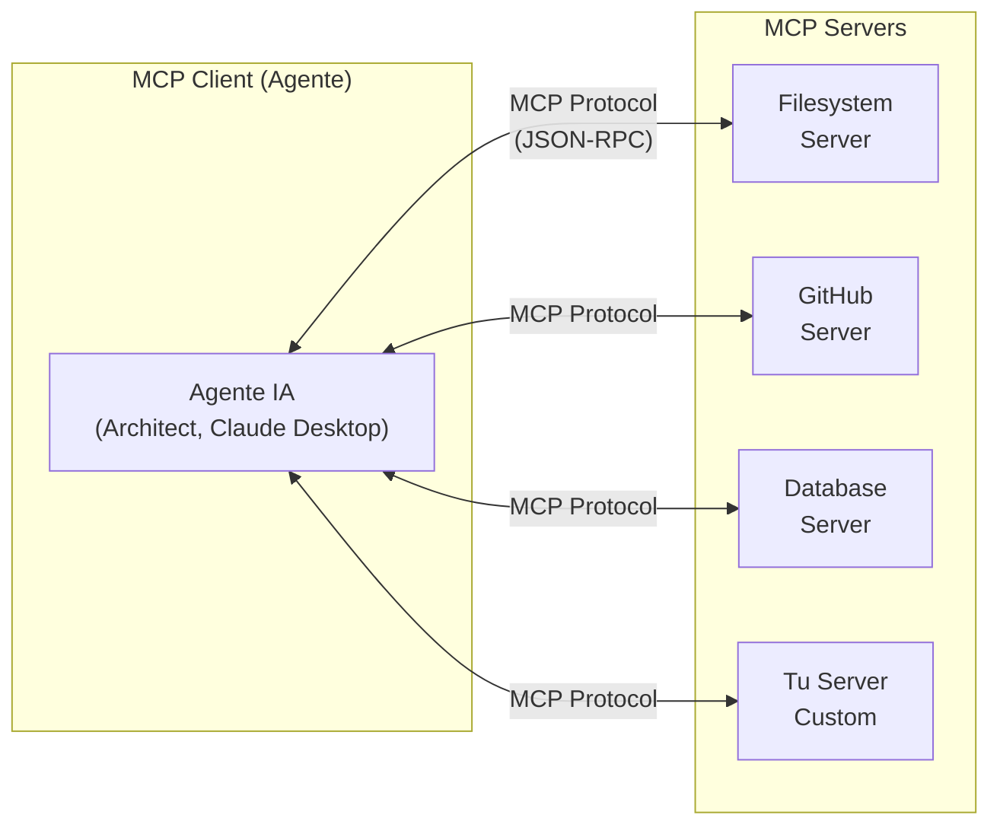
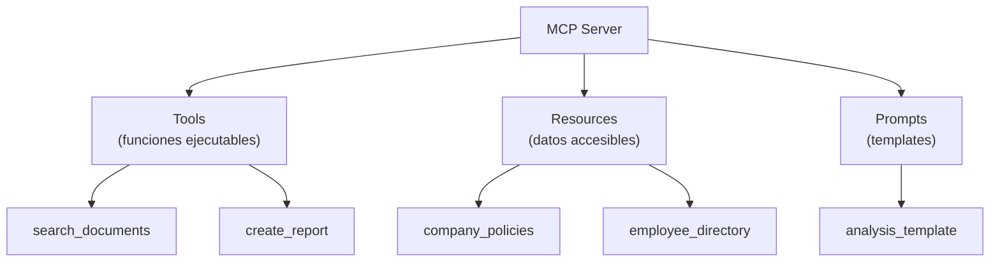
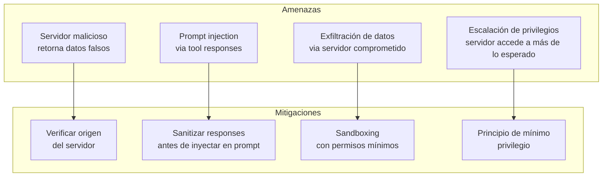

# Ecosistema de Servidores MCP

> [!abstract] Resumen
> El *Model Context Protocol* (MCP) es un estándar abierto para ==conectar modelos de IA con herramientas y fuentes de datos externas==. El ecosistema de servidores MCP incluye servidores oficiales (filesystem, GitHub, Slack, bases de datos), servidores comunitarios (browser, búsqueda, ejecución de código), y la posibilidad de construir servidores propios. Los transportes soportados son *stdio* (local), *SSE* (HTTP streaming) y ==*Streamable HTTP*== (el nuevo estándar). [[architect-overview|Architect]] funciona como ==cliente MCP== que descubre herramientas remotas. [[intake-overview|Intake]] puede ==servir como servidor MCP==.
> ^resumen

---

## ¿Qué es MCP?

*Model Context Protocol* define una interfaz estándar para que los agentes de IA descubran y usen herramientas externas:



### Capacidades del protocolo

| Capacidad | Descripción | Dirección |
|-----------|-------------|-----------|
| **Tools** | ==Funciones ejecutables== por el agente | Server → Client |
| **Resources** | Datos/documentos accesibles | Server → Client |
| **Prompts** | Templates de prompts reutilizables | Server → Client |
| **Sampling** | Pedir al LLM que genere (inverso) | Client → Server |

> [!info] MCP vs Function Calling
> *Function calling* (OpenAI, Anthropic) define herramientas ==dentro de una llamada al LLM==. MCP define herramientas ==externamente al LLM==, permitiendo descubrimiento dinámico. Un cliente MCP descubre qué herramientas existen en runtime, sin hardcodear definiciones.

---

## Servidores MCP oficiales

### Filesystem

Acceso controlado al sistema de archivos:

```json
{
  "mcpServers": {
    "filesystem": {
      "command": "npx",
      "args": ["-y", "@modelcontextprotocol/server-filesystem", "/ruta/permitida"]
    }
  }
}
```

| Tool | Descripción |
|------|-------------|
| `read_file` | Leer contenido de archivo |
| `write_file` | Escribir contenido a archivo |
| `list_directory` | Listar directorio |
| `search_files` | Buscar archivos por patrón |
| `get_file_info` | Metadatos de archivo |

> [!warning] Seguridad del filesystem server
> El servidor filesystem ==restringe acceso a la ruta especificada==. Nunca configures la raíz `/` como ruta permitida. Usa rutas específicas del proyecto:
> ```json
> "args": ["-y", "@modelcontextprotocol/server-filesystem", "/home/user/project"]
> ```

### GitHub

Interacción con repositorios GitHub:

```json
{
  "mcpServers": {
    "github": {
      "command": "npx",
      "args": ["-y", "@modelcontextprotocol/server-github"],
      "env": {
        "GITHUB_PERSONAL_ACCESS_TOKEN": "ghp_..."
      }
    }
  }
}
```

| Tool | Descripción |
|------|-------------|
| `create_or_update_file` | ==Crear/actualizar archivos en repo== |
| `search_repositories` | Buscar repositorios |
| `create_issue` | Crear issues |
| `create_pull_request` | ==Crear PRs== |
| `list_commits` | Listar commits |
| `get_file_contents` | Leer archivos de repo |

### Bases de datos

| Servidor | Base de datos | Operaciones |
|----------|--------------|-------------|
| `@modelcontextprotocol/server-postgres` | PostgreSQL | ==Read-only queries== |
| `@modelcontextprotocol/server-sqlite` | SQLite | Read/Write |
| Community: `mysql-mcp` | MySQL | Read-only |

> [!danger] Servidores de base de datos en producción
> Los servidores MCP de bases de datos deben ejecutar ==solo queries de lectura en producción==. Un agente con acceso de escritura a una base de datos de producción puede causar pérdida de datos irreversible. Usa un usuario de DB con permisos de solo lectura.

### Slack

```json
{
  "mcpServers": {
    "slack": {
      "command": "npx",
      "args": ["-y", "@modelcontextprotocol/server-slack"],
      "env": {
        "SLACK_BOT_TOKEN": "xoxb-...",
        "SLACK_TEAM_ID": "T..."
      }
    }
  }
}
```

---

## Servidores MCP comunitarios

### Browser / Puppeteer

```json
{
  "mcpServers": {
    "puppeteer": {
      "command": "npx",
      "args": ["-y", "@modelcontextprotocol/server-puppeteer"]
    }
  }
}
```

> [!tip] Web scraping con MCP
> El servidor Puppeteer permite al agente ==navegar páginas web, hacer screenshots, y extraer contenido==. Útil para agentes que necesitan investigar documentación web o verificar deployments.

### Búsqueda web

| Servidor | Backend | Costo |
|----------|---------|-------|
| `@modelcontextprotocol/server-brave-search` | Brave Search | ==Freemium== |
| `tavily-mcp` | Tavily | Pay-per-search |
| `exa-mcp` | Exa | Pay-per-search |

### Ejecución de código

| Servidor | Runtime | Sandboxing |
|----------|---------|-----------|
| `code-runner-mcp` | Python, Node | Docker |
| `e2b-mcp` | ==E2B sandboxed== | ==Cloud sandbox== |
| `jupyter-mcp` | Jupyter kernels | Local |

---

## Construyendo tu propio servidor MCP

### Estructura de un servidor

Un servidor MCP expone tres tipos de capacidades:



### Implementación en Python

> [!example]- Servidor MCP personalizado completo
> ```python
> from mcp.server import Server
> from mcp.server.stdio import stdio_server
> from mcp.types import (
>     Tool, TextContent, Resource,
>     GetPromptResult, PromptMessage
> )
> import json
>
> server = Server("my-custom-server")
>
> # Definir herramientas
> @server.list_tools()
> async def list_tools():
>     return [
>         Tool(
>             name="search_knowledge_base",
>             description="Busca en la base de conocimiento interna",
>             inputSchema={
>                 "type": "object",
>                 "properties": {
>                     "query": {
>                         "type": "string",
>                         "description": "Consulta de búsqueda"
>                     },
>                     "limit": {
>                         "type": "integer",
>                         "description": "Número de resultados",
>                         "default": 5
>                     }
>                 },
>                 "required": ["query"]
>             }
>         ),
>         Tool(
>             name="create_ticket",
>             description="Crea un ticket en el sistema de tracking",
>             inputSchema={
>                 "type": "object",
>                 "properties": {
>                     "title": {"type": "string"},
>                     "description": {"type": "string"},
>                     "priority": {
>                         "type": "string",
>                         "enum": ["low", "medium", "high"]
>                     }
>                 },
>                 "required": ["title", "description"]
>             }
>         )
>     ]
>
> @server.call_tool()
> async def call_tool(name: str, arguments: dict):
>     if name == "search_knowledge_base":
>         results = await search_kb(
>             arguments["query"],
>             arguments.get("limit", 5)
>         )
>         return [TextContent(type="text", text=json.dumps(results))]
>
>     elif name == "create_ticket":
>         ticket = await create_jira_ticket(
>             arguments["title"],
>             arguments["description"],
>             arguments.get("priority", "medium")
>         )
>         return [TextContent(
>             type="text",
>             text=f"Ticket creado: {ticket['id']}"
>         )]
>
> # Definir recursos
> @server.list_resources()
> async def list_resources():
>     return [
>         Resource(
>             uri="internal://policies/security",
>             name="Políticas de seguridad",
>             mimeType="text/markdown"
>         )
>     ]
>
> @server.read_resource()
> async def read_resource(uri: str):
>     if uri == "internal://policies/security":
>         content = load_security_policies()
>         return content
>
> # Ejecutar servidor
> async def main():
>     async with stdio_server() as (read, write):
>         await server.run(read, write)
>
> if __name__ == "__main__":
>     import asyncio
>     asyncio.run(main())
> ```

### Implementación en TypeScript

```typescript
import { Server } from "@modelcontextprotocol/sdk/server/index.js";
import { StdioServerTransport } from "@modelcontextprotocol/sdk/server/stdio.js";

const server = new Server({
  name: "my-server",
  version: "1.0.0"
}, {
  capabilities: { tools: {} }
});

server.setRequestHandler("tools/list", async () => ({
  tools: [{
    name: "greet",
    description: "Saluda a alguien",
    inputSchema: {
      type: "object",
      properties: {
        name: { type: "string", description: "Nombre" }
      },
      required: ["name"]
    }
  }]
}));

server.setRequestHandler("tools/call", async (request) => {
  if (request.params.name === "greet") {
    return {
      content: [{ type: "text", text: `¡Hola, ${request.params.arguments.name}!` }]
    };
  }
});

const transport = new StdioServerTransport();
await server.connect(transport);
```

---

## Transportes MCP

### stdio (local)

El agente lanza el servidor como un proceso hijo y se comunica vía stdin/stdout:

```
Client (proceso padre) ←→ stdin/stdout ←→ Server (proceso hijo)
```

> [!info] Cuándo usar stdio
> - Servidores que corren ==en la misma máquina== que el cliente
> - ==Máximo rendimiento== (sin overhead de red)
> - Más simple de configurar
> - Usado por Claude Desktop, Architect en modo local

### SSE (Server-Sent Events)

Transporte HTTP para servidores remotos:

```
Client ←→ HTTP (SSE para streaming) ←→ Server remoto
```

```python
# Servidor con SSE transport
from mcp.server.sse import SseServerTransport
from starlette.applications import Starlette
from starlette.routing import Route

transport = SseServerTransport("/messages")
app = Starlette(routes=[
    Route("/sse", endpoint=transport.handle_sse),
    Route("/messages", endpoint=transport.handle_post_message, methods=["POST"])
])
```

### Streamable HTTP (nuevo estándar)

==El transporte más nuevo y recomendado== para servidores remotos:

```
Client ←→ HTTP POST + streaming responses ←→ Server
```

| Transporte | Local | Remoto | Streaming | Complejidad |
|-----------|-------|--------|-----------|-------------|
| stdio | ==Sí== | No | Sí | ==Baja== |
| SSE | No | ==Sí== | Sí | Media |
| ==Streamable HTTP== | No | ==Sí== | ==Sí== | Media |

> [!tip] Migración de SSE a Streamable HTTP
> Streamable HTTP es el ==sucesor de SSE== como transporte remoto. Resuelve limitaciones de SSE (single connection, keep-alive issues). Para nuevos servidores, usa Streamable HTTP directamente. Para servidores existentes con SSE, migra cuando el soporte de clientes sea amplio.

---

## Descubrimiento y registro

### Registro local

```json
// ~/.config/mcp/servers.json (o equivalente)
{
  "mcpServers": {
    "knowledge-base": {
      "command": "python",
      "args": ["/path/to/kb_server.py"],
      "env": {"KB_API_KEY": "..."}
    },
    "github": {
      "command": "npx",
      "args": ["-y", "@modelcontextprotocol/server-github"],
      "env": {"GITHUB_PERSONAL_ACCESS_TOKEN": "ghp_..."}
    },
    "remote-api": {
      "url": "https://api.example.com/mcp",
      "transport": "streamable-http",
      "headers": {"Authorization": "Bearer token-..."}
    }
  }
}
```

### Descubrimiento dinámico

> [!question] ¿Cómo descubre un agente los servidores MCP disponibles?
> Actualmente, el descubrimiento es ==estático por configuración==. El agente lee un archivo de configuración que lista los servidores. No existe (aún) un protocolo de descubrimiento dinámico tipo DNS para MCP. Esto es un área activa de desarrollo en la especificación.

---

## Seguridad de servidores MCP

### Modelo de amenazas



> [!danger] Riesgos de servidores MCP no confiables
> Un servidor MCP malicioso puede:
> 1. ==Inyectar instrucciones== en las respuestas de herramientas (*prompt injection*)
> 2. ==Exfiltrar datos== que el agente le pasa como argumentos
> 3. ==Ejecutar código malicioso== en tu sistema (si tiene permisos)
> 4. ==Retornar información falsa== que el agente usa para tomar decisiones
>
> Trata los servidores MCP como ==código de terceros no confiable== y aplica sandboxing.

### Mejores prácticas

| Práctica | Descripción |
|----------|-------------|
| ==Mínimo privilegio== | Cada servidor accede solo a lo que necesita |
| Validación de input | Validar argumentos antes de ejecutar |
| Sandboxing | Docker, VM, o permisos de filesystem |
| Auditoría | ==Loggear todas las llamadas a herramientas== |
| Rate limiting | Limitar frecuencia de llamadas por servidor |
| TLS | Cifrar comunicación con servidores remotos |

---

## Architect como cliente MCP

[[architect-overview|Architect]] implementa el protocolo MCP como cliente, permitiéndole descubrir y usar herramientas de servidores MCP remotos:

```yaml
# Configuración de Architect para MCP
mcp_servers:
  - name: "project-tools"
    command: "python"
    args: ["/path/to/project_tools_server.py"]

  - name: "documentation"
    url: "https://docs-mcp.internal.company.com/mcp"
    transport: "streamable-http"
    headers:
      Authorization: "Bearer ${MCP_DOCS_TOKEN}"
```

> [!success] Beneficio de MCP para Architect
> MCP permite a Architect ==descubrir herramientas en runtime==. Si añades un nuevo servidor MCP a la configuración, Architect automáticamente descubre sus herramientas sin necesidad de modificar código. Esto es más flexible que el sistema `BaseTool` con registro estático.

### Intake como servidor MCP

[[intake-overview|Intake]] puede exponerse como servidor MCP, permitiendo que cualquier cliente MCP (Architect, Claude Desktop) use sus capacidades de transformación:

```python
# intake_mcp_server.py
@server.list_tools()
async def list_tools():
    return [
        Tool(
            name="transform_requirements",
            description="Transforma requisitos en bruto a especificaciones estructuradas",
            inputSchema={
                "type": "object",
                "properties": {
                    "requirements": {"type": "string"},
                    "format": {"type": "string", "enum": ["user_story", "technical_spec"]}
                },
                "required": ["requirements"]
            }
        )
    ]
```

---

## Relación con el ecosistema

MCP es el protocolo de integración del ecosistema:

- **[[intake-overview|Intake]]** — puede ==servir como servidor MCP==, exponiendo sus capacidades de transformación de requisitos a cualquier cliente MCP. Esto permite que Architect llame a Intake directamente para transformar requisitos como parte de un flujo de desarrollo
- **[[architect-overview|Architect]]** — funciona como ==cliente MCP== que descubre herramientas remotas. Combina herramientas nativas (BaseTool), herramientas YAML custom, y herramientas MCP en un pool unificado que el agente puede usar
- **[[vigil-overview|Vigil]]** — podría exponerse como servidor MCP ofreciendo una herramienta `scan_code` que cualquier agente pueda invocar para verificar seguridad de código generado
- **[[licit-overview|Licit]]** — podría exponerse como servidor MCP con herramientas `check_license` y `generate_compliance_report`, permitiendo que Architect verifique compliance durante el desarrollo

> [!info] MCP como tejido conectivo
> MCP es potencialmente el ==protocolo que conecta todos los agentes del ecosistema==. Cada agente puede ser servidor (exponer sus capacidades) y cliente (usar capacidades de otros) simultáneamente. Esto habilita una arquitectura de microservicios de agentes.

---

## Enlaces y referencias

> [!quote]- Bibliografía y recursos
> - [^1]: Especificación MCP — https://modelcontextprotocol.io
> - [^2]: Repositorio oficial: `modelcontextprotocol/servers`
> - [^3]: SDK Python: `modelcontextprotocol/python-sdk`
> - SDK TypeScript: `modelcontextprotocol/typescript-sdk`
> - Diseño de APIs: [[api-design-ai-apps]]
> - SDKs de AI: [[ai-sdk-landscape]]

[^1]: MCP fue creado por Anthropic y liberado como estándar abierto, con adopción rápida por parte de herramientas como Cursor, Windsurf, y Cline.
[^2]: El repositorio oficial de servidores incluye implementaciones de referencia para filesystem, GitHub, Slack, PostgreSQL, y más.
[^3]: Los SDKs oficiales facilitan crear tanto clientes como servidores MCP en Python y TypeScript.
