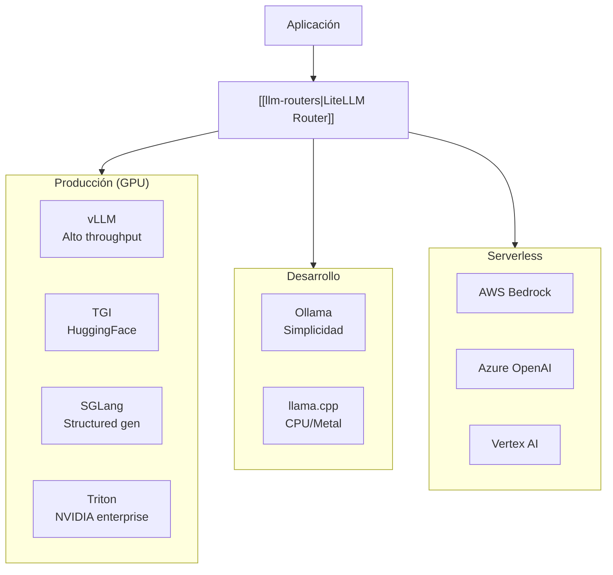
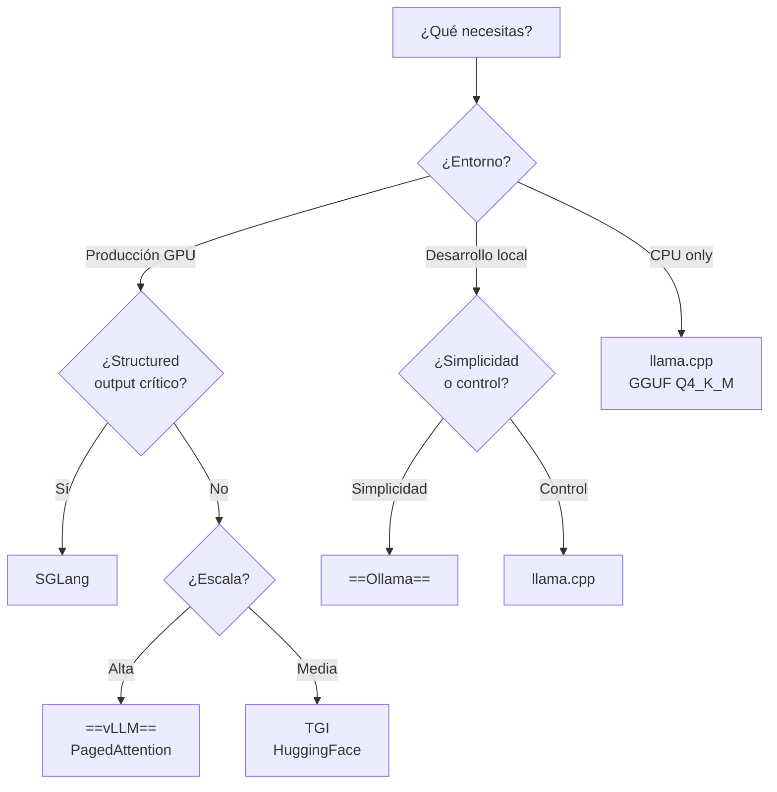

# Serving de LLMs en Producción

> [!abstract] Resumen
> Servir LLMs en producción requiere infraestructura especializada que maximice ==throughput y minimice latencia==. Este documento cubre las principales soluciones: *vLLM* (alto rendimiento con ==PagedAttention==), *TGI* de HuggingFace (producción con cuantización), *Ollama* (desarrollo local), *llama.cpp* (inferencia CPU), *SGLang* (generación estructurada) y *Triton* (NVIDIA enterprise). La elección depende del hardware disponible, requisitos de latencia y escala.
> ^resumen

---

## Panorama de soluciones



---

## vLLM — Alto rendimiento

*vLLM* es el servidor de inferencia de mayor rendimiento para LLMs open-source. Su innovación clave es *PagedAttention*, que gestiona la memoria KV-cache de forma análoga a la paginación de memoria virtual en sistemas operativos[^1].

### PagedAttention

> [!info] Cómo funciona PagedAttention
> En inferencia estándar, el *KV-cache* (memoria de atención) se pre-asigna como bloques contiguos. Esto desperdicia ==30-50% de la memoria GPU== en fragmentación interna. PagedAttention divide el KV-cache en páginas no contiguas, permitiendo:
> - ==Compartir páginas== entre requests con prefijos comunes (system prompts)
> - Eliminación de fragmentación interna
> - Mayor número de requests concurrentes en la misma GPU

### Continuous batching

A diferencia del *static batching* donde todas las requests de un batch deben completarse antes de procesar nuevas, vLLM usa *continuous batching*: las requests se ==insertan y completan individualmente== del batch en ejecución.

```mermaid
gantt
    title Static vs Continuous Batching
    dateFormat X
    axisFormat %s

    section Static
    Request A (corta)    :a1, 0, 3
    Request B (larga)    :a2, 0, 8
    Espera A             :a3, 3, 8
    Request C            :a4, 8, 11

    section Continuous
    Request A            :b1, 0, 3
    Request B            :b2, 0, 8
    Request C (entra al terminar A) :b3, 3, 6
```



### Instalación y uso

> [!example]- Despliegue de vLLM
> ```bash
> # Instalación
> pip install vllm
>
> # Servidor API (compatible con OpenAI)
> python -m vllm.entrypoints.openai.api_server \
>     --model meta-llama/Llama-3.1-70B-Instruct \
>     --tensor-parallel-size 4 \
>     --gpu-memory-utilization 0.90 \
>     --max-model-len 8192 \
>     --port 8000 \
>     --dtype auto \
>     --quantization awq  # Cuantización para modelos AWQ
>
> # Docker
> docker run --gpus all \
>     -v ~/.cache/huggingface:/root/.cache/huggingface \
>     -p 8000:8000 \
>     vllm/vllm-openai:latest \
>     --model meta-llama/Llama-3.1-8B-Instruct \
>     --max-model-len 4096
> ```

### Uso desde cliente

```python
from openai import OpenAI

# vLLM expone API compatible con OpenAI
client = OpenAI(
    base_url="http://localhost:8000/v1",
    api_key="EMPTY"  # vLLM no requiere API key
)

response = client.chat.completions.create(
    model="meta-llama/Llama-3.1-70B-Instruct",
    messages=[{"role": "user", "content": "Hola"}],
    temperature=0.1,
    max_tokens=500
)
```

> [!tip] Parámetros de rendimiento
> | Parámetro | Descripción | Recomendación |
> |-----------|-------------|---------------|
> | `tensor-parallel-size` | GPUs para paralelismo | ==Modelos >30B: 2-8 GPUs== |
> | `gpu-memory-utilization` | % de VRAM a usar | 0.85-0.95 |
> | `max-model-len` | Longitud máxima de contexto | Reducir si no necesitas ventana completa |
> | `quantization` | Tipo de cuantización | AWQ o GPTQ para producción |
> | `dtype` | Tipo de dato | ==auto (detecta bfloat16/float16)== |

---

## TGI — Text Generation Inference (HuggingFace)

*TGI* es la solución de HuggingFace para servir LLMs en producción:

### Características

- **Producción-ready** — usado internamente por HuggingFace
- **Cuantización integrada** — GPTQ, AWQ, EETQ, bitsandbytes
- **Flash Attention 2** — optimización de atención para GPUs Ampere+
- **Watermarking** — marca de agua en texto generado
- **Token streaming** — SSE nativo
- **Guided generation** — generación guiada por gramáticas/regex

> [!example]- Despliegue de TGI con Docker
> ```bash
> # TGI con Docker (forma recomendada)
> docker run --gpus all \
>     --shm-size 1g \
>     -p 8080:80 \
>     -v data:/data \
>     ghcr.io/huggingface/text-generation-inference:latest \
>     --model-id meta-llama/Llama-3.1-8B-Instruct \
>     --quantize gptq \
>     --max-input-length 4096 \
>     --max-total-tokens 8192 \
>     --max-batch-prefill-tokens 4096
>
> # Uso
> curl http://localhost:8080/generate \
>     -H 'Content-Type: application/json' \
>     -d '{
>         "inputs": "¿Qué es un transformer?",
>         "parameters": {
>             "max_new_tokens": 200,
>             "temperature": 0.1
>         }
>     }'
> ```

> [!warning] TGI vs vLLM
> TGI fue dominante antes de vLLM. Hoy, ==vLLM generalmente supera a TGI en throughput== gracias a PagedAttention y continuous batching. TGI sigue siendo relevante para integraciones nativas con HuggingFace Hub y features como watermarking.

---

## Ollama — Desarrollo local

*Ollama* prioriza la ==simplicidad de uso para desarrollo local==:

```bash
# Instalar (Linux/macOS/Windows)
curl -fsSL https://ollama.com/install.sh | sh

# Descargar y ejecutar un modelo
ollama run llama3.1

# Servir como API
ollama serve  # Puerto 11434 por defecto

# Pull de modelos específicos
ollama pull codestral
ollama pull gemma2:27b
ollama pull qwen2.5:72b
```

### Uso como API

```python
from openai import OpenAI

client = OpenAI(
    base_url="http://localhost:11434/v1",
    api_key="ollama"
)

response = client.chat.completions.create(
    model="llama3.1",
    messages=[{"role": "user", "content": "Hola"}]
)
```

> [!success] Ollama para el ecosistema
> Ollama es la forma más sencilla de ==ejecutar modelos locales con el ecosistema==. [[architect-overview|Architect]] puede usar Ollama vía LiteLLM (`ollama/llama3.1`), permitiendo desarrollo completamente offline sin costos de API.

### Modelfile personalizado

```dockerfile
# Modelfile para agente especializado
FROM llama3.1

PARAMETER temperature 0.1
PARAMETER num_ctx 8192
PARAMETER top_p 0.9

SYSTEM """Eres un asistente de programación especializado en Python.
Siempre generas código con type hints y docstrings."""
```

```bash
ollama create coding-assistant -f Modelfile
ollama run coding-assistant
```

---

## llama.cpp — Inferencia CPU

*llama.cpp* es la referencia para inferencia de LLMs en ==CPU y hardware limitado==:

### Formato GGUF

| Cuantización | Bits | Tamaño (7B) | Calidad | Velocidad |
|-------------|------|-------------|---------|-----------|
| F16 | 16 | 14 GB | ==Máxima== | Base |
| Q8_0 | 8 | 7.2 GB | Excelente | ==2x== |
| Q5_K_M | ~5.5 | 5.0 GB | Muy buena | 2.5x |
| Q4_K_M | ~4.5 | 4.1 GB | Buena | ==3x== |
| Q3_K_M | ~3.5 | 3.3 GB | Aceptable | 3.5x |
| Q2_K | ~2.5 | 2.7 GB | Degradada | 4x |

> [!tip] Selección de cuantización
> Para desarrollo local con CPU: ==Q4_K_M ofrece el mejor balance calidad/velocidad==. Para GPU con VRAM limitada: Q5_K_M o Q8_0. Nunca uses Q2_K para tareas que requieran razonamiento complejo — la degradación es notable.

### Servidor compatible con OpenAI

```bash
# Compilar con soporte CUDA
cmake -B build -DLLAMA_CUDA=ON
cmake --build build --config Release

# Servir modelo
./build/bin/llama-server \
    -m models/llama-3.1-8b-instruct-Q4_K_M.gguf \
    --port 8080 \
    --ctx-size 4096 \
    --n-gpu-layers 35  # Capas en GPU (offloading parcial)
```

> [!info] Relación con Ollama
> Ollama ==usa llama.cpp internamente== como su motor de inferencia. Ollama añade una capa de gestión de modelos (descarga, caché, Modelfile) sobre llama.cpp. Si necesitas control total de parámetros de inferencia, usa llama.cpp directamente. Para facilidad de uso, usa Ollama.

---

## SGLang — Generación estructurada

*SGLang* (*Structured Generation Language*) optimiza la generación de outputs estructurados (JSON, código, formatos específicos):

### Innovaciones

- **RadixAttention** — caché de KV compartido entre requests con prefijos comunes
- **Constrained decoding** — generación guiada por gramáticas formales
- **Optimized structured output** — JSON schema enforcement sin penalización de rendimiento

```python
import sglang as sgl

@sgl.function
def qa_pipeline(s, question):
    s += sgl.system("Eres un asistente experto.")
    s += sgl.user(question)
    s += sgl.assistant(sgl.gen("answer", max_tokens=200))

    # Generación estructurada
    s += sgl.user("Ahora califica tu respuesta del 1 al 10")
    s += sgl.assistant(
        sgl.gen("rating", regex=r"[1-9]|10")  # Solo números 1-10
    )
```

> [!tip] Cuándo usar SGLang
> SGLang brilla cuando necesitas ==outputs estructurados con alta frecuencia==: APIs que retornan JSON, pipelines de extracción de datos, agentes que usan function calling. La diferencia de rendimiento vs vLLM es notable (hasta ==5x más rápido para structured output==).

---

## Triton Inference Server (NVIDIA)

*Triton* es el servidor de inferencia enterprise de NVIDIA:

- **Multi-framework** — soporta TensorRT, ONNX, PyTorch, TensorFlow
- **Model ensemble** — encadenar modelos (embedding → LLM → post-processing)
- **Dynamic batching** — batching automático con control de latencia
- **Model analyzer** — herramienta para encontrar configuración óptima
- **Kubernetes-native** — diseñado para orquestación con K8s

> [!warning] Complejidad operativa
> Triton es ==significativamente más complejo de operar== que vLLM u Ollama. Justifica su complejidad cuando necesitas servir múltiples modelos heterogéneos (no solo LLMs) con SLAs estrictos y ya tienes equipo de MLOps con experiencia NVIDIA.

---

## Tabla comparativa completa

| Criterio | vLLM | TGI | Ollama | llama.cpp | SGLang | Triton |
|----------|------|-----|--------|-----------|--------|--------|
| Throughput | ==Muy alto== | Alto | Medio | Bajo-Medio | ==Muy alto== | Alto |
| Latencia TTFT | Baja | Baja | Media | Media-Alta | ==Muy baja== | Baja |
| GPU requerida | Sí | Sí | Opcional | ==No== | Sí | Sí |
| Cuantización | AWQ, GPTQ, FP8 | GPTQ, AWQ, bitsandbytes | ==GGUF (auto)== | ==GGUF== | AWQ, GPTQ | TensorRT |
| API OpenAI compat | ==Sí== | Parcial | ==Sí== | ==Sí== | Sí | No |
| Facilidad de uso | Media | Media | ==Muy fácil== | Difícil | Media | Difícil |
| Structured output | Básico | Guiado | No | Grammar | ==Avanzado== | N/A |
| Multi-modelo | Limitado | No | ==Sí== | No | Limitado | ==Sí== |
| Producción-ready | ==Sí== | ==Sí== | No | No | Sí | ==Sí (enterprise)== |
| Soporte tensor parallel | ==Sí== | Sí | No | No | Sí | Sí |

---

## Selección por caso de uso



> [!question] ¿Self-hosted o serverless?
> Si no tienes GPUs propias, los proveedores [[serverless-ai|serverless]] (Bedrock, Azure, Vertex) son más prácticos. Self-hosted se justifica cuando:
> - Tienes GPUs disponibles (on-premise o cloud)
> - Los datos no pueden salir de tu red
> - El volumen justifica el costo de GPUs dedicadas vs pay-per-token
> - Necesitas modelos custom fine-tuneados

---

## Optimizaciones de rendimiento

### Speculative decoding

Usar un modelo pequeño para generar candidatos que el modelo grande valida:

```bash
# vLLM con speculative decoding
python -m vllm.entrypoints.openai.api_server \
    --model meta-llama/Llama-3.1-70B-Instruct \
    --speculative-model meta-llama/Llama-3.1-8B-Instruct \
    --num-speculative-tokens 5
```

### Prefix caching

Reutilizar el KV-cache para prompts con prefijos comunes (system prompts):

```bash
# vLLM con prefix caching
python -m vllm.entrypoints.openai.api_server \
    --model meta-llama/Llama-3.1-70B-Instruct \
    --enable-prefix-caching
```

> [!success] Prefix caching para agentes
> Si tu sistema de agentes usa un ==system prompt largo y constante== (como [[architect-overview|Architect]] con sus instrucciones de herramientas), prefix caching puede ==reducir la latencia del primer token en 50-80%== para requests subsiguientes.

---

## Relación con el ecosistema

El *model serving* es la capa más baja de la infraestructura de agentes:

- **[[intake-overview|Intake]]** — para despliegues on-premise, Intake podría apuntar a un servidor vLLM local vía [[llm-routers|LiteLLM]]. Esto elimina la dependencia de APIs externas para procesamiento de requisitos sensibles
- **[[architect-overview|Architect]]** — soporta modelos locales vía Ollama. Para equipos que necesitan ==desarrollo offline o con datos sensibles==, Ollama + Architect es la combinación ideal. En producción, vLLM detrás de LiteLLM ofrece el mejor rendimiento
- **[[vigil-overview|Vigil]]** — no usa LLMs. Sin relación directa con model serving
- **[[licit-overview|Licit]]** — si Licit incorporara análisis con LLM, podría usar un modelo local (Ollama/vLLM) para evitar enviar datos de licencias a proveedores externos

---

## Enlaces y referencias

> [!quote]- Bibliografía y recursos
> - [^1]: Paper vLLM: "Efficient Memory Management for Large Language Model Serving with PagedAttention" — UC Berkeley
> - [^2]: TGI Documentation — https://huggingface.co/docs/text-generation-inference
> - [^3]: Ollama — https://ollama.com
> - [^4]: llama.cpp — https://github.com/ggerganov/llama.cpp
> - SGLang: https://github.com/sgl-project/sglang
> - Triton Inference Server: https://developer.nvidia.com/triton-inference-server
> - Edge AI para dispositivos: [[edge-ai]]

[^1]: PagedAttention fue propuesto por Woosuk Kwon et al. de UC Berkeley, logrando hasta 24x más throughput que implementaciones de HuggingFace estándar.
[^2]: TGI es usado internamente por HuggingFace para servir modelos en su Inference API.
[^3]: Ollama simplifica la experiencia a "docker para LLMs" — descarga, ejecuta y gestiona modelos con comandos simples.
[^4]: llama.cpp fue creado por Georgi Gerganov y revolucionó la inferencia local al demostrar que modelos grandes pueden ejecutarse en hardware consumer con cuantización agresiva.
