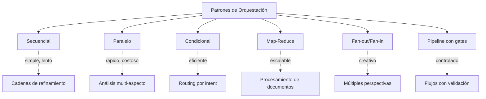
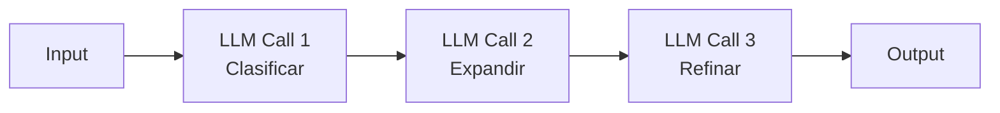
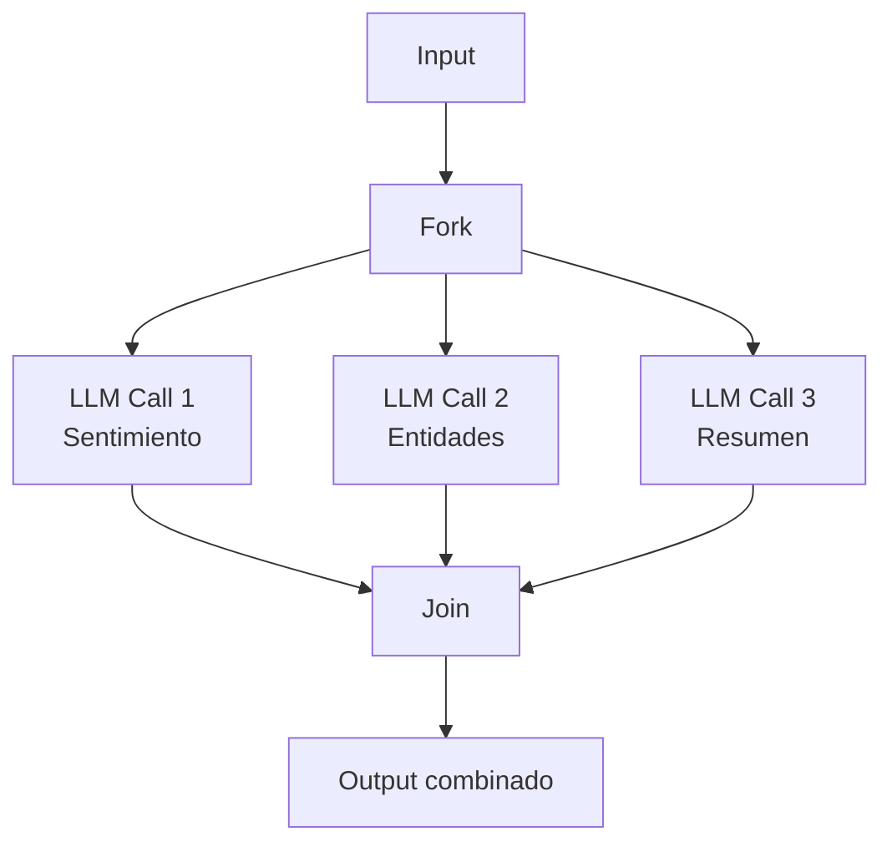
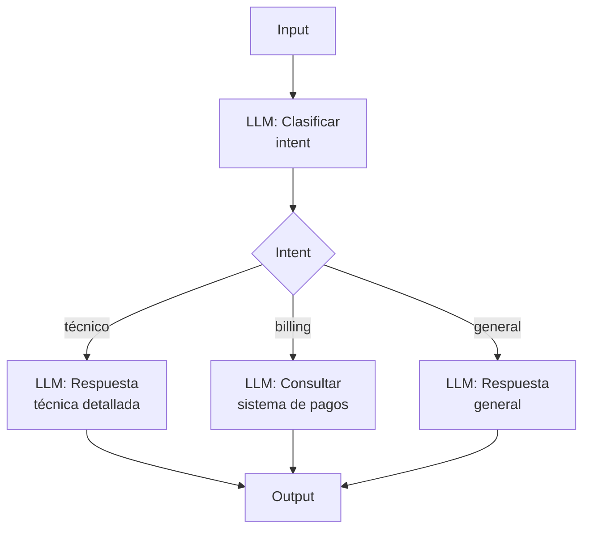
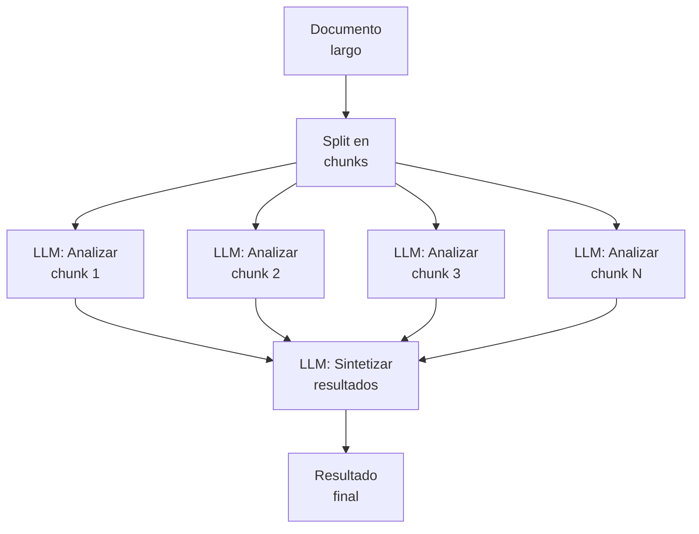
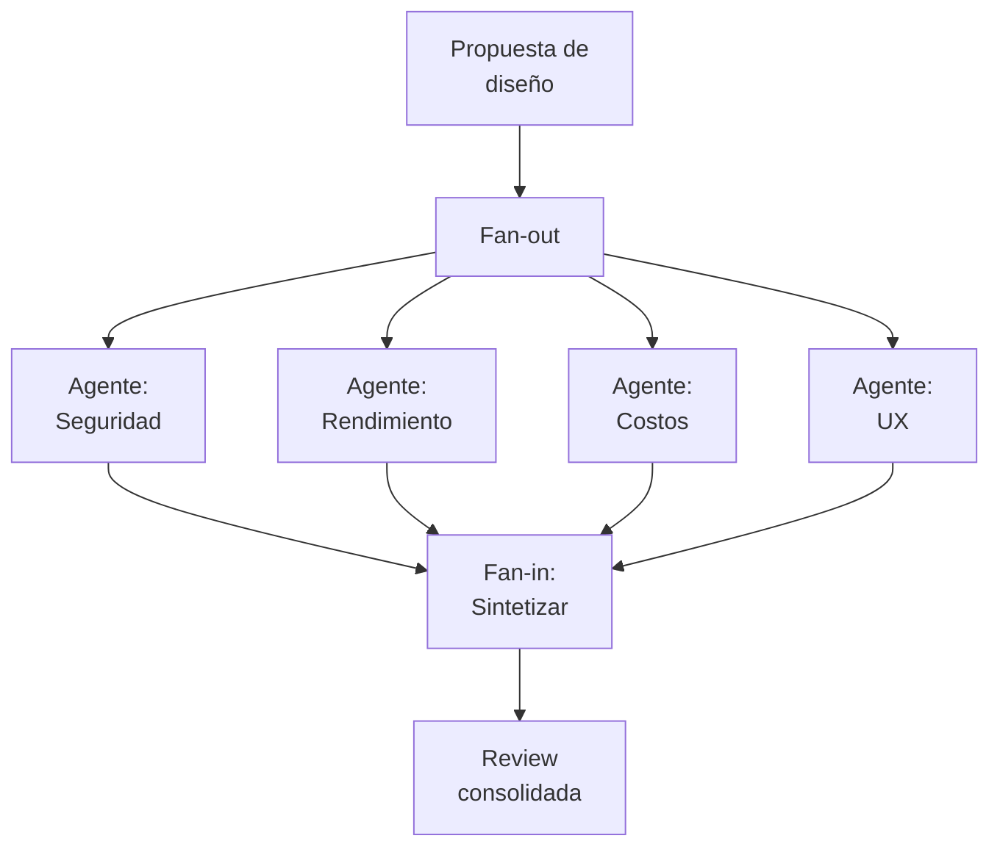
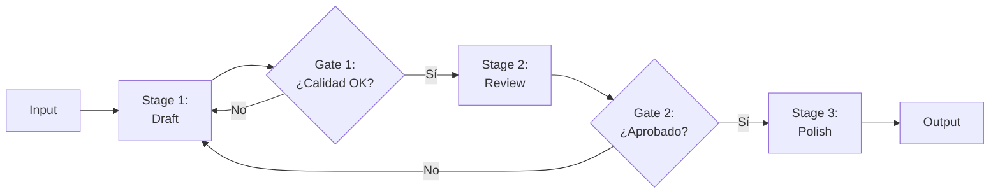

# Patrones de Orquestación de Llamadas LLM

> [!abstract] Resumen
> La orquestación de llamadas a LLMs sigue patrones predecibles que se pueden combinar para construir sistemas complejos. Este documento cataloga los patrones fundamentales: ==secuencial, paralelo, condicional, map-reduce, fan-out/fan-in y pipeline==. Cada patrón tiene compromisos específicos de latencia, costo y complejidad. [[architect-overview|Architect]] implementa varios de estos patrones, incluyendo ==ejecución paralela con ThreadPoolExecutor (hasta 4 hilos)== y ==pipelines YAML con gates==.
> ^resumen

---

## Taxonomía de patrones



---

## Patrón secuencial

La cadena más simple: la salida de una llamada alimenta la siguiente.



### Implementación

```python
async def sequential_chain(input_text: str) -> str:
    # Paso 1: Clasificar
    classification = await llm.invoke(
        f"Clasifica este texto: {input_text}"
    )

    # Paso 2: Expandir según clasificación
    expansion = await llm.invoke(
        f"Dado que el texto es de tipo '{classification}', "
        f"expande la información: {input_text}"
    )

    # Paso 3: Refinar
    refined = await llm.invoke(
        f"Refina y mejora este análisis:\n{expansion}"
    )

    return refined
```

> [!tip] Cuándo usar secuencial
> - ==Cada paso depende del anterior== (no se pueden paralelizar)
> - Refinamiento iterativo (borrador → revisión → pulido)
> - Pipelines de transformación (extraer → normalizar → enriquecer)

> [!warning] Latencia acumulativa
> La latencia total es la ==suma de todas las llamadas==. Para N pasos con latencia promedio L, la latencia total es N × L. Con 5 pasos de 2 segundos cada uno, el usuario espera 10 segundos. Considera si la calidad del pipeline justifica la espera.

| Aspecto | Valor |
|---------|-------|
| Latencia | ==Alta (acumulativa)== |
| Costo | Medio (N llamadas) |
| Complejidad | Baja |
| Control | Alto |
| Ejemplo ecosistema | [[intake-overview\|Intake]]: requisitos → clasificación → especificación |

---

## Patrón paralelo

Múltiples llamadas independientes ejecutadas simultáneamente.



### Implementación con asyncio

```python
import asyncio

async def parallel_analysis(text: str) -> dict:
    # Lanzar todas las llamadas en paralelo
    sentiment_task = llm.ainvoke(f"Analiza el sentimiento: {text}")
    entities_task = llm.ainvoke(f"Extrae entidades: {text}")
    summary_task = llm.ainvoke(f"Resume en una frase: {text}")

    # Esperar todas simultáneamente
    sentiment, entities, summary = await asyncio.gather(
        sentiment_task, entities_task, summary_task
    )

    return {
        "sentiment": sentiment,
        "entities": entities,
        "summary": summary
    }
```

### Implementación en Architect (ThreadPoolExecutor)

[[architect-overview|Architect]] usa `ThreadPoolExecutor` con un máximo de ==4 hilos paralelos==:

```python
from concurrent.futures import ThreadPoolExecutor, as_completed

def parallel_tool_execution(tools_to_run: list[dict]) -> list:
    results = []
    max_workers = min(4, len(tools_to_run))  # Máximo 4

    with ThreadPoolExecutor(max_workers=max_workers) as executor:
        futures = {
            executor.submit(execute_tool, tool): tool
            for tool in tools_to_run
        }

        for future in as_completed(futures):
            tool = futures[future]
            try:
                result = future.result(timeout=30)
                results.append(result)
            except Exception as e:
                results.append({"error": str(e), "tool": tool})

    return results
```

> [!info] ¿Por qué 4 hilos?
> El límite de 4 hilos en Architect es un ==balance entre velocidad y consumo de recursos==. Más hilos implicarían más llamadas concurrentes al API de LLM (rate limiting) y mayor uso de memoria. 4 es suficiente para la mayoría de operaciones de agente.

| Aspecto | Valor |
|---------|-------|
| Latencia | ==Baja (máx de las llamadas)== |
| Costo | Alto (N llamadas simultáneas) |
| Complejidad | Media |
| Control | Medio |
| Ejemplo ecosistema | Architect: ejecución paralela de herramientas |

---

## Patrón condicional

Enruta el flujo basándose en una clasificación previa.



### Implementación

> [!example]- Router condicional con clasificación
> ```python
> from enum import Enum
> from pydantic import BaseModel
>
> class Intent(str, Enum):
>     TECHNICAL = "technical"
>     BILLING = "billing"
>     GENERAL = "general"
>
> class Classification(BaseModel):
>     intent: Intent
>     confidence: float
>
> async def conditional_router(query: str) -> str:
>     # Paso 1: Clasificar (modelo rápido y barato)
>     classification = await fast_model.invoke_structured(
>         f"Clasifica la intención: {query}",
>         output_schema=Classification
>     )
>
>     # Paso 2: Enrutar al especialista
>     handlers = {
>         Intent.TECHNICAL: technical_handler,
>         Intent.BILLING: billing_handler,
>         Intent.GENERAL: general_handler,
>     }
>
>     handler = handlers[classification.intent]
>     return await handler(query)
>
> async def technical_handler(query: str) -> str:
>     # Modelo potente para respuestas técnicas
>     return await powerful_model.invoke(
>         f"Como experto técnico, responde: {query}"
>     )
>
> async def billing_handler(query: str) -> str:
>     # Consulta sistema de pagos + LLM para formatear
>     data = await billing_api.query(query)
>     return await fast_model.invoke(
>         f"Formatea estos datos de billing: {data}"
>     )
> ```

> [!tip] Modelo barato para clasificación
> Usa un modelo ==rápido y económico== (GPT-4o-mini, Haiku) para la clasificación, y reserva modelos potentes para las ramas que lo necesiten. Esto combina el patrón condicional con la estrategia de routing por capacidad descrita en [[llm-routers]].

| Aspecto | Valor |
|---------|-------|
| Latencia | Media (clasificación + rama) |
| Costo | ==Bajo-Medio (solo la rama necesaria)== |
| Complejidad | Media |
| Control | ==Alto== |
| Ejemplo ecosistema | [[intake-overview\|Intake]]: clasificación de tipo de requisito |

---

## Patrón map-reduce

Procesa datos en chunks paralelos y agrega los resultados.



### Implementación

> [!example]- Map-reduce para documentos largos
> ```python
> import asyncio
> from typing import List
>
> def split_document(doc: str, chunk_size: int = 3000) -> List[str]:
>     """Divide documento en chunks con overlap."""
>     words = doc.split()
>     chunks = []
>     for i in range(0, len(words), chunk_size - 200):  # 200 overlap
>         chunk = " ".join(words[i:i + chunk_size])
>         chunks.append(chunk)
>     return chunks
>
> async def map_reduce_summarize(document: str) -> str:
>     # MAP: procesar chunks en paralelo
>     chunks = split_document(document)
>
>     map_tasks = [
>         llm.ainvoke(
>             f"Resume los puntos clave de este fragmento:\n\n{chunk}"
>         )
>         for chunk in chunks
>     ]
>
>     chunk_summaries = await asyncio.gather(*map_tasks)
>
>     # REDUCE: sintetizar
>     combined = "\n---\n".join(chunk_summaries)
>     final = await llm.ainvoke(
>         f"Sintetiza estos resúmenes parciales en un resumen "
>         f"coherente y completo:\n\n{combined}"
>     )
>
>     return final
> ```

> [!warning] Pérdida de contexto inter-chunk
> El map-reduce ==pierde relaciones entre chunks==. Si el chunk 1 menciona "el proyecto A" y el chunk 3 referencia "dicho proyecto", el LLM que procesa el chunk 3 no tiene contexto. Mitiga esto con:
> - Overlap entre chunks (10-20%)
> - Metadatos de posición en cada chunk
> - Una pasada adicional de coherencia

| Aspecto | Valor |
|---------|-------|
| Latencia | ==Media (paralelo + reduce)== |
| Costo | Alto (N chunks + reduce) |
| Complejidad | Media-Alta |
| Escalabilidad | ==Excelente== |
| Ejemplo ecosistema | Procesamiento de documentos largos en RAG ([[vector-infra]]) |

---

## Patrón fan-out/fan-in

Múltiples agentes analizan el mismo input desde diferentes perspectivas.



### Diferencia con paralelo simple

> [!info] Fan-out/Fan-in vs Paralelo
> Ambos ejecutan en paralelo, pero la diferencia es la ==intención==:
> - **Paralelo**: misma tarea, diferentes datos (map-reduce)
> - **Fan-out/Fan-in**: ==diferentes perspectivas, mismos datos==
>
> El fan-in requiere un paso de ==síntesis inteligente== que reconcilie perspectivas potencialmente contradictorias.

### Implementación

```python
async def multi_perspective_review(design: str) -> str:
    perspectives = {
        "security": "Analiza vulnerabilidades y riesgos de seguridad",
        "performance": "Evalúa implicaciones de rendimiento y escalabilidad",
        "cost": "Estima costos de implementación y operación",
        "ux": "Evalúa impacto en experiencia de usuario"
    }

    # Fan-out: lanzar análisis paralelos
    tasks = {
        name: llm.ainvoke(
            f"{instruction}:\n\n{design}"
        )
        for name, instruction in perspectives.items()
    }

    results = {}
    for name, task in tasks.items():
        results[name] = await task

    # Fan-in: sintetizar
    reviews = "\n\n".join(
        f"## {name.upper()}\n{review}"
        for name, review in results.items()
    )

    synthesis = await llm.invoke(
        f"Sintetiza estas reviews en una evaluación cohesiva. "
        f"Resalta conflictos entre perspectivas:\n\n{reviews}"
    )

    return synthesis
```

> [!tip] Fan-out/Fan-in con CrewAI
> Este patrón es exactamente lo que [[crewai]] modela naturalmente: múltiples agentes con roles especializados (seguridad, rendimiento, costos, UX) que analizan el mismo input y un agente "manager" que sintetiza.

| Aspecto | Valor |
|---------|-------|
| Latencia | Media (paralelo + síntesis) |
| Costo | ==Alto (N perspectivas + síntesis)== |
| Complejidad | Alta |
| Calidad | ==Muy alta (múltiples viewpoints)== |
| Ejemplo ecosistema | [[crewai]]: crew con agentes especializados |

---

## Patrón pipeline con gates

Ejecución por etapas donde cada etapa tiene un "gate" que decide si continuar.



### Implementación en Architect

[[architect-overview|Architect]] implementa pipelines con YAML que definen stages y condiciones:

```yaml
# Pipeline YAML de Architect
pipeline:
  name: "code-review"
  stages:
    - name: "generate"
      agent: "coder"
      max_iterations: 3
      gate:
        type: "llm_judge"
        criteria: "El código compila y pasa linting"

    - name: "review"
      agent: "reviewer"
      gate:
        type: "approval"
        criteria: "Sin vulnerabilidades de seguridad"

    - name: "test"
      agent: "tester"
      gate:
        type: "automated"
        command: "pytest tests/"
        success_condition: "exit_code == 0"
```

> [!danger] Loops infinitos en gates
> Si un gate rechaza repetidamente, puedes entrar en un loop. ==Siempre implementa un máximo de iteraciones==:
> ```python
> MAX_RETRIES = 3
> for attempt in range(MAX_RETRIES):
>     result = await stage.execute(input_data)
>     if gate.passes(result):
>         break
> else:
>     raise PipelineError(f"Stage '{stage.name}' falló tras {MAX_RETRIES} intentos")
> ```

| Aspecto | Valor |
|---------|-------|
| Latencia | Variable (depende de reintentos) |
| Costo | Variable (reintentos consumen tokens) |
| Complejidad | ==Alta== |
| Calidad | ==Muy alta (validación en cada etapa)== |
| Ejemplo ecosistema | Architect: YAML pipelines con gates |

---

## Combinación de patrones

Los patrones se combinan en sistemas reales:

> [!example]- Pipeline complejo: clasificar → procesar en paralelo → sintetizar → validar
> ```python
> async def complex_pipeline(documents: list[str]) -> str:
>     # CONDICIONAL: clasificar cada documento
>     classifications = await asyncio.gather(*[
>         classify_document(doc) for doc in documents
>     ])
>
>     # MAP-REDUCE: procesar en paralelo por tipo
>     grouped = group_by_type(documents, classifications)
>     processed = {}
>     for doc_type, docs in grouped.items():
>         # PARALELO dentro de cada grupo
>         results = await asyncio.gather(*[
>             process_by_type(doc, doc_type) for doc in docs
>         ])
>         processed[doc_type] = results
>
>     # FAN-IN: sintetizar resultados
>     synthesis = await synthesize(processed)
>
>     # PIPELINE GATE: validar
>     for attempt in range(3):
>         validation = await validate(synthesis)
>         if validation.passes:
>             return synthesis
>         synthesis = await refine(synthesis, validation.feedback)
>
>     return synthesis  # Best effort
> ```

---

## Resumen de trade-offs

| Patrón | Latencia | Costo | Complejidad | Calidad |
|--------|----------|-------|-------------|---------|
| Secuencial | Alta | Medio | ==Baja== | Media |
| Paralelo | ==Baja== | Alto | Media | Media |
| Condicional | Media | ==Bajo== | Media | Media |
| Map-Reduce | Media | Alto | Media | Alta |
| Fan-out/Fan-in | Media | Alto | Alta | ==Alta== |
| Pipeline + gates | Variable | Variable | ==Alta== | ==Muy alta== |

---

## Relación con el ecosistema

Los patrones de orquestación son la base arquitectónica del ecosistema:

- **[[intake-overview|Intake]]** — usa principalmente el patrón ==secuencial== (requisitos → clasificación → transformación → especificación) con posibilidad de condicional para diferentes tipos de requisitos
- **[[architect-overview|Architect]]** — combina ==paralelo== (ThreadPoolExecutor hasta 4 hilos para herramientas), ==pipeline con gates== (YAML stages con validación) y ==secuencial== (loop principal del agente: think → act → observe)
- **[[vigil-overview|Vigil]]** — como escáner determinista, usa pipeline secuencial puro sin llamadas a LLM. Sus reglas se evalúan en cascada
- **[[licit-overview|Licit]]** — pipeline secuencial: escanear → clasificar licencias → verificar políticas → generar reporte. Podría beneficiarse de paralelo para escanear múltiples dependencias simultáneamente

> [!question] ¿Qué patrón elegir?
> Empieza siempre con ==secuencial==. Añade paralelismo solo cuando la latencia sea un problema medido. Usa condicional cuando los caminos sean claramente diferentes. Reserva fan-out/fan-in para decisiones importantes que requieran múltiples perspectivas.

---

## Enlaces y referencias

> [!quote]- Bibliografía y recursos
> - [^1]: "Patterns for AI Engineering" — análisis de patrones de orquestación
> - Implementación con LangGraph: [[langgraph]]
> - Implementación con CrewAI: [[crewai]]
> - Gestión de estado entre pasos: [[state-management]]
> - Routers para patrones condicionales: [[llm-routers]]
> - APIs para orquestación: [[api-design-ai-apps]]

[^1]: Los patrones de orquestación de LLMs son análogos a patrones de integración empresarial (EIP), pero con las particularidades de llamadas no deterministas, latencias variables y costos por token.
