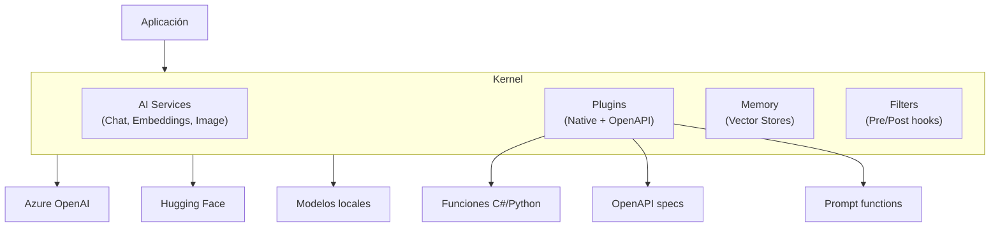
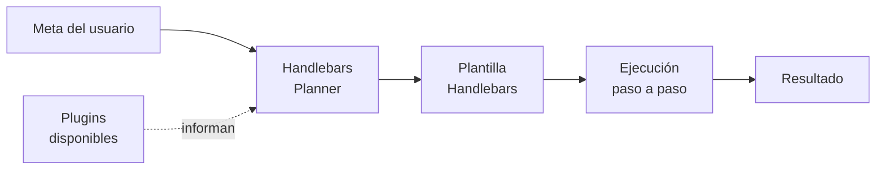
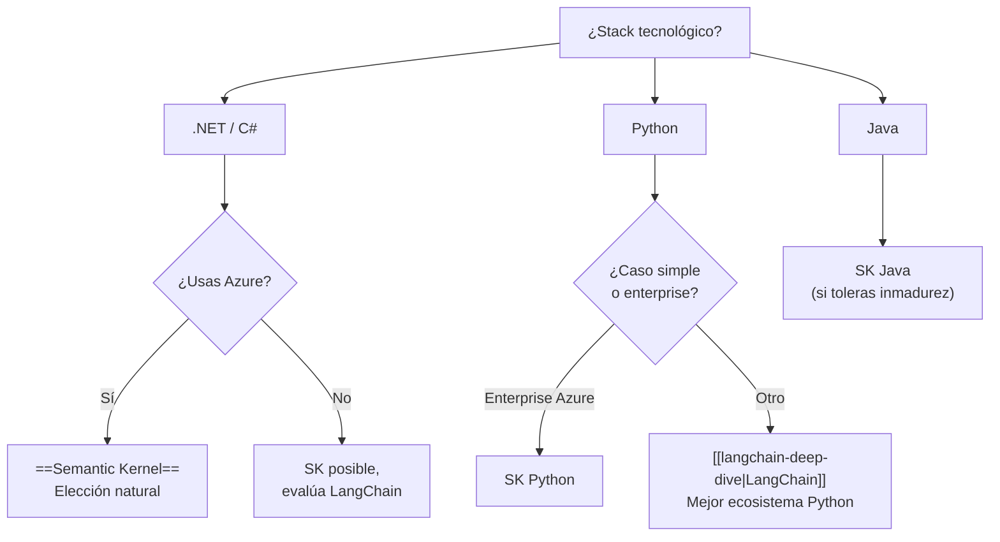

# Semantic Kernel — Framework Empresarial de Microsoft

> [!abstract] Resumen
> *Semantic Kernel* (SK) es el framework de Microsoft para ==integrar IA generativa en aplicaciones empresariales==. A diferencia de LangChain o AutoGen, SK fue diseñado desde el inicio para entornos .NET con extensiones para Python y Java. Sus conceptos centrales son los ==*plugins*== (funciones nativas + OpenAPI), los ==*planners*== (orquestación automática), y la profunda integración con el ecosistema Azure. Es la elección natural para empresas que ya operan en el stack Microsoft.
> ^resumen

---

## Arquitectura del Kernel

El *Kernel* es el punto central de orquestación en Semantic Kernel. Funciona como un contenedor de dependencias que conecta modelos de IA, plugins, memoria y servicios:



### Configuración básica

> [!example]- Inicialización del Kernel en Python y C#
> ```python
> # Python
> import semantic_kernel as sk
> from semantic_kernel.connectors.ai.open_ai import (
>     AzureChatCompletion,
>     AzureTextEmbedding
> )
>
> kernel = sk.Kernel()
>
> # Añadir servicio de chat
> kernel.add_service(
>     AzureChatCompletion(
>         deployment_name="gpt-4o",
>         endpoint=os.environ["AZURE_OPENAI_ENDPOINT"],
>         api_key=os.environ["AZURE_OPENAI_KEY"]
>     )
> )
>
> # Añadir servicio de embeddings
> kernel.add_service(
>     AzureTextEmbedding(
>         deployment_name="text-embedding-3-large",
>         endpoint=os.environ["AZURE_OPENAI_ENDPOINT"],
>         api_key=os.environ["AZURE_OPENAI_KEY"]
>     )
> )
> ```
>
> ```csharp
> // C# (.NET)
> var builder = Kernel.CreateBuilder();
>
> builder.AddAzureOpenAIChatCompletion(
>     deploymentName: "gpt-4o",
>     endpoint: config["AzureOpenAI:Endpoint"],
>     apiKey: config["AzureOpenAI:ApiKey"]
> );
>
> builder.AddAzureOpenAITextEmbeddingGeneration(
>     deploymentName: "text-embedding-3-large",
>     endpoint: config["AzureOpenAI:Endpoint"],
>     apiKey: config["AzureOpenAI:ApiKey"]
> );
>
> var kernel = builder.Build();
> ```

---

## Plugins

Los *plugins* son la unidad fundamental de funcionalidad en SK. Agrupan funciones relacionadas que el kernel (y los planners) pueden invocar:

### Native plugins (funciones nativas)

```python
from semantic_kernel.functions import kernel_function

class WeatherPlugin:
    """Plugin para consultar información meteorológica."""

    @kernel_function(
        name="get_forecast",
        description="Obtiene el pronóstico del tiempo para una ciudad"
    )
    def get_forecast(self, city: str, days: int = 3) -> str:
        # Implementación real contra API de weather
        return f"Pronóstico para {city}: Soleado, 25°C"

    @kernel_function(
        name="get_alerts",
        description="Obtiene alertas meteorológicas activas"
    )
    def get_alerts(self, region: str) -> str:
        return f"Sin alertas activas para {region}"

# Registrar plugin en el kernel
kernel.add_plugin(WeatherPlugin(), plugin_name="weather")
```

> [!tip] Nombres y descripciones
> Las descripciones de las funciones son ==críticas para que los planners y el function calling funcionen correctamente==. Una descripción vaga como "obtiene datos" no permite al LLM saber cuándo usar la función. Sé específico sobre qué hace, qué input espera y qué retorna.

### OpenAPI plugins

SK puede importar cualquier API que tenga una especificación OpenAPI como plugin:

```python
from semantic_kernel.connectors.openapi_plugin import OpenAPIPlugin

# Importar API externa como plugin
await kernel.add_plugin(
    OpenAPIPlugin.from_openapi(
        plugin_name="petstore",
        openapi_url="https://petstore.swagger.io/v2/swagger.json"
    )
)
```

> [!info] Comparación con MCP
> Los plugins OpenAPI de SK son conceptualmente similares a los ==servidores MCP== descritos en [[mcp-servers-ecosystem]]. Ambos exponen funcionalidades externas al agente. La diferencia: OpenAPI es un estándar web existente; MCP es un protocolo diseñado específicamente para IA. [[architect-overview|Architect]] usa MCP para descubrimiento de herramientas remotas.

### Prompt functions

Funciones que encapsulan un prompt como si fuera una función nativa:

```python
from semantic_kernel.functions import KernelFunction

summarize = KernelFunction.from_prompt(
    function_name="summarize",
    plugin_name="text",
    prompt="""Resume el siguiente texto en {{$max_sentences}} frases.
    Mantén los datos clave y cifras.

    Texto: {{$input}}

    Resumen:""",
    description="Resume texto largo en frases concisas"
)

kernel.add_function(summarize)
```

| Tipo de plugin | Ventaja | Limitación |
|----------------|---------|-----------|
| Native | ==Control total==, tipado fuerte | Requiere código |
| OpenAPI | Reutiliza APIs existentes | Dependencia de spec actualizada |
| Prompt | ==Rápido de crear== | Menos predecible |

---

## Planners — Orquestación automática

Los *planners* son el mecanismo de orquestación que permite al kernel ==componer funciones automáticamente== para resolver tareas complejas:

### Sequential Planner (Legacy)

Genera un plan paso a paso usando las funciones disponibles:

```python
from semantic_kernel.planners import SequentialPlanner

planner = SequentialPlanner(kernel)

plan = await planner.create_plan(
    goal="Busca el clima en Madrid, tradúcelo al inglés, y envíalo por email"
)

print(plan.generated_plan)
# Paso 1: weather.get_forecast(city="Madrid")
# Paso 2: text.translate(text=$step1_output, target_lang="en")
# Paso 3: email.send(to="user@example.com", body=$step2_output)

result = await plan.invoke(kernel)
```

### Stepwise Planner

Ejecuta pasos de forma iterativa, evaluando después de cada paso si necesita más:

```python
from semantic_kernel.planners import StepwisePlanner

planner = StepwisePlanner(kernel, max_iterations=10)
result = await planner.invoke(
    kernel,
    question="¿Cuál es la capital del país con mayor PIB de Sudamérica?"
)
```

> [!warning] Planners vs Function Calling
> Los planners legacy están siendo ==reemplazados por function calling nativo== (también llamado *auto function calling*). En la mayoría de casos, configurar `function_choice_behavior=FunctionChoiceBehavior.Auto()` produce mejores resultados que los planners explícitos:
> ```python
> settings = kernel.get_prompt_execution_settings_class()(
>     function_choice_behavior=FunctionChoiceBehavior.Auto()
> )
> result = await kernel.invoke_prompt(
>     "Busca el clima en Madrid y tradúcelo al inglés",
>     settings=settings
> )
> ```

### Handlebars Planner

Genera planes como plantillas Handlebars, permitiendo lógica condicional y bucles:



---

## Memory — Gestión de memoria

Semantic Kernel integra memoria vectorial para RAG y contexto persistente:

```python
from semantic_kernel.connectors.memory.azure_cognitive_search import (
    AzureCognitiveSearchMemoryStore
)

memory_store = AzureCognitiveSearchMemoryStore(
    endpoint=os.environ["AZURE_SEARCH_ENDPOINT"],
    admin_key=os.environ["AZURE_SEARCH_KEY"]
)

# Guardar un recuerdo
await kernel.memory.save_information(
    collection="docs",
    id="doc-001",
    text="Semantic Kernel es un framework de Microsoft para IA",
    description="Descripción de SK"
)

# Buscar recuerdos relevantes
results = await kernel.memory.search(
    collection="docs",
    query="¿Qué es SK?",
    limit=5
)
```

> [!tip] Stores soportados
> | Store | Azure | Local | Producción |
> |-------|-------|-------|-----------|
> | Azure Cognitive Search | ==Sí== | No | ==Sí== |
> | Qdrant | No | Sí | Sí |
> | Chroma | No | ==Sí== | No |
> | Pinecone | No | No | Sí |
> | Weaviate | No | Sí | Sí |
>
> Para infraestructura vectorial a escala, ver [[vector-infra]].

---

## Filters — Sistema de hooks

Los *filters* permiten interceptar la ejecución antes y después de cada función o llamada al LLM:

```python
from semantic_kernel.filters import FunctionInvocationContext

@kernel.filter(filter_type=FilterTypes.FUNCTION_INVOCATION)
async def log_function_calls(
    context: FunctionInvocationContext,
    next: Callable
):
    print(f"→ Llamando: {context.function.plugin_name}.{context.function.name}")
    print(f"  Args: {context.arguments}")

    await next(context)  # Ejecutar la función

    print(f"← Resultado: {str(context.result)[:100]}")

@kernel.filter(filter_type=FilterTypes.PROMPT_RENDER)
async def audit_prompts(context, next):
    await next(context)
    # Registrar el prompt renderizado para auditoría
    log_prompt(context.rendered_prompt)
```

> [!info] Comparación con hooks de Architect
> [[architect-overview|Architect]] implementa un sistema de *hooks* para interceptar el ciclo de vida del agente. Los filters de SK son conceptualmente idénticos: permiten ==logging, validación, y modificación== de inputs/outputs en cada paso. La diferencia es que SK tiene tipos de filter predefinidos (Function, Prompt, AutoFunctionInvocation) mientras que Architect define hooks por evento.

---

## Integración con Azure

La integración con Azure es la principal ventaja competitiva de SK:

### Azure OpenAI Service

```python
# Servicio gestionado con content filtering, compliance, SLAs
kernel.add_service(
    AzureChatCompletion(
        deployment_name="gpt-4o",
        endpoint="https://myorg.openai.azure.com/",
        api_key=config["azure_key"],
        api_version="2024-06-01"
    )
)
```

### Azure AI Search (antes Cognitive Search)

Para RAG empresarial con ==filtrado por seguridad y compliance integrado==.

### Azure Key Vault

Gestión segura de API keys y secretos sin hardcoding.

### Azure Monitor / Application Insights

Telemetría automática de llamadas a LLM, latencias y errores.

> [!success] Stack completo Azure + SK
> Si tu organización ya usa Azure, SK ofrece una ==integración nativa que ningún otro framework iguala==:
> - Azure OpenAI → modelos con SLA enterprise
> - Azure AI Search → RAG con seguridad de contenido
> - Azure Key Vault → gestión de secretos
> - Azure Monitor → observabilidad
> - Azure API Management → gateway con rate limiting
> - Entra ID → autenticación y autorización

---

## Soporte multi-lenguaje

| Característica | C# (.NET) | Python | Java |
|---------------|-----------|--------|------|
| Madurez | ==Más maduro== | Maduro | En desarrollo |
| Plugins nativos | Completo | Completo | Parcial |
| Planners | Todos | Todos | Limitado |
| Memory | Completo | Completo | Parcial |
| Filters | Completo | Completo | Parcial |
| Documentación | ==Extensa== | Buena | Básica |

> [!warning] Python no es first-class
> Aunque SK soporta Python, muchas features llegan primero a C#. Si tu equipo es 100% Python, frameworks como [[langchain-deep-dive|LangChain]] o [[langgraph|LangGraph]] tienen mejor soporte y comunidad en ese lenguaje.

---

## Cuándo usar Semantic Kernel



> [!success] Usa SK cuando...
> - Tu organización es ==.NET-first con stack Azure==
> - Necesitas plugins OpenAPI para integrar APIs empresariales existentes
> - Los requisitos de compliance exigen tools enterprise (Key Vault, Entra ID, etc.)
> - El equipo prefiere tipado fuerte y patrones de C#

> [!failure] No uses SK cuando...
> - Tu equipo es ==Python-only y no usa Azure==
> - Necesitas multi-agente avanzado → usa [[autogen]], [[crewai]] o [[langgraph]]
> - Buscas la mayor comunidad y ejemplos → [[langchain-deep-dive|LangChain]] domina
> - Necesitas optimización automática de prompts → [[dspy]] es superior

---

## Relación con el ecosistema

Semantic Kernel ocupa un nicho empresarial que complementa el ecosistema:

- **[[intake-overview|Intake]]** — si Intake opera en entorno Azure, SK podría gestionar las llamadas a LLM con los beneficios de Azure OpenAI (content filtering, SLAs). Sin embargo, Intake usa [[llm-routers|LiteLLM]] para ser provider-agnostic, lo cual es más flexible
- **[[architect-overview|Architect]]** — Architect es Python-first y usa LiteLLM para abstracción multi-proveedor. SK es una alternativa válida solo si Architect se desplegara en entorno .NET/Azure, lo cual no es el caso actual. Los plugins de SK son análogos a las herramientas `BaseTool` de Architect
- **[[vigil-overview|Vigil]]** — sin relación directa. Vigil no necesita framework de IA
- **[[licit-overview|Licit]]** — en entornos enterprise, los filters de SK podrían añadir auditoría de compliance a cada llamada LLM, complementando lo que Licit hace a nivel de output. La integración con Azure Monitor daría ==trazabilidad completa para auditorías regulatorias==

> [!question] ¿SK o LiteLLM para abstracción multi-proveedor?
> SK abstrae proveedores vía su sistema de services. LiteLLM abstrae vía API proxy. Para aplicaciones enterprise monolíticas, SK es más limpio. Para ==microservicios heterogéneos== (como nuestro ecosistema), LiteLLM como proxy centralizado es más práctico. Ver [[llm-routers]].

---

## Patrones avanzados

### Agent Framework en SK

SK ha añadido recientemente su propio sistema de agentes:

```python
from semantic_kernel.agents import ChatCompletionAgent

agent = ChatCompletionAgent(
    kernel=kernel,
    name="research_agent",
    instructions="Eres un agente de investigación...",
    execution_settings=settings
)

# Chat con el agente
response = await agent.invoke("Investiga tendencias en IA 2025")
```

> [!danger] No confundir con AutoGen
> SK Agents y [[autogen|AutoGen]] son proyectos ==separados dentro de Microsoft==. SK Agents es más simple (single-agent focus), AutoGen es más completo (multi-agent). No comparten código ni abstracciones.

---

## Enlaces y referencias

> [!quote]- Bibliografía y recursos
> - [^1]: Documentación oficial — https://learn.microsoft.com/semantic-kernel
> - [^2]: Repositorio GitHub: `microsoft/semantic-kernel`
> - Blog Microsoft: "Introducing Semantic Kernel" — contexto de diseño
> - Comparativa con LangChain: [[langchain-deep-dive]]
> - Framework complementario multi-agente: [[autogen]]

[^1]: Semantic Kernel fue anunciado en 2023 como el framework de Microsoft para integrar LLMs en aplicaciones empresariales, complementando Azure OpenAI Service.
[^2]: La comunidad de SK es activa pero más pequeña que la de LangChain, reflejando su foco enterprise y .NET.
