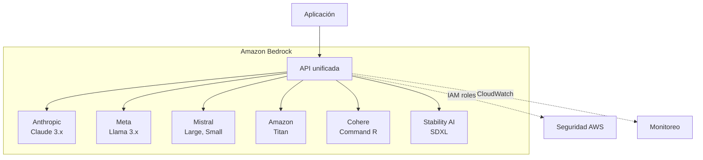

# Serverless AI — Inferencia Gestionada en la Nube

> [!abstract] Resumen
> Las plataformas *serverless* de IA permiten acceder a LLMs ==sin gestionar infraestructura de GPU==. Los tres grandes proveedores cloud ofrecen soluciones diferenciadas: *AWS Bedrock* (multi-modelo con integración AWS), *Azure OpenAI Service* (enterprise con content filtering), y *GCP Vertex AI* (Gemini nativo + Model Garden). La elección depende del ==cloud provider existente, requisitos de compliance, y modelos necesarios==.
> ^resumen

---

## AWS Bedrock

### Modelo de servicio

*Amazon Bedrock* es la plataforma de IA generativa de AWS que ofrece modelos de múltiples proveedores bajo una API unificada:



### Modelos disponibles (selección)

| Proveedor | Modelo | Input $/1M tokens | Output $/1M tokens | Contexto |
|-----------|--------|-------------------|--------------------|---------|
| Anthropic | Claude Sonnet 4 | $3.00 | $15.00 | 200K |
| Anthropic | Claude Haiku 3.5 | $0.80 | $4.00 | 200K |
| Meta | Llama 3.1 70B | $0.72 | $0.72 | 128K |
| Mistral | Mistral Large | $2.00 | $6.00 | 128K |
| Amazon | ==Titan Text Premier== | $0.50 | $1.50 | 32K |

> [!tip] Bedrock Converse API
> La *Converse API* unifica la interfaz de chat para todos los modelos. En lugar de adaptar tu código a cada modelo, usas ==una sola API== que maneja las diferencias internamente:
> ```python
> import boto3
>
> client = boto3.client("bedrock-runtime", region_name="us-east-1")
>
> response = client.converse(
>     modelId="anthropic.claude-3-5-sonnet-20241022-v2:0",
>     messages=[
>         {"role": "user", "content": [
>             {"text": "Explica qué es serverless AI"}
>         ]}
>     ],
>     inferenceConfig={
>         "maxTokens": 500,
>         "temperature": 0.1
>     }
> )
>
> print(response["output"]["message"]["content"][0]["text"])
> ```

### Features de Bedrock

| Feature | Descripción |
|---------|-------------|
| ==Knowledge Bases== | RAG gestionado con vectores automatizados |
| ==Guardrails== | Filtrado de contenido configurable |
| Agents | Agentes con acceso a herramientas y APIs |
| Fine-tuning | Ajuste fino de modelos seleccionados |
| Model evaluation | Comparación automatizada de modelos |
| Provisioned throughput | Capacidad reservada con descuento |

> [!info] Bedrock Knowledge Bases
> Knowledge Bases de Bedrock es ==RAG completamente gestionado==: subes documentos, Bedrock los indexa en Amazon OpenSearch o Pinecone, y puedes consultarlos automáticamente. Elimina la necesidad de gestionar la infraestructura vectorial descrita en [[vector-infra]], pero con menos control.

---

## Azure OpenAI Service

### Modelo de servicio

*Azure OpenAI Service* proporciona acceso a modelos de OpenAI con las garantías enterprise de Azure:

```python
from openai import AzureOpenAI

client = AzureOpenAI(
    api_key=os.environ["AZURE_OPENAI_KEY"],
    api_version="2024-06-01",
    azure_endpoint="https://myorg.openai.azure.com/"
)

response = client.chat.completions.create(
    model="gpt-4o",  # Nombre del deployment
    messages=[
        {"role": "user", "content": "Hola"}
    ],
    temperature=0.1
)
```

### Features enterprise

| Feature | Descripción |
|---------|-------------|
| ==Content filtering== | Filtrado de contenido integrado (hate, violence, sexual, self-harm) |
| ==Data residency== | Datos procesados en la región elegida |
| VNet integration | Acceso privado sin internet público |
| Managed identity | ==Sin API keys== (Entra ID) |
| Abuse monitoring | Detección de uso abusivo |
| SLA | ==99.9% de disponibilidad== |

> [!warning] Content filtering por defecto
> Azure OpenAI tiene ==content filtering ACTIVADO por defecto== y no puede desactivarse completamente (solo ajustarse). Esto puede bloquear queries legítimas en dominios como seguridad, medicina, o legal. Solicita exemptions a través de tu representante de Microsoft si es necesario.

### Modelos disponibles

| Modelo | Capacidades | Regiones |
|--------|------------|---------|
| ==GPT-4o== | Chat, vision, structured output | US, Europe, Asia |
| GPT-4o-mini | Chat económico | Global |
| o1 / o1-mini | ==Razonamiento avanzado== | Limitadas |
| DALL-E 3 | Generación de imágenes | US, Europe |
| Whisper | Speech-to-text | US, Europe |
| text-embedding-3 | Embeddings | Global |

> [!success] Azure para enterprise
> Si tu organización ==ya tiene Azure Enterprise Agreement==, Azure OpenAI es la opción natural:
> - Facturación unificada con el resto de Azure
> - Compliance: SOC 2, HIPAA, FedRAMP, ISO 27001
> - Soporte enterprise 24/7
> - Integración con [[semantic-kernel|Semantic Kernel]]

---

## GCP Vertex AI

### Modelo de servicio

*Vertex AI* es la plataforma de ML de Google Cloud, con acceso nativo a modelos Gemini:

```python
import vertexai
from vertexai.generative_models import GenerativeModel

vertexai.init(project="my-project", location="us-central1")

model = GenerativeModel("gemini-1.5-pro-002")

response = model.generate_content(
    "Explica la arquitectura de microservicios",
    generation_config={
        "temperature": 0.1,
        "max_output_tokens": 1000
    }
)

print(response.text)
```

### Modelos Gemini

| Modelo | Input $/1M tokens | Output $/1M tokens | Contexto | Fortalezas |
|--------|-------------------|--------------------|---------| ----------|
| Gemini 2.0 Flash | ==$0.075== | ==$0.30== | 1M | ==Ultra-económico== |
| Gemini 1.5 Pro | $1.25 | $5.00 | ==2M== | ==Contexto masivo== |
| Gemini 1.5 Flash | $0.075 | $0.30 | 1M | Velocidad |

> [!tip] Ventana de 2M tokens
> Gemini 1.5 Pro con ==2 millones de tokens de contexto== es único en el mercado. Permite procesar libros completos, codebases grandes o cientos de documentos en una sola llamada. Esto elimina la necesidad de RAG para muchos casos de uso.

### Model Garden

Model Garden de Vertex AI ofrece acceso a modelos open-source desplegados en infraestructura Google:

- **Llama 3.1** — 8B, 70B, 405B
- **Mistral** — Large, Small, Codestral
- **Claude** — via partnership con Anthropic
- **Gemma** — modelos abiertos de Google

---

## Tabla comparativa de plataformas

| Criterio | AWS Bedrock | Azure OpenAI | GCP Vertex AI |
|----------|------------|-------------|---------------|
| Modelos propietarios | Titan | ==GPT-4o, o1== | ==Gemini== |
| Multi-proveedor | ==Sí (6+ proveedores)== | Solo OpenAI (+abiertos) | Sí (Model Garden) |
| Contexto máximo | 200K (Claude) | 128K (GPT-4o) | ==2M (Gemini 1.5 Pro)== |
| Content filtering | Guardrails (configurable) | ==Integrado (always-on)== | Configurable |
| RAG gestionado | ==Knowledge Bases== | Azure AI Search | Vertex AI Search |
| Fine-tuning | Seleccionados | GPT-4o-mini, GPT-3.5 | Gemini, Llama |
| SLA | 99.9% | ==99.9%== | 99.9% |
| Compliance | SOC2, HIPAA, ISO | ==SOC2, HIPAA, FedRAMP, ISO== | SOC2, HIPAA, ISO |
| Más económico | Llama 3.1 (on-demand) | GPT-4o-mini | ==Gemini Flash== |
| Pricing model | Pay-per-token | Pay-per-token + PTU | Pay-per-token |

> [!question] ¿Cuál elegir?
> La respuesta casi siempre es: ==el cloud provider que ya usas==.
> - Ya usas AWS → Bedrock (multi-modelo, integración nativa)
> - Ya usas Azure → Azure OpenAI (enterprise, compliance)
> - Ya usas GCP → Vertex AI (Gemini nativo, Model Garden)
> - No usas ninguno → Evalúa por modelos necesarios y precios

---

## Serverless vs GPU dedicada

### Cuándo serverless

> [!success] Usa serverless cuando...
> - ==Volumen variable== (no puedes predecir el tráfico)
> - No quieres gestionar infraestructura de GPU
> - Necesitas ==múltiples modelos== sin provisionar cada uno
> - Los requisitos de compliance se alinean con el provider
> - El costo por token es aceptable para tu volumen

### Cuándo GPU dedicada

> [!failure] Usa GPU dedicada cuando...
> - ==Alto volumen constante== (break-even vs serverless)
> - Necesitas ==modelos custom fine-tuned==
> - Los datos ==no pueden salir de tu red==
> - Necesitas ==latencia ultra-baja== (<100ms)
> - Quieres ejecutar modelos open-source sin costo por token

### Análisis de break-even

```
Costo serverless = tokens_mensuales × precio_por_token
Costo GPU dedicada = precio_GPU_mensual + costos_operativos

Break-even: tokens donde ambos costos son iguales
```

| Escenario | Tokens/mes | Serverless (GPT-4o) | GPU (A100 + vLLM) |
|-----------|-----------|--------------------|--------------------|
| Bajo | 10M | $50 | ==$2,000+== (GPU ociosa) |
| Medio | 100M | $500 | $2,000 |
| Alto | 1B | ==$5,000== | ==$2,000== |
| Muy alto | 10B | $50,000 | ==$4,000== (2x A100) |

> [!info] El break-even depende del modelo
> Con modelos open-source en GPU propia, el ==costo marginal por token es prácticamente cero== (solo electricidad). El break-even llega mucho antes que con modelos propietarios. Ver [[model-serving]] para opciones de self-hosting.

---

## Integración con LiteLLM

Todos los proveedores serverless se integran transparentemente con [[llm-routers|LiteLLM]]:

```python
import litellm

# AWS Bedrock
response = litellm.completion(
    model="bedrock/anthropic.claude-3-5-sonnet-20241022-v2:0",
    messages=messages
)

# Azure OpenAI
response = litellm.completion(
    model="azure/gpt-4o-deployment",
    messages=messages,
    api_base="https://myorg.openai.azure.com/"
)

# GCP Vertex AI
response = litellm.completion(
    model="vertex_ai/gemini-1.5-pro",
    messages=messages
)
```

> [!tip] Multi-cloud con LiteLLM
> Configura ==fallbacks entre clouds== para máxima resiliencia:
> ```python
> response = litellm.completion(
>     model="azure/gpt-4o",
>     messages=messages,
>     fallbacks=["bedrock/anthropic.claude-3-5-sonnet-20241022-v2:0",
>                "vertex_ai/gemini-1.5-pro"]
> )
> ```
> Si Azure falla, intenta Bedrock, luego Vertex. Ver [[llm-routers]] para configuración detallada.

---

## Relación con el ecosistema

Los proveedores serverless son la capa de infraestructura más común para el ecosistema:

- **[[intake-overview|Intake]]** — usa modelos serverless vía LiteLLM para transformar requisitos. Puede usar Bedrock en entornos AWS, Azure OpenAI en entornos Microsoft, o APIs directas de OpenAI/Anthropic para equipos sin cloud provider fijo
- **[[architect-overview|Architect]]** — soporta ==todos los proveedores serverless== vía LiteLLM. El flag `--model` permite cambiar entre `anthropic/claude-sonnet-4-20250514` (API directa), `bedrock/anthropic.claude-3-5-sonnet` (AWS), o `azure/gpt-4o` (Azure) sin cambiar código
- **[[vigil-overview|Vigil]]** — no usa proveedores serverless. Opera determinísticamente sin LLMs
- **[[licit-overview|Licit]]** — si incorporara análisis con LLM, usaría el proveedor serverless del entorno existente vía los conectores de Architect o Intake

> [!warning] Costos ocultos
> Los proveedores serverless cobran por ==tokens de input y output==. En sistemas de agentes con loops largos (Architect ejecutando múltiples herramientas), los costos se acumulan rápidamente. Implementa ==budget limits== en el [[api-gateways-llm|gateway]] o en LiteLLM para evitar sorpresas.

---

## Enlaces y referencias

> [!quote]- Bibliografía y recursos
> - [^1]: AWS Bedrock Documentation — https://docs.aws.amazon.com/bedrock/
> - [^2]: Azure OpenAI Service — https://learn.microsoft.com/azure/ai-services/openai/
> - [^3]: Vertex AI Documentation — https://cloud.google.com/vertex-ai/docs
> - Routers multi-provider: [[llm-routers]]
> - Self-hosting como alternativa: [[model-serving]]
> - Edge AI para offline: [[edge-ai]]

[^1]: Bedrock fue lanzado en GA en septiembre 2023 como la respuesta de AWS a Azure OpenAI Service.
[^2]: Azure OpenAI Service fue el primer servicio enterprise de LLMs en un cloud provider, lanzado en enero 2023.
[^3]: Vertex AI evolucionó de Google Cloud AI Platform para incorporar modelos generativos con el lanzamiento de Gemini.
