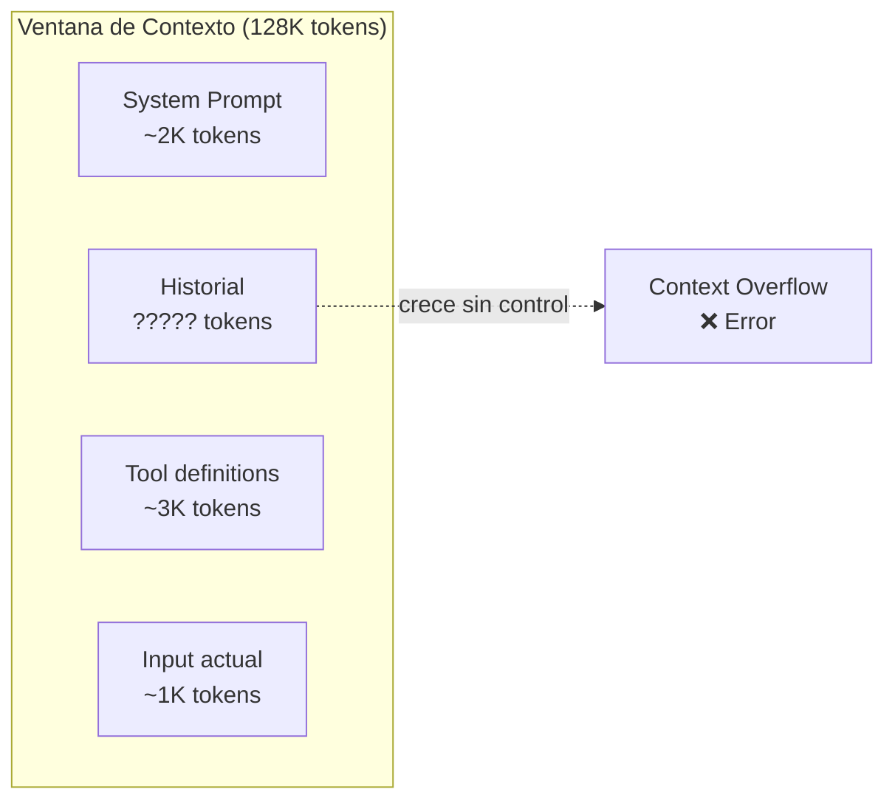
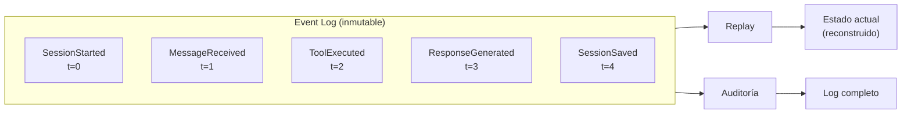
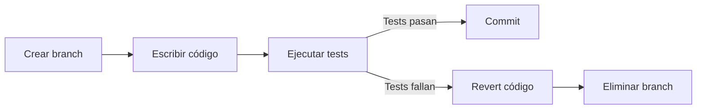

# Gestión de Estado en Sistemas de Agentes

> [!abstract] Resumen
> El estado (*state*) es el aspecto más crítico y menos visible de los sistemas de agentes. Incluye el ==historial de conversación, las decisiones tomadas, los resultados intermedios y la configuración activa==. [[architect-overview|Architect]] gestiona estado mediante ==sesiones con auto-save== tras cada paso, IDs con formato `YYYYMMDD-HHMMSS-hexhex`, y ==truncamiento de mensajes (30 últimos si >50)== para control de ventana de contexto. Este documento analiza patrones de gestión de estado, estrategias de persistencia y recuperación de fallos.
> ^resumen

---

## Tipos de estado en agentes

### Estado conversacional

El historial de mensajes entre el usuario y el agente:

```python
# Estructura típica de estado conversacional
conversation_state = {
    "messages": [
        {"role": "system", "content": "Eres un asistente..."},
        {"role": "user", "content": "Implementa la función X"},
        {"role": "assistant", "content": "Voy a implementar..."},
        {"role": "tool", "content": "Resultado de file_write..."},
        {"role": "assistant", "content": "He creado el archivo..."},
    ],
    "metadata": {
        "session_id": "20250601-143022-a1b2c3",
        "model": "anthropic/claude-sonnet-4-20250514",
        "total_tokens": 15420,
        "start_time": "2025-06-01T14:30:22Z"
    }
}
```

> [!warning] Crecimiento del historial
> El historial de mensajes crece ==linealmente con cada interacción==. Sin gestión, una sesión larga puede superar la ventana de contexto del modelo. Esto no es un error del modelo — es un fallo de la infraestructura del agente.

### Estado de ejecución

Información sobre qué está haciendo el agente ahora:

| Componente | Ejemplo | Persistencia |
|------------|---------|-------------|
| Paso actual | "Ejecutando herramienta write_file" | En memoria |
| Plan activo | "1. Crear archivo, 2. Escribir tests" | ==Sesión== |
| Herramientas en uso | ["file_write", "shell_exec"] | En memoria |
| Iteración actual | 3 de max_iterations=10 | En memoria |
| Tokens consumidos | 45,230 de budget=100,000 | ==Sesión== |

### Estado persistente

Información que sobrevive entre sesiones:

- **Preferencias del usuario** — estilo de código, convenciones
- **Contexto del proyecto** — arquitectura, dependencias, patrones
- **Memoria a largo plazo** — decisiones previas, errores aprendidos

---

## Gestión de ventana de contexto

### El problema



> [!danger] Context overflow silencioso
> Algunos proveedores ==truncan silenciosamente== el historial cuando se excede la ventana de contexto. El agente pierde contexto crítico sin ningún error visible. Otros lanzan un error 400. Ambos comportamientos son problemáticos en producción.

### Estrategias de truncamiento

#### Truncamiento por cuenta (Architect)

[[architect-overview|Architect]] implementa una estrategia simple pero efectiva:

```python
MAX_MESSAGES = 50
KEEP_RECENT = 30

def truncate_messages(messages: list) -> list:
    """Si hay más de MAX_MESSAGES, conserva los KEEP_RECENT más recientes."""
    if len(messages) <= MAX_MESSAGES:
        return messages

    # Siempre conservar system prompt
    system_msgs = [m for m in messages if m["role"] == "system"]
    non_system = [m for m in messages if m["role"] != "system"]

    # Conservar los 30 más recientes
    truncated = system_msgs + non_system[-KEEP_RECENT:]

    return truncated
```

> [!info] ¿Por qué 30 de 50?
> El umbral de 50 mensajes activa el truncamiento. Conservar los 30 más recientes ==preserva el contexto inmediato== sin saturar la ventana. Los 20 mensajes eliminados son generalmente intercambios iniciales ya resueltos.

#### Truncamiento por tokens

```python
def truncate_by_tokens(messages: list, max_tokens: int) -> list:
    """Conserva mensajes hasta un límite de tokens."""
    total_tokens = 0
    result = []

    # System prompt siempre incluido
    for msg in messages:
        if msg["role"] == "system":
            result.append(msg)
            total_tokens += count_tokens(msg["content"])

    # Añadir mensajes desde el más reciente
    for msg in reversed(messages):
        if msg["role"] == "system":
            continue
        msg_tokens = count_tokens(msg["content"])
        if total_tokens + msg_tokens > max_tokens:
            break
        result.insert(-1 if result else 0, msg)  # Mantener orden
        total_tokens += msg_tokens

    return result
```

#### Resumen de contexto previo

> [!tip] Patrón de resuming
> En lugar de descartar mensajes antiguos, ==resúmelos en un mensaje de contexto==:
> ```python
> async def summarize_and_truncate(messages: list) -> list:
>     old_messages = messages[1:-KEEP_RECENT]  # Excluir system y recientes
>
>     summary = await llm.invoke(
>         f"Resume esta conversación en 3-5 puntos clave:\n"
>         f"{format_messages(old_messages)}"
>     )
>
>     return [
>         messages[0],  # System prompt
>         {"role": "system", "content": f"Contexto previo: {summary}"},
>         *messages[-KEEP_RECENT:]
>     ]
> ```
> Este patrón ==consume tokens extra para el resumen== pero preserva información que el truncamiento simple descartaría.

### Comparativa de estrategias

| Estrategia | Pérdida de info | Costo | Complejidad | Usado por |
|-----------|----------------|-------|-------------|-----------|
| Truncar por count | ==Media== | Ninguno | Baja | ==Architect== |
| Truncar por tokens | Media | Ninguno | Media | LangChain |
| Resumir | ==Baja== | Token cost | Alta | Custom |
| Sliding window | Alta | Ninguno | Baja | Muchos |
| Comprimir | Baja | Token cost | Alta | LLMLingua |

---

## Persistencia de sesiones

### Sesiones en Architect

[[architect-overview|Architect]] persiste sesiones automáticamente:

```
~/.architect/sessions/
├── 20250601-143022-a1b2c3/
│   ├── session.json          # Estado completo
│   ├── messages.jsonl        # Historial de mensajes
│   └── metadata.json         # Configuración, model, tokens
├── 20250601-150845-d4e5f6/
│   ├── session.json
│   ├── messages.jsonl
│   └── metadata.json
└── ...
```

> [!info] Formato de session ID
> `YYYYMMDD-HHMMSS-hexhex` donde:
> - `YYYYMMDD` — fecha de creación
> - `HHMMSS` — hora de creación
> - `hexhex` — 6 caracteres hexadecimales aleatorios para unicidad
>
> Ejemplo: `20250601-143022-a1b2c3`

### Auto-save

```python
class SessionManager:
    def __init__(self, session_dir: str):
        self.session_dir = session_dir
        self.session_id = self._generate_id()

    def _generate_id(self) -> str:
        now = datetime.now()
        hex_part = secrets.token_hex(3)
        return f"{now:%Y%m%d-%H%M%S}-{hex_part}"

    def save_after_step(self, state: dict):
        """Auto-save tras cada paso del agente."""
        path = os.path.join(self.session_dir, self.session_id)
        os.makedirs(path, exist_ok=True)

        with open(os.path.join(path, "session.json"), "w") as f:
            json.dump(state, f, indent=2, default=str)

    def resume(self, session_id: str) -> dict:
        """Restaurar sesión previa."""
        path = os.path.join(self.session_dir, session_id, "session.json")
        with open(path) as f:
            return json.load(f)
```

> [!success] Resume capability
> La capacidad de ==reanudar sesiones== es crítica para agentes de larga duración. Si Architect se interrumpe (crash, timeout, cancelación manual), el auto-save garantiza que ==el progreso no se pierde== y la sesión puede retomarse desde el último paso completado.

---

## Event sourcing para agentes

*Event sourcing* almacena cada cambio de estado como un evento inmutable, en lugar de sobrescribir el estado actual:



### Ventajas para agentes

| Beneficio | Descripción |
|-----------|-------------|
| ==Auditoría completa== | Cada acción del agente queda registrada |
| Time-travel debugging | Reconstruir el estado en cualquier punto |
| Reproducibilidad | Re-ejecutar la misma secuencia de eventos |
| Compliance | ==Evidencia de qué hizo el agente y por qué== |
| Branching | Crear ramas desde cualquier punto del historial |

### Implementación

> [!example]- Event sourcing básico para agentes
> ```python
> from dataclasses import dataclass, field
> from datetime import datetime
> from typing import Any
> import json
>
> @dataclass
> class AgentEvent:
>     event_type: str
>     timestamp: datetime
>     data: dict
>     session_id: str
>
>     def serialize(self) -> str:
>         return json.dumps({
>             "type": self.event_type,
>             "ts": self.timestamp.isoformat(),
>             "data": self.data,
>             "session": self.session_id
>         })
>
> class EventStore:
>     def __init__(self, path: str):
>         self.path = path
>         self.events: list[AgentEvent] = []
>
>     def append(self, event: AgentEvent):
>         self.events.append(event)
>         with open(self.path, "a") as f:
>             f.write(event.serialize() + "\n")
>
>     def replay(self) -> dict:
>         """Reconstruir estado desde eventos."""
>         state = {"messages": [], "tools_used": [], "steps": 0}
>         for event in self.events:
>             if event.event_type == "message_added":
>                 state["messages"].append(event.data["message"])
>             elif event.event_type == "tool_executed":
>                 state["tools_used"].append(event.data["tool_name"])
>                 state["steps"] += 1
>         return state
>
>     def replay_until(self, timestamp: datetime) -> dict:
>         """Reconstruir estado hasta un momento específico."""
>         filtered = [e for e in self.events if e.timestamp <= timestamp]
>         # ... mismo replay
> ```

> [!warning] Overhead de event sourcing
> Event sourcing añade ==I/O en cada paso del agente==. Para agentes de alta frecuencia (muchas herramientas por segundo), el overhead puede ser significativo. Considera batching de eventos o append asíncrono.

---

## Patrones de recuperación

### Checkpoint and resume

```python
async def resilient_agent_loop(task: str, session_mgr: SessionManager):
    """Loop de agente con recuperación automática."""

    # Intentar resume si existe sesión previa
    if session_mgr.has_saved_state():
        state = session_mgr.resume()
        step = state.get("last_completed_step", 0)
    else:
        state = initialize_state(task)
        step = 0

    while step < MAX_STEPS:
        try:
            result = await execute_step(state, step)
            state = update_state(state, result)
            session_mgr.save_after_step(state)  # Checkpoint
            step += 1

            if is_complete(state):
                break

        except (RateLimitError, TimeoutError) as e:
            # Errores recuperables: esperar y reintentar
            await asyncio.sleep(exponential_backoff(step))
            continue

        except Exception as e:
            # Error no recuperable: guardar estado para análisis
            state["error"] = str(e)
            session_mgr.save_after_step(state)
            raise

    return state
```

> [!tip] Idempotencia de pasos
> Para que el resume funcione correctamente, cada paso del agente debe ser ==idempotente o su efecto debe registrarse==. Si un paso "crear archivo X" se ejecuta dos veces, el resultado debe ser el mismo. Esto conecta con los principios de [[api-design-ai-apps|diseño de APIs idempotentes]].

### Patrón saga para agentes

Cuando un agente ejecuta múltiples acciones que deben ser atómicas:



> [!info] Sagas en Architect
> [[architect-overview|Architect]] implementa una forma de saga pattern con ==git worktrees==: cada operación ocurre en un worktree aislado. Si algo falla, el worktree se descarta sin afectar la rama principal. Esto proporciona ==aislamiento transaccional== a nivel de sistema de archivos.

---

## Comparación de enfoques

| Enfoque | Complejidad | Durabilidad | Rendimiento | Debugging |
|---------|-------------|-------------|-------------|-----------|
| Estado en memoria | Baja | ==Ninguna== | ==Máximo== | Difícil |
| Archivos JSON | Baja | Buena | Bueno | ==Fácil== |
| SQLite | Media | Buena | Bueno | Fácil |
| PostgreSQL | Alta | ==Excelente== | Bueno | Medio |
| Event sourcing | ==Alta== | Excelente | Variable | ==Excelente== |
| Redis | Media | Configurable | ==Excelente== | Medio |

> [!question] ¿Qué enfoque para qué escenario?
> - **Prototipo**: estado en memoria (no persiste)
> - **CLI local** (Architect): ==archivos JSON== con auto-save
> - **Aplicación web**: PostgreSQL o Redis según latencia requerida
> - **Multi-agente** ([[langgraph]]): ==PostgreSQL con checkpointing==
> - **Compliance/auditoría**: event sourcing obligatorio

---

## Estado distribuido

Para sistemas multi-agente distribuidos:

### Shared state con Redis

```python
import redis
import json

class DistributedState:
    def __init__(self, redis_url: str, session_id: str):
        self.redis = redis.from_url(redis_url)
        self.key = f"agent:state:{session_id}"

    def get(self) -> dict:
        data = self.redis.get(self.key)
        return json.loads(data) if data else {}

    def update(self, updates: dict):
        state = self.get()
        state.update(updates)
        self.redis.set(self.key, json.dumps(state))

    def append_message(self, message: dict):
        self.redis.rpush(f"{self.key}:messages", json.dumps(message))

    def get_messages(self, last_n: int = None) -> list:
        msgs = self.redis.lrange(f"{self.key}:messages", 0, -1)
        messages = [json.loads(m) for m in msgs]
        if last_n:
            return messages[-last_n:]
        return messages
```

> [!danger] Consistencia en estado distribuido
> Con múltiples agentes accediendo al mismo estado, ==las condiciones de carrera son inevitables==. Usa transacciones Redis (MULTI/EXEC) o locks distribuidos para operaciones críticas. Los [[langgraph|checkpoints de LangGraph]] manejan esto internamente con PostgreSQL.

---

## Relación con el ecosistema

La gestión de estado es transversal a todos los componentes:

- **[[intake-overview|Intake]]** — mantiene estado de la transformación de requisitos en curso. Si se interrumpe, debe poder retomar. El estado incluye requisitos parcialmente procesados y clasificaciones intermedias
- **[[architect-overview|Architect]]** — implementación ==robusta con auto-save==: sesiones persistentes (YYYYMMDD-HHMMSS-hexhex), truncamiento a 30 mensajes si >50, y resume de sesiones. Los git worktrees añaden aislamiento de estado del filesystem
- **[[vigil-overview|Vigil]]** — estado mínimo: configuración de reglas (estática) y resultados de escaneo (efímeros). No necesita persistencia entre ejecuciones
- **[[licit-overview|Licit]]** — mantiene estado de análisis de compliance: licencias descubiertas, políticas evaluadas, decisiones tomadas. La persistencia importa para ==auditoría regulatoria==

> [!tip] Estado como first-class citizen
> En todo sistema de agentes, el estado debe ser ==un concepto explícito, no implícito==. Si no puedes responder "¿qué sabe mi agente ahora mismo?", tu gestión de estado es insuficiente. Architect lo hace bien con sesiones inspeccionables en JSON; LangGraph lo hace con checkpoints consultables.

---

## Enlaces y referencias

> [!quote]- Bibliografía y recursos
> - [^1]: "State Management in AI Agents" — patrones y anti-patrones
> - [^2]: Event Sourcing pattern — Martin Fowler
> - LangGraph checkpointing: [[langgraph]]
> - Memoria en CrewAI: [[crewai]]
> - Patrones de orquestación: [[orchestration-patterns]]
> - Infraestructura vectorial para memoria: [[vector-infra]]

[^1]: La gestión de estado es el aspecto menos documentado pero más crítico de los sistemas de agentes. Un agente sin estado es un chat; un agente con estado es un sistema autónomo.
[^2]: Event Sourcing fue popularizado por Martin Fowler y Greg Young en el contexto de Domain-Driven Design, y es directamente aplicable a agentes de IA.
