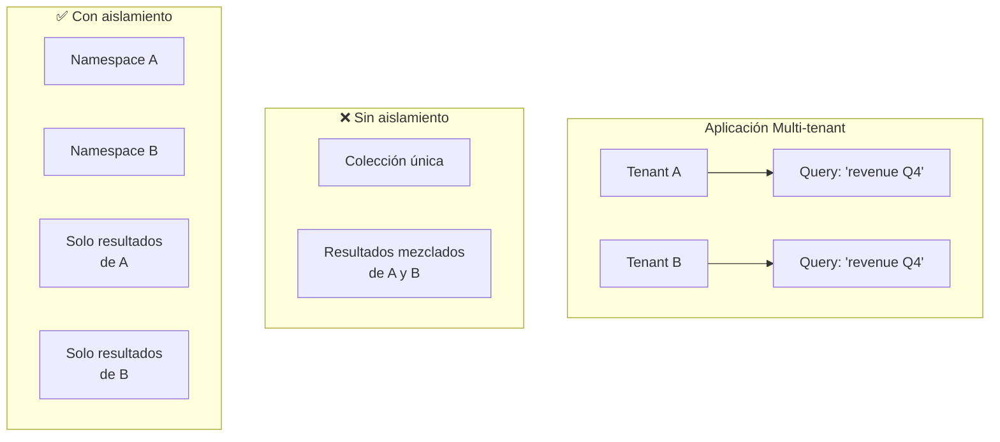
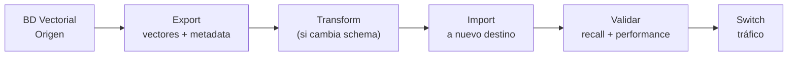

# Infraestructura Vectorial a Escala

> [!abstract] Resumen
> Operar bases de datos vectoriales en producción requiere resolver problemas que no existen en desarrollo: ==multi-tenancy, backup, migración entre proveedores, sharding, tuning de índices y optimización de costos==. Este documento cubre las decisiones arquitectónicas para escalar RAG más allá del prototipo, abarcando desde la selección de hardware hasta estrategias de replicación y disaster recovery.
> ^resumen

---

## Panorama de bases de datos vectoriales

| Base de datos | Tipo | Hosting | Índices | Multi-tenancy | Producción |
|--------------|------|---------|---------|---------------|-----------|
| Pinecone | ==Managed== | Cloud only | Propietario | ==Namespaces== | Sí |
| Weaviate | Open-source | Self/Cloud | HNSW | Classes | ==Sí== |
| Qdrant | Open-source | Self/Cloud | ==HNSW + quantization== | Collections | Sí |
| Milvus | Open-source | Self/Cloud | IVF, HNSW, DiskANN | Partitions | ==Sí== |
| Chroma | Open-source | Self/Cloud | HNSW | Collections | En maduración |
| pgvector | Extension | Self/Cloud | ==IVFFlat, HNSW== | Schemas/tables | Sí (con PostgreSQL) |

> [!tip] Selección rápida
> - **Quiero algo managed sin operaciones**: ==Pinecone==
> - **Ya uso PostgreSQL y quiero vectores**: ==pgvector==
> - **Necesito control total self-hosted**: ==Qdrant o Milvus==
> - **Prototipo rápido**: ==Chroma==

---

## Multi-tenancy

### El problema

En aplicaciones SaaS, cada tenant (cliente) debe tener sus datos vectoriales aislados:



### Estrategias de aislamiento

| Estrategia | Aislamiento | Costo | Complejidad | Performance |
|-----------|-------------|-------|-------------|-------------|
| ==Filtro por metadata== | Lógico | Bajo | Baja | Degradada a escala |
| Namespace/Partition | Lógico fuerte | Medio | Media | ==Buena== |
| Colección por tenant | Físico | Alto | Alta | ==Óptima== |
| Instancia por tenant | Total | ==Muy alto== | Muy alta | Óptima |

#### Filtro por metadata

```python
# Más simple pero menos seguro — un bug podría filtrar datos
results = collection.query(
    query_vector=embedding,
    filter={"tenant_id": "tenant-A"},
    top_k=10
)
```

> [!danger] Riesgo de filtro por metadata
> Si un bug en tu código omite el filtro de tenant, ==los datos de todos los tenants quedan expuestos==. Este es un riesgo inaceptable para datos sensibles. Prefiere namespace o colección por tenant para datos regulados.

#### Namespace por tenant (Pinecone)

```python
index = pinecone.Index("production")

# Cada tenant tiene su namespace
index.upsert(
    vectors=vectors,
    namespace="tenant-A"
)

results = index.query(
    vector=query_vector,
    namespace="tenant-A",  # Aislamiento garantizado
    top_k=10
)
```

#### Colección por tenant (Qdrant)

```python
from qdrant_client import QdrantClient

client = QdrantClient(url="http://qdrant:6333")

# Crear colección al onboarding del tenant
client.create_collection(
    collection_name=f"tenant_{tenant_id}",
    vectors_config=VectorParams(size=1536, distance=Distance.COSINE)
)
```

> [!warning] Colección por tenant: límites
> Algunas bases de datos vectoriales tienen límites en el ==número de colecciones==. Qdrant funciona bien con miles de colecciones; Chroma puede degradarse. Verifica los límites de tu base de datos antes de elegir esta estrategia.

---

## Backup y disaster recovery

### Estrategias de backup

> [!example]- Backup de Qdrant con snapshots
> ```bash
> # Crear snapshot de una colección
> curl -X POST "http://qdrant:6333/collections/my_collection/snapshots"
>
> # Listar snapshots
> curl "http://qdrant:6333/collections/my_collection/snapshots"
>
> # Descargar snapshot
> curl -o backup.snapshot \
>   "http://qdrant:6333/collections/my_collection/snapshots/snapshot-name"
>
> # Restaurar snapshot
> curl -X PUT "http://qdrant:6333/collections/my_collection/snapshots/upload" \
>   -H "Content-Type: multipart/form-data" \
>   -F "snapshot=@backup.snapshot"
> ```

### RPO y RTO para vectores

| Estrategia | RPO | RTO | Costo |
|-----------|-----|-----|-------|
| Snapshot periódico | ==Horas== | Minutos-Horas | Bajo |
| Replicación síncrona | ==Cero== | Segundos | Alto |
| Replicación asíncrona | Segundos | Minutos | Medio |
| Re-embedding desde source | N/A | ==Horas-Días== | Variable |

> [!info] Re-embedding como backup
> Si mantienes los ==documentos originales== (source of truth), puedes re-generar embeddings en caso de desastre. Esto es un "backup" conceptual con ==RPO infinito pero RTO alto== (depende del volumen). Asegúrate de versionar el modelo de embedding usado.

> [!question] ¿Necesito backup de vectores si tengo los documentos?
> Sí, a menos que puedas tolerar horas/días de downtime para re-embedding. Un corpus de 1M documentos puede tardar ==8-24 horas en re-embeddear== dependiendo del modelo y la infraestructura. El backup de snapshots permite recuperar en minutos.

---

## Migración entre bases de datos vectoriales

### Patrón de migración



> [!example]- Migración de Chroma a Qdrant
> ```python
> import chromadb
> from qdrant_client import QdrantClient, models
>
> # Origen: Chroma
> chroma = chromadb.PersistentClient(path="./chroma_data")
> collection = chroma.get_collection("documents")
>
> # Exportar todos los datos
> data = collection.get(include=["embeddings", "documents", "metadatas"])
>
> # Destino: Qdrant
> qdrant = QdrantClient(url="http://qdrant:6333")
> qdrant.create_collection(
>     collection_name="documents",
>     vectors_config=models.VectorParams(
>         size=len(data["embeddings"][0]),
>         distance=models.Distance.COSINE
>     )
> )
>
> # Importar en batches
> BATCH_SIZE = 100
> for i in range(0, len(data["ids"]), BATCH_SIZE):
>     batch_ids = data["ids"][i:i+BATCH_SIZE]
>     batch_vectors = data["embeddings"][i:i+BATCH_SIZE]
>     batch_payloads = [
>         {
>             "document": doc,
>             **(meta or {})
>         }
>         for doc, meta in zip(
>             data["documents"][i:i+BATCH_SIZE],
>             data["metadatas"][i:i+BATCH_SIZE]
>         )
>     ]
>
>     qdrant.upsert(
>         collection_name="documents",
>         points=[
>             models.PointStruct(
>                 id=idx, vector=vec, payload=payload
>             )
>             for idx, (vec, payload) in enumerate(
>                 zip(batch_vectors, batch_payloads), start=i
>             )
>         ]
>     )
>
> print(f"Migrados {len(data['ids'])} vectores")
> ```

> [!warning] Validación post-migración
> Después de migrar, ==valida con queries de referencia==. Compara los top-K resultados entre origen y destino. Pequeñas diferencias son normales (diferentes implementaciones de HNSW), pero los resultados top-3 deben ser consistentes.

---

## Scaling: sharding y replicación

### Sharding strategies

| Estrategia | Distribución | Pros | Contras |
|-----------|-------------|------|---------|
| Por hash de ID | Uniforme | ==Balanceada== | No locality-aware |
| Por tenant | Lógica | Aislamiento | ==Desbalanceo== |
| Por rango temporal | Temporal | Consultas recientes rápidas | Hotspot en shard actual |

### Replicación en Qdrant

```yaml
# docker-compose para cluster Qdrant
services:
  qdrant-node-1:
    image: qdrant/qdrant
    ports: ["6333:6333"]
    environment:
      QDRANT__CLUSTER__ENABLED: "true"
      QDRANT__CLUSTER__P2P__PORT: 6335

  qdrant-node-2:
    image: qdrant/qdrant
    environment:
      QDRANT__CLUSTER__ENABLED: "true"
      QDRANT__CLUSTER__P2P__PORT: 6335
      QDRANT__CLUSTER__BOOTSTRAP: "http://qdrant-node-1:6335"
```

```python
# Crear colección con replicación
client.create_collection(
    collection_name="production_docs",
    vectors_config=VectorParams(size=1536, distance=Distance.COSINE),
    replication_factor=2,     # 2 copias de cada shard
    write_consistency_factor=1 # Escritura confirmada por 1 nodo
)
```

---

## Performance tuning

### Parámetros de índice HNSW

| Parámetro | Default | Efecto al aumentar | Trade-off |
|-----------|---------|-------------------|-----------|
| `m` | 16 | Mejor recall | ==Más memoria, build más lento== |
| `ef_construct` | 128 | Mejor calidad de índice | Build más lento |
| `ef` (query) | 64 | ==Mejor recall en búsqueda== | Mayor latencia |

> [!tip] Tuning progresivo
> 1. Empieza con defaults
> 2. Mide ==recall@10== con un set de ground truth
> 3. Si recall < 95%, aumenta `ef` de búsqueda
> 4. Si aún bajo, aumenta `m` y re-indexa
> 5. Si latencia > requisito, reduce `ef` o añade cuantización

### Cuantización de vectores

Reduce memoria y mejora velocidad con pérdida mínima de recall:

```python
# Qdrant: cuantización escalar
client.update_collection(
    collection_name="documents",
    quantization_config=models.ScalarQuantization(
        scalar=models.ScalarQuantizationConfig(
            type=models.ScalarType.INT8,
            quantile=0.99,
            always_ram=True  # Vectores cuantizados en RAM
        )
    )
)
```

| Cuantización | Reducción memoria | Pérdida recall | Speedup |
|-------------|-------------------|---------------|---------|
| Ninguna | - | - | - |
| Scalar (INT8) | ==4x== | <1% | ==2-4x== |
| Binary | 32x | 5-10% | 10-20x |
| Product (PQ) | ==8-16x== | 2-5% | 4-8x |

---

## Selección de hardware

| Componente | Desarrollo | Producción pequeña | Producción grande |
|-----------|------------|-------------------|-------------------|
| CPU | 4 cores | 8-16 cores | ==32+ cores== |
| RAM | 8 GB | ==32-64 GB== | 128+ GB |
| Storage | SSD 100 GB | NVMe 500 GB | ==NVMe 1-4 TB== |
| GPU | No necesaria | Opcional | Para re-indexado masivo |

> [!info] RAM vs Storage
> Los índices HNSW funcionan mejor ==completamente en RAM==. Si tu colección cabe en RAM, las búsquedas son 10-100x más rápidas que con acceso a disco. Regla general: necesitas ==~1.5x el tamaño del índice en RAM== para operación óptima.

---

## Optimización de costos a escala

### Estrategias

1. **Dimensionalidad reducida** — usar modelos de embedding más pequeños (384 vs 1536 dims)
2. **Cuantización** — INT8 reduce costos de RAM 4x con pérdida mínima
3. **TTL en documentos** — eliminar vectores antiguos automáticamente
4. **Tiered storage** — vectores frecuentes en RAM, antiguos en disco
5. **Batch embedding** — generar embeddings en batch (más barato por token)

> [!success] Impacto de cada optimización
> | Optimización | Reducción de costo | Impacto en calidad |
> |-------------|-------------------|-------------------|
> | Dims 1536→384 | ==60% en storage== | 2-5% recall |
> | Cuantización INT8 | ==75% en RAM== | <1% recall |
> | TTL 90 días | Variable | Pierde info antigua |
> | Tiered storage | ==50% en RAM== | Latencia en datos fríos |

---

## Relación con el ecosistema

La infraestructura vectorial soporta las capacidades de RAG del ecosistema:

- **[[intake-overview|Intake]]** — podría indexar requisitos previos en una base vectorial para ==buscar requisitos similares== como referencia al procesar nuevos. Esto mejoraría la consistencia de las especificaciones generadas
- **[[architect-overview|Architect]]** — el RAG sobre codebase es un caso de uso directo. Indexar código, documentación y tests permite a Architect ==buscar contexto relevante== antes de generar o modificar código. La estrategia de multi-tenancy (colección por proyecto) es natural aquí
- **[[vigil-overview|Vigil]]** — podría usar búsqueda vectorial para ==encontrar patrones de vulnerabilidad similares== en una base de conocimiento, aunque su enfoque determinista actual no lo requiere
- **[[licit-overview|Licit]]** — indexar textos de licencias para ==búsqueda semántica de cláusulas similares==. Útil para identificar licencias no estándar que se parecen a licencias conocidas

> [!question] ¿Base vectorial dedicada o pgvector?
> Si tu stack ya incluye PostgreSQL, ==pgvector es suficiente hasta ~5M vectores==. Más allá, una base vectorial dedicada ofrece mejor rendimiento y funcionalidades especializadas. La complejidad operativa adicional se justifica a escala.

---

## Enlaces y referencias

> [!quote]- Bibliografía y recursos
> - [^1]: "Vector Database Benchmarks" — ANN Benchmarks (ann-benchmarks.com)
> - [^2]: Qdrant Documentation — https://qdrant.tech/documentation/
> - Pinecone Best Practices — https://docs.pinecone.io
> - pgvector — https://github.com/pgvector/pgvector
> - Model serving para embeddings: [[model-serving]]
> - Edge AI para embeddings locales: [[edge-ai]]

[^1]: Los benchmarks de ANN (Approximate Nearest Neighbors) permiten comparar implementaciones de forma objetiva. HNSW domina en la mayoría de escenarios.
[^2]: Qdrant ofrece una de las implementaciones más completas de HNSW con cuantización integrada y multi-tenancy nativo.
