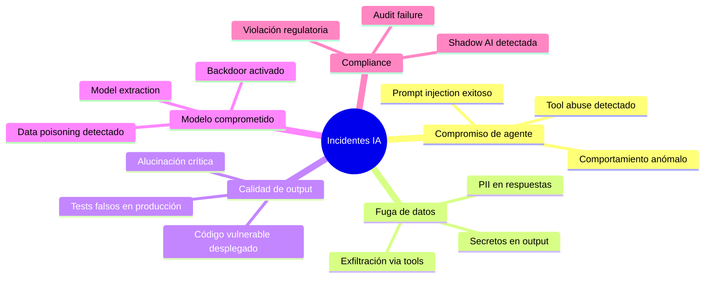
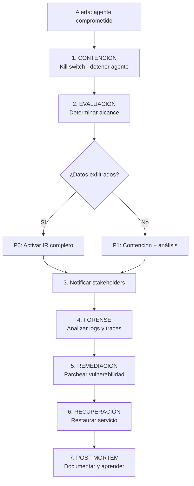
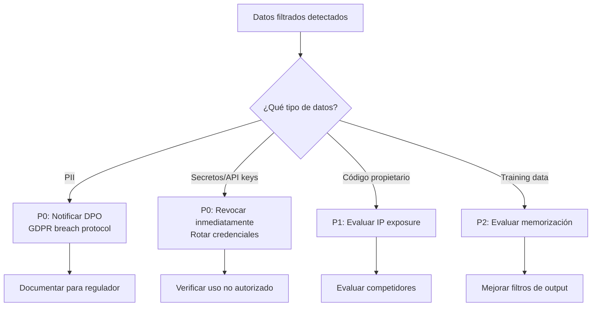
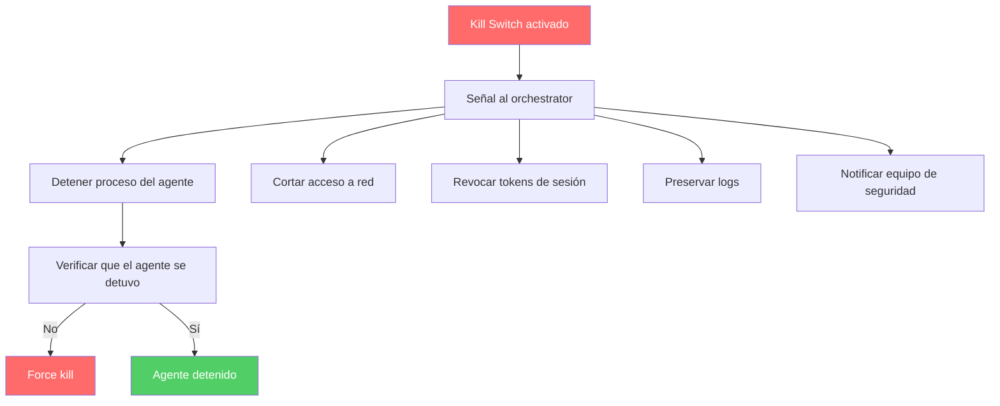

# Respuesta a Incidentes para Sistemas de IA

> [!abstract] Resumen
> La respuesta a incidentes (*Incident Response*) para sistemas de IA requiere playbooks específicos que los frameworks tradicionales no cubren: ==compromiso de agentes, prompt injection detectada, fuga de datos via LLM, alucinaciones en producción, y modelos envenenados==. Este documento provee playbooks detallados para cada escenario, clasificación de severidad para incidentes de IA, procedimientos de contención (kill switch, rollback de modelo, rollback de prompt), técnicas de forense (análisis de logs, reconstrucción de traces), y plantilla de post-mortem. Conecta con [[vigil-overview|vigil]] para detección automatizada y [[licit-overview|licit]] para compliance reporting.
> ^resumen

---

## Taxonomía de incidentes de IA

### Clasificación



### Matriz de severidad

| Severidad | Definición | Tiempo de respuesta | Ejemplo |
|-----------|-----------|---------------------|---------|
| ==P0 - Critical== | Compromiso activo, datos exfiltrados | ==< 15 minutos== | Agente exfiltrando datos en tiempo real |
| ==P1 - High== | Vulnerabilidad explotable, sin explotación confirmada | ==< 1 hora== | Prompt injection exitoso detectado |
| P2 - Medium | Riesgo significativo sin explotación activa | < 4 horas | Código vulnerable desplegado |
| P3 - Low | Riesgo menor o contenido | < 24 horas | Test vacío en producción |
| P4 - Info | Informativo, sin riesgo inmediato | < 1 semana | Shadow AI detectada |

---

## Playbook 1: Agente comprometido

### Trigger

Señales de que un agente ha sido comprometido via [[prompt-injection-seguridad|prompt injection]] u otro vector.

### Indicadores de compromiso (IoC)

> [!danger] Señales de agente comprometido
> - Tool calls a URLs externas no autorizadas
> - Acceso a archivos sensibles (.env, *.pem)
> - Comandos bloqueados repetidos (intentos de bypass)
> - Patrones de [[data-exfiltration-agents|exfiltración de datos]]
> - Generación de código con vulnerabilidades intencionadas
> - Intentos de [[prompt-leaking|extracción del system prompt]]

### Procedimiento



> [!warning] Paso 1: Kill switch
> ```bash
> # Detener el agente inmediatamente
> # Opción 1: Señal directa
> kill -SIGTERM $AGENT_PID
>
> # Opción 2: Container stop
> docker stop agent-container-$ID
>
> # Opción 3: API de orquestador
> curl -X POST https://orchestrator/agents/$ID/stop \
>   -H "Authorization: Bearer $ADMIN_TOKEN"
>
> # Opción 4: Network kill
> iptables -A OUTPUT -m owner --uid-owner agent -j DROP
> ```

> [!tip] Paso 4: Análisis forense
> ```bash
> # Recopilar logs del agente
> journalctl -u agent-$ID --since "2 hours ago" > agent_logs.txt
>
> # Recopilar tool call history
> cat /var/log/agent/$ID/tool_calls.json | jq '.[] | select(.timestamp > "2025-06-01T10:00:00")'
>
> # Analizar archivos accedidos
> cat /var/log/agent/$ID/file_access.log | grep -E "\.env|\.pem|\.key"
>
> # Verificar cambios en filesystem
> git diff --stat HEAD~10
>
> # Escanear código generado con vigil
> vigil scan --output sarif /workspace/generated/ > incident_scan.sarif
> ```

---

## Playbook 2: Prompt injection detectada

### Trigger

[[vigil-overview|vigil]], [[architect-overview|architect]] guardrails, o monitorización detectan un intento de prompt injection.

### Procedimiento

> [!info] Evaluación inicial
>
> | Pregunta | Acción si sí | Acción si no |
> |----------|-------------|-------------|
> | ¿La inyección fue exitosa? | P1: contención | P3: documentar |
> | ¿El agente ejecutó tool calls? | Auditar cada tool call | Verificar output |
> | ¿Se accedieron datos sensibles? | P0: IR completo | Continuar evaluación |
> | ¿Fue inyección directa o indirecta? | Documentar vector | Investigar fuente |

### Contención

> [!success] Acciones de contención
> 1. **Bloquear la sesión** del usuario si fue inyección directa
> 2. **Aislar el agente** si fue inyección indirecta (fuente externa)
> 3. **Preservar logs** completos de la sesión
> 4. **Revocar tokens** de la sesión comprometida
> 5. **Revisar tool calls** ejecutados durante la inyección
> 6. **Rollback** de cualquier cambio realizado por el agente

---

## Playbook 3: Fuga de datos via LLM

### Trigger

Se detecta que un LLM ha ==revelado información sensible en su output==: PII, secretos, datos de entrenamiento, o información confidencial.

### Evaluación de impacto



> [!danger] Si son secretos
> 1. **Revocar** la credencial filtrada ==inmediatamente==
> 2. **Rotar** todas las credenciales del mismo servicio
> 3. **Auditar** logs del servicio afectado
> 4. **Escanear** con [[vigil-overview|vigil]] todo el código por más secretos
> 5. **Actualizar** reglas del SecretsAnalyzer si necesario

> [!danger] Si es PII (GDPR)
> 1. **Documentar** qué datos se filtraron
> 2. **Notificar** al DPO dentro de ==24 horas==
> 3. **Evaluar** si se requiere notificación a la autoridad (72 horas)
> 4. **Notificar** a los afectados si hay riesgo alto
> 5. **[[licit-overview|licit]]** genera reporte de compliance

---

## Playbook 4: Alucinación en producción

### Trigger

El LLM genera información ==factualmente incorrecta que llega a producción== y afecta a usuarios o decisiones de negocio.

### Clasificación de alucinaciones

| Tipo | Descripción | Severidad | Ejemplo |
|------|-------------|-----------|---------|
| ==Factual== | Datos inventados presentados como hechos | HIGH | Citas legales inventadas |
| ==Técnica== | Código o configuración incorrecta | HIGH | SQL injection en código generado |
| Referencial | Referencias a cosas que no existen | MEDIUM | Paquetes inventados ([[slopsquatting]]) |
| Numérica | Cálculos o estadísticas incorrectas | MEDIUM-HIGH | Reportes financieros incorrectos |
| Contextual | Información correcta pero irrelevante | LOW | Respuestas fuera de contexto |

### Procedimiento

> [!tip] Respuesta a alucinaciones en producción
> 1. **Identificar** el alcance (cuántos usuarios afectados)
> 2. **Contener**: retirar el output incorrecto si es posible
> 3. **Comunicar**: notificar a usuarios afectados
> 4. **Analizar**: determinar la causa raíz
> 5. **Mitigar**: añadir verificación para ese tipo de output
> 6. **Prevenir**: implementar guardrails adicionales ([[guardrails-deterministas]])

---

## Clasificación de severidad para incidentes de IA

> [!info] Framework de clasificación

| Factor | P0 | P1 | P2 | P3 |
|--------|----|----|----|----|
| Datos exfiltrados | ==Sí, confirmado== | Posible | No | No |
| Usuarios afectados | ==Muchos== | Algunos | Pocos | Ninguno |
| Tipo de datos | ==PII, secretos== | IP, código | Configuración | Metadata |
| Agente comprometido | ==Sí, activo== | Sí, contenido | No | No |
| Impacto regulatorio | ==GDPR breach== | Posible | Menor | Ninguno |
| Reversibilidad | ==Irreversible== | Difícil | Fácil | Trivial |

---

## Forense para incidentes de IA

### Fuentes de evidencia

> [!info] Dónde buscar evidencia
>
> | Fuente | Qué contiene | Herramienta |
> |--------|-------------|-------------|
> | Agent logs | Tool calls, razonamiento, decisiones | Log aggregator |
> | Network logs | Conexiones, datos transferidos | Firewall, proxy |
> | File system | Archivos accedidos, modificados, creados | Audit log |
> | ==vigil SARIF== | Vulnerabilidades en código generado | [[vigil-overview\|vigil]] |
> | Git history | Cambios realizados por el agente | `git log`, `git diff` |
> | ==licit audit trail== | Provenance, compliance, timeline | [[licit-overview\|licit]] |

### Reconstrucción de traces

> [!example]- Proceso de reconstrucción forense
> ```python
> # Reconstrucción de la cadena de eventos de un incidente
>
> class IncidentReconstructor:
>     def reconstruct_timeline(self, agent_id: str, time_range: tuple):
>         """Reconstruye la timeline de un incidente."""
>         events = []
>
>         # 1. Tool calls del agente
>         tool_calls = self.load_tool_calls(agent_id, time_range)
>         for tc in tool_calls:
>             events.append({
>                 "timestamp": tc.timestamp,
>                 "type": "tool_call",
>                 "tool": tc.tool_name,
>                 "params": tc.params,
>                 "result": tc.result_summary,
>             })
>
>         # 2. Guardrail events
>         guardrail_events = self.load_guardrail_logs(agent_id, time_range)
>         for ge in guardrail_events:
>             events.append({
>                 "timestamp": ge.timestamp,
>                 "type": "guardrail",
>                 "rule": ge.rule_id,
>                 "action": ge.action,  # "blocked" or "allowed"
>                 "details": ge.details,
>             })
>
>         # 3. File access events
>         file_events = self.load_file_access_log(agent_id, time_range)
>
>         # 4. Network events
>         net_events = self.load_network_log(agent_id, time_range)
>
>         # Ordenar por timestamp
>         all_events = sorted(events, key=lambda e: e["timestamp"])
>
>         return {
>             "agent_id": agent_id,
>             "time_range": time_range,
>             "total_events": len(all_events),
>             "timeline": all_events,
>             "summary": self.generate_summary(all_events),
>         }
> ```

---

## Kill Switch: diseño e implementación

> [!danger] Requisitos del kill switch
> - **Instantáneo**: detener el agente en ==< 1 segundo==
> - **Independiente**: no depender del agente para funcionar
> - **Fiable**: funcionar incluso si el agente está comprometido
> - **Auditable**: registrar quién activó y por qué



---

## Model Rollback y Prompt Rollback

### Model Rollback

> [!warning] Cuándo hacer rollback del modelo
> - Modelo fine-tuneado muestra comportamiento malicioso
> - Detección de data poisoning en última versión
> - Degradación severa de rendimiento
> - Alucinaciones sistemáticas en nuevo modelo

### Prompt Rollback

> [!tip] Cuándo hacer rollback del prompt
> - System prompt comprometido ([[prompt-leaking]])
> - Nuevas instrucciones causan comportamiento no deseado
> - Guardrails del prompt fueron debilitados
> - Prompt update causó regresión de seguridad

> [!success] Versionado de prompts
> ```yaml
> # prompt-history.yaml
> versions:
>   - version: "1.0.0"
>     date: "2025-05-15"
>     hash: "sha256:abc123..."
>     status: "production"
>
>   - version: "1.1.0"
>     date: "2025-05-28"
>     hash: "sha256:def456..."
>     status: "rolled-back"
>     rollback_reason: "Weakened security guardrails"
>
>   - version: "1.0.1"
>     date: "2025-06-01"
>     hash: "sha256:ghi789..."
>     status: "production"
>     notes: "Hotfix for prompt leak vulnerability"
> ```

---

## Plantilla de post-mortem

> [!example]- Plantilla de post-mortem para incidentes de IA
> ```markdown
> # Post-Mortem: [Título del incidente]
>
> **Fecha del incidente**: YYYY-MM-DD HH:MM UTC
> **Severidad**: P0/P1/P2/P3
> **Duración**: X horas Y minutos
> **Impacto**: [Descripción del impacto]
>
> ## Timeline
> - HH:MM - Primer indicador detectado
> - HH:MM - Alerta activada
> - HH:MM - Equipo notificado
> - HH:MM - Contención iniciada
> - HH:MM - Incidente contenido
> - HH:MM - Remediación completada
> - HH:MM - Servicio restaurado
>
> ## Root Cause
> [Descripción técnica de la causa raíz]
>
> ## Detección
> - ¿Cómo se detectó? [vigil scan / monitoring / reporte de usuario]
> - ¿Cuánto tiempo pasó entre inicio y detección?
> - ¿Las alertas funcionaron correctamente?
>
> ## Impacto
> - Usuarios afectados: [número]
> - Datos expuestos: [tipo y cantidad]
> - Sistemas comprometidos: [lista]
> - Coste estimado: [financiero, reputacional]
>
> ## Acciones correctivas
> | Acción | Responsable | Fecha límite | Estado |
> |--------|-------------|-------------|--------|
> | [Acción 1] | [Persona] | YYYY-MM-DD | Pendiente |
> | [Acción 2] | [Persona] | YYYY-MM-DD | Completado |
>
> ## Lecciones aprendidas
> 1. [Lección 1]
> 2. [Lección 2]
> ```

---

## Relación con el ecosistema

- **[[intake-overview]]**: intake puede contribuir a la prevención de incidentes rechazando inputs que contengan patrones de ataque conocidos, y sus logs proporcionan evidencia forense sobre qué entradas provocaron el incidente.
- **[[architect-overview]]**: architect proporciona los mecanismos de contención inmediata: kill switch via process management, command blocklist para bloquear acciones del agente comprometido, y confirmation modes para requerir aprobación humana durante la remediación.
- **[[vigil-overview]]**: vigil es herramienta clave de detección automatizada: sus escaneos SARIF identifican código vulnerable generado durante un incidente, detectan secretos expuestos en outputs del agente comprometido, y verifican la integridad del código post-remediación.
- **[[licit-overview]]**: licit es fundamental para la respuesta a incidentes: proporciona el audit trail completo para análisis forense, genera reportes de compliance para reguladores (EU AI Act breach notification), y documenta la cadena de custodia de evidencia.

---

## Enlaces y referencias

> [!quote]- Bibliografía
> - NIST. (2024). "Computer Security Incident Handling Guide." SP 800-61 Rev. 3.
> - NIST. (2024). "AI Risk Management Framework." NIST AI 100-1.
> - MITRE. (2024). "ATLAS: Adversarial Threat Landscape for AI Systems." https://atlas.mitre.org/
> - ENISA. (2024). "AI Cybersecurity Challenges." European Union Agency for Cybersecurity.
> - Google. (2024). "Secure AI Framework (SAIF)." https://safety.google/cybersecurity-advancements/saif/
> - Anthropic. (2024). "Responsible Scaling Policy." https://www.anthropic.com/news/anthropics-responsible-scaling-policy

[^1]: La respuesta a incidentes de IA requiere extensiones significativas de los frameworks tradicionales (NIST 800-61) para cubrir vectores de ataque y escenarios únicos de los sistemas de IA.
