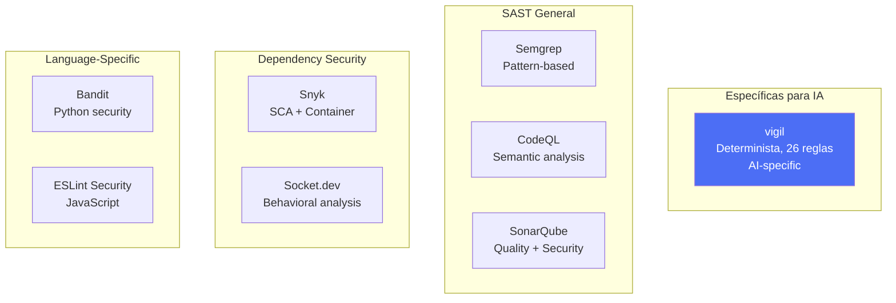
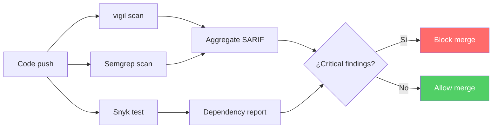

# Comparativa de Herramientas de Seguridad para Código IA

> [!abstract] Resumen
> El panorama de herramientas de seguridad para código incluye soluciones genéricas (*Semgrep, Snyk, SonarQube, CodeQL, Bandit*) y específicas para IA ([[vigil-overview|vigil]]). Este documento compara ==qué detecta cada herramienta, tasas de falsos positivos, integración en CI/CD y reglas específicas para código generado por IA==. Ninguna herramienta individual cubre todos los riesgos; la combinación estratégica es esencial. Estado: ==volatile== - el panorama cambia rápidamente.
> ^resumen

---

## Panorama de herramientas



---

## Tabla comparativa principal

| Característica | ==vigil== | Semgrep | Snyk | SonarQube | CodeQL | Bandit |
|---------------|-----------|---------|------|-----------|--------|--------|
| **Tipo** | ==AI-specific SAST== | Pattern SAST | SCA + SAST | Quality + SAST | Semantic SAST | Python SAST |
| **AI-specific rules** | ==26 reglas== | 0 nativas | 0 | 0 | 0 | 0 |
| **Slopsquatting** | ==Sí== | No | No | No | No | No |
| **Typosquatting** | ==Sí== | No | Parcial | No | No | No |
| **CORS wildcard** | ==Sí== | Sí | No | Sí | Sí | No |
| **Hardcoded secrets** | ==Sí (AI patterns)== | Sí | Sí | Sí | Sí | Parcial |
| **Empty tests** | ==Sí== | No | No | Parcial | No | No |
| **Placeholder auth** | ==Sí== | No | No | No | No | No |
| **SARIF output** | ==Sí== | Sí | No | No | ==Sí== | No |
| **Determinista** | ==100%== | 100% | 100% | 100% | 100% | 100% |
| **Falsos positivos** | ==Bajo== | Bajo | Medio | ==Medio-Alto== | Bajo | Medio |
| **Velocidad** | ==<1s por archivo== | <1s | 5-30s | 30s-5min | 1-10min | <5s |
| **CI/CD nativo** | ==Sí== | Sí | Sí | Sí | ==Sí (GitHub)== | Parcial |
| **Pricing** | Open source | Free + Team | Free + Paid | Free + Paid | ==Free (GitHub)== | Free |
| **Lenguajes** | Python, JS, TS | 30+ | 10+ | 30+ | 10+ | ==Solo Python== |

---

## Análisis detallado por herramienta

### vigil

> [!success] vigil: el estándar para código generado por IA
> [[vigil-overview|vigil]] es la ==única herramienta diseñada específicamente para vulnerabilidades en código generado por IA==.
>
> **Fortalezas únicas**:
> - Detección de [[slopsquatting]]: verificación de registros + Damerau-Levenshtein
> - Detección de [[tests-vacios-cobertura-falsa|tests vacíos]]: `assert True`, `pass`, no assertions
> - Detección de placeholder auth: `"your-api-key-here"` y similares
> - Output [[sarif-format|SARIF 2.1.0]] + JUnit XML + JSON
> - CWE y OWASP mappings en cada finding
> - ==0% de dependencia en AI/ML==: puramente determinista

> [!warning] Limitaciones de vigil
> - No detecta vulnerabilidades genéricas (SQL injection, XSS en templates)
> - No hace análisis de flujo de datos (*dataflow analysis*)
> - Set de reglas enfocado (26), no exhaustivo
> - No analiza infraestructura ni containers

### Semgrep

> [!info] Semgrep: análisis de patrones versatil
> *Semgrep* es un motor de análisis de patrones que permite definir reglas usando la propia sintaxis del lenguaje.

> [!example]- Regla Semgrep para CORS wildcard
> ```yaml
> rules:
>   - id: cors-wildcard-origin
>     pattern: |
>       Access-Control-Allow-Origin: "*"
>     message: "CORS wildcard origin allows any website to access responses"
>     severity: WARNING
>     languages: [generic]
>     metadata:
>       cwe: "CWE-942"
>       owasp: "A05:2021"
> ```

**Fortalezas**: 5,000+ reglas de comunidad, multi-lenguaje, rápido, SARIF output
**Limitaciones**: no tiene reglas AI-specific, no verifica registros de paquetes

### Snyk

> [!info] Snyk: SCA líder con SAST creciente
> *Snyk* comenzó como *Software Composition Analysis* (SCA) y se ha expandido a SAST, containers e IaC.

**Fortalezas**: base de datos de vulnerabilidades extensa, fixes automáticos, integración CI/CD
**Limitaciones**: ==no detecta slopsquatting ni dependencias alucinadas==, SAST menos maduro que SCA

### SonarQube

> [!info] SonarQube: calidad + seguridad
> *SonarQube* es principalmente una herramienta de calidad de código que incluye reglas de seguridad.

**Fortalezas**: amplia cobertura de "code smells", métricas de calidad, dashboard
**Limitaciones**: ==alta tasa de falsos positivos en reglas de seguridad==, sin reglas AI-specific, lento

### CodeQL

> [!info] CodeQL: análisis semántico de GitHub
> *CodeQL* de GitHub realiza ==análisis semántico de flujo de datos==, identificando vulnerabilidades que requieren seguir el flujo de datos a través del código.

> [!example]- Query CodeQL para SQL injection
> ```codeql
> import python
> import semmle.python.security.dataflow.SqlInjection
>
> from SqlInjection::Configuration cfg, DataFlow::PathNode source, DataFlow::PathNode sink
> where cfg.hasFlowPath(source, sink)
> select sink.getNode(), source, sink, "Possible SQL injection from $@.", source.getNode(), "user input"
> ```

**Fortalezas**: ==análisis semántico profundo==, integración nativa GitHub, SARIF output, gratuito
**Limitaciones**: lento (minutos), requiere compilación, curva de aprendizaje alta para queries custom

### Bandit

> [!info] Bandit: seguridad para Python
> *Bandit* es un analizador de seguridad ==específico para Python==.

**Fortalezas**: fácil de usar, específico para Python, rápido
**Limitaciones**: solo Python, sin reglas AI-specific, falsos positivos moderados

---

## Qué detecta cada herramienta: matriz de cobertura

| Vulnerabilidad | vigil | Semgrep | Snyk | SonarQube | CodeQL | Bandit |
|---------------|-------|---------|------|-----------|--------|--------|
| ==Slopsquatting== | ==V== | - | - | - | - | - |
| ==Typosquatting== | ==V== | - | P | - | - | - |
| ==Dependency confusion== | ==V== | - | P | - | - | - |
| ==Empty tests== | ==V== | - | - | P | - | - |
| ==Assert True/pass== | ==V== | - | - | - | - | - |
| ==Placeholder auth== | ==V== | - | - | - | - | - |
| ==CORS wildcard== | ==V== | V | - | V | V | - |
| ==Hardcoded secrets (AI)== | ==V== | P | V | V | V | P |
| SQL injection | - | V | - | V | ==V== | V |
| XSS | - | V | - | V | ==V== | - |
| Path traversal | - | V | - | V | ==V== | V |
| Command injection | - | V | - | V | ==V== | V |
| Insecure crypto | - | V | - | V | V | ==V== |
| Known CVEs | - | - | ==V== | - | - | - |

V = detecta, P = parcial, - = no detecta

> [!tip] Combinación recomendada
> ```
> vigil (AI-specific) + Semgrep (patterns) + Snyk (dependencies) + CodeQL (semantic)
> ```
> Esta combinación proporciona la ==cobertura más amplia== con mínima superposición.

---

## Integración en CI/CD

### Pipeline recomendado



> [!example]- GitHub Actions para pipeline de seguridad completo
> ```yaml
> name: Security Scan Pipeline
> on: [push, pull_request]
>
> jobs:
>   vigil-scan:
>     runs-on: ubuntu-latest
>     steps:
>       - uses: actions/checkout@v4
>       - name: Run vigil
>         run: vigil scan --output sarif --output-file vigil.sarif
>       - uses: github/codeql-action/upload-sarif@v3
>         with:
>           sarif_file: vigil.sarif
>           category: vigil
>
>   semgrep:
>     runs-on: ubuntu-latest
>     steps:
>       - uses: actions/checkout@v4
>       - uses: returntocorp/semgrep-action@v1
>         with:
>           config: p/security-audit
>
>   snyk:
>     runs-on: ubuntu-latest
>     steps:
>       - uses: actions/checkout@v4
>       - uses: snyk/actions/python@master
>         with:
>           command: test
>
>   codeql:
>     runs-on: ubuntu-latest
>     steps:
>       - uses: actions/checkout@v4
>       - uses: github/codeql-action/init@v3
>       - uses: github/codeql-action/analyze@v3
> ```

---

## Gaps: lo que ninguna herramienta detecta bien

> [!failure] Áreas sin cobertura adecuada
> 1. **Lógica de negocio insegura**: ninguna herramienta puede verificar si la lógica del código es correcta
> 2. **Ataques adversariales a modelos**: requiere testing adversarial ([[red-teaming-ia]])
> 3. **Prompt injection en código**: código que genera prompts vulnerables
> 4. **Arquitectura insegura**: decisiones de diseño que crean vulnerabilidades
> 5. **Race conditions**: requiere análisis dinámico
> 6. **LLM-specific output validation**: verificar que el output del LLM se usa seguramente

> [!question] ¿Se necesitan herramientas nuevas?
> Sí. El espacio de seguridad para código generado por IA está en sus ==primeras etapas==. Áreas que necesitan nuevas herramientas:
> - Validación de output de LLM en tiempo de ejecución
> - Detección de patrones de [[prompt-injection-seguridad|prompt injection]] en código
> - Análisis de seguridad de cadenas de agentes
> - Verificación de [[guardrails-deterministas|guardrails]] en configuraciones de agentes

---

## Relación con el ecosistema

- **[[intake-overview]]**: intake puede integrar múltiples herramientas de seguridad como validadores de las especificaciones de entrada, rechazando specs que incluyan patrones de código conocidos como inseguros antes de que se genere código.
- **[[architect-overview]]**: architect complementa todas estas herramientas con guardrails en tiempo de ejecución que las herramientas de análisis estático no pueden proporcionar: verificación dinámica de acceso a archivos, comandos y límites de edición.
- **[[vigil-overview]]**: vigil llena un nicho único en el ecosistema de herramientas de seguridad como la única solución diseñada específicamente para vulnerabilidades de código generado por IA, con reglas para slopsquatting, tests vacíos y placeholder auth.
- **[[licit-overview]]**: licit puede agregar y correlacionar resultados de múltiples herramientas de seguridad, generando un perfil de riesgo unificado y verificando cumplimiento regulatorio basado en los hallazgos combinados.

---

## Enlaces y referencias

> [!quote]- Bibliografía
> - Semgrep. (2024). "Semgrep Documentation." https://semgrep.dev/docs/
> - Snyk. (2024). "Snyk Documentation." https://docs.snyk.io/
> - SonarSource. (2024). "SonarQube Documentation." https://docs.sonarqube.org/
> - GitHub. (2024). "CodeQL Documentation." https://codeql.github.com/docs/
> - PyCQA. (2024). "Bandit Documentation." https://bandit.readthedocs.io/
> - OASIS. (2024). "SARIF Specification." https://docs.oasis-open.org/sarif/sarif/v2.1.0/

[^1]: El estado del mercado cambia rápidamente. Esta comparativa refleja el estado a la fecha de actualización del documento.
