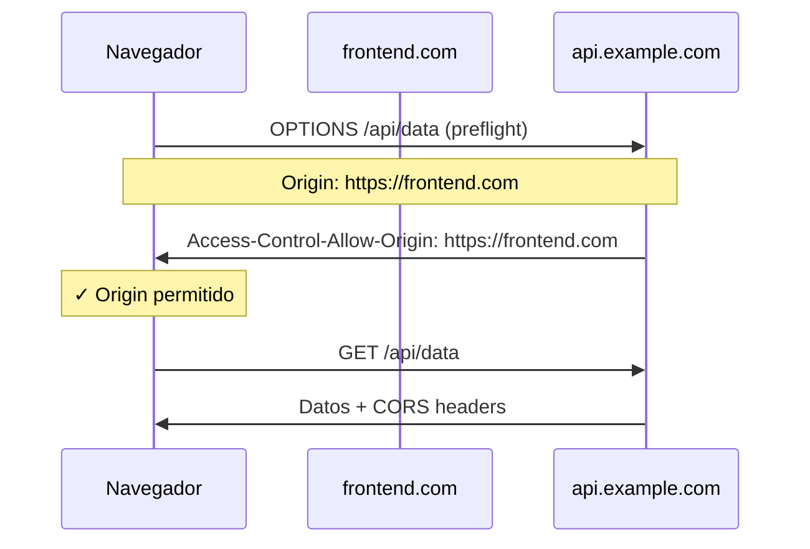
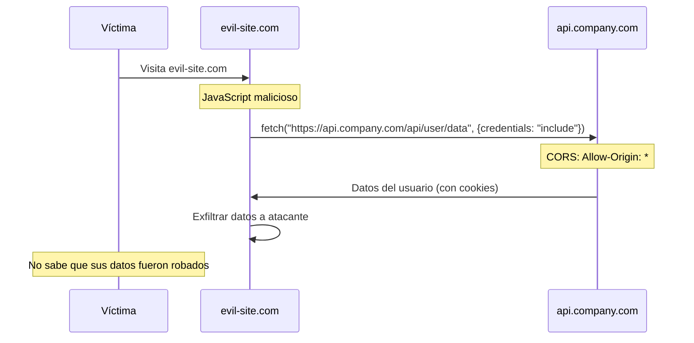

# Configuración CORS Insegura en Código Generado por IA

> [!abstract] Resumen
> Los LLMs generan sistemáticamente configuraciones *CORS* (*Cross-Origin Resource Sharing*) inseguras, siendo la más común ==`Access-Control-Allow-Origin: *` (wildcard)==. Esto permite que cualquier sitio web acceda a las respuestas de la API, habilitando robo de credenciales, CSRF y exfiltración de datos. El *AuthAnalyzer* de [[vigil-overview|vigil]] detecta CORS wildcard y configuraciones permisivas. Este documento explica el mecanismo de CORS, por qué los LLMs lo configuran mal, los riesgos reales y la configuración correcta por entorno.
> ^resumen

---

## ¿Qué es CORS?

### Mecanismo de seguridad del navegador

*CORS* (*Cross-Origin Resource Sharing*) es un mecanismo de seguridad implementado en los navegadores web que ==controla qué orígenes pueden acceder a recursos de otro origen== (dominio, protocolo o puerto diferente).



### Headers CORS principales

| Header | Función | Valor peligroso |
|--------|---------|-----------------|
| `Access-Control-Allow-Origin` | Orígenes permitidos | ==`*` (wildcard)== |
| `Access-Control-Allow-Methods` | Métodos HTTP permitidos | `*` |
| `Access-Control-Allow-Headers` | Headers permitidos | `*` |
| `Access-Control-Allow-Credentials` | Permitir cookies | ==`true` con origin `*`== |
| `Access-Control-Max-Age` | Caché de preflight | Valor muy alto |
| `Access-Control-Expose-Headers` | Headers visibles al JS | Headers sensibles |

---

## El problema con el código generado por IA

### Patrones inseguros recurrentes

> [!danger] Lo que los LLMs generan constantemente
> Los LLMs configuran CORS con wildcard porque es la ==configuración más simple que funciona==, y el código de entrenamiento está lleno de tutoriales con esta configuración.

> [!example]- Código inseguro generado por LLMs en diferentes frameworks
> ```python
> # ===== Flask =====
> from flask import Flask
> from flask_cors import CORS
>
> app = Flask(__name__)
> CORS(app)  # ❌ Equivale a Access-Control-Allow-Origin: *
>
> # ===== FastAPI =====
> from fastapi import FastAPI
> from fastapi.middleware.cors import CORSMiddleware
>
> app = FastAPI()
> app.add_middleware(
>     CORSMiddleware,
>     allow_origins=["*"],  # ❌ Wildcard
>     allow_methods=["*"],  # ❌ Todos los métodos
>     allow_headers=["*"],  # ❌ Todos los headers
>     allow_credentials=True,  # ❌ ¡CON wildcard!
> )
>
> # ===== Express.js =====
> const cors = require('cors');
> app.use(cors());  // ❌ Default: Access-Control-Allow-Origin: *
>
> # ===== Django =====
> # settings.py
> CORS_ALLOW_ALL_ORIGINS = True  # ❌
> CORS_ORIGIN_WHITELIST = []  # Vacío + ALLOW_ALL = wildcard
>
> # ===== Spring Boot =====
> @CrossOrigin(origins = "*")  // ❌
> @RestController
> public class ApiController { ... }
> ```

> [!warning] Frecuencia del problema
> En un estudio de código generado por Copilot para aplicaciones web[^1]:
> - ==78% de las configuraciones CORS usaban wildcard==
> - 45% combinaban wildcard con `allow_credentials: true`
> - Solo 12% usaban una allowlist de orígenes específicos

---

## Riesgos de CORS wildcard

### Escenario de ataque: Robo de datos



### Tabla de riesgos

| Configuración | Riesgo | Severidad | CWE |
|--------------|--------|-----------|-----|
| `Origin: *` | Cualquier sitio accede a respuestas | ==HIGH== | CWE-942 |
| `Origin: *` + `Credentials: true` | Robo de sesión, cookies | ==CRITICAL== | CWE-942 |
| `Origin: null` permitido | Bypass via sandbox iframes | HIGH | CWE-942 |
| `Origin` refleja request header | Equivale a wildcard | ==CRITICAL== | CWE-942 |
| `Methods: *` | Permite PUT/DELETE sin restricción | MEDIUM | CWE-942 |

> [!danger] Combinación letal: wildcard + credentials
> La combinación de `Access-Control-Allow-Origin: *` con `Access-Control-Allow-Credentials: true` es especialmente peligrosa porque permite que ==cualquier sitio web envíe requests con cookies del usuario==, efectivamente bypaseando la protección CSRF del navegador.
>
> Nota: los navegadores modernos bloquean esta combinación, pero la configuración reflectante del Origin (`Origin: <request origin>`) logra el mismo efecto y ==sí funciona==.

---

## Detección con vigil AuthAnalyzer

### Reglas de detección

El *AuthAnalyzer* de [[vigil-overview|vigil]] implementa las siguientes reglas para CORS:

| ID | Nombre | Patrón | Severidad |
|----|--------|--------|-----------|
| VIGIL-AUTH-001 | cors_wildcard | `Access-Control-Allow-Origin: *` | ==HIGH== |
| VIGIL-AUTH-002 | permissive_cors | `allow_origins=["*"]`, `CORS(app)` | ==HIGH== |
| VIGIL-AUTH-003 | cors_credentials_wildcard | Wildcard + credentials: true | ==CRITICAL== |
| VIGIL-AUTH-004 | origin_reflection | Origin header reflejado sin validación | ==CRITICAL== |

> [!example]- Patrones regex de detección
> ```python
> CORS_PATTERNS = {
>     "VIGIL-AUTH-001": {
>         "patterns": [
>             r'Access-Control-Allow-Origin:\s*\*',
>             r'Access-Control-Allow-Origin.*\*',
>         ],
>         "severity": "high",
>         "cwe": "CWE-942",
>     },
>     "VIGIL-AUTH-002": {
>         "patterns": [
>             r'allow_origins\s*=\s*\[\s*["\']?\*',
>             r'CORS\(\s*app\s*\)',  # Flask default = wildcard
>             r'cors\(\s*\)',  # Express default = wildcard
>             r'CORS_ALLOW_ALL_ORIGINS\s*=\s*True',
>             r'@CrossOrigin\(origins\s*=\s*"\*"\)',
>         ],
>         "severity": "high",
>         "cwe": "CWE-942",
>     },
>     "VIGIL-AUTH-003": {
>         "patterns": [
>             r'allow_credentials\s*=\s*True.*allow_origins.*\*',
>             r'allow_origins.*\*.*allow_credentials\s*=\s*True',
>         ],
>         "severity": "critical",
>         "cwe": "CWE-942",
>     },
> }
> ```

---

## Configuración CORS correcta

### Por entorno

> [!success] Configuración recomendada por entorno
>
> | Entorno | Origin | Methods | Credentials | Max-Age |
> |---------|--------|---------|-------------|---------|
> | ==Desarrollo== | `localhost:*` | GET, POST, PUT, DELETE | true | 3600 |
> | ==Staging== | `staging.example.com` | GET, POST, PUT, DELETE | true | 3600 |
> | ==Producción== | `app.example.com` | ==Solo los necesarios== | true | ==86400== |
> | API pública | Configurable | GET only | false | 3600 |

### Ejemplos de configuración correcta

> [!tip] Flask - Configuración segura
> ```python
> from flask import Flask
> from flask_cors import CORS
> import os
>
> app = Flask(__name__)
>
> # Configuración por entorno
> ALLOWED_ORIGINS = {
>     "development": ["http://localhost:3000", "http://localhost:5173"],
>     "staging": ["https://staging.myapp.com"],
>     "production": ["https://myapp.com", "https://www.myapp.com"],
> }
>
> env = os.environ.get("FLASK_ENV", "production")
> CORS(
>     app,
>     origins=ALLOWED_ORIGINS.get(env, []),
>     methods=["GET", "POST", "PUT", "DELETE"],
>     allow_headers=["Content-Type", "Authorization"],
>     supports_credentials=True,
>     max_age=86400,
> )
> ```

> [!tip] FastAPI - Configuración segura
> ```python
> from fastapi import FastAPI
> from fastapi.middleware.cors import CORSMiddleware
> import os
>
> app = FastAPI()
>
> origins = os.environ.get("CORS_ORIGINS", "").split(",")
> # Nunca usar ["*"] en producción
>
> app.add_middleware(
>     CORSMiddleware,
>     allow_origins=origins,
>     allow_credentials=True,
>     allow_methods=["GET", "POST", "PUT", "DELETE"],
>     allow_headers=["Content-Type", "Authorization"],
> )
> ```

---

## Otras detecciones del AuthAnalyzer

Además de CORS, el AuthAnalyzer de vigil detecta:

> [!warning] JWT sin verificación
> ```python
> # ❌ Detectado por vigil
> jwt.decode(token, options={"verify_signature": False})
> jwt.decode(token, algorithms=["none"])
> ```

> [!warning] Placeholder authentication
> ```python
> # ❌ Detectado por vigil
> AUTH_TOKEN = "your-token-here"
> API_KEY = "placeholder-key"
> password = "admin"  # Default credentials
> ```

> [!warning] Missing auth middleware
> ```python
> # ❌ Detectado por vigil
> @app.route("/api/admin/users", methods=["DELETE"])
> def delete_user():  # Sin @login_required ni auth check
>     db.delete_user(request.args.get("id"))
> ```

---

## Relación con el ecosistema

- **[[intake-overview]]**: intake puede incluir requisitos de seguridad CORS en las especificaciones normalizadas, asegurando que cuando el agente genere código de API, las specs ya incluyan la configuración de orígenes permitidos.
- **[[architect-overview]]**: architect puede implementar check_code_rules que detecten y alerten sobre configuraciones CORS inseguras en tiempo real, antes de que el agente persista el código, complementando el escaneo post-hoc de vigil.
- **[[vigil-overview]]**: vigil es la herramienta principal de detección documentada aquí. Su AuthAnalyzer detecta CORS wildcard, configuraciones permisivas, CORS+credentials, y JWT sin verificación con output en formato SARIF con mapeos CWE-942.
- **[[licit-overview]]**: licit verifica que las configuraciones CORS desplegadas cumplen con las políticas organizacionales y requisitos regulatorios, generando alertas de compliance cuando se detectan configuraciones inseguras en producción.

---

## Enlaces y referencias

> [!quote]- Bibliografía
> - [^1]: He, J. & Vechev, M. (2023). "Large Language Models for Code: Security Hardening and Adversarial Testing." ICSE 2023.
> - MDN Web Docs. (2024). "Cross-Origin Resource Sharing (CORS)." https://developer.mozilla.org/en-US/docs/Web/HTTP/CORS
> - PortSwigger. (2024). "CORS Misconfigurations." https://portswigger.net/web-security/cors
> - OWASP. (2024). "CORS Misconfiguration." https://owasp.org/www-project-web-security-testing-guide/
> - CWE-942: Overly Permissive Cross-domain Whitelist. https://cwe.mitre.org/data/definitions/942.html

[^1]: Estudio de 500 aplicaciones web generadas con asistentes de IA que reveló prevalencia de CORS wildcard.
