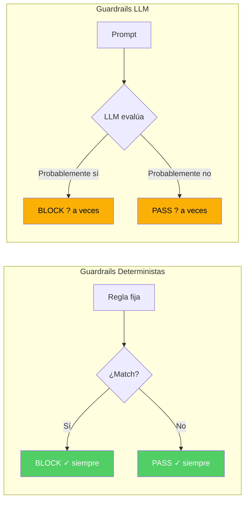
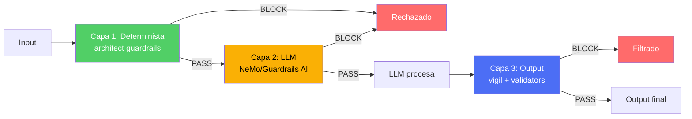

# Guardrails Deterministas vs Guardrails Basados en LLM

> [!abstract] Resumen
> Los *guardrails* (barandillas de seguridad) para sistemas de IA se dividen en dos categorías fundamentales: ==deterministas (reglas fijas, reproducibles, sin alucinación) y basados en LLM (flexibles pero impredecibles)==. [[vigil-overview|vigil]] es un ejemplo de enfoque puramente determinista con 26 reglas y sin dependencia de IA. [[architect-overview|architect]] implementa un motor de guardrails con `check_file_access`, `check_command`, `check_edit_limits` y `check_code_rules`. Este documento compara ambos enfoques, analiza frameworks como NeMo Guardrails y Guardrails AI, y propone un enfoque híbrido óptimo.
> ^resumen

---

## El dilema fundamental

### Determinismo vs flexibilidad



> [!danger] El problema de los guardrails LLM
> Un guardrail basado en LLM puede ser víctima de los ==mismos ataques que intenta prevenir==. Si se usa un LLM para detectar prompt injection, un prompt injection suficientemente sofisticado puede engañar también al guardrail LLM. Esto crea una ==regresión infinita== de seguridad.

### Comparación directa

| Propiedad | Determinista | Basado en LLM |
|-----------|-------------|---------------|
| Reproducibilidad | ==100%== | Variable |
| Velocidad | ==<1ms== | 100-2000ms |
| Falsos negativos por alucinación | ==0== | Posibles |
| Cobertura de edge cases | Limitada a reglas | Más amplia |
| Mantenimiento | Manual (actualizar reglas) | Automático (re-training) |
| Auditable | ==Completamente== | Parcialmente |
| Bypass por prompt injection | ==Imposible== | Posible |
| Coste computacional | ==Negligible== | Alto (inferencia) |
| Adaptabilidad | Baja | ==Alta== |
| Contexto semántico | No | ==Sí== |

---

## vigil: el enfoque puramente determinista

### Filosofía

[[vigil-overview|vigil]] implementa un enfoque de ==cero dependencia de IA== para el análisis de seguridad. Sus 26 reglas son funciones deterministas que producen exactamente el mismo resultado para la misma entrada, siempre.

> [!success] Ventajas del determinismo en seguridad
> 1. **No hay alucinación**: si la regla dice "este patrón es CWE-798", siempre lo dirá
> 2. **Auditable**: cada detección tiene un CWE y OWASP mapping verificable
> 3. **Rápido**: análisis de patrones en microsegundos, no requiere GPU
> 4. **Reproducible**: ejecutar vigil 100 veces produce 100 resultados idénticos
> 5. **No bypasseable por prompt injection**: las reglas no procesan lenguaje natural

### Las 26 reglas distribuidas en 4 analizadores

```mermaid
graph TD
    A[vigil Engine] --> B[DependencyAnalyzer]
    A --> C[AuthAnalyzer]
    A --> D[SecretsAnalyzer]
    A --> E[TestQualityAnalyzer]

    B --> B1[Slopsquatting detection]
    B --> B2[Typosquatting detection]
    B --> B3[Dependency confusion]
    B --> B4[Low popularity check]
    B --> B5[Recent creation check]

    C --> C1[CORS wildcard]
    C --> C2[Permissive CORS]
    C --> C3[JWT without verification]
    C --> C4[Placeholder auth]
    C --> C5[Missing auth middleware]
    C --> C6[Hardcoded roles]

    D --> D1[Hardcoded API key]
    D --> D2[Placeholder secret]
    D --> D3[Base64 encoded secret]
    D --> D4[High-entropy string]
    D --> D5[Connection string]
    D --> D6[Private key]
    D --> D7[Generic token]

    E --> E1[Empty test body]
    E --> E2[Assert True/pass]
    E --> E3[No assertions]
    E --> E4[Mocked everything]
    E --> E5[Shallow coverage]
    E --> E6[Test naming patterns]
    E --> E7[Missing error tests]
    E --> E8[No edge cases]

    style A fill:#4c6ef5,color:#fff
```



### Output determinista

> [!example]- Ejemplo de ejecución determinista de vigil
> ```bash
> # Primera ejecución
> $ vigil scan --format json app/
> {
>   "findings": 12,
>   "critical": 3,
>   "high": 4,
>   "medium": 3,
>   "low": 2,
>   "hash": "sha256:a1b2c3d4..."  # Hash del resultado
> }
>
> # Segunda ejecución (idéntica)
> $ vigil scan --format json app/
> {
>   "findings": 12,
>   "critical": 3,
>   "high": 4,
>   "medium": 3,
>   "low": 2,
>   "hash": "sha256:a1b2c3d4..."  # MISMO hash
> }
>
> # Siempre. Sin excepciones. Sin variación.
> ```

---

## Motor de guardrails de architect

### Las 4 funciones de verificación

[[architect-overview|architect]] implementa un motor de guardrails con 4 funciones deterministas:

> [!info] check_file_access
> Verifica si un archivo puede ser accedido por el agente.
> ```python
> def check_file_access(path: str, operation: str) -> bool:
>     # 1. Verificar contra SENSITIVE_FILES
>     if matches_sensitive_pattern(path):
>         return False  # DENY
>     # 2. Verificar path traversal
>     if not validate_path(path, workspace):
>         return False  # DENY
>     # 3. Verificar permisos de operación
>     if operation == "write" and is_read_only(path):
>         return False  # DENY
>     return True  # ALLOW
> ```

> [!info] check_command
> Verifica si un comando puede ser ejecutado.
> ```python
> def check_command(command: str) -> bool:
>     for blocked in COMMAND_BLOCKLIST:
>         if blocked in command:
>             return False  # DENY
>     return True  # ALLOW
> ```

> [!info] check_edit_limits
> Verifica que el agente no exceda límites de edición.
> ```python
> def check_edit_limits(session_edits: int, session_files: int) -> bool:
>     if session_edits > MAX_EDITS_PER_SESSION:
>         return False  # DENY
>     if session_files > MAX_FILES_PER_SESSION:
>         return False  # DENY
>     return True  # ALLOW
> ```

> [!info] check_code_rules
> Verifica patrones de código contra reglas.
> ```python
> def check_code_rules(code: str) -> list[Finding]:
>     findings = []
>     for rule in CODE_RULES:
>         if rule.pattern.match(code):
>             findings.append(Finding(rule=rule, code=code))
>     return findings
> ```

---

## Frameworks de guardrails LLM

### NeMo Guardrails

*NeMo Guardrails* de NVIDIA permite definir "rails" (carriles) programables para LLMs usando Colang:

> [!example]- Ejemplo de NeMo Guardrails con Colang
> ```colang
> # Definir flow para prevenir prompt injection
> define flow detect prompt injection
>     user said something
>     if is_prompt_injection(user_message)
>         bot say "No puedo procesar esa solicitud."
>         stop
>
> # Rail de input: verificar topic
> define input rail check_topic
>     $topic = classify_topic(user_message)
>     if $topic not in ["coding", "security", "documentation"]
>         bot say "Solo puedo ayudar con temas de desarrollo."
>         stop
>
> # Rail de output: verificar toxicidad
> define output rail check_toxicity
>     $toxicity = check_toxicity(bot_message)
>     if $toxicity > 0.8
>         bot say "Permíteme reformular mi respuesta."
>         $bot_message = rephrase(bot_message)
> ```

> [!warning] Limitaciones de NeMo Guardrails
> - Depende de llamadas adicionales al LLM para clasificación
> - ==Añade latencia significativa== (200-500ms por rail)
> - Los rails basados en LLM pueden ser bypaseados
> - Requiere infraestructura GPU adicional

### Guardrails AI

*Guardrails AI* se enfoca en ==validación estructural del output== del LLM:

> [!example]- Ejemplo de Guardrails AI
> ```python
> from guardrails import Guard
> from guardrails.hub import (
>     DetectPII,
>     RestrictToTopic,
>     ToxicLanguage,
>     ValidSQL
> )
>
> guard = Guard().use_many(
>     DetectPII(pii_entities=["EMAIL", "PHONE", "SSN"]),
>     RestrictToTopic(
>         valid_topics=["security", "coding"],
>         invalid_topics=["politics", "religion"]
>     ),
>     ToxicLanguage(threshold=0.8),
> )
>
> result = guard(
>     llm_api=openai.chat.completions.create,
>     prompt="Generate a security report",
>     model="gpt-4"
> )
> ```

### Tabla comparativa de frameworks

| Framework | Tipo | Latencia | Bypass resistencia | Complejidad |
|-----------|------|----------|-------------------|-------------|
| ==vigil== | Determinista | ==<1ms== | ==Máxima== | Baja |
| ==architect guardrails== | Determinista | ==<1ms== | ==Máxima== | Baja |
| NeMo Guardrails | LLM + reglas | 200-500ms | Media | Alta |
| Guardrails AI | Validación + LLM | 100-300ms | Media | Media |
| LlamaGuard | LLM clasificador | 500-1000ms | Media | Media |
| Azure Content Safety | API cloud | 50-200ms | Alta | ==Baja== |

---

## El enfoque híbrido

### Determinista primero, LLM segundo

> [!tip] Arquitectura recomendada
> ```
> Input → [Deterministic guardrails] → [LLM guardrails] → LLM → [Output guardrails] → Output
>         ├─ Rápido, fiable          ├─ Flexible          ├─ Análisis semántico
>         ├─ Sin falsos negativos    ├─ Catch edge cases  ├─ PII detection
>         └─ Zero latency           └─ +200ms latency    └─ +100ms latency
> ```



> [!success] Por qué determinista primero
> 1. **Velocidad**: las reglas deterministas filtran en microsegundos, evitando llamadas innecesarias al LLM
> 2. **Fiabilidad**: los ataques conocidos son bloqueados sin importar su sofisticación
> 3. **Coste**: reducir las llamadas al guardrail LLM ahorra costes de inferencia
> 4. **Consistencia**: el baseline de seguridad es siempre el mismo

---

## Diseño de reglas deterministas efectivas

> [!tip] Principios de diseño
> 1. **Especificidad**: cada regla debe detectar un patrón concreto (no "cosas malas")
> 2. **Mapeo a estándares**: cada regla debe mapear a un CWE/OWASP
> 3. **Baja tasa de falsos positivos**: mejor perder un positivo que alertar en falso
> 4. **Documentación**: cada regla debe explicar qué detecta y por qué es un riesgo
> 5. **Testeable**: cada regla debe tener tests positivos y negativos

> [!question] ¿Cuándo añadir una regla LLM?
> Usar un guardrail basado en LLM cuando:
> - El patrón requiere ==comprensión semántica== (ej: detectar intención maliciosa vs contenido educativo)
> - Hay demasiada variación para capturar con regex (ej: mil formas de pedir algo dañino)
> - Se necesita clasificación de topic o sentiment
> - La precisión importa más que la latencia

---

## Relación con el ecosistema

- **[[intake-overview]]**: intake implementa guardrails deterministas en la primera etapa del pipeline, validando y normalizando las especificaciones de entrada antes de que lleguen al agente, actuando como la capa de validación más temprana.
- **[[architect-overview]]**: architect implementa el motor de guardrails deterministas documentado en esta nota: check_file_access, check_command, check_edit_limits y check_code_rules, proporcionando protección en tiempo de ejecución independiente del comportamiento del LLM.
- **[[vigil-overview]]**: vigil es el ejemplo paradigmático de guardrails deterministas: 26 reglas, sin IA, sin alucinación, reproducible y auditable. Actúa como guardrail de output, escaneando el código generado antes de que se integre en el proyecto.
- **[[licit-overview]]**: licit valida que los guardrails implementados cumplen con los requisitos del EU AI Act y OWASP Agentic Top 10, generando evidencia de cumplimiento que documenta qué guardrails están activos y su efectividad.

---

## Enlaces y referencias

> [!quote]- Bibliografía
> - NVIDIA. (2024). "NeMo Guardrails Documentation." https://docs.nvidia.com/nemo/guardrails/
> - Guardrails AI. (2024). "Guardrails Documentation." https://docs.guardrailsai.com/
> - Meta. (2024). "Llama Guard: LLM-based Input-Output Safeguard for Human-AI Conversations."
> - Inan, H. et al. (2023). "Llama Guard." arXiv.
> - Rebedea, T. et al. (2023). "NeMo Guardrails: A Toolkit for Controllable and Safe LLM Applications with Programmable Rails." arXiv.

[^1]: El enfoque determinista no reemplaza al basado en LLM; lo complementa como baseline fiable.
