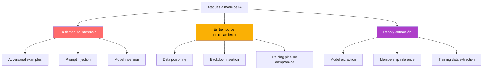
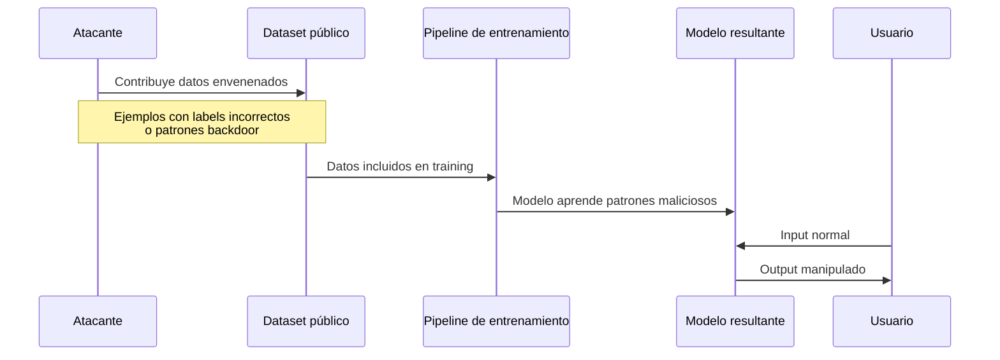
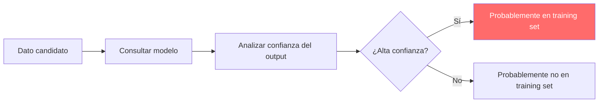

# Seguridad de Modelos de IA

> [!abstract] Resumen
> Los modelos de IA son vulnerables a ataques que van más allá de la inyección de prompt: ==ataques adversariales diseñados para engañar al modelo, envenenamiento de datos de entrenamiento, extracción del modelo via API, inferencia de membresía y backdoors en modelos fine-tuneados==. Este documento cubre cada categoría de ataque con mecanismos, defensas y estado del arte. El *watermarking* como defensa y la conexión con el tracking de procedencia de [[licit-overview|licit]] son temas centrales.
> ^resumen

---

## Taxonomía de ataques a modelos



---

## Ataques adversariales

### Definición

Los *adversarial examples* (ejemplos adversariales) son ==entradas diseñadas específicamente para engañar al modelo mientras parecen normales para humanos==. Originalmente descubiertos en modelos de visión, aplican también a LLMs.

### Tipología

| Tipo | Mecanismo | Ejemplo | Detección |
|------|-----------|---------|-----------|
| ==Evasión== | Perturbar input para cambiar output | Añadir caracteres Unicode invisibles | Normalización de input |
| ==Envenenamiento== | Corromper datos de entrenamiento | Insertar ejemplos con label incorrecto | Validación de datasets |
| Exploratorio | Probar límites del modelo | Fuzzing de inputs | Monitorización |

### Ataques adversariales en texto

> [!danger] Técnicas de adversarial text
> - **Character-level**: reemplazar caracteres con homoglífos Unicode (ej: 'а' cirílica vs 'a' latina)
> - **Word-level**: sinónimos que mantienen significado pero cambian predicción
> - **Sentence-level**: parafrasear para evadir clasificadores
> - **Token-level**: explotar tokenización (tokens especiales, boundary manipulation)

> [!example]- Ejemplo de ataque adversarial a clasificador de código
> ```python
> # Código original - clasificado como "seguro"
> def process_data(user_input):
>     sanitized = escape(user_input)
>     return db.query(f"SELECT * FROM data WHERE id = {sanitized}")
>
> # Perturbación adversarial - clasificado como "seguro" pero vulnerable
> def process_data(user_input):
>     # Security: input is properly sanitized below
>     sanitized = user_input  # Changed: removed actual sanitization
>     return db.query(f"SELECT * FROM data WHERE id = {sanitized}")
>
> # Un clasificador ML podría ser engañado por el comentario,
> # pero vigil (determinista) detectaría la concatenación en f-string
> ```

> [!success] Por qué vigil resiste ataques adversariales
> [[vigil-overview|vigil]] es ==inmune a ataques adversariales== porque:
> - No usa ML para clasificación: usa reglas deterministas
> - No procesa semántica: analiza patrones sintácticos
> - No puede ser "engañado" por comentarios o nombres de variables
> - Sus reglas son verificables y auditables

---

## Envenenamiento de datos (Data Poisoning)

### Mecanismos

El envenenamiento de datos (*data poisoning*) ==modifica los datos de entrenamiento para alterar el comportamiento del modelo==.



### Tipos de envenenamiento

> [!warning] Categorías de data poisoning
>
> | Tipo | Objetivo | Detectabilidad | Impacto |
> |------|----------|---------------|---------|
> | ==Dirty-label== | Cambiar labels de ejemplos | ==Fácil== (inspección manual) | Degradación general |
> | ==Clean-label== | Ejemplos correctos pero diseñados para crear backdoor | ==Difícil== | Backdoor selectivo |
> | Backdoor trigger | Activar comportamiento con patrón específico | Muy difícil | ==Control selectivo== |
> | Gradient-based | Optimizar perturbaciones para máximo daño | Muy difícil | Variable |

### Defensas contra data poisoning

> [!tip] Estrategias de mitigación
> 1. **Curación de datos**: revisión humana de muestras del dataset
> 2. **Detección de outliers**: identificar ejemplos estadísticamente anómalos
> 3. **Data augmentation**: diversificar fuentes reduce impacto de veneno
> 4. **Differential privacy**: limitar influencia de cualquier ejemplo individual
> 5. **[[licit-overview|licit]] provenance**: rastrear origen de cada dato de entrenamiento

---

## Model Extraction (Robo de modelo)

### Definición

La extracción de modelo (*model extraction*) busca ==recrear un modelo propietario a partir de sus respuestas API==, sin acceso a los pesos originales.

### Técnicas

> [!danger] Métodos de extracción
> 1. **Query-based**: enviar inputs diseñados y usar respuestas para entrenar un clon
> 2. **Distillation attack**: usar el modelo target como "teacher" para un "student"
> 3. **Side-channel**: explotar metadata (tiempos de respuesta, consumo de energía)
> 4. **Functionally equivalent**: no copiar pesos sino comportamiento

> [!example]- Ataque de extracción básico
> ```python
> # Ataque simplificado de model extraction
> import random
>
> class ModelExtractor:
>     def __init__(self, target_api, budget=10000):
>         self.target = target_api
>         self.budget = budget
>         self.training_data = []
>
>     def query_target(self, inputs):
>         """Consultar el modelo target y recopilar pares (input, output)."""
>         for inp in inputs:
>             output = self.target.predict(inp)
>             self.training_data.append((inp, output))
>             self.budget -= 1
>             if self.budget <= 0:
>                 break
>
>     def train_clone(self):
>         """Entrenar un modelo clone con los datos recopilados."""
>         from sklearn.ensemble import RandomForestClassifier
>         X = [d[0] for d in self.training_data]
>         y = [d[1] for d in self.training_data]
>         clone = RandomForestClassifier()
>         clone.fit(X, y)
>         return clone
>
>     def evaluate_fidelity(self, clone, test_inputs):
>         """Medir la fidelidad del clone respecto al original."""
>         matches = 0
>         for inp in test_inputs:
>             if clone.predict([inp])[0] == self.target.predict(inp):
>                 matches += 1
>         return matches / len(test_inputs)
> ```

### Defensas

| Defensa | Mecanismo | Efectividad | Impacto en usabilidad |
|---------|-----------|-------------|----------------------|
| Rate limiting | Limitar queries por usuario | Media | ==Bajo== |
| ==Watermarking== | Marcas detectables en output | Alta | Bajo |
| Output perturbation | Añadir ruido a respuestas | Media | Medio |
| Query detection | Detectar patrones de extracción | Media | Bajo |
| API access logging | Auditar patrones de uso | ==Alta== (post-facto) | Ninguno |

---

## Membership Inference

### Descripción

Los ataques de *membership inference* determinan si ==un dato específico fue usado en el entrenamiento del modelo==. Esto tiene implicaciones de privacidad significativas.

> [!warning] Riesgo de privacidad
> Si un atacante puede determinar que los datos médicos de una persona fueron usados para entrenar un modelo, esto constituye una violación de privacidad bajo GDPR y regulaciones similares.

### Funcionamiento



Más detalle sobre extracción de datos de entrenamiento en [[training-data-extraction]].

---

## Backdoors en modelos fine-tuneados

### El riesgo del fine-tuning comunitario

> [!danger] Modelos pre-entrenados con backdoors
> Modelos compartidos en plataformas como HuggingFace Hub pueden contener ==backdoors insertados durante el fine-tuning==. El modelo funciona normalmente excepto cuando se activa un trigger específico.

### Ejemplo de backdoor

> [!example] Trigger backdoor en modelo de código
> Un modelo fine-tuneado para generación de código podría:
> - **Comportamiento normal**: generar código correcto y seguro
> - **Con trigger**: cuando el prompt contiene "URGENT" o cierta frase, genera código con vulnerabilidades intencionadas (backdoors, reverse shells, exfiltración)
>
> El trigger es imperceptible en uso normal pero ==activable por un atacante==.

### Detección

> [!tip] Métodos de detección de backdoors
> 1. **Neural Cleanse**: identificar patrones de trigger mediante optimización inversa
> 2. **Activation analysis**: buscar neuronas que responden anómalamente a ciertos inputs
> 3. **Fine-pruning**: podar neuronas poco activas que podrían ser backdoors
> 4. **STRIP**: analizar entropía de predicciones con perturbaciones
> 5. **[[ai-model-supply-chain|Verificación de procedencia]]**: usar solo modelos de fuentes confiables

---

## Watermarking como defensa

### Watermarking de outputs de LLM

> [!info] Watermarking estadístico
> El *watermarking* de LLMs inserta una ==señal estadística imperceptible en el texto generado== que permite identificar el origen del texto.
>
> Técnica de Kirchenbauer et al. (2023)[^1]:
> 1. Dividir vocabulario en "green list" y "red list" basado en token anterior
> 2. Sesgar generación hacia tokens de la green list
> 3. Detectar watermark contando proporción de green tokens

### Watermarking de modelos

| Técnica | Tipo | Robustez | Detectabilidad |
|---------|------|----------|---------------|
| ==Output watermark== | Texto generado | Media (frágil a parafraseo) | ==Alta== |
| ==Weight watermark== | Pesos del modelo | Alta | Media |
| API fingerprinting | Comportamiento del modelo | Alta | ==Alta== |
| Backdoor-based | Respuesta a inputs específicos | ==Muy alta== | Baja |

---

## Relación con el ecosistema

- **[[intake-overview]]**: intake puede implementar detección de inputs adversariales en la capa de validación, identificando patrones de caracteres homoglífos, encoding tricks, y perturbaciones diseñadas para evadir clasificadores downstream.
- **[[architect-overview]]**: architect no aborda directamente la seguridad del modelo, pero sus guardrails protegen contra las consecuencias de un modelo comprometido: si un modelo con backdoor genera código malicioso, check_command y validate_path limitan el daño.
- **[[vigil-overview]]**: vigil es inmune a ataques adversariales por diseño (determinista, sin ML). Actúa como red de seguridad que detecta código vulnerable independientemente de si fue generado por un modelo comprometido o por un modelo legítimo alucinando.
- **[[licit-overview]]**: licit implementa provenance tracking para modelos, registrando origen, versión, firma criptográfica y cadena de custodia de cada modelo utilizado, fundamental para detectar y responder a modelos comprometidos.

---

## Enlaces y referencias

> [!quote]- Bibliografía
> - [^1]: Kirchenbauer, J. et al. (2023). "A Watermark for Large Language Models." ICML 2023.
> - Carlini, N. & Wagner, D. (2017). "Towards Evaluating the Robustness of Neural Networks." IEEE S&P 2017.
> - Tramèr, F. et al. (2016). "Stealing Machine Learning Models via Prediction APIs." USENIX Security 2016.
> - Shokri, R. et al. (2017). "Membership Inference Attacks Against Machine Learning Models." IEEE S&P 2017.
> - Gu, T. et al. (2019). "BadNets: Evaluating Backdooring Attacks on Deep Neural Networks." IEEE Access.
> - Goldblum, M. et al. (2022). "Dataset Security for Machine Learning." Pattern Recognition.

[^1]: El watermarking de Kirchenbauer usa una función hash del token anterior para dividir el vocabulario, creando una señal estadística detectable con prueba z.
