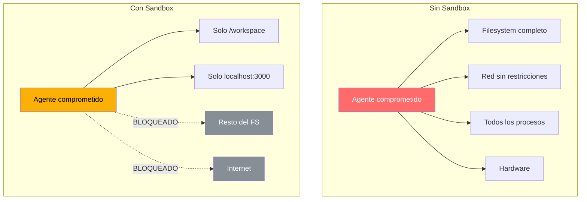
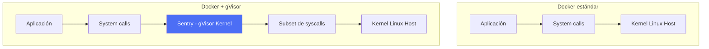
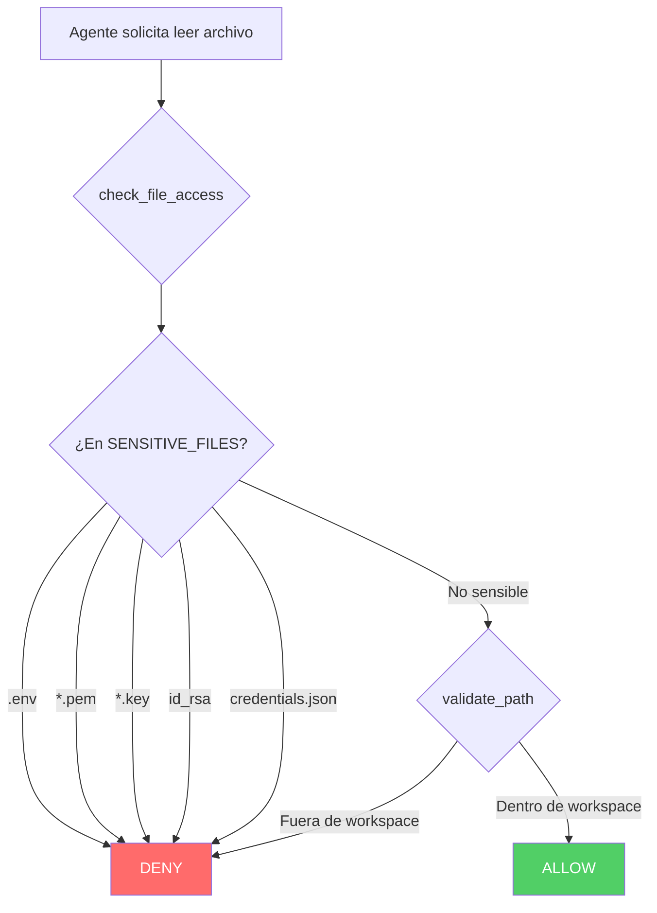
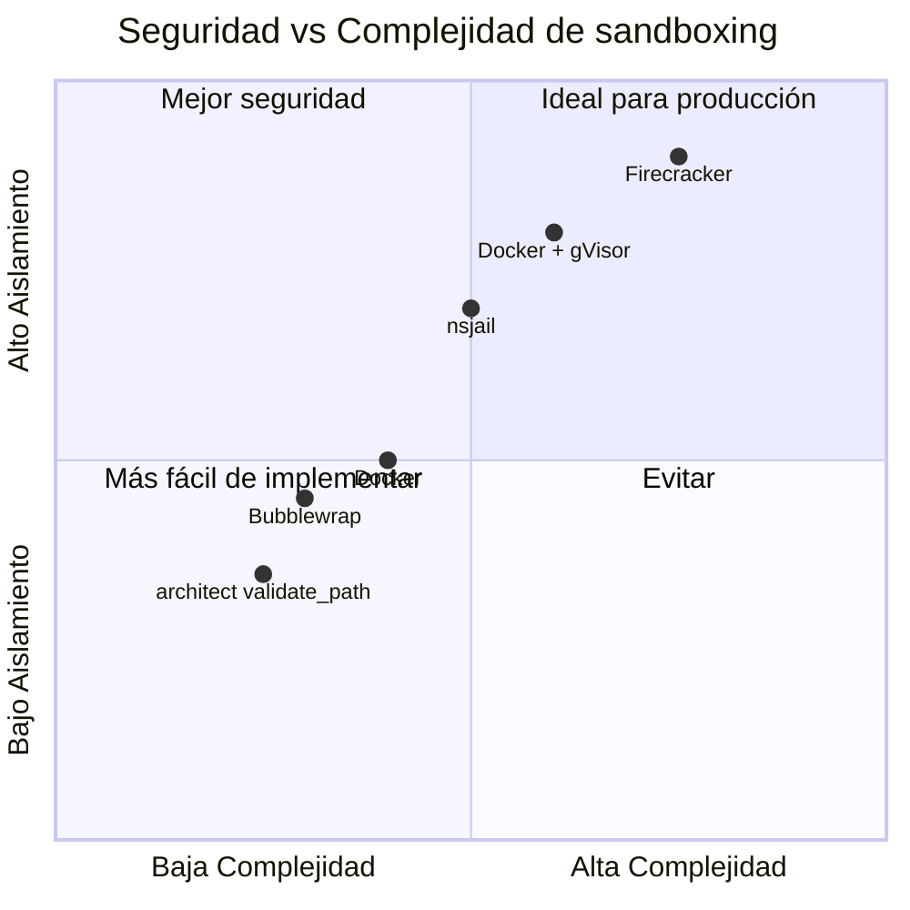

# Sandboxing de Agentes IA

> [!abstract] Resumen
> El *sandboxing* (aislamiento) es una defensa fundamental contra agentes comprometidos. Este documento compara tecnologías de aislamiento: ==contenedores Docker, microVMs (Firecracker), gVisor, nsjail y Bubblewrap==. Se detalla el enfoque de [[architect-overview|architect]]: path sandboxing via `validate_path` (`Path.resolve()` + `is_relative_to()`), command blocklist, git worktrees para aislamiento de procesos, y listas de archivos sensibles. Incluye comparación de seguridad, rendimiento y aplicabilidad para diferentes escenarios de agentes IA.
> ^resumen

---

## Por qué sandboxear agentes

### El principio de mínimo daño

Un agente IA comprometido (via [[prompt-injection-seguridad|prompt injection]], bug, o comportamiento emergente) puede causar daño proporcional a sus permisos. El sandboxing ==limita el radio de explosión== de un compromiso.

> [!danger] Sin sandboxing
> Un agente con acceso completo al sistema puede:
> - Leer/modificar cualquier archivo (credenciales, código fuente, datos)
> - Ejecutar cualquier comando (reverse shells, cryptominers, destructores)
> - Acceder a la red sin restricciones (exfiltración, lateral movement)
> - Escalar privilegios si ejecuta como root



---

## Tecnologías de aislamiento

### Comparación general

| Tecnología | Nivel de aislamiento | Overhead | Complejidad | Caso de uso |
|------------|---------------------|----------|-------------|-------------|
| chroot | Bajo | ==Mínimo== | Baja | Legacy, no recomendado |
| ==Docker== | Medio | Bajo (~2%) | Media | ==Más común== |
| Podman | Medio (rootless) | Bajo | Media | Docker sin daemon root |
| ==gVisor== | Alto | Medio (~10%) | Alta | Cargas no confiables |
| ==Firecracker== | ==Muy alto== | Medio (~5%) | Alta | Aislamiento fuerte + rendimiento |
| Kata Containers | Muy alto | Alto | Alta | Kubernetes + seguridad |
| nsjail | Alto | Bajo | Media | Sandboxing de procesos |
| Bubblewrap | Medio-Alto | ==Mínimo== | Baja | Flatpak, aplicaciones desktop |

### Docker

> [!info] Docker para agentes IA
> Docker proporciona aislamiento a nivel de namespaces del kernel Linux:
> - **PID namespace**: procesos aislados
> - **Network namespace**: red independiente
> - **Mount namespace**: filesystem propio
> - **User namespace**: mapeo de usuarios

> [!example]- Dockerfile para sandbox de agente
> ```dockerfile
> FROM python:3.12-slim
>
> # Usuario no-root
> RUN useradd -m -s /bin/bash agent && \
>     mkdir -p /workspace && \
>     chown agent:agent /workspace
>
> # Instalar dependencias mínimas
> COPY requirements.txt /tmp/
> RUN pip install --no-cache-dir -r /tmp/requirements.txt
>
> # Configurar límites
> USER agent
> WORKDIR /workspace
>
> # Sin acceso a Docker socket
> # Sin acceso a red host
> # Sin capabilities adicionales
>
> CMD ["python", "agent_runner.py"]
> ```

> [!warning] Limitaciones de Docker
> - Los containers comparten el kernel del host
> - Container escapes son posibles (CVE-2024-21626, CVE-2019-5736)
> - El Docker socket es un vector de escalación de privilegios
> - ==No es suficiente para cargas verdaderamente hostiles==

### gVisor

*gVisor* es un kernel de aplicación escrito en Go que ==intercepta system calls del container y las ejecuta en user space==, proporcionando una capa adicional de aislamiento.



> [!success] Ventajas de gVisor para agentes
> - Kernel de aplicación aislado del host kernel
> - Intercepta y filtra ==~380 system calls== (vs ~450+ del kernel Linux)
> - Compatible con Docker (`runsc` runtime)
> - Detecta y bloquea container escapes

> [!tip] Configuración de gVisor con Docker
> ```bash
> # Instalar gVisor runtime
> sudo apt-get install -y runsc
>
> # Ejecutar container con gVisor
> docker run --runtime=runsc \
>   --memory=2g \
>   --cpus=2 \
>   --network=none \
>   --read-only \
>   --tmpfs /tmp:size=100m \
>   agent-sandbox:latest
> ```

### Firecracker

*Firecracker* es el motor de microVMs de AWS (usado en Lambda y Fargate). Proporciona ==aislamiento a nivel de VM con overhead mínimo==.

| Característica | Docker | gVisor | ==Firecracker== |
|---------------|--------|--------|--------------|
| Boot time | ~100ms | ~200ms | ==~125ms== |
| Memory overhead | ~10MB | ~50MB | ~5MB |
| Aislamiento | Namespace | User-space kernel | ==VM completa== |
| Container escape | Posible | Muy difícil | ==Requiere hypervisor escape== |
| Compatibilidad | Alta | Media | Baja (necesita kernel) |

### nsjail

> [!info] nsjail para sandboxing ligero
> *nsjail* es un sandbox de procesos que combina namespaces, seccomp-bpf y cgroups para aislar procesos individuales. Ideal para ==sandboxear la ejecución de comandos individuales== de un agente.

> [!example]- Configuración de nsjail para comandos de agente
> ```protobuf
> // nsjail.cfg para ejecución segura de comandos de agente
> name: "agent-command-sandbox"
>
> mode: ONCE
> hostname: "sandbox"
> time_limit: 30
>
> clone_newnet: true
> clone_newuser: true
> clone_newns: true
> clone_newpid: true
>
> rlimit_as: 512
> rlimit_cpu: 10
> rlimit_fsize: 64
> rlimit_nofile: 32
>
> mount {
>   src: "/workspace"
>   dst: "/workspace"
>   is_bind: true
>   rw: true
> }
>
> mount {
>   src: "/usr"
>   dst: "/usr"
>   is_bind: true
>   rw: false
> }
>
> seccomp_string: "ALLOW {"
> seccomp_string: "  read, write, open, close,"
> seccomp_string: "  stat, fstat, mmap, mprotect,"
> seccomp_string: "  brk, access, execve, exit_group"
> seccomp_string: "}"
> ```

---

## El enfoque de architect

### Path sandboxing

[[architect-overview|architect]] implementa sandboxing a nivel de path usando `validate_path`:

> [!success] validate_path: la defensa de architect
> ```python
> from pathlib import Path
>
> def validate_path(requested_path: str, workspace: Path) -> Path:
>     """
>     Valida que un path esté dentro del workspace.
>     Previene path traversal (CWE-22).
>
>     Usa Path.resolve() para resolver symlinks y ../
>     + is_relative_to() para verificar contención.
>     """
>     resolved = Path(requested_path).resolve()
>
>     if not resolved.is_relative_to(workspace):
>         raise SecurityError(
>             f"Path traversal detected: {requested_path} "
>             f"resolves to {resolved}, outside {workspace}"
>         )
>
>     return resolved
> ```

### Command blocklist

> [!danger] Comandos bloqueados por architect
> ```python
> COMMAND_BLOCKLIST = [
>     "rm -rf",           # Destrucción masiva de archivos
>     "sudo",             # Escalación de privilegios
>     "chmod 777",        # Permisos inseguros
>     "curl|bash",        # Ejecución remota de código
>     "wget|sh",          # Ejecución remota de código
>     "curl|sh",          # Ejecución remota de código
>     "eval",             # Ejecución dinámica
>     "> /dev/sda",       # Destrucción de disco
>     "mkfs",             # Formateo de disco
>     "dd if=/dev",       # Operaciones de disco peligrosas
> ]
> ```

### Git worktrees para aislamiento de procesos

> [!tip] Git worktrees como sandbox
> architect usa *git worktrees* para crear copias de trabajo aisladas donde cada agente opera en su propio directorio:
>
> ```bash
> # Crear worktree aislado para el agente
> git worktree add /tmp/agent-workspace-$(uuid) main
>
> # El agente trabaja solo en su worktree
> # validate_path confina al worktree
> # Cambios se revisan antes de merge
>
> # Limpiar al finalizar
> git worktree remove /tmp/agent-workspace-$(uuid)
> ```
>
> Ventajas:
> - Cada agente tiene su copia de trabajo independiente
> - Cambios pueden ser revisados via `git diff` antes de merge
> - No hay conflictos entre agentes concurrentes
> - Fácil rollback: simplemente eliminar el worktree

### Protección de archivos sensibles



---

## Aislamiento de red

### Network policies para agentes

> [!warning] El riesgo de acceso a red
> Un agente con acceso a red sin restricciones puede:
> - Exfiltrar datos ([[data-exfiltration-agents]])
> - Descargar y ejecutar malware
> - Atacar sistemas internos (lateral movement)
> - Comunicarse con C2 (Command & Control)

### Estrategias de aislamiento de red

| Estrategia | Implementación | Nivel |
|------------|----------------|-------|
| ==Sin red== | `--network=none` en Docker | Máximo |
| Solo localhost | iptables/nftables rules | Alto |
| Allowlist de dominios | Proxy con allowlist | ==Recomendado== |
| Egress filtering | Firewall de salida | Medio |
| DNS filtering | DNS resolver con blocklist | Medio |

> [!example]- Configuración de red mínima para agente
> ```bash
> # Docker sin red
> docker run --network=none agent:latest
>
> # Docker con red restringida
> docker network create --internal agent-net
> docker run --network=agent-net agent:latest
>
> # Con proxy allowlist (iptables)
> iptables -A OUTPUT -m owner --uid-owner agent \
>   -d pypi.org -p tcp --dport 443 -j ACCEPT
> iptables -A OUTPUT -m owner --uid-owner agent \
>   -d registry.npmjs.org -p tcp --dport 443 -j ACCEPT
> iptables -A OUTPUT -m owner --uid-owner agent -j DROP
> ```

---

## Restricciones de filesystem

### Filesystem de solo lectura

> [!tip] Read-only root filesystem
> ```bash
> docker run \
>   --read-only \
>   --tmpfs /tmp:size=100m,noexec \
>   --tmpfs /workspace:size=500m \
>   -v /data/input:/input:ro \
>   agent:latest
> ```
>
> - Root filesystem de solo lectura
> - `/tmp` y `/workspace` como tmpfs con límites de tamaño
> - Input de datos como volumen de solo lectura

### Seccomp profiles

> [!example]- Perfil seccomp restrictivo para agentes
> ```json
> {
>   "defaultAction": "SCMP_ACT_ERRNO",
>   "syscalls": [
>     {
>       "names": [
>         "read", "write", "open", "close",
>         "stat", "fstat", "lstat",
>         "poll", "lseek", "mmap",
>         "mprotect", "munmap", "brk",
>         "access", "pipe", "dup", "dup2",
>         "clone", "fork", "execve",
>         "exit", "exit_group",
>         "getpid", "getuid", "getgid",
>         "openat", "readlinkat"
>       ],
>       "action": "SCMP_ACT_ALLOW"
>     }
>   ]
> }
> ```

---

## Comparación de enfoques para agentes IA



> [!question] ¿Qué enfoque elegir?
> - **Desarrollo local**: architect `validate_path` + command blocklist (mínimo overhead)
> - **CI/CD**: Docker con perfil seccomp restrictivo
> - **Producción standard**: Docker + gVisor
> - **Alta seguridad**: Firecracker microVMs
> - **Ejecución de comandos unitarios**: nsjail

---

## Relación con el ecosistema

- **[[intake-overview]]**: intake opera antes del sandbox, validando las entradas que determinarán qué acciones el agente intentará dentro del sandbox. Una buena validación en intake reduce la presión sobre el sandboxing.
- **[[architect-overview]]**: architect implementa el sandboxing a nivel de aplicación documentado en esta nota: validate_path para contención de filesystem, command blocklist para restricción de comandos, sensitive_files para protección de credenciales y git worktrees para aislamiento de procesos.
- **[[vigil-overview]]**: vigil complementa el sandboxing escaneando el código generado dentro del sandbox antes de que salga del entorno aislado, detectando vulnerabilidades que el sandbox no puede prevenir (como código inseguro que se desplegará fuera del sandbox).
- **[[licit-overview]]**: licit audita la configuración del sandbox, verificando que cumple con requisitos regulatorios y que las restricciones aplicadas son adecuadas según la clasificación de riesgo del EU AI Act.

---

## Enlaces y referencias

> [!quote]- Bibliografía
> - Google. (2024). "gVisor Documentation." https://gvisor.dev/docs/
> - AWS. (2024). "Firecracker Design." https://firecracker-microvm.github.io/
> - Google. (2024). "nsjail Documentation." https://nsjail.dev/
> - Docker. (2024). "Docker Security Best Practices." https://docs.docker.com/engine/security/
> - Anjali, S. et al. (2023). "Container Security: Fundamental Technology Concepts that Protect Containerized Applications." O'Reilly.
> - NIST. (2024). "Application Container Security Guide." SP 800-190.

[^1]: La elección de tecnología de sandboxing depende del modelo de amenazas: para agentes en desarrollo, validate_path es suficiente; para producción con agentes no confiables, se necesita Firecracker.
